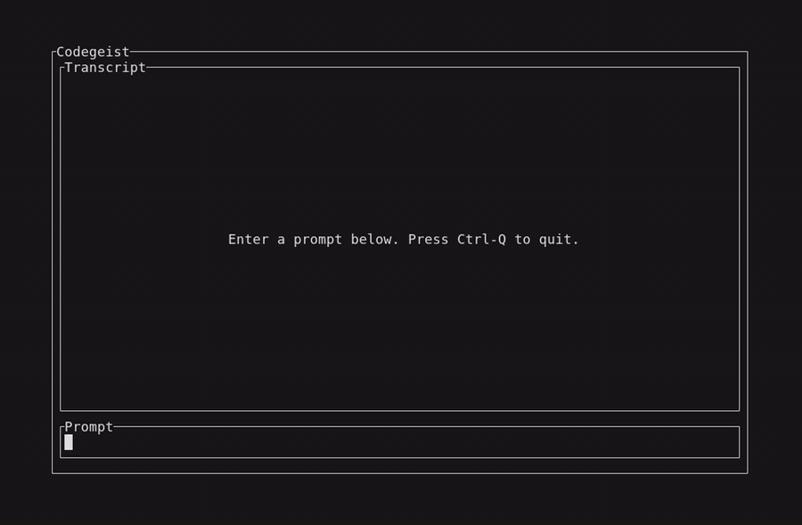

# codegeist.ai

`codegeist.ai` is a customizable coding agent for the CLI, TUI, and web.

It is being built with a strong focus on customization, adaptable workflows,
and project-local control over behavior, prompts, and developer tooling.

<p align="center">
  <a href="https://codegeist.ai"></a>
  <a href="https://x.com/codegeist_ai"></a>
  <a href="https://www.youtube.com/@codegeist_ai"></a>
  <a href="https://discord.gg/nh7XUkmsW7"></a>
</p>

## Demo

[](https://youtu.be/pEnjYSGHeQ8)

Watch the Ubuntu contributor setup tutorial on YouTube: <https://youtu.be/pEnjYSGHeQ8>



Use GitHub for code, issues, roadmap, and durable technical decisions. Use
Discord for quick developer help, feedback, and sharing Codegeist workflows.

## Vision

- Provide one coding agent experience across CLI, TUI, and web surfaces.
- Make workflows, prompts, and behavior easy to adapt per project.
- Keep configuration and automation close to the repository instead of hiding
  them behind fixed defaults.

## Current Scope

The repository now contains the first runnable application bootstrap for that
vision:

- a compose-based devcontainer setup mounted from the `.devcontainer/` submodule
- a Spring Boot CLI application under `app/codegeist/cli` built in the devcontainer with Java 25 and GraalVM Community 25
- Spring Shell commands for `--version`, direct `codegeist.yml` `--show-config`,
  resumable `ask -c/--continue`, and a minimal `tui` chat loop
- direct `codegeist.yml` parsing for typed `provider:` entries and the first
  `mcp:` client catalog shape
- `.codegeist/session.json` persistence for multiple local sessions, chat text, and
  bounded tool activity
- a Codegeist-owned model/tool/model loop with prompt-scoped local
  read/list/glob/grep/write/exact-edit/shell callbacks plus lazy MCP callback bridging
  for configured `stdio` and `streamable_http` clients
- a native VHS-recorded TUI hello-world smoke that verifies write and shell tool
  previews, workspace side effects, session state, and MP4/WebM evidence
- a GraalVM native-image Maven profile and local native smoke check
- local Linux, Windows, and Docker-backed MCP remote smoke scripts under
  `scripts/tests/`
- a GitHub Actions release workflow for branch validation, pre-tag validation,
  tag-triggered published releases, checksums, and Linux/Windows/macOS native
  plus install-script smokes
- repo-local agent workflow rules, commands, and configuration
- lightweight project memory in `docs/memory-bank/chat.md`

## Development Environment

The checked-in devcontainer is the current development workspace.

Key properties:

- custom Docker image and entrypoint
- Docker available inside the workspace container
- Node.js, Python, GitHub CLI, and supporting CLI tooling
- an `.opencode/` submodule that tracks the agent kit `release` branch
- a `.devcontainer/` submodule that tracks the devcontainer kit `release` branch
- local runtime values in `.codegeist/.local.env`, generated from the kit example
  when missing and ignored by Git
- optional repository-specific Compose and image extensions under `.codegeist/`;
  the default contributor workspace does not require a GPU extension

## Repository Layout

- `.devcontainer/` - development container image and runtime setup from `codegeist-devcontainer-kit`
- `app/codegeist/cli/` - Spring Boot CLI bootstrap application, Maven project files, and local `Taskfile.yml`
- `scripts/install/` - curl-downloadable release install scripts for Linux,
  macOS, and Windows
- `scripts/tests/` - local Linux, Windows QEMU, native, MCP remote, and final smoke-suite scripts
- `docs/memory-bank/chat.md` - lightweight project memory for the repository
- `README.md` - project overview

## Application Bootstrap

The first application milestone is an executable Spring Boot jar that can be
built and started inside `app/codegeist/cli/` with:

```bash
task run
```

From the repository root, the equivalent command is:

```bash
task -t app/codegeist/cli/Taskfile.yml run
```

To build a GraalVM native executable instead, use:

```bash
task native
```

From the repository root:

```bash
task -t app/codegeist/cli/Taskfile.yml native
```

What this does:

1. builds `app/codegeist/cli/target/codegeist.jar`
2. starts the Spring Shell application
3. runs the current noninteractive command path

The native build writes the executable to `app/codegeist/cli/target/codegeist`.

Implementation notes:

- build and run happen directly in the devcontainer with the installed Java 25
  GraalVM toolchain and system Maven
- Java 25 is the current project baseline
- the Maven build includes a `native` profile with the GraalVM native build tools
- the application implements Spring Shell commands such as `--version`,
  `--show-config`, `ask`, and `tui`
- `application.yaml` is only Spring Boot/Shell configuration; Codegeist runtime
  config is loaded from explicit `codegeist.yml` paths

## Local Smoke Tests

Local smoke scripts live under `scripts/tests/`. The primary smoke logic is
implemented in PowerShell 7 (`*.ps1`) so Linux, Windows, MCP, and final-suite
orchestration use the same helper code. Bash scripts under `scripts/tests/` own
QEMU VM lifecycle and host-side SSH/asset-server orchestration when that is the
smallest practical tool for the platform smoke.

Run the local Linux smoke from the repository root:

```bash
pwsh -NoProfile -File scripts/tests/local-linux-smoke.ps1
```

`task cli:test` starts a local Ollama container by default. To reuse an Ollama
service that already runs outside the workspace container, set its base URL and
the model that must already exist on that service:

```bash
OLLAMA_EXTERNAL_URL=http://10.0.2.2:11434 \
  OLLAMA_MODEL=llama3.2:1b \
  task cli:test
```

External mode verifies the Ollama API and selected model without starting or
modifying a local Ollama container. The `10.0.2.2` address is the QEMU user-mode
network host address; use the appropriate reachable URL in other environments.

Run the Docker-backed MCP `streamable_http` smoke from `app/codegeist/cli`:

```bash
task mcp-remote-smoke
```

Run the final local smoke suite:

```bash
pwsh -NoProfile -File scripts/tests/final-smoke-suite.ps1
```

The final suite requires Linux and Windows to pass by default. It downloads the
official Windows Server Evaluation ISO when needed, creates or starts the local
Windows QEMU VM, and fails if download, VM, or smoke prerequisites fail.

For developer-only runs that may skip missing platform prerequisites, use:

```bash
pwsh -NoProfile -File scripts/tests/final-smoke-suite.ps1 -AllowSkips
```

The Windows smoke path uses a local Windows QEMU VM over SSH and includes native
archive plus Windows install-script smoke. See
`docs/developer/release/windows-qemu-smoke.md` for the detailed VM lifecycle, ISO,
toolchain, artifact, installer, and troubleshooting guide.

The MCP remote smoke starts a deterministic local Docker fixture, verifies the real
`streamable_http` callback path directly, then starts local Ollama and verifies that
`ask` can make the model invoke the remote MCP tool. It stays outside the default
`task test` path.

Native release downloads are planned as platform archives, not true single-file
executables. See `docs/developer/release/native-distribution-packaging.md` for the
Linux `tar.gz`, Windows `zip`, sidecar-library, and no-single-executable rationale.

Run the Linux install-script smoke in a fresh Linux QEMU guest from
`app/codegeist/cli`:

```bash
task qemu-linux-install-smoke
```

This opt-in smoke builds the Linux native executable through the Taskfile, serves
local release-shaped assets from the host, has the guest download
`codegeist-install-linux.sh` with `curl`, installs the Linux archive, and checks
`codegeist --version` plus `codegeist --show-config` inside the guest. It is not
part of `final-smoke-suite` by default.

## Install From GitHub Releases

After a release is published, Linux users can install the latest release with:

```bash
curl -fsSL https://github.com/codegeist-ai/codegeist/releases/latest/download/codegeist-install-linux.sh | bash
```

macOS users can use the matching macOS script:

```bash
curl -fsSL https://github.com/codegeist-ai/codegeist/releases/latest/download/codegeist-install-macos.sh | bash
```

Windows users can download and run the PowerShell script:

```powershell
curl.exe -fsSL -o codegeist-install-windows.ps1 https://github.com/codegeist-ai/codegeist/releases/latest/download/codegeist-install-windows.ps1
pwsh -NoProfile -ExecutionPolicy Bypass -File .\codegeist-install-windows.ps1
```

The scripts download `SHA256SUMS.txt`, verify the matching native archive, install
the complete archive contents under a user-local directory, and print the PATH
directory that exposes the `codegeist` command. Set `CODEGEIST_INSTALL_BASE_URL` to
install from another release asset location, such as a local smoke-test server.

See `docs/user/install-from-github-releases.md` for install locations, overrides,
update behavior, and current Linux/Windows/macOS verification status.

## GitHub Release Build

The GitHub release workflow lives at `.github/workflows/release.yml`.

It validates release artifacts on GitHub-hosted runners:

- `codegeist-jvm.jar`
- `codegeist-linux-x64.tar.gz`
- `codegeist-windows-x64.zip`
- `codegeist-macos-x64.tar.gz`
- `codegeist-install-linux.sh`
- `codegeist-install-macos.sh`
- `codegeist-install-windows.ps1`
- `SHA256SUMS.txt`

The native runner jobs build and smoke the platform archive, then run the matching
install script against local release-shaped assets. This includes
`codegeist-install-macos.sh` on the GitHub-hosted macOS x64 runner.

Release work may start on an unversioned work branch. When the work branch is
ready, run `/codegeist-release --source <release-work-branch> --rc 1`. The command
infers the next SemVer release from the diff between the latest reachable release
tag and the source commit, creates the matching
`release/v<version>-github-release-build` validation branch when needed, creates
one detailed squash-candidate commit, validates the candidate branch, advances
`main` by fast-forward only, runs pre-tag validation, pushes the final `v*` tag
that publishes the GitHub Release, verifies the downloaded checksums, moves
`latest` to the verified release commit, and creates or updates the `latest`
GitHub Release with the same verified assets without running another build.
When `main` already contains the release-ready work and is synchronized with
`origin/main`, `/codegeist-release` can release directly from `main`; it skips the
validation-source and squash-candidate branches to avoid an empty commit, then runs
the same pre-tag, tag, publish, checksum, and `latest` verification path.

See `docs/developer/release/github-release-build.md` for the full operator flow.

## Getting Started

1. Clone the repository with `git clone --recurse-submodules <repo-url>` so the nested `.opencode` and `.devcontainer` checkouts are available from the start.
2. Open the repository root in VS Code and choose `Reopen in Container`, or run
   `devcontainer up --workspace-folder .` from the repository root.
3. Let `.devcontainer/initialize.sh` create `.codegeist/.local.env`,
   `.codegeist/compose.local.yml`, and the generated compose overlay when they are
   missing.
4. Verify that `java -version` and `native-image --version` work inside the workspace.
5. Run `task -t app/codegeist/cli/Taskfile.yml run` from the repo root, or `task run` inside `app/codegeist/cli/`.
6. Run `java -jar app/codegeist/cli/target/codegeist.jar --version` to verify the current command path.

If the repository was cloned without `--recurse-submodules`, Git does not let the
repository force that clone behavior afterward. Run
`git submodule update --init --recursive` before opening the devcontainer.

## Git Worktrees

This repository uses standard Git worktrees under `.worktrees/<branch>`.

Recommended workflow:

1. Keep `main` checked out in the repository root.
2. Open the repository root directly through VS Code Dev Containers.
3. To open a managed worktree, start VS Code or the Dev Containers CLI with
   `BRANCH=<branch>` in the environment. The kit's `initializeCommand` creates
   or reuses `.worktrees/<branch>` and mounts it as `/workspace`.
4. Keep root `.local.env` in the repository root; managed worktrees link back to
   it automatically when `.devcontainer/initialize.sh` prepares them.

The devcontainer kit generates `.devcontainer/.gen.env` and
`.devcontainer/compose.local.gen.yml` on startup. These files keep the container
hostname, user, UID, and GID aligned with the selected checkout without a
repo-local launcher script.

Each worktree uses the `.devcontainer/` files from its own Git state. If you
change the devcontainer setup in the repository root and want the same setup in
an existing worktree, update that worktree to the newer commit first.

If an older checkout is missing nested submodules, initialize them with
`git submodule update --init --recursive` before opening the devcontainer.

## Status

The repository is still early, but it now has a real application entrypoint, a
resumable session store, an owned chat tool loop, a native TUI with completed-tool
previews, local Linux/Windows/MCP/TUI smoke-test entrypoints, and GitHub-hosted
release automation for the current artifact family.
