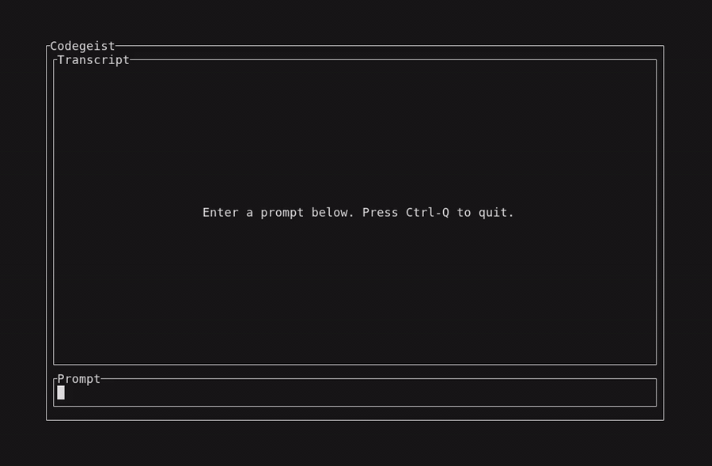

# codegeist.ai

`codegeist.ai` is a customizable coding agent for the CLI, TUI, and web.

It is being built with a strong focus on customization, adaptable workflows,
and project-local control over behavior, prompts, and developer tooling.

<p align="center">
  <a href="https://codegeist.ai"></a>
  <a href="https://x.com/codegeist_ai"></a>
  <a href="https://www.youtube.com/@codegeist_ai"></a>
  <a href="https://discord.gg/nh7XUkmsW7"></a>
</p>

## Demo

[](https://youtu.be/pEnjYSGHeQ8)

Watch the Ubuntu contributor setup tutorial on YouTube: <https://youtu.be/pEnjYSGHeQ8>



Use GitHub for code, [issues](https://github.com/codegeist-ai/codegeist/issues),
the [Codegeist Roadmap](https://github.com/users/codegeist-ai/projects/1), and
durable technical decisions. Use Discord for quick developer help, feedback, and
sharing Codegeist workflows.

## Vision

- Provide one coding agent experience across CLI, TUI, and web surfaces.
- Make workflows, prompts, and behavior easy to adapt per project.
- Keep configuration and automation close to the repository instead of hiding
  them behind fixed defaults.

## Current Scope

The repository now contains the first runnable application bootstrap for that
vision:

- a compose-based devcontainer setup mounted from the `.devcontainer/` submodule
- a Spring Boot CLI application under `app/codegeist/cli` built in the devcontainer with Java 25 and GraalVM Community 25
- Spring Shell commands for `--version`, direct `codegeist.yml` `--show-config`,
  resumable `ask -c/--continue`, and a minimal `tui` chat loop
- direct `codegeist.yml` parsing for typed `provider:` entries and the first
  `mcp:` client catalog shape
- `.codegeist/session.json` persistence for multiple local sessions, chat text, and
  bounded tool activity
- a Codegeist-owned model/tool/model loop with prompt-scoped local
  read/list/glob/grep/write/exact-edit/shell callbacks plus lazy MCP callback bridging
  for configured `stdio` and `streamable_http` clients
- a native VHS-recorded TUI hello-world smoke that verifies write and shell tool
  previews, workspace side effects, session state, and MP4/WebM evidence
- a GraalVM native-image Maven profile and local native smoke check
- a deterministic `task cli:check` contributor gate that tests, packages, and
  smokes the JVM jar without Docker or provider calls
- parser-checked Ollama, OpenAI, and MCP configuration examples under `examples/`
- local Linux, Windows, and Docker-backed MCP remote smoke scripts under
  `scripts/tests/`
- GitHub Actions contributor CI for pull requests and pushes to source `main`
- a GitHub Actions release workflow for branch validation, pre-tag validation,
  tag-triggered published releases, checksums, and Linux/Windows/macOS native
  plus install-script smokes
- repo-local agent workflow rules, commands, and configuration
- lightweight project memory in `docs/memory-bank/chat.md`

## Development Environment

The checked-in devcontainer is the current development workspace. Code changes
start from the source `main` branch; the `release` branches of the shared kits are
generated distribution content, not Codegeist implementation branches.

Key properties:

- custom Docker image and entrypoint
- Docker available inside the workspace container
- Node.js, Python, GitHub CLI, and supporting CLI tooling
- an `.opencode/` submodule that tracks the agent kit `release` branch
- a `.devcontainer/` submodule that tracks the devcontainer kit `release` branch
- local runtime values in `.codegeist/.local.env`, generated from the kit example
  when missing and ignored by Git
- optional repository-specific Compose and image extensions under `.codegeist/`;
  the default contributor workspace does not require a GPU extension
- generated `.devcontainer/.env`, `.devcontainer/Dockerfile.merged.gen`,
  `.devcontainer/compose.local.gen.yml`, and
  `.devcontainer/compose.user.gen.yml` files that should not be edited directly

## Repository Layout

- `.devcontainer/` - development container image and runtime setup from `codegeist-devcontainer-kit`
- `.opencode/` - shared OpenCode commands, rules, skills, and integrations from
  `codegeist-agent-kit`
- `.oc_local/` - tracked Codegeist-specific OpenCode overlays
- `app/codegeist/cli/` - Spring Boot CLI bootstrap application, Maven project files, and local `Taskfile.yml`
- `examples/` - safe parser-checked `codegeist.yml` starting points
- `scripts/install/` - curl-downloadable release install scripts for Linux,
  macOS, and Windows
- `scripts/tests/` - local Linux, Windows QEMU, native, MCP remote, and final smoke-suite scripts
- `docs/tasks/README.md` - local task status and public issue/task linkage guide
- `docs/memory-bank/chat.md` - lightweight project memory for the repository
- `CONTRIBUTING.md` - repository-specific contributor setup and verification
- `LICENSE` - Zero Clause BSD (`0BSD`) terms for Codegeist-owned material
- `README.md` - project overview

## Application Bootstrap

The first application milestone is an executable Spring Boot jar that can be
built and started inside `app/codegeist/cli/` with:

```bash
task run
```

From the repository root, the equivalent command is:

```bash
task cli:run
```

To build a GraalVM native executable instead, use:

```bash
task native
```

From the repository root:

```bash
task cli:native
```

What this does:

1. builds `app/codegeist/cli/target/codegeist.jar`
2. starts the Spring Shell application
3. runs the current noninteractive command path

The native build writes the executable to `app/codegeist/cli/target/codegeist`.

Implementation notes:

- build and run happen directly in the devcontainer with the installed Java 25
  GraalVM toolchain and system Maven
- Java 25 is the current project baseline
- the Maven build includes a `native` profile with the GraalVM native build tools
- the application implements Spring Shell commands such as `--version`,
  `--show-config`, `ask`, and `tui`
- `application.yaml` is only Spring Boot/Shell configuration; Codegeist runtime
  config is loaded from explicit `codegeist.yml` paths

## Contributor Check

Run the canonical normal check from the repository root:

```bash
task cli:check
```

This runs the JVM test suite with provider category `none`, packages
`app/codegeist/cli/target/codegeist.jar`, and invokes the built jar's real
`--version` command with a non-empty-output assertion. The jar carries the root
license at `META-INF/LICENSE`. The check is deterministic and noninteractive,
ignores ambient `TEST` and provider-category values, and does not start Ollama,
use Docker, download a model, read provider credentials, or call a provider.

Use a focused selector without provider setup when iterating:

```bash
task cli:test-jvm TEST=CodegeistExamplesTest
```

Native-image, local/hosted provider, Docker-backed MCP, QEMU, documentation
capture, and release checks are stronger opt-in gates. See
[`CONTRIBUTING.md`](CONTRIBUTING.md) for when to run them.

## Local Smoke Tests

Local smoke scripts live under `scripts/tests/`. The primary smoke logic is
implemented in PowerShell 7 (`*.ps1`) so Linux, Windows, MCP, and final-suite
orchestration use the same helper code. Bash scripts under `scripts/tests/` own
QEMU VM lifecycle and host-side SSH/asset-server orchestration when that is the
smallest practical tool for the platform smoke.

Run the local Linux smoke from the repository root:

```bash
pwsh -NoProfile -File scripts/tests/local-linux-smoke.ps1
```

`task cli:test` starts a local Ollama container by default. To reuse an Ollama
service that already runs outside the workspace container, set its base URL and
the model that must already exist on that service:

```bash
OLLAMA_EXTERNAL_URL=http://10.0.2.2:11434 \
  OLLAMA_MODEL=llama3.2:1b \
  task cli:test
```

External mode verifies the Ollama API and selected model without starting or
modifying a local Ollama container. The `10.0.2.2` address is the QEMU user-mode
network host address; use the appropriate reachable URL in other environments.

Run the Docker-backed MCP `streamable_http` smoke from `app/codegeist/cli`:

```bash
task mcp-remote-smoke
```

Run the final local smoke suite:

```bash
pwsh -NoProfile -File scripts/tests/final-smoke-suite.ps1
```

The final suite requires Linux and Windows to pass by default. It downloads the
official Windows Server Evaluation ISO when needed, creates or starts the local
Windows QEMU VM, and fails if download, VM, or smoke prerequisites fail.

For developer-only runs that may skip missing platform prerequisites, use:

```bash
pwsh -NoProfile -File scripts/tests/final-smoke-suite.ps1 -AllowSkips
```

The Windows smoke path uses a local Windows QEMU VM over SSH and includes native
archive plus Windows install-script smoke. See
`docs/developer/release/windows-qemu-smoke.md` for the detailed VM lifecycle, ISO,
toolchain, artifact, installer, and troubleshooting guide.

The MCP remote smoke starts a deterministic local Docker fixture, verifies the real
`streamable_http` callback path directly, then starts local Ollama and verifies that
`ask` can make the model invoke the remote MCP tool. It stays outside the default
`task cli:check` path.

Native releases use platform archives, not true single-file executables. See
`docs/developer/release/native-distribution-packaging.md` for the
Linux `tar.gz`, Windows `zip`, sidecar-library, and no-single-executable rationale.

Run the Linux install-script smoke in a fresh Linux QEMU guest from
`app/codegeist/cli`:

```bash
task qemu-linux-install-smoke
```

This opt-in smoke builds the Linux native executable through the Taskfile, serves
local release-shaped assets from the host, has the guest download
`codegeist-install-linux.sh` with `curl`, installs the Linux archive, and checks
`codegeist --version` plus `codegeist --show-config` inside the guest. It is not
part of `final-smoke-suite` by default.

## Install From GitHub Releases

After a release is published, Linux users can install the latest release with:

```bash
curl -fsSL https://github.com/codegeist-ai/codegeist/releases/latest/download/codegeist-install-linux.sh | bash
```

macOS users can use the matching macOS script:

```bash
curl -fsSL https://github.com/codegeist-ai/codegeist/releases/latest/download/codegeist-install-macos.sh | bash
```

Windows users can download and run the PowerShell script:

```powershell
curl.exe -fsSL -o codegeist-install-windows.ps1 https://github.com/codegeist-ai/codegeist/releases/latest/download/codegeist-install-windows.ps1
pwsh -NoProfile -ExecutionPolicy Bypass -File .\codegeist-install-windows.ps1
```

The scripts download `SHA256SUMS.txt`, verify the matching native archive, install
the complete archive contents under a user-local directory, and print the PATH
directory that exposes the `codegeist` command. Set `CODEGEIST_INSTALL_BASE_URL` to
install from another release asset location, such as a local smoke-test server.

See `docs/user/install-from-github-releases.md` for install locations, overrides,
update behavior, and current Linux/Windows/macOS verification status.

## GitHub Release Build

The GitHub release workflow lives at `.github/workflows/release.yml`.

It validates release artifacts on GitHub-hosted runners:

- `codegeist-jvm.jar`
- `codegeist-linux-x64.tar.gz`
- `codegeist-windows-x64.zip`
- `codegeist-macos-x64.tar.gz`
- `codegeist-install-linux.sh`
- `codegeist-install-macos.sh`
- `codegeist-install-windows.ps1`
- `LICENSE`
- `SHA256SUMS.txt`

The native runner jobs build and smoke the platform archive, including an exact
copy of the root `LICENSE`, then run the matching install script against local
release-shaped assets. This includes
`codegeist-install-macos.sh` on the GitHub-hosted macOS x64 runner.

Release work may start on an unversioned work branch. When the work branch is
ready, run `/codegeist-release --source <release-work-branch> --rc 1`. The command
infers the next SemVer release from the diff between the latest reachable release
tag and the source commit, creates the matching
`release/v<version>-github-release-build` validation branch when needed, creates
one detailed squash-candidate commit, validates the candidate branch, advances
`main` by fast-forward only, runs pre-tag validation, pushes the final `v*` tag
that publishes the GitHub Release, verifies the downloaded checksums, moves
`latest` to the verified release commit, and creates or updates the `latest`
GitHub Release with the same verified assets without running another build.
When `main` already contains the release-ready work and is synchronized with
`origin/main`, `/codegeist-release` can release directly from `main`; it skips the
validation-source and squash-candidate branches to avoid an empty commit, then runs
the same pre-tag, tag, publish, checksum, and `latest` verification path.

See `docs/developer/release/github-release-build.md` for the full operator flow.

## Getting Started

Host prerequisites are Git, Docker, and either VS Code with Dev Containers or the
Dev Containers CLI. Ordinary contributors need only the two shared workspace
submodules; recursively initializing the large `docs/third-party/*/source`
research references is unnecessary.

```bash
git clone https://github.com/codegeist-ai/codegeist.git
cd codegeist
git submodule update --init .devcontainer .opencode
devcontainer up --workspace-folder .
devcontainer exec --workspace-folder . task cli:check
devcontainer exec --workspace-folder . task cli:run -- --version
```

VS Code users can open the repository root and choose `Reopen in Container`
instead of running `devcontainer up`; from a terminal in that container, run
`task cli:check` and `task cli:run -- --version` directly. During startup,
`.devcontainer/initialize.sh` creates `.codegeist/.local.env`, local worktree and
OpenCode directories when needed, and ignored generated files under
`.devcontainer/`. It does not create an optional
`.codegeist/compose.local.yml` or `.codegeist/Dockerfile`; add either only for an
intentional local/repository override.

## Git Worktrees

This repository uses standard Git worktrees under `.worktrees/<branch>`.

Recommended workflow:

1. Keep `main` checked out in the repository root.
2. Open the repository root directly through VS Code Dev Containers.
3. To open a managed worktree, start VS Code or the Dev Containers CLI with
   `BRANCH=<branch>` in the environment. The kit's `initializeCommand` creates
   or reuses `.worktrees/<branch>` and mounts the selected checkout at its
   host-matching absolute path inside the container.
4. Keep `.codegeist/.local.env` in the repository root; managed worktrees link
   back to it automatically when `.devcontainer/initialize.sh` prepares them.

The devcontainer kit generates `.devcontainer/.env`,
`.devcontainer/Dockerfile.merged.gen`,
`.devcontainer/compose.local.gen.yml`, and
`.devcontainer/compose.user.gen.yml` on startup. These files keep the container
hostname, user, UID, GID, workspace, image extension, and optional Compose bridge
aligned with the selected checkout without a repo-local launcher script.

Each worktree uses the `.devcontainer/` files from its own Git state. If you
change the devcontainer setup in the repository root and want the same setup in
an existing worktree, update that worktree to the newer commit first.

If an older checkout is missing the workspace submodules, initialize only
`.devcontainer` and `.opencode` with
`git submodule update --init .devcontainer .opencode` before opening the
devcontainer.

## Configuration And Trust

Safe starting points for the current direct `codegeist.yml` parser are in
[`examples/`](examples/). The examples are parser-tested without opening provider
or MCP connections and contain no usable credentials.

Review local configuration before running provider-backed commands:

- Codegeist evaluates `#{...}` string values in trusted local YAML with an
  unrestricted Spring SpEL context.
- `--show-config` prints configured values without secret redaction.
- Local tools can read, write, edit, and run host processes. Current workspace
  settings and path checks do not provide a sandbox or permission-prompt system.
- MCP stdio configuration can launch child processes, and package-runner commands
  can download dependencies.

Do not put credentials in tracked examples, issues, pull requests, logs, or
configuration output.

## Contributing And Community

Start with [`CONTRIBUTING.md`](CONTRIBUTING.md) for Java/core ownership, selective
workspace setup, checks, and pull-request expectations. Public work is discovered
and discussed in [Issues](https://github.com/codegeist-ai/codegeist/issues), with
cross-repository planning in the
[Codegeist Roadmap](https://github.com/users/codegeist-ai/projects/1). The
[`docs/tasks/README.md`](docs/tasks/README.md) guide explains how accepted issues
link to canonical local task specifications; historical tasks are not automatically
ready work.

The T010 rollout targets these account-wide policy locations:
[Code of Conduct](https://github.com/codegeist-ai/.github/blob/main/CODE_OF_CONDUCT.md),
[Security Policy](https://github.com/codegeist-ai/.github/blob/main/SECURITY.md),
and [Support Guide](https://github.com/codegeist-ai/.github/blob/main/SUPPORT.md).
Repository-specific contribution details live here; the shared policies are not
duplicated locally. T010 remains open until the shared files and related GitHub
settings are published. Never report vulnerabilities through a public issue.

Codegeist-owned source and documentation are available under the
[Zero Clause BSD License (`0BSD`)](LICENSE). Contributions are accepted under the
same terms without a CLA or DCO requirement; third-party licenses and notices keep
their original terms.

## Status

The repository is still early, but it now has a real application entrypoint, a
resumable session store, an owned chat tool loop, a native TUI with completed-tool
previews, local Linux/Windows/MCP/TUI smoke-test entrypoints, and GitHub-hosted
release automation for the current artifact family.
