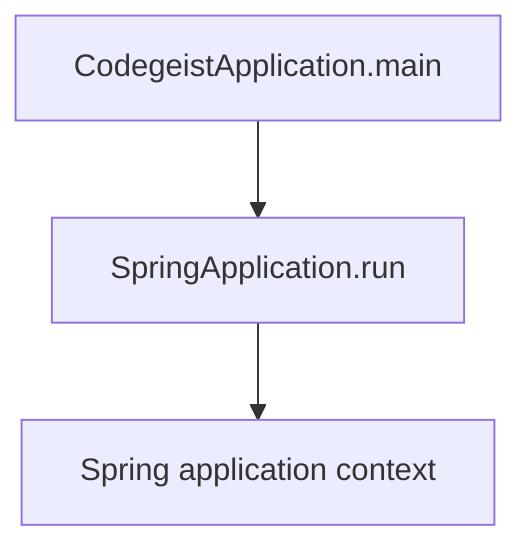
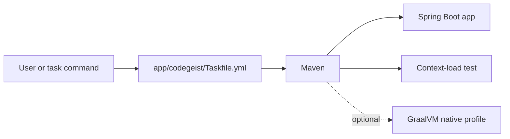
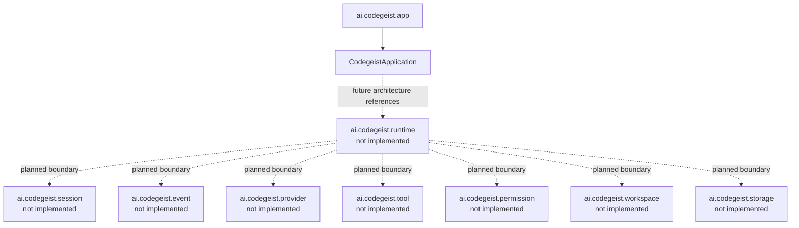
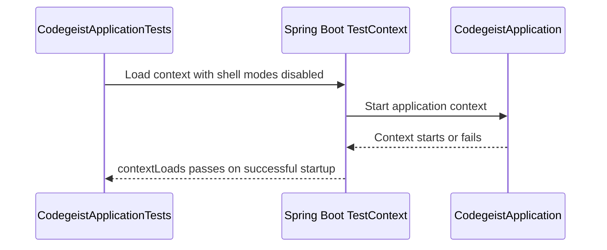
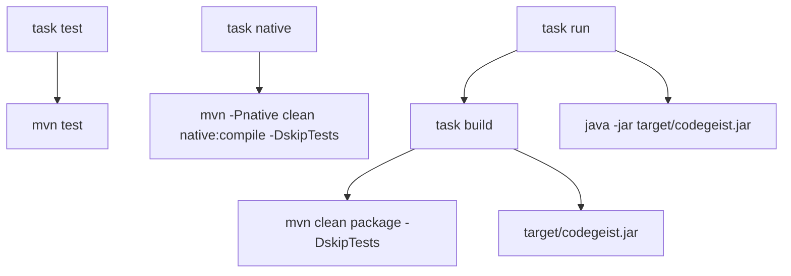

# Codegeist Architecture

Current-state architecture overview for coding agents and contributors.

## Scope

This document describes the system that exists in this repository now. It is not
the target architecture, the OpenCode parity plan, or an implementation backlog.
Use it as the compact current-state map before changing Codegeist source,
configuration, build, or verification behavior.

For target architecture and future design decisions, see
`docs/developer/codegeist-opencode-parity.md`.

## Current System State

Codegeist currently contains one Java/Spring Boot application under
`app/codegeist`. The implemented runtime behavior is limited to Spring Boot
application startup. Spring Shell is present as a dependency and configuration
surface, but no shell commands are implemented yet.

The repository also contains planning documentation for a broader coding-agent
runtime. Those future runtime, session, event, provider, tool, permission,
workspace, storage, extension, server, and UI concepts are not implemented in the
application code yet.

## Build Baseline

The current application build is defined by `app/codegeist/pom.xml`.

| Area | Current state |
| --- | --- |
| Module shape | Single Maven module under `app/codegeist` |
| Group/artifact | `ai.codegeist:codegeist` |
| Java | `25` through `java.version` and `maven.compiler.release` |
| Spring Boot | Parent `spring-boot-starter-parent` `3.5.14` |
| Spring Shell | BOM `3.4.2`, dependency `spring-shell-starter` |
| Spring AI | BOM `1.1.6` imported for dependency management only |
| GraalVM | Native Maven profile using `native-maven-plugin` `0.10.6` |
| Packaging | Spring Boot executable jar named `target/codegeist.jar` |
| Tests | Spring Boot context-load test only |

Spring AI provider starters are not present. The BOM import only records the
dependency-management posture for later provider work.

## Implemented File Layout

```text
app/codegeist/
  pom.xml
  Taskfile.yml
  src/main/java/ai/codegeist/app/CodegeistApplication.java
  src/main/resources/application.yaml
  src/test/java/ai/codegeist/app/CodegeistApplicationTests.java
```

Implemented Java package:

| Package | Current responsibility |
| --- | --- |
| `ai.codegeist.app` | Spring Boot application entrypoint and bootstrap wiring |

No other `ai.codegeist.*` application packages currently exist in source code.

## Application Entrypoint

`CodegeistApplication` is the only implemented application class. It is annotated
with `@SpringBootApplication` and delegates startup to `SpringApplication.run`.



## Runtime Components

The current implemented component graph is intentionally small.



Current behavior:

- `task run` builds the jar and runs `java -jar target/codegeist.jar`.
- The app starts a Spring Boot context using `application.yaml`.
- `application.yaml` sets `spring.application.name` to `codegeist` and enables
  interactive Spring Shell.
- There are no implemented shell commands, runtime services, provider calls, tool
  executions, permission prompts, workspace policies, storage adapters, server
  endpoints, Vaadin views, PF4J plugins, or JBang execution paths.

## Current Package Boundary



The dotted nodes are planned architecture concepts documented elsewhere. They are
included here only to prevent coding agents from assuming those packages already
exist.

## Test Architecture

`CodegeistApplicationTests` is a Spring Boot context-load test. It disables
Spring Shell interactive and noninteractive modes for the test context so the
bootstrap can be verified without starting an interactive shell.



The test does not verify CLI commands, runtime behavior, provider integration,
native-image compatibility, or packaging output.

## Taskfile Verification Flow

`app/codegeist/Taskfile.yml` provides the current developer entrypoints.

| Task | Command | Proves |
| --- | --- | --- |
| `task test` | `mvn --batch-mode --no-transfer-progress test` | Maven test lifecycle and Spring context-load test |
| `task build` | `mvn --batch-mode --no-transfer-progress -DskipTests clean package` | Executable jar packaging |
| `task native` | `mvn --batch-mode --no-transfer-progress -DskipTests -Pnative clean native:compile` | GraalVM native posture when practical |
| `task run` | `java -jar target/codegeist.jar` after `build` | Starts the packaged Spring Boot application |



## Configuration

`app/codegeist/src/main/resources/application.yaml` currently contains only the
application name and Spring Shell interactive setting:

```yaml
spring:
  application:
    name: codegeist
  shell:
    interactive:
      enabled: true
```

No provider credentials, model configuration, workspace roots, permission policy,
storage locations, extension configuration, server configuration, or Vaadin
configuration are implemented.

## Not Implemented Yet

The following concepts are planned or discussed in architecture tasks, but they
are not implemented in the current Java application:

- Runtime orchestration.
- Session domain model.
- Runtime event model.
- Agent modes such as Plan and Build.
- Context loading from rules, memory, tasks, docs, source, or analysis artifacts.
- Spring AI provider adapter or model calls.
- Tool registry or tool execution.
- Permission approval flow.
- Workspace and file-access policy.
- Patch/edit proposal flow.
- Controlled shell execution.
- Storage ports or adapters.
- CLI/Spring Shell commands.
- Headless server endpoints.
- Vaadin client.
- PF4J plugin loading.
- JBang extension execution.

When implementing any of these concepts, update this document in the same task so
future coding agents can distinguish current code from future architecture.

## Related Documents

- `docs/developer/codegeist-opencode-parity.md` records target architecture,
  OpenCode parity mapping, planned boundaries, MVP cut, risks, and backlog.
- `docs/tasks/T002_implement-codegeist-mvp-foundation/` contains active
  implementation tasks for moving from the current bootstrap toward the MVP
  foundation.
- `.oc_local/rules/architecture-doc.md` defines how this current-state
  architecture document should be used and maintained.
