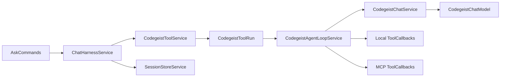
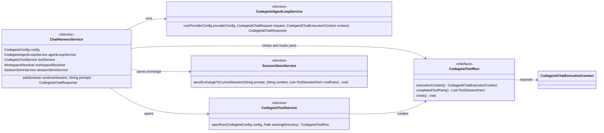
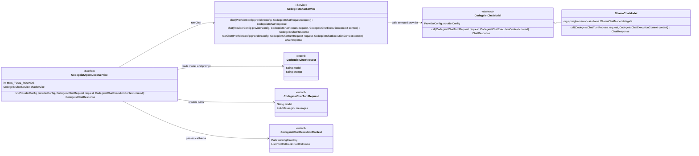
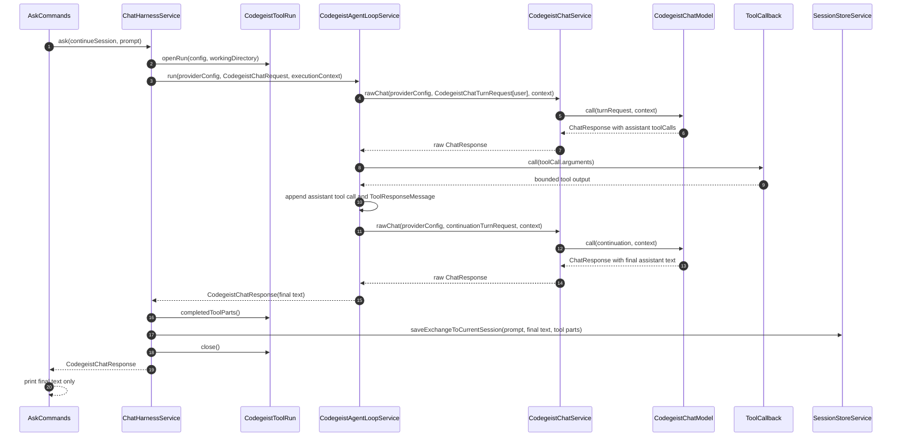
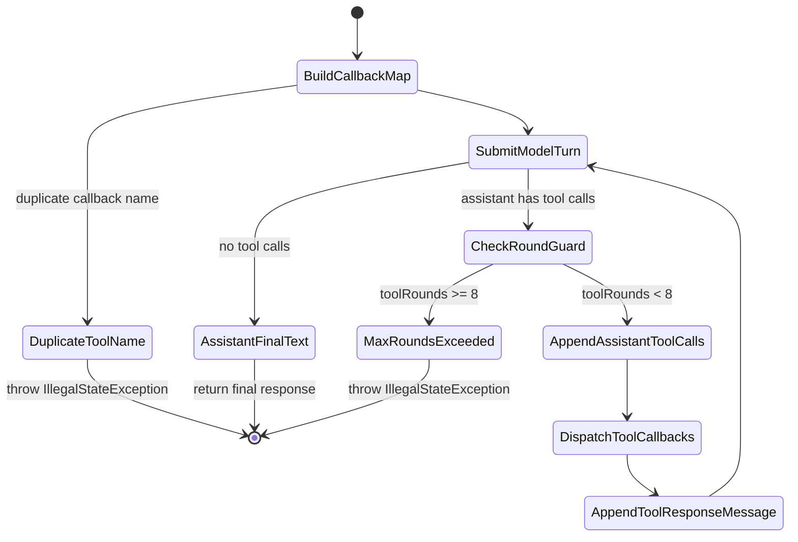
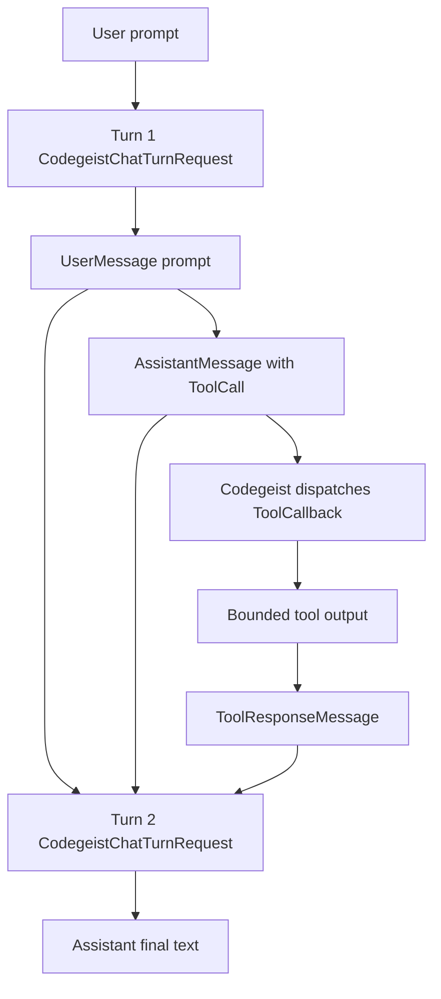
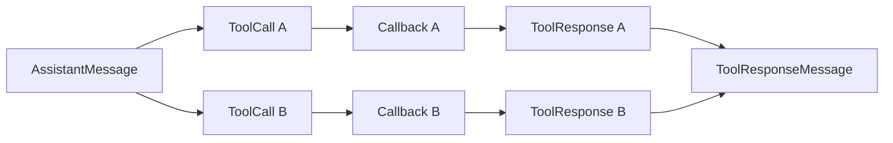

# Agent Control Loop

Current-state source-code documentation for the implemented Codegeist-owned
model/tool/model control loop under `ai.codegeist.app.chat`.

## Scope

This document describes the first synchronous agent loop used by the `ask` command.
The loop owns observable tool dispatch and model continuation while reusing the
existing provider config, prompt-scoped tool callbacks, and session-store exchange
path.

This document does not describe streaming UI events, permission prompts, subagents,
skills, background workers, a server runtime, or provider-specific planning logic.
Those behaviors are not implemented in this slice.

## Vocabulary

| Term | Meaning in the current implementation |
| --- | --- |
| Chat request | The command-facing `CodegeistChatRequest(model, prompt)` created by `ChatHarnessService`. It intentionally carries only the selected runtime model and the current user prompt. |
| Turn request | The internal `CodegeistChatTurnRequest(model, messages)` sent to a provider model for one model call. It can contain user, assistant, and tool-result messages. |
| Tool callback | A Spring AI `ToolCallback` exposed through `CodegeistChatExecutionContext`. Local `codegeist_*` tools and MCP server tools are both callbacks at this boundary. |
| Tool run | The closeable `CodegeistToolRun` opened by `CodegeistToolService` for one prompt request. It owns callback exposure, ordered `ToolSessionPart` recording, and MCP resource cleanup. |
| Tool round | One loop iteration where the assistant returned at least one tool call, Codegeist dispatched those calls, and a `ToolResponseMessage` was appended for the next provider turn. |

The practical distinction is that `CodegeistChatRequest` represents what the user
asked Codegeist to do, while `CodegeistChatTurnRequest` represents one provider call
inside the loop.

## Current Status

`ChatHarnessService.ask(...)` still owns the command-facing boundary for one prompt.
It selects the first configured provider, resolves the provider-owned default model,
opens one `CodegeistToolRun`, and saves the prompt, recorded tool parts, and final
assistant text through `SessionStoreService`.

The difference from the previous one-call tool harness is that the harness now calls
`CodegeistAgentLoopService` instead of calling `CodegeistChatService` directly. The
loop calls the selected provider, inspects assistant tool calls in the raw Spring AI
`ChatResponse`, dispatches matching `ToolCallback` values itself, appends a Spring AI
`ToolResponseMessage`, and calls the provider again until the assistant returns final
text.

Provider adapters expose prompt-scoped `ToolCallback` definitions through their
Spring AI provider options, but set `internalToolExecutionEnabled(false)`. This keeps
tool choice visible to the model while preventing Spring AI from hiding recursive
tool execution inside one provider call. That provider/framework-owned execution path
is not configurable in Codegeist; provider adapters may expose Codegeist-owned local
and MCP callback definitions, but Codegeist always owns dispatch and continuation.

## Ownership Boundaries

The first loop deliberately keeps three responsibilities separate:

| Owner | Owns | Does not own |
| --- | --- | --- |
| `ChatHarnessService` | Command-facing request scope, provider selection, model fallback, workspace resolution, `CodegeistToolRun` lifecycle, session-store save after final text. | Assistant tool-call inspection, callback dispatch, provider continuation, command stdout rendering. |
| `CodegeistAgentLoopService` | Runtime model/tool/model loop, provider turn history, callback lookup by name, sequential callback dispatch, tool-result messages, loop stop guard. | Provider selection, tool-run creation/cleanup, session-file writes, stdout rendering, provider-specific HTTP payloads. |
| `CodegeistToolService` and callback wrappers | Local/MCP callback assembly, prompt-scoped recorder list, output bounds, handled tool failure conversion, MCP resource cleanup through `CodegeistToolRun.close()`. | Model continuation, provider calls, session exchange construction. |

This split is why `CodegeistToolService` stays in `ChatHarnessService` today. The
harness is the scope owner that knows the active `CodegeistConfig`, resolved working
directory, and session persistence boundary. The loop receives the already-open
`CodegeistChatExecutionContext` so it can focus on model turns and callback dispatch.
Moving `CodegeistToolService` into the loop would make the loop own config, workspace,
tool-run cleanup, and recorded-part handoff, which would blur the current testable
boundary without adding behavior.

MCP servers also fit this split. An MCP server is configured under `mcp:` and is not a
tool by itself. The tools exposed by that server become normal `ToolCallback` values
after `CodegeistMcpAdapter` discovers them, and the loop dispatches them exactly like
local callbacks.



## Source Map

| File | Responsibility |
| --- | --- |
| `app/codegeist/cli/src/main/java/ai/codegeist/app/chat/ChatHarnessService.java` | Command-facing prompt orchestration: provider/model selection, tool-run scope, loop call, session persistence, and tool-run close. |
| `app/codegeist/cli/src/main/java/ai/codegeist/app/chat/CodegeistAgentLoopService.java` | Synchronous model/tool/model loop, callback lookup by tool name, missing-tool result handling, duplicate-name guard, and max-round guard. |
| `app/codegeist/cli/src/main/java/ai/codegeist/app/chat/CodegeistChatTurnRequest.java` | Internal provider-call request carrying runtime model plus Spring AI message history for one model turn. |
| `app/codegeist/cli/src/main/java/ai/codegeist/app/chat/CodegeistChatService.java` | Provider model creation, public text-response adapter, and package-private raw `ChatResponse` seam for the loop. |
| `app/codegeist/cli/src/main/java/ai/codegeist/app/chat/CodegeistChatModel.java` | Provider-neutral base class whose call contract receives `CodegeistChatTurnRequest` plus runtime execution context. |
| `app/codegeist/cli/src/main/java/ai/codegeist/app/chat/OllamaChatModel.java` | Ollama provider adapter that sends message-history prompts, exposes tool callbacks, and disables Spring AI internal tool execution. |
| `app/codegeist/cli/src/main/java/ai/codegeist/app/chat/OpenAiChatModel.java` | OpenAI provider adapter with the same message-history, tool-callback exposure, and disabled internal execution contract. |
| `app/codegeist/cli/src/main/java/ai/codegeist/app/tool/CodegeistToolRun.java` | Prompt-scoped tool callback and recorder scope used by the loop through `CodegeistChatExecutionContext`. |
| `app/codegeist/cli/src/main/java/ai/codegeist/app/tool/CodegeistLocalToolCallback.java` | Local tool wrapper that bounds model-visible output and records completed or failed `ToolSessionPart` values. |
| `app/codegeist/cli/src/main/java/ai/codegeist/app/tool/RecordingToolCallback.java` | MCP callback wrapper that applies the same bounds and recording behavior to externally supplied callbacks. |
| `app/codegeist/cli/src/test/java/ai/codegeist/app/chat/CodegeistAgentLoopServiceTest.java` | Provider-free contract tests for two-turn continuation, tool-result replay, missing tools, duplicate names, and max-round guard. |

## Component Class Diagram

The component view is split into smaller class diagrams so each diagram stays
readable in Markdown previews and printed architecture notes.

### Harness Scope



### Provider Turn Contract



### Tool Scope Contract

```mermaid
classDiagram
    direction LR

    class CodegeistAgentLoopService {
      <<Service>>
      run(ProviderConfig providerConfig, CodegeistChatRequest request, CodegeistChatExecutionContext context) CodegeistChatResponse
    }

    class CodegeistChatExecutionContext {
      <<record>>
      Path workingDirectory
      List~ToolCallback~ toolCallbacks
    }

    class CodegeistToolRun {
      <<interface>>
      executionContext() CodegeistChatExecutionContext
      completedToolParts() List~ToolSessionPart~
      close() void
    }

    class CodegeistToolService {
      <<Service>>
      openRun(CodegeistConfig config, Path workingDirectory) CodegeistToolRun
    }

    class ToolCallback {
      <<SpringAIInterface>>
      call(String arguments) String
      getToolDefinition() ToolDefinition
    }

    class CodegeistLocalToolCallback {
      <<CallbackWrapper>>
      call(String arguments) String
    }

    class RecordingToolCallback {
      <<CallbackWrapper>>
      call(String arguments) String
    }

    class ToolSessionPart {
      <<record>>
      String tool
      String status
      String outputPreview
    }

    CodegeistToolService --> CodegeistToolRun : opens
    CodegeistToolRun --> CodegeistChatExecutionContext : exposes
    CodegeistChatExecutionContext --> ToolCallback : holds callbacks
    CodegeistAgentLoopService --> CodegeistChatExecutionContext : reads callbacks
    CodegeistAgentLoopService --> ToolCallback : dispatches by name
    ToolCallback <|.. CodegeistLocalToolCallback
    ToolCallback <|.. RecordingToolCallback
    CodegeistLocalToolCallback --> ToolSessionPart : records
    RecordingToolCallback --> ToolSessionPart : records
```



## Runtime Flow



## Step-By-Step Algorithm

`CodegeistAgentLoopService.run(...)` executes this algorithm for every prompt:

1. Build a `LinkedHashMap<String, ToolCallback>` from
   `CodegeistChatExecutionContext.toolCallbacks()`.
2. Fail before the first model call if two callbacks expose the same
   `ToolDefinition.name()`.
3. Start an in-memory `List<Message>` with one `UserMessage(request.prompt())`.
4. Call `CodegeistChatService.rawChat(...)` with a `CodegeistChatTurnRequest` that
   carries the current message list.
5. Read the first `AssistantMessage` from `ChatResponse.getResult().getOutput()`.
6. If the assistant has no tool calls, return `CodegeistChatResponse` with
   `assistantMessage.getText()`.
7. If the assistant has tool calls and eight tool rounds have already completed,
   throw `IllegalStateException("Agent tool loop exceeded 8 rounds")`.
8. Append the assistant message itself to the in-memory history, preserving its tool
   call ids, names, types, and argument JSON.
9. Dispatch each requested tool call in source order through the matching callback.
10. Append one `ToolResponseMessage` containing one `ToolResponse` per requested call.
11. Repeat from the raw provider call with the expanded message history.

The loop is synchronous and blocking. It executes multiple tool calls returned in one
assistant message sequentially in the order Spring AI exposes them. There is no
parallel dispatch, cancellation token, streaming progress, or permission prompt in the
current implementation.



## Message History Shape

The loop keeps provider-facing history in memory only. It starts each prompt with one
Spring AI `UserMessage`. When the assistant returns tool calls, the loop appends the
assistant message itself, then appends a `ToolResponseMessage` with one
`ToolResponse` per requested call in source order.

The second provider call therefore receives this shape:

```text
UserMessage(prompt)
AssistantMessage(toolCalls=[ToolCall(id, type, name, arguments)])
ToolResponseMessage(responses=[ToolResponse(id, name, boundedOutput)])
```

`CodegeistChatTurnRequest` carries this history to provider models. The public
`CodegeistChatRequest` remains limited to `model` and `prompt`, and `.codegeist/session.json`
does not store provider-facing message history, selected provider, selected model,
callback definitions, or MCP client configuration.

The first model call for a prompt has this turn request:

```text
CodegeistChatTurnRequest(
  model = providerConfig.defaultModel(),
  messages = [UserMessage(prompt)]
)
```

If the assistant asks for `codegeist_read`, the continuation turn has this shape:

```text
CodegeistChatTurnRequest(
  model = same runtime model,
  messages = [
    UserMessage(prompt),
    AssistantMessage(toolCalls = [ToolCall(id = call-1, name = codegeist_read, arguments = {...})]),
    ToolResponseMessage(responses = [ToolResponse(id = call-1, name = codegeist_read, responseData = boundedOutput)])
  ]
)
```

The tool-call id is important because providers use it to associate a tool result with
the assistant request that produced it. The loop preserves the assistant's id and name
when creating each `ToolResponse`.

`CodegeistChatTurnRequest` does not copy the message list. The loop owns the list and
mutates it only between synchronous provider calls after a turn has returned.



Multiple tool calls in one assistant message use the same history shape with multiple
`ToolResponse` entries in one `ToolResponseMessage`:



## Provider Interaction

`CodegeistChatService` is the provider-neutral seam. Public `chat(...)` methods remain
available for direct one-prompt callers and adapt `CodegeistChatRequest` to a one-user
message turn. The loop uses `rawChat(...)` so it can inspect the raw Spring AI
`ChatResponse` before text conversion.

`CodegeistChatModel<T extends ProviderConfig>` is the provider implementation
contract. Concrete providers receive the selected config in their constructor, then
receive runtime model selection and message history through `CodegeistChatTurnRequest`
at call time. This keeps per-turn runtime state out of `ProviderConfig`; an optional
provider-owned default such as Ollama `model` is resolved before the turn request is
created.

`OllamaChatModel` and `OpenAiChatModel` are currently the implemented provider
adapters. Each adapter:

- builds the matching Spring AI chat model from the typed access config;
- maps `CodegeistChatTurnRequest.model()` into provider-specific options;
- passes `CodegeistChatExecutionContext.toolCallbacks()` to provider options so the
  provider can see tool definitions;
- sets `internalToolExecutionEnabled(false)` so Spring AI returns tool-call messages
  instead of executing callbacks recursively;
- sends `new Prompt(request.messages(), options)` to the Spring AI provider model.

Provider-specific imports and message lowering stay inside provider adapters. Command,
session, and tool packages should not depend on provider payload shapes.

## Tool Dispatch Rules

- The loop builds one deterministic callback map from
  `CodegeistChatExecutionContext.toolCallbacks()` before the first model call.
- Tool names come from `ToolCallback.getToolDefinition().name()`.
- Duplicate callback names fail before any model call because dispatch would be
  ambiguous.
- Known local and MCP tool failures are converted by callback wrappers into bounded
  model-visible text and failed `ToolSessionPart` records.
- Missing callback names become model-visible results with the text
  `Unknown tool requested: <name>`; no `ToolSessionPart` is recorded because no
  callback ran.
- Unexpected callback programming errors may still escape, matching the existing
  local callback behavior.
- The loop stops with `Agent tool loop exceeded 8 rounds` after eight tool-dispatch
  rounds to avoid unbounded repeated tool calls.

The loop passes the raw assistant-supplied `ToolCall.arguments()` string to the
callback. If Spring AI gives `null` arguments, the loop substitutes `{}` so local tool
input parsing receives a valid empty JSON object. Local callbacks and MCP recording
wrappers still own detailed input parsing, output bounding, and handled failure
conversion.

Current callback sources:

| Source | How it reaches the loop | Recording behavior |
| --- | --- | --- |
| Local tools | `CodegeistLocalTools.callbacks(...)` returns `CodegeistLocalToolCallback` values for `codegeist_read`, `codegeist_list`, `codegeist_glob`, `codegeist_grep`, `codegeist_write`, `codegeist_edit`, and `codegeist_shell`. | `CodegeistLocalToolCallback` records completed output or handled `CodegeistToolException` failures as `ToolSessionPart` values. |
| MCP tools | `CodegeistMcpAdapter.openRun(...)` opens configured MCP clients, discovers Spring AI MCP callbacks, and `CodegeistToolService` wraps them in `RecordingToolCallback`. | `RecordingToolCallback` bounds returned MCP output and records completed or runtime-failed MCP calls as `ToolSessionPart` values. |

The loop does not distinguish local tools from MCP tools after callback assembly. It
only sees names and callbacks.

## Failure Paths

| Failure or edge case | Current behavior | Why |
| --- | --- | --- |
| No configured provider | `ChatHarnessService` throws before opening a tool run. | Provider selection belongs to the harness and config boundary. |
| Duplicate callback name | `CodegeistAgentLoopService` throws before first model call. | Ambiguous dispatch could call the wrong side-effecting tool. |
| Assistant requests unknown tool | Loop returns `Unknown tool requested: <name>` as a `ToolResponse`. | The model can recover on the next turn; no callback ran, so no `ToolSessionPart` is recorded. |
| Local handled tool error | Callback returns bounded error text and records a failed `ToolSessionPart`. | The model should see the failure as an observation, not lose the turn to an exception. |
| MCP callback runtime error | `RecordingToolCallback` returns bounded error text and records a failed `ToolSessionPart`. | External callback failures should follow the same model-visible path as local handled failures. |
| Unexpected callback programming error | May escape from the loop. | Tests should expose programming defects rather than hiding them as model observations. |
| More than eight tool rounds | Loop throws `Agent tool loop exceeded 8 rounds`. | Prevents unbounded repeated tool calls before richer planning and doom-loop detection exist. |
| Final assistant text is empty | Loop returns an empty `CodegeistChatResponse.content()`. | No extra fallback text is invented at the loop boundary. |

## Persistence Boundary

The loop does not write session files directly. Tool callbacks record bounded
`ToolSessionPart` values into the current `CodegeistToolRun` recorder. After the loop
returns final text, `ChatHarnessService` calls
`SessionStoreService.saveExchangeToCurrentSession(...)` with the original prompt, the
final assistant text, and the recorded tool parts.

This keeps current session persistence unchanged:

```text
assistant message parts = [ToolSessionPart..., TextSessionPart(final assistant text)]
```

Raw tool arguments, provider message history, callback definitions, MCP transport
details, and runtime loop counters remain runtime-only.

This boundary keeps `.codegeist/session.json` stable for the current T007 slice. It
also means `ask -c/--continue` still appends to the latest stored session without
reconstructing the provider-facing message history from earlier stored messages.
Provider-facing reconstruction from session history is a separate future behavior.

## Why The Loop Does Not Own `CodegeistToolService`

`CodegeistAgentLoopService` deliberately receives `CodegeistChatExecutionContext`
instead of receiving `CodegeistConfig`, `Path workingDirectory`, and
`CodegeistToolService`.

Keeping the tool service outside the loop has these effects:

- tests can exercise loop behavior with hand-written fake callbacks and no filesystem,
  MCP process, or config setup;
- `ChatHarnessService` remains the owner of the closeable tool-run lifecycle, so MCP
  clients close even when the loop throws;
- session persistence can read `toolRun.completedToolParts()` after the loop returns
  without giving the loop direct write access to the session store;
- future UI callers can choose whether they need the same prompt-scoped tool-run
  shape or a different scope before entering the loop.

Move `CodegeistToolService` into the loop only if a future requirement makes the loop
responsible for opening or refreshing tools during execution. That would also require
a new return contract for recorded tool parts and cleanup ownership.

## Extension Rules

When changing this loop:

- Keep `CodegeistChatRequest` limited to `model` and `prompt` unless a focused task
  changes the public request contract.
- Keep provider-facing message history in `CodegeistChatTurnRequest` or a similarly
  internal type.
- Keep provider-specific message details in provider adapters such as
  `OllamaChatModel`.
- Add focused tests in `CodegeistAgentLoopServiceTest` before changing continue/stop,
  missing-tool, duplicate-name, or max-round behavior.
- Keep session schema changes out of the loop unless a session-store task expands
  persisted parts and messages intentionally.
- Do not add streaming, permission prompts, parallel tool dispatch, or TUI events as
  incidental loop changes; those need separate task scope and architecture docs.

## Tests

- `CodegeistAgentLoopServiceTest` proves a two-turn model/tool/model loop, verifies
  `ToolResponseMessage` content reaches the second model turn, verifies missing-tool
  and duplicate-name behavior, and checks the max-round guard.
- `CodegeistChatServiceTest` proves public chat requests adapt to one-message turn
  requests and the raw seam passes turn requests plus execution context to provider
  models.
- `ChatHarnessServiceTest` proves the harness delegates through the loop, passes the
  prompt-scoped execution context, saves recorded tool parts before final assistant
  text, and closes the tool run.
- `AskCommandsSessionStoreTest` keeps command assertions focused on stdout-only final
  text and prompt/continue delegation.
- `SessionStoreServiceTest` keeps session schema and tool-part ordering coverage at
  the persistence boundary.

Focused verification:

```bash
task test TEST=CodegeistAgentLoopServiceTest,ChatHarnessServiceTest,CodegeistChatServiceTest,AskCommandsSessionStoreTest,SessionStoreServiceTest
```

Run broad JVM verification when changing loop wiring or provider adapters:

```bash
task test
```

## Sharp Edges

- Continuing a session still does not reconstruct provider-facing context from stored
  messages. `ask -c/--continue` appends persistence to the newest session, but the
  current provider call starts from the new prompt only.
- Tool execution is synchronous and sequential. There is no parallel dispatch,
  cancellation, streaming UI projection, or permission prompt.
- `ToolResponseMessage` contains the same bounded string returned by the callback;
  full output side files and richer tool metadata are deferred.
- Provider-specific message lowering stays in provider adapters such as
  `OllamaChatModel`; command and session layers should not depend on Ollama payloads.
- The max-round guard prevents infinite loops but does not implement higher-level
  planning, recovery, or repeated-tool doom-loop detection.
