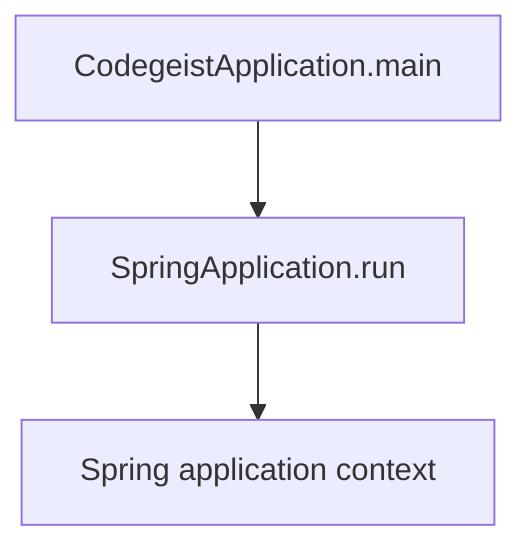
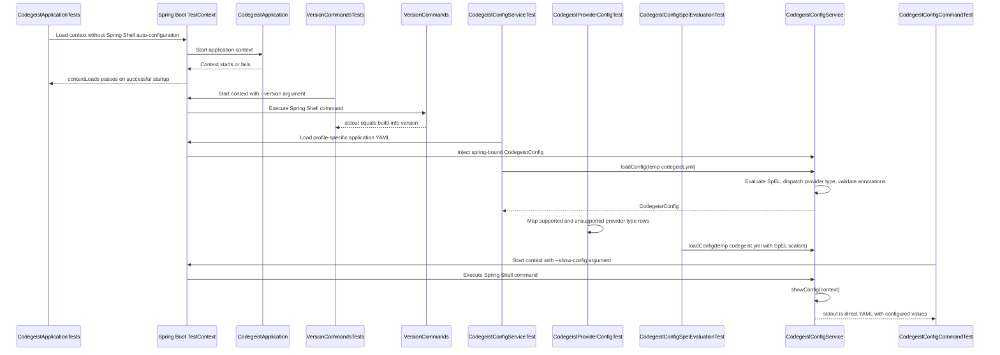

# Codegeist Architecture

Current-state architecture overview for coding agents and contributors.

## Scope

This document describes what exists in the repository now. It is not an
implementation backlog and must not be used as a source-generation checklist.

For future direction, use only the compact, current specification set under
`docs/developer/specification/`:

- `codegeist-opencode-parity.md` - behavior reference and OpenCode parity posture.
- `java-generation-guidance.md` - iterative Java/Spring implementation rules.
- `testing-strategy-and-agent-rules.md` - test-first workflow and timing rules.
- `runtime-vocabulary.md` - vocabulary only, not package or class requirements.
- `build-release-and-binary-smoke-strategy.md` and `native-packaging-posture.md` -
  packaging strategy for later implemented workflows.

For deeper current-state source-code documentation, use these focused architecture
docs:

- `source-code-documentation.md` - documentation strategy for implementation
  analysis, Spring interaction notes, diagrams, and task handoff value.
- `provider-configuration.md` - provider configuration source map, Spring binding,
  direct YAML loading, validation flow, tests, and sharp edges.

## Current System State

Codegeist currently contains one Java/Spring Boot CLI application under
`app/codegeist/cli`. Implemented runtime behavior is Spring Boot application
startup, typed provider config loading and validation, trusted local SpEL
preprocessing for explicit `codegeist.yml` files, a Spring Shell `--version`
command that prints the build version, and a Spring Shell `--show-config` command
that prints the current Codegeist config as direct `codegeist.yml` YAML
with configured values unchanged.

The previous source-generation contracts and T004 implementation epic were removed
because they encouraged placeholder classes. Future implementation should start
from focused tests and add only the source needed by the current behavior.

## Build Baseline

The current application build is defined by `app/codegeist/cli/pom.xml`.

| Area | Current state |
| --- | --- |
| Module shape | Single Maven module under `app/codegeist/cli` |
| Group/artifact | `ai.codegeist:codegeist` |
| Java | `25` through `java.version` and `maven.compiler.release` |
| Spring Boot | Parent `spring-boot-starter-parent` `4.0.6` |
| Logging | Spring Boot default logging with SLF4J and Logback; application logs are file-only through `logback.xml` |
| Spring Shell | BOM `4.0.2`, dependency `spring-shell-starter` |
| Jackson | `jackson-databind` plus `jackson-dataformat-yaml` for direct YAML-to-POJO config mapping |
| Lombok | `1.18.46`, configured as an explicit annotation processor for Java 25 |
| Spring AI | BOM `2.0.0-M6` imported for dependency management |
| Spring AI Agent Utils | BOM and core artifact `0.7.0` |
| GraalVM | Native Maven profile using `native-maven-plugin` `0.10.6` |
| Packaging | Spring Boot executable jar named `target/codegeist.jar` |
| Release CI | `.github/workflows/release.yml` validates versioned JVM and native artifacts on GitHub-hosted Linux, Windows, and macOS runners, and publishes GitHub Releases only from `v*` tags |
| Tests | Spring Boot context-load test, Spring-context command tests, focused version output test, focused config command test, focused config service test, focused provider dispatch test, focused config SpEL test, native version/config smoke, local Linux smoke, Windows QEMU smoke, and final local smoke suite |

Spring AI provider starters are not present. Spring AI Agent Utils is present as a
dependency baseline, but no Agent Utils runtime utility is wired into the app yet.

## Implemented File Layout

```text
.github/workflows/
  release.yml
app/codegeist/cli/
  pom.xml
  Taskfile.yml
  src/...
scripts/tests/
  native-smoke.sh
  local-linux-smoke.sh
  qemu-windows-vm.sh
  qemu-windows-smoke.sh
  windows-smoke.ps1
  final-smoke-suite.sh
  windows-qemu/
    autounattend.xml
    setup.ps1
```

Implemented Java package:

| Package | Current responsibility |
| --- | --- |
| `ai.codegeist.app` | Spring Boot application entrypoint and version command |
| `ai.codegeist.app.config` | Typed provider config classes, annotation-backed provider type dispatch, qualified YAML `ObjectMapper` bean, direct YAML SpEL preprocessing, config service, config command, merged-config injection behavior, and validation exception |

No other `ai.codegeist.*` application packages currently exist in source code.

## Application Entrypoint

`CodegeistApplication` is annotated with `@SpringBootApplication` and delegates
startup to `SpringApplication.run`. GraalVM resource inclusion is kept out of
Java code in `src/main/resources/META-INF/native-image/resource-config.json`,
which includes `logback.xml` and `META-INF/build-info.properties` for the native
binary.



## Runtime Components

Current behavior:

- `task run` builds the jar and runs `java -jar target/codegeist.jar`.
- The app starts a Spring Boot context using `application.yaml`.
- `application.yaml` sets `spring.application.name` to `codegeist`, disables the
  Spring banner, and sets `spring.shell.interactive.enabled=false` so command
  arguments such as `--version` run through Spring Shell's noninteractive runner.
- `CodegeistApplication.APP_NAME` is the shared application name and Spring
  configuration prefix constant.
- The provider configuration slice lives under `ai.codegeist.app.config`.
  `provider-configuration.md` is the focused source-code documentation for this
  slice.
- Spring `@Service` and `@Component` classes use Lombok `@Slf4j` for debug-level
  lifecycle, command, loading, validation, and bean-creation messages. With the
  current file-only Logback setup, these debug messages go to `LOG_FILE` when
  `logging.level.root=DEBUG` or `LOGGING_LEVEL_ROOT=DEBUG` is set.
- `CodegeistConfig` is the root provider config model. It is a Spring component
  with `@ConfigurationProperties(prefix = CodegeistConfig.CONFIGURATION_PREFIX)`
  and Jackson YAML naming metadata so the same root shape can bind from
  application config or be mapped from a direct YAML file. It holds the
  `provider` map and receives the qualified YAML `ObjectMapper` for raw provider
  map normalization.
  `CONFIGURATION_PREFIX` is set from `CodegeistApplication.APP_NAME`, keeping the
  app name as the source of truth.
- `ProviderConfig` is an abstract sealed base class for typed provider map values.
  The required provider object field `type` dispatches through `@Provider` to
  concrete data-only provider config classes for `ollama` and `openai`. Broader
  provider-matrix and OpenCode-only types remain unsupported in this task.
  Provider classes validate only local config completeness; they do not create
  Spring AI clients or call providers.
- `CodegeistYamlConfiguration` exposes the qualified `codegeistYamlObjectMapper`
  bean used for direct `codegeist.yml` parsing, provider normalization, and
  rendering. The mapper carries Jackson injectable values for direct
  `CodegeistConfig` loads.
- `CodegeistYamlExpressionEvaluator` is a Spring service that receives the YAML
  mapper bean and evaluates SpEL only in direct-YAML string scalar values.
- `CodegeistConfigService` receives the Spring-bound `CodegeistConfig` through
  field `@Autowired` plus `@Qualifier(CodegeistConfig.SPRING_BOUND_CONFIG_BEAN)`.
  Its `primaryCodegeistConfig` `@Primary` bean currently returns that config as the
  primary config bean. Normal app components inject `CodegeistConfig` by type to
  receive the primary config. `loadConfig(String configPath)` reads an
  explicit YAML file path into a Jackson tree, evaluates SpEL only in string scalar
  values containing `#{`, maps raw provider entries into concrete config classes,
  then runs `jakarta.validation.Validator` and reports constraint failures through
  `CodegeistConfigValidationException` with source-path context. Jackson mapping
  and IO failures surface directly through Lombok `@SneakyThrows`. `toYaml(...)`
  renders direct `codegeist.yml` YAML with no `codegeist:` wrapper, no YAML document
  marker, and configured values unchanged.
- `--show-config` is implemented as a Spring Shell command in
  `CodegeistConfigService`. The service resolves the primary config, renders YAML,
  and writes only that YAML to `CommandContext.outputWriter()`.
- `--version` is implemented as a Spring Shell command in `VersionCommands`. It
  uses Spring Boot's `BuildProperties` bean, backed by the generated
  `META-INF/build-info.properties`, and writes through Spring Shell's
  `CommandContext.outputWriter()` so output is only the version string, for
  example `0.1.0-SNAPSHOT`. Its debug log is file-only and does not pollute
  command stdout.
- `logback.xml` writes logs only to `${LOG_FILE:-logs/codegeist.log}`. Console
  output is reserved for command output, so jar `--version` smokes print only the
  version and packaged native `--show-config` smokes print only direct YAML.
- There are no implemented prompt workflows, model calls, shell commands beyond
  `--version`, provider adapters, tool executions, permission prompts, workspace
  policies, storage adapters, server endpoints, Vaadin views, PF4J plugins, or
  JBang execution paths.

## Test Architecture

`CodegeistApplicationTests` is a Spring Boot context-load test. It excludes
Spring Shell auto-configuration so bootstrap can be verified without starting an
interactive runner.

`VersionCommandsTests` starts the Spring context with
`VersionCommands.VERSION_COMMAND` as an argument and verifies that stdout equals
the generated build version while stderr stays empty.

`CodegeistConfigCommandTest` starts the Spring context with
`CodegeistConfigService.SHOW_CONFIG_COMMAND` and a profile-specific config fixture.
It verifies stdout is parseable direct Codegeist YAML, excludes the `codegeist:`
Spring wrapper and YAML document marker, includes configured provider values, and
keeps stderr empty.

`CodegeistConfigServiceTest` activates a profile-specific test YAML file to prove
Spring-bound config reaches `CodegeistConfigService` as typed provider classes and
that unqualified `CodegeistConfig` injection receives the primary config
bean. It also writes a temporary `codegeist.yml` and proves `loadConfig(String)`
maps provider-specific fields. Validation coverage proves blank provider ids and
present-but-blank provider names are rejected, while an omitted provider name
remains valid.

`CodegeistProviderConfigTest` proves the supported `ollama` and `openai` provider
types map through the `@Provider` annotation to the expected concrete config class.
It also proves missing `type`, unsupported provider types, broader provider-matrix
types, out-of-scope OpenCode-only provider types, and selected provider-specific
required-field failures are rejected without creating provider clients.

`CodegeistConfigSpelEvaluationTest` proves direct YAML SpEL evaluation is limited
to string scalar values containing `#{`, whole expressions can preserve boolean,
numeric, and null scalar results, YAML keys remain literal, and SpEL failures
include source and YAML path context without printing secret material.



## Taskfile Verification Flow

`app/codegeist/cli/Taskfile.yml` provides the current developer and local smoke
entrypoints. Test and smoke helper scripts live under `scripts/tests/`.

`scripts/tests/native-smoke.sh` defines `run-native-smoke-tests`, which owns the
Linux native archive smoke assertions used by `task native-smoke` and the Linux
smoke entrypoint. The function writes
`target/dist/codegeist-linux-x64.tar.gz`, unpacks it into a fresh temp directory,
runs packaged `./codegeist --version` and `./codegeist --show-config`, then
writes the smoke log to `target/smoke-test/codegeist.log`.

`scripts/tests/local-linux-smoke.sh` runs Maven tests, builds the jar, verifies
`java -jar target/codegeist.jar --version`, and verifies the packaged Linux native
archive `--version` plus `--show-config` output when `native-image` is available.

`scripts/tests/qemu-windows-vm.sh` is the host-side Windows VM automation
entrypoint. It downloads the official Windows Server Evaluation ISO when no local
ISO exists, creates or starts the local Windows QEMU VM, generates answer media,
syncs the repo subset needed by smoke checks, and delegates execution to
`scripts/tests/qemu-windows-smoke.sh`.

`scripts/tests/qemu-windows-smoke.sh` is the lower-level SSH wrapper. It runs
`scripts/tests/windows-smoke.ps1` in the Windows VM. Missing Windows VM
configuration fails by default and can only be skipped when developer-only skip
mode is explicitly enabled.

`scripts/tests/final-smoke-suite.sh` runs the Linux and Windows smoke entrypoints.
Default mode requires Linux and Windows to pass and makes native checks required
by default. `--allow-skips` is the developer-only mode for machines without ISO
download or VM prerequisites.

| Task | Command | Proves |
| --- | --- | --- |
| `task test` | `mvn --batch-mode --no-transfer-progress test` | Maven test lifecycle, Spring context-load test, and version output test |
| `task build` | `mvn --batch-mode --no-transfer-progress -DskipTests clean package` | Executable jar packaging |
| `task native` | `mvn --batch-mode --no-transfer-progress -DskipTests -Pnative clean native:compile` | GraalVM command-mode native posture when practical |
| `task native-smoke` | Builds native, then sources `scripts/tests/native-smoke.sh` and calls `run-native-smoke-tests` | Linux native archive unpacks in a temp directory, packaged `--version` output equals generated build version, packaged `--show-config` output equals `provider: {}`, and native smoke log file works |
| `task local-linux-smoke` | Runs `scripts/tests/local-linux-smoke.sh` | Local Linux jar smoke, Maven tests, and native smoke when native-image is available |
| `task qemu-windows-smoke` | Runs `scripts/tests/qemu-windows-vm.sh smoke` | Creates or starts the Windows QEMU VM and runs Windows jar/native smoke over SSH |
| `task final-smoke-suite` | Runs `scripts/tests/final-smoke-suite.sh` | Local Linux and Windows smoke suite; both platforms must pass by default |
| `task run` | `java -jar target/codegeist.jar` after `build` | Starts the packaged Spring Boot application |

## GitHub Release Flow

`.github/workflows/release.yml` is the implemented GitHub-hosted release build
path. It accepts three trigger shapes:

- push to `release/v*` for iteration-branch and release-candidate validation
  without publishing;
- `workflow_dispatch` for pre-tag validation or reruns without publishing;
- push to `v*` tags for release-cycle automation and GitHub Release publication.

The workflow resolves a non-SNAPSHOT SemVer release version, passes it to Maven as
`-Drevision=<version>`, runs Maven tests before packaging, builds and smoke-tests a
versioned JVM jar, then builds native archives on GitHub-hosted Linux x64, Windows
x64, and macOS x64 runners. Native archive smoke runs `--version` and
`--show-config` from the extracted package directory. The Windows native job
activates the MSVC tools environment before running Maven native compilation. The
checksum job generates and verifies `SHA256SUMS.txt`; the release job uploads the
jar, native archives, and checksum file to a published GitHub Release only for
matching `v*` tags.

Release workflow changes are promoted through `/codegeist-release --source
<release-work-branch> --rc <n>` instead of merging a multi-commit work branch
directly. The command infers SemVer from the diff between the latest reachable
release tag and the source commit, creates a matching
`release/v<version>-github-release-build` validation branch when the source is not
already versioned, creates `release/v<version>-codegeist-rc-<n>` from current
`main`, writes one detailed squash commit, validates the candidate branch, and
advances `main` by fast-forward only before tagging and publication. After the
published release assets verify, the release command moves the lightweight
`latest` tag to the same commit as the verified `v*` release tag and creates or
updates the `latest` GitHub Release with the same downloaded assets. The `latest`
release does not run another build.
When synchronized `main` already contains the release-ready diff, the same command
may release directly from `main`, infer SemVer from `last-tag..main`, skip
validation-source and candidate branches, and start at pre-tag validation.

The implemented release artifact names are:

- `codegeist-jvm.jar`
- `codegeist-linux-x64.tar.gz`
- `codegeist-windows-x64.zip`
- `codegeist-macos-x64.tar.gz`
- `SHA256SUMS.txt`

## Not Implemented Yet

The following concepts are discussed in strategy docs but are not implemented in
Java source:

- Prompt workflows.
- Spring AI Ollama provider calls.
- Runtime orchestration.
- Session or event models.
- Context loading.
- Tool registry or tool execution.
- Permission approval flow.
- Workspace and file-access policy.
- Patch/edit proposal flow.
- Controlled shell execution.
- Storage ports or adapters.
- CLI/Spring Shell commands beyond `--version` and `--show-config`.
- Headless server endpoints.
- Vaadin client.
- PF4J plugin loading.
- JBang extension execution.

When implementing any of these concepts, update this document in the same task so
future coding agents can distinguish current code from future direction.
