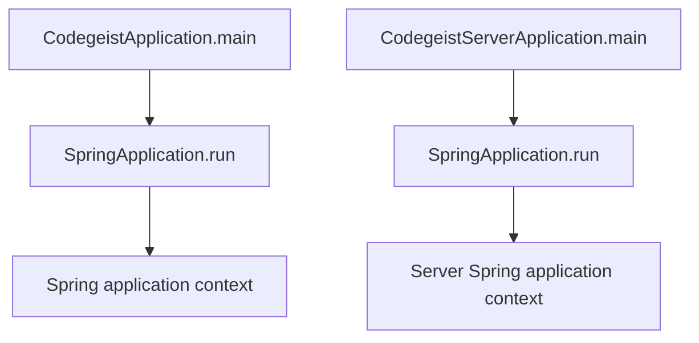
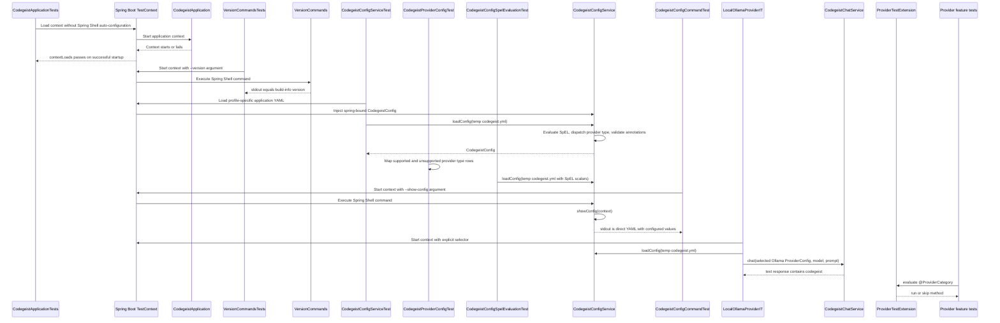

# Codegeist Architecture

Current-state architecture overview for coding agents and contributors.

## Scope

This document describes what exists in the repository now. It is not an
implementation backlog and must not be used as a source-generation checklist.

For future direction, use only the compact, current specification set under
`docs/developer/specification/`:

- `codegeist-opencode-parity.md` - behavior reference and OpenCode parity posture.
- `java-generation-guidance.md` - iterative Java/Spring implementation rules.
- `llm-provider-implementation.md` - provider-neutral `CodegeistChatModel<T>`
  pattern for mapping selected provider config into Spring AI chat models.
- `runtime-harness-implementation.md` - planned T007 runtime harness package,
  class, event, tool, permission, tool-callback, and storage implementation shape.
- `testing-strategy-and-agent-rules.md` - test-first workflow and timing rules.
- `runtime-vocabulary.md` - vocabulary only, not package or class requirements.
- `build-release-and-binary-smoke-strategy.md` and `native-packaging-posture.md` -
  packaging strategy for later implemented workflows.

For deeper current-state source-code documentation, use these focused architecture
docs:

- `source-code-documentation.md` - documentation strategy for implementation
  analysis, Spring interaction notes, diagrams, and task handoff value.
- `provider-configuration.md` - provider configuration source map, Spring binding,
  direct YAML loading, validation flow, tests, and sharp edges.
- `local-file-tools.md` - local read/list/glob/grep/write/edit/shell callback
  architecture, MCP callback bridge, source map, recording behavior, and extension
  guidance.
- `agent-control-loop.md` - Codegeist-owned model/tool/model loop, Spring AI message
  history shape, explicit callback dispatch, persistence boundary, tests, and
  non-goals.
- `cloud-server.md` - server module source map, Maven parent layout, health API,
  static OAuth provider configuration, planned cloud-login boundary, tests, and
  explicit cloud-server non-goals.
- `edit-tool.md` - detailed `codegeist_edit` contract, planning algorithm,
  containment guard, text normalization, stale-write protection, preview settings,
  tests, and sharp edges.
- `shell-tool.md` - detailed `codegeist_shell` contract, direct config, process
  lifecycle, timeout behavior, session recording, native metadata, cross-platform
  ask-driven smoke harness, and sharp edges.

## Current System State

Codegeist currently contains a Java/Spring workspace under `app/codegeist` with a
shared Maven parent POM and two application modules. `app/codegeist/cli` is the
local CLI application. Implemented CLI runtime behavior is Spring Boot application
startup, typed access-only provider config loading and validation, trusted local
SpEL preprocessing for explicit `codegeist.yml` files, direct workspace, tools, and
MCP config loading, active workspace resolution, provider-neutral chat execution
through `ChatHarnessService` and `CodegeistAgentLoopService`, a lazily created
Codegeist chat model that wraps Spring AI Ollama and uses the runtime model name
from the request, a Spring Shell `--version` command that prints the build version,
and a Spring Shell `--show-config` command that prints the current Codegeist config
as direct `codegeist.yml` YAML with configured values unchanged. A Spring Shell
`ask` command sends one prompt to the first configured provider with
that provider config's default runtime model; with `-c/--continue`, it appends the
prompt, bounded
local or MCP tool activity, and final provider response to the newest session in
`.codegeist/session.json`. The current loop exposes Codegeist-owned local
read/list/glob/grep/write/edit/shell callbacks and lazily opened MCP callbacks to
provider calls, inspects assistant tool-call messages itself, dispatches callbacks
through `CodegeistToolRun`, appends Spring AI `ToolResponseMessage` values, and calls
the model again until final assistant text is returned. Streaming events, permission
prompts, prompt history, TerminalUI prompt submission, and a broader agent driver are
not implemented. The current `tui` command only starts a minimal Spring Shell
`TerminalUI` root view with localized Codegeist text and a `Ctrl-Q` quit binding.

`app/codegeist/server` is the separate Codegeist Cloud server application. The
current server slice boots a Spring WebMVC app named `codegeist-server`, exposes
`GET /health` with `{"status":"ok"}`, validates static external OIDC provider
configuration under `codegeist.auth.providers`, and ships a local authentik OIDC
profile. It still has no browser login endpoint, live external identity-provider
call, user/account metadata, Codegeist API tokens, Spring Security route
protection, durable database, object storage, LLM proxy, OpenRouter call, quota,
billing, or CLI sync behavior. The planned CLI login contract is `codegeist login`,
defaulting to `https://codegeist.cloud` when no local Codegeist server target is
configured. That login targets a Codegeist server and later stores a
Codegeist-issued API token for that server; it is not an LLM-provider
configuration path.

The previous source-generation contracts and T004 implementation epic were removed
because they encouraged placeholder classes. Future implementation should start
from focused tests and add only the source needed by the current behavior.

## Build Baseline

The current Java application build is defined by `app/codegeist/pom.xml` and child
module POMs under `app/codegeist/cli` and `app/codegeist/server`.

| Area | Current state |
| --- | --- |
| Module shape | Maven parent/aggregator under `app/codegeist` with `cli` and `server` child modules |
| Group/artifact | Parent `ai.codegeist:codegeist-parent`; CLI `ai.codegeist:codegeist`; server `ai.codegeist:codegeist-server` |
| Java | `25` through `java.version` and `maven.compiler.release` |
| Spring Boot | Parent `spring-boot-starter-parent` `4.0.6` |
| Logging | Spring Boot default logging with SLF4J and Logback; application logs are file-only through `logback.xml` |
| Spring Shell | BOM `4.0.2`, dependencies `spring-shell-starter` and `spring-shell-jline` |
| Spring WebMVC | Server dependency `spring-boot-starter-webmvc` for the first HTTP health endpoint and future cloud API routes |
| Server auth config | Static generic OAuth2/OIDC provider configuration under `codegeist.auth.providers`; no Spring Security route protection or live OAuth2 login yet |
| Jackson | `jackson-databind` plus `jackson-dataformat-yaml` for direct YAML-to-POJO config mapping |
| Lombok | `1.18.46`, configured as an explicit annotation processor for Java 25 |
| Spring AI | BOM `2.0.0-M6` imported for dependency management; `spring-ai-ollama` and `spring-ai-openai` are present for programmatic provider `ChatModel` creation, and `spring-ai-starter-mcp-client` is present for prompt-scoped MCP callbacks |
| Spring AI Agent Utils | BOM and core artifact `0.7.0` |
| GraalVM | Native Maven profile using `native-maven-plugin` `0.10.6` |
| Packaging | CLI Spring Boot executable jar named `target/codegeist.jar`; server Spring Boot executable jar named `target/codegeist-server.jar` |
| Release CI | `.github/workflows/release.yml` validates versioned JVM and native artifacts on GitHub-hosted Linux, Windows, and macOS runners, runs matching install-script smokes on native runners, stages install scripts, and publishes GitHub Releases only from `v*` tags |
| Tests | CLI Spring Boot context-load test, Spring-context command tests, focused version output test, focused config command test, focused minimal `tui` command/root-view tests, focused `CodegeistMessages` resource-bundle and locale test, focused config service test, focused provider dispatch test, focused config SpEL test, focused workspace/tools config, resolver, output-bound, and local file/shell-tool tests, focused edit-tool tests, focused MCP adapter and tool-service tests, focused session store tests, provider feature tests gated by `CODEGEIST_TEST_PROVIDER_CATEGORY`, focused real local Ollama `ask` command test, focused local Ollama provider integration test behind an explicit selector, Docker-backed MCP remote smoke, native version/config/ask smoke, native file-edit encoding smoke, native shell-tool ask smoke, release-runner install-script smoke, local Linux smoke, opt-in Linux QEMU install smoke, Windows QEMU smoke, final local smoke suite, server context-load test, server health endpoint test, server auth config tests, local authentik profile test, and server native smoke |

Spring AI provider starters are not present. The Ollama and OpenAI provider
dependencies are used programmatically instead of through global Spring AI
auto-configuration.
Spring AI Agent Utils is present as a dependency baseline, but no Agent Utils
runtime utility is wired into the app yet.

## Implemented File Layout

```text
.github/workflows/
  release.yml
app/codegeist/
  pom.xml
  Taskfile.yml
app/codegeist/cli/
  pom.xml
  Taskfile.yml
  src/...
app/codegeist/server/
  pom.xml
  Taskfile.yml
  src/...
scripts/tests/
  smoke-common.ps1
  install-script-smoke.ps1
  mcp-remote-smoke.ps1
  native-smoke.ps1
  local-linux-smoke.ps1
  qemu-linux-install-smoke.sh
  qemu-windows-vm.sh
  qemu-windows-smoke.ps1
  windows-smoke.ps1
  final-smoke-suite.ps1
  windows-qemu/
    autounattend.xml
    setup.ps1
  fixtures/
    mcp-remote-server/
      Dockerfile
      pom.xml
      src/...
scripts/install/
  codegeist-install-linux.sh
  codegeist-install-macos.sh
  codegeist-install-windows.ps1
```

Implemented Java package:

| Package | Current responsibility |
| --- | --- |
| `ai.codegeist.app` | Spring Boot application entrypoint, Spring component scan root, version command, noninteractive Spring Shell runner guard, and shared command exception mapping |
| `ai.codegeist.app.chat` | Provider-neutral chat harness, Codegeist-owned synchronous agent loop, internal turn request, runtime chat execution context, chat service, generic `CodegeistChatModel<T extends ProviderConfig>` base, Ollama and OpenAI chat model adapters, and the `ask` Spring Shell command with optional session continuation |
| `ai.codegeist.app.config` | Top-level config root models, the central root parser, typed provider and MCP config root elements, explicit Java-registry provider type dispatch, qualified YAML `ObjectMapper` bean, direct YAML SpEL preprocessing, config service, config command, merged-config injection behavior, and validation exception |
| `ai.codegeist.app.mcp` | Lazy MCP adapter, prompt-scoped MCP run handle, Spring AI/MCP client factory, and closeable client handle for configured `stdio` and `streamable_http` clients |
| `ai.codegeist.app.session` | Versioned session-store model defaulting to `.codegeist/session.json`, JSON mapper, clock component, and service for loading, saving, selecting the newest session, and appending text exchanges |
| `ai.codegeist.app.tool` | Active workspace resolution, deterministic tool-output bounds, scoped tool runs, Codegeist-owned local read/list/glob/grep/write/edit/shell Spring AI callbacks, and recording wrappers for externally supplied MCP callbacks |
| `ai.codegeist.app.tui` | Minimal Spring Shell `tui` command and `CodegeistTerminalUi` root view over `TerminalUIBuilder`, without chat submission or a separate agent runtime |
| `ai.codegeist.app.i18n` | App-wide Spring resource-bundle-backed `CodegeistMessages` helper and `CodegeistLocaleService` for user-visible text and locale selection |
| `ai.codegeist.server` | Codegeist Cloud server entrypoint and first unauthenticated health endpoint |
| `ai.codegeist.server.auth.config` | Static generic OIDC provider configuration under `codegeist.auth.providers`, including local authentik profile validation |

No other `ai.codegeist.*` application packages currently exist in source code.

## Application Entrypoints

The CLI `CodegeistApplication` is annotated with `@SpringBootApplication`, uses the
normal `ai.codegeist.app` package scan root, and delegates startup to
`SpringApplication.run`. GraalVM metadata is kept out of Java code in
`src/main/resources/META-INF/native-image/`: `resource-config.json` includes
`logback.xml` and `META-INF/build-info.properties`, and `reflect-config.json`
registers config root elements, config POJOs, session model types, and
native-reachable local tool input records for Jackson binding in the native binary.

The server `CodegeistServerApplication` is a separate `@SpringBootApplication`
under `app/codegeist/server`. Its first implemented web component is
`HealthController`, which exposes only `GET /health` for the bootstrap slice.



## Runtime Components

Current behavior:

- `task run -- <args>` builds the jar and runs `java -jar target/codegeist.jar <args>`.
- The app starts a Spring Boot context using `application.yaml`.
- `application.yaml` sets `spring.application.name` to `codegeist`, disables the
  Spring banner, and sets `spring.shell.interactive.enabled=false` so command
  arguments such as `--version` run through Spring Shell's noninteractive runner.
- `CodegeistShellRunnerConfiguration` contributes a primary noninteractive
  `ShellRunner` while `spring.shell.interactive.enabled=false` is active. This keeps
  command-argument dispatch stable for `--version`, `--show-config`, `ask`, and
  `tui` by using Spring Shell's stdout-friendly `NonInteractiveShellRunner` instead
  of the JLine noninteractive variant that writes through `Terminal.writer()`.
- `CodegeistApplication.APP_NAME` is the shared application name and Spring
  configuration prefix constant.
- The provider configuration slice lives under `ai.codegeist.app.config`.
  `provider-configuration.md` is the focused source-code documentation for this
  slice.
- Spring `@Service` and `@Component` classes use Lombok `@Slf4j` for debug-level
  lifecycle, command, loading, validation, and bean-creation messages. With the
  current file-only Logback setup, these debug messages go to `LOG_FILE` when
  `logging.level.root=DEBUG` or `LOGGING_LEVEL_ROOT=DEBUG` is set.
- `CodegeistConfig` is the root config container. It stores parsed
  `CodegeistConfigRootElement` instances instead of one Java field per top-level
  YAML root. `CodegeistConfigService` parses direct `codegeist.yml` roots by
  delegating top-level root parsing to the central `CodegeistConfigRootParser`.
  `application.yaml` is not a Codegeist config source. The provider root is
  `provider:`; there is no `providers:` alias. `CodegeistConfigRootParser` owns
  shared root-shape validation and `type` dispatch for typed root entries.
  `ProvidersRootElement` stores a `ProvidersConfig` list-backed element,
  `McpClientsRootElement` stores a `McpClientsConfig` list-backed element whose ids
  come from YAML keys, `WorkspaceRootElement` stores the direct `workspace:` object
  shape, and `ToolsRootElement` stores the direct `tools:` object shape for
  Codegeist-owned local tool settings.
- `CodegeistConfigElement` is the abstract base class for every config payload shape,
  including single objects, typed entries, and list-backed keyed objects.
  `CodegeistTypedConfigElement<T>` owns the shared required nested YAML `type`
  discriminator, the central `type` property constant, and Lombok getter/setter for
  entries that have a dispatch or transport type. Provider entries use `T = String`
  as pre-mapping dispatch input, then expose runtime type through concrete constants.
  MCP client entries use `T = McpClientConfig.Type`; `CodegeistConfigRootParser`
  dispatches them to concrete `StdioMcpClientConfig` or
  `StreamableHttpMcpClientConfig` classes.
  `CodegeistConfigKeyedListElement<T>` owns the shared
  list state and transient YAML-object rendering for roots such as `provider:` and
  `mcp:`.
  `CodegeistConfigRootElement<T>` owns a generic validated `T config` slot for
  root payloads, so collection-shaped roots no longer keep side-list fields next to
  `config`. Root element subclasses are not Spring components.
  `ProviderConfig` is the abstract base class for typed provider map values.
  The required provider object field `type` dispatches through the explicit
  `CodegeistConfigRootParser` registry to concrete data-only provider config classes
  for `ollama` and `openai`. The parser also copies that validated value into the
  shared base field, while runtime/output type is still returned by each concrete
  provider config's `getType()` constant. Broader provider-matrix and
  OpenCode-only types remain unsupported in this task.
  Provider classes validate only local config completeness; they do not store model
  names, create Spring AI clients, or call providers.
- `CodegeistChatRequest` and `CodegeistChatResponse` are provider-neutral records
  for one runtime model name, prompt, and text response. `CodegeistChatRequest` does
  not carry message history, selected provider, selected tools, or session state;
  callers pass the validated `ProviderConfig` separately to the chat path, and
  prompt-scoped tools travel through `CodegeistChatExecutionContext`. Model names,
  generation options, enablement, and completion-path routing are not part of
  `ProviderConfig`.
- `CodegeistChatTurnRequest` is the internal provider-call request for one model
  turn. It carries the runtime model plus the Spring AI `Message` history for that
  call, allowing the agent loop to send the original `UserMessage`, an assistant
  tool-call message, and a matching `ToolResponseMessage` without growing
  `CodegeistChatRequest`. The loop owns message-history mutation and only mutates
  between synchronous provider calls.
- `ChatHarnessService` is a Spring `@Service` that owns one non-streaming prompt
  request for `ask` and future UI callers. It selects the default provider and
  provider-owned default model from `CodegeistConfig`, resolves the active workspace,
  opens a scoped `CodegeistToolRun`, calls `CodegeistAgentLoopService` with the
  runtime context, saves prompt, recorded tool parts, and final assistant text through
  `SessionStoreService`, then returns the `CodegeistChatResponse` for the command
  layer to print. It does not reconstruct provider-facing context from stored
  sessions.
- `CodegeistChatExecutionContext` is a runtime-only record with the active working
  directory and prompt-scoped Spring AI `ToolCallback` values. It defensively copies
  callback lists and provides an array helper for Spring AI APIs. It is never stored
  in `.codegeist/session.json`.
- `CodegeistAgentLoopService` is a Spring `@Service` that owns the synchronous
  model/tool/model loop for one prompt. It starts with a `UserMessage`, calls
  `CodegeistChatService.rawChat(...)`, stops when the assistant has no tool calls,
  and otherwise executes requested callbacks by `ToolDefinition.name()` in source
  order. It appends the assistant tool-call message and a Spring AI
  `ToolResponseMessage` containing bounded callback return text before continuing the
  model request. Duplicate callback names fail before the model call. Missing tool
  names become model-visible tool results so the model can recover. The loop stops
  with `Agent tool loop exceeded 8 rounds` after eight tool-dispatch rounds.
- `CodegeistChatService` is a Spring `@Service` that creates the selected provider
  model through its own narrow provider-config-to-adapter dispatch. Its public
  `chat(...)` methods adapt a `CodegeistChatRequest` into a one-message
  `CodegeistChatTurnRequest` and return final text. Its package-private
  `rawChat(...)` seam returns the raw Spring AI `ChatResponse` to the agent loop so
  Codegeist can inspect assistant tool calls.
- `CodegeistChatModel<T extends ProviderConfig>` is the abstract Codegeist provider
  model base. It stores the typed provider config only; runtime model selection
  arrives at call time through `CodegeistChatTurnRequest`. The context-aware turn
  method is the only provider implementation contract. Older no-tool callers use the
  no-context `CodegeistChatService` overload, which supplies an empty
  `CodegeistChatExecutionContext` before invoking the model through a one-message
  turn request.
- `OllamaChatModel` and `OpenAiChatModel` are the concrete provider models. Each
  receives its typed access-only provider config, maps the runtime model and
  prompt-scoped tool callbacks into provider-specific Spring AI options when a turn
  is called, disables Spring AI internal tool execution with
  `internalToolExecutionEnabled(false)`, and delegates a list-message `Prompt` to
  the matching Spring AI chat model. Provider-specific Spring AI imports stay
  isolated in these adapter classes.
- `CodegeistConfigYamlMapper` is the concrete Spring service and Jackson mapper for
  direct `codegeist.yml` parsing and rendering. It owns helper methods for reading
  empty-safe config source trees, rendering list-backed keyed config elements as
  provider-style YAML objects, and writing direct config YAML without a `codegeist:`
  wrapper.
- `CodegeistYamlExpressionEvaluator` is a Spring service that receives
  `CodegeistConfigYamlMapper` and evaluates SpEL only in direct-YAML string scalar
  values.
- `CodegeistConfigRootParser` is the central Spring parser for top-level direct YAML
  roots. It receives `CodegeistConfigYamlMapper`, owns unsupported-root errors, and
  now uses explicit parser methods for `provider:`, `mcp:`, `workspace:`, and
  `tools:` instead of generic root-shape helpers. Provider entries dispatch through a
  compact explicit registry; MCP entries dispatch through an explicit transport config
  registry and copy the YAML key into `McpClientConfig.id`.
- `CodegeistConfigService` receives the root parser, config mapper, SpEL evaluator,
  validator, and command output service as final collaborators
  through Lombok `@RequiredArgsConstructor`. Its `configPath` remains a non-final
  `@Value` field for the injected `codegeist.config` property.
  Its `loadCurrentConfig` `@Primary` bean parses the configured
  `codegeist.config` file when that property is set and otherwise returns the empty
  default config. Normal app components inject `CodegeistConfig` by type to receive
  that primary config.
  `loadConfig(String configPath)` reads an explicit YAML file path into a Jackson
  tree, evaluates SpEL only in string scalar values containing `#{`, delegates each
  top-level root to `CodegeistConfigRootParser`, then runs
  `jakarta.validation.Validator` and reports constraint failures through
  `CodegeistConfigValidationException` with source-path context. Jackson mapping
  and IO failures surface directly through Lombok `@SneakyThrows`.
  `loadCurrentConfig()` loads the configured `codegeist.config` path, typically
  supplied as `-Dcodegeist.config=<path>` at startup, otherwise it returns the
  empty default config. `toYaml(...)` renders direct `codegeist.yml` YAML with no
  `codegeist:` wrapper, no YAML document marker, configured values unchanged, and
  no synthetic roots for an empty config.
- `WorkspaceRootElement` parses optional direct `codegeist.yml` `workspace:`
  objects into the inherited generic `CodegeistConfigRootElement<WorkspaceConfig>`
  config slot. Implemented `WorkspaceConfig` fields are nullable `directory`, nullable
  `encoding`, and nullable `dirGuardDisabled` exposed as YAML
  `dir-guard-disabled`. Omitted or blank `directory` values let the resolver fall
  back to the process working directory. Omitted or blank `encoding` values make
  local file tools use UTF-8; configured values must be supported Java charset names.
  `dir-guard-disabled` defaults to `false`; when explicitly true, side-effecting file
  tools can disable active-workspace containment while still requiring existing
  regular file targets. The root does not define broader permission rules,
  ignored-file behavior, write protection, or symlink policy beyond that tested guard
  switch.
- `ToolsRootElement` parses optional direct `codegeist.yml` `tools:` objects into
  `ToolsConfig`. Implemented nested payloads are `codegeist-edit`, modeled by
  `CodegeistEditToolConfig` with nullable `diff-preview-lines` and
  `diff-preview-chars`, and `codegeist-shell`, modeled by `CodegeistShellToolConfig`
  with optional `command-prefix` plus positive `default-timeout-seconds`. There is
  no global tools disable switch in the current runtime config; provider adapters
  keep provider/framework-owned internal tool execution disabled while Codegeist
  owns callback dispatch.
  `CodegeistEditToolSettings` applies runtime defaults of 6 lines and half of
  `ToolOutputBounds.MAX_PREVIEW_CHARS`, falls back for non-positive values, and caps
  configured values by existing global output bounds. `CodegeistShellToolSettings`
  applies platform wrapper defaults and the 120-second configured timeout fallback.
- `WorkspaceResolver` is a Spring component under `ai.codegeist.app.tool`. It reads
  the active `CodegeistConfig`, uses `${user.dir}` as the process working directory,
  returns that directory when no workspace override is configured, normalizes
  absolute overrides, and resolves relative overrides against the process working
  directory. It intentionally allows filesystem roots, paths outside the repository,
  and normalized traversal segments because this slice is workspace resolution, not
  workspace policy.
- `ToolOutputBounds` is a Spring component under `ai.codegeist.app.tool`. It
  centralizes deterministic string capping for future model-visible and persisted
  tool output: preview text is capped at `MAX_PREVIEW_CHARS`, single-line previews
  and normalized error previews are capped at `MAX_LINE_CHARS`, result limits are
  capped at `MAX_RESULTS`, and read limits are capped at `DEFAULT_READ_LINES`.
  Bounds return strings or integer limits only; no truncation metadata object exists.
- `CodegeistLocalTools` is a Spring component under `ai.codegeist.app.tool`. It is
  the generic callback assembler for Codegeist-owned local Spring AI callbacks,
  including the six implemented file callbacks plus one shell callback:
  `codegeist_read`, `codegeist_list`, `codegeist_glob`, `codegeist_grep`,
  `codegeist_write`, `codegeist_edit`, and `codegeist_shell`. Package-private Spring components
  `CodegeistReadFileTool`, `CodegeistListFileTool`, `CodegeistGlobFileTool`,
  `CodegeistGrepFileTool`, `CodegeistWriteFileTool`, `CodegeistEditFileTool`, and
  `CodegeistShellTool` own each operation and its callback name, while the
  package-private Spring component `CodegeistFileToolSupport` owns shared JSON
  parsing, schema, active workspace lookup, path, configured-charset text readers,
  binary, and glob helpers.
  `CodegeistToolInput` wraps the raw JSON payload at the local-tool boundary and
  normalizes blank input to `{}` before file-tool parsing.
  `CodegeistToolJsonMapper` is the package-private Jackson mapper used for local
  tool input JSON, separate from config YAML and session-store mappers.
  `CodegeistFileEncoding` resolves the global local file-tool charset from
  `workspace.encoding`, defaulting to UTF-8.
  `CodegeistLocalTools` injects discovered tools as a `List<CodegeistLocalTool>` and
  treats callback order as non-semantic because tools are selected by name. Each file
  callback resolves relative paths against the active workspace, accepts absolute
  caller paths, returns only bounded model-visible text, and records the same bounded
  preview in a `ToolSessionPart` through a caller-provided recorder. Read rejects
  missing paths, directories, and binary or malformed files for the configured
  workspace encoding; list is
  non-recursive with `[DIR]` and `[FILE]` markers; glob uses Java NIO glob matching
  without shelling out; grep uses Java regex over text files and records invalid
  regex as a failed tool result; write creates or overwrites one regular text file
  using the configured workspace encoding without creating parent directories; edit
  applies one or more exact non-overlapping replacements to one existing text file,
  rejects outside-workspace targets before reading or writing by default, allows that
  containment guard to be disabled only by `workspace.dir-guard-disabled: true`,
  preserves BOM/CRLF style, and records a bounded diff summary whose compact diff
  preview can be tuned through `tools.codegeist-edit` direct config; shell runs one
  local process through the `tools.codegeist-shell` configured host wrapper when set,
  otherwise through `cmd.exe /c` on Windows or `sh -lc` elsewhere, closes stdin,
  merges stderr into stdout, reports the exit code, applies optional `timeoutSeconds`
  with a configurable `tools.codegeist-shell.default-timeout-seconds` fallback,
  records timed-out commands as completed results with `Timed out: true`, and stores a
  bounded completed shell summary without workspace cwd containment.
  `CodegeistLocalToolCallback` is the package-local wrapper that translates handled
  local tool failures into bounded failed tool parts and keeps completed local-tool
  output bounded before returning or recording it.
- `CodegeistMcpAdapter` is a Spring `@Service` under `ai.codegeist.app.mcp`. It is
  intentionally lazy: config parsing, transport-type validation, Spring context
  startup, and `--show-config` do not open MCP clients. `openRun(CodegeistConfig)`
  reads the already parsed optional direct `mcp:` root, opens configured clients
  through `SpringAiMcpClientFactory`, and returns one prompt-scoped
  `CodegeistMcpRun`.
  Supported types are currently `stdio`, using `command` and `args`, and
  `streamable_http`, using base server `url` plus optional MCP path `endpoint`. When
  `endpoint` is absent or blank, the factory skips the builder setter and lets the
  MCP Java SDK use its own endpoint default.
  The production factory localizes Spring AI MCP and MCP Java SDK imports,
  initializes each `McpSyncClient`, discovers Spring AI `ToolCallback` values through
  `SyncMcpToolCallbackProvider`, and closes each client after the chat turn. SSE,
  OAuth, public timeout config, resources, prompts, server discovery, and server
  management are not implemented. The detailed first-provider-call to
  `McpSyncClient.callTool(...)` sequence is documented in
  `docs/developer/architecture/local-file-tools.md`.
- `CodegeistToolService` is a Spring `@Service` under `ai.codegeist.app.tool`. It
  opens one `CodegeistToolRun` per chat turn, asks `CodegeistLocalTools` for local
  callbacks, opens `CodegeistMcpAdapter` with the active `CodegeistConfig`, wraps MCP
  callbacks with `RecordingToolCallback`, and shares one ordered recorder list with
  both callback sources. The returned `DefaultCodegeistToolRun` exposes a
  `CodegeistChatExecutionContext`, returns defensive copies of recorded
  `ToolSessionPart` values, and closes the prompt-scoped `CodegeistMcpRun` when the
  harness leaves the turn scope.
- `--show-config` is implemented as a Spring Shell command in
  `CodegeistConfigService`. The service resolves the current global config policy,
  renders YAML, and writes only that YAML through `CommandOutputService`.
- `--version` is implemented as a Spring Shell command in `VersionCommands`. It
  uses Spring Boot's `BuildProperties` bean, backed by the generated
  `META-INF/build-info.properties`, and writes through `CommandOutputService` so
  output is only the version string, for
  example `0.1.0-SNAPSHOT`. Its debug log is file-only and does not pollute
  command stdout.
- `tui` is implemented as a Spring Shell command in `ai.codegeist.app.tui.TuiCommands`.
  It delegates to `CodegeistTerminalUi`, which builds a Spring Shell `TerminalUI`
  from `TerminalUIBuilder`, configures one bordered `BoxView` root, renders a
  localized quit hint from `CodegeistMessages`, binds `Ctrl-Q` to an interrupt message,
  and enters `TerminalUI.run()`. The current TUI does not submit prompts, stream
  chat, show sessions, render tool activity, request permissions, or use a presenter,
  layout service, custom JLine console, or Spring Shell control wrapper layer.
- `logback.xml` writes logs only to `${LOG_FILE:-logs/codegeist.log}`. Console
  output is reserved for command output, so jar `--version` smokes print only the
  version and packaged native `--show-config` smokes print only direct YAML.
- `CodegeistCommandExceptionMapper` is the shared Spring Shell command-boundary
  mapper. Commands reference it through `@Command(exitStatusExceptionMapper = ...)`,
  throw domain exceptions directly, and let the mapper log the exception and return
  a user-facing `ExitStatus` description. Corrupt existing session-store JSON maps
  to the user-facing message `No session to continue`.
- `ask` is implemented as a Spring Shell command in `AskCommands`. It accepts one
  positional prompt parameter plus optional `-c/--continue`, delegates the prompt turn
  to `ChatHarnessService`, and writes only the returned model response to stdout
  through `CommandOutputService`. The harness selects the first configured provider
  through optional `CodegeistConfig.defaultProvider()`, fails at the command boundary
  when none exists, uses `ProviderConfig.defaultModel()`, opens local and MCP tool
  callbacks, runs `CodegeistAgentLoopService`, and saves the final turn through
  `SessionStoreService`.
  Without `-c/--continue`, the service creates a new session. With `-c/--continue`,
  it appends to the newest existing session when one exists, creates a session for
  missing or empty stores, and refuses corrupt JSON stores instead of overwriting
  them. The current Ollama provider default is `llama3.2:1b`.
- `SessionStoreService` owns session-store file paths, JSON I/O, and clock input;
  `SessionStore` owns in-memory store changes such as creating a store, adding a
  session, selecting the latest session, and appending a prompt/response exchange.
  The store root has `schemaVersion`, `workingDir`, timestamps, and a list of
  `CodegeistSession` values. Each session owns chronological `SessionMessage`
  values with `SessionMessageRole` and ordered `SessionPart` values. Implemented
  part types are `TextSessionPart`, `CompactionSessionPart`, and the additive
  `ToolSessionPart` for bounded completed or failed tool activity. Tool parts persist
  only the tool name, nested `ToolSessionPart.ToolSessionPartStatus`, and bounded
  `outputPreview`. Local file callbacks, the local shell callback, and wrapped MCP
  callbacks can now record these bounded parts. Structured patch is intentionally
  deferred after T007_04 research selected the Pi-style exact edit path for current
  file mutation; reasoning, step, shell-duration, process-id, and full-output
  side-file parts are deferred until focused tool tasks add the matching execution
  paths. `SessionStore`
  is a Lombok getter/setter/builder class with a default empty session list;
  session, message, and existing part model entries stay records or Jackson-bound
  classes as implemented. The JSON mapper registers Java time support, emits ISO
  instants, omits null fields, and writes inspectable JSON. Native reflection
  metadata includes the session model types and part implementations.
  `CodegeistSpringAppProperties` binds Spring application configuration under
  `codegeist.*`. It owns the built-in default `.codegeist/session.json` path and
  the optional app-wide `codegeist.locale` setting used by
  `CodegeistLocaleService`. External Spring `application.yaml` values or
  `CODEGEIST_SESSION_DIRECTORY` and `CODEGEIST_SESSION_STORE_FILE` environment
  variables can override the session path. These settings are not part of direct
  `codegeist.yml` provider/tool configuration.
- The default `.codegeist/session.json` store does not store API keys, OAuth tokens,
  cloud credentials, evaluated secret values, provider config, selected provider,
  selected model, MCP client definitions, enabled tool definitions, permission rules,
  runtime status, or TUI layout state. Provider, model, MCP, tool, permission,
  runtime, and UI state are resolved from current runtime configuration when a
  session continues.
- There is no implemented provider-facing model-context reconstruction from stored
  sessions yet. Continuing a session currently persists the new turn but still sends
  the current prompt as a one-turn `CodegeistChatRequest`.
- There are no implemented streaming output, provider flags, model flags, permission
  prompts, workspace or file-access policies beyond active workspace resolution,
  server endpoints, Vaadin views, PF4J plugins, or JBang execution paths.

## Test Architecture

`CodegeistApplicationTests` is a Spring Boot context-load test. It excludes
Spring Shell auto-configuration so bootstrap can be verified without starting an
interactive runner.

`VersionCommandsTests` starts the Spring context with
`VersionCommands.VERSION_COMMAND` as an argument and verifies that stdout equals
the generated build version while stderr stays empty.

`CodegeistCommandExceptionMapperTest` proves command-boundary exceptions are mapped
to user-facing `ExitStatus` descriptions, including wrapped no-session causes.

`CodegeistConfigCommandTest` starts the Spring context with
`CodegeistConfigService.SHOW_CONFIG_COMMAND` and an explicit `codegeist.config`
fixture path. It verifies stdout is parseable direct Codegeist YAML, excludes the
`codegeist:` Spring wrapper and YAML document marker, includes configured provider
values, and keeps stderr empty.

`CodegeistConfigServiceTest` proves unqualified `CodegeistConfig` injection receives
the parsed `codegeist.config` fixture. It writes temporary `codegeist.yml` files and
proves `loadConfig(String)` maps provider-specific and MCP fields. It proves the
injected `codegeist.config` property is the current global config source when set at
context startup. Validation coverage proves blank provider ids and present-but-blank
provider names are rejected, while an omitted provider name remains valid.

`CodegeistWorkspaceConfigTest` proves direct `codegeist.yml` can load optional
`workspace.directory`, accepts omitted and blank workspace configuration so the
resolver can fall back later, and rejects a present non-object `workspace:` root with
a focused validation message.

`CodegeistToolsConfigTest` proves direct `codegeist.yml` can load optional
`tools.codegeist-edit.diff-preview-lines` and `diff-preview-chars` plus optional
`tools.codegeist-shell.command-prefix` and `default-timeout-seconds`, allows an empty
`tools:` root, rejects blank shell prefix entries and non-positive shell default
timeouts through Bean Validation, and rejects a present non-object `tools:` root with
a focused validation message.

`CodegeistProviderConfigTest` proves the supported `ollama` and `openai` provider
types map through the explicit Java registry to the
expected concrete config class. It also proves missing `type`, unsupported provider
types, broader provider-matrix types, out-of-scope OpenCode-only provider types,
and selected provider-specific required-field failures are rejected without creating
provider clients.

`CodegeistConfigSpelEvaluationTest` proves direct YAML SpEL evaluation is limited
to string scalar values containing `#{`, whole expressions can preserve boolean,
numeric, and null scalar results, YAML keys remain literal, and SpEL failures
include source and YAML path context without printing secret material.

`LocalOllamaProviderIT` is an explicitly selected live integration test. It starts
the Spring context without Spring Shell auto-configuration, loads a temporary
`codegeist.yml` through `CodegeistConfigService.loadConfig(String)`, and calls
`CodegeistChatService` with the selected provider config plus a request that carries
the runtime model and a narrow one-turn prompt. The test does not run a separate
model-list preflight, does not pull, download, create, or delete models, and does
not run in the ordinary broad suite unless selected with
`task test TEST=LocalOllamaProviderIT`.

`OpenAiProviderTest` and `OllamaProviderTest` are provider feature test classes
that run through `task test`. Provider methods use `ProviderCategory` and
`ProviderTestExtension` so `CODEGEIST_TEST_PROVIDER_CATEGORY` selects the highest
category to run. Categories are `none`, `local`, `remote_free`, and
`remote_paid`; `none` is the default and runs no annotated provider feature
methods. `remote_paid` is the explicit cost and rate-limit opt-in. Set
`CODEGEIST_TEST_PROVIDER_CATEGORY=local` for local Ollama provider calls. `task
test` starts Ollama before Maven for every test run.

`AskCommandsTest` is a real local Ollama command test gated at class level by
`CODEGEIST_TEST_PROVIDER_CATEGORY=local`. It uses `@SpringBootTest` with `ask`
arguments, writes a test config file under `target/provider-tests`, supplies
`codegeist.config` through Spring dynamic properties, and verifies the captured
model response contains `codegeist`.

`SessionStoreServiceTest` is the focused session persistence test. It uses a temp
working directory, fixed clock, and the session-store JSON mapper to prove newest
session selection, user/assistant text part persistence, multiple sessions,
missing/empty store session creation, corrupt-store failure, compaction part plus
parent-linked summary message round-tripping, and absence of representative runtime
config and secret fields in serialized `.codegeist/session.json`.

`AskCommandsSessionStoreTest` is the focused provider-free command-adapter test. It
injects a stub `ChatHarnessService`, calls `AskCommands` directly for plain and
continued `ask` paths, verifies stdout remains the returned response text only,
checks the continue flag delegation, and checks Spring Shell parsing for both
`ask -c "prompt"` and `ask --continue "prompt"`.

`TuiCommandsTest`, `CodegeistTerminalUiTest`, `CodegeistLocaleServiceTest`, and
`CodegeistMessagesTest` are the focused TUI-adjacent unit tests. They verify command
delegation, minimal root-view creation, default-locale fallback, configured locale
selection, default resource-bundle lookup from `messages.properties`, and message
lookup through the configured locale. The blocking `TerminalUI.run()` loop is not
entered by unit tests.

`ChatHarnessServiceTest` is the focused provider-free harness test. It uses
hand-written fakes for provider config, agent loop service, tool run, and workspace
resolution plus a real `SessionStoreService` with a temp directory and fixed clock to
prove the loop receives tool context and recorded `ToolSessionPart` values are saved
before the assistant text.

`CodegeistAgentLoopServiceTest` proves the owned loop runs a second model turn after
an assistant tool call, feeds the bounded tool result back through a
`ToolResponseMessage`, returns missing tools as model-visible results, rejects
duplicate callback names, and stops at the max-round guard.

`CodegeistChatServiceTest` proves the public chat overload adapts
`CodegeistChatRequest` to a one-message turn request, the raw chat seam passes
`CodegeistChatTurnRequest` plus `CodegeistChatExecutionContext` to the selected
provider model, the no-context service overload uses an empty execution context, and
`CodegeistChatRequest` still has exactly `model` and `prompt` record components.

`WorkspaceResolverTest` proves active workspace fallback, absolute overrides,
relative overrides, filesystem root support, and traversal-segment normalization
without treating those configured values as policy violations.

`ToolOutputBoundsTest` proves deterministic preview capping, line capping, result
limit capping, read-limit defaults and caps, and normalized bounded error previews.

`CodegeistLocalToolsTest` uses temp-directory fixtures to prove the local file and
shell callbacks expose stable names and schemas, resolve relative paths from the
active workspace, record tool output in `ToolSessionPart`, and handle focused
read/list/glob/grep/write/edit/shell success and failure paths without provider
calls. Edit coverage includes exact single and multi-edit replacement, no partial
mutation, workspace and symlink escape rejection, invalid input failures, ambiguous
or missing match failures, stale-byte checking, BOM/CRLF preservation, bounded diff
previews, and configured edit diff line and character caps. Shell coverage includes
successful merged stdout/stderr capture, relative cwd execution, absolute cwd outside
the workspace, configured wrapper prefix resolution, platform-default wrapper
fallback, non-zero exit as a completed result, blank command failures, and full
bounded output persistence.

`CodegeistToolServiceTest` proves one prompt-scoped tool run exposes local callbacks
through `CodegeistChatExecutionContext`, includes configured MCP callbacks, records
completed or failed MCP tool parts through `RecordingToolCallback`, closes the
prompt-scoped MCP run, and returns defensive copies of completed tool parts.

`CodegeistMcpAdapterTest` uses hand-written fakes to prove absent and empty MCP
config do not open clients, `stdio` and `streamable_http` configs map into the
client-creation seam, callbacks are exposed, and resources close with the MCP run.

`CodegeistMcpRemoteSmokeIT` is only driven by `task mcp-remote-smoke`. It connects to
the local Docker fixture through the real `streamable_http` transport, discovers the
deterministic `remote_echo` MCP callback, and calls it directly without an LLM
provider call.

`AskCommandsMcpRemoteSmokeIT` is also driven only by `task mcp-remote-smoke`. It starts
the Spring Boot `ask` command with direct `provider.ollama` and `mcp.remote-smoke`
config, lets local Ollama select the remote MCP tool, and asserts that the session
store contains a completed `ToolSessionPart` for `remote_echo`.



## Taskfile Verification Flow

`app/codegeist/cli/Taskfile.yml` provides the current developer and local smoke
entrypoints. Test and smoke helper scripts live under `scripts/tests/`.

`scripts/tests/artifact-smoke.ps1` is the shared native-only artifact smoke
harness. It packages native artifacts into
`target/dist/codegeist-<platform>.<extension>`, unpacks native archives into a
fresh temp directory, runs `--version`, runs native `--show-config`, delegates
deterministic ask-driven file-edit checks to `scripts/tests/file-edit-ask-smoke.ps1`,
and delegates deterministic ask-driven shell checks to
`scripts/tests/shell-ask-smoke.ps1`. The artifact harness intentionally avoids a
provider-only native `ask` check so smoke results do not depend on local model
wording when no tool call is needed.

`scripts/tests/install-script-smoke.ps1` is the shared install-script smoke harness
used by release runners and the Windows QEMU smoke. It stages the matching install
script beside the archive already produced by the artifact harness, writes local
checksums, serves release-shaped assets over localhost, runs the platform installer
in an isolated install root, and verifies the installed wrapper with `--version`
plus `--show-config`.

`scripts/tests/native-smoke.ps1` is the Linux native smoke wrapper used by
`task native-smoke` and the Linux smoke entrypoint. The wrapper optionally builds
the native executable and calls `artifact-smoke.ps1 -Platform linux-x64`; ask
coverage stays on the deterministic fixture-backed file-edit and shell harnesses.

`scripts/tests/smoke-common.ps1` is the shared helper layer for smoke status
files, duration output, environment overrides, command steps, and readiness
checks. The Linux, Windows SSH, MCP remote, and final-suite smoke entrypoints use
this common PowerShell codebase; do not add shell compatibility wrappers for
these workflows.

`scripts/tests/local-linux-smoke.ps1` runs Maven tests, builds the jar as a build
gate, then verifies the packaged Linux native archive through `native-smoke.ps1`
and the shared artifact harness when `native-image` is available. The jar is not
smoke-tested.

`scripts/tests/qemu-linux-install-smoke.sh` is the opt-in Linux install-script
smoke. It stages local release-shaped assets, serves them from a temporary host
HTTP server, boots a fresh Ubuntu Linux QEMU guest with cloud-init, downloads
`codegeist-install-linux.sh` with guest `curl`, runs the installer with
`CODEGEIST_INSTALL_BASE_URL` pointed at the host server, and verifies installed
`codegeist --version` plus `codegeist --show-config` inside the guest. VM state
lives under `.local/linux-qemu/` and generated smoke assets live under
`app/codegeist/cli/target/smoke-test/`.

`scripts/tests/mcp-remote-smoke.ps1` packages the local MCP fixture jar, builds the
`codegeist-mcp-remote-smoke:local` Docker image, starts a temporary container on a
localhost-only port, runs `CodegeistMcpRemoteSmokeIT` with the discovered URL, starts
local Ollama, runs `AskCommandsMcpRemoteSmokeIT` with the same URL, and removes the
container in a `finally` cleanup path. The fixture source lives under
`scripts/tests/fixtures/mcp-remote-server/`; its Maven `target/` output is ignored.

`scripts/tests/qemu-windows-vm.sh` is the host-side Windows VM automation
entrypoint. It downloads the official Windows Server Evaluation ISO when no local
ISO exists, creates or starts the local Windows QEMU VM, generates answer media,
syncs the repo subset needed by smoke checks including `scripts/install/`, and
delegates execution to `scripts/tests/qemu-windows-smoke.ps1`.

`scripts/tests/qemu-windows-smoke.ps1` is the lower-level SSH wrapper. It runs
`scripts/tests/windows-smoke.ps1` in the Windows VM. The Windows-side script calls
the shared artifact harness for native `--version`, native `--show-config`,
file-edit, shell, and log checks.
After the Windows zip exists, the Windows-side script calls
`install-script-smoke.ps1` to run `codegeist-install-windows.ps1` against local
release-shaped assets and verify the installed `codegeist.cmd` wrapper.
Missing Windows VM configuration fails by default and can only be skipped when
developer-only skip mode is explicitly enabled.

`scripts/tests/final-smoke-suite.ps1` runs the Linux and Windows smoke entrypoints.
Default mode requires Linux and Windows to pass and makes native checks required
by default. `-AllowSkips` is the developer-only mode for machines without ISO
download or VM prerequisites.

| Task | Command | Proves |
| --- | --- | --- |
| `task test` | Runs `ollama-start` with `OLLAMA_ENTER=false`, then `mvn --batch-mode --no-transfer-progress {{if .TEST}}-Dtest={{.TEST}} {{end}}test` | Taskfile-managed Ollama startup, Maven test lifecycle, Spring context-load test, version output test, provider feature tests gated by `CODEGEIST_TEST_PROVIDER_CATEGORY`, and optional focused selector such as `task test TEST=CodegeistApplicationTests` |
| `task build` | `mvn --batch-mode --no-transfer-progress -DskipTests clean package` | Executable jar packaging |
| `task native` | `mvn --batch-mode --no-transfer-progress -DskipTests -Pnative clean native:compile` | GraalVM command-mode native posture when practical |
| `task native-smoke` | Runs `scripts/tests/native-smoke.ps1 -BuildNative` | Linux native archive is checked through the shared artifact harness: package, unpack, packaged `--version`, packaged `--show-config`, command logs, ask-driven file-edit side effects, and ask-driven shell side effects |
| `task local-linux-smoke` | Runs `scripts/tests/local-linux-smoke.ps1` | Local Linux Maven tests, jar packaging as a build gate, and shared artifact-harness native smoke when native-image is available |
| `task qemu-linux-install-smoke` | Runs `task native`, then `scripts/tests/qemu-linux-install-smoke.sh smoke` | Fresh Linux QEMU guest verifies the curl-downloadable Linux install script against local release-shaped assets and checks the installed command |
| `task mcp-remote-smoke` | Runs `scripts/tests/mcp-remote-smoke.ps1` | Docker-backed local MCP server fixture, real `streamable_http` MCP callback discovery, direct deterministic callback invocation, local Ollama-backed `ask` invocation of the remote MCP tool, session `ToolSessionPart` persistence, and container cleanup outside the default test path |
| `task qemu-windows-smoke` | Runs `scripts/tests/qemu-windows-vm.sh smoke` | Creates or starts the Windows QEMU VM, then runs native smoke over SSH including file-edit, shell, and Windows install-script smoke checks |
| `task server:native-smoke` from `app/codegeist` | Runs `scripts/tests/server-native-smoke.ps1 -BuildNative` | Codegeist Cloud server GraalVM native executable builds, starts on a temporary localhost port, returns `GET /health -> {"status":"ok"}`, reports `server native startup`, and terminates the temporary process |
| `task final-smoke-suite` | Runs `scripts/tests/final-smoke-suite.ps1` | Local Linux and Windows smoke suite; both platforms must pass by default |
| `task ollama-start` | Starts or reuses the local `ollama/ollama` container, waits for `/api/version`, and ensures the selected model is present | External local Ollama prerequisite for focused live provider tests and the MCP remote ask smoke |
| `task run` | `java -jar target/codegeist.jar` after `build` | Starts the packaged Spring Boot application |

## GitHub Release Flow

`.github/workflows/release.yml` is the implemented GitHub-hosted release build
path. It accepts three trigger shapes:

- push to `release/v*` for iteration-branch and release-candidate validation
  without publishing;
- `workflow_dispatch` for pre-tag validation or reruns without publishing;
- push to `v*` tags for release-cycle automation and GitHub Release publication.

The workflow resolves a non-SNAPSHOT SemVer release version, passes it to Maven as
`-Drevision=<version>`, runs Maven tests before packaging, builds and stages a JVM
jar release asset without artifact smoke, then builds native archives on
GitHub-hosted Linux x64, Windows x64, and macOS x64 runners. Native artifact smoke
runs `scripts/tests/artifact-smoke.ps1`, so release CI uses the same harness as
local platform wrappers for native packaging, archive unpacking, `--version`,
native `--show-config`, command-log assertions, deterministic file-edit side
effects, and deterministic shell-tool side effects. The same native job then runs
`scripts/tests/install-script-smoke.ps1` for the matching platform, including the
macOS install script on the GitHub macOS x64 runner. The Windows native job
activates the MSVC tools environment before running Maven native compilation. A
separate staging job uploads Linux, macOS, and Windows install scripts as release
assets. The checksum job generates and verifies `SHA256SUMS.txt`; the release job
uploads the jar, native archives, install scripts, and checksum file to a published
GitHub Release only for matching `v*` tags.

Release workflow changes are promoted through `/codegeist-release --source
<release-work-branch> --rc <n>` instead of merging a multi-commit work branch
directly. The command infers SemVer from the diff between the latest reachable
release tag and the source commit, creates a matching
`release/v<version>-github-release-build` validation branch when the source is not
already versioned, creates `release/v<version>-codegeist-rc-<n>` from current
`main`, writes one detailed squash commit, validates the candidate branch, and
advances `main` by fast-forward only before tagging and publication. After the
published release assets verify, the release command moves the lightweight
`latest` tag to the same commit as the verified `v*` release tag and creates or
updates the `latest` GitHub Release with the same downloaded assets. The `latest`
release does not run another build.
When synchronized `main` already contains the release-ready diff, the same command
may release directly from `main`, infer SemVer from `last-tag..main`, skip
validation-source and candidate branches, and start at pre-tag validation.

The implemented release artifact names are:

- `codegeist-jvm.jar`
- `codegeist-linux-x64.tar.gz`
- `codegeist-windows-x64.zip`
- `codegeist-macos-x64.tar.gz`
- `codegeist-install-linux.sh`
- `codegeist-install-macos.sh`
- `codegeist-install-windows.ps1`
- `SHA256SUMS.txt`

## Not Implemented Yet

The following concepts are discussed in strategy docs but are not implemented in
Java source:

- Provider-facing multi-turn prompt reconstruction from stored sessions.
- Provider selection policy beyond the caller supplying one validated
  `ProviderConfig`.
- Runtime orchestration.
- Event models beyond persisted session messages and parts.
- Context loading.
- Streaming event projection and a broader tool registry beyond prompt-scoped
  callbacks selected by name.
- Permission approval flow.
- Workspace and file-access policy beyond active workspace resolution and the stored
  session `workingDir` value.
- Patch/edit proposal flow.
- Broader shell controls beyond the first simple one-shot `codegeist_shell`, such as
  permission prompts, command scanning, process-tree timeout cleanup, PTY, persistent
  shells, background process registries, automatic shell discovery, sandbox
  guarantees, and full-output side files. Configured `tools.codegeist-shell` wrappers
  are explicit host-side argv prefixes, not a Codegeist-owned sandbox policy.
- Storage ports or adapters beyond local `.codegeist/session.json` persistence.
- CLI/Spring Shell commands beyond `--version`, `--show-config`, `ask`, and the
  minimal `tui` launcher.
- Headless server endpoints.
- Vaadin client.
- PF4J plugin loading.
- JBang extension execution.

When implementing any of these concepts, update this document in the same task so
future coding agents can distinguish current code from future direction.
