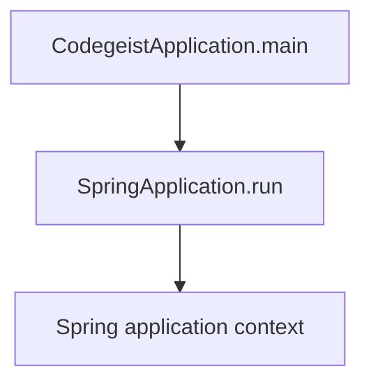
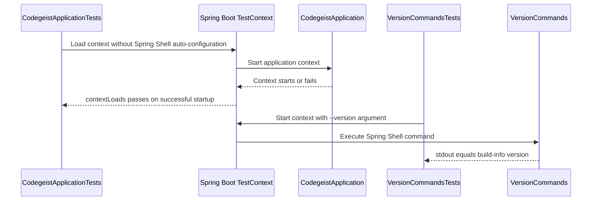

# Codegeist Architecture

Current-state architecture overview for coding agents and contributors.

## Scope

This document describes what exists in the repository now. It is not an
implementation backlog and must not be used as a source-generation checklist.

For future direction, use only the compact, current specification set under
`docs/developer/specification/`:

- `codegeist-opencode-parity.md` - behavior reference and OpenCode parity posture.
- `java-generation-guidance.md` - iterative Java/Spring implementation rules.
- `testing-strategy-and-agent-rules.md` - test-first workflow and timing rules.
- `runtime-vocabulary.md` - vocabulary only, not package or class requirements.
- `build-release-and-binary-smoke-strategy.md` and `native-packaging-posture.md` -
  packaging strategy for later implemented workflows.

## Current System State

Codegeist currently contains one Java/Spring Boot CLI application under
`app/codegeist/cli`. Implemented runtime behavior is Spring Boot application
startup plus a Spring Shell `--version` command that prints the build version.

The previous source-generation contracts and T004 implementation epic were removed
because they encouraged placeholder classes. Future implementation should start
from focused tests and add only the source needed by the current behavior.

## Build Baseline

The current application build is defined by `app/codegeist/cli/pom.xml`.

| Area | Current state |
| --- | --- |
| Module shape | Single Maven module under `app/codegeist/cli` |
| Group/artifact | `ai.codegeist:codegeist` |
| Java | `25` through `java.version` and `maven.compiler.release` |
| Spring Boot | Parent `spring-boot-starter-parent` `4.0.6` |
| Spring Shell | BOM `4.0.2`, dependency `spring-shell-starter` |
| Spring AI | BOM `2.0.0-M6` imported for dependency management |
| Spring AI Agent Utils | BOM and core artifact `0.7.0` |
| GraalVM | Native Maven profile using `native-maven-plugin` `0.10.6` |
| Packaging | Spring Boot executable jar named `target/codegeist.jar` |
| Tests | Spring Boot context-load test, Spring-context command test, focused version output tests, native version smoke, local Linux smoke, Windows QEMU smoke, and final local smoke suite |

Spring AI provider starters are not present. Spring AI Agent Utils is present as a
dependency baseline, but no Agent Utils runtime utility is wired into the app yet.

## Implemented File Layout

```text
app/codegeist/cli/
  pom.xml
  Taskfile.yml
  src/...
scripts/tests/
  native-smoke.sh
  local-linux-smoke.sh
  qemu-windows-vm.sh
  qemu-windows-smoke.sh
  windows-smoke.ps1
  final-smoke-suite.sh
  windows-qemu/
    autounattend.xml
    setup.ps1
```

Implemented Java package:

| Package | Current responsibility |
| --- | --- |
| `ai.codegeist.app` | Spring Boot application entrypoint and version command |

No other `ai.codegeist.*` application packages currently exist in source code.

## Application Entrypoint

`CodegeistApplication` is annotated with `@SpringBootApplication` and delegates
startup to `SpringApplication.run`. GraalVM resource inclusion is kept out of
Java code in `src/main/resources/META-INF/native-image/resource-config.json`,
which includes `logback.xml` and `META-INF/build-info.properties` for the native
binary.



## Runtime Components

Current behavior:

- `task run` builds the jar and runs `java -jar target/codegeist.jar`.
- The app starts a Spring Boot context using `application.yaml`.
- `application.yaml` sets `spring.application.name` to `codegeist`, disables the
  Spring banner, and sets `spring.shell.interactive.enabled=false` so command
  arguments such as `--version` run through Spring Shell's noninteractive runner.
- `--version` is implemented as a Spring Shell command in `VersionCommands`. It
  uses Spring Boot's `BuildProperties` bean, backed by the generated
  `META-INF/build-info.properties`, and writes through Spring Shell's
  `CommandContext.outputWriter()` so output is only the version string, for
  example `0.1.0-SNAPSHOT`.
- `logback.xml` writes logs only to `${LOG_FILE:-logs/codegeist.log}`. Console
  output is reserved for command output, so jar and packaged native `--version`
  smokes print only the version.
- There are no implemented prompt workflows, model calls, shell commands beyond
  `--version`, runtime services, provider adapters, tool executions, permission
  prompts, workspace policies, storage adapters, server endpoints, Vaadin views,
  PF4J plugins, or JBang execution paths.

## Test Architecture

`CodegeistApplicationTests` is a Spring Boot context-load test. It excludes
Spring Shell auto-configuration so bootstrap can be verified without starting an
interactive runner.

`VersionCommandsTests` starts the Spring context with
`VersionCommands.VERSION_COMMAND` as an argument and verifies that stdout equals
the generated build version while stderr stays empty.



## Taskfile Verification Flow

`app/codegeist/cli/Taskfile.yml` provides the current developer and local smoke
entrypoints. Test and smoke helper scripts live under `scripts/tests/`.

`scripts/tests/native-smoke.sh` defines `run-native-smoke-tests`, which owns the
Linux native archive smoke assertions used by `task native-smoke` and the Linux
smoke entrypoint. The function writes
`target/dist/codegeist-<version>-linux-x64.tar.gz`, unpacks it into a fresh temp
directory, runs packaged `./codegeist --version`, then writes the smoke log to
`target/smoke-test/codegeist.log`.

`scripts/tests/local-linux-smoke.sh` runs Maven tests, builds the jar, verifies
`java -jar target/codegeist.jar --version`, and verifies the packaged Linux native
archive when `native-image` is available.

`scripts/tests/qemu-windows-vm.sh` is the host-side Windows VM automation
entrypoint. It downloads the official Windows Server Evaluation ISO when no local
ISO exists, creates or starts the local Windows QEMU VM, generates answer media,
syncs the repo subset needed by smoke checks, and delegates execution to
`scripts/tests/qemu-windows-smoke.sh`.

`scripts/tests/qemu-windows-smoke.sh` is the lower-level SSH wrapper. It runs
`scripts/tests/windows-smoke.ps1` in the Windows VM. Missing Windows VM
configuration fails by default and can only be skipped when developer-only skip
mode is explicitly enabled.

`scripts/tests/final-smoke-suite.sh` runs the Linux and Windows smoke entrypoints.
Default mode requires Linux and Windows to pass and makes native checks required
by default. `--allow-skips` is the developer-only mode for machines without ISO
download or VM prerequisites.

| Task | Command | Proves |
| --- | --- | --- |
| `task test` | `mvn --batch-mode --no-transfer-progress test` | Maven test lifecycle, Spring context-load test, and version output test |
| `task build` | `mvn --batch-mode --no-transfer-progress -DskipTests clean package` | Executable jar packaging |
| `task native` | `mvn --batch-mode --no-transfer-progress -DskipTests -Pnative clean native:compile` | GraalVM command-mode native posture when practical |
| `task native-smoke` | Builds native, then sources `scripts/tests/native-smoke.sh` and calls `run-native-smoke-tests` | Linux native archive unpacks in a temp directory, packaged command output equals generated build version, and native smoke log file works |
| `task local-linux-smoke` | Runs `scripts/tests/local-linux-smoke.sh` | Local Linux jar smoke, Maven tests, and native smoke when native-image is available |
| `task qemu-windows-smoke` | Runs `scripts/tests/qemu-windows-vm.sh smoke` | Creates or starts the Windows QEMU VM and runs Windows jar/native smoke over SSH |
| `task final-smoke-suite` | Runs `scripts/tests/final-smoke-suite.sh` | Local Linux and Windows smoke suite; both platforms must pass by default |
| `task run` | `java -jar target/codegeist.jar` after `build` | Starts the packaged Spring Boot application |

## Not Implemented Yet

The following concepts are discussed in strategy docs but are not implemented in
Java source:

- Prompt workflows.
- Spring AI Ollama provider calls.
- Runtime orchestration.
- Session or event models.
- Context loading.
- Tool registry or tool execution.
- Permission approval flow.
- Workspace and file-access policy.
- Patch/edit proposal flow.
- Controlled shell execution.
- Storage ports or adapters.
- CLI/Spring Shell commands beyond `--version`.
- Headless server endpoints.
- Vaadin client.
- PF4J plugin loading.
- JBang extension execution.

When implementing any of these concepts, update this document in the same task so
future coding agents can distinguish current code from future direction.
