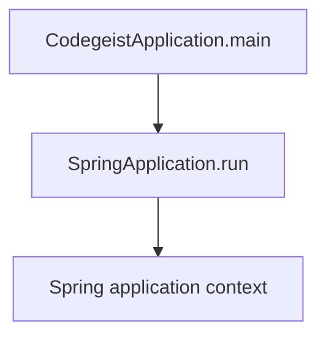
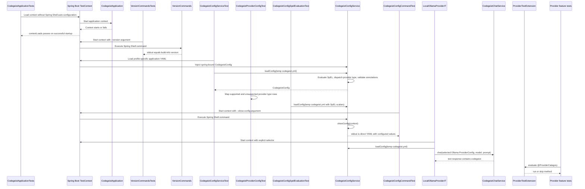

# Codegeist Architecture

Current-state architecture overview for coding agents and contributors.

## Scope

This document describes what exists in the repository now. It is not an
implementation backlog and must not be used as a source-generation checklist.

For future direction, use only the compact, current specification set under
`docs/developer/specification/`:

- `codegeist-opencode-parity.md` - behavior reference and OpenCode parity posture.
- `java-generation-guidance.md` - iterative Java/Spring implementation rules.
- `llm-provider-implementation.md` - provider-neutral `CodegeistChatModel<T>`
  pattern for mapping selected provider config into Spring AI chat models.
- `runtime-harness-implementation.md` - planned T007 runtime harness package,
  class, event, tool, permission, tool-callback, and storage implementation shape.
- `testing-strategy-and-agent-rules.md` - test-first workflow and timing rules.
- `runtime-vocabulary.md` - vocabulary only, not package or class requirements.
- `build-release-and-binary-smoke-strategy.md` and `native-packaging-posture.md` -
  packaging strategy for later implemented workflows.

For deeper current-state source-code documentation, use these focused architecture
docs:

- `source-code-documentation.md` - documentation strategy for implementation
  analysis, Spring interaction notes, diagrams, and task handoff value.
- `provider-configuration.md` - provider configuration source map, Spring binding,
  direct YAML loading, validation flow, tests, and sharp edges.
- `local-file-tools.md` - local read/list/glob/grep/write callback architecture,
  source map, tool contracts, recording behavior, and extension guidance.

## Current System State

Codegeist currently contains one Java/Spring Boot CLI application under
`app/codegeist/cli`. Implemented runtime behavior is Spring Boot application
startup, typed access-only provider config loading and validation, trusted local
SpEL preprocessing for explicit `codegeist.yml` files, direct workspace config
loading and active workspace resolution, provider-neutral one-turn chat execution
through a narrow `ChatHarnessService`, a lazily created Codegeist chat model that
wraps Spring AI Ollama and uses the runtime model name from the request, a Spring
Shell `--version` command that prints the build version, and a Spring Shell
`--show-config` command that prints the current Codegeist config as direct
`codegeist.yml` YAML with configured values unchanged. A Spring Shell `ask` command
sends one prompt to the first configured provider with that provider config's
default runtime model; with `-c/--continue`, it appends the prompt, bounded local
tool activity, and provider response to the newest session in
`.codegeist/session.json`. Codegeist-owned local read/list/glob/grep/write file
callbacks now reach provider calls through prompt-scoped Spring AI tool callbacks.
This is not yet an OpenCode-style coding-agent loop: Codegeist does not own a
repeated model/tool/model controller, streaming event loop, permission loop, or
multi-step agent driver.

The previous source-generation contracts and T004 implementation epic were removed
because they encouraged placeholder classes. Future implementation should start
from focused tests and add only the source needed by the current behavior.

## Build Baseline

The current application build is defined by `app/codegeist/cli/pom.xml`.

| Area | Current state |
| --- | --- |
| Module shape | Single Maven module under `app/codegeist/cli` |
| Group/artifact | `ai.codegeist:codegeist` |
| Java | `25` through `java.version` and `maven.compiler.release` |
| Spring Boot | Parent `spring-boot-starter-parent` `4.0.6` |
| Logging | Spring Boot default logging with SLF4J and Logback; application logs are file-only through `logback.xml` |
| Spring Shell | BOM `4.0.2`, dependency `spring-shell-starter` |
| Jackson | `jackson-databind` plus `jackson-dataformat-yaml` for direct YAML-to-POJO config mapping |
| Lombok | `1.18.46`, configured as an explicit annotation processor for Java 25 |
| Spring AI | BOM `2.0.0-M6` imported for dependency management; `spring-ai-ollama` is present for programmatic local Ollama `ChatModel` creation |
| Spring AI Agent Utils | BOM and core artifact `0.7.0` |
| GraalVM | Native Maven profile using `native-maven-plugin` `0.10.6` |
| Packaging | Spring Boot executable jar named `target/codegeist.jar` |
| Release CI | `.github/workflows/release.yml` validates versioned JVM and native artifacts on GitHub-hosted Linux, Windows, and macOS runners, and publishes GitHub Releases only from `v*` tags |
| Tests | Spring Boot context-load test, Spring-context command tests, focused version output test, focused config command test, focused config service test, focused provider dispatch test, focused config SpEL test, focused workspace config/resolver/output-bound/local-file-tool tests, focused session store tests, provider feature tests gated by `CODEGEIST_TEST_PROVIDER_CATEGORY`, focused real local Ollama `ask` command test, focused local Ollama provider integration test behind an explicit selector, native version/config/ask smoke, local Linux smoke, Windows QEMU smoke, and final local smoke suite |

Spring AI provider starters are not present. The Ollama provider dependency is
used programmatically instead of through global Spring AI auto-configuration.
Spring AI Agent Utils is present as a dependency baseline, but no Agent Utils
runtime utility is wired into the app yet.

## Implemented File Layout

```text
.github/workflows/
  release.yml
app/codegeist/cli/
  pom.xml
  Taskfile.yml
  src/...
scripts/tests/
  native-smoke.sh
  local-linux-smoke.sh
  qemu-windows-vm.sh
  qemu-windows-smoke.sh
  windows-smoke.ps1
  final-smoke-suite.sh
  windows-qemu/
    autounattend.xml
    setup.ps1
```

Implemented Java package:

| Package | Current responsibility |
| --- | --- |
| `ai.codegeist.app` | Spring Boot application entrypoint, version command, and shared command exception mapping |
| `ai.codegeist.app.chat` | Provider-neutral one-turn chat harness, runtime chat execution context, chat service, generic `CodegeistChatModel<T extends ProviderConfig>` base, the local Ollama chat model, and the `ask` Spring Shell command with optional session continuation |
| `ai.codegeist.app.config` | Top-level config root models, the central root parser, typed provider and MCP config root elements, explicit Java-registry provider type dispatch, qualified YAML `ObjectMapper` bean, direct YAML SpEL preprocessing, config service, config command, merged-config injection behavior, and validation exception |
| `ai.codegeist.app.session` | Versioned session-store model defaulting to `.codegeist/session.json`, JSON mapper, clock component, and service for loading, saving, selecting the newest session, and appending text exchanges |
| `ai.codegeist.app.tool` | Active workspace resolution, deterministic tool-output bounds, scoped tool runs, and Codegeist-owned local read/list/glob/grep/write Spring AI callbacks that record bounded tool parts. MCP callbacks are not implemented yet. |

No other `ai.codegeist.*` application packages currently exist in source code.

## Application Entrypoint

`CodegeistApplication` is annotated with `@SpringBootApplication` and delegates
startup to `SpringApplication.run`. GraalVM metadata is kept out of Java code in
`src/main/resources/META-INF/native-image/`: `resource-config.json` includes
`logback.xml` and `META-INF/build-info.properties`, and `reflect-config.json`
registers config root elements and config POJOs for Jackson binding in the native
binary.



## Runtime Components

Current behavior:

- `task run` builds the jar and runs `java -jar target/codegeist.jar`.
- The app starts a Spring Boot context using `application.yaml`.
- `application.yaml` sets `spring.application.name` to `codegeist`, disables the
  Spring banner, and sets `spring.shell.interactive.enabled=false` so command
  arguments such as `--version` run through Spring Shell's noninteractive runner.
- `CodegeistApplication.APP_NAME` is the shared application name and Spring
  configuration prefix constant.
- The provider configuration slice lives under `ai.codegeist.app.config`.
  `provider-configuration.md` is the focused source-code documentation for this
  slice.
- Spring `@Service` and `@Component` classes use Lombok `@Slf4j` for debug-level
  lifecycle, command, loading, validation, and bean-creation messages. With the
  current file-only Logback setup, these debug messages go to `LOG_FILE` when
  `logging.level.root=DEBUG` or `LOGGING_LEVEL_ROOT=DEBUG` is set.
- `CodegeistConfig` is the root config container. It stores parsed
  `CodegeistConfigRootElement` instances instead of one Java field per top-level
  YAML root. `CodegeistConfigService` parses direct `codegeist.yml` roots by
  delegating top-level root parsing to the central `CodegeistConfigRootParser`.
  `application.yaml` is not a Codegeist config source. The provider root is
  `provider:`; there is no `providers:` alias. `CodegeistConfigRootParser` owns
  shared root-shape validation and `type` dispatch for typed root entries.
  `ProvidersRootElement` stores a `ProvidersConfig` list-backed element,
  `McpClientsRootElement` stores a `McpClientsConfig` list-backed element whose ids
  come from YAML keys, and `WorkspaceRootElement` stores the direct `workspace:`
  object shape.
- `CodegeistConfigElement` is the abstract base class for every config payload shape,
  including single objects, typed entries, and list-backed keyed objects.
  `CodegeistTypedConfigElement` owns the shared validated `type` field and Lombok
  getter/setter for entries that have a dispatch or transport type.
  `CodegeistConfigKeyedListElement<T>` owns the shared
  list state and transient YAML-object rendering for roots such as `provider:` and
  `mcp:`.
  `CodegeistConfigRootElement<T>` owns a generic validated `T config` slot for
  root payloads, so collection-shaped roots no longer keep side-list fields next to
  `config`. Root element subclasses are not Spring components.
  `ProviderConfig` is the abstract base class for typed provider map values.
  The required provider object field `type` dispatches through the explicit
  `CodegeistConfigRootParser` registry to concrete data-only provider config classes
  for `ollama` and `openai`. The parser also copies that validated value into the
  shared base field, while runtime/output type is still returned by each concrete
  provider config's `getType()` constant. Broader provider-matrix and
  OpenCode-only types remain unsupported in this task.
  Provider classes validate only local config completeness; they do not store model
  names, create Spring AI clients, or call providers.
- `CodegeistChatRequest` and `CodegeistChatResponse` are provider-neutral records
  for one runtime model name, prompt, and text response. `CodegeistChatRequest` does
  not carry the selected provider, selected tools, or session state; callers pass the
  validated `ProviderConfig` separately to `CodegeistChatService`, and prompt-scoped
  tools travel through `CodegeistChatExecutionContext`. Model names, generation
  options, enablement, and completion-path routing are not part of `ProviderConfig`.
- `ChatHarnessService` is a Spring `@Service` that owns one non-streaming prompt
  turn for `ask` and future UI callers. It selects the default provider and
  provider-owned default model from `CodegeistConfig`, resolves the active workspace,
  opens a scoped `CodegeistToolRun`, calls `CodegeistChatService` with the runtime
  context, saves prompt, recorded tool parts, and assistant text through
  `SessionStoreService`, then returns the `CodegeistChatResponse` for the command
  layer to print. It does not reconstruct provider-facing context from stored
  sessions, and it does not implement an OpenCode-style iterative coding-agent loop;
  any tool-use continuation inside the provider call is delegated to Spring AI's
  chat-model tool-calling behavior for the current prompt.
- `CodegeistChatExecutionContext` is a runtime-only record with the active working
  directory and prompt-scoped Spring AI `ToolCallback` values. It defensively copies
  callback lists and provides an array helper for Spring AI APIs. It is never stored
  in `.codegeist/session.json`.
- `CodegeistChatService` is a Spring `@Service` that validates one request, finds a
  `CodegeistChatModel` by asking the selected `ProviderConfig` to
  `createChatModel()`, calls it with the runtime model and prompt from
  `CodegeistChatRequest` plus an optional `CodegeistChatExecutionContext`, and
  returns the first response text.
- `CodegeistChatModel<T extends ProviderConfig>` is the abstract Codegeist provider
  model base. It stores the typed provider config only; runtime model selection
  arrives at call time through `CodegeistChatRequest`. The context-aware call method
  is the only provider implementation contract. Older no-tool callers use the
  no-context `CodegeistChatService` overload, which supplies an empty
  `CodegeistChatExecutionContext` before invoking the model.
- `OllamaChatModel` is the first concrete provider model. It receives
  `OllamaProviderConfig`, builds `OllamaApi` from `base-url`, builds
  `OllamaChatOptions` from the runtime model and prompt-scoped tool callbacks when a
  request is called, and delegates to Spring AI's Ollama chat model.
  Ollama-specific Spring AI imports stay isolated in this class.
- `CodegeistConfigYamlMapper` is the concrete Spring service and Jackson mapper for
  direct `codegeist.yml` parsing and rendering. It owns helper methods for reading
  empty-safe config source trees, rendering list-backed keyed config elements as
  provider-style YAML objects, and writing direct config YAML without a `codegeist:`
  wrapper.
- `CodegeistYamlExpressionEvaluator` is a Spring service that receives
  `CodegeistConfigYamlMapper` and evaluates SpEL only in direct-YAML string scalar
  values.
- `CodegeistConfigRootParser` is the central Spring parser for top-level direct YAML
  roots. It receives `CodegeistConfigYamlMapper`, owns unsupported-root errors, and
  now uses explicit parser methods for `provider:`, `mcp:`, and `workspace:` instead
  of generic root-shape helpers. Provider entries dispatch through a compact explicit
  registry; MCP entries copy the YAML key into `McpClientConfig.id`.
- `CodegeistConfigService` receives the root parser, config mapper, SpEL evaluator,
  validator, and command output service as final collaborators
  through Lombok `@RequiredArgsConstructor`. Its `configPath` remains a non-final
  `@Value` field for the injected `codegeist.config` property.
  Its `loadCurrentConfig` `@Primary` bean parses the configured
  `codegeist.config` file when that property is set and otherwise returns the empty
  default config. Normal app components inject `CodegeistConfig` by type to receive
  that primary config.
  `loadConfig(String configPath)` reads an explicit YAML file path into a Jackson
  tree, evaluates SpEL only in string scalar values containing `#{`, delegates each
  top-level root to `CodegeistConfigRootParser`, then runs
  `jakarta.validation.Validator` and reports constraint failures through
  `CodegeistConfigValidationException` with source-path context. Jackson mapping
  and IO failures surface directly through Lombok `@SneakyThrows`.
  `loadCurrentConfig()` loads the configured `codegeist.config` path, typically
  supplied as `-Dcodegeist.config=<path>` at startup, otherwise it returns the
  empty default config. `toYaml(...)` renders direct `codegeist.yml` YAML with no
  `codegeist:` wrapper, no YAML document marker, configured values unchanged, and
  no synthetic roots for an empty config.
- `WorkspaceRootElement` parses optional direct `codegeist.yml` `workspace:`
  objects into the inherited generic `CodegeistConfigRootElement<WorkspaceConfig>`
  config slot. Implemented `WorkspaceConfig` fields are nullable `directory` and
  `encoding`. Omitted or blank `directory` values let the resolver fall back to the
  process working directory. Omitted or blank `encoding` values make local file tools
  use UTF-8; configured values must be supported Java charset names. The root does
  not define permission rules, path safety fields, ignored-file behavior, write
  protection, or symlink rules.
- `WorkspaceResolver` is a Spring component under `ai.codegeist.app.tool`. It reads
  the active `CodegeistConfig`, uses `${user.dir}` as the process working directory,
  returns that directory when no workspace override is configured, normalizes
  absolute overrides, and resolves relative overrides against the process working
  directory. It intentionally allows filesystem roots, paths outside the repository,
  and normalized traversal segments because this slice is workspace resolution, not
  workspace policy.
- `ToolOutputBounds` is a Spring component under `ai.codegeist.app.tool`. It
  centralizes deterministic string capping for future model-visible and persisted
  tool output: preview text is capped at `MAX_PREVIEW_CHARS`, single-line previews
  and normalized error previews are capped at `MAX_LINE_CHARS`, result limits are
  capped at `MAX_RESULTS`, and read limits are capped at `DEFAULT_READ_LINES`.
  Bounds return strings or integer limits only; no truncation metadata object exists.
- `CodegeistLocalTools` is a Spring component under `ai.codegeist.app.tool`. It is
  the generic callback assembler for Codegeist-owned local Spring AI callbacks,
  including the five implemented file callbacks:
  `codegeist_read`, `codegeist_list`, `codegeist_glob`, `codegeist_grep`, and
  `codegeist_write`. Package-private Spring components `CodegeistReadFileTool`,
  `CodegeistListFileTool`, `CodegeistGlobFileTool`, `CodegeistGrepFileTool`, and
  `CodegeistWriteFileTool` own each operation and its callback name, while the
  package-private Spring component `CodegeistFileToolSupport` owns shared JSON
  parsing, schema, active workspace lookup, path, configured-charset text readers,
  binary, and glob helpers.
  `CodegeistToolInput` wraps the raw JSON payload at the local-tool boundary and
  normalizes blank input to `{}` before file-tool parsing.
  `CodegeistToolJsonMapper` is the package-private Jackson mapper used for local
  tool input JSON, separate from config YAML and session-store mappers.
  `CodegeistFileEncoding` resolves the global local file-tool charset from
  `workspace.encoding`, defaulting to UTF-8.
  `CodegeistLocalTools` injects discovered tools as a `List<CodegeistLocalTool>` and
  treats callback order as non-semantic because tools are selected by name. Each file
  callback resolves relative paths against the active workspace, accepts absolute
  caller paths, returns only bounded model-visible text, and records the same bounded
  preview in a `ToolSessionPart` through a caller-provided recorder. Read rejects
  missing paths, directories, and binary or malformed files for the configured
  workspace encoding; list is
  non-recursive with `[DIR]` and `[FILE]` markers; glob uses Java NIO glob matching
  without shelling out; grep uses Java regex over text files and records invalid
  regex as a failed tool result; write creates or overwrites one regular text file
  using the configured workspace encoding without creating parent directories.
  `CodegeistLocalToolCallback` is the
  package-local wrapper that translates handled local tool failures into bounded
  failed tool parts.
- `CodegeistToolService` is a Spring `@Service` under `ai.codegeist.app.tool`. It
  opens one `CodegeistToolRun` per chat turn, asks `CodegeistLocalTools` for local
  callbacks, and shares one ordered recorder list with those callbacks. The returned
  `DefaultCodegeistToolRun` exposes a `CodegeistChatExecutionContext` and defensive
  copies of recorded `ToolSessionPart` values. It is intentionally not closeable
  until the MCP slice adds real resources to clean up.
- `--show-config` is implemented as a Spring Shell command in
  `CodegeistConfigService`. The service resolves the current global config policy,
  renders YAML, and writes only that YAML through `CommandOutputService`.
- `--version` is implemented as a Spring Shell command in `VersionCommands`. It
  uses Spring Boot's `BuildProperties` bean, backed by the generated
  `META-INF/build-info.properties`, and writes through `CommandOutputService` so
  output is only the version string, for
  example `0.1.0-SNAPSHOT`. Its debug log is file-only and does not pollute
  command stdout.
- `logback.xml` writes logs only to `${LOG_FILE:-logs/codegeist.log}`. Console
  output is reserved for command output, so jar `--version` smokes print only the
  version and packaged native `--show-config` smokes print only direct YAML.
- `CodegeistCommandExceptionMapper` is the shared Spring Shell command-boundary
  mapper. Commands reference it through `@Command(exitStatusExceptionMapper = ...)`,
  throw domain exceptions directly, and let the mapper log the exception and return
  a user-facing `ExitStatus` description. Corrupt existing session-store JSON maps
  to the user-facing message `No session to continue`.
- `ask` is implemented as a Spring Shell command in `AskCommands`. It accepts one
  positional prompt parameter plus optional `-c/--continue`, delegates the prompt turn
  to `ChatHarnessService`, and writes only the returned model response to stdout
  through `CommandOutputService`. The harness selects the first configured provider
  through optional `CodegeistConfig.defaultProvider()`, fails at the command boundary
  when none exists, uses `ProviderConfig.defaultModel()`, opens local tool callbacks,
  calls `CodegeistChatService`, and saves the turn through `SessionStoreService`.
  Without `-c/--continue`, the service creates a new session. With `-c/--continue`,
  it appends to the newest existing session when one exists, creates a session for
  missing or empty stores, and refuses corrupt JSON stores instead of overwriting
  them. The current Ollama provider default is `llama3.2:1b`.
- `SessionStoreService` owns session-store file paths, JSON I/O, and clock input;
  `SessionStore` owns in-memory store changes such as creating a store, adding a
  session, selecting the latest session, and appending a prompt/response exchange.
  The store root has `schemaVersion`, `workingDir`, timestamps, and a list of
  `CodegeistSession` values. Each session owns chronological `SessionMessage`
  values with `SessionMessageRole` and ordered `SessionPart` values. Implemented
  part types are `TextSessionPart`, `CompactionSessionPart`, and the additive
  `ToolSessionPart` for bounded completed or failed tool activity. Tool parts persist
  only the tool name, nested `ToolSessionPart.ToolSessionPartStatus`, and bounded
  `outputPreview`. Local file callbacks can now record these bounded parts; MCP
  callbacks, provider tool wiring, patch/edit, shell, reasoning, and step parts are
  deferred until focused tool tasks add the matching execution paths. `SessionStore`
  is a Lombok getter/setter/builder class with a default empty session list;
  session, message, and existing part model entries stay records or Jackson-bound
  classes as implemented. The JSON mapper registers Java time support, emits ISO
  instants, omits null fields, and writes inspectable JSON. Native reflection
  metadata includes the session model types and part implementations.
  `CodegeistSpringAppProperties` binds Spring application configuration under
  `codegeist.session.*` and owns the built-in default
  `.codegeist/session.json` path. External Spring `application.yaml` values or
  `CODEGEIST_SESSION_DIRECTORY` and `CODEGEIST_SESSION_STORE_FILE` environment
  variables can override the path. These settings are not part of direct
  `codegeist.yml` provider/tool configuration.
- The default `.codegeist/session.json` store does not store API keys, OAuth tokens,
  cloud credentials, evaluated secret values, provider config, selected provider,
  selected model, MCP client definitions, enabled tool definitions, permission rules,
  runtime status, or TUI layout state. Provider, model, MCP, tool, permission,
  runtime, and UI state are resolved from current runtime configuration when a
  session continues.
- There is no implemented provider-facing model-context reconstruction from stored
  sessions yet. Continuing a session currently persists the new turn but still sends
  the current prompt as a one-turn `CodegeistChatRequest`.
- There are no implemented streaming output, provider flags, model flags, provider
  chat tool wiring, MCP callbacks, permission prompts, workspace or file-access
  policies beyond active workspace resolution, server endpoints, Vaadin views, PF4J
  plugins, or JBang execution paths.

## Test Architecture

`CodegeistApplicationTests` is a Spring Boot context-load test. It excludes
Spring Shell auto-configuration so bootstrap can be verified without starting an
interactive runner.

`VersionCommandsTests` starts the Spring context with
`VersionCommands.VERSION_COMMAND` as an argument and verifies that stdout equals
the generated build version while stderr stays empty.

`CodegeistCommandExceptionMapperTest` proves command-boundary exceptions are mapped
to user-facing `ExitStatus` descriptions, including wrapped no-session causes.

`CodegeistConfigCommandTest` starts the Spring context with
`CodegeistConfigService.SHOW_CONFIG_COMMAND` and an explicit `codegeist.config`
fixture path. It verifies stdout is parseable direct Codegeist YAML, excludes the
`codegeist:` Spring wrapper and YAML document marker, includes configured provider
values, and keeps stderr empty.

`CodegeistConfigServiceTest` proves unqualified `CodegeistConfig` injection receives
the parsed `codegeist.config` fixture. It writes temporary `codegeist.yml` files and
proves `loadConfig(String)` maps provider-specific and MCP fields. It proves the
injected `codegeist.config` property is the current global config source when set at
context startup. Validation coverage proves blank provider ids and present-but-blank
provider names are rejected, while an omitted provider name remains valid.

`CodegeistWorkspaceConfigTest` proves direct `codegeist.yml` can load optional
`workspace.directory`, accepts omitted and blank workspace configuration so the
resolver can fall back later, and rejects a present non-object `workspace:` root with
a focused validation message.

`CodegeistProviderConfigTest` proves the supported `ollama` and `openai` provider
types map through the explicit Java registry to the
expected concrete config class. It also proves missing `type`, unsupported provider
types, broader provider-matrix types, out-of-scope OpenCode-only provider types,
and selected provider-specific required-field failures are rejected without creating
provider clients.

`CodegeistConfigSpelEvaluationTest` proves direct YAML SpEL evaluation is limited
to string scalar values containing `#{`, whole expressions can preserve boolean,
numeric, and null scalar results, YAML keys remain literal, and SpEL failures
include source and YAML path context without printing secret material.

`LocalOllamaProviderIT` is an explicitly selected live integration test. It starts
the Spring context without Spring Shell auto-configuration, loads a temporary
`codegeist.yml` through `CodegeistConfigService.loadConfig(String)`, and calls
`CodegeistChatService` with the selected provider config plus a request that carries
the runtime model and a narrow one-turn prompt. The test does not run a separate
model-list preflight, does not pull, download, create, or delete models, and does
not run in the ordinary broad suite unless selected with
`task test TEST=LocalOllamaProviderIT`.

`OpenAiProviderTest` and `OllamaProviderTest` are provider feature test classes
that run through `task test`. Provider methods use `ProviderCategory` and
`ProviderTestExtension` so `CODEGEIST_TEST_PROVIDER_CATEGORY` selects the highest
category to run. Categories are `none`, `local`, `remote_free`, and
`remote_paid`; `none` is the default and runs no annotated provider feature
methods. `remote_paid` is the explicit cost and rate-limit opt-in. Set
`CODEGEIST_TEST_PROVIDER_CATEGORY=local` for local Ollama provider calls. `task
test` starts Ollama before Maven for every test run.

`AskCommandsTest` is a real local Ollama command test gated at class level by
`CODEGEIST_TEST_PROVIDER_CATEGORY=local`. It uses `@SpringBootTest` with `ask`
arguments, writes a test config file under `target/provider-tests`, supplies
`codegeist.config` through Spring dynamic properties, and verifies the captured
model response contains `codegeist`.

`SessionStoreServiceTest` is the focused session persistence test. It uses a temp
working directory, fixed clock, and the session-store JSON mapper to prove newest
session selection, user/assistant text part persistence, multiple sessions,
missing/empty store session creation, corrupt-store failure, compaction part plus
parent-linked summary message round-tripping, and absence of representative runtime
config and secret fields in serialized `.codegeist/session.json`.

`AskCommandsSessionStoreTest` is the focused provider-free command-adapter test. It
injects a stub `ChatHarnessService`, calls `AskCommands` directly for plain and
continued `ask` paths, verifies stdout remains the returned response text only,
checks the continue flag delegation, and checks Spring Shell parsing for both
`ask -c "prompt"` and `ask --continue "prompt"`.

`ChatHarnessServiceTest` is the focused provider-free harness test. It uses
hand-written fakes for provider config, chat service, tool run, and workspace
resolution plus a real `SessionStoreService` with a temp directory and fixed clock to
prove tool callbacks reach the chat path and recorded `ToolSessionPart` values are
saved before the assistant text.

`CodegeistChatServiceTest` proves the context-aware chat overload passes
`CodegeistChatExecutionContext` to the selected provider model, the no-context
service overload uses an empty execution context, and `CodegeistChatRequest` still has
exactly `model` and `prompt` record components.

`WorkspaceResolverTest` proves active workspace fallback, absolute overrides,
relative overrides, filesystem root support, and traversal-segment normalization
without treating those configured values as policy violations.

`ToolOutputBoundsTest` proves deterministic preview capping, line capping, result
limit capping, read-limit defaults and caps, and normalized bounded error previews.

`CodegeistLocalToolsTest` uses temp-directory fixtures to prove the five local file
callbacks expose stable names and schemas, resolve relative paths from the active
workspace, return bounded model-visible text, record the same bounded preview in
`ToolSessionPart`, and handle focused read/list/glob/grep/write success and failure
paths without provider calls.

`CodegeistToolServiceTest` proves one prompt-scoped tool run exposes local callbacks
through `CodegeistChatExecutionContext`, records completed tool parts in call order,
and returns defensive copies of completed tool parts.



## Taskfile Verification Flow

`app/codegeist/cli/Taskfile.yml` provides the current developer and local smoke
entrypoints. Test and smoke helper scripts live under `scripts/tests/`.

`scripts/tests/native-smoke.sh` defines `run-native-smoke-tests`, which owns the
Linux native archive smoke assertions used by `task native-smoke` and the Linux
smoke entrypoint. The function writes
`target/dist/codegeist-linux-x64.tar.gz`, unpacks it into a fresh temp directory,
runs packaged `./codegeist --version`, `./codegeist --show-config`, and a real
Ollama-backed `./codegeist -Dcodegeist.config=<smoke-yml> ask <prompt>`, then writes
the smoke log to `target/smoke-test/codegeist.log`.

`scripts/tests/local-linux-smoke.sh` runs Maven tests, builds the jar, verifies
`java -jar target/codegeist.jar --version`, starts host Ollama through
`task ollama-start`, verifies jar `ask` with `-Dcodegeist.config=<smoke-yml>`, and
verifies the packaged Linux native archive `--version`, `--show-config`, and `ask`
output when `native-image` is available.

`scripts/tests/qemu-windows-vm.sh` is the host-side Windows VM automation
entrypoint. It downloads the official Windows Server Evaluation ISO when no local
ISO exists, creates or starts the local Windows QEMU VM, generates answer media,
starts host Ollama through `task ollama-start`, syncs the repo subset needed by
smoke checks, and delegates execution to `scripts/tests/qemu-windows-smoke.sh`.

`scripts/tests/qemu-windows-smoke.sh` is the lower-level SSH wrapper. It runs
`scripts/tests/windows-smoke.ps1` in the Windows VM. The Windows-side script uses
`http://10.0.2.2:11434` by default to reach the host Ollama service through QEMU
user networking, then verifies jar/native `ask` with a guest-local smoke config.
Missing Windows VM configuration fails by default and can only be skipped when
developer-only skip mode is explicitly enabled.

`scripts/tests/final-smoke-suite.sh` runs the Linux and Windows smoke entrypoints.
Default mode requires Linux and Windows to pass and makes native checks required
by default. `--allow-skips` is the developer-only mode for machines without ISO
download or VM prerequisites.

| Task | Command | Proves |
| --- | --- | --- |
| `task test` | Runs `ollama-start` with `OLLAMA_ENTER=false`, then `mvn --batch-mode --no-transfer-progress {{if .TEST}}-Dtest={{.TEST}} {{end}}test` | Taskfile-managed Ollama startup, Maven test lifecycle, Spring context-load test, version output test, provider feature tests gated by `CODEGEIST_TEST_PROVIDER_CATEGORY`, and optional focused selector such as `task test TEST=CodegeistApplicationTests` |
| `task build` | `mvn --batch-mode --no-transfer-progress -DskipTests clean package` | Executable jar packaging |
| `task native` | `mvn --batch-mode --no-transfer-progress -DskipTests -Pnative clean native:compile` | GraalVM command-mode native posture when practical |
| `task native-smoke` | Builds native, then sources `scripts/tests/native-smoke.sh` and calls `run-native-smoke-tests` | Linux native archive unpacks in a temp directory, packaged `--version` output equals generated build version, packaged `--show-config` output equals `{}` for the empty default config, packaged `ask` reaches host Ollama, and native smoke log file works |
| `task local-linux-smoke` | Runs `scripts/tests/local-linux-smoke.sh` | Local Linux jar smoke, Maven tests, real Ollama-backed jar `ask`, and native smoke when native-image is available |
| `task qemu-windows-smoke` | Runs `scripts/tests/qemu-windows-vm.sh smoke` | Creates or starts the Windows QEMU VM, starts host Ollama through `task ollama-start`, and runs Windows jar/native smoke over SSH |
| `task final-smoke-suite` | Runs `scripts/tests/final-smoke-suite.sh` | Local Linux and Windows smoke suite; both platforms must pass by default |
| `task ollama-start` | Starts or reuses the local `ollama/ollama` container, waits for `/api/version`, and ensures the selected model is present | External local Ollama prerequisite for focused live provider tests and Linux/Windows `ask` smokes |
| `task run` | `java -jar target/codegeist.jar` after `build` | Starts the packaged Spring Boot application |

## GitHub Release Flow

`.github/workflows/release.yml` is the implemented GitHub-hosted release build
path. It accepts three trigger shapes:

- push to `release/v*` for iteration-branch and release-candidate validation
  without publishing;
- `workflow_dispatch` for pre-tag validation or reruns without publishing;
- push to `v*` tags for release-cycle automation and GitHub Release publication.

The workflow resolves a non-SNAPSHOT SemVer release version, passes it to Maven as
`-Drevision=<version>`, runs Maven tests before packaging, builds and smoke-tests a
versioned JVM jar, then builds native archives on GitHub-hosted Linux x64, Windows
x64, and macOS x64 runners. Native archive smoke runs `--version` and
`--show-config` from the extracted package directory. The Windows native job
activates the MSVC tools environment before running Maven native compilation. The
checksum job generates and verifies `SHA256SUMS.txt`; the release job uploads the
jar, native archives, and checksum file to a published GitHub Release only for
matching `v*` tags.

Release workflow changes are promoted through `/codegeist-release --source
<release-work-branch> --rc <n>` instead of merging a multi-commit work branch
directly. The command infers SemVer from the diff between the latest reachable
release tag and the source commit, creates a matching
`release/v<version>-github-release-build` validation branch when the source is not
already versioned, creates `release/v<version>-codegeist-rc-<n>` from current
`main`, writes one detailed squash commit, validates the candidate branch, and
advances `main` by fast-forward only before tagging and publication. After the
published release assets verify, the release command moves the lightweight
`latest` tag to the same commit as the verified `v*` release tag and creates or
updates the `latest` GitHub Release with the same downloaded assets. The `latest`
release does not run another build.
When synchronized `main` already contains the release-ready diff, the same command
may release directly from `main`, infer SemVer from `last-tag..main`, skip
validation-source and candidate branches, and start at pre-tag validation.

The implemented release artifact names are:

- `codegeist-jvm.jar`
- `codegeist-linux-x64.tar.gz`
- `codegeist-windows-x64.zip`
- `codegeist-macos-x64.tar.gz`
- `SHA256SUMS.txt`

## Not Implemented Yet

The following concepts are discussed in strategy docs but are not implemented in
Java source:

- Provider-facing multi-turn prompt reconstruction from stored sessions.
- Provider selection policy beyond the caller supplying one validated
  `ProviderConfig`.
- Runtime orchestration.
- Event models beyond persisted session messages and parts.
- Context loading.
- Provider-wired tool execution, MCP callback execution, and a broader tool registry.
- Permission approval flow.
- Workspace and file-access policy beyond active workspace resolution and the stored
  session `workingDir` value.
- Patch/edit proposal flow.
- Controlled shell execution.
- Storage ports or adapters beyond local `.codegeist/session.json` persistence.
- CLI/Spring Shell commands beyond `--version`, `--show-config`, and `ask`.
- Headless server endpoints.
- Vaadin client.
- PF4J plugin loading.
- JBang extension execution.

When implementing any of these concepts, update this document in the same task so
future coding agents can distinguish current code from future direction.
