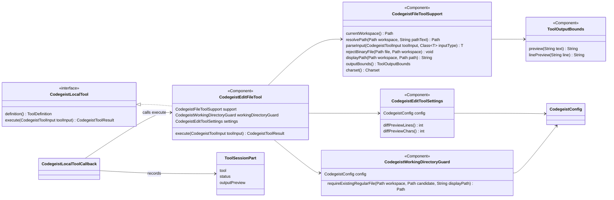
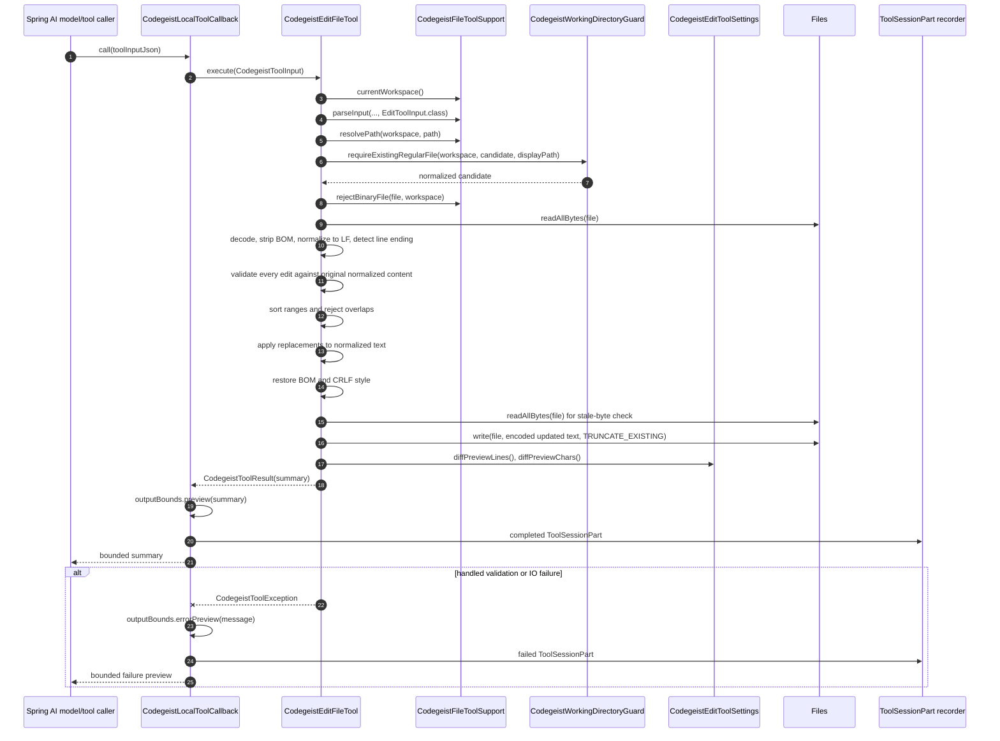

# Codegeist Edit Tool Architecture

Detailed current-state developer documentation for the implemented
`codegeist_edit` local file tool.

## Scope

This document describes the exact edit tool implemented under
`ai.codegeist.app.tool`. It covers the public tool contract, Spring component
model, direct `codegeist.yml` settings, path containment, text normalization,
multi-edit planning, stale-write protection, output summaries, session recording,
tests, and maintenance constraints.

This document does not describe a structured patch tool, shell execution,
permission prompts, ignored-file policy, TUI diff rendering, fuzzy matching,
OpenCode-compatible `oldString`/`newString` input, or a full coding-agent control
loop. Those surfaces are separate or deferred tasks.

## Current Status

`codegeist_edit` is a Codegeist-owned Spring AI local tool callback. It mutates one
existing text file by applying one or more exact replacements. Each replacement is
matched against the original LF-normalized file content. Every `oldText` must match
exactly once, all replacement ranges must be disjoint, and the file is written once
only after the full request has passed validation.

The tool is intentionally exact-only. It does not create files, does not apply fuzzy
patches, does not accept legacy single-edit top-level fields, and does not expand
`ToolSessionPart` with typed edit metadata. The model-visible result and persisted
session part remain a bounded text summary.

## Source Map

| File | Role |
| --- | --- |
| `app/codegeist/cli/src/main/java/ai/codegeist/app/tool/CodegeistEditFileTool.java` | Package-private Spring component implementing the `codegeist_edit` callback contract, exact match planning, source normalization, stale-write check, and bounded summary. |
| `app/codegeist/cli/src/main/java/ai/codegeist/app/tool/CodegeistEditToolSettings.java` | Package-private Spring component resolving `tools.codegeist-edit` preview limits from direct `codegeist.yml` with safe defaults and caps. |
| `app/codegeist/cli/src/main/java/ai/codegeist/app/tool/CodegeistWorkingDirectoryGuard.java` | Package-private Spring component that keeps side-effecting file targets inside the active workspace unless `workspace.dir-guard-disabled` is explicitly true. |
| `app/codegeist/cli/src/main/java/ai/codegeist/app/tool/CodegeistFileToolSupport.java` | Shared helper for workspace resolution, path rendering, JSON parsing, schemas, configured charset, binary sampling, and common path/text failures. |
| `app/codegeist/cli/src/main/java/ai/codegeist/app/tool/CodegeistLocalTools.java` | Assembles all Spring-injected `CodegeistLocalTool` implementations into Spring AI `ToolCallback` values. It does not know edit-specific behavior. |
| `app/codegeist/cli/src/main/java/ai/codegeist/app/tool/CodegeistLocalToolCallback.java` | Wraps local tool execution, returns bounded output to the model, and records completed or failed `ToolSessionPart` values. |
| `app/codegeist/cli/src/main/java/ai/codegeist/app/config/ToolsRootElement.java` | Direct `tools:` root model. |
| `app/codegeist/cli/src/main/java/ai/codegeist/app/config/ToolsConfig.java` | Direct `tools:` payload currently containing the `codegeist-edit` nested config. |
| `app/codegeist/cli/src/main/java/ai/codegeist/app/config/CodegeistEditToolConfig.java` | Direct `tools.codegeist-edit:` payload for diff preview line and character limits. |
| `app/codegeist/cli/src/test/java/ai/codegeist/app/tool/CodegeistLocalToolsTest.java` | Main contract coverage for edit schema, path behavior, exact matching, multi-edit planning, stale-write failure, output bounds, and recording. |
| `app/codegeist/cli/src/test/java/ai/codegeist/app/config/CodegeistToolsConfigTest.java` | Direct YAML parser coverage for `tools.codegeist-edit` settings and root shape failures. |
| `scripts/tests/artifact-smoke.ps1` | Shared native-only artifact smoke harness used by local platform wrappers and release CI. It delegates edit-specific side-effect checks to `file-edit-ask-smoke.ps1`. |
| `scripts/tests/file-edit-ask-smoke.ps1` | Focused artifact sub-harness. It runs the real `ask` command against a deterministic Ollama-compatible fixture provider, then checks file bytes and completed `ToolSessionPart` persistence. |
| `app/codegeist/cli/src/main/resources/META-INF/native-image/reflect-config.json` | Native-image reflection metadata for the direct `tools:` config POJOs that Jackson instantiates. |

## Public Tool Contract

Callback name:

```text
codegeist_edit
```

Spring AI description:

```text
Replace one or more exact text blocks in an existing workspace file
```

Input JSON:

```json
{
  "path": "relative/or/absolute/file.txt",
  "edits": [
    {
      "oldText": "exact source text",
      "newText": "replacement text"
    }
  ]
}
```

Field contract:

| Field | Required | Meaning |
| --- | --- | --- |
| `path` | yes | Existing regular text file path. Relative values resolve against the active workspace. Absolute values are accepted only when the edit guard allows the resolved target. |
| `edits` | yes | Non-empty array of replacement objects. Each entry is matched against original file content, not incrementally mutated content. |
| `edits[].oldText` | yes | Exact text fragment to replace. It must be non-empty after LF normalization and must appear exactly once in the original normalized file text. |
| `edits[].newText` | yes | Replacement text. It may be empty for deletion but must differ from `oldText` after LF normalization. |

The schema advertises `additionalProperties: false`, but local tool JSON parsing uses
`CodegeistToolJsonMapper`, which currently ignores unknown fields. Do not rely on
ignored fields for behavior. Add explicit fields only when a focused task makes them
part of the public tool contract.

## Direct Config

The edit tool has two direct `codegeist.yml` settings under the `tools:` root:

```yaml
tools:
  codegeist-edit:
    diff-preview-lines: 6
    diff-preview-chars: 4000
```

Settings behavior:

| Setting | Runtime owner | Default | Cap | Behavior |
| --- | --- | --- | --- | --- |
| `tools.codegeist-edit.diff-preview-lines` | `CodegeistEditToolSettings.diffPreviewLines()` | `6` | `ToolOutputBounds.MAX_RESULTS` | Number of old/new lines shown per edit before adding `...`. `null` or non-positive values fall back to the default. |
| `tools.codegeist-edit.diff-preview-chars` | `CodegeistEditToolSettings.diffPreviewChars()` | `ToolOutputBounds.MAX_PREVIEW_CHARS / 2` | `ToolOutputBounds.MAX_PREVIEW_CHARS` | Maximum raw compact diff preview characters before the final summary cap. `null` or non-positive values fall back to the default. |

The final result is still passed through `ToolOutputBounds.preview(...)`, so these
settings tune only the embedded compact diff. They cannot make model-visible or
persisted output exceed the global preview cap.

Path containment is configured separately under the `workspace:` root:

```yaml
workspace:
  dir-guard-disabled: true
```

`workspace.dir-guard-disabled: true` disables only active-workspace containment for
side-effecting file targets. It does not disable existence checks, regular-file
checks, text decoding, exact matching, stale-write protection, or output bounds.

## Component Model



`CodegeistEditFileTool` stays package-private. External callers should depend on the
tool callback surface or `CodegeistLocalTool`, not on the concrete edit tool class.
The concrete class is exposed to tests through package-private methods only where the
test needs to prove a focused internal invariant such as stale-write behavior.

## Runtime Flow



Important ordering constraints:

- Path containment, existence, regular-file checks, binary sampling, text decoding,
  exact matching, uniqueness, and overlap checks happen before the write.
- Multi-edit requests are all-or-nothing. If any edit fails validation, no file write
  happens.
- The stale-byte check happens immediately before the write, after planning and after
  source-characteristic restoration.
- The compact diff preview is generated from validated edit entries and is used only
  for the result summary.

## Path And Containment Semantics

`execute(...)` asks `CodegeistFileToolSupport.currentWorkspace()` for the active
workspace. That workspace comes from `WorkspaceResolver` and is normalized to an
absolute path. `resolveContainedExistingFile(...)` then:

1. Resolves the model-provided path through `CodegeistFileToolSupport.resolvePath(...)`.
2. Lets absolute paths remain absolute and resolves relative paths against the active
   workspace.
3. Calls `CodegeistWorkingDirectoryGuard.requireExistingRegularFile(...)`.
4. Returns the normalized candidate path used for later reads and writes.

Guard behavior:

| Check | Enabled when guard active | Still enabled when `dir-guard-disabled` is true |
| --- | --- | --- |
| Normalized candidate starts inside normalized workspace | yes | no |
| Path exists without following symlinks | yes | yes |
| Real path starts inside real workspace | yes | no |
| Real target is a regular file | yes | yes |

This is a targeted pre-side-effect containment guard, not a sandbox. It does not
apply ignored-file rules, repository write protection, permission prompts, allowlists,
or denylist policy.

## Text And Line Ending Semantics

`readSource(...)` reads the original bytes once and creates an `EditSource` record:

| Field | Meaning |
| --- | --- |
| `originalBytes` | Exact byte snapshot used by `writeIfUnchanged(...)` to detect concurrent file changes. |
| `bom` | Whether the decoded text started with a leading UTF BOM (`\uFEFF`). |
| `normalizedText` | File text with an initial BOM removed and all CRLF or CR line endings normalized to LF. |
| `lineEnding` | `CRLF` when the original text contained any CRLF sequence, otherwise `LF`. |

Text is decoded and encoded with `support.charset()`, which is backed by
`workspace.encoding` and defaults to UTF-8. Decoding and encoding use
`CodingErrorAction.REPORT`, so malformed or unmappable text becomes a handled tool
failure instead of silent replacement.

Line-ending behavior:

- Matching and replacement planning happen against LF-normalized strings.
- `oldText` and `newText` inputs are also normalized to LF.
- A leading BOM is restored when the source had one.
- If the source contained any CRLF sequence, the final updated normalized text is
  restored entirely with CRLF.
- Mixed line-ending layouts are not preserved exactly; any source with CRLF is written
  back with CRLF after the normalized edit pass.

## Exact Match Planning

`planEdit(...)` owns the all-or-nothing validation pass. It rejects missing or empty
`edits` before touching individual entries. Then it calls `validateEdit(...)` for each
entry.

Per-entry validation rules:

| Input state | Result |
| --- | --- |
| edit entry is `null` | `edits[index] is required` |
| `oldText` is missing | `Required text field is missing: edits[index].oldText` |
| `newText` is missing | `Required field is missing: edits[index].newText` |
| normalized `oldText` is empty | `edits[index].oldText must not be empty...` |
| normalized `oldText` equals normalized `newText` | `edits[index].oldText and edits[index].newText must differ` |
| normalized `oldText` is absent | `Could not find edits[index]...` |
| normalized `oldText` appears more than once | `Found multiple exact matches for edits[index]...` |

The returned `ValidatedEdit` stores:

| Field | Meaning |
| --- | --- |
| `inputIndex` | Original input array index, preserved for diagnostics and preview headings. |
| `oldText` | LF-normalized old text. |
| `newText` | LF-normalized replacement text. |
| `start` | Start offset in the original LF-normalized file content. |
| `end` | End offset in the original LF-normalized file content. |

After all entries validate individually, `planEdit(...)` sorts them by `start` and
rejects overlapping ranges. Adjacent ranges are allowed because only `previous.end() >
current.start()` is rejected. This lets a model replace neighboring fragments when
each `oldText` remains unique and non-overlapping in the original content.

`applyEdits(...)` assumes the edits are already validated, sorted, and disjoint. It
copies unchanged slices from the original normalized text, inserts each replacement,
and appends the remaining tail. It deliberately performs no second matching pass.

## Write Safety

`writeIfUnchanged(...)` protects against stale edits:

1. Read the file again immediately before writing.
2. Compare current bytes with `EditSource.originalBytes()`.
3. Fail with `File changed while editing: <path>. Read it again before editing.` when
   the bytes differ.
4. Encode the final restored text with the configured charset.
5. Write with `StandardOpenOption.WRITE` and `StandardOpenOption.TRUNCATE_EXISTING`.

The stale check is byte-based, not text-based. Any concurrent byte change blocks the
write, even if decoding would produce equivalent normalized text.

## Result Summary And Session Recording

Successful edit output has stable headings:

````text
File: notes.txt
Operation: edit
Replacements: 1
First changed line: 2
Diff truncated: false
Diff:
```diff
@@ edit 1 @@
-old text
+new text
```
````

The summary is built by `summary(...)` and then capped through
`support.outputBounds().preview(...)` before it is returned as `CodegeistToolResult`.
`CodegeistLocalToolCallback` applies the same preview cap again before returning to
the model and recording the completed `ToolSessionPart`. The persisted session part
stores only:

```text
tool = codegeist_edit
status = completed
outputPreview = <same bounded summary returned to the model>
```

Failed edit output is a bounded error preview from the thrown `CodegeistToolException`.
The callback records:

```text
tool = codegeist_edit
status = failed
outputPreview = <bounded failure message>
```

There is no persisted raw input, full diff, old/new text, patch object, file path
field, timing, metadata map, or typed edit status in `.codegeist/session.json`.

## Diff Preview Semantics

The embedded compact diff is not a unified diff and is not intended for patch replay.
It is a concise review summary for model output and session history.

For each validated edit, `diffPreview(...)` emits:

```text
@@ edit <inputIndex + 1> @@
-<bounded old line 1>
-<bounded old line 2>
-...
+<bounded new line 1>
+<bounded new line 2>
+...
```

Preview rules:

- Old and new text are split after LF normalization.
- Per-line text is capped by `ToolOutputBounds.linePreview(...)`.
- Number of old and new lines per edit is controlled by
  `tools.codegeist-edit.diff-preview-lines`.
- `...` is added under the same `-` or `+` prefix when there are more lines than the
  configured line cap.
- Raw preview characters are capped by `tools.codegeist-edit.diff-preview-chars`.
- `Diff truncated: true` means the compact raw preview exceeded the configured char
  limit before the final summary cap.
- `Diff truncated: false` does not guarantee the final returned summary was not capped
  by `ToolOutputBounds.preview(...)`; it only reports the compact diff preview cap.

## Error Categories

Handled edit failures are expected tool failures. They return text to the model and
record failed tool parts instead of throwing through the provider call.

| Category | Representative message |
| --- | --- |
| Missing path | `Required text field is missing: path` |
| Missing target | `Path does not exist: missing.txt` |
| Directory target | `Path is not a file: directory` |
| Path escape | `Path escapes workspace: /tmp/outside.txt` |
| Binary sample | `File is not text: binary.dat` |
| Malformed configured text | `File is not text in UTF-8: malformed.txt` |
| Missing edits | `Required field is missing: edits` |
| Empty edits | `At least one edit is required` |
| Null edit entry | `edits[0] is required` |
| Missing `oldText` | `Required text field is missing: edits[0].oldText` |
| Missing `newText` | `Required field is missing: edits[0].newText` |
| Empty `oldText` | `edits[0].oldText must not be empty...` |
| Identical old/new | `edits[0].oldText and edits[0].newText must differ` |
| No exact match | `Could not find edits[0] in notes.txt...` |
| Ambiguous match | `Found multiple exact matches for edits[0] in notes.txt...` |
| Overlap | `edits[0] and edits[1] overlap in overlap.txt...` |
| Stale content | `File changed while editing: stale.txt. Read it again before editing.` |

Unexpected runtime errors still escape. Do not catch broad `RuntimeException` inside
`CodegeistEditFileTool` unless a focused task defines a clear handled failure
contract.

## Tests

Primary verification lives in `CodegeistLocalToolsTest`. Relevant coverage includes:

| Test focus | Behavior proved |
| --- | --- |
| Schema | Public schema exposes only `path`, `edits`, `oldText`, and `newText`; it does not expose `oldString`, `newString`, `replaceAll`, or `patchText`. |
| Single edit success | Exact replacement mutates the expected file, returns stable headings and compact diff, and records a completed `ToolSessionPart`. |
| Absolute in-workspace path | Absolute paths are accepted when they resolve inside the active workspace. |
| Multi-edit success | Multiple disjoint replacements are matched against original content and written once. |
| No match and ambiguous match | Fail without mutation. |
| No partial mutation | If one edit in a multi-edit request fails, no earlier valid edit is written. |
| Path escape | Absolute outside paths, traversal, and symlink escape fail before mutation. |
| Guard disabled | `workspace.dir-guard-disabled: true` allows outside-workspace regular files while keeping other checks. |
| Missing file and directory | Existing regular file requirement is enforced. |
| Invalid inputs | Missing edits, empty edits, null entries, empty old text, missing new text, and identical old/new text fail. |
| Overlap | Overlapping ranges fail before writing. |
| Deletion | Empty `newText` is allowed. |
| BOM and CRLF | Leading BOM and CRLF style are preserved. |
| Stale content | Changed bytes between read and write prevent overwrite. |
| Bounds | Returned output and persisted preview stay bounded and identical. |
| Configured preview lines | `tools.codegeist-edit.diff-preview-lines` limits old/new preview lines. |
| Configured preview chars | `tools.codegeist-edit.diff-preview-chars` truncates compact diff preview and reports `Diff truncated: true`. |
| Binary or malformed text | Binary files and malformed configured-charset input fail as handled tool failures. |

`CodegeistToolsConfigTest` covers direct YAML loading and rendering for
`tools.codegeist-edit` and rejects non-object `tools:` roots.

`scripts/tests/artifact-smoke.ps1` is the shared artifact-level smoke harness for
native packages. It does not add a Codegeist command. For edit behavior it
delegates to `scripts/tests/file-edit-ask-smoke.ps1`, which starts a deterministic
Ollama-compatible fixture provider, runs the artifact's real `ask` command, lets
Spring AI execute `codegeist_edit`, and then checks final bytes plus the persisted
completed `ToolSessionPart`.

Recommended focused verification after edit-tool behavior changes:

```bash
task test TEST=CodegeistToolsConfigTest,CodegeistLocalToolsTest
```

Run the broader local tool/config selector when changes touch parsing, config roots,
or shared file-tool helpers:

```bash
task test TEST=CodegeistConfigCommandTest,CodegeistConfigServiceTest,CodegeistWorkspaceConfigTest,CodegeistToolsConfigTest,CodegeistLocalToolsTest
```

## Extension Guidelines

When changing `codegeist_edit`:

- Keep the public schema exact and small unless a task explicitly expands it.
- Add or update a focused `CodegeistLocalToolsTest` case before changing behavior.
- Preserve the all-or-nothing planning rule: no write before every edit has passed
  validation.
- Keep matching against original normalized content, not incrementally mutated text.
- Preserve stale-byte protection unless a task replaces it with an equally strong
  write-safety contract.
- Keep final output routed through `ToolOutputBounds.preview(...)` and recorded as the
  same `ToolSessionPart.outputPreview` text returned to the model.
- Prefer adding config under `tools.codegeist-edit` for edit-specific output tuning.
- Put cross-tool path, parsing, schema, encoding, or binary behavior in
  `CodegeistFileToolSupport` only when another tool actually reuses it.
- Do not add typed edit fields to `ToolSessionPart` unless a focused session-store
  task expands the persisted contract.

When adding future patch/edit variants:

- Keep `codegeist_write` create/overwrite only.
- Keep `codegeist_edit` exact-replacement only.
- Treat structured patch behavior as deferred. If a future task proves that
  Codegeist needs multi-file add/update/delete patches, add a separate callback such
  as `codegeist_patch` instead of overloading `codegeist_edit` with patch parsing,
  fuzzy matching, add/delete/move semantics, or replace-all behavior.
- Check reusable engines first, especially Spring AI Agent Utils `FileSystemTools` and
  MCP filesystem tools, but keep the Codegeist-owned `codegeist_*` facade if reuse is
  adopted internally.

## Sharp Edges

- The guard is containment, not a sandbox. It does not enforce permissions, ignored
  files, repository policy, session-store protection, or user prompts.
- `workspace.dir-guard-disabled: true` can mutate files outside the workspace when the
  target exists and is a regular file.
- Unknown JSON fields in tool input are ignored by `CodegeistToolJsonMapper` even
  though the advertised schema says `additionalProperties: false`.
- `oldText` must be unique in the original normalized file. Users need to include more
  context when the target fragment appears more than once.
- Mixed line endings are not preserved exactly; any source containing CRLF is restored
  with CRLF after edits.
- The compact diff preview is review-oriented and cannot be applied as a patch.
- `Diff truncated: false` refers to the compact diff preview cap, not necessarily to
  every downstream model/session preview cap.
- Package-private input records have no dedicated native-image reflection metadata.
  Ask-driven artifact smokes exercise callback input parsing in jar and native
  packages; add native metadata only if those smokes expose a reflection issue.
