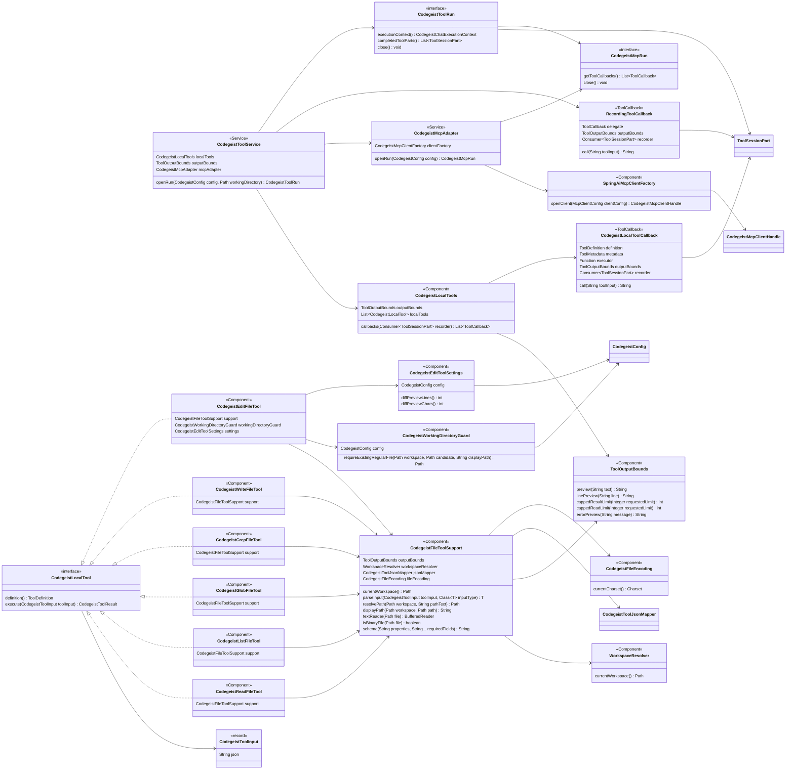
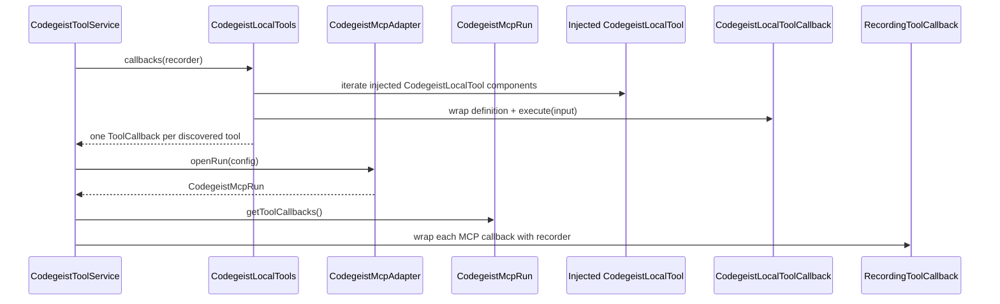
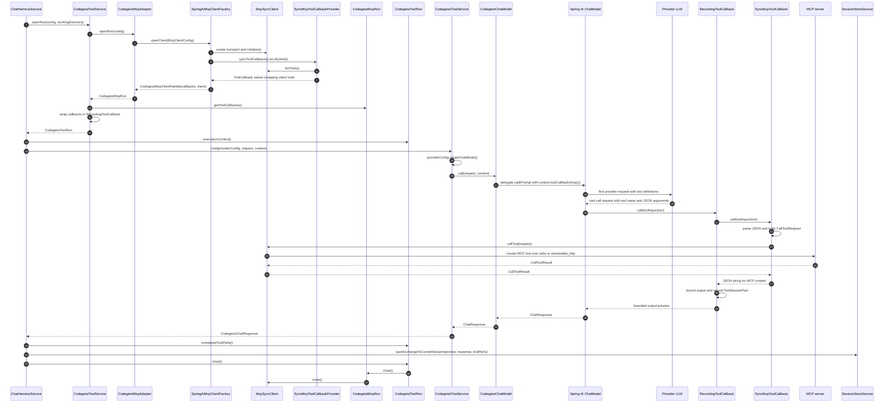
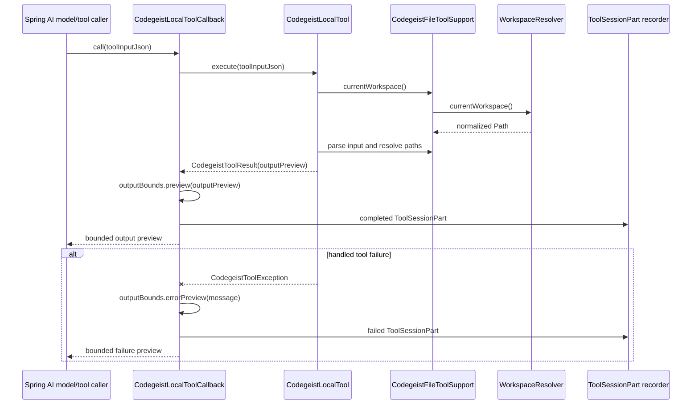
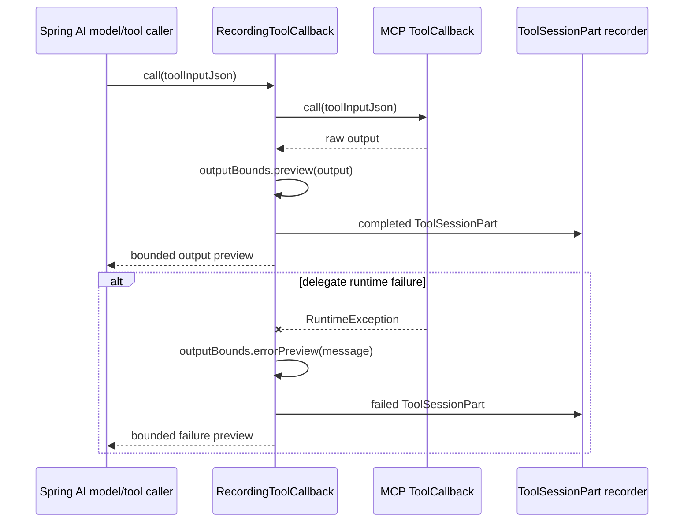

# Tool Callback Architecture

Current-state source-code documentation for the implemented Codegeist local file
tool callbacks and MCP callback bridge under `ai.codegeist.app.tool` and
`ai.codegeist.app.mcp`.

## Scope

This document describes the implemented local read/list/glob/grep/write/edit tool slice
plus the lazy MCP callback bridge for `stdio` and `streamable_http` clients. It
covers callback assembly, workspace path handling, bounded output, persisted tool
part recording, scoped tool runs, MCP cleanup, and focused tests.

This document does not describe provider-specific model internals, structured patch,
shell execution, permission prompts, ignored-file filtering, session-store write
protection, or full workspace sandboxing. Those behaviors are deferred to later
focused tasks. It also does not describe a full OpenCode-style coding-agent loop; the
current harness only makes prompt-scoped callbacks available to one provider call.

For detailed `codegeist_edit` implementation guidance, use `edit-tool.md`. It covers
the exact-match planning algorithm, active-workspace containment guard, text
normalization, stale-write check, preview settings, tests, and sharp edges in more
detail than this subsystem overview.

## Current Status

Codegeist now exposes local file tools and configured MCP tools to `ask` through
`ChatHarnessService` and `CodegeistToolService`. `CodegeistToolService.openRun(...)`
creates one closeable `CodegeistToolRun` per prompt turn, asks
`CodegeistLocalTools.callbacks(...)` for local Spring AI `ToolCallback` values, opens
`CodegeistMcpAdapter` for configured MCP callbacks, and gives both callback sources
one ordered `ToolSessionPart` recorder. Each callback returns bounded model-visible
text and records the same bounded preview as a completed or failed
`ToolSessionPart`.

Implemented callback names:

| Callback | Class | Current behavior |
| --- | --- | --- |
| `codegeist_read` | `CodegeistReadFileTool` | Reads bounded line-numbered text from one regular file using the configured workspace encoding. |
| `codegeist_list` | `CodegeistListFileTool` | Lists stable non-recursive direct directory entries with `[DIR]` and `[FILE]` markers. |
| `codegeist_glob` | `CodegeistGlobFileTool` | Walks under a base directory and matches files or directories with Java NIO glob semantics. |
| `codegeist_grep` | `CodegeistGrepFileTool` | Searches text files with a Java regular expression and optional include glob. |
| `codegeist_write` | `CodegeistWriteFileTool` | Creates or overwrites one regular text file using the configured workspace encoding when the parent directory already exists. |
| `codegeist_edit` | `CodegeistEditFileTool` | Applies one or more exact non-overlapping replacements to one existing workspace-contained text file, preserving BOM and line-ending style. |

MCP callback names come from the configured MCP server through Spring AI's MCP
callback provider. Codegeist does not rename them, store their definitions in the
session store, or add MCP-specific command/status fields to `.codegeist/session.json`.

## Source Map

| File | Responsibility |
| --- | --- |
| `app/codegeist/cli/src/main/java/ai/codegeist/app/tool/WorkspaceResolver.java` | Spring component that resolves the active workspace from direct `codegeist.yml` `workspace.directory` or `${user.dir}`. It normalizes paths but is not a permission boundary. |
| `app/codegeist/cli/src/main/java/ai/codegeist/app/tool/ToolOutputBounds.java` | Spring component that owns deterministic preview, line, result, read, and error bounds. |
| `app/codegeist/cli/src/main/java/ai/codegeist/app/tool/CodegeistLocalTools.java` | Spring component and generic callback assembler. It receives a Spring-injected `List<CodegeistLocalTool>`, creates shared `ToolMetadata`, and returns one callback per discovered local tool. It does not know individual tool names or domains. |
| `app/codegeist/cli/src/main/java/ai/codegeist/app/tool/CodegeistLocalTool.java` | Package-private interface implemented by each local tool component. It exposes a `ToolDefinition` and a typed `CodegeistToolInput` execute method. New local tools integrate by implementing this interface as a Spring component. |
| `app/codegeist/cli/src/main/java/ai/codegeist/app/tool/CodegeistToolInput.java` | Package-private value object wrapping the raw JSON payload Spring AI supplied for one local tool call. It normalizes missing or blank payloads to `{}`. |
| `app/codegeist/cli/src/main/java/ai/codegeist/app/tool/CodegeistToolJsonMapper.java` | Package-private Spring component and Jackson mapper dedicated to model-supplied local tool input JSON. Unknown properties are ignored so schema hints remain model-facing guidance rather than a second parser policy. |
| `app/codegeist/cli/src/main/java/ai/codegeist/app/tool/CodegeistFileEncoding.java` | Package-private Spring component that resolves the global file-tool charset from `workspace.encoding`, defaulting to UTF-8 when unset. |
| `app/codegeist/cli/src/main/java/ai/codegeist/app/tool/CodegeistFileToolSupport.java` | Package-private Spring component for workspace lookup, JSON parsing through `CodegeistToolJsonMapper`, JSON schema assembly, path resolution, display paths, configured-charset readers, binary/NUL detection, glob matchers, and common validation errors. |
| `app/codegeist/cli/src/main/java/ai/codegeist/app/tool/CodegeistWorkingDirectoryGuard.java` | Package-private Spring component that keeps side-effecting local tool file targets inside the active workspace unless `workspace.dir-guard-disabled` is explicitly true. Existence and regular-file checks still run when the guard is disabled. |
| `app/codegeist/cli/src/main/java/ai/codegeist/app/tool/CodegeistEditToolSettings.java` | Package-private Spring component that resolves bounded `tools.codegeist-edit` diff preview line and character limits from direct `codegeist.yml`. |
| `app/codegeist/cli/src/main/java/ai/codegeist/app/tool/CodegeistReadFileTool.java` | Package-private Spring component implementing `codegeist_read`. |
| `app/codegeist/cli/src/main/java/ai/codegeist/app/tool/CodegeistListFileTool.java` | Package-private Spring component implementing `codegeist_list`. |
| `app/codegeist/cli/src/main/java/ai/codegeist/app/tool/CodegeistGlobFileTool.java` | Package-private Spring component implementing `codegeist_glob`. |
| `app/codegeist/cli/src/main/java/ai/codegeist/app/tool/CodegeistGrepFileTool.java` | Package-private Spring component implementing `codegeist_grep`. |
| `app/codegeist/cli/src/main/java/ai/codegeist/app/tool/CodegeistWriteFileTool.java` | Package-private Spring component implementing `codegeist_write`. |
| `app/codegeist/cli/src/main/java/ai/codegeist/app/tool/CodegeistEditFileTool.java` | Package-private Spring component implementing `codegeist_edit` exact multi-edit replacements with workspace containment, preflight validation, stale-byte checking, and configurable bounded diff summaries. |
| `app/codegeist/cli/src/main/java/ai/codegeist/app/tool/CodegeistLocalToolCallback.java` | Package-private Spring AI `ToolCallback` wrapper that records completed or failed `ToolSessionPart` values and returns bounded preview text. |
| `app/codegeist/cli/src/main/java/ai/codegeist/app/tool/RecordingToolCallback.java` | Package-private wrapper for externally supplied callbacks such as MCP tools. It preserves delegate definition/metadata, bounds output, and records completed or failed `ToolSessionPart` values. |
| `app/codegeist/cli/src/main/java/ai/codegeist/app/tool/CodegeistToolService.java` | Spring service that opens prompt-scoped local plus MCP tool runs and builds the `CodegeistChatExecutionContext` used by provider calls. |
| `app/codegeist/cli/src/main/java/ai/codegeist/app/tool/CodegeistToolRun.java` | Public closeable per-turn tool scope exposed to `ChatHarnessService`. |
| `app/codegeist/cli/src/main/java/ai/codegeist/app/tool/DefaultCodegeistToolRun.java` | Package-private tool-run implementation for callback context, recorded-part snapshots, and MCP cleanup. |
| `app/codegeist/cli/src/main/java/ai/codegeist/app/tool/CodegeistToolResult.java` | Package-private minimal result record carrying the bounded output preview. |
| `app/codegeist/cli/src/main/java/ai/codegeist/app/tool/CodegeistToolException.java` | Package-private handled tool failure exception. Callback wrappers convert it into failed tool parts instead of throwing it into the provider call. |
| `app/codegeist/cli/src/main/java/ai/codegeist/app/mcp/CodegeistMcpAdapter.java` | Spring service that lazily reads already parsed direct `mcp:` config, opens configured MCP clients, and returns one prompt-scoped `CodegeistMcpRun`. |
| `app/codegeist/cli/src/main/java/ai/codegeist/app/mcp/CodegeistMcpRun.java` | Public closeable MCP run handle exposing Spring AI callbacks only. |
| `app/codegeist/cli/src/main/java/ai/codegeist/app/mcp/DefaultCodegeistMcpRun.java` | Package-private run implementation that exposes prompt callbacks and closes MCP resources in reverse creation order. |
| `app/codegeist/cli/src/main/java/ai/codegeist/app/mcp/CodegeistMcpClientFactory.java` | Package-private factory seam used by tests to avoid launching real MCP processes or containers. |
| `app/codegeist/cli/src/main/java/ai/codegeist/app/mcp/SpringAiMcpClientFactory.java` | Package-private Spring component that builds real MCP Java SDK transports for `stdio` and `streamable_http`, initializes clients, and discovers Spring AI callbacks. |
| `app/codegeist/cli/src/main/java/ai/codegeist/app/mcp/CodegeistMcpClientHandle.java` | Package-private record keeping callbacks and the closeable resource opened for one configured MCP client together. |
| `app/codegeist/cli/src/main/java/ai/codegeist/app/session/ToolSessionPart.java` | Persisted session part for bounded completed or failed tool activity. Current fields are `tool`, `status`, and `outputPreview`. |
| `app/codegeist/cli/src/test/java/ai/codegeist/app/tool/CodegeistLocalToolsTest.java` | Contract tests for callback names, schemas, success paths, focused failures, bounded previews, and recorded tool parts. |
| `scripts/tests/artifact-smoke.ps1` | Shared native-only artifact smoke harness for release CI and local platform wrappers. It delegates edit-specific side-effect checks to `file-edit-ask-smoke.ps1`. |
| `scripts/tests/file-edit-ask-smoke.ps1` | Focused artifact sub-harness for real `ask` plus deterministic fixture-provider tool calls, byte assertions, and persisted `ToolSessionPart` checks. |
| `app/codegeist/cli/src/test/java/ai/codegeist/app/tool/CodegeistToolServiceTest.java` | Contract tests for prompt-scoped local plus MCP tool runs, context callback exposure, MCP recording, cleanup, and defensive completed-part copies. |
| `app/codegeist/cli/src/test/java/ai/codegeist/app/mcp/CodegeistMcpAdapterTest.java` | Unit tests for lazy config handling, fake client mapping, callback exposure, and resource cleanup. |
| `app/codegeist/cli/src/test/java/ai/codegeist/app/mcp/CodegeistMcpRemoteSmokeIT.java` | Docker-smoke integration test for the real `streamable_http` transport and deterministic remote callback invocation. |

## Component Model

`CodegeistToolService`, `CodegeistLocalTools`, `CodegeistMcpAdapter`,
`SpringAiMcpClientFactory`, `WorkspaceResolver`, `ToolOutputBounds`,
`CodegeistFileToolSupport`, `CodegeistWorkingDirectoryGuard`,
`CodegeistEditToolSettings`, and the six individual file tools are Spring components.
The file tool classes stay package-private because no other package should depend on
their concrete types. Each concrete tool owns its callback name in a class-local
`TOOL_NAME` constant and builds its own `ToolDefinition`.
`CodegeistLocalTools` injects a `List<CodegeistLocalTool>` and does not assign
semantic meaning to callback order; tools are selected by callback name. File tools
that need workspace paths get the active workspace through `CodegeistFileToolSupport`
instead of through the generic local-tool execute contract.
`CodegeistMcpAdapter` keeps MCP clients lazy and prompt-scoped. `CodegeistToolService`
is the public service boundary used by the chat harness; it keeps callback recording
scoped to one prompt turn, returns defensive completed-part copies through
`CodegeistToolRun`, and closes the MCP run when the chat turn ends.



## Callback Assembly Flow

`CodegeistToolService.openRun(...)` is the chat-harness entrypoint. Inside that
scope, `CodegeistLocalTools.callbacks(...)` remains the local callback assembly seam
and receives the run's ordered `ToolSessionPart` recorder. The same scope opens
`CodegeistMcpAdapter` with the active `CodegeistConfig`, wraps returned MCP callbacks
with `RecordingToolCallback`, and stores the MCP run for cleanup.



The returned callbacks are selected by their `ToolDefinition.name()` values. Their
relative list order is not part of the runtime contract.

Every local callback uses `ToolMetadata.builder().returnDirect(false).build()`. MCP
callback metadata is supplied by Spring AI and preserved by `RecordingToolCallback`.
The current tools are meant to be model-callable, not immediate command-output
shortcuts.

## End-To-End MCP Tool Invocation Flow

This is the current path from the first provider call to the point where the MCP Java
SDK client invokes the remote or stdio MCP server. Codegeist does not call MCP server
tools directly from the chat harness. It assembles Spring AI callbacks, gives those
callbacks to the provider adapter, and then Spring AI's MCP callback delegates the
selected tool invocation to the `McpSyncClient` opened for the configured client.



The setup half of the flow is lazy and prompt-scoped:

| Step | Owner | Current behavior |
| --- | --- | --- |
| MCP config lookup | `CodegeistMcpAdapter` | Reads the already parsed direct `mcp:` root when a chat turn opens tools. Config parsing, `--show-config`, and Spring startup do not open MCP transports. |
| Transport creation | `SpringAiMcpClientFactory` | Creates either `StdioClientTransport` from `command` plus `args` or `HttpClientStreamableHttpTransport` from base `url` plus optional `endpoint`. |
| MCP initialization | `McpSyncClient` | `initialize()` runs before callbacks are exposed. A failure closes the client immediately and propagates. |
| Tool discovery | `SyncMcpToolCallbackProvider` | Calls `listTools()` on the initialized client and maps each MCP tool to a Spring AI `SyncMcpToolCallback`. |
| Codegeist wrapping | `CodegeistToolService` | Wraps each MCP callback in `RecordingToolCallback` so output bounds and session-part recording are consistent with local tools. |

The execute half starts only if the model selects one of those callback names during
the provider call. In the current Ollama adapter, `OllamaChatModel.call(...)` builds
`OllamaChatOptions` with `context.toolCallbackArray()` and then delegates to Spring
AI. If Spring AI receives a tool-call request from the provider, it calls the selected
`ToolCallback`. For MCP tools, the selected callback chain is:

```text
RecordingToolCallback.call(toolInputJson)
  -> SyncMcpToolCallback.call(toolInputJson)
  -> McpSyncClient.callTool(CallToolRequest)
  -> configured MCP server
```

`SyncMcpToolCallback` is Spring AI's MCP bridge. It parses the model-supplied JSON
arguments into a map, builds an MCP `CallToolRequest` with the original MCP tool name,
and invokes `McpSyncClient.callTool(request)`. It returns the MCP content as a JSON
string. If the SDK call throws or the MCP response is marked as an error, Spring AI
raises a tool execution exception; `RecordingToolCallback` catches runtime failures,
returns a bounded error preview to the model, and records a failed `ToolSessionPart`.

Important current constraints:

- Codegeist currently owns only one non-streaming `ChatHarnessService.ask(...)` turn.
- Codegeist does not yet implement an OpenCode-style model/tool/model controller or
  explicit multi-step agent loop.
- Any provider-side tool-calling behavior inside that one `delegate.call(...)` is
  managed by Spring AI and the selected provider adapter.
- The session store records bounded tool activity only after the provider call returns;
  it does not persist raw MCP arguments, MCP tool definitions, transport config,
  remote server status, or full MCP results.
- MCP clients are closed with the prompt-scoped `CodegeistToolRun` after the chat
  turn, so callbacks must not be reused outside that scope.

## Execution And Recording Flow

`CodegeistLocalToolCallback` is the boundary between Spring AI and Codegeist tool
execution. It handles only `CodegeistToolException` as an expected tool failure.
Unexpected runtime errors still escape so tests can expose programming defects.



`RecordingToolCallback` is the equivalent boundary for MCP callbacks that come from
Spring AI rather than Codegeist-owned local tool classes. It preserves the delegate
tool definition and metadata, records bounded success output, and converts delegate
runtime failures into bounded failed tool parts so a remote tool failure can be shown
to the model without tearing down the whole provider call.



The persisted `ToolSessionPart` currently stores only:

| Field | Source |
| --- | --- |
| `id` | Generated per callback invocation before recording. |
| `tool` | `ToolDefinition.name()`, for example `codegeist_read`. |
| `status` | `completed` or `failed`. |
| `outputPreview` | The same bounded string returned to the model. |

The tool callback slice does not persist raw input, full file content, affected
paths, timing, tool metadata, MCP command/args, remote server status, resources,
prompts, or server state.

## Workspace And Path Semantics

All relative tool input paths resolve against the active workspace from
`WorkspaceResolver.currentWorkspace()`. Absolute input paths are accepted as
caller-provided filesystem paths. Display paths are workspace-relative when the
actual normalized path is under the workspace; otherwise they are normalized absolute
paths with `/` separators.

Important constraints:

| Area | Current behavior |
| --- | --- |
| Workspace boundary | The workspace is a base path, not a permission sandbox. |
| Traversal | Traversal segments are normalized, not rejected. |
| Symlinks | File-type checks use `LinkOption.NOFOLLOW_LINKS`; no broader symlink policy exists. |
| Ignored files | No `.gitignore`, generated-file, or hidden-file filtering exists. |
| Session store | There is no special protection for `.codegeist/session.json` yet. |
| Parent directories | `codegeist_write` does not create parents. |
| Edit containment | `codegeist_edit` rejects normalized or resolved-real target paths outside the active workspace before reading or writing unless direct config sets `workspace.dir-guard-disabled: true`. The disabled mode still requires the target to exist and resolve to a regular file. |

Future permission or workspace-policy work should add a dedicated policy boundary
instead of hiding checks inside individual file tools.

## Tool Contracts

### `codegeist_read`

Input JSON fields:

| Field | Required | Behavior |
| --- | --- | --- |
| `path` | yes | File path. Relative values resolve against the active workspace. |
| `offset` | no | 1-based starting line. `null`, zero, and negative values behave as `1`. |
| `limit` | no | Maximum lines. `ToolOutputBounds.cappedReadLimit(...)` applies. |

Behavior:

- Rejects missing paths.
- Rejects directories and non-regular files.
- Rejects files with NUL bytes in the bounded binary sample.
- Rejects malformed input for the configured workspace encoding while reading.
- Returns `lineNumber: linePreview` lines joined with `\n`.
- Applies per-line capping and final preview capping.

### `codegeist_list`

Input JSON fields:

| Field | Required | Behavior |
| --- | --- | --- |
| `path` | no | Directory path. Defaults to `.`. |
| `limit` | no | Maximum entries. `ToolOutputBounds.cappedResultLimit(...)` applies. |

Behavior:

- Rejects missing paths.
- Rejects non-directories.
- Lists direct children only.
- Sorts entries by workspace-rendered display path.
- Renders directories as `[DIR] path/` and other entries as `[FILE] path`.
- Applies final preview capping.

### `codegeist_glob`

Input JSON fields:

| Field | Required | Behavior |
| --- | --- | --- |
| `pattern` | yes | Java NIO glob pattern. |
| `path` | no | Base directory. Defaults to `.`. |
| `limit` | no | Maximum matches. `ToolOutputBounds.cappedResultLimit(...)` applies. |

Behavior:

- Rejects missing base paths.
- Rejects non-directory base paths.
- Walks the base directory with `Files.walk(...)`.
- Does not shell out to `find`, `grep`, `rg`, or platform commands.
- Matches files and directories relative to the base path.
- Applies a compatibility branch for patterns starting with `**/`, so a pattern such
  as `**/*.java` can also match files directly under the base directory.
- Sorts matches by workspace-rendered display path.
- Applies result-limit and final preview capping.

### `codegeist_grep`

Input JSON fields:

| Field | Required | Behavior |
| --- | --- | --- |
| `pattern` | yes | Java regular expression. |
| `path` | no | File or directory path. Defaults to `.`. |
| `include` | no | Java glob filter relative to the search base. |
| `caseInsensitive` | no | Uses `Pattern.CASE_INSENSITIVE | Pattern.UNICODE_CASE` when `true`. |
| `limit` | no | Maximum matching lines. `ToolOutputBounds.cappedResultLimit(...)` applies. |

Behavior:

- Rejects invalid regex as a handled failed tool result.
- Rejects missing paths.
- Accepts one file or a directory tree.
- Sorts candidate files by workspace-rendered display path.
- Searches text files only; binary and malformed candidates for the configured
  workspace encoding are skipped.
- Returns `path:lineNumber: linePreview` lines joined with `\n`.
- Does not support multiline regex, before/after context, replacement, or shell-backed
  grep.

### `codegeist_write`

Input JSON fields:

| Field | Required | Behavior |
| --- | --- | --- |
| `path` | yes | File path. Relative values resolve against the active workspace. |
| `content` | yes | Text content written with the configured workspace encoding. |

Behavior:

- Rejects directories.
- Rejects missing parent directories.
- Rejects existing non-regular files.
- Creates a new regular file when the parent directory exists.
- Overwrites an existing regular file with `TRUNCATE_EXISTING`.
- Returns `Created file: <path>` or `Overwrote file: <path>` plus character count.
- Does not mkdir, chmod, delete, rename, patch, insert, append, or partially edit.

### `codegeist_edit`

Input JSON fields:

| Field | Required | Behavior |
| --- | --- | --- |
| `path` | yes | Existing regular file path under the active workspace. Relative values resolve against the active workspace; absolute values must still resolve inside it. |
| `edits` | yes | Non-empty array of exact replacements. Each entry has required `oldText` and `newText` string fields. |

Behavior:

- Rejects missing paths, missing files, directories, non-regular files, binary files,
  malformed text for the configured workspace encoding, and normalized or symlinked
  paths that escape the active workspace unless `workspace.dir-guard-disabled` is
  explicitly true.
- Rejects missing `edits`, empty `edits`, null edit entries, missing `oldText`, empty
  `oldText`, missing `newText`, and identical old/new text after line-ending
  normalization. Empty `newText` is allowed for deletion.
- Matches every edit against the original file content normalized to LF, not against
  incrementally mutated content.
- Requires each `oldText` to appear exactly once and rejects no-match or ambiguous
  repeated-match inputs before writing.
- Sorts validated matches by file position, rejects overlapping ranges, applies all
  accepted edits in one write, and never leaves partial mutation when any edit fails.
- Preserves a leading decoded BOM and restores CRLF line endings when the source file
  used CRLF.
- Re-reads the original bytes immediately before writing and fails with a stale-file
  message if another process changed the file after the initial read.
- Returns bounded stable headings: file, operation, replacement count, first changed
  line, diff truncation flag, and a fenced diff preview. The same preview is stored
  in `ToolSessionPart.outputPreview`.
- Reads optional direct `codegeist.yml` settings from `tools.codegeist-edit` for
  `diff-preview-lines` and `diff-preview-chars`. Defaults are 6 lines and half of
  `ToolOutputBounds.MAX_PREVIEW_CHARS`; non-positive values fall back to defaults and
  configured values are capped by the existing global output bounds.
- Does not create files, accept legacy top-level old/new fields, accept stringified
  `edits`, support `replaceAll`, fuzzy matching, structured patches, shell execution,
  or typed edit session fields.

## Output Bounds

All tool outputs are bounded before they reach the model or session store.

| Bound | Owner | Applies to |
| --- | --- | --- |
| `ToolOutputBounds.MAX_PREVIEW_CHARS` | `preview(...)` | Final model-visible and persisted output preview. |
| `ToolOutputBounds.MAX_LINE_CHARS` | `linePreview(...)` | Read and grep line rendering. |
| `ToolOutputBounds.MAX_RESULTS` | `cappedResultLimit(...)` | List, glob, and grep result counts. |
| `ToolOutputBounds.DEFAULT_READ_LINES` | `cappedReadLimit(...)` | Read line count when no valid limit is supplied. |
| `ToolOutputBounds.MAX_LINE_CHARS` | `errorPreview(...)` | Failed tool messages after whitespace normalization. |
| `tools.codegeist-edit.diff-preview-lines` | `CodegeistEditToolSettings.diffPreviewLines()` | Number of old/new lines shown per edit before `...`; defaults to 6 and is capped by `MAX_RESULTS`. |
| `tools.codegeist-edit.diff-preview-chars` | `CodegeistEditToolSettings.diffPreviewChars()` | Raw edit diff preview characters before the final summary cap; defaults to half of `MAX_PREVIEW_CHARS` and is capped by `MAX_PREVIEW_CHARS`. |

`CodegeistLocalToolCallback` calls `outputBounds.preview(...)` on successful
`CodegeistToolResult.outputPreview()` before recording and returning it. Failed tool
messages are normalized through `outputBounds.errorPreview(...)`.
`RecordingToolCallback` applies the same preview and error bounds to MCP delegate
callbacks before model-visible output or persisted session parts are produced.

## Error Behavior

Handled local tool errors are represented by `CodegeistToolException`. The callback
wrapper catches that exception, records a failed `ToolSessionPart`, and returns a
bounded failure preview to the model. This lets a provider see a concise tool failure
without tearing down the whole provider call.

Examples of handled failures:

| Failure | Example preview |
| --- | --- |
| Missing path | `Path does not exist: missing.txt` |
| Directory passed to read | `Path is not a file: directory` |
| File passed to list | `Path is not a directory: alpha.txt` |
| Invalid glob | `Invalid glob: [` |
| Invalid regex | `Invalid regex: Unclosed character class` |
| Write parent missing | `Parent directory does not exist: missing/child.txt` |
| Edit path escape | `Path escapes workspace: /tmp/outside.txt` |
| Edit exact match missing | `Could not find edits[0] in notes.txt` |
| Edit ambiguous match | `Found multiple exact matches for edits[0] in notes.txt` |

Unexpected programming errors are intentionally not caught by
`CodegeistLocalToolCallback`. The current tool-aware chat harness lets those defects
surface through the provider call path so tests expose programming errors instead of
persisting misleading failed tool parts.

MCP callbacks are externally supplied, so `RecordingToolCallback` catches delegate
`RuntimeException` values, records a failed `ToolSessionPart`, and returns bounded
failure text to the model. Startup, validation, and client-initialization failures
still happen before the provider call when `CodegeistMcpAdapter.openRun(...)` opens
the prompt-scoped MCP run.

## Test Coverage

`CodegeistLocalToolsTest` is the main contract test. It uses JUnit `@TempDir`, a
`WorkspaceResolver` pointed at the temporary workspace, and a `CodegeistLocalTools`
instance assembled from the six file-tool components.

Current coverage:

| Test focus | Behavior proved |
| --- | --- |
| Callback assembly | Callback names and Spring AI schemas for all six callbacks, independent of list order. |
| Read success | Line-numbered bounded output and completed tool part recording. |
| Read failures | Missing file, directory input, binary file, and failed tool part recording. |
| List behavior | Stable direct entries, `[DIR]` and `[FILE]` markers, result limits, and file rejection. |
| Glob behavior | Sorted workspace-relative matches, Java glob handling, and result limits. |
| Grep behavior | Sorted line previews, include glob, invalid regex failure, and failed output persistence. |
| Write behavior | Create, overwrite, reject directories, reject missing parents, and completed/failed recording. |
| Edit behavior | Exact single and multi-edit replacements, absolute in-workspace paths, outside-workspace and symlink escape rejection, invalid edit inputs, no-match and ambiguous-match failures, no partial mutation, overlap rejection, deletion, BOM/CRLF preservation, stale-byte failure, bounded and configurable diff output, and binary/malformed file rejection. |
| Bounds | Model-visible output and persisted `ToolSessionPart.outputPreview` are the same bounded string. |

Related tests:

- `WorkspaceResolverTest` proves active workspace resolution rules.
- `ToolOutputBoundsTest` proves output, line, result, read, and error bounds.
- `CodegeistMcpAdapterTest` proves lazy absent/empty config behavior, fake `stdio`
  and `streamable_http` client mapping, callback exposure, and resource cleanup.
- `CodegeistToolServiceTest` proves scoped local callback exposure, configured MCP
  callback exposure, MCP success/failure recording, MCP run cleanup, and defensive
  completed-part copies.
- `SessionStoreServiceTest` proves `ToolSessionPart` JSON round-trip and assistant
  message ordering when tool parts are saved with a chat exchange.
- `ChatHarnessServiceTest` proves recorded local tool parts are saved before the
  assistant text when a chat turn uses tool callbacks and that the tool run closes
  after the prompt turn.
- `scripts/tests/artifact-smoke.ps1` proves packaged native artifacts can run the
  shared release-shaped smoke contract. It delegates to
  `scripts/tests/file-edit-ask-smoke.ps1`, which runs the real `ask` command,
  receives deterministic fixture-provider tool calls, executes `codegeist_edit`,
  persists a completed `ToolSessionPart`, and preserves byte-level
  UTF-8/BOM/CRLF/final-newline/ISO-8859-1 contracts.
- `CodegeistMcpRemoteSmokeIT`, run only through `task mcp-remote-smoke`, proves the
  real `streamable_http` MCP callback path against a local Docker fixture.
- `AskCommandsMcpRemoteSmokeIT`, also run only through `task mcp-remote-smoke`, proves
  the Spring Boot `ask` path can pass MCP callbacks to local Ollama and persist the
  completed remote MCP `ToolSessionPart`.

Recommended focused verification for local tool callback changes:

```bash
task test TEST=CodegeistWorkspaceConfigTest,CodegeistToolsConfigTest,WorkspaceResolverTest,ToolOutputBoundsTest,CodegeistLocalToolsTest,CodegeistMcpAdapterTest,CodegeistToolServiceTest,SessionStoreServiceTest,ChatHarnessServiceTest,AskCommandsSessionStoreTest
```

Run the Docker-backed remote MCP smoke separately when changing real MCP transport
code or the fixture:

```bash
task mcp-remote-smoke
```

Run the broad JVM suite when the change touches Spring wiring, session persistence,
or shared tool helpers:

```bash
task test
```

## Extension Guide

When changing an existing local file tool:

- Update the relevant `Codegeist*FileTool` class instead of adding behavior to
  `CodegeistLocalTools`.
- Keep output bounded before returning a `CodegeistToolResult`.
- Keep handled user/tool errors as `CodegeistToolException` so failures are recorded
  as failed tool parts.
- Add or update `CodegeistLocalToolsTest` first when behavior changes.
- Update this document when source responsibilities, path semantics, bounds, or
  failure behavior change.

When adding a new local file tool:

- Check reusable engines first, especially Spring AI Agent Utils file/shell tools and
  MCP filesystem tools, before adding new low-level file, patch, or shell internals.
  Reuse is acceptable behind an adapter when it preserves Codegeist's public tool
  schema, workspace policy, encoding behavior, bounded output, handled failures, and
  session-part persistence.
- Do not directly register broad third-party toolkits as `codegeist_*` callbacks just
  to avoid glue code. The local callback facade is the product contract; third-party
  tools are implementation sources or optional MCP tools unless a focused task
  intentionally changes the exposed surface.
- Add a package-private `@Component` class implementing `CodegeistLocalTool`.
- Put the callback name in that class as a `static final String TOOL_NAME`, for
  example `codegeist_stat`. Do not add a tool-name field to `CodegeistLocalTools`.
- Build a `ToolDefinition` in the new class and keep the JSON schema explicit.
- Implement `execute(CodegeistToolInput toolInput)`. File-backed tools should use
  `CodegeistFileToolSupport.currentWorkspace()` plus its JSON parsing, path
  rendering, glob matching, configured-charset reading, and common validation
  behavior where it fits.
- Return a bounded `CodegeistToolResult`; throw `CodegeistToolException` for handled
  user/tool failures so `CodegeistLocalToolCallback` records a failed
  `ToolSessionPart`.
- Add or update `CodegeistLocalToolsTest` so the new callback name, schema, success
  path, focused failures, and recording behavior are covered without depending on
  list order.
- Put shared path, parsing, schema, text, or glob behavior in
  `CodegeistFileToolSupport` only when it is reused by more than one tool.
- Keep the first persisted result shape within current `ToolSessionPart` fields unless
  a focused session-store task expands the schema.

Minimal skeleton:

```java
@Component
@RequiredArgsConstructor
final class CodegeistStatFileTool implements CodegeistLocalTool {

    static final String TOOL_NAME = "codegeist_stat";

    private final CodegeistFileToolSupport support;

    @Override
    public ToolDefinition definition() {
        return ToolDefinition.builder()
                .name(TOOL_NAME)
                .description("Describe one filesystem path")
                .inputSchema(support.schema("""
                    "path":{"type":"string","description":"Path to inspect"}
                    """, CodegeistFileToolSupport.PATH_FIELD))
                .build();
    }

    @Override
    public CodegeistToolResult execute(CodegeistToolInput toolInput) {
        Path workspace = support.currentWorkspace();
        StatToolInput input = support.parseInput(toolInput, StatToolInput.class);
        Path path = support.resolvePath(workspace,
                support.requireText(input.path(), CodegeistFileToolSupport.REQUIRED_PATH_MESSAGE));
        support.requireExists(path, workspace);
        return new CodegeistToolResult(support.outputBounds().preview(
                "Path: " + support.displayPath(workspace, path)));
    }

    private record StatToolInput(String path) {
    }
}
```

## Sharp Edges

- Provider-backed `ask` receives local and MCP callbacks for one prompt turn, but
  Codegeist still does not own an iterative model/tool/model controller.
- MCP clients are opened only inside `CodegeistMcpAdapter.openRun(...)`; configured
  `stdio` clients may start processes and configured `streamable_http` clients may
  connect to their configured local or remote URL only when a tool run opens.
- `task mcp-remote-smoke` uses a local Docker fixture and local Ollama, then stays
  outside `task test` so routine JVM tests do not build/run a container or depend on
  model tool-selection behavior.
- Workspace resolution is intentionally permissive. Do not assume it protects the
  repository, home directory, session store, or symlink targets.
- `ObjectMapper` input parsing ignores unknown JSON fields. The Spring AI schema says
  `additionalProperties: false`, but `CodegeistToolJsonMapper` does not enforce that
  itself.
- `codegeist_grep` skips binary and malformed candidate files for the configured
  workspace encoding instead of failing the whole search.
- `codegeist_read` fails on binary or malformed text for the configured workspace
  encoding because read targets are explicit.
- `codegeist_write` writes the full supplied content to disk, but the model-visible
  and persisted output is only a bounded summary. This is intentional for the first
  write tool slice.
- `codegeist_edit` uses `CodegeistWorkingDirectoryGuard` because it is side-effecting
  and scoped by `T007_04`; the shared `WorkspaceResolver` remains permissive and is
  still not a general sandbox or permission system. The only opt-out is direct
  config `workspace.dir-guard-disabled: true`, which disables containment but not
  existence or regular-file checks.
- `codegeist_edit` is exact-only: it has no fuzzy matching, no `replaceAll`, no
  legacy top-level old/new compatibility, and no stringified `edits` compatibility.
  Multi-edit inputs are validated against the original LF-normalized content and then
  written once if all checks pass.
- `codegeist_edit` preserves leading BOM and CRLF style but does not keep mixed
  line-ending layouts exactly; any source file containing CRLF is restored with CRLF
  after the LF-normalized edit pass.
- `tools.codegeist-edit.diff-preview-lines` and `diff-preview-chars` tune only the
  compact diff preview inside the edit result. The final model-visible and persisted
  output is still capped by `ToolOutputBounds.preview(...)`.
- No native-image metadata was added for the package-private input records. Artifact
  smokes now exercise edit input parsing in jar and native packages; add targeted
  native metadata only if those smokes expose a reflection issue.
