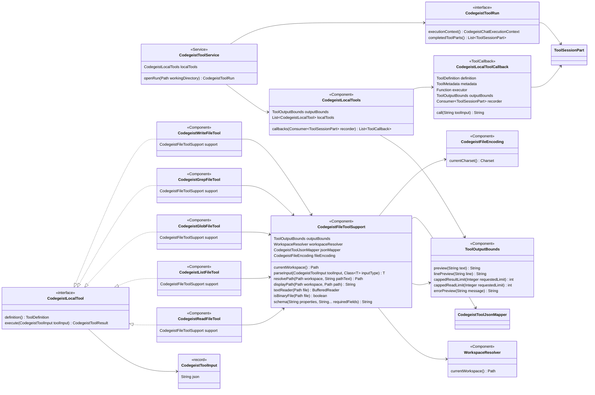
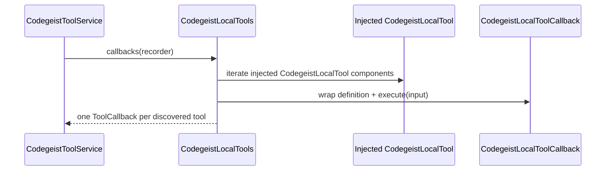
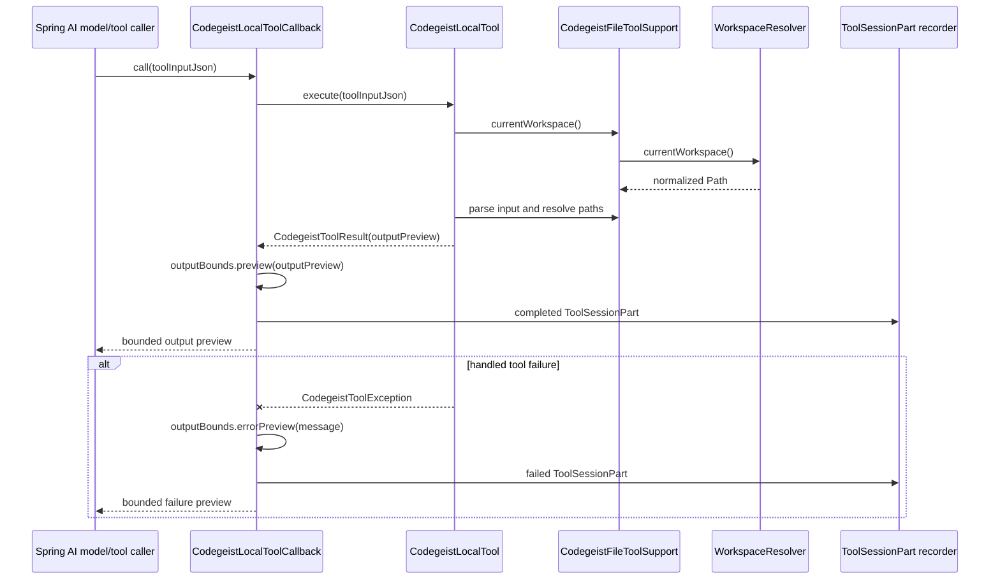

# Local File Tools Architecture

Current-state source-code documentation for the implemented Codegeist local file
tool callbacks under `ai.codegeist.app.tool`.

## Scope

This document describes the implemented local read/list/glob/grep/write tool slice.
It covers callback assembly, workspace path handling, bounded output, persisted tool
part recording, scoped local tool runs, and focused tests.

This document does not describe provider-specific model internals, MCP callbacks,
patch/edit, shell execution, permission prompts, ignored-file filtering,
session-store write protection, or workspace sandboxing. Those behaviors are deferred
to later focused tasks. It also does not describe a full OpenCode-style coding-agent
loop; the current harness only makes local callbacks available to one provider call.

## Current Status

Codegeist now exposes local file tools to `ask` through `ChatHarnessService` and
`CodegeistToolService`. `CodegeistToolService.openRun(...)` creates one
`CodegeistToolRun` per prompt turn, asks `CodegeistLocalTools.callbacks(...)` for
Spring AI `ToolCallback` values, and gives the callbacks one ordered
`ToolSessionPart` recorder. Each callback returns bounded model-visible text and
records the same bounded preview as a completed or failed `ToolSessionPart`.

Implemented callback names:

| Callback | Class | Current behavior |
| --- | --- | --- |
| `codegeist_read` | `CodegeistReadFileTool` | Reads bounded line-numbered text from one regular file using the configured workspace encoding. |
| `codegeist_list` | `CodegeistListFileTool` | Lists stable non-recursive direct directory entries with `[DIR]` and `[FILE]` markers. |
| `codegeist_glob` | `CodegeistGlobFileTool` | Walks under a base directory and matches files or directories with Java NIO glob semantics. |
| `codegeist_grep` | `CodegeistGrepFileTool` | Searches text files with a Java regular expression and optional include glob. |
| `codegeist_write` | `CodegeistWriteFileTool` | Creates or overwrites one regular text file using the configured workspace encoding when the parent directory already exists. |

## Source Map

| File | Responsibility |
| --- | --- |
| `app/codegeist/cli/src/main/java/ai/codegeist/app/tool/WorkspaceResolver.java` | Spring component that resolves the active workspace from direct `codegeist.yml` `workspace.directory` or `${user.dir}`. It normalizes paths but is not a permission boundary. |
| `app/codegeist/cli/src/main/java/ai/codegeist/app/tool/ToolOutputBounds.java` | Spring component that owns deterministic preview, line, result, read, and error bounds. |
| `app/codegeist/cli/src/main/java/ai/codegeist/app/tool/CodegeistLocalTools.java` | Spring component and generic callback assembler. It receives a Spring-injected `List<CodegeistLocalTool>`, creates shared `ToolMetadata`, and returns one callback per discovered local tool. It does not know individual tool names or domains. |
| `app/codegeist/cli/src/main/java/ai/codegeist/app/tool/CodegeistLocalTool.java` | Package-private interface implemented by each local tool component. It exposes a `ToolDefinition` and a typed `CodegeistToolInput` execute method. New local tools integrate by implementing this interface as a Spring component. |
| `app/codegeist/cli/src/main/java/ai/codegeist/app/tool/CodegeistToolInput.java` | Package-private value object wrapping the raw JSON payload Spring AI supplied for one local tool call. It normalizes missing or blank payloads to `{}`. |
| `app/codegeist/cli/src/main/java/ai/codegeist/app/tool/CodegeistToolJsonMapper.java` | Package-private Spring component and Jackson mapper dedicated to model-supplied local tool input JSON. Unknown properties are ignored so schema hints remain model-facing guidance rather than a second parser policy. |
| `app/codegeist/cli/src/main/java/ai/codegeist/app/tool/CodegeistFileEncoding.java` | Package-private Spring component that resolves the global file-tool charset from `workspace.encoding`, defaulting to UTF-8 when unset. |
| `app/codegeist/cli/src/main/java/ai/codegeist/app/tool/CodegeistFileToolSupport.java` | Package-private Spring component for workspace lookup, JSON parsing through `CodegeistToolJsonMapper`, JSON schema assembly, path resolution, display paths, configured-charset readers, binary/NUL detection, glob matchers, and common validation errors. |
| `app/codegeist/cli/src/main/java/ai/codegeist/app/tool/CodegeistReadFileTool.java` | Package-private Spring component implementing `codegeist_read`. |
| `app/codegeist/cli/src/main/java/ai/codegeist/app/tool/CodegeistListFileTool.java` | Package-private Spring component implementing `codegeist_list`. |
| `app/codegeist/cli/src/main/java/ai/codegeist/app/tool/CodegeistGlobFileTool.java` | Package-private Spring component implementing `codegeist_glob`. |
| `app/codegeist/cli/src/main/java/ai/codegeist/app/tool/CodegeistGrepFileTool.java` | Package-private Spring component implementing `codegeist_grep`. |
| `app/codegeist/cli/src/main/java/ai/codegeist/app/tool/CodegeistWriteFileTool.java` | Package-private Spring component implementing `codegeist_write`. |
| `app/codegeist/cli/src/main/java/ai/codegeist/app/tool/CodegeistLocalToolCallback.java` | Package-private Spring AI `ToolCallback` wrapper that records completed or failed `ToolSessionPart` values and returns bounded preview text. |
| `app/codegeist/cli/src/main/java/ai/codegeist/app/tool/CodegeistToolService.java` | Spring service that opens prompt-scoped local tool runs and builds the `CodegeistChatExecutionContext` used by provider calls. |
| `app/codegeist/cli/src/main/java/ai/codegeist/app/tool/CodegeistToolRun.java` | Public per-turn tool scope exposed to `ChatHarnessService`. |
| `app/codegeist/cli/src/main/java/ai/codegeist/app/tool/DefaultCodegeistToolRun.java` | Package-private first tool-run implementation for local callbacks and recorded-part snapshots. |
| `app/codegeist/cli/src/main/java/ai/codegeist/app/tool/CodegeistToolResult.java` | Package-private minimal result record carrying the bounded output preview. |
| `app/codegeist/cli/src/main/java/ai/codegeist/app/tool/CodegeistToolException.java` | Package-private handled tool failure exception. Callback wrappers convert it into failed tool parts instead of throwing it into the provider call. |
| `app/codegeist/cli/src/main/java/ai/codegeist/app/session/ToolSessionPart.java` | Persisted session part for bounded completed or failed tool activity. Current fields are `tool`, `status`, and `outputPreview`. |
| `app/codegeist/cli/src/test/java/ai/codegeist/app/tool/CodegeistLocalToolsTest.java` | Contract tests for callback names, schemas, success paths, focused failures, bounded previews, and recorded tool parts. |
| `app/codegeist/cli/src/test/java/ai/codegeist/app/tool/CodegeistToolServiceTest.java` | Contract tests for prompt-scoped local tool runs, context callback exposure, recording, and defensive completed-part copies. |

## Component Model

`CodegeistToolService`, `CodegeistLocalTools`, `WorkspaceResolver`, `ToolOutputBounds`,
`CodegeistFileToolSupport`, and the five individual file tools are Spring
components. The file tool classes stay package-private because no other package
should depend on their concrete types. Each concrete tool owns its callback name in a
class-local `TOOL_NAME` constant and builds its own `ToolDefinition`.
`CodegeistLocalTools` injects a `List<CodegeistLocalTool>` and does not assign
semantic meaning to callback order; tools are selected by callback name. File tools
that need workspace paths get the active workspace through `CodegeistFileToolSupport`
instead of through the generic local-tool execute contract.
`CodegeistToolService` is the public service boundary used by the chat harness; it
keeps callback recording scoped to one prompt turn and returns defensive completed
part copies through `CodegeistToolRun`.



## Callback Assembly Flow

`CodegeistToolService.openRun(...)` is the chat-harness entrypoint. Inside that
scope, `CodegeistLocalTools.callbacks(...)` remains the local callback assembly seam
and receives the run's ordered `ToolSessionPart` recorder.



The returned callbacks are selected by their `ToolDefinition.name()` values. Their
relative list order is not part of the runtime contract.

Every callback uses `ToolMetadata.builder().returnDirect(false).build()`. The current
tools are meant to be model-callable, not immediate command-output shortcuts.

## Execution And Recording Flow

`CodegeistLocalToolCallback` is the boundary between Spring AI and Codegeist tool
execution. It handles only `CodegeistToolException` as an expected tool failure.
Unexpected runtime errors still escape so tests can expose programming defects.



The persisted `ToolSessionPart` currently stores only:

| Field | Source |
| --- | --- |
| `id` | Generated per callback invocation before recording. |
| `tool` | `ToolDefinition.name()`, for example `codegeist_read`. |
| `status` | `completed` or `failed`. |
| `outputPreview` | The same bounded string returned to the model. |

The local file tool slice does not persist raw input, full file content, affected
paths, timing, tool metadata, or server state.

## Workspace And Path Semantics

All relative tool input paths resolve against the active workspace from
`WorkspaceResolver.currentWorkspace()`. Absolute input paths are accepted as
caller-provided filesystem paths. Display paths are workspace-relative when the
actual normalized path is under the workspace; otherwise they are normalized absolute
paths with `/` separators.

Important constraints:

| Area | Current behavior |
| --- | --- |
| Workspace boundary | The workspace is a base path, not a permission sandbox. |
| Traversal | Traversal segments are normalized, not rejected. |
| Symlinks | File-type checks use `LinkOption.NOFOLLOW_LINKS`; no broader symlink policy exists. |
| Ignored files | No `.gitignore`, generated-file, or hidden-file filtering exists. |
| Session store | There is no special protection for `.codegeist/session.json` yet. |
| Parent directories | `codegeist_write` does not create parents. |

Future permission or workspace-policy work should add a dedicated policy boundary
instead of hiding checks inside individual file tools.

## Tool Contracts

### `codegeist_read`

Input JSON fields:

| Field | Required | Behavior |
| --- | --- | --- |
| `path` | yes | File path. Relative values resolve against the active workspace. |
| `offset` | no | 1-based starting line. `null`, zero, and negative values behave as `1`. |
| `limit` | no | Maximum lines. `ToolOutputBounds.cappedReadLimit(...)` applies. |

Behavior:

- Rejects missing paths.
- Rejects directories and non-regular files.
- Rejects files with NUL bytes in the bounded binary sample.
- Rejects malformed input for the configured workspace encoding while reading.
- Returns `lineNumber: linePreview` lines joined with `\n`.
- Applies per-line capping and final preview capping.

### `codegeist_list`

Input JSON fields:

| Field | Required | Behavior |
| --- | --- | --- |
| `path` | no | Directory path. Defaults to `.`. |
| `limit` | no | Maximum entries. `ToolOutputBounds.cappedResultLimit(...)` applies. |

Behavior:

- Rejects missing paths.
- Rejects non-directories.
- Lists direct children only.
- Sorts entries by workspace-rendered display path.
- Renders directories as `[DIR] path/` and other entries as `[FILE] path`.
- Applies final preview capping.

### `codegeist_glob`

Input JSON fields:

| Field | Required | Behavior |
| --- | --- | --- |
| `pattern` | yes | Java NIO glob pattern. |
| `path` | no | Base directory. Defaults to `.`. |
| `limit` | no | Maximum matches. `ToolOutputBounds.cappedResultLimit(...)` applies. |

Behavior:

- Rejects missing base paths.
- Rejects non-directory base paths.
- Walks the base directory with `Files.walk(...)`.
- Does not shell out to `find`, `grep`, `rg`, or platform commands.
- Matches files and directories relative to the base path.
- Applies a compatibility branch for patterns starting with `**/`, so a pattern such
  as `**/*.java` can also match files directly under the base directory.
- Sorts matches by workspace-rendered display path.
- Applies result-limit and final preview capping.

### `codegeist_grep`

Input JSON fields:

| Field | Required | Behavior |
| --- | --- | --- |
| `pattern` | yes | Java regular expression. |
| `path` | no | File or directory path. Defaults to `.`. |
| `include` | no | Java glob filter relative to the search base. |
| `caseInsensitive` | no | Uses `Pattern.CASE_INSENSITIVE | Pattern.UNICODE_CASE` when `true`. |
| `limit` | no | Maximum matching lines. `ToolOutputBounds.cappedResultLimit(...)` applies. |

Behavior:

- Rejects invalid regex as a handled failed tool result.
- Rejects missing paths.
- Accepts one file or a directory tree.
- Sorts candidate files by workspace-rendered display path.
- Searches text files only; binary and malformed candidates for the configured
  workspace encoding are skipped.
- Returns `path:lineNumber: linePreview` lines joined with `\n`.
- Does not support multiline regex, before/after context, replacement, or shell-backed
  grep.

### `codegeist_write`

Input JSON fields:

| Field | Required | Behavior |
| --- | --- | --- |
| `path` | yes | File path. Relative values resolve against the active workspace. |
| `content` | yes | Text content written with the configured workspace encoding. |

Behavior:

- Rejects directories.
- Rejects missing parent directories.
- Rejects existing non-regular files.
- Creates a new regular file when the parent directory exists.
- Overwrites an existing regular file with `TRUNCATE_EXISTING`.
- Returns `Created file: <path>` or `Overwrote file: <path>` plus character count.
- Does not mkdir, chmod, delete, rename, patch, insert, append, or partially edit.

## Output Bounds

All tool outputs are bounded before they reach the model or session store.

| Bound | Owner | Applies to |
| --- | --- | --- |
| `ToolOutputBounds.MAX_PREVIEW_CHARS` | `preview(...)` | Final model-visible and persisted output preview. |
| `ToolOutputBounds.MAX_LINE_CHARS` | `linePreview(...)` | Read and grep line rendering. |
| `ToolOutputBounds.MAX_RESULTS` | `cappedResultLimit(...)` | List, glob, and grep result counts. |
| `ToolOutputBounds.DEFAULT_READ_LINES` | `cappedReadLimit(...)` | Read line count when no valid limit is supplied. |
| `ToolOutputBounds.MAX_LINE_CHARS` | `errorPreview(...)` | Failed tool messages after whitespace normalization. |

`CodegeistLocalToolCallback` calls `outputBounds.preview(...)` on successful
`CodegeistToolResult.outputPreview()` before recording and returning it. Failed tool
messages are normalized through `outputBounds.errorPreview(...)`.

## Error Behavior

Handled local tool errors are represented by `CodegeistToolException`. The callback
wrapper catches that exception, records a failed `ToolSessionPart`, and returns a
bounded failure preview to the model. This lets a provider see a concise tool failure
without tearing down the whole provider call.

Examples of handled failures:

| Failure | Example preview |
| --- | --- |
| Missing path | `Path does not exist: missing.txt` |
| Directory passed to read | `Path is not a file: directory` |
| File passed to list | `Path is not a directory: alpha.txt` |
| Invalid glob | `Invalid glob: [` |
| Invalid regex | `Invalid regex: Unclosed character class` |
| Write parent missing | `Parent directory does not exist: missing/child.txt` |

Unexpected programming errors are intentionally not caught by
`CodegeistLocalToolCallback`. The current tool-aware chat harness lets those defects
surface through the provider call path so tests expose programming errors instead of
persisting misleading failed tool parts.

## Test Coverage

`CodegeistLocalToolsTest` is the main contract test. It uses JUnit `@TempDir`, a
`WorkspaceResolver` pointed at the temporary workspace, and a `CodegeistLocalTools`
instance assembled from the five file-tool components.

Current coverage:

| Test focus | Behavior proved |
| --- | --- |
| Callback assembly | Callback names and Spring AI schemas for all five callbacks, independent of list order. |
| Read success | Line-numbered bounded output and completed tool part recording. |
| Read failures | Missing file, directory input, binary file, and failed tool part recording. |
| List behavior | Stable direct entries, `[DIR]` and `[FILE]` markers, result limits, and file rejection. |
| Glob behavior | Sorted workspace-relative matches, Java glob handling, and result limits. |
| Grep behavior | Sorted line previews, include glob, invalid regex failure, and failed output persistence. |
| Write behavior | Create, overwrite, reject directories, reject missing parents, and completed/failed recording. |
| Bounds | Model-visible output and persisted `ToolSessionPart.outputPreview` are the same bounded string. |

Related tests:

- `WorkspaceResolverTest` proves active workspace resolution rules.
- `ToolOutputBoundsTest` proves output, line, result, read, and error bounds.
- `CodegeistToolServiceTest` proves scoped local callback exposure, recording, and
  defensive completed-part copies.
- `SessionStoreServiceTest` proves `ToolSessionPart` JSON round-trip and assistant
  message ordering when tool parts are saved with a chat exchange.
- `ChatHarnessServiceTest` proves recorded local tool parts are saved before the
  assistant text when a chat turn uses tool callbacks.

Recommended focused verification after changing this subsystem:

```bash
task test TEST=CodegeistLocalToolsTest,CodegeistToolServiceTest,WorkspaceResolverTest,ToolOutputBoundsTest,SessionStoreServiceTest,ChatHarnessServiceTest
```

Run the broad JVM suite when the change touches Spring wiring, session persistence,
or shared tool helpers:

```bash
task test
```

## Extension Guide

When changing an existing local file tool:

- Update the relevant `Codegeist*FileTool` class instead of adding behavior to
  `CodegeistLocalTools`.
- Keep output bounded before returning a `CodegeistToolResult`.
- Keep handled user/tool errors as `CodegeistToolException` so failures are recorded
  as failed tool parts.
- Add or update `CodegeistLocalToolsTest` first when behavior changes.
- Update this document when source responsibilities, path semantics, bounds, or
  failure behavior change.

When adding a new local file tool:

- Add a package-private `@Component` class implementing `CodegeistLocalTool`.
- Put the callback name in that class as a `static final String TOOL_NAME`, for
  example `codegeist_stat`. Do not add a tool-name field to `CodegeistLocalTools`.
- Build a `ToolDefinition` in the new class and keep the JSON schema explicit.
- Implement `execute(CodegeistToolInput toolInput)`. File-backed tools should use
  `CodegeistFileToolSupport.currentWorkspace()` plus its JSON parsing, path
  rendering, glob matching, configured-charset reading, and common validation
  behavior where it fits.
- Return a bounded `CodegeistToolResult`; throw `CodegeistToolException` for handled
  user/tool failures so `CodegeistLocalToolCallback` records a failed
  `ToolSessionPart`.
- Add or update `CodegeistLocalToolsTest` so the new callback name, schema, success
  path, focused failures, and recording behavior are covered without depending on
  list order.
- Put shared path, parsing, schema, text, or glob behavior in
  `CodegeistFileToolSupport` only when it is reused by more than one tool.
- Keep the first persisted result shape within current `ToolSessionPart` fields unless
  a focused session-store task expands the schema.

Minimal skeleton:

```java
@Component
@RequiredArgsConstructor
final class CodegeistStatFileTool implements CodegeistLocalTool {

    static final String TOOL_NAME = "codegeist_stat";

    private final CodegeistFileToolSupport support;

    @Override
    public ToolDefinition definition() {
        return ToolDefinition.builder()
                .name(TOOL_NAME)
                .description("Describe one filesystem path")
                .inputSchema(support.schema("""
                    "path":{"type":"string","description":"Path to inspect"}
                    """, CodegeistFileToolSupport.PATH_FIELD))
                .build();
    }

    @Override
    public CodegeistToolResult execute(CodegeistToolInput toolInput) {
        Path workspace = support.currentWorkspace();
        StatToolInput input = support.parseInput(toolInput, StatToolInput.class);
        Path path = support.resolvePath(workspace,
                support.requireText(input.path(), CodegeistFileToolSupport.REQUIRED_PATH_MESSAGE));
        support.requireExists(path, workspace);
        return new CodegeistToolResult(support.outputBounds().preview(
                "Path: " + support.displayPath(workspace, path)));
    }

    private record StatToolInput(String path) {
    }
}
```

## Sharp Edges

- The local file tools are implemented source code, but provider-backed `ask` does not
  use them yet. The tool-aware chat harness is a later T007_03 child task.
- Workspace resolution is intentionally permissive. Do not assume it protects the
  repository, home directory, session store, or symlink targets.
- `ObjectMapper` input parsing ignores unknown JSON fields. The Spring AI schema says
  `additionalProperties: false`, but `CodegeistToolJsonMapper` does not enforce that
  itself.
- `codegeist_grep` skips binary and malformed candidate files for the configured
  workspace encoding instead of failing the whole search.
- `codegeist_read` fails on binary or malformed text for the configured workspace
  encoding because read targets are explicit.
- `codegeist_write` writes the full supplied content to disk, but the model-visible
  and persisted output is only a bounded summary. This is intentional for the first
  write tool slice.
- No native-image metadata was added for the package-private input records. Current
  verification is JVM-focused; add targeted native metadata only if a future native
  smoke exposes a reflection issue in tool input parsing.
