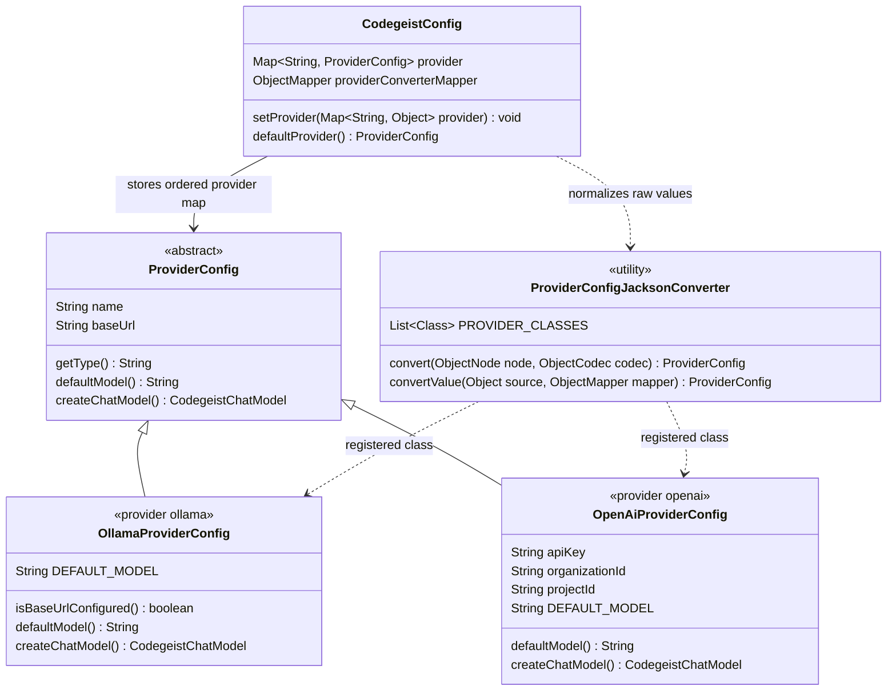
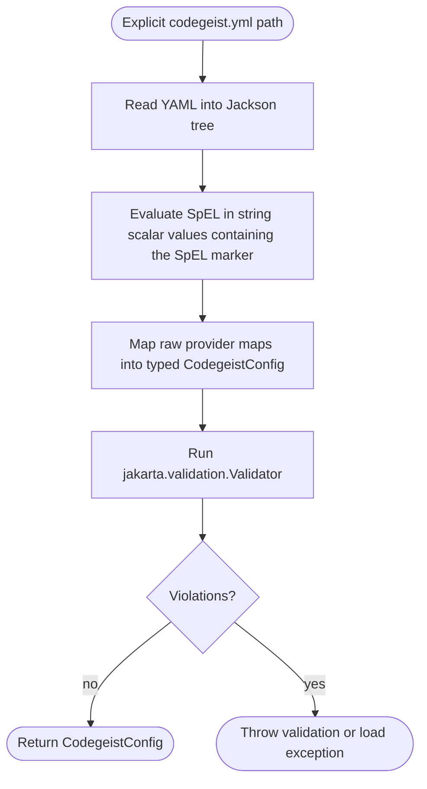
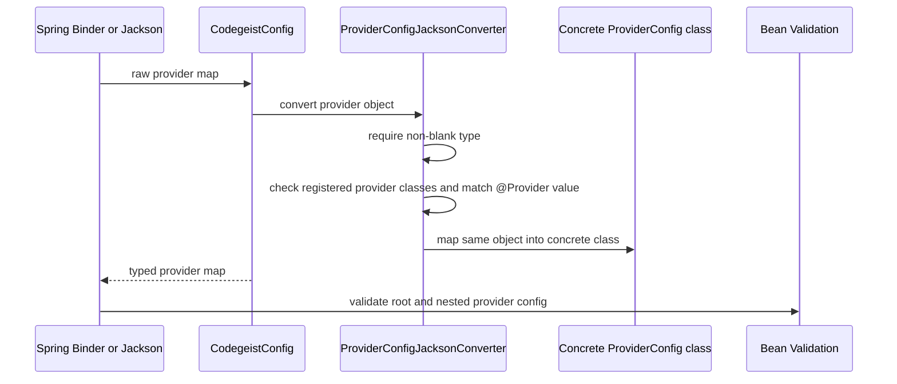
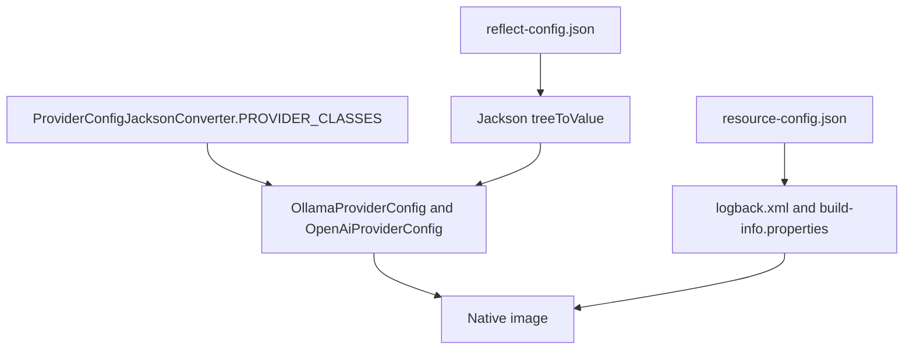
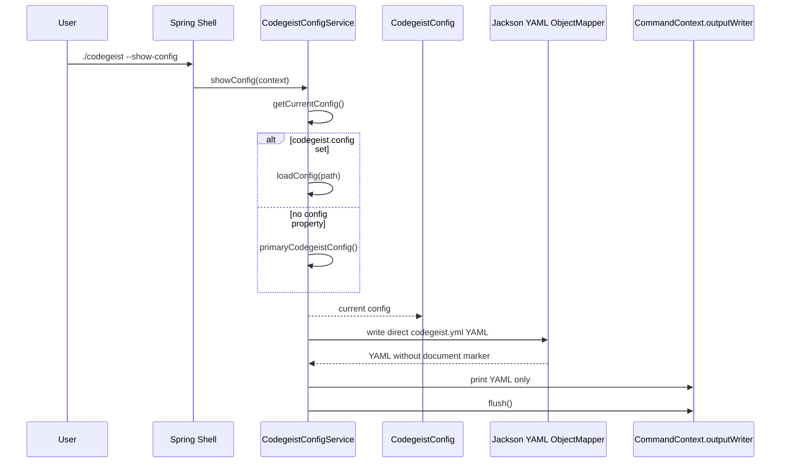

# Provider Configuration Architecture

Current-state source-code documentation for the implemented Codegeist provider
configuration slice under `app/codegeist/cli`.

## Scope

This document describes implemented config loading and rendering behavior plus the
current provider category policy boundary. It does not describe provider client
creation beyond the already implemented local Ollama chat seam, account setup,
local daemon startup, model pulls, home-path discovery, or service-level
multi-source loading orchestration.

The current slice solves these problems:

- Bind Codegeist provider config from Spring application properties.
- Load an explicit direct `codegeist.yml` path with Jackson YAML.
- Resolve the Spring `codegeist.config` property as the current global CLI config
  source when it is set, commonly through `-Dcodegeist.config=<path>` at startup.
- Evaluate trusted local Spring SpEL only in direct YAML string scalar values.
- Dispatch `provider.<id>.type` to concrete Java provider config classes.
- Validate config locally with Bean Validation after mapping.
- Render `--show-config` YAML directly, including configured sensitive values.
- Keep provider config free of models, generation options, enablement, and
  completion-path routing; those are runtime selections made by a caller, coding
  agent, session, command, or provider-feature test method.
- Let each concrete provider config own a provider-specific default runtime model
  through `ProviderConfig.defaultModel()` without storing model names in YAML.

## Source Map

| File | Responsibility |
| --- | --- |
| `app/codegeist/cli/pom.xml` | Provides Jackson YAML, Lombok, Bean Validation, and the Spring AI dependency baseline. |
| `app/codegeist/cli/src/main/java/ai/codegeist/app/CodegeistApplication.java` | Owns `APP_NAME = "codegeist"`, the shared Spring configuration prefix and application name. |
| `app/codegeist/cli/src/main/java/ai/codegeist/app/config/CodegeistConfig.java` | Spring-bound and Jackson-loadable root config model. Holds `provider` entries and normalizes raw provider maps into typed provider classes with the injected YAML mapper. |
| `app/codegeist/cli/src/main/java/ai/codegeist/app/config/ProviderConfig.java` | Abstract base class for provider map values. Holds common access fields, derives read-only output `type` from `@Provider`, and declares provider-owned `defaultModel()` plus `createChatModel()`. |
| `app/codegeist/cli/src/main/java/ai/codegeist/app/config/OllamaProviderConfig.java` | Access config class for local Ollama settings, the `llama3.2:1b` default runtime model, and the concrete config-owned chat model seam. |
| `app/codegeist/cli/src/main/java/ai/codegeist/app/config/OpenAiProviderConfig.java` | Access config class for OpenAI settings and the `gpt-5-mini` default runtime model; chat-model creation is not implemented yet. |
| `app/codegeist/cli/src/main/java/ai/codegeist/app/config/Provider.java` | Runtime annotation whose value is the YAML provider `type`. |
| `app/codegeist/cli/src/main/java/ai/codegeist/app/config/ProviderConfigJacksonConverter.java` | Shared annotation-backed type dispatch for raw provider maps and Jackson nodes. It owns the explicit Java registry of concrete provider config classes annotated with `@Provider`. |
| `app/codegeist/cli/src/main/resources/META-INF/native-image/reflect-config.json` | GraalVM reflection metadata that lets Jackson instantiate provider config POJOs in native images. |
| `app/codegeist/cli/src/main/java/ai/codegeist/app/config/CodegeistYamlConfiguration.java` | Spring configuration that exposes the qualified `codegeistYamlObjectMapper` bean for direct `codegeist.yml` parsing, provider normalization, and rendering. The mapper carries Jackson injectable values for direct `CodegeistConfig` loads. |
| `app/codegeist/cli/src/main/java/ai/codegeist/app/config/CodegeistYamlExpressionEvaluator.java` | Spring service that receives the YAML mapper bean and evaluates SpEL in direct-YAML string scalar values only. |
| `app/codegeist/cli/src/main/java/ai/codegeist/app/config/CodegeistConfigService.java` | Spring service that receives Spring-bound config, the YAML mapper bean, the injected `codegeist.config` value, and the SpEL evaluator service; exposes the current primary config bean, resolves `-Dcodegeist.config`, owns `--show-config`, loads explicit YAML, runs validation, and renders direct YAML. |
| `app/codegeist/cli/src/main/java/ai/codegeist/app/config/CodegeistConfigValidationException.java` | User-facing runtime exception for Bean Validation failures, provider dispatch failures before Jackson wraps them, and SpEL failures. |
| `app/codegeist/cli/src/test/java/ai/codegeist/app/config/CodegeistConfigServiceTest.java` | Spring integration test for binding, direct load, primary config injection, validation, and direct YAML rendering. |
| `app/codegeist/cli/src/test/java/ai/codegeist/app/config/CodegeistProviderConfigTest.java` | Provider annotation dispatch, provider-specific default-model, and validation tests. |
| `app/codegeist/cli/src/test/java/ai/codegeist/app/config/CodegeistConfigSpelEvaluationTest.java` | Direct YAML SpEL preprocessing tests. |
| `app/codegeist/cli/src/test/java/ai/codegeist/app/config/CodegeistConfigCommandTest.java` | Spring command test for `--show-config` stdout shape and unmasked value rendering. |
| `app/codegeist/cli/src/test/java/ai/codegeist/app/provider/ProviderCategory.java` | Class or method annotation for non-config provider feature categories. |
| `app/codegeist/cli/src/test/java/ai/codegeist/app/provider/ProviderTestExtension.java` | JUnit condition that skips annotated provider classes or methods unless `CODEGEIST_TEST_PROVIDER_CATEGORY` allows their category. |
| `app/codegeist/cli/src/test/java/ai/codegeist/app/provider/OpenAiProviderTest.java` | OpenAI config, model-list, image, text-to-speech, and speech-to-text checks guarded by method-level categories. |
| `app/codegeist/cli/src/test/java/ai/codegeist/app/provider/OllamaProviderTest.java` | Ollama config and local chat checks guarded by method-level categories. |
| `app/codegeist/cli/src/test/resources/application-codegeist-config-service-test.yml` | Profile-specific Spring YAML fixture for config binding and command-output tests. |

## Config Model

`CodegeistConfig` is both a Spring component and a configuration-properties target:

```java
@Component(CodegeistConfig.SPRING_BOUND_CONFIG_BEAN)
@ConfigurationProperties(prefix = CodegeistConfig.CONFIGURATION_PREFIX)
@JsonNaming(PropertyNamingStrategies.KebabCaseStrategy.class)
@Validated
public class CodegeistConfig {
    private Map<@NotBlank String, @Valid ProviderConfig> provider;
}
```

Spring Boot binds `codegeist.*` application properties into this bean. Direct
`codegeist.yml` files use the same root shape without a `codegeist:` wrapper.
`CodegeistConfig.CONFIGURATION_PREFIX` is backed by
`CodegeistApplication.APP_NAME`.

Provider entries are selected by the required provider object field `type`; there
is no fallback to the provider map key. For example:

```yaml
provider:
  openai:
    type: openai
    api-key: "#{T(java.lang.System).getenv('OPENAI_API_KEY')}"
```

`ProviderConfig` is an abstract base class with common stored fields:

- `name`
- `base-url`

The YAML `type` field is dispatch-only input. `ProviderConfigJacksonConverter`
validates it before concrete mapping, and `ProviderConfig.getType()` derives the
read-only output value from the concrete class `@Provider` annotation.
`CodegeistConfig.defaultProvider()` returns the first non-null provider in the
ordered provider map and throws `CodegeistConfig.NO_PROVIDER_MESSAGE` when no
provider is configured.

Concrete provider classes add provider-specific data fields and own a
provider-specific `defaultModel()` runtime fallback. `OpenAiProviderConfig` adds
`api-key`, `organization-id`, and `project-id`, and returns `gpt-5-mini` as its
default runtime model. `OllamaProviderConfig` relies on the common access fields,
returns `llama3.2:1b`, and creates the first concrete chat model. Stored provider
config remains an access data contract and does not contain YAML model names,
generation options, enablement, or completion-path routing.



Implemented provider types are:

```text
ollama, openai
```

Other provider types are unsupported because this slice ships no concrete config
class registered for them. `ProviderConfigJacksonConverter` checks its explicit
Java registry of `@Provider` classes without branching on runtime environment. A
provider class that Jackson must instantiate in the native image also needs
matching `reflect-config.json` metadata. Unsupported
types include the broader provider matrix from `T006_02` and `T006_03`, such as
`docker-model-runner`, `azure-openai`, `anthropic`, `bedrock-converse`,
`google-genai`, `deepseek`, `minimax`, `mistral-ai`, `groq`, `nvidia`,
`perplexity`, `openrouter`, `moonshot`, `qianfan`, `opencode-zen`, and
`opencode-go`.

## Spring Component Model

`CodegeistConfigService` is a Spring `@Service`. It receives the Spring-bound
properties bean by field injection and the explicit bean name:

```java
@Autowired
@Qualifier(CodegeistConfig.SPRING_BOUND_CONFIG_BEAN)
private CodegeistConfig springBoundConfig;
```

The service exposes the current primary config bean:

```java
@Bean
@Primary
public CodegeistConfig primaryCodegeistConfig() {
    return springBoundConfig;
}
```

This is deliberately simple today: the primary bean is the Spring-bound config.
Command paths that need the active global CLI source call `getCurrentConfig()`,
which loads the direct YAML path from the injected `codegeist.config` value when it
is set and otherwise returns the primary Spring-bound config.

`CodegeistConfig#setProvider(Map<String,Object>)` normalizes raw Spring Binder or
Jackson maps through `ProviderConfigJacksonConverter`. It uses the qualified YAML
`ObjectMapper` injected by Spring for the configuration-properties bean and by
Jackson injectable values for direct file loads. This avoids asking Spring Boot to
instantiate the abstract `ProviderConfig` base class while still keeping the public
getter typed as `Map<String, ProviderConfig>`.

## Direct YAML Loading Flow

`CodegeistYamlConfiguration` provides the qualified `codegeistYamlObjectMapper`
bean. `CodegeistYamlExpressionEvaluator` receives that mapper as a Spring service,
and `CodegeistConfigService.loadConfig(String configPath)` uses both beans in a
phased parser for an explicit file path:



SpEL behavior is intentionally narrow and trusted-local-input only:

- Only string scalar values containing `#{` are evaluated.
- YAML keys, provider ids, list indexes, comments, aliases, maps, and non-string
  scalars are not evaluated.
- Whole scalar expressions can return non-string values such as booleans,
  numbers, or `null` before mapping.
- Template strings with literal text plus expressions return strings.
- Evaluation uses a plain `StandardEvaluationContext` with no Codegeist helper
  variables, functions, sandbox, whitelist, denylist, custom type locator, or
  Spring bean resolver.
- Parse and evaluation failures include the source path and YAML value path, but
  not the raw evaluated value.

## Type Dispatch



`ProviderConfigJacksonConverter` owns the explicit registry of supported
`ProviderConfig` implementations, matches each implementation's `@Provider`
annotation value against the YAML `type` field, and does not branch on whether
Codegeist is running on the JVM or as a native image. This keeps provider dispatch
GraalVM-friendly instead of relying on runtime classpath scanning.

## Native Metadata Flow

Native-image metadata has two separate jobs. `resource-config.json` embeds runtime
resources such as `logback.xml` and `META-INF/build-info.properties`.
`reflect-config.json` grants Jackson reflective access to the concrete provider
config POJOs that the explicit Java registry selects.



There is no runtime package scanning, `ServiceLoader`, or broad `.class` resource
include in the current provider dispatch path. Adding another provider config class
means updating the Java registry and `reflect-config.json`, then proving the change
with `task native-smoke`.

## Show Config Flow

`--show-config` prints public YAML for the current global CLI config source:



Rendering intentionally omits a Spring `codegeist:` wrapper and YAML document
marker. Empty default config still renders as:

```yaml
provider: {}
```

`--show-config` does not mask configured values. If the active config contains
`api-key`, `authorization`, `password`, `token`, `credentials`, or other sensitive
fields, those values are printed as YAML. Treat command output as sensitive.

## Multi-Source Status

The current slice has no model-level multi-source combination API. The primary
config bean returns the Spring-bound config, `loadConfig(String)` returns the
single explicit YAML file it parses, and `getCurrentConfig()` chooses between those
two sources based only on the injected `codegeist.config` value. Later home-path
work must define its own combination semantics before adding additional sources.

## Validation Strategy

Validation is annotation-first:

- Provider ids are map keys and must be non-blank.
- Provider `type` is required and must resolve to a supported `@Provider` value.
- Provider `name` remains optional, but when present it must contain a non-blank
  character.
- `ollama` requires `base-url`.
- `openai` requires `api-key`; `base-url`, `organization-id`, and `project-id`
  remain optional config data.
- Model selection, generation options, enablement, and completion-path routing are
  intentionally not part of provider validation because they vary by coding agent,
  session, command, or provider feature test method.
- Validation never checks network availability, model existence, account balance,
  billing status, local daemon state, or remote credentials.

Direct Jackson YAML loading must keep the explicit `Validator` call. Jackson maps
objects but does not run Bean Validation by itself.

Detailed provider feature test policy, categories, and command-selection guidance
lives in `docs/tests/provider-feature-tests.md`.

## Tests

| Test behavior | Proves |
| --- | --- |
| Spring profile fixture reaches `service.getSpringBoundConfig()` with typed provider objects | `@ConfigurationProperties`, component scan, raw-map normalization, and service injection work together. |
| Unqualified `CodegeistConfig` injection receives the current primary bean | `@Primary` targets normal app injection to the primary config. |
| Explicit YAML path loads provider-specific fields | Direct Jackson YAML loading maps into typed `CodegeistConfig`. |
| `-Dcodegeist.config=<path>` resolves current CLI config | Command paths can share one global explicit config source instead of per-command config options. |
| SpEL string scalars evaluate before mapping | Trusted local expressions can produce strings, booleans, numbers, and nulls. |
| YAML keys and non-string scalars stay literal | SpEL does not rewrite provider ids or existing scalar types. |
| Every supported `type` maps to its concrete class | `@Provider` dispatch is complete for `ollama` and `openai`. |
| Unsupported provider types fail | Broader provider-matrix and OpenCode-only types remain unsupported in this task. |
| Provider-specific missing fields fail validation | Bean Validation and narrow grouped checks protect config completeness locally. |
| `--show-config` prints parseable direct YAML with configured values unchanged | Spring Shell command wiring and YAML rendering work together. |
| Packaged native `--show-config` prints `provider: {}` for empty default config | Native image command mode and default empty rendering stay aligned with smoke scripts. |
| Provider feature tests run through `task test` with method-level categories | `CODEGEIST_TEST_PROVIDER_CATEGORY` defaults to `none`; local calls require `local`, while hosted calls require explicit `remote_free` or `remote_paid` selection. |
| `OpenAiProviderTest` and `OllamaProviderTest` guard each feature method with a category | Provider feature checks run only when the selected policy allows the method category and check id. |

Current verification commands:

```bash
task test TEST=CodegeistConfigCommandTest,CodegeistConfigServiceTest
task test TEST=CodegeistProviderConfigTest
task test TEST=CodegeistConfigSpelEvaluationTest
CODEGEIST_TEST_PROVIDER_CATEGORY=none task test TEST=OpenAiProviderTest,OllamaProviderTest
OLLAMA_ENTER=false task ollama-start
CODEGEIST_TEST_PROVIDER_CATEGORY=local task test TEST=AskCommandsTest,OllamaProviderTest
task test
git --no-pager diff --check
```

## Sharp Edges

- `codegeist.yml` SpEL is trusted local input and can run arbitrary allowed SpEL in
  the current JVM process. Do not treat it as safe for untrusted remote config.
- `CodegeistConfig#setProvider(Map<String,Object>)` is part of the binding
  contract. Removing it would make Spring Boot try to instantiate the abstract
  `ProviderConfig` base class.
- Spring and direct Jackson YAML loading currently reach typed providers through
  `CodegeistConfig#setProvider(...)` normalization.
- Jackson mapping and IO failures are not wrapped by `CodegeistConfigService`;
  Lombok `@SneakyThrows` lets them surface directly.
- Debug logging uses Lombok `@Slf4j` and remains file-only through current
  `logback.xml`; command stdout must stay YAML-only.
- `--show-config` prints configured values unchanged, including API keys or other
  sensitive values when they are present in config.
- The primary config bean is currently only the Spring-bound config. `getCurrentConfig()`
  supports the explicit `codegeist.config` system property, but home config and
  broader startup config discovery are not implemented or combined yet.
- Unknown provider object fields outside the modeled data shape are ignored by
  Jackson metadata. Do not rely on ignored fields for runtime behavior.
- Provider feature tests do not make local calls by default because the provider
  category default is `none`. Use `CODEGEIST_TEST_PROVIDER_CATEGORY=local` when a
  run should include local provider calls. Hosted calls still require explicit
  `remote_free` or `remote_paid` selection.
- Do not add Spring AI provider starters, provider clients, runtime registries,
  model pulls, or remote calls to this config slice.

## Future Task Impact

- Home-path discovery and explicit startup config orchestration should define
  multi-source combination behavior after each source is evaluated, mapped, and
  validated.
- Runtime provider selection should use the provider map until a later task defines
  additional selection policy. Model, generation-option, enablement, and route/path
  selection must remain outside `ProviderConfig`.
- Provider client creation should remain lazy and should create only the selected
  provider's Spring AI model/client after config, safety gates, and account posture
  are checked.
- CLI-facing config commands should account for both `CodegeistConfigValidationException`
  and direct Jackson or IO exceptions from the SneakyThrows-based load path.
