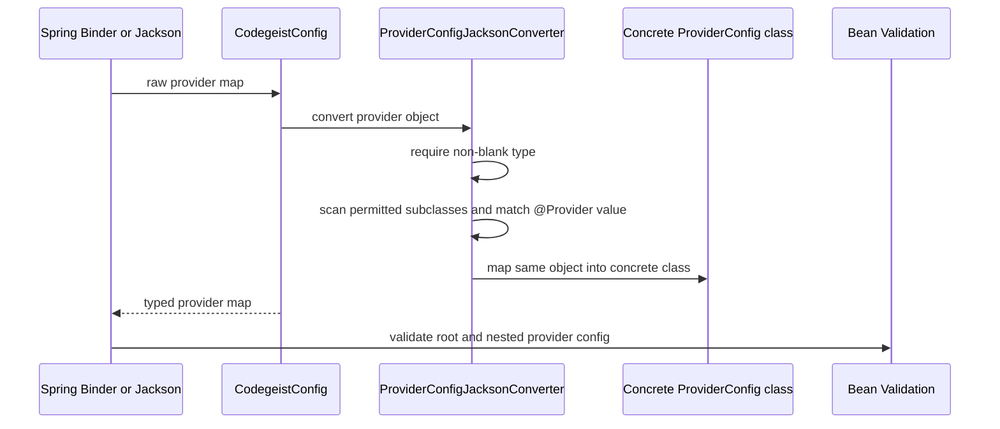
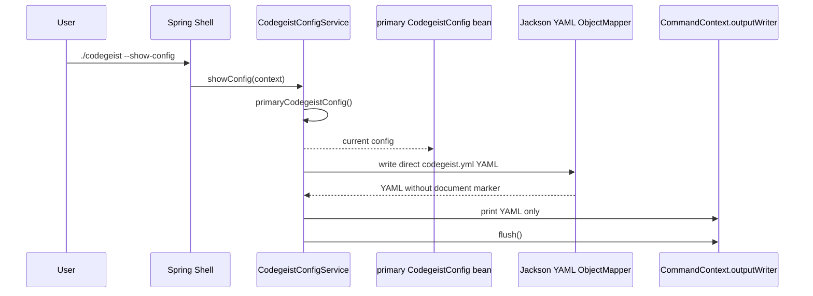

# Provider Configuration Architecture

Current-state source-code documentation for the implemented Codegeist provider
configuration slice under `app/codegeist/cli`.

## Scope

This document describes implemented config loading and rendering behavior only. It
does not describe provider client creation, Spring AI `ChatModel` or `ChatClient`
wiring, account checks, local daemon startup, model pulls, remote API calls,
home-path discovery, or service-level multi-source loading orchestration.

The current slice solves these problems:

- Bind Codegeist provider config from Spring application properties.
- Load an explicit direct `codegeist.yml` path with Jackson YAML.
- Evaluate trusted local Spring SpEL only in direct YAML string scalar values.
- Dispatch `provider.<id>.type` to concrete Java provider config classes.
- Validate config locally with Bean Validation after mapping.
- Render `--show-config` YAML directly, including configured sensitive values.

## Source Map

| File | Responsibility |
| --- | --- |
| `app/codegeist/cli/pom.xml` | Provides Jackson YAML, Lombok, Bean Validation, and the Spring AI dependency baseline. The provider chat slice adds `spring-ai-ollama`, but this config document covers only config loading and rendering behavior. |
| `app/codegeist/cli/src/main/java/ai/codegeist/app/CodegeistApplication.java` | Owns `APP_NAME = "codegeist"`, the shared Spring configuration prefix and application name. |
| `app/codegeist/cli/src/main/java/ai/codegeist/app/config/CodegeistConfig.java` | Spring-bound and Jackson-loadable root config model. Holds `provider` entries and normalizes raw provider maps into typed provider classes with the injected YAML mapper. |
| `app/codegeist/cli/src/main/java/ai/codegeist/app/config/ProviderConfig.java` | Abstract sealed base class for provider map values. Holds common provider data fields. |
| `app/codegeist/cli/src/main/java/ai/codegeist/app/config/OllamaProviderConfig.java` | Data-only config class for local Ollama settings. |
| `app/codegeist/cli/src/main/java/ai/codegeist/app/config/OpenAiProviderConfig.java` | Data-only config class for OpenAI settings. |
| `app/codegeist/cli/src/main/java/ai/codegeist/app/config/Provider.java` | Runtime annotation whose value is the YAML provider `type`. |
| `app/codegeist/cli/src/main/java/ai/codegeist/app/config/ProviderConfigJacksonConverter.java` | Shared annotation-backed type dispatch for raw provider maps and Jackson nodes. It scans sealed `ProviderConfig` permitted subclasses and filters by `@Provider`. |
| `app/codegeist/cli/src/main/java/ai/codegeist/app/config/CodegeistYamlConfiguration.java` | Spring configuration that exposes the qualified `codegeistYamlObjectMapper` bean for direct `codegeist.yml` parsing, provider normalization, and rendering. The mapper carries Jackson injectable values for direct `CodegeistConfig` loads. |
| `app/codegeist/cli/src/main/java/ai/codegeist/app/config/CodegeistYamlExpressionEvaluator.java` | Spring service that receives the YAML mapper bean and evaluates SpEL in direct-YAML string scalar values only. |
| `app/codegeist/cli/src/main/java/ai/codegeist/app/config/CodegeistConfigService.java` | Spring service that receives Spring-bound config, the YAML mapper bean, and the SpEL evaluator service; exposes the current primary config bean, owns `--show-config`, loads explicit YAML, runs validation, and renders direct YAML. |
| `app/codegeist/cli/src/main/java/ai/codegeist/app/config/CodegeistConfigValidationException.java` | User-facing runtime exception for Bean Validation failures, provider dispatch failures before Jackson wraps them, and SpEL failures. |
| `app/codegeist/cli/src/test/java/ai/codegeist/app/config/CodegeistConfigServiceTest.java` | Spring integration test for binding, direct load, primary config injection, validation, and direct YAML rendering. |
| `app/codegeist/cli/src/test/java/ai/codegeist/app/config/CodegeistProviderConfigTest.java` | Provider annotation dispatch and provider-specific validation tests. |
| `app/codegeist/cli/src/test/java/ai/codegeist/app/config/CodegeistConfigSpelEvaluationTest.java` | Direct YAML SpEL preprocessing tests. |
| `app/codegeist/cli/src/test/java/ai/codegeist/app/config/CodegeistConfigCommandTest.java` | Spring command test for `--show-config` stdout shape and unmasked value rendering. |
| `app/codegeist/cli/src/test/resources/application-codegeist-config-service-test.yml` | Profile-specific Spring YAML fixture for config binding and command-output tests. |

## Config Model

`CodegeistConfig` is both a Spring component and a configuration-properties target:

```java
@Component(CodegeistConfig.SPRING_BOUND_CONFIG_BEAN)
@ConfigurationProperties(prefix = CodegeistConfig.CONFIGURATION_PREFIX)
@JsonNaming(PropertyNamingStrategies.KebabCaseStrategy.class)
@Validated
public class CodegeistConfig {
    private Map<@NotBlank String, @Valid ProviderConfig> provider;
}
```

Spring Boot binds `codegeist.*` application properties into this bean. Direct
`codegeist.yml` files use the same root shape without a `codegeist:` wrapper.
`CodegeistConfig.CONFIGURATION_PREFIX` is backed by
`CodegeistApplication.APP_NAME`.

Provider entries are selected by the required provider object field `type`; there
is no fallback to the provider map key. For example:

```yaml
provider:
  openai:
    type: openai
    model: gpt-4o-mini
    api-key: "#{T(java.lang.System).getenv('OPENAI_API_KEY')}"
```

`ProviderConfig` is an abstract sealed base class with common fields:

- `type`
- `name`
- `enabled`
- `model`
- `base-url`
- `completions-path`
- `options`

Concrete provider classes add provider-specific data fields. `OpenAiProviderConfig`
adds `api-key`, `organization-id`, and `project-id`; `OllamaProviderConfig` relies
on the common fields plus `options`. These are config data contracts only.

Implemented provider types are:

```text
ollama, openai
```

Other provider types are unsupported because no concrete class is annotated for
them in this slice. This includes the broader provider matrix from `T006_02` and
`T006_03`, such as `docker-model-runner`, `azure-openai`, `anthropic`,
`bedrock-converse`, `google-genai`, `deepseek`, `minimax`, `mistral-ai`, `groq`,
`nvidia`, `perplexity`, `openrouter`, `moonshot`, `qianfan`, `opencode-zen`, and
`opencode-go`.

## Spring Component Model

`CodegeistConfigService` is a Spring `@Service`. It receives the Spring-bound
properties bean by field injection and the explicit bean name:

```java
@Autowired
@Qualifier(CodegeistConfig.SPRING_BOUND_CONFIG_BEAN)
private CodegeistConfig springBoundConfig;
```

The service exposes the current primary config bean:

```java
@Bean
@Primary
public CodegeistConfig primaryCodegeistConfig() {
    return springBoundConfig;
}
```

This is deliberately simple today: the primary bean is the Spring-bound config.
Later source-loading work can replace this method body without changing normal
unqualified `CodegeistConfig` injection sites.

`CodegeistConfig#setProvider(Map<String,Object>)` normalizes raw Spring Binder or
Jackson maps through `ProviderConfigJacksonConverter`. It uses the qualified YAML
`ObjectMapper` injected by Spring for the configuration-properties bean and by
Jackson injectable values for direct file loads. This avoids asking Spring Boot to
instantiate the abstract `ProviderConfig` base class while still keeping the public
getter typed as `Map<String, ProviderConfig>`.

## Direct YAML Loading Flow

`CodegeistYamlConfiguration` provides the qualified `codegeistYamlObjectMapper`
bean. `CodegeistYamlExpressionEvaluator` receives that mapper as a Spring service,
and `CodegeistConfigService.loadConfig(String configPath)` uses both beans in a
phased parser for an explicit file path:


SpEL behavior is intentionally narrow and trusted-local-input only:

- Only string scalar values containing `#{` are evaluated.
- YAML keys, provider ids, list indexes, comments, aliases, maps, and non-string
  scalars are not evaluated.
- Whole scalar expressions can return non-string values such as booleans,
  numbers, or `null` before mapping.
- Template strings with literal text plus expressions return strings.
- Evaluation uses a plain `StandardEvaluationContext` with no Codegeist helper
  variables, functions, sandbox, whitelist, denylist, custom type locator, or
  Spring bean resolver.
- Parse and evaluation failures include the source path and YAML value path, but
  not the raw evaluated value.

## Type Dispatch



`ProviderConfigJacksonConverter` uses `ProviderConfig.class.getPermittedSubclasses()`
for discovery and filters those classes by non-null `@Provider` annotation value.
There is no separate provider registry in this config-only slice.

## Show Config Flow

`--show-config` prints public YAML for the current primary config:



Rendering intentionally omits a Spring `codegeist:` wrapper and YAML document
marker. Empty default config still renders as:

```yaml
provider: {}
```

`--show-config` does not mask configured values. If the active config contains
`api-key`, `authorization`, `password`, `token`, `credentials`, or other sensitive
fields, those values are printed as YAML. Treat command output as sensitive.

## Multi-Source Status

The current slice has no model-level multi-source combination API. The primary
config bean returns the Spring-bound config, and `loadConfig(String)` returns the
single explicit YAML file it parses. Later home-path or startup-file work must
define its own combination semantics before adding additional sources.

## Validation Strategy

Validation is annotation-first:

- Provider ids are map keys and must be non-blank.
- Provider `type` is required and must resolve to a supported `@Provider` value.
- Provider `name` remains optional, but when present it must contain a non-blank
  character.
- Common provider `model` is required for the supported provider config classes.
- `ollama` requires `model` and `base-url`.
- `openai` requires `model` and `api-key`; `base-url`, `organization-id`,
  `project-id`, `completions-path`, and `options` remain optional config data.
- Validation never checks network availability, model existence, account balance,
  billing status, local daemon state, or remote credentials.

Direct Jackson YAML loading must keep the explicit `Validator` call. Jackson maps
objects but does not run Bean Validation by itself.

## Tests

| Test behavior | Proves |
| --- | --- |
| Spring profile fixture reaches `service.getSpringBoundConfig()` with typed provider objects | `@ConfigurationProperties`, component scan, raw-map normalization, and service injection work together. |
| Unqualified `CodegeistConfig` injection receives the current primary bean | `@Primary` targets normal app injection to the primary config. |
| Explicit YAML path loads provider-specific fields | Direct Jackson YAML loading maps into typed `CodegeistConfig`. |
| SpEL string scalars evaluate before mapping | Trusted local expressions can produce strings, booleans, numbers, and nulls. |
| YAML keys and non-string scalars stay literal | SpEL does not rewrite provider ids or existing scalar types. |
| Every supported `type` maps to its concrete class | `@Provider` dispatch is complete for `ollama` and `openai`. |
| Unsupported provider types fail | Broader provider-matrix and OpenCode-only types remain unsupported in this task. |
| Provider-specific missing fields fail validation | Bean Validation and narrow grouped checks protect config completeness locally. |
| `--show-config` prints parseable direct YAML with configured values unchanged | Spring Shell command wiring and YAML rendering work together. |
| Packaged native `--show-config` prints `provider: {}` for empty default config | Native image command mode and default empty rendering stay aligned with smoke scripts. |

Current verification commands:

```bash
task test TEST=CodegeistConfigCommandTest,CodegeistConfigServiceTest
task test TEST=CodegeistProviderConfigTest
task test TEST=CodegeistConfigSpelEvaluationTest
task test
git --no-pager diff --check
```

## Sharp Edges

- `codegeist.yml` SpEL is trusted local input and can run arbitrary allowed SpEL in
  the current JVM process. Do not treat it as safe for untrusted remote config.
- `CodegeistConfig#setProvider(Map<String,Object>)` is part of the binding
  contract. Removing it would make Spring Boot try to instantiate the abstract
  `ProviderConfig` base class.
- Spring and direct Jackson YAML loading currently reach typed providers through
  `CodegeistConfig#setProvider(...)` normalization.
- Jackson mapping and IO failures are not wrapped by `CodegeistConfigService`;
  Lombok `@SneakyThrows` lets them surface directly.
- Debug logging uses Lombok `@Slf4j` and remains file-only through current
  `logback.xml`; command stdout must stay YAML-only.
- `--show-config` prints configured values unchanged, including API keys or other
  sensitive values when they are present in config.
- The primary config bean is currently only the Spring-bound config. Home config
  and explicit startup config are not discovered or combined yet.
- Unknown provider object fields outside the modeled data shape are ignored by
  Jackson metadata. Unknown `options` entries are preserved because `options` is a
  map.
- Do not add Spring AI provider starters, provider clients, runtime registries,
  model pulls, or remote calls to this config slice.

## Future Task Impact

- Home-path discovery and explicit startup config orchestration should define
  multi-source combination behavior after each source is evaluated, mapped, and
  validated.
- Runtime provider selection should use the provider map and per-provider
  `enabled` fields until a later task defines additional selection policy.
- Provider client creation should remain lazy and should create only the selected
  provider's Spring AI model/client after config, safety gates, and account posture
  are checked.
- CLI-facing config commands should account for both `CodegeistConfigValidationException`
  and direct Jackson or IO exceptions from the SneakyThrows-based load path.
