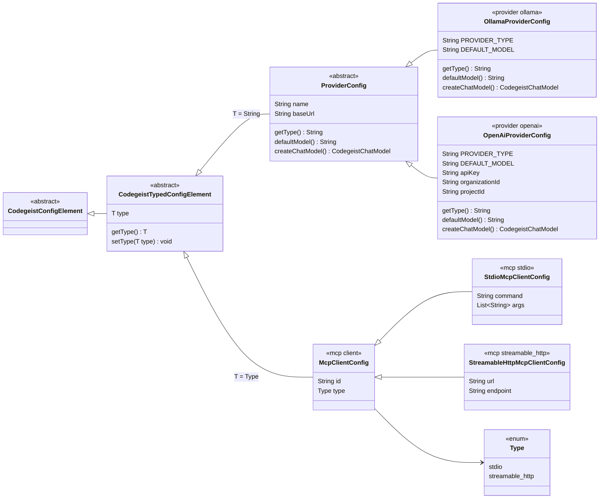
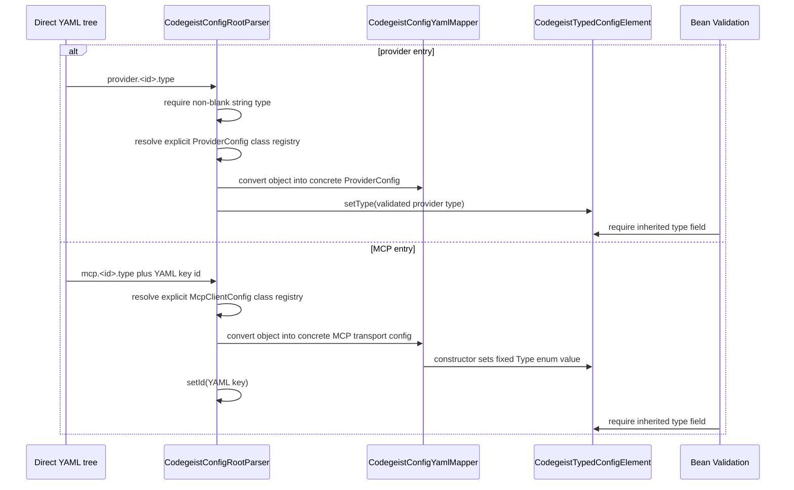
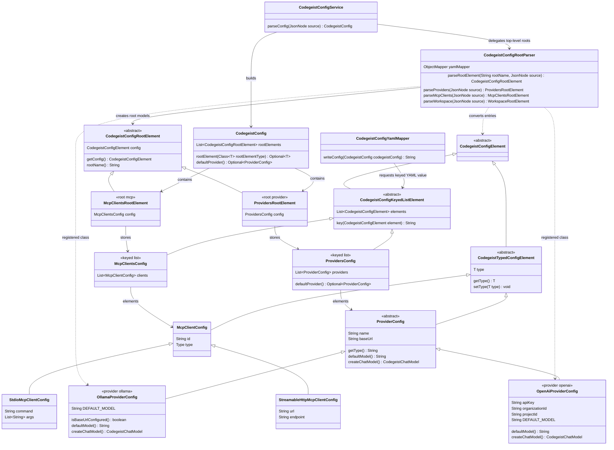
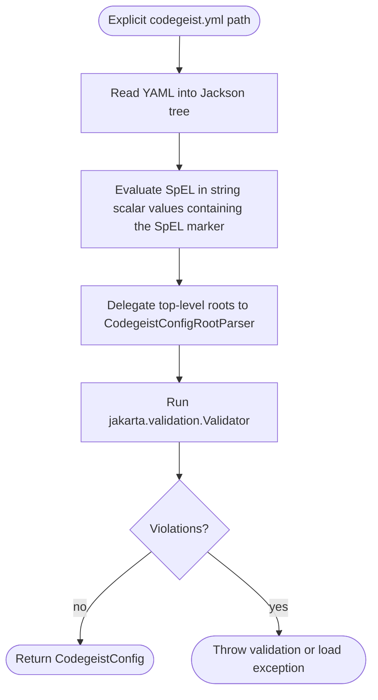
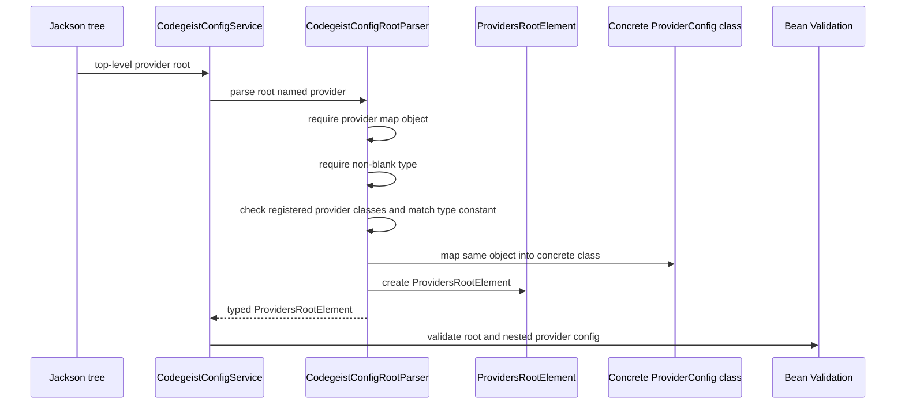
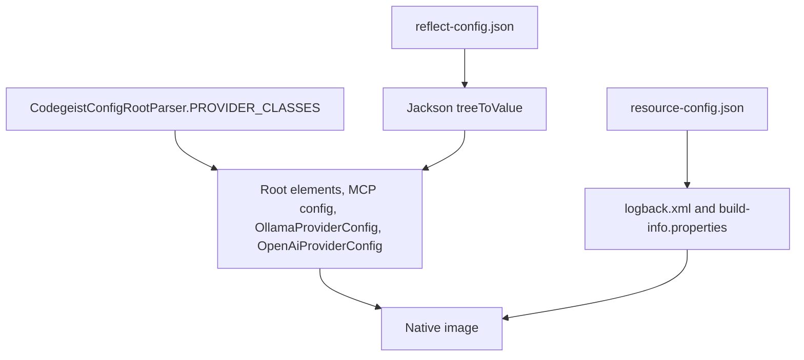
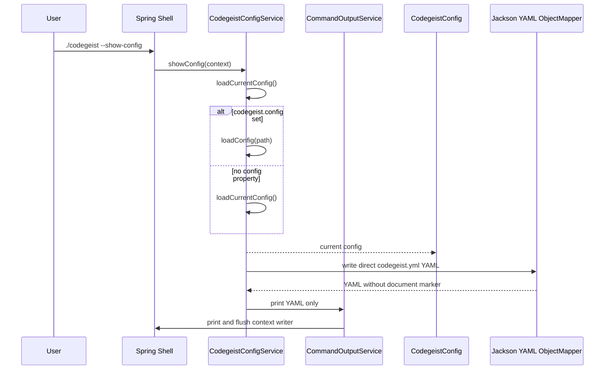

# Provider Configuration Architecture

Current-state source-code documentation for the implemented Codegeist provider
configuration slice under `app/codegeist/cli`.

## Scope

This document describes implemented config loading and rendering behavior plus the
current provider category policy boundary. It does not describe provider client
creation beyond the already implemented local Ollama chat seam, account setup,
local daemon startup, model pulls, home-path discovery, or service-level
multi-source loading orchestration.

The current slice solves these problems:

- Bind Codegeist provider config from Spring application properties.
- Load an explicit direct `codegeist.yml` path with Jackson YAML.
- Resolve the Spring `codegeist.config` property as the current global CLI config
  source when it is set, commonly through `-Dcodegeist.config=<path>` at startup.
- Evaluate trusted local Spring SpEL only in direct YAML string scalar values.
- Iterate each top-level config root and dispatch it through the central
  `CodegeistConfigRootParser` Spring service.
- Dispatch `provider.<id>.type` to concrete Java provider config classes.
- Parse a first top-level `mcp:` client catalog root as a provider-style YAML object
  keyed by client id, backed by a Java list of concrete transport config objects.
- Validate config locally with Bean Validation after mapping.
- Render `--show-config` YAML directly, including configured sensitive values.
- Keep provider config free of models, generation options, enablement, and
  completion-path routing; those are runtime selections made by a caller, coding
  agent, session, command, or provider-feature test method.
- Let each concrete provider config own a provider-specific default runtime model
  through `ProviderConfig.defaultModel()` without storing model names in YAML.

## Source Map

| File | Responsibility |
| --- | --- |
| `app/codegeist/cli/pom.xml` | Provides Jackson YAML, Lombok, Bean Validation, and the Spring AI dependency baseline. |
| `app/codegeist/cli/src/main/java/ai/codegeist/app/CodegeistApplication.java` | Owns `APP_NAME = "codegeist"`, the shared Spring configuration prefix and application name. |
| `app/codegeist/cli/src/main/java/ai/codegeist/app/config/CodegeistConfig.java` | Root config container. Holds a list of parsed `CodegeistConfigRootElement<? extends CodegeistConfigElement>` instances and exposes generic typed root lookup without per-root fields. |
| `app/codegeist/cli/src/main/java/ai/codegeist/app/config/CodegeistConfigElement.java` | Abstract base class for every config payload shape, including single objects, typed entries, and list-backed keyed objects. |
| `app/codegeist/cli/src/main/java/ai/codegeist/app/config/CodegeistTypedConfigElement.java` | Generic base class for entries that store a required nested YAML `type` discriminator with Lombok getter/setter, currently providers and MCP clients. |
| `app/codegeist/cli/src/main/java/ai/codegeist/app/config/CodegeistConfigKeyedListElement.java` | Shared list-backed config element that builds a transient provider-style YAML object from subclass-defined keys. |
| `app/codegeist/cli/src/main/java/ai/codegeist/app/config/CodegeistConfigRootElement.java` | Generic root element base class for naming one top-level YAML value and rendering its validated `T config` payload back to direct config YAML. |
| `app/codegeist/cli/src/main/java/ai/codegeist/app/config/CodegeistConfigRootParser.java` | Central Spring parser for all supported top-level direct YAML roots. It owns root dispatch, explicit `provider:`, `mcp:`, and `workspace:` parser methods, provider `type` dispatch, MCP YAML-key id copying, shape checks, and unsupported-root errors. |
| `app/codegeist/cli/src/main/java/ai/codegeist/app/config/ProvidersRootElement.java` | `provider:` root model that wraps `ProvidersConfig`. |
| `app/codegeist/cli/src/main/java/ai/codegeist/app/config/ProvidersConfig.java` | List-backed provider config element that renders a provider-keyed YAML object and exposes optional first-provider lookup. |
| `app/codegeist/cli/src/main/java/ai/codegeist/app/config/McpClientsRootElement.java` | `mcp:` root model for the first MCP client catalog shape. It wraps `McpClientsConfig`. |
| `app/codegeist/cli/src/main/java/ai/codegeist/app/config/McpClientsConfig.java` | List-backed MCP clients config element that renders a YAML object keyed by client id. |
| `app/codegeist/cli/src/main/java/ai/codegeist/app/config/McpClientConfig.java` | Abstract MCP client config base with internal `id` copied from the YAML key plus the shared transport `type` enum. |
| `app/codegeist/cli/src/main/java/ai/codegeist/app/config/StdioMcpClientConfig.java` | Concrete `stdio` MCP client config with required `command` and optional `args`. |
| `app/codegeist/cli/src/main/java/ai/codegeist/app/config/StreamableHttpMcpClientConfig.java` | Concrete `streamable_http` MCP client config with required `url` and optional `endpoint`. |
| `app/codegeist/cli/src/main/java/ai/codegeist/app/config/ProviderConfig.java` | Abstract base class for provider map values. Holds common access fields, exposes read-only output `type` through concrete constants, and declares provider-owned `defaultModel()` plus `createChatModel()`. |
| `app/codegeist/cli/src/main/java/ai/codegeist/app/config/OllamaProviderConfig.java` | Access config class for local Ollama settings, the `llama3.2:1b` default runtime model, and the concrete config-owned chat model seam. |
| `app/codegeist/cli/src/main/java/ai/codegeist/app/config/OpenAiProviderConfig.java` | Access config class for OpenAI settings and the `gpt-5-mini` default runtime model; chat-model creation is not implemented yet. |
| `app/codegeist/cli/src/main/resources/META-INF/native-image/reflect-config.json` | GraalVM reflection metadata that lets Jackson instantiate config root, provider, MCP, and workspace POJOs in native images. |
| `app/codegeist/cli/src/main/java/ai/codegeist/app/config/CodegeistConfigYamlMapper.java` | Spring service and Jackson mapper for direct `codegeist.yml` parsing, empty-safe source-tree loading, list-backed keyed element rendering, and direct YAML output. |
| `app/codegeist/cli/src/main/java/ai/codegeist/app/config/CodegeistYamlExpressionEvaluator.java` | Spring service that receives `CodegeistConfigYamlMapper` and evaluates SpEL in direct-YAML string scalar values only. |
| `app/codegeist/cli/src/main/java/ai/codegeist/app/config/CodegeistConfigService.java` | Spring service that receives `CodegeistConfigYamlMapper`, `CodegeistConfigRootParser`, the injected `codegeist.config` value, and the SpEL evaluator service; exposes the primary config bean parsed from `codegeist.config` when set, owns `--show-config`, loads explicit YAML, runs validation, and renders direct YAML. |
| `app/codegeist/cli/src/main/java/ai/codegeist/app/config/CodegeistConfigValidationException.java` | User-facing runtime exception for Bean Validation failures, provider dispatch failures before Jackson wraps them, and SpEL failures. |
| `app/codegeist/cli/src/test/java/ai/codegeist/app/config/CodegeistConfigServiceTest.java` | Spring integration test for binding, direct load, primary config injection, validation, and direct YAML rendering. |
| `app/codegeist/cli/src/test/java/ai/codegeist/app/config/CodegeistProviderConfigTest.java` | Explicit provider registry dispatch, provider-specific default-model, and validation tests. |
| `app/codegeist/cli/src/test/java/ai/codegeist/app/config/CodegeistConfigSpelEvaluationTest.java` | Direct YAML SpEL preprocessing tests. |
| `app/codegeist/cli/src/test/java/ai/codegeist/app/config/CodegeistConfigCommandTest.java` | Spring command test for `--show-config` stdout shape and unmasked value rendering. |
| `app/codegeist/cli/src/test/java/ai/codegeist/app/provider/ProviderCategory.java` | Class or method annotation for non-config provider feature categories. |
| `app/codegeist/cli/src/test/java/ai/codegeist/app/provider/ProviderTestExtension.java` | JUnit condition that skips annotated provider classes or methods unless `CODEGEIST_TEST_PROVIDER_CATEGORY` allows their category. |
| `app/codegeist/cli/src/test/java/ai/codegeist/app/provider/OpenAiProviderTest.java` | OpenAI config, model-list, image, text-to-speech, and speech-to-text checks guarded by method-level categories. |
| `app/codegeist/cli/src/test/java/ai/codegeist/app/provider/OllamaProviderTest.java` | Ollama config and local chat checks guarded by method-level categories. |

## Config Model

`CodegeistConfig` is a container of parsed root elements, not a per-root field
model:

```java
@JsonNaming(PropertyNamingStrategies.KebabCaseStrategy.class)
public class CodegeistConfig {
    private final List<@Valid CodegeistConfigRootElement<? extends CodegeistConfigElement>> rootElements;
}
```

`CodegeistConfigService` builds this container only from explicit direct
`codegeist.yml` files by delegating each top-level YAML field to
`CodegeistConfigRootParser`. Each top-level YAML field must match one root name
supported by that parser. `application.yaml` is not a Codegeist config source.

The direct `codegeist.yml` provider root is `provider:`. There is no `providers:`
alias.

Provider entries are selected by the required provider object field `type` through
the shared typed-map parsing path in `CodegeistConfigRootParser`; there is no
fallback to the provider map key. For example:

```yaml
provider:
  openai:
    type: openai
    api-key: "#{T(java.lang.System).getenv('OPENAI_API_KEY')}"
```

The first MCP root shape mirrors the provider YAML style while keeping the runtime
model list-backed:

```yaml
mcp:
  filesystem:
    type: stdio
    command: npx
    args:
      - -y
      - "@modelcontextprotocol/server-filesystem"
      - .
```

`streamable_http` clients use the same keyed root shape, but select their transport
with `type: streamable_http` and provide a required `url` plus an optional
`endpoint`. Codegeist treats `url` as the MCP server base address, for example
`http://127.0.0.1:3000`, and treats `endpoint` as the MCP path below that server,
for example `/mcp`. Keeping those fields separate matches the MCP Java SDK builder
contract, avoids ambiguous full-URL parsing in Codegeist, and leaves the endpoint
default owned by the SDK. When the endpoint is omitted or blank, Codegeist does not
call the builder `endpoint(...)` setter.

```yaml
mcp:
  remote-smoke:
    type: streamable_http
    url: http://127.0.0.1:3000
    endpoint: /mcp
```

The same config can omit the endpoint when the server uses the SDK default path:

```yaml
mcp:
  remote-smoke:
    type: streamable_http
    url: http://127.0.0.1:3000
```

The `mcp:` root is a YAML object keyed by client id, but `McpClientsConfig` stores
clients as a list. `CodegeistConfigRootParser` copies the YAML key into the internal
`McpClientConfig.id` field, so multiple MCP clients can share the same transport
`type`, such as `stdio`, without overwriting one another.

## Typed Config Element Contract

`CodegeistTypedConfigElement<T>` is the shared base for config entries whose public
YAML body contains a required nested `type` field. It is deliberately small: the base
class stores only that discriminator, exposes Lombok-generated getter/setter methods,
and marks the field with `@NotNull` so Bean Validation can catch missing typed-entry
values after Jackson mapping.

The class exists because Codegeist treats YAML map keys and YAML `type` values as two
different concepts:

- The YAML key is an entry id chosen by the user, such as `provider.openai` or
  `mcp.filesystem`.
- The nested `type` value selects a concrete provider implementation or an MCP
  transport kind.
- The root parser keeps those values separate instead of falling back from one to the
  other.
- The generic parameter keeps each config family tied to its own discriminator
  contract: `ProviderConfig` uses `String`, while `McpClientConfig` uses
  `McpClientConfig.Type`.

Provider and MCP entries use the same base class differently. Provider config uses
the YAML `type` as dispatch input before Jackson maps the entry to a concrete
provider class. The parser then copies the validated string into the inherited base
field for validation, while each concrete provider still exposes its stable runtime
type through an overriding `getType()` constant. MCP config also dispatches in
`CodegeistConfigRootParser`, but to concrete transport POJOs. The concrete MCP
constructors set the inherited `McpClientConfig.Type` value, so the parser does not
need to set it again after mapping.



The parse flow keeps the shared base class simple while letting each root own its
type-specific validation and failure behavior:



The runtime contracts that follow from this shape are intentionally narrow:

- `CodegeistTypedConfigElement<T>` must not gain provider-specific fields, MCP
  transport fields, model settings, or enablement flags.
- Adding another typed root should first decide whether it needs provider-style
  pre-mapping dispatch, MCP-style enum mapping, or a different root-specific parser
  branch.
- Missing direct-YAML `type` values fail in `CodegeistConfigRootParser` before
  concrete mapping; the inherited `@NotNull` still protects programmatically created
  typed config objects during Bean Validation. Unsupported provider `type` values
  fail in `CodegeistConfigRootParser` before concrete mapping.
- Unsupported MCP transport text from direct YAML also fails in
  `CodegeistConfigRootParser` before concrete mapping. `CodegeistMcpAdapter` expects
  already parsed config and only opens clients for the current prompt turn.

`ProviderConfig` is an abstract base class with common stored fields:

- `name`
- `base-url`

The YAML `type` field is dispatch-only input for providers. `CodegeistConfigRootParser`
validates it before concrete mapping, copies it into the shared
`CodegeistTypedConfigElement` field for Bean Validation, and each concrete
`ProviderConfig.getType()` still returns its constant read-only output value.
`ProvidersConfig.defaultProvider()` returns an `Optional<ProviderConfig>` for the
first non-null provider in its parsed provider list. The provider root stores this
list-backed config element and renders a provider-keyed YAML object only at
serialization time.
`CodegeistConfig.defaultProvider()` also returns `Optional<ProviderConfig>`;
callers that require a provider choose the failure policy at their boundary.

Concrete provider classes add provider-specific data fields and own a
provider-specific `defaultModel()` runtime fallback. `OpenAiProviderConfig` adds
`api-key`, `organization-id`, and `project-id`, and returns `gpt-5-mini` as its
default runtime model. `OllamaProviderConfig` relies on the common access fields,
returns `llama3.2:1b`, and creates the first concrete chat model. Stored provider
config remains an access data contract and does not contain YAML model names,
generation options, enablement, or completion-path routing.



Implemented provider types are:

```text
ollama, openai
```

Other provider types are unsupported because this slice ships no concrete config
class registered for them. `CodegeistConfigRootParser` performs the shared
type-field lookup and supplies its explicit Java registry of provider type constants
and config classes without branching on runtime environment.
A provider class that Jackson must instantiate in the native image also needs
matching `reflect-config.json` metadata. Unsupported
types include the broader provider matrix from `T006_02` and `T006_03`, such as
`docker-model-runner`, `azure-openai`, `anthropic`, `bedrock-converse`,
`google-genai`, `deepseek`, `minimax`, `mistral-ai`, `groq`, `nvidia`,
`perplexity`, `openrouter`, `moonshot`, `qianfan`, `opencode-zen`, and
`opencode-go`.

## Spring Component Model

`CodegeistConfigService` is a Spring `@Service`. It receives
`CodegeistConfigYamlMapper`, `CodegeistConfigRootParser`, SpEL evaluator, Bean
Validation `Validator`, and `CommandOutputService` as final
collaborators through Lombok `@RequiredArgsConstructor`. The `codegeist.config`
property remains a non-final `@Value` field.

```java
@RequiredArgsConstructor
public class CodegeistConfigService {
    private final CodegeistConfigYamlMapper yamlMapper;
}
```

`CodegeistConfigRootParser` is the separate Spring service that receives
`CodegeistConfigYamlMapper`, owns unsupported top-level root errors, and creates
non-Spring `CodegeistConfigRootElement` model instances. Root element subclasses are
not Spring components.

The service exposes the current primary config bean:

```java
@Bean
@Primary
public CodegeistConfig loadCurrentConfig() {
    ...
}
```

The primary bean loads the direct YAML path from the injected `codegeist.config`
value when it is set and otherwise returns the empty default config. Command paths
that need the active global CLI source call `loadCurrentConfig()`, which uses the
same policy.

## Direct YAML Loading Flow

`CodegeistConfigYamlMapper` provides the direct config YAML Jackson behavior and
empty-safe source-tree loading. `CodegeistYamlExpressionEvaluator` receives that
mapper as a Spring service, and `CodegeistConfigService.loadConfig(String
configPath)` uses both services in a phased parser for an explicit file path:



SpEL behavior is intentionally narrow and trusted-local-input only:

- Only string scalar values containing `#{` are evaluated.
- YAML keys, provider ids, list indexes, comments, aliases, maps, and non-string
  scalars are not evaluated.
- Whole scalar expressions can return non-string values such as booleans,
  numbers, or `null` before mapping.
- Template strings with literal text plus expressions return strings.
- Evaluation uses a plain `StandardEvaluationContext` with no Codegeist helper
  variables, functions, sandbox, whitelist, denylist, custom type locator, or
  Spring bean resolver.
- Parse and evaluation failures include the source path and YAML value path, but
  not the raw evaluated value.

## Provider Type Dispatch



`CodegeistConfigRootParser` owns the explicit registry of supported `ProviderConfig`
implementations, matches each registered provider type constant against the YAML
`type` field, and does not branch on whether Codegeist is running on the JVM or as a
native image. This keeps provider dispatch GraalVM-friendly instead of relying on
runtime classpath scanning.

## Native Metadata Flow

Native-image metadata has two separate jobs. `resource-config.json` embeds runtime
resources such as `logback.xml` and `META-INF/build-info.properties`.
`reflect-config.json` grants Jackson reflective access to config root element and
concrete provider config POJOs selected by the central root parser.



There is no runtime package scanning, `ServiceLoader`, or broad `.class` resource
include in the current provider dispatch path. Adding another provider config class
means updating the Java registry and `reflect-config.json`, then proving the change
with `task native-smoke`.

## Show Config Flow

`--show-config` prints public YAML for the current global CLI config source:



Rendering intentionally omits a Spring `codegeist:` wrapper and YAML document
marker. Empty default config has no synthetic roots and renders as:

```yaml
{}
```

`--show-config` does not mask configured values. If the active config contains
`api-key`, `authorization`, `password`, `token`, `credentials`, or other sensitive
fields, those values are printed as YAML. Treat command output as sensitive.

## Multi-Source Status

The current slice has no model-level multi-source combination API. The primary
config bean is empty, `loadConfig(String)` returns the single explicit YAML file it
parses, and `loadCurrentConfig()` chooses that explicit file only when the injected
`codegeist.config` value is set. Later home-path work must define its own discovery
and combination semantics before adding additional sources.

## Validation Strategy

Validation is parser-first for YAML keys and annotation-first for mapped config
objects:

- Provider YAML keys must be non-blank during root parsing, but they are not stored
  after mapping; provider type becomes the derived map-view key.
- Provider `type` is required and must resolve to a supported provider type
  constant in `ProvidersRootElement`.
- Provider `name` remains optional, but when present it must contain a non-blank
  character.
- `ollama` requires `base-url`.
- `openai` requires `api-key`; `base-url`, `organization-id`, and `project-id`
  remain optional config data.
- Model selection, generation options, enablement, and completion-path routing are
  intentionally not part of provider validation because they vary by coding agent,
  session, command, or provider feature test method.
- Validation never checks network availability, model existence, account balance,
  billing status, local daemon state, or remote credentials.

Direct Jackson YAML loading must keep the explicit `Validator` call. Jackson maps
objects but does not run Bean Validation by itself.

Detailed provider feature test policy, categories, and command-selection guidance
lives in `docs/tests/provider-feature-tests.md`.

## Tests

| Test behavior | Proves |
| --- | --- |
| Unqualified `CodegeistConfig` injection receives the parsed `codegeist.config` file when configured | `@Primary` targets normal app injection without treating `application.yaml` as Codegeist config. |
| Explicit YAML path loads provider-specific fields | Direct Jackson YAML loading maps into typed `CodegeistConfig`. |
| Explicit YAML path loads MCP client fields | Direct root iteration reaches `McpClientsRootElement` and maps the first MCP provider-style YAML object into a list-backed model. |
| Multiple MCP clients can use the same `type` | Client identity comes from the YAML object key, not from transport type values such as `stdio`. |
| `-Dcodegeist.config=<path>` resolves current CLI config | Command paths can share one global explicit config source instead of per-command config options. |
| SpEL string scalars evaluate before mapping | Trusted local expressions can produce strings, booleans, numbers, and nulls. |
| YAML keys and non-string scalars stay literal | SpEL does not rewrite provider keys before root parsing or existing scalar types. |
| Every supported `type` maps to its concrete class | The explicit provider registry is complete for `ollama` and `openai`. |
| Unsupported provider types fail | Broader provider-matrix and OpenCode-only types remain unsupported in this task. |
| Provider-specific missing fields fail validation | Bean Validation and narrow grouped checks protect config completeness locally. |
| `--show-config` prints parseable direct YAML with configured values unchanged | Spring Shell command wiring and YAML rendering work together. |
| Packaged native `--show-config` prints `{}` for empty default config | Native image command mode and default empty rendering stay aligned with smoke scripts. |
| Provider feature tests run through `task test` with method-level categories | `CODEGEIST_TEST_PROVIDER_CATEGORY` defaults to `none`; local calls require `local`, while hosted calls require explicit `remote_free` or `remote_paid` selection. |
| `OpenAiProviderTest` and `OllamaProviderTest` guard each feature method with a category | Provider feature checks run only when the selected policy allows the method category and check id. |

Current verification commands:

```bash
task test TEST=CodegeistConfigCommandTest,CodegeistConfigServiceTest
task test TEST=CodegeistProviderConfigTest
task test TEST=CodegeistConfigSpelEvaluationTest
CODEGEIST_TEST_PROVIDER_CATEGORY=none task test TEST=OpenAiProviderTest,OllamaProviderTest
CODEGEIST_TEST_PROVIDER_CATEGORY=local task test TEST=AskCommandsTest,OllamaProviderTest
task test
git --no-pager diff --check
```

## Sharp Edges

- `codegeist.yml` SpEL is trusted local input and can run arbitrary allowed SpEL in
  the current JVM process. Do not treat it as safe for untrusted remote config.
- Config roots must have a matching root name in `CodegeistConfigRootParser`. Direct
  YAML loading rejects unsupported top-level roots instead of ignoring them.
- `CodegeistConfigRootParser` owns shared map-entry parsing for type-dispatched root
  elements, while `CodegeistConfigRootElement` owns the generic validated `T config`
  slot for single-object roots. Do not reintroduce per-root fields such as
  `provider`, `mcp`, or `workspace` on `CodegeistConfig`.
- Jackson mapping and IO failures are not wrapped by `CodegeistConfigService`;
  Lombok `@SneakyThrows` lets them surface directly.
- Debug logging uses Lombok `@Slf4j` and remains file-only through current
  `logback.xml`; command stdout must stay YAML-only.
- `--show-config` prints configured values unchanged, including API keys or other
  sensitive values when they are present in config.
- The primary config bean and `loadCurrentConfig()` support the explicit
  `codegeist.config` system property, but home config and broader startup config
  discovery are not implemented or combined yet.
- Unknown provider object fields outside the modeled data shape are ignored by
  Jackson metadata. Do not rely on ignored fields for runtime behavior.
- Provider feature tests do not make local calls by default because the provider
  category default is `none`. Use `CODEGEIST_TEST_PROVIDER_CATEGORY=local` when a
  run should include local provider calls. Hosted calls still require explicit
  `remote_free` or `remote_paid` selection.
- Do not add Spring AI provider starters, provider clients, runtime registries,
  model pulls, or remote calls to this config slice.

## Future Task Impact

- Home-path discovery and explicit startup config orchestration should define
  multi-source combination behavior after each source is evaluated, mapped, and
  validated.
- Runtime provider selection should use the provider map until a later task defines
  additional selection policy. Model, generation-option, enablement, and route/path
  selection must remain outside `ProviderConfig`.
- Provider client creation should remain lazy and should create only the selected
  provider's Spring AI model/client after config, safety gates, and account posture
  are checked.
- CLI-facing config commands should account for both `CodegeistConfigValidationException`
  and direct Jackson or IO exceptions from the SneakyThrows-based load path.
