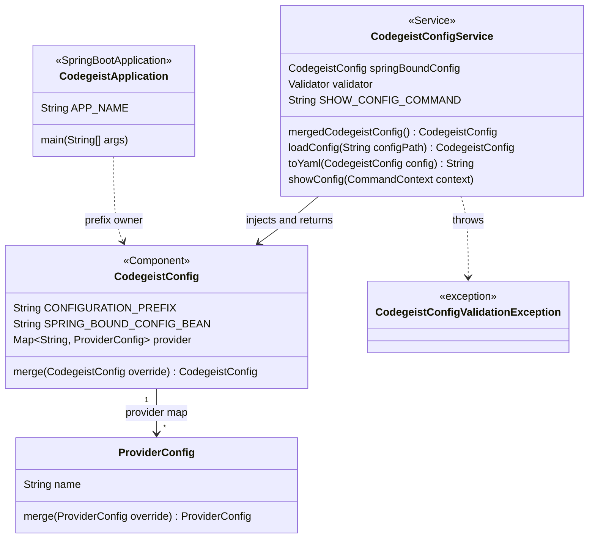
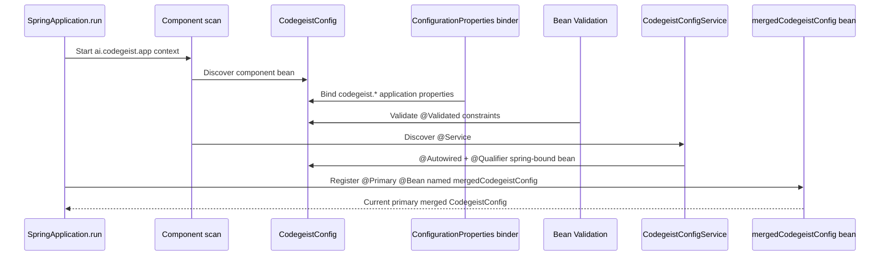
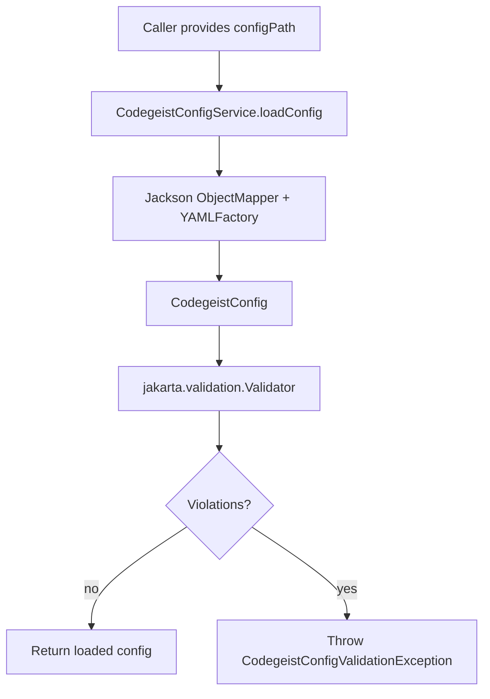
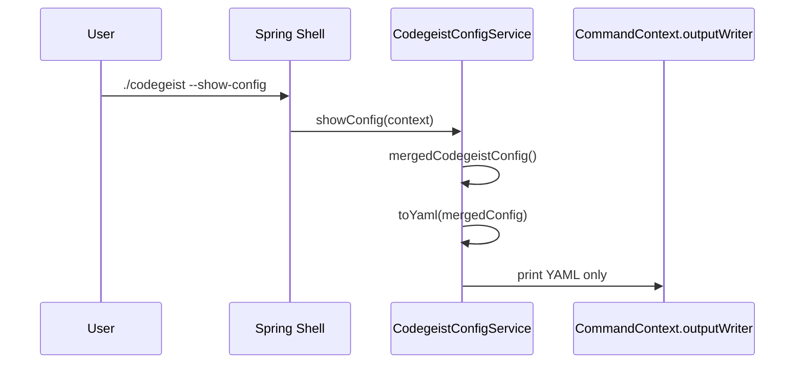
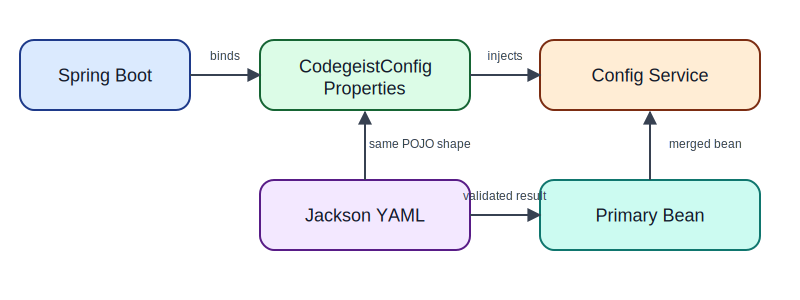

# Provider Configuration Architecture

Current-state source-code documentation for the implemented Codegeist provider
configuration slice under `app/codegeist/cli`.

## Scope

This document describes the implemented minimal provider config access path. It
does not describe the future provider matrix, credentials, model selection,
provider calls, home-path discovery, or service-level multi-source merge
orchestration.

The current slice solves these near-term problems:

- Provide one Codegeist-owned config model that Spring can bind from
  `application.yaml` and Jackson can load from an explicit `codegeist.yml` path.
- Provide a named primary merged config bean that callers can inject without
  repeating raw `@Qualifier` strings.
- Add annotation-first validation so invalid explicit YAML fails before later
  provider work consumes it.
- Provide non-mutating model-level merge methods for later source-order work.
- Provide `--show-config` so users and tests can inspect the current merged config
  as direct `codegeist.yml` YAML.

## Source Map

| File | Responsibility |
| --- | --- |
| `app/codegeist/cli/pom.xml` | Adds Jackson YAML, Lombok, and Spring Bean Validation dependencies for config loading and validation. |
| `app/codegeist/cli/src/main/java/ai/codegeist/app/CodegeistApplication.java` | Owns `APP_NAME = "codegeist"`, the shared Spring configuration prefix and application name. |
| `app/codegeist/cli/src/main/java/ai/codegeist/app/config/CodegeistConfig.java` | Spring-bound and Jackson-loadable config model. Holds the provider map, Bean Validation constraints, and model-level merge behavior. |
| `app/codegeist/cli/src/main/java/ai/codegeist/app/config/ProviderConfig.java` | Minimal per-provider config value. Currently only optional `name`. |
| `app/codegeist/cli/src/main/java/ai/codegeist/app/config/CodegeistConfigService.java` | Spring service that receives Spring-bound properties, exposes the current primary merged bean, owns the `--show-config` Spring Shell command, loads explicit YAML, writes command output, runs validation after direct loads, and emits debug logs through Lombok `@Slf4j`. |
| `app/codegeist/cli/src/main/java/ai/codegeist/app/config/CodegeistConfigValidationException.java` | User-facing runtime exception for invalid direct YAML loads. |
| `app/codegeist/cli/src/test/java/ai/codegeist/app/config/CodegeistConfigServiceTest.java` | Spring integration test for binding, direct load, merged-bean injection, validation, and direct YAML rendering. |
| `app/codegeist/cli/src/test/java/ai/codegeist/app/config/CodegeistConfigMergeTest.java` | Unit test for non-mutating config model merge behavior. |
| `app/codegeist/cli/src/test/java/ai/codegeist/app/config/CodegeistConfigCommandTest.java` | Spring command test for `--show-config` stdout and direct YAML shape. |
| `app/codegeist/cli/src/test/resources/application-codegeist-config-service-test.yml` | Profile-specific Spring YAML fixture for config binding tests. |

## Spring Component Model

`CodegeistConfig` is both a Spring component and a configuration
properties target:

```java
@Slf4j
@Component(CodegeistConfig.SPRING_BOUND_CONFIG_BEAN)
@ConfigurationProperties(prefix = CodegeistConfig.CONFIGURATION_PREFIX)
@Validated
public class CodegeistConfig {
    @Valid
    private Map<@NotBlank String, @Valid ProviderConfig> provider = new LinkedHashMap<>();
}
```

Spring discovers it through component scanning below `ai.codegeist.app` because
`CodegeistApplication` is annotated with `@SpringBootApplication`. During context
startup, Spring Boot binds `codegeist.provider.*` values from application config
into this bean and applies Bean Validation because the class is `@Validated`.
`CodegeistConfig.CONFIGURATION_PREFIX` is the annotation-facing prefix constant;
its value is `CodegeistApplication.APP_NAME` so the application name remains the
single source of truth.

`CodegeistConfigService` is a Spring `@Service`. It receives the Spring-bound
properties bean by field injection and the explicit bean name:

```java
@Slf4j
@Service
public class CodegeistConfigService {
    @Autowired
    @Qualifier(CodegeistConfig.SPRING_BOUND_CONFIG_BEAN)
    private CodegeistConfig springBoundConfig;
}
```

Current provider configuration Spring classes use Lombok `@Slf4j`. The service
logs debug-level messages when the merged bean is created, when an explicit YAML
file is loaded, and when validation passes or fails. These messages are
diagnostic only and remain file-only through the current `logback.xml` setup.

The service also exposes the current merged config bean:

```java
@Bean
@Primary
public CodegeistConfig mergedCodegeistConfig() {
    return springBoundConfig;
}
```

This is deliberately simple today: the merged bean is the Spring-bound config.
Later source merge work can replace this method body without changing injection
sites.

`CodegeistConfig.merge(...)` is the current model-level source merge
primitive. It returns a new config instance, keeps the `provider.<id>` map shape
for Spring and direct YAML binding, adds providers by id, and delegates
per-provider field precedence to `ProviderConfig.merge(...)`. It does not discover
home config files or apply source order by itself; `CodegeistConfigService` still
returns only the Spring-bound config as the primary merged bean.

The service also serializes config through `toYaml(...)`. This uses the same
Jackson YAML mapper family as direct file loading, omits null values, disables the
YAML document marker, and emits the direct `codegeist.yml` shape rather than the
Spring `codegeist:` wrapper.

Callers that want the primary merged config bean inject `CodegeistConfig` by type
without a qualifier:

```java
@Autowired
private CodegeistConfig mergedConfig;
```

`@Primary` makes that unqualified injection resolve to the merged bean. Only
`CodegeistConfigService` should use `SPRING_BOUND_CONFIG_BEAN` to access the
unmerged Spring-bound source.

## Class Diagram



## Spring Binding Flow



Important Spring behavior:

- `@ConfigurationProperties` binding is a Spring Boot context-startup concern.
- `@Validated` applies to that Spring-bound properties bean during binding.
- The `@Bean` method currently creates another bean reference to the same config
  object, not a deep copy.
- `@Primary` makes the merged bean the default `CodegeistConfig` choice
  when a caller injects by type and does not qualify the Spring-bound bean.

## Direct YAML Loading Flow

Direct `codegeist.yml` loading is intentionally not a Spring environment import.
It is an explicit service operation for one path:



Jackson maps the YAML to the same POJO shape that Spring uses, but Jackson does
not evaluate Bean Validation annotations. `CodegeistConfigService` therefore calls
`Validator.validate(loadedConfig)` after `readValue(...)` and formats any
violations with the source path.

## Show Config Flow

`--show-config` is the read-only command path for inspecting the current merged
config. The output is meant to be copyable as `codegeist.yml`, so it does not add
labels, prose, log output, a `codegeist:` wrapper, or a YAML document marker.



Current example output:

```yaml
provider:
  ollama:
    name: "Ollama"
```

For an otherwise empty config object, the renderer keeps the top-level shape
visible as `provider: {}`.

## Editable Overview Sketch

The following Excalidraw SVG is an editable high-level sketch of the current
binding, direct-load, validation, and merged-bean path. The `--show-config`
command flow is captured in the Mermaid sequence above.



## Validation Strategy

Validation is annotation-first and intentionally small:

- Provider config may be absent or empty.
- Provider ids are map keys and must be non-blank:
  `Map<@NotBlank String, @Valid ProviderConfig>`.
- `ProviderConfig.name` is optional.
- If `ProviderConfig.name` is present, it must contain a non-blank character.
- Unknown YAML keys are ignored for now through Jackson metadata on the POJOs.
- Model references, credentials, provider options, capabilities, and limits are
  not validated because the current model does not contain those fields.

The custom exception is intentionally small. It marks the failure as a Codegeist
config validation problem and preserves the source path in the message. Later CLI
commands can catch this exception and turn it into a structured command error.

## Tests

`CodegeistConfigServiceTest` is a Spring integration test because it proves Spring
binding, service wiring, and primary merged-config injection. It also drives the
direct YAML load method with temporary files.

| Test behavior | Proves |
| --- | --- |
| Spring profile fixture reaches `service.getSpringBoundConfig()` | `@ConfigurationProperties`, component scan, and service injection work together. |
| Unqualified `CodegeistConfig` injection receives the current merged bean | `@Primary` targets normal app injection to the merged config. |
| Explicit YAML path loads provider name | Jackson YAML maps to `CodegeistConfig`. |
| Empty config renders as `provider: {}` without `---` or `codegeist:` | `toYaml(...)` emits direct `codegeist.yml` shape. |
| Config model merge adds providers and overrides provider fields by id | The T006_01 merge direction is implemented as non-mutating model methods. |
| Provider without `name` is accepted | The minimal model keeps provider name optional. |
| Blank provider id is rejected | Map-key Bean Validation is active after direct YAML loading. |
| Present-but-blank provider name is rejected | Nested provider Bean Validation is active after direct YAML loading. |
| `--show-config` prints parseable direct YAML and no stderr | Spring Shell command wiring, merged config injection, and YAML rendering work together. |
| Packaged native `--show-config` prints `provider: {}` | Native image resource metadata, Spring Shell command mode, file-only logging, and direct YAML rendering survive archive packaging. |

Current verification commands:

```bash
mvn --batch-mode --no-transfer-progress -Dtest=CodegeistConfigCommandTest,CodegeistConfigServiceTest test
mvn --batch-mode --no-transfer-progress -Dtest=CodegeistConfigMergeTest test
mvn --batch-mode --no-transfer-progress test
task native-smoke
git --no-pager diff --check
```

## Sharp Edges

- Direct Jackson YAML loading must keep the explicit `Validator` call; annotations
  alone are not enough outside Spring binding.
- Debug logging uses Lombok `@Slf4j`, which emits through SLF4J. Spring Boot's
  default logging stack writes those records through Logback into the current
  file-only output when debug logging is enabled.
- The primary merged config bean is currently only the Spring-bound config. Do not
  assume home config or explicit startup config is merged yet.
- `--show-config` therefore prints only the current Spring-bound config until
  home-path loading and service-level source merge orchestration are implemented.
- Config model `merge(...)` methods are available for later source-order work, but
  no runtime source discovery calls them yet.
- Unknown YAML keys are ignored. If strict config files become required, that is a
  separate behavior change because Jackson unknown-property handling is not the
  same as Bean Validation.
- Avoid adding provider account, credential, or model-reference validation before
  `T006_02` and `T006_03` define the provider matrix and credential strategy.

## Future Task Impact

- `T006_04` should add home-path discovery and service-level source merge
  orchestration without changing the unqualified `CodegeistConfig` injection
  contract.
- Merge validation should run on the final merged config, not only on individual
  loaded sources.
- Later provider fields should prefer Bean Validation annotations first, then add
  narrow custom validation only for cross-field or source-aware rules.
- CLI-facing config commands should catch `CodegeistConfigValidationException` and
  render concise path-aware errors.
