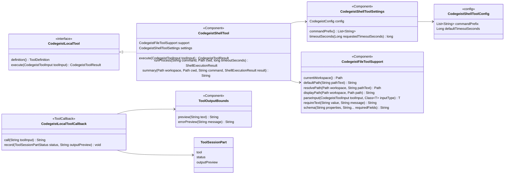
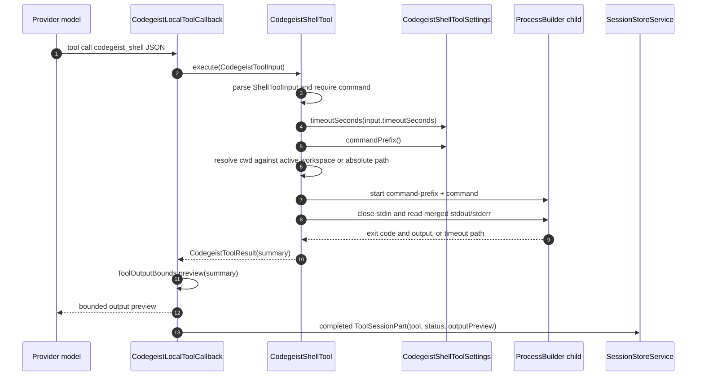

# Codegeist Shell Tool Architecture

Detailed current-state developer documentation for the implemented
`codegeist_shell` local tool and its ask-driven artifact smoke coverage.

## Scope

This document describes the shell tool implemented under `ai.codegeist.app.tool`.
It covers the public tool contract, direct `codegeist.yml` settings, Spring
component model, process lifecycle, timeout behavior, output/session recording,
cross-platform ask-driven smoke harness, tests, native metadata, and maintenance
constraints.

This document does not describe a shell sandbox, permission prompts, command
scanning, plugin environment hooks, persistent shells, background process
management, PTY behavior, full-output side files, or a full coding-agent control
loop. Those behaviors are intentionally deferred.

## Current Status

`codegeist_shell` is a Codegeist-owned Spring AI local tool callback. It runs one
local process per tool call through an explicit host-side command wrapper, closes
stdin immediately, merges stderr into stdout, reports the exit code, and returns a
stable text summary. `CodegeistLocalToolCallback` applies the normal global output
preview cap before the summary is returned to the model or recorded in
`.codegeist/session.json`.

The shell tool is intentionally small. It is not workspace-contained, not a
sandbox, and not a process supervisor. Relative `cwd` values resolve under the
active workspace; absolute `cwd` values are accepted as caller-provided filesystem
paths. Missing cwd, file cwd, symlink escapes, external directories, and wrapper
isolation are left to the configured operating-system process behavior and the
host-side wrapper chosen by the user.

## Source Map

| File | Role |
| --- | --- |
| `app/codegeist/cli/src/main/java/ai/codegeist/app/tool/CodegeistShellTool.java` | Package-private Spring component implementing `codegeist_shell`, input parsing, cwd resolution, process execution, timeout handling, child-process cleanup, and shell result summary rendering. |
| `app/codegeist/cli/src/main/java/ai/codegeist/app/tool/CodegeistShellToolSettings.java` | Package-private Spring component resolving `tools.codegeist-shell.command-prefix` and per-call timeout fallback from direct `codegeist.yml`. |
| `app/codegeist/cli/src/main/java/ai/codegeist/app/config/CodegeistShellToolConfig.java` | Direct `tools.codegeist-shell:` config payload with Bean Validation for wrapper argv entries and positive default timeout seconds. |
| `app/codegeist/cli/src/main/java/ai/codegeist/app/config/ToolsConfig.java` | Direct `tools:` root payload containing both `codegeist-edit` and `codegeist-shell` branches. |
| `app/codegeist/cli/src/main/java/ai/codegeist/app/tool/CodegeistFileToolSupport.java` | Shared helper reused for active workspace lookup, path resolution, display-path rendering, JSON parsing, and schema assembly. |
| `app/codegeist/cli/src/main/java/ai/codegeist/app/tool/CodegeistLocalToolCallback.java` | Bounds completed local-tool output, records completed `ToolSessionPart` values, and converts handled `CodegeistToolException` failures into failed parts. |
| `app/codegeist/cli/src/main/java/ai/codegeist/app/tool/ToolOutputBounds.java` | Owns the final preview cap applied at the local callback boundary. |
| `app/codegeist/cli/src/main/resources/META-INF/native-image/reflect-config.json` | Native-image reflection metadata for `CodegeistShellTool$ShellToolInput` and `CodegeistShellToolConfig`. |
| `app/codegeist/cli/src/test/java/ai/codegeist/app/tool/CodegeistLocalToolsTest.java` | Focused JVM contract coverage for schema, command prefix, successful execution, cwd behavior, non-zero exit, timeout, blank command failure, bounded output, and recorded parts. |
| `app/codegeist/cli/src/test/java/ai/codegeist/app/config/CodegeistToolsConfigTest.java` | Direct YAML coverage for `tools.codegeist-shell` loading, rendering, and Bean Validation failures. |
| `scripts/tests/shell-ask-smoke.ps1` | Cross-platform artifact sub-harness proving the real `ask` plus provider tool-calling path can execute `codegeist_shell` and persist its completed tool part. |
| `scripts/tests/artifact-smoke.ps1` | Shared native-only package harness that invokes `shell-ask-smoke.ps1` for every native platform artifact. |
| `docs/developer/architecture/local-file-tools.md` | Subsystem overview for all local tools and MCP bridge behavior. This document is the focused shell-tool deep dive. |

## Public Tool Contract

Callback name:

```text
codegeist_shell
```

Spring AI description:

```text
Run one local shell command
```

Input JSON:

```json
{
  "command": "printf hello",
  "cwd": ".",
  "timeoutSeconds": 10
}
```

Field contract:

| Field | Required | Meaning |
| --- | --- | --- |
| `command` | yes | Non-blank command string passed as the final argv entry after the configured command prefix. |
| `cwd` | no | Working directory. Defaults to `.`. Relative values resolve against the active workspace; absolute values are accepted as caller-provided filesystem paths. |
| `timeoutSeconds` | no | Positive timeout in seconds for this process call. Missing, zero, or negative values fall back to `tools.codegeist-shell.default-timeout-seconds`. |

The schema is model-facing guidance. `CodegeistToolJsonMapper` currently ignores
unknown JSON fields, so additional input properties are not behavior and should not
be documented as supported unless a focused task adds tests and implementation.

## Direct Config

The shell tool has direct `codegeist.yml` settings under the `tools:` root:

```yaml
tools:
  codegeist-shell:
    command-prefix:
      - pwsh
      - -NoProfile
      - -NonInteractive
      - -Command
    default-timeout-seconds: 120
```

Settings behavior:

| Setting | Runtime owner | Default | Validation | Behavior |
| --- | --- | --- | --- | --- |
| `tools.codegeist-shell.command-prefix` | `CodegeistShellToolSettings.commandPrefix()` | `cmd.exe`, `/c` on Windows; `sh`, `-lc` elsewhere | Each configured entry must be non-blank. Empty list means default. | Host-side argv prefix. Codegeist appends the model-supplied `command` as the final argv entry and does not split or reinterpret configured values. |
| `tools.codegeist-shell.default-timeout-seconds` | `CodegeistShellToolSettings.timeoutSeconds(...)` | `120` | Must be positive when configured. | Per-call fallback when `timeoutSeconds` is absent or non-positive. |

The command prefix is not a sandbox policy. It can point at `pwsh`, `docker`, a
wrapper script, or another host command, but Codegeist does not add mounts, user
ids, environment filtering, network restrictions, container cwd mapping, or process
tree supervision. If a wrapper is intended to isolate execution, every isolation
flag must be part of the configured argv list.

## Component Model



## Runtime Flow



The generic local callback boundary is the only place where completed shell output
is capped. `CodegeistShellTool` builds the full shell summary first; the callback
then applies `ToolOutputBounds.preview(...)` before returning or recording it. This
keeps `codegeist_shell` aligned with read, write, edit, MCP, and future local tools.

## Process Lifecycle

`CodegeistShellTool` builds a `ProcessBuilder` with `settings.commandPrefix()` plus
the requested command as the final argv entry. It sets the process working directory
to the resolved `cwd`, redirects stderr into stdout, starts the process in a single
worker future, closes stdin immediately, reads all merged output as UTF-8, and waits
for the exit code.

Normal completion returns:

```text
Command: <command>
Cwd: <workspace-relative-or-absolute-display-path>
Exit code: <process exit code>
Output:
<merged stdout/stderr>
```

Non-zero exit codes are completed shell results, not tool failures. The exit code
and merged output are evidence for the model. This mirrors common shell-tool
behavior in coding agents: a command can fail while the tool call itself succeeded.

Startup failures, invalid input, and interruptions are handled tool failures.
`CodegeistLocalToolCallback` records those as failed `ToolSessionPart` values and
returns bounded error text to the model. The current startup failure text is stable:

```text
Failed to run shell command
```

## Timeout Behavior

Timeouts are completed shell results with a synthetic exit code:

```text
Command: <command>
Cwd: <display path>
Timed out: true
Exit code: -1
Output:
```

The timeout path cancels the worker future, destroys the direct child process, waits
briefly, and then calls `destroyForcibly()` if the process is still alive. This is
best-effort direct child cleanup only. Codegeist does not currently own process-tree
cleanup, background process state, or a sandbox guarantee for grandchildren created
by the shell wrapper.

## Cwd And Workspace Policy

The shell cwd contract is intentionally different from `codegeist_edit`:

| Behavior | Current contract |
| --- | --- |
| Missing `cwd` | Defaults to `.` and resolves under the active workspace. |
| Relative `cwd` | Resolves against the active workspace through `CodegeistFileToolSupport.resolvePath(...)`. |
| Absolute `cwd` | Accepted as a caller-provided filesystem path. |
| Workspace containment | Not enforced for shell cwd. |
| `workspace.dir-guard-disabled` | Irrelevant for shell execution; it only affects file-mutation target containment for `codegeist_edit`. |
| Symlink escape checks | Not implemented for shell cwd. |
| Existence/directory pre-check | Not implemented; `ProcessBuilder.start()` owns the startup failure. |

This is not a security boundary. Future permission prompts or external-directory
approval should be designed explicitly instead of overloading the current cwd rules.

## Output And Session Contract

The persisted session part stays deliberately small:

```json
{
  "type": "tool",
  "tool": "codegeist_shell",
  "status": "completed",
  "outputPreview": "Command: ..."
}
```

Current persistence rules:

| Scenario | Status | Preview expectations |
| --- | --- | --- |
| Exit code `0` | `completed` | Contains command, cwd, `Exit code: 0`, and merged output. |
| Non-zero exit | `completed` | Contains the non-zero exit code and merged output. |
| Timeout | `completed` | Contains `Timed out: true` and `Exit code: -1`. |
| Missing or blank command | `failed` | Contains `Required text field is missing: command`. |
| Startup failure | `failed` | Contains `Failed to run shell command`. |
| Interrupted execution | `failed` | Contains `Shell command interrupted` and re-interrupts the thread. |

Do not add process ids, duration, environment, full raw output, stream separation,
or typed shell metadata to `ToolSessionPart` unless a focused task adds tests and a
real consumer for those fields.

## Ask-Driven Shell Smoke

`scripts/tests/shell-ask-smoke.ps1` proves the real provider tool-calling path,
not just direct Java method execution. It follows the same deterministic fixture
pattern as `file-edit-ask-smoke.ps1`:

1. Start a local Ollama-compatible HTTP fixture on a loopback port.
2. Write a temporary `codegeist.yml` with `provider.ollama.base-url` pointing at
   the fixture and `workspace.directory` pointing at a disposable workspace.
3. Configure `tools.codegeist-shell.command-prefix` to use PowerShell 7:

   ```yaml
   tools:
     codegeist-shell:
       command-prefix:
         - pwsh
         - -NoProfile
         - -NonInteractive
         - -Command
       default-timeout-seconds: 10
   ```

4. Run the artifact's real `ask` command with the temporary config and session
   directory.
5. Have the fixture return an Ollama `/api/chat` response whose `tool_calls` entry
   asks for `codegeist_shell` with this shape:

   ```json
   {
     "command": "Set-Content -LiteralPath 'shell-smoke.txt' -Value 'shell-smoke' -NoNewline; Write-Output 'shell-output'",
     "cwd": ".",
     "timeoutSeconds": 10
   }
   ```

6. Let Spring AI invoke the actual `ToolCallback` exposed by Codegeist.
7. Have the fixture answer the second chat request with the completion message.
8. Assert that the workspace file exists with exact content `shell-smoke`.
9. Assert that `.codegeist/session.json` contains a completed
   `ToolSessionPart(tool=codegeist_shell)` whose preview includes `Exit code: 0`
   and `shell-output`.

The smoke intentionally uses a deterministic fixture provider instead of relying on
a real LLM to choose the shell tool. This keeps release smokes stable while still
testing the real `ask`, Spring AI tool-call, local callback, side effect, and
session-store path.

## Cross-Platform Smoke Constraints

The shell smoke must run the same way on Linux, Windows, and macOS native artifacts.
For that reason it uses PowerShell 7 as the configured command wrapper instead of
platform-specific shell syntax.

Important constraints:

- Keep the fixture command valid PowerShell 7.
- Do not use `sh`, `bash`, `cmd.exe`, `printf`, `echo`, or platform-specific path
  separators in the smoke command.
- Keep the smoke target path relative to `cwd` so the same command works under the
  configured workspace on every platform.
- Keep provider behavior deterministic by returning explicit Ollama-compatible
  `tool_calls` from the fixture.
- Keep assertions based on side effects and persisted session parts, not on model
  wording.

`artifact-smoke.ps1` invokes `shell-ask-smoke.ps1` for every native platform after
the file-edit smoke. Release CI, local Linux smoke, Windows QEMU smoke, and macOS
release validation therefore share the same shell-tool artifact contract.

## Tests And Verification

Focused JVM verification from `app/codegeist/cli`:

```bash
task test TEST=CodegeistToolsConfigTest,CodegeistLocalToolsTest
```

This selector proves:

| Area | Coverage |
| --- | --- |
| Schema | `command`, `cwd`, and `timeoutSeconds` are advertised; unsupported fields such as `workdir`, `timeoutMillis`, background, PTY, and stdin are absent. |
| Settings | Configured command prefix and default timeout are resolved correctly. |
| Success path | A command with merged stdout/stderr records a completed `ToolSessionPart`. |
| Relative cwd | Commands run with relative cwd under the active workspace. |
| Absolute cwd | Absolute cwd outside the workspace is allowed. |
| Non-zero exit | Non-zero exit records a completed result with the exit code. |
| Timeout | Timeout records `Timed out: true`, exit code `-1`, and terminates the direct child before the marker file is written. |
| Input failure | Blank or missing command records a failed tool part. |
| Output bounds | Completed shell output is bounded through the normal local callback cap and persisted preview equals returned preview. |

Artifact-level shell smoke after a native build:

```bash
task native-smoke
```

Direct artifact harness invocation, useful after a native executable already exists:

```bash
pwsh -NoProfile -File scripts/tests/artifact-smoke.ps1 -Platform linux-x64 -CliDir app/codegeist/cli
```

Direct shell sub-harness invocation, useful while changing only the harness:

```bash
pwsh -NoProfile -File scripts/tests/shell-ask-smoke.ps1 \
  -ArtifactPath app/codegeist/cli/target/codegeist \
  -SmokeRoot app/codegeist/cli/target/smoke-test/shell-ask
```

Use the equivalent native binary path for Windows or macOS. Do not use this direct
sub-harness as a replacement for `artifact-smoke.ps1` when validating release-shaped
archives, because the artifact harness also packages, unpacks, runs command smokes,
and checks logs.

## Native Image Metadata

Native image builds need reflection metadata for Jackson-bound input and config
types. `reflect-config.json` must include:

- `ai.codegeist.app.tool.CodegeistShellTool$ShellToolInput`
- `ai.codegeist.app.config.CodegeistShellToolConfig`

If `ShellToolInput` metadata is missing, a native artifact can expose the tool but
fail to bind Ollama tool-call arguments at runtime. If `CodegeistShellToolConfig`
metadata is missing, native config loading can fail or ignore the direct
`tools.codegeist-shell` payload. Prove metadata changes with `task native-smoke`
when time and native-image availability allow it.

## Maintenance Constraints

When changing `codegeist_shell`:

- Keep one process per tool call unless a task explicitly implements background
  process management.
- Keep stdin closed; do not add interactive input or PTY behavior without a focused
  task and smoke plan.
- Keep completed output bounded at `CodegeistLocalToolCallback` like other local
  tools.
- Keep non-zero exit codes as completed shell results.
- Keep timeouts as completed shell results with `Timed out: true` and exit code
  `-1` unless a focused task changes the public contract and tests.
- Keep `workspace.dir-guard-disabled` file-mutation-specific. Do not make it a shell
  cwd policy toggle.
- Keep the artifact smoke deterministic through fixture-provider tool calls, not
  real model choice.
- Update `docs/tests/smoke-tests.md`, `local-file-tools.md`, and this document when
  shell smoke behavior changes.
- Update `reflect-config.json` and run native verification when adding new
  Jackson-bound shell input or config types.

## Deferred Work

The following features are intentionally absent and should not be added as incidental
refactors:

- Permission prompts and external-directory approvals.
- Shell command parsing or tree-sitter command scanning.
- Allow/deny lists for commands.
- Configurable environment variables or plugin-provided environment hooks.
- Process-tree cleanup beyond the direct child process.
- Persistent shell sessions, background process registry, or PTY support.
- Duration metadata, process ids, stdout/stderr split fields, raw-output side files,
  or typed shell result fields in `.codegeist/session.json`.
- Treating shell file mutation as a replacement for `codegeist_write` or
  `codegeist_edit`.

## Troubleshooting

| Symptom | Likely cause | Where to inspect |
| --- | --- | --- |
| Native `ask` exits before hitting fixture `/api/chat` | Command-line properties or config path did not reach the artifact. | Smoke stdout/stderr files and `codegeist.log` under `target/smoke-test/...`. |
| Fixture receives `/api/version` but no `/api/chat` | Spring Shell did not dispatch `ask`, config failed, or provider setup failed before chat. | `codegeist.log`, fixture log, and generated `codegeist.yml`. |
| Tool part is missing from `session.json` | Provider did not emit `tool_calls`, Spring AI did not execute callbacks, or callback failed before recording. | Fixture response log, `session.json`, and `CodegeistLocalToolsTest`. |
| Shell output file is missing but tool part completed | The configured command wrapper ran, but the command did not write in the expected cwd. | `outputPreview` for `Command`, `Cwd`, `Exit code`, and `Output`. |
| Native-only tool input binding fails | Reflection metadata for `ShellToolInput` is missing or stale. | `reflect-config.json` and `task native-smoke` output. |
| Cross-platform smoke fails only on one OS | The smoke command or wrapper config used platform-specific syntax. | `shell-ask-smoke.ps1` command string and generated `tools.codegeist-shell.command-prefix`. |
