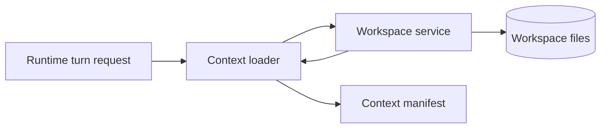

# Context Workspace Manifest

Architecture blueprint for future Codegeist context loading and workspace file
validation. This document describes intended contracts, diagrams, and illustrative
Java shapes only. It does not create Java packages, source files, tests, runtime
services, provider calls, embeddings, indexes, or tool execution.

## Purpose

Context loading must be deterministic, bounded, and explainable. A future runtime
turn should be able to ask a context loader for selected repository context and
receive a manifest that explains which sources were included, which were skipped,
and why.

The workspace boundary is the prerequisite for every future file read. Context
loading may decide what it wants to read, but workspace validation decides whether
a requested path is eligible to read inside the active repository root.

This blueprint narrows the first implementation target:

- Centralize repository root and path-safety decisions in a workspace service.
- Make context-source selection explicit instead of scanning the repository
  opportunistically.
- Produce a manifest that is useful for user-facing diagnostics, tests, events,
  and later UI/server inspection.
- Keep Graphify, Repomix, embeddings, RAG, LSP indexes, and provider calls out of
  the automatic context path.

## Boundary Summary



The runtime owns the turn. The context loader owns deterministic source ordering
and manifest creation. The workspace service owns root identity, canonical path
validation, generated/ignored posture, secret-like path posture, symlink escape
handling, missing-path classification, and read eligibility.

## Workspace Service Contract

The first workspace service should expose one narrow responsibility: classify an
explicit candidate path before any future context reader opens it.

| Responsibility | Required behavior |
| --- | --- |
| Root identity | Resolve one active `WorkspaceRef` for the current repository or worktree root. |
| Canonical path validation | Normalize and canonicalize candidate paths before classification. |
| Root boundary | Deny paths whose canonical target is outside the allowed workspace root. |
| Generated/ignored posture | Skip ignored, generated, dependency, or build-output paths by default. |
| Secret-like posture | Deny paths that look like secrets, credentials, tokens, or local env files. |
| Symlink escape handling | Treat symlinks that resolve outside the root as denied `symlink_escape`. |
| Missing paths | Classify optional missing inputs without failing the whole context request. |
| Read eligibility | Return a typed verdict before a reader opens the file. |

Workspace validation should not duplicate provider, permission, or runtime logic.
It answers only whether a path is safe and eligible to read for the requested
context purpose.

Initial generated or ignored examples include `target/`, `bin/`, `.class`,
`.jar`, dependency directories, rendered or regenerated analysis outputs, and
large files ignored by repository policy. Initial secret-like examples include
`.env`, `.local.env`, private keys, credential files, token dumps, and paths whose
names contain common credential markers.

## Context Loader Request

The context loader should accept explicit selections. The first request shape is a
runtime-owned input, not a Spring Shell DTO, HTTP payload, provider prompt, or
storage row.

| Field | Purpose | Selection posture |
| --- | --- | --- |
| `workspaceRef` | Identifies the root that workspace validation uses. | Required. |
| `requestId` | Correlates manifest, diagnostics, and future events. | Required. |
| `mode` | Records Plan or Build mode for explanation. | Required; does not change ordering. |
| `sessionId` | Links context to an existing session when present. | Optional. |
| `activeTaskPath` | Points at the current task file. | Optional explicit path. |
| `selectedRules` | Repo rule files such as `.opencode/rules/*.md` and local overlays. | Explicit list or named default set. |
| `selectedMemory` | Memory files under `docs/memory-bank/`. | Explicit list or named default set. |
| `selectedTasks` | Task files under `docs/tasks/`. | Explicit list, with active task first. |
| `selectedDeveloperDocs` | Developer documents under `docs/developer/`. | Explicit list. |
| `selectedThirdPartyArtifacts` | Third-party summaries or artifacts under `docs/third-party/`. | Explicit path only. |
| `selectedSourceSnippets` | Source files or bounded snippets from workspace files. | Explicit path only. |

Automatic repository-wide discovery is intentionally excluded from the first
contract. Later implementations may add named presets, indexes, or search, but
the first manifest should be reproducible from the request fields alone.

## Source Ordering

The loader should produce the same ordered result for the same request and
workspace state. Plan and Build share this ordering; mode changes tool and
permission behavior elsewhere, not context determinism.

Initial source order:

1. Runtime request summary: mode, session id when present, workspace id, and
   active task path when present.
2. Selected repo rules from `.opencode/rules/` and selected local overlays from
   `.oc_local/rules/`, sorted by normalized path within each group.
3. Selected memory files under `docs/memory-bank/`, sorted by normalized path.
4. Active task file, then additional selected task files under `docs/tasks/`,
   sorted by normalized path after the active task.
5. Selected developer docs under `docs/developer/`, sorted by normalized path.
6. Selected third-party summaries or artifacts under `docs/third-party/`, sorted
   by normalized path and included only when explicitly requested.
7. Selected source snippets, sorted by normalized path and then snippet range.

When two inputs normalize to the same path, the loader should include it once and
record all request reasons in the manifest entry. Deduplication should happen
after workspace validation so denied duplicates can still be explained.

## Manifest Contract

The manifest is an explainability artifact. It should be safe to show in CLI,
server, or Vaadin diagnostics because it contains summaries and metadata rather
than complete file payloads by default.

Required manifest fields:

| Field | Purpose |
| --- | --- |
| `manifestId` | Stable id for this context selection result. |
| `requestId` | Links the manifest back to the runtime/context request. |
| `workspaceRef` | Records the validated workspace identity. |
| `createdAt` | Timestamp for diagnostics and future events. |
| `ordering` | Names the deterministic ordering policy version. |
| `includedSources` | Ordered entries that passed workspace validation and loader limits. |
| `skippedSources` | Ordered entries that were not included, with reasons. |
| `warnings` | Non-fatal issues such as stale summaries or truncated snippets. |
| `limits` | Applied limits such as max bytes, max sources, or max snippet range. |

Included source fields:

| Field | Purpose |
| --- | --- |
| `kind` | `runtime`, `rule`, `memory`, `task`, `developer_doc`, `third_party_artifact`, or `source_snippet`. |
| `path` | Repo-relative path when a file-backed source exists. |
| `summary` | Short explanation of why the source was included. |
| `reasons` | Request reasons such as `active_task`, `selected_rule`, or `explicit_source`. |
| `sizeBytes` | Size of the included or referenced content. |
| `lineRange` | Optional line range for source snippets. |
| `redactionStatus` | `not_needed`, `redacted`, or `blocked_before_read`. |
| `contentRef` | Optional pointer to a bounded payload or future artifact reference. |

Skipped source fields:

| Field | Purpose |
| --- | --- |
| `kind` | Same source kind vocabulary as included entries. |
| `path` | Candidate repo-relative path when known. |
| `reason` | Typed skip reason. |
| `summary` | Human-readable explanation. |
| `redactionStatus` | Usually `blocked_before_read` for secret-like paths. |

Initial skip reasons:

| Reason | Meaning |
| --- | --- |
| `generated` | The path is generated output or a build/dependency artifact. |
| `ignored` | Repository ignore policy excludes the path from normal context reads. |
| `heavy` | The path is too large or known to be an expensive generated analysis output. |
| `missing_optional` | The request named an optional file that does not exist. |
| `outside_root` | Canonical path validation resolved outside the workspace root. |
| `symlink_escape` | A symlink resolves outside the workspace root. |
| `secret_like` | The path or filename suggests credentials or private local config. |
| `unsupported_source` | The request named a source kind the first loader does not support. |

Warnings should be reserved for non-fatal concerns, such as stale third-party
summary metadata, an applied size limit, duplicate selected paths, or a line range
that had to be clamped to the available file length.

## Example Manifest Shape

```json
{
  "manifestId": "ctxm_01",
  "requestId": "prompt_01",
  "workspaceRef": "workspace_main",
  "ordering": "context-order-v1",
  "includedSources": [
    {
      "kind": "task",
      "path": "docs/tasks/T002_implement-codegeist-mvp-foundation/tasks/T002_05_add_context_workspace_manifest_slice.md",
      "summary": "Active task specification for the context/workspace manifest slice.",
      "reasons": ["active_task"],
      "sizeBytes": 4200,
      "redactionStatus": "not_needed"
    }
  ],
  "skippedSources": [
    {
      "kind": "source_snippet",
      "path": ".local.env",
      "reason": "secret_like",
      "summary": "Local environment files are blocked before read.",
      "redactionStatus": "blocked_before_read"
    }
  ],
  "warnings": []
}
```

The example is intentionally metadata-first. A future implementation may keep
bounded content separately and refer to it through `contentRef` so session events
and diagnostics avoid carrying unlimited file contents.

## Graphify And Repomix Posture

Graphify and Repomix outputs are useful context references, but they must stay
on-demand for the first loader because they can be large, generated, stale, or
specialized for a research question.

Default posture:

- Do not run Graphify, Repomix, verification scripts, or any external tool during
  context loading.
- Do not automatically load `repomix-output.*`, `graphify-out/`, rendered SVGs,
  logs, manifests, or generated reports.
- Allow explicit third-party summary paths, such as curated markdown under
  `docs/third-party/<project>/`, after workspace validation.
- Record skipped heavy generated artifacts in the manifest when the request names
  them explicitly.

Dedicated workflows such as `/ask-project-repomix` may still load a packed
third-party repository into a separate agent context. That is a different,
explicit research workflow and should not become automatic runtime context.

## Future Java File Map

When a later implementation task creates Java source, use this file map as a
starting point. Each type should live in its own `.java` file unless an
implementation task has a concrete reason to keep small package-private helpers
together.

| Future file | Role | Notes |
| --- | --- | --- |
| `app/codegeist/cli/src/main/java/ai/codegeist/workspace/WorkspaceRef.java` | Workspace identity value | Identifies the active repository or worktree root. |
| `app/codegeist/cli/src/main/java/ai/codegeist/workspace/WorkspacePath.java` | Repo-relative path value | Stores normalized repo-relative paths only. |
| `app/codegeist/cli/src/main/java/ai/codegeist/workspace/WorkspacePathVerdict.java` | Validation result enum | Covers allowed and skipped/denied path states. |
| `app/codegeist/cli/src/main/java/ai/codegeist/workspace/WorkspacePathPolicy.java` | Path validation port | Classifies candidate paths before reads. |
| `app/codegeist/cli/src/main/java/ai/codegeist/context/ContextLoadRequest.java` | Runtime-to-context request | Explicit selected sources only. |
| `app/codegeist/cli/src/main/java/ai/codegeist/context/ContextSourceKind.java` | Context source kind enum | Shared by included and skipped manifest entries. |
| `app/codegeist/cli/src/main/java/ai/codegeist/context/ContextSkipReason.java` | Skip reason enum | Mirrors manifest reason vocabulary. |
| `app/codegeist/cli/src/main/java/ai/codegeist/context/ContextManifest.java` | Manifest aggregate | Contains ordered included and skipped entries. |
| `app/codegeist/cli/src/main/java/ai/codegeist/context/ContextLoader.java` | Context loading port | Creates a manifest from a request. |

No source files from this map exist yet.

## Future Java Type Sketch

These examples are target shapes for a later implementation, not source to add in
this documentation-only task.

```java
package ai.codegeist.context;

import ai.codegeist.workspace.WorkspaceRef;
import java.nio.file.Path;
import java.time.Instant;
import java.util.List;
import java.util.Optional;

public record ContextLoadRequest(
    String requestId,
    WorkspaceRef workspaceRef,
    String mode,
    Optional<String> sessionId,
    Optional<Path> activeTaskPath,
    List<Path> selectedRules,
    List<Path> selectedMemory,
    List<Path> selectedTasks,
    List<Path> selectedDeveloperDocs,
    List<Path> selectedThirdPartyArtifacts,
    List<SourceSnippetSelection> selectedSourceSnippets
) {
}

public record ContextManifest(
    String manifestId,
    String requestId,
    WorkspaceRef workspaceRef,
    Instant createdAt,
    String ordering,
    List<IncludedContextSource> includedSources,
    List<SkippedContextSource> skippedSources,
    List<ContextWarning> warnings
) {
}
```

```java
package ai.codegeist.workspace;

import java.nio.file.Path;

public interface WorkspacePathPolicy {
    WorkspacePathClassification classifyForRead(
        WorkspaceRef workspaceRef,
        Path candidatePath,
        String purpose
    );
}
```

The concrete implementation should validate paths before opening files. It should
also keep manifest creation testable without provider calls, shell commands,
Graphify, Repomix, embeddings, or filesystem mutation.

## Future Test Handoff

The first implementation task should add focused tests before or with Java source.
Suggested coverage:

- Same request and same workspace state produce the same manifest order.
- Active task appears before other selected task docs.
- Duplicate selected paths produce one included entry with multiple reasons.
- Missing optional paths are skipped with `missing_optional`.
- Outside-root paths are denied with `outside_root` before read.
- Symlink escapes are denied with `symlink_escape` before read.
- Secret-like paths are denied with `secret_like` before read.
- Generated, ignored, and heavy paths are skipped with the matching reason.
- Explicit third-party summaries can be included, while generated Graphify and
  Repomix outputs remain skipped unless a later policy changes.

No test fixtures, package directories, or Java files are created by this document.

## Open Decision

The first implementation task still needs to choose which runtime request or
command supplies `activeTaskPath` to the context loader. `T002_04` deliberately
kept CLI prompt-mode input limited to prompt text, selected Plan/Build mode,
optional session id, source, and request/correlation metadata, so active task path
selection remains a context/runtime concern rather than a Spring Shell concern.
