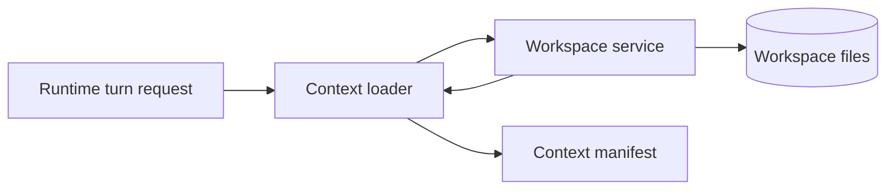
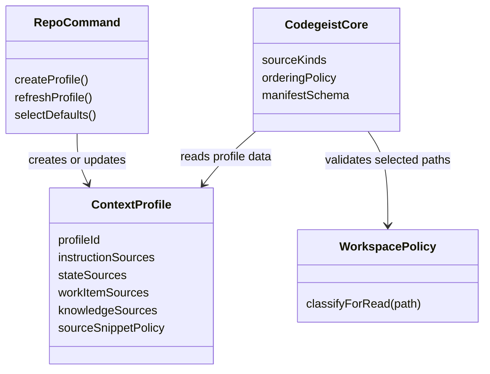
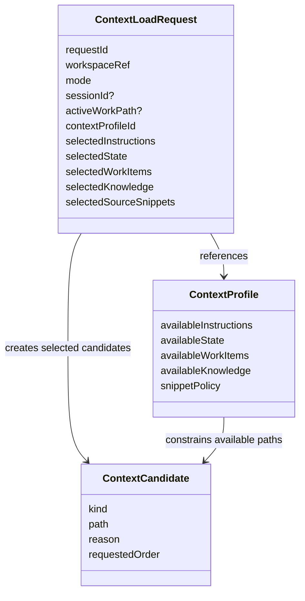
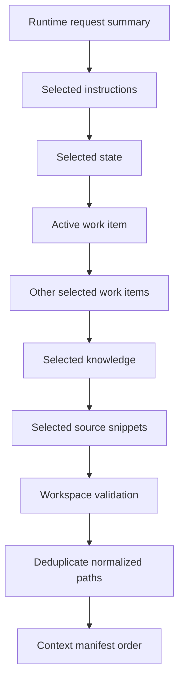
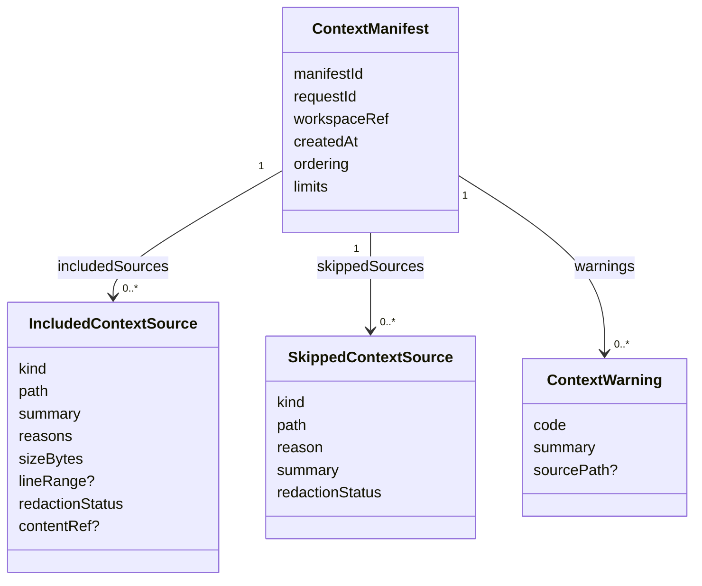
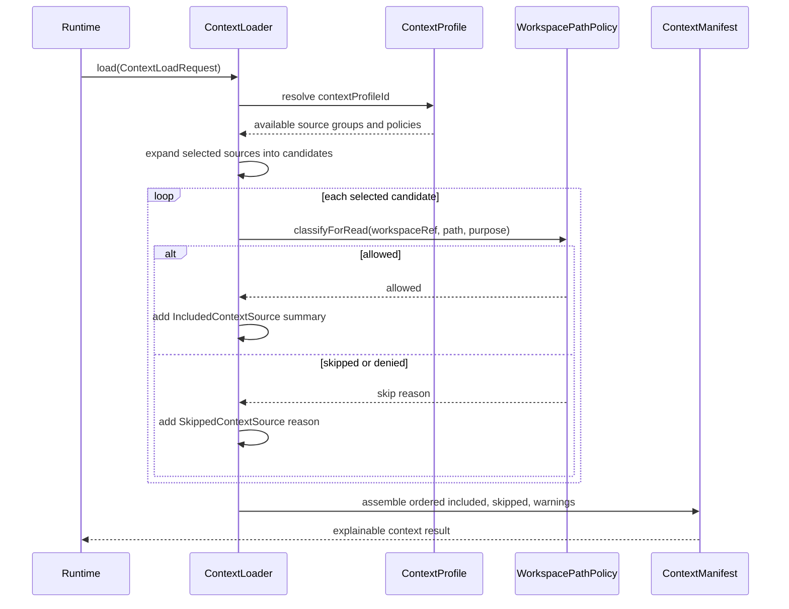

# Context Workspace Manifest

Architecture blueprint for future Codegeist context loading and workspace file
validation. This document describes intended contracts, diagrams, and illustrative
Java shapes only. It does not create Java packages, source files, tests, runtime
services, provider calls, embeddings, indexes, or tool execution.

## Purpose

Context loading must be deterministic, bounded, and explainable. A future runtime
turn should be able to ask a context loader for selected repository context and
receive a manifest that explains which sources were included, which were skipped,
and why.

The workspace boundary is the prerequisite for every future file read. Context
loading may decide what it wants to read, but workspace validation decides whether
a requested path is eligible to read inside the active repository root.

This blueprint narrows the first architecture target:

- Centralize repository root and path-safety decisions in a workspace service.
- Make context-source selection explicit instead of scanning the repository
  opportunistically.
- Keep repository conventions outside Codegeist core by loading context profiles
  from repo-owned rules, commands, or generated workspace configuration.
- Produce a manifest that is useful for user-facing diagnostics, tests, events,
  and later UI/server inspection.
- Keep Graphify, Repomix, embeddings, RAG, LSP indexes, and provider calls out of
  the automatic context path.

## Architecture Decisions

This document is the complete `T002_05` architecture handoff. It intentionally
stops before Java implementation so later tasks can create smaller, verifiable
source changes from a stable design.

Current decisions:

- Workspace identity and path policy are prerequisites for context loading.
- Context profiles are repo-owned data, not hard-coded Codegeist constants.
- Context load requests must name explicit selections instead of triggering a
  whole-repository scan.
- Context manifests are first-class explainability artifacts, not incidental log
  output.
- Permission approval is a later layer above deterministic workspace validation.
- External analysis artifacts stay behind explicit repo-specific commands or tools.

The first future implementation sequence should be:

1. Workspace identity and path-policy contracts.
2. Context profile model and repo-owned profile source loading.
3. Context load request, candidate expansion, and deterministic ordering.
4. Context manifest assembly with included and skipped source explanations.
5. Runtime integration that attaches manifests to prompt/session diagnostics.

These are future implementation slices. They are not created by this architecture
task.

## OpenCode Lessons

OpenCode validates the need for a workspace boundary, but its context model is
distributed across project context, file tools, permissions, config, instruction
loading, and tool metadata. Codegeist should translate the behavior, not copy the
structure.

Relevant OpenCode evidence gathered through the local `/ask-project opencode`
workflow:

| OpenCode area | Source evidence | Codegeist lesson |
| --- | --- | --- |
| Project identity | `project/project.ts`, `project/instance-context.ts` | Keep active directory, worktree, and project identity explicit instead of letting each reader infer roots. |
| Path containment | `file/index.ts`, `tool/read.ts`, `packages/core/src/filesystem.ts` | Classify canonical paths before reads and treat outside-root access as a typed outcome. |
| External directories | `tool/external-directory.ts`, permission docs and permission source | Keep deterministic workspace validation separate from later user approval. |
| Ignore and protected paths | `file/ignore.ts`, `file/protected.ts`, `file/watcher.ts`, `snapshot/index.ts` | Skip generated, dependency, ignored, protected, and heavy paths by default and explain the skip. |
| Instructions and config | `session/instruction.ts`, `config/config.ts`, `config/paths.ts`, rules/config docs | Model repo-selected instructions and state through a profile instead of hard-coded path conventions. |
| Source provenance | instruction headers, read-tool metadata, third-party analysis manifest | Preserve provenance in manifest entries, but provide a single explainability artifact that OpenCode lacks. |

OpenCode does not expose one complete context manifest that lists all requested,
included, skipped, ordered, redacted, and warning-producing sources. Codegeist
should make that explicit because the manifest is useful for CLI diagnostics,
server or Vaadin inspection, auditing, and deterministic tests.

## Boundary Summary



The runtime owns the turn. The context loader owns deterministic source ordering
and manifest creation. The workspace service owns root identity, canonical path
validation, generated/ignored posture, secret-like path posture, symlink escape
handling, missing-path classification, and read eligibility.

## Workspace Layer

The workspace layer owns root identity and deterministic path classification. It
should expose one narrow responsibility first: classify an explicit candidate path
before any future context reader opens it.

| Responsibility | Required behavior |
| --- | --- |
| Root identity | Resolve one active `WorkspaceRef` for the current repository or worktree root. |
| Canonical path validation | Normalize and canonicalize candidate paths before classification. |
| Root boundary | Deny paths whose canonical target is outside the allowed workspace root. |
| Generated/ignored posture | Skip ignored, generated, dependency, or build-output paths by default. |
| Secret-like posture | Deny paths that look like secrets, credentials, tokens, or local env files. |
| Symlink escape handling | Treat symlinks that resolve outside the root as denied `symlink_escape`. |
| Missing paths | Classify optional missing inputs without failing the whole context request. |
| Read eligibility | Return a typed verdict before a reader opens the file. |

Workspace validation should not duplicate provider, permission, or runtime logic.
It answers only whether a path is safe and eligible to read for the requested
context purpose.

Initial workspace verdicts should map cleanly to future manifest skip reasons:

| Verdict | Manifest mapping | Notes |
| --- | --- | --- |
| `allowed` | included source candidate | The candidate may still be skipped later by loader limits. |
| `missing_optional` | skipped source | Optional inputs should not fail the whole context request. |
| `outside_root` | skipped source | A canonical path resolved outside the workspace root. |
| `symlink_escape` | skipped source | A symlink target resolved outside the workspace root. |
| `generated` | skipped source | Build output, dependency output, or generated analysis output. |
| `ignored` | skipped source | Repository ignore policy excludes the path from default context reads. |
| `secret_like` | skipped source | Block before read; redaction status should be `blocked_before_read`. |
| `unsupported_source` | skipped source | The request named a source type the first loader does not support. |

Approval for external directories is not part of this layer. A later permission
task may decide whether users can override an outside-root verdict for tools, but
default context loading must not silently read outside the workspace.

Initial generated or ignored examples include `target/`, `bin/`, `.class`,
`.jar`, dependency directories, rendered or regenerated analysis outputs, and
large files ignored by repository policy. Initial secret-like examples include
`.env`, `.local.env`, private keys, credential files, token dumps, and paths whose
names contain common credential markers.

## Context Profile Layer

Codegeist core must not hard-code this repository's documentation layout. The
core loader should not know about a `docs/` directory, memory-bank paths,
developer-documentation paths, OpenCode submodule paths, or local overlay paths.
Those are conventions of a repository or workspace profile, not universal
Codegeist runtime constants.

The future implementation should load a repo-local context profile before it
builds a context request. That profile can be created or maintained by Codegeist
rules and commands when a workspace is initialized, inspected, or refreshed. Core
Codegeist should understand source kinds, ordering, validation, and manifest
fields; the repo profile supplies the actual path globs, default source groups,
and command-managed files.

Initial profile responsibilities:

| Profile field | Purpose |
| --- | --- |
| `instructionSources` | Rule, command, or instruction files selected by the current repository. |
| `stateSources` | Repo-owned memory or working-state files created or refreshed by commands. |
| `workItemSources` | Task, issue, ticket, or active-work conventions for this workspace. |
| `knowledgeSources` | Repository knowledge documents selected by the active profile. |
| `sourceSnippetPolicy` | Allowed source snippet roots and range limits. |

Codegeist commands may create, refresh, or migrate these sources for a workspace,
but the resulting paths remain profile data. Another Codegeist workspace may
choose different paths or may not have some groups until commands create them.



The key boundary is that `ContextProfile` owns repository-specific path choices.
`CodegeistCore` owns only the generic concepts and never embeds a fixed repo
layout.

Profile data should also carry provenance so manifests can explain why a source
was selected:

| Profile metadata | Purpose |
| --- | --- |
| `profileId` | Identifies the profile version used by a request. |
| `profileSource` | Names whether the profile came from repo config, command output, generated workspace state, or user selection. |
| `sourceGroup` | Groups entries such as instructions, state, work items, knowledge, or snippets. |
| `selectionReason` | Explains why a source was selected, for example `default_instruction`, `active_work`, or `explicit_source`. |

This lets a later loader produce useful diagnostics without knowing this
repository's file layout.

## Context Request Layer

The context loader should accept explicit selections. The first request shape is a
runtime-owned input, not a Spring Shell DTO, HTTP payload, provider prompt, or
storage row.

| Field | Purpose | Selection posture |
| --- | --- | --- |
| `workspaceRef` | Identifies the root that workspace validation uses. | Required. |
| `requestId` | Correlates manifest, diagnostics, and future events. | Required. |
| `mode` | Records Plan or Build mode for explanation. | Required; does not change ordering. |
| `sessionId` | Links context to an existing session when present. | Optional. |
| `activeWorkPath` | Points at the current task, issue, ticket, or work item. | Optional explicit path. |
| `contextProfileId` | Selects repo-owned source groups and path conventions. | Required after profiles exist. |
| `selectedInstructions` | Rule, command, or instruction sources supplied by the active profile. | Explicit list or named default set. |
| `selectedState` | Memory or working-state sources supplied by the active profile. | Explicit list or named default set. |
| `selectedWorkItems` | Task, issue, ticket, or active-work sources supplied by the active profile. | Explicit list, with active work first. |
| `selectedKnowledge` | Repository knowledge sources supplied by the active profile. | Explicit list. |
| `selectedSourceSnippets` | Source files or bounded snippets from workspace files. | Explicit path only. |

Automatic repository-wide discovery is intentionally excluded from the first
contract. Later implementations may add named presets, indexes, or search, but
the first manifest should be reproducible from the request fields alone.

`activeWorkPath` is intentionally not a Spring Shell prompt flag from the first CLI
mode slice. `T002_04` keeps CLI prompt-mode input limited to prompt text, selected
Plan/Build mode, optional session id, source, and request/correlation metadata.
Active work should come from runtime state, a repo profile, or a command-managed
workspace state file so CLI adapters do not own context selection.



The request names what is selected for this turn. A selected source is still only a
candidate; it becomes included context only after workspace validation and loader
limits pass.

## Candidate Ordering Layer

The loader should produce the same ordered result for the same request and
workspace state. Plan and Build share this ordering; mode changes tool and
permission behavior elsewhere, not context determinism.

Initial source order:

1. Runtime request summary: mode, session id when present, workspace id, and
   active work path when present.
2. Selected instruction sources from the active context profile, sorted by
   profile group and normalized path.
3. Selected state sources from the active context profile, sorted by normalized
   path.
4. Active work source, then additional selected work-item sources from the active
   context profile, sorted by normalized path after the active work source.
5. Selected repository knowledge sources from the active context profile, sorted
   by normalized path.
6. Selected source snippets, sorted by normalized path and then snippet range.

When two inputs normalize to the same path, the loader should include it once and
record all request reasons in the manifest entry. Deduplication should happen
after workspace validation so denied duplicates can still be explained.



This ordering answers the question "what comes first?" It does not decide which
paths exist in a repository. The profile supplies paths; the loader applies this
generic sequence.

Candidate ordering should be deterministic before and after workspace validation:

- Preserve the layer order above for requested candidates.
- Normalize paths before sorting within each layer.
- Keep active work before other work-item sources.
- Deduplicate normalized paths after workspace validation.
- Preserve all selection reasons when duplicates collapse into one included entry.
- Preserve skipped duplicate explanations when denied candidates appear more than
  once for different reasons.

## Manifest Layer

The manifest is an explainability artifact. It should be safe to show in CLI,
server, or Vaadin diagnostics because it contains summaries and metadata rather
than complete file payloads by default.

Required manifest fields:

| Field | Purpose |
| --- | --- |
| `manifestId` | Stable id for this context selection result. |
| `requestId` | Links the manifest back to the runtime/context request. |
| `workspaceRef` | Records the validated workspace identity. |
| `createdAt` | Timestamp for diagnostics and future events. |
| `ordering` | Names the deterministic ordering policy version. |
| `includedSources` | Ordered entries that passed workspace validation and loader limits. |
| `skippedSources` | Ordered entries that were not included, with reasons. |
| `warnings` | Non-fatal issues such as stale summaries or truncated snippets. |
| `limits` | Applied limits such as max bytes, max sources, or max snippet range. |

Included source fields:

| Field | Purpose |
| --- | --- |
| `kind` | `runtime`, `instruction`, `state`, `work_item`, `knowledge`, or `source_snippet`. |
| `path` | Repo-relative path when a file-backed source exists. |
| `summary` | Short explanation of why the source was included. |
| `reasons` | Request reasons such as `active_work`, `selected_instruction`, or `explicit_source`. |
| `sizeBytes` | Size of the included or referenced content. |
| `lineRange` | Optional line range for source snippets. |
| `redactionStatus` | `not_needed`, `redacted`, or `blocked_before_read`. |
| `contentRef` | Optional pointer to a bounded payload or future artifact reference. |

Skipped source fields:

| Field | Purpose |
| --- | --- |
| `kind` | Same source kind vocabulary as included entries. |
| `path` | Candidate repo-relative path when known. |
| `reason` | Typed skip reason. |
| `summary` | Human-readable explanation. |
| `redactionStatus` | Usually `blocked_before_read` for secret-like paths. |

Initial skip reasons:

| Reason | Meaning |
| --- | --- |
| `generated` | The path is generated output or a build/dependency artifact. |
| `ignored` | Repository ignore policy excludes the path from normal context reads. |
| `heavy` | The path is too large or known to be an expensive generated analysis output. |
| `missing_optional` | The request named an optional file that does not exist. |
| `outside_root` | Canonical path validation resolved outside the workspace root. |
| `symlink_escape` | A symlink resolves outside the workspace root. |
| `secret_like` | The path or filename suggests credentials or private local config. |
| `unsupported_source` | The request named a source kind the first loader does not support. |

Warnings should be reserved for non-fatal concerns, such as an applied size
limit, duplicate selected paths, or a line range that had to be clamped to the
available file length.



The manifest separates requested-but-accepted sources from requested-but-skipped
sources. This keeps diagnostics clear without implying that every selected source
was loaded.

Manifest entries should be metadata-first. A later implementation may store
bounded content separately and reference it through `contentRef`, but the manifest
itself should remain safe to print in a CLI or inspect in a UI without exposing
full source content or secrets.

Manifest warnings should be non-fatal and actionable. Examples include:

| Warning | Meaning |
| --- | --- |
| `duplicate_source` | Multiple selections normalized to the same path. |
| `snippet_range_clamped` | A requested line range exceeded the available file length. |
| `source_truncated` | A byte, line, or source-count limit was applied. |
| `profile_source_missing` | A profile-selected optional source was absent. |
| `stale_profile` | A profile or generated workspace state may be older than the current workspace revision. |

## Example Manifest Shape

```json
{
  "manifestId": "ctxm_01",
  "requestId": "prompt_01",
  "workspaceRef": "workspace_main",
  "ordering": "context-order-v1",
  "includedSources": [
    {
      "kind": "work_item",
      "path": "<repo-profile-active-work-path>",
      "summary": "Active work item selected by the workspace profile.",
      "reasons": ["active_work"],
      "sizeBytes": 4200,
      "redactionStatus": "not_needed"
    }
  ],
  "skippedSources": [
    {
      "kind": "source_snippet",
      "path": ".local.env",
      "reason": "secret_like",
      "summary": "Local environment files are blocked before read.",
      "redactionStatus": "blocked_before_read"
    }
  ],
  "warnings": []
}
```

The example is intentionally metadata-first. A future implementation may keep
bounded content separately and refer to it through `contentRef` so session events
and diagnostics avoid carrying unlimited file contents.



This sequence shows why `selected...` is not the same as `includedSources`.
Selection happens before safety checks; inclusion happens after them.

## External Analysis Posture

External analysis outputs, including Graphify and Repomix outputs, are not a
first-class context source for the core loader. They can be large, generated,
stale, and specialized for a research question, so they belong behind explicit
repo-specific commands or tool workflows instead of the default runtime context
path.

Default posture:

- Do not run Graphify, Repomix, verification scripts, or any external tool during
  context loading.
- Do not automatically load `repomix-output.*`, `graphify-out/`, rendered SVGs,
  logs, manifests, or generated reports.
- Record skipped heavy generated artifacts in the manifest only if a repo-specific
  command or tool workflow explicitly hands such a path to the loader as a source
  snippet candidate.

Dedicated repository-specific research workflows may still load external analysis
into a separate agent or tool context. That is different from automatic runtime
context and should stay outside the core loader contract.

## Permission Boundary

Workspace validation is deterministic and should run before permission prompts.
Permission services may later decide whether a user can approve a tool or command
that touches a path, but context loading should report path policy outcomes in the
manifest instead of prompting mid-load.

Boundary rules:

- Workspace policy classifies path safety and eligibility.
- Permission policy handles user approvals for tools, shell commands, patch/edit
  flows, and possible future external-directory access.
- Context loading may consume only allowed candidates for the default automatic
  context path.
- Denied or skipped candidates remain visible in the manifest with typed reasons.

## Deferred Implementation Slices

Later implementation work should be split into small slices. A safe order is:

1. Workspace identity and path-policy contracts with deterministic tests.
2. Context profile data model and profile source loading from repo-owned config or
   command-managed workspace state.
3. Context request and candidate expansion without file content reads beyond
   bounded metadata.
4. Manifest assembly for included, skipped, warning, redaction, and limit entries.
5. Runtime/session integration that records manifest provenance for prompt turns.
6. Optional CLI/server/Vaadin diagnostics that render manifest summaries.

Do not implement provider calls, embeddings, Graphify, Repomix, broad search,
patch/edit, shell execution, storage, or permission prompts as part of the first
context loader implementation slice.

## Future Java File Map

When a later implementation task creates Java source, use this file map as a
starting point. Each type should live in its own `.java` file unless an
implementation task has a concrete reason to keep small package-private helpers
together.

| Future file | Role | Notes |
| --- | --- | --- |
| `app/codegeist/cli/src/main/java/ai/codegeist/workspace/WorkspaceRef.java` | Workspace identity value | Identifies the active repository or worktree root. |
| `app/codegeist/cli/src/main/java/ai/codegeist/workspace/WorkspacePath.java` | Repo-relative path value | Stores normalized repo-relative paths only. |
| `app/codegeist/cli/src/main/java/ai/codegeist/workspace/WorkspacePathVerdict.java` | Validation result enum | Covers allowed and skipped/denied path states. |
| `app/codegeist/cli/src/main/java/ai/codegeist/workspace/WorkspacePathPolicy.java` | Path validation port | Classifies candidate paths before reads. |
| `app/codegeist/cli/src/main/java/ai/codegeist/context/ContextLoadRequest.java` | Runtime-to-context request | Explicit selected sources only. |
| `app/codegeist/cli/src/main/java/ai/codegeist/context/ContextSourceKind.java` | Context source kind enum | Shared by included and skipped manifest entries. |
| `app/codegeist/cli/src/main/java/ai/codegeist/context/ContextSkipReason.java` | Skip reason enum | Mirrors manifest reason vocabulary. |
| `app/codegeist/cli/src/main/java/ai/codegeist/context/ContextManifest.java` | Manifest aggregate | Contains ordered included and skipped entries. |
| `app/codegeist/cli/src/main/java/ai/codegeist/context/ContextLoader.java` | Context loading port | Creates a manifest from a request. |

No source files from this map exist yet.

## Future Java Type Sketch

These examples are target shapes for a later implementation, not source to add in
this documentation-only task.

```java
package ai.codegeist.context;

import ai.codegeist.workspace.WorkspaceRef;
import java.nio.file.Path;
import java.time.Instant;
import java.util.List;
import java.util.Optional;

public record ContextLoadRequest(
    String requestId,
    WorkspaceRef workspaceRef,
    String mode,
    Optional<String> sessionId,
    Optional<Path> activeWorkPath,
    String contextProfileId,
    List<Path> selectedInstructions,
    List<Path> selectedState,
    List<Path> selectedWorkItems,
    List<Path> selectedKnowledge,
    List<SourceSnippetSelection> selectedSourceSnippets
) {
}

public record ContextManifest(
    String manifestId,
    String requestId,
    WorkspaceRef workspaceRef,
    Instant createdAt,
    String ordering,
    List<IncludedContextSource> includedSources,
    List<SkippedContextSource> skippedSources,
    List<ContextWarning> warnings
) {
}
```

```java
package ai.codegeist.workspace;

import java.nio.file.Path;

public interface WorkspacePathPolicy {
    WorkspacePathClassification classifyForRead(
        WorkspaceRef workspaceRef,
        Path candidatePath,
        String purpose
    );
}
```

The concrete implementation should validate paths before opening files. It should
also keep manifest creation testable without provider calls, shell commands,
Graphify, Repomix, embeddings, or filesystem mutation.

## Future Test Handoff

The first implementation task should add focused tests before or with Java source.
Suggested coverage:

- Same request and same workspace state produce the same manifest order.
- Active work appears before other selected work-item sources.
- Repo-specific state and knowledge paths come from the active context profile,
  not from Codegeist hard-coded constants.
- Duplicate selected paths produce one included entry with multiple reasons.
- Missing optional paths are skipped with `missing_optional`.
- Outside-root paths are denied with `outside_root` before read.
- Symlink escapes are denied with `symlink_escape` before read.
- Secret-like paths are denied with `secret_like` before read.
- Generated, ignored, and heavy paths are skipped with the matching reason.
- External analysis artifacts such as Graphify and Repomix outputs are not loaded
  as a core source kind and remain behind explicit repo-specific workflows.

No test fixtures, package directories, or Java files are created by this document.

## Open Decision

The first implementation task still needs to choose which runtime request,
command, or profile-managed workspace state supplies `activeWorkPath` to the
context loader. `T002_04` deliberately kept CLI prompt-mode input limited to
prompt text, selected Plan/Build mode, optional session id, source, and
request/correlation metadata, so active work selection remains a context/runtime
concern rather than a Spring Shell concern.
