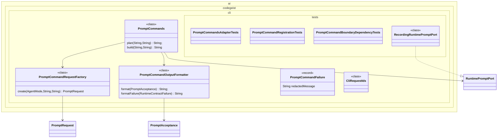

# CLI Prompt Command Implementation Plan

Planning handoff for `T004_08`: implement Spring Shell `plan` and `build` prompt
commands over runtime APIs.

## Source Task

- Task: `docs/tasks/T004_implement-codegeist-opencode-core-application/tasks/T004_08_implement_cli_prompt_commands.md`
- Parent: `docs/tasks/T004_implement-codegeist-opencode-core-application/task.md`
- Primary contract: `docs/developer/specification/cli-prompt-command-source-generation-contract.md`
- Runtime dependency: `docs/developer/implementation/runtime-session-event-core-implementation.md`

## Goal

Create the first `ai.codegeist.cli` adapter that accepts explicit `plan` and
`build` prompts, maps them to runtime-owned `AgentMode` values, delegates to
`RuntimePromptPort`, and prints deterministic accepted/submitted output.

## Solution Direction

Use Spring Shell only at the adapter edge. The command class parses prompt text and
optional session id, builds a runtime request through a small CLI mapper/factory,
delegates to runtime, and formats a bounded output string. It does not implement
provider calls, context loading, tools, permissions, storage continuation, patch,
shell, TUI, server, or async workflows.

## Planned Class Diagram



## File Map

Production files to add:

```text
app/codegeist/cli/src/main/java/ai/codegeist/cli/
  CliRequestIds.java
  PromptCommandFailure.java
  PromptCommandOutputFormatter.java
  PromptCommandRequestFactory.java
  PromptCommands.java
```

Test files to add:

```text
app/codegeist/cli/src/test/java/ai/codegeist/cli/
  PromptCommandBoundaryDependencyTests.java
  PromptCommandRegistrationTests.java
  PromptCommandsAdapterTests.java
  RecordingRuntimePromptPort.java
```

Documentation to update during solve:

```text
docs/developer/architecture/architecture.md
docs/tasks/T004_implement-codegeist-opencode-core-application/tasks/T004_08_implement_cli_prompt_commands.md
```

## Implementation Steps

1. Add `PromptCommandsAdapterTests#planSubmitsPlanModeRuntimeRequest` as the first failing test.
2. Implement `RecordingRuntimePromptPort` test fake and prompt command factory/formatter.
3. Implement `PromptCommands` with `plan` and `build` methods using Spring Shell annotations.
4. Add tests for Build mode mapping, blank prompt rejection, optional session id mapping, runtime failure formatting, and deterministic accepted output.
5. Add Spring Shell registration tests with the narrowest practical context or command catalog check.
6. Add dependency tests proving runtime contracts do not expose Spring Shell types and CLI does not own provider/tool/storage behavior.
7. Update architecture docs and task solve notes.

## TDD And Verification

```bash
cd app/codegeist/cli
mvn --batch-mode --no-transfer-progress -Dtest=PromptCommandsAdapterTests#planSubmitsPlanModeRuntimeRequest test
mvn --batch-mode --no-transfer-progress -Dtest=PromptCommandsAdapterTests,PromptCommandRegistrationTests,PromptCommandBoundaryDependencyTests test
mvn --batch-mode --no-transfer-progress test
```

Documentation-only planning verification:

```bash
git --no-pager diff --check
```

## Dependencies And Deferrals

- Depends on solved `T004_01` runtime/session/event source types.
- Defers assistant generation, provider streaming, context loading, tools, permissions, patch/edit, shell, storage continuation, command templates, async/server flows, TUI, Vaadin, PF4J, and JBang.

## Acceptance Criteria

- `plan` and `build` commands delegate to runtime with correct modes.
- Blank prompt input is rejected before runtime submission.
- Output is deterministic and claims only acceptance/submission, not completion.
- Architecture docs describe CLI adapter package and tests.

## Open Questions

None. The solve phase may choose the exact Spring Shell option syntax that works best with Spring Shell 4 while preserving the runtime boundary.

## Planning Handoff

- Phase command: `/plan-task T004_08` as part of user input `alle tasks aus t004`.
- Selected option: plan the existing T004 child task instead of creating a duplicate.
- Duplicate check result: `cli-prompt-command-implementation.md` did not exist before this pass.
- Discovered hints considered: `java-spring-architecture-planning-guidance.md`, `opencode-solving-guidance.md`, and `opencode-source-solving-guidance.md`.
- Related context files read: T004 parent, T004 child tasks, current architecture doc, CLI prompt command source-generation contract, and T004_01 implementation plan.
- Next recommended phase: `/solve-task t004_08` after `T004_01` is solved enough to provide runtime APIs.

## Agent Utils Planning Recheck

- Agent Utils equivalents: `AskUserQuestionTool`, `CommandLineQuestionHandler`, and
  bundled agent prompt resources.
- Plan decision: keep Spring Shell `plan` and `build` command behavior as a
  Codegeist-owned runtime client boundary.
- Solve constraint: do not use Agent Utils question handling as the command
  contract; it may inform later interactive clarification or approval UX only.
- Test impact: existing adapter and command-registration tests remain the right
  verification scope.
- Result: the plan remains implementation-ready after `T004_01` is solved.
