# Context Workspace Loading Core Implementation Plan

Planning handoff for `T004_02`: implement deterministic context and workspace
loading contracts after the runtime/session/event core is available.

## Source Task

- Task: `docs/tasks/T004_implement-codegeist-opencode-core-application/tasks/T004_02_implement_context_workspace_loading_core.md`
- Parent: `docs/tasks/T004_implement-codegeist-opencode-core-application/task.md`
- Primary contract: `docs/developer/specification/context-workspace-loading-source-generation-contract.md`
- Runtime dependency: `docs/developer/implementation/runtime-session-event-core-implementation.md`

## Goal

Create Codegeist-owned workspace identity, path classification, context profile,
explicit source selection, deterministic ordering, and manifest contracts without
hard-coding this repository's `docs/`, `.oc_local/`, `.opencode/`, or third-party
analysis layout into production code.

## Solution Direction

Add `ai.codegeist.workspace` for workspace/path policy and `ai.codegeist.context`
for profile/request/manifest contracts. The first implementation is metadata-first:
it validates explicit profile-selected candidates, orders them deterministically,
and returns explainable included/skipped manifest entries. It does not perform
repository-wide scans, provider prompt assembly, Graphify/Repomix runs, storage, or
tool execution.

## Planned Class Diagram

```mermaid
classDiagram
    namespace ai.codegeist.workspace {
        class WorkspaceRoot { <<record>> WorkspaceRef ref; Path root }
        class WorkspacePath { <<record>> String value }
        class WorkspaceReadPurpose { <<enum>> CONTEXT_PROFILE CONTEXT_SOURCE SOURCE_SNIPPET }
        class WorkspacePathVerdict { <<enum>> ALLOWED MISSING_OPTIONAL OUTSIDE_ROOT SYMLINK_ESCAPE GENERATED IGNORED SECRET_LIKE UNSUPPORTED_SOURCE }
        class WorkspacePathClassification { <<record>> WorkspacePath input; Optional~WorkspacePath~ normalized; WorkspacePathVerdict verdict; String summary; RedactionStatus redaction }
        class WorkspacePathPolicy { <<interface>> classify(WorkspaceRoot, WorkspacePath, WorkspaceReadPurpose) WorkspacePathClassification }
        class DefaultWorkspacePathPolicy { <<class>> }
    }

    namespace ai.codegeist.context {
        class ContextLoadRequestId { <<record>> String value }
        class ContextProfileId { <<record>> String value }
        class ContextProfile { <<record>> ContextProfileId id; List~ContextSourceSelection~ selections; SourceSnippetPolicy snippets }
        class ContextSourceSelection { <<record>> ContextSourceKind kind; WorkspacePath path; String reason; boolean required; int priority }
        class SourceSnippetPolicy { <<record>> int maxLines; int maxBytes }
        class SourceSnippetSelection { <<record>> WorkspacePath path; int startLine; int endLine }
        class ContextLoadRequest { <<record>> ContextLoadRequestId id; WorkspaceRef workspace; AgentMode mode; Optional~SessionId~ sessionId; ContextProfileId profileId; List~ContextSourceKind~ selectedGroups }
        class ContextCandidate { <<record>> ContextSourceSelection selection; WorkspaceReadPurpose purpose }
        class ContextSourceKind { <<enum>> RUNTIME_SUMMARY INSTRUCTION STATE WORK_ITEM KNOWLEDGE SOURCE_SNIPPET }
        class ContextManifest { <<record>> ContextManifestId id; ContextLoadRequestId requestId; List~IncludedContextSource~ included; List~SkippedContextSource~ skipped; List~ContextWarning~ warnings; ContextLimits limits }
        class ContextManifestId { <<record>> String value }
        class IncludedContextSource { <<record>> ContextSourceKind kind; WorkspacePath path; int order; String summary; RedactionStatus redaction }
        class SkippedContextSource { <<record>> ContextSourceKind kind; WorkspacePath path; ContextSkipReason reason; String summary }
        class ContextSkipReason { <<enum>> GENERATED IGNORED HEAVY MISSING_OPTIONAL OUTSIDE_ROOT SYMLINK_ESCAPE SECRET_LIKE UNSUPPORTED_SOURCE }
        class ContextWarning { <<record>> String summary }
        class ContextLimits { <<record>> int maxSources; int maxBytes; int maxLines }
        class RedactionStatus { <<enum>> NOT_NEEDED REDACTED BLOCKED_BEFORE_READ }
        class ContextLoader { <<interface>> load(ContextLoadRequest, ContextProfile) ContextManifest }
        class DeterministicContextLoader { <<class>> }
        class ContextContractFailure { <<sealed interface>> }
        class InvalidContextProfile { <<record>> String redactedMessage }
        class InvalidContextSelection { <<record>> String redactedMessage }
        class ContextManifestConflict { <<record>> String redactedMessage }
    }

    namespace ai.codegeist.context.tests {
        class ContextWorkspaceLoadingContractTests
        class ContextManifestOrderingTests
        class ContextWorkspaceDependencyTests
    }

    DeterministicContextLoader --> WorkspacePathPolicy
    DeterministicContextLoader --> ContextLoadRequest
    DeterministicContextLoader --> ContextProfile
    DeterministicContextLoader --> ContextManifest
    WorkspacePathPolicy --> WorkspacePathClassification
    ContextManifest --> IncludedContextSource
    ContextManifest --> SkippedContextSource
```



## File Map

Production files to add:

```text
app/codegeist/cli/src/main/java/ai/codegeist/workspace/
  DefaultWorkspacePathPolicy.java
  WorkspacePath.java
  WorkspacePathClassification.java
  WorkspacePathPolicy.java
  WorkspacePathVerdict.java
  WorkspaceReadPurpose.java
  WorkspaceRoot.java

app/codegeist/cli/src/main/java/ai/codegeist/context/
  ContextCandidate.java
  ContextContractFailure.java
  ContextLimits.java
  ContextLoadRequest.java
  ContextLoadRequestId.java
  ContextLoader.java
  ContextManifest.java
  ContextManifestConflict.java
  ContextManifestId.java
  ContextProfile.java
  ContextProfileId.java
  ContextSkipReason.java
  ContextSourceKind.java
  ContextSourceSelection.java
  ContextWarning.java
  DeterministicContextLoader.java
  IncludedContextSource.java
  InvalidContextProfile.java
  InvalidContextSelection.java
  RedactionStatus.java
  SkippedContextSource.java
  SourceSnippetPolicy.java
  SourceSnippetSelection.java
```

Test files to add:

```text
app/codegeist/cli/src/test/java/ai/codegeist/context/
  ContextWorkspaceLoadingContractTests.java
  ContextManifestOrderingTests.java
  ContextWorkspaceDependencyTests.java
```

Documentation to update during solve:

```text
docs/developer/architecture/architecture.md
docs/tasks/T004_implement-codegeist-opencode-core-application/tasks/T004_02_implement_context_workspace_loading_core.md
```

## Implementation Steps

1. Add `ContextWorkspaceLoadingContractTests#classifiesExplicitWorkspacePathsBeforeManifestAssembly` as the first failing test.
2. Implement workspace path value types, verdicts, and `DefaultWorkspacePathPolicy` for temporary-directory fixtures.
3. Add profile, request, candidate, and source-kind records.
4. Add `DeterministicContextLoader` to classify explicit selections, map verdicts to skip reasons, and assemble metadata-only manifests.
5. Add ordering and deduplication tests for profile-selected instruction, state, work-item, knowledge, and source-snippet entries.
6. Add dependency tests proving context/workspace contracts do not expose Spring Shell, Spring AI, Graphify, Repomix, or storage types.
7. Update architecture docs and the task solve result after source and tests pass.

## TDD And Verification

First failing test:

```bash
cd app/codegeist/cli
mvn --batch-mode --no-transfer-progress -Dtest=ContextWorkspaceLoadingContractTests#classifiesExplicitWorkspacePathsBeforeManifestAssembly test
```

Additional targeted solve checks:

```bash
cd app/codegeist/cli
mvn --batch-mode --no-transfer-progress -Dtest=ContextWorkspaceLoadingContractTests,ContextManifestOrderingTests,ContextWorkspaceDependencyTests test
mvn --batch-mode --no-transfer-progress test
```

Documentation-only planning verification:

```bash
git --no-pager diff --check
```

## Dependencies And Deferrals

- Depends on `T004_01` source types for `WorkspaceRef`, `AgentMode`, and optional `SessionId` references, or must adapt to their final names during solve.
- Defers provider prompt assembly, file payload loading, repository-wide scans, embeddings, Graphify, Repomix, storage, tools, permissions, patch/edit, shell, CLI/TUI rendering, server, Vaadin, PF4J, and JBang.

## Acceptance Criteria

- Explicit context profile data is validated and ordered deterministically.
- Workspace policy denies outside-root, generated/ignored, secret-like, symlink escape, and unsupported candidates before reads.
- Manifest entries are metadata-first and explain included and skipped sources.
- Tests are individually executable and architecture docs reflect the implemented packages.

## Open Questions

None. Final type names may be adjusted only to match the solved `T004_01` contracts.

## Planning Handoff

- Phase command: `/plan-task T004_02` as part of user input `alle tasks aus t004`.
- Selected option: plan the existing T004 child task instead of creating a duplicate.
- Duplicate check result: `context-workspace-loading-core-implementation.md` did not exist before this pass.
- Discovered hints considered: `java-spring-architecture-planning-guidance.md`, `opencode-solving-guidance.md`, and `opencode-source-solving-guidance.md`.
- Related context files read: T004 parent, T004 child tasks, current architecture doc, context/workspace source-generation contract, and T004_01 implementation plan.
- Next recommended phase: `/solve-task t004_02` after `T004_01` has produced the runtime/session/event source types this plan references.

## Agent Utils Planning Recheck

- Agent Utils equivalents: `GrepTool`, `GlobTool`, `ListDirectoryTool`,
  `FileSystemTools.read`, and `Skills` path loading.
- Plan decision: the solve phase may use these utilities as private implementation
  details only after `DefaultWorkspacePathPolicy` validates roots, ignored or
  generated paths, secret-like files, symlink escape, size bounds, and result
  limits.
- Target-file impact: no new public packages are added; optional Agent Utils calls
  belong inside planned context/workspace services or a package-private helper, not
  in Codegeist public records.
- Test impact: keep the existing temporary-directory tests and assert Codegeist
  request/result behavior, not Agent Utils internals.
- Result: the plan remains implementation-ready after `T004_01` is solved.
