# Controlled Shell Tool Core Implementation Plan

Planning handoff for `T004_06`: implement controlled shell request/result
contracts and a safe fake-executor boundary.

## Source Task

- Task: `docs/tasks/T004_implement-codegeist-opencode-core-application/tasks/T004_06_implement_controlled_shell_tool_core.md`
- Parent: `docs/tasks/T004_implement-codegeist-opencode-core-application/task.md`
- Primary contract: `docs/developer/specification/controlled-shell-tool-source-generation-contract.md`
- Policy dependency: `docs/developer/implementation/tool-permission-workspace-core-implementation.md`

## Goal

Create shell verification request, gate, approved execution, fake executor, result,
output summary, timeout, cancellation, and typed failure contracts without running
arbitrary real shell commands by default.

## Solution Direction

Add `ai.codegeist.shell` as a controlled verification boundary. The first slice
models command shape, purpose, destructive posture, cwd, env/stdin policy, timeout,
output limits, approved executor handoff, fake executor results, and bounded output
summaries. Real process execution remains deferred.

## Planned Class Diagram

```mermaid
classDiagram
    namespace ai.codegeist.shell {
        class ShellRequestId { <<record>> String value }
        class ShellVerificationRequest { <<record>> ShellRequestId id; SessionId sessionId; TurnId turnId; AgentMode mode; CorrelationId correlationId; ShellCommandShape command; ShellCommandPurpose purpose; DestructivePosture destructive; WorkspaceCommandCwd cwd; ShellEnvPolicy env; StdinPolicy stdin; ShellTimeout timeout; ShellOutputLimit outputLimit; String redactedSummary }
        class ShellCommandShape { <<sealed interface>> }
        class ArgvCommand { <<record>> List~String~ argv }
        class ShellSnippet { <<record>> String redactedSnippetSummary }
        class ShellCommandPurpose { <<enum>> VERIFY BUILD TEST INSPECT MUTATE_WORKSPACE DEPLOY NETWORK UNKNOWN }
        class DestructivePosture { <<enum>> NON_DESTRUCTIVE REQUIRES_EXPLICIT_INTENT DENIED_BY_DEFAULT UNKNOWN }
        class WorkspaceCommandCwd { <<record>> WorkspaceToolTarget target }
        class ShellEnvPolicy { <<record>> Set~String~ inherited; Set~String~ removed; Set~String~ redacted }
        class StdinPolicy { <<enum>> IGNORE EMPTY DENY_INTERACTIVE }
        class ShellTimeout { <<record>> Duration value }
        class ShellOutputLimit { <<record>> int stdoutChars; int stderrChars; boolean outputRefRequired }
        class ApprovedShellExecution { <<record>> ShellRequestId requestId; PermissionDecisionId decisionId; WorkspaceCommandCwd cwd; ShellCommandShape command; ShellTimeout timeout; StdinPolicy stdin; ShellOutputLimit outputLimit }
        class ShellExecutor { <<interface>> execute(ApprovedShellExecution) ShellVerificationResult }
        class FakeShellExecutor { <<class>> }
        class ShellVerificationResult { <<record>> ShellRequestId requestId; ShellResultStatus status; OptionalInt exitCode; ShellOutputSummary output; Optional~ShellFailure~ failure }
        class ShellResultStatus { <<enum>> DENIED APPROVAL_REQUIRED STARTED COMPLETED FAILED CANCELLED TIMED_OUT }
        class ShellOutputSummary { <<record>> String stdoutPreview; String stderrPreview; boolean truncated; List~OutputRef~ outputRefs }
        class ShellFailure { <<record>> ShellFailureKind kind; String redactedMessage; Recoverability recoverability }
        class ShellFailureKind { <<enum>> MODE_DENIED SAFETY_DENIED PERMISSION_DENIED WORKSPACE_DENIED INVALID_COMMAND_SHAPE INVALID_CWD INVALID_ENV_POLICY STDIN_DENIED TIMEOUT CANCELLED NON_ZERO_EXIT OUTPUT_OVERFLOW EXECUTOR_UNAVAILABLE UNEXPECTED_PROCESS_FAILURE }
    }

    namespace ai.codegeist.shell.tests {
        class ControlledShellContractTests
        class FakeShellExecutorTests
        class ShellBoundaryDependencyTests
    }

    ShellCommandShape <|.. ArgvCommand
    ShellCommandShape <|.. ShellSnippet
    ShellVerificationRequest --> ShellCommandShape
    ApprovedShellExecution --> ShellExecutor
    ShellExecutor --> ShellVerificationResult
    ShellVerificationResult --> ShellOutputSummary
    ShellVerificationResult --> ShellFailure
```



## File Map

Production files to add:

```text
app/codegeist/cli/src/main/java/ai/codegeist/shell/
  ApprovedShellExecution.java
  ArgvCommand.java
  ControlledShellGate.java
  DestructivePosture.java
  FakeShellExecutor.java
  ShellCommandPurpose.java
  ShellCommandShape.java
  ShellEnvPolicy.java
  ShellExecutor.java
  ShellFailure.java
  ShellFailureKind.java
  ShellOutputLimit.java
  ShellOutputSummary.java
  ShellRequestId.java
  ShellResultStatus.java
  ShellSnippet.java
  ShellTimeout.java
  ShellVerificationRequest.java
  ShellVerificationResult.java
  StdinPolicy.java
  WorkspaceCommandCwd.java
```

Test files to add:

```text
app/codegeist/cli/src/test/java/ai/codegeist/shell/
  ControlledShellContractTests.java
  FakeShellExecutorTests.java
  ShellBoundaryDependencyTests.java
```

Documentation to update during solve:

```text
docs/developer/architecture/architecture.md
docs/tasks/T004_implement-codegeist-opencode-core-application/tasks/T004_06_implement_controlled_shell_tool_core.md
```

## Implementation Steps

1. Add `ControlledShellContractTests#deniesPlanModeShellRequestBeforePermission` as the first failing test.
2. Implement shell request, command shape, purpose, destructive posture, cwd, env, stdin, timeout, and output limit records.
3. Implement `ControlledShellGate` for metadata-only mode/safety/cwd/permission handoff decisions.
4. Implement `ApprovedShellExecution`, `ShellExecutor`, and `FakeShellExecutor` for deterministic result fixtures.
5. Add fake executor tests for completed, non-zero exit, timeout, cancellation, and output overflow.
6. Add dependency tests proving shell contracts do not expose `ProcessBuilder`, PTY, terminal UI, JBang, storage, provider, or Spring Shell types.
7. Update architecture docs and task solve notes.

## TDD And Verification

```bash
cd app/codegeist/cli
mvn --batch-mode --no-transfer-progress -Dtest=ControlledShellContractTests#deniesPlanModeShellRequestBeforePermission test
mvn --batch-mode --no-transfer-progress -Dtest=ControlledShellContractTests,FakeShellExecutorTests,ShellBoundaryDependencyTests test
mvn --batch-mode --no-transfer-progress test
```

Documentation-only planning verification:

```bash
git --no-pager diff --check
```

## Dependencies And Deferrals

- Depends on `T004_04` descriptor, permission, workspace target, and output-ref contracts.
- Defers real process execution, PTY, terminal UI, remote execution, JBang execution, shell sandboxing, broad allowlists, storage, provider callbacks, and end-to-end loop wiring.

## Acceptance Criteria

- Plan mode denies shell execution before permission.
- Build-mode candidates require safe command posture, validated cwd, env/stdin policy, timeout, output limit, and exact approval metadata before executor handoff.
- Fake executor proves result mapping without local process execution.
- Architecture docs describe the shell package and tests.

## Open Questions

None. Real process execution remains a later task.

## Planning Handoff

- Phase command: `/plan-task T004_06` as part of user input `alle tasks aus t004`.
- Selected option: plan the existing T004 child task instead of creating a duplicate.
- Duplicate check result: `controlled-shell-tool-core-implementation.md` did not exist before this pass.
- Discovered hints considered: `java-spring-architecture-planning-guidance.md`, `opencode-solving-guidance.md`, and `opencode-source-solving-guidance.md`.
- Related context files read: T004 parent, T004 child tasks, current architecture doc, controlled shell source-generation contract, and `T004_04` plan.
- Next recommended phase: `/solve-task t004_06` after `T004_04` is solved enough to provide policy dependencies.
