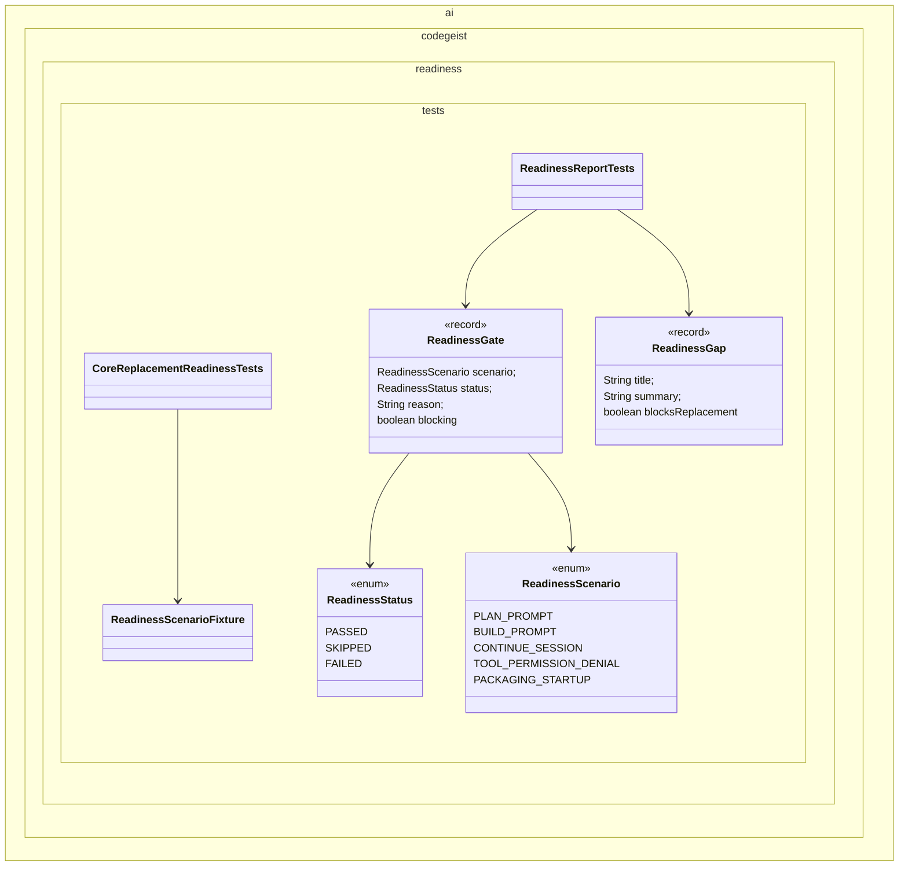

# Core Replacement Readiness Validation Plan

Planning handoff for `T004_12`: validate whether the implemented Codegeist core
can replace OpenCode for the selected CLI/TUI-oriented core workflows.

## Source Task

- Task: `docs/tasks/T004_implement-codegeist-opencode-core-application/tasks/T004_12_validate_core_replacement_readiness.md`
- Parent: `docs/tasks/T004_implement-codegeist-opencode-core-application/task.md`
- Primary inputs: finalized `T004_01` through `T004_11`, current architecture docs, and `docs/developer/specification/codegeist-opencode-parity.md`

## Goal

Produce a final readiness verdict for selected core workflows using explicit
pass/skip/fail gates, documented blockers, and follow-up task notes for remaining

## Solution Direction

Add readiness test/report fixtures only when they help make the verdict
repeatable. The final solve phase should update architecture, parity docs, task
memory, and readiness status with current truth. It must not claim readiness for
deferred JBang, PF4J, Vaadin, headless server, API, SDK/OpenAPI, or broad TUI
behavior unless those surfaces are implemented and validated by later tasks.

## Planned Class Diagram



## File Map

Readiness test/support files to add if solve needs repeatable status fixtures:

```text
app/codegeist/cli/src/test/java/ai/codegeist/readiness/
  CoreReplacementReadinessTests.java
  ReadinessGap.java
  ReadinessGate.java
  ReadinessReportTests.java
  ReadinessScenario.java
  ReadinessScenarioFixture.java
  ReadinessStatus.java
```

Documentation to update during solve:

```text
docs/developer/architecture/architecture.md
docs/developer/specification/codegeist-opencode-parity.md
docs/memory-bank/chat.md
docs/tasks/T004_implement-codegeist-opencode-core-application/task.md
docs/tasks/T004_implement-codegeist-opencode-core-application/tasks/T004_12_validate_core_replacement_readiness.md
```

## Readiness Scenario Set

- Plan prompt workflow through CLI and runtime with no side effects.
- Build prompt workflow through fake provider and bounded session projection.
- Session continuation within the supported storage horizon.
- Tool, patch, or shell side-effect denial and approval boundary behavior.
- Packaging/startup posture from `T004_11`.
- Documented gap handling for unsupported deferred surfaces.

## Implementation Steps

1. Add `CoreReplacementReadinessTests#reportsSelectedPlanPromptWorkflowAsPassed` as the first failing or confirming readiness test.
2. Build `ReadinessScenarioFixture` over solved T004 implementation and validation results.
3. Add readiness gates for each selected scenario with `PASSED`, `SKIPPED`, or `FAILED` and a blocker flag.
4. Add gap records for any unsupported workflow, especially deferred surfaces.
5. Run affected targeted tests and broad practical verification.
6. Update architecture, parity docs, memory, parent task, and final task with the readiness verdict.

## Verification Plan

Documentation-only planning verification:

```bash
git --no-pager diff --check
```

Solve-phase commands:

```bash
cd app/codegeist/cli
mvn --batch-mode --no-transfer-progress -Dtest=CoreReplacementReadinessTests,ReadinessReportTests test
mvn --batch-mode --no-transfer-progress test
task build
```

Add packaging smoke commands from `T004_11` when the solve environment supports them.

## Dependencies And Deferrals

- Depends on finalized `T004_01` through `T004_11`.
- Defers claims for JBang, PF4J, Vaadin, headless server, API, SDK/OpenAPI, live-provider breadth, external plugin ecosystems, and broad TUI unless later tasks implement and validate them.

## Acceptance Criteria

- Every selected scenario has a `PASSED`, `SKIPPED`, or `FAILED` result with reason.
- Blocking gaps are named and linked to follow-up work instead of hidden in prose.
- Architecture, parity docs, memory, and T004 task state reflect the final outcome.
- No readiness claim exceeds implemented and verified behavior.

## Open Questions

None. The readiness verdict must follow the evidence available after `T004_11` finalization.

## Planning Handoff

- Phase command: `/plan-task T004_12` as part of user input `alle tasks aus t004`.
- Selected option: plan the existing T004 child task instead of creating a duplicate.
- Duplicate check result: `core-replacement-readiness-validation.md` did not exist before this pass.
- Discovered hints considered: `java-spring-architecture-planning-guidance.md`, `opencode-solving-guidance.md`, and `opencode-source-solving-guidance.md`.
- Related context files read: T004 parent, T004 child tasks, current architecture doc, Codegeist/OpenCode parity doc, packaging plans, and all T004 implementation plan dependencies.
- Next recommended phase: `/solve-task t004_12` after `T004_11` is finalized.

## Agent Utils Planning Recheck

- Agent Utils equivalent: the parent T004 equivalence matrix and
  `docs/developer/spring-ai-agent-utils-adoption.md` are readiness evidence inputs.
- Plan decision: keep the readiness validation scenarios and require the readiness
  report to summarize final Agent Utils outcomes across T004.
- Solve constraint: report each candidate as direct use, adapter use, deferred,
  rejected, or unused without letting raw Agent Utils architecture bypass Codegeist
  runtime, provider, tool, permission, workspace, event, session, storage, API, or
  UI contracts.
- Test impact: existing readiness and report tests remain the right verification
  scope.
- Result: the plan remains implementation-ready after `T004_11` is finalized.
