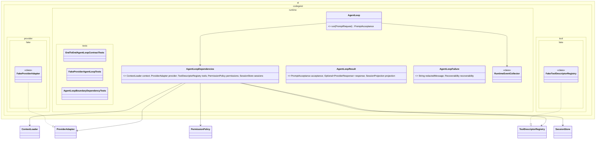

# End To End Agent Loop Implementation Plan

Planning handoff for `T004_09`: implement the first deterministic prompt loop
across implemented runtime, context, provider, tool, permission, storage, and CLI
boundaries using fakes first.

## Source Task

- Task: `docs/tasks/T004_implement-codegeist-opencode-core-application/tasks/T004_09_implement_end_to_end_agent_loop.md`
- Parent: `docs/tasks/T004_implement-codegeist-opencode-core-application/task.md`
- Primary inputs: finalized `T004_01` through `T004_08` implementation tasks and `docs/developer/specification/codegeist-opencode-parity.md`

## Goal

Wire the first minimal prompt loop through Codegeist-owned boundaries so a CLI
prompt can be accepted, context can be summarized, a fake provider can return an
assistant summary, optional fake tools can be denied or summarized, and storage can
project bounded session state.

## Solution Direction

Add runtime orchestration classes only after the earlier boundaries exist. Use fake
provider and fake tool implementations as deterministic collaborators. Keep live
provider calls, real tools, real shell execution, patch application, and replacement
readiness out of this task.

## Planned Class Diagram



## File Map

Production files to add:

```text
app/codegeist/cli/src/main/java/ai/codegeist/runtime/
  AgentLoop.java
  AgentLoopDependencies.java
  AgentLoopFailure.java
  AgentLoopResult.java
  RuntimeEventCollector.java

app/codegeist/cli/src/main/java/ai/codegeist/provider/fake/
  FakeProviderAdapter.java

app/codegeist/cli/src/main/java/ai/codegeist/tool/fake/
  FakeToolDescriptorRegistry.java
```

Test files to add:

```text
app/codegeist/cli/src/test/java/ai/codegeist/runtime/
  AgentLoopBoundaryDependencyTests.java
  EndToEndAgentLoopContractTests.java
  FakeProviderAgentLoopTests.java
```

Documentation to update during solve:

```text
docs/developer/architecture/architecture.md
docs/tasks/T004_implement-codegeist-opencode-core-application/tasks/T004_09_implement_end_to_end_agent_loop.md
```

## Implementation Steps

1. Add `EndToEndAgentLoopContractTests#runsPromptLoopWithFakeProviderAndInMemoryStorage` as the first failing test.
2. Add `AgentLoopDependencies`, `RuntimeEventCollector`, and minimal `AgentLoop` orchestration over the already solved ports.
3. Add fake provider and fake tool registry collaborators for deterministic tests.
4. Wire context manifest summaries, provider response summaries, runtime events, and storage projections in bounded form.
5. Add tests for provider failure, permission/tool denial summaries, and storage unavailable failures.
6. Add dependency tests proving runtime orchestration does not expose Spring AI, Spring Shell, process, filesystem, provider SDK, or UI types.
7. Update architecture docs and task solve notes.

## TDD And Verification

```bash
cd app/codegeist/cli
mvn --batch-mode --no-transfer-progress -Dtest=EndToEndAgentLoopContractTests#runsPromptLoopWithFakeProviderAndInMemoryStorage test
mvn --batch-mode --no-transfer-progress -Dtest=EndToEndAgentLoopContractTests,FakeProviderAgentLoopTests,AgentLoopBoundaryDependencyTests test
mvn --batch-mode --no-transfer-progress test
```

Documentation-only planning verification:

```bash
git --no-pager diff --check
```

## Dependencies And Deferrals

- Depends on solved `T004_01` through `T004_08` or must explicitly narrow unresolved dependencies during solve.
- Defers OpenCode replacement claims, live provider compatibility, real tool execution, real shell execution, patch application, native packaging status, broad TUI, server, Vaadin, PF4J, and JBang.

## Acceptance Criteria

- A deterministic fake-provider prompt loop works through Codegeist-owned boundaries.
- Runtime owns orchestration and emits bounded events/session projections.
- Failures from provider, permission/tool, context, and storage boundaries are typed and redacted.
- Architecture docs describe the implemented loop and verification.

## Open Questions

None at planning depth. Solve must wait until upstream T004 tasks are solved or record a concrete narrowing.

## Planning Handoff

- Phase command: `/plan-task T004_09` as part of user input `alle tasks aus t004`.
- Selected option: plan the existing T004 child task instead of creating a duplicate.
- Duplicate check result: `end-to-end-agent-loop-implementation.md` did not exist before this pass.
- Discovered hints considered: `java-spring-architecture-planning-guidance.md`, `opencode-solving-guidance.md`, and `opencode-source-solving-guidance.md`.
- Related context files read: T004 parent, T004 child tasks, current architecture doc, Codegeist/OpenCode parity doc, and earlier T004 implementation plans.
- Next recommended phase: `/solve-task t004_09` after required earlier T004 implementation tasks are solved.
