# Event Core Contracts Implementation Plan

Planning handoff for `T004_01_04`: implement the first `ai.codegeist.event`
runtime event contracts after runtime and session identifiers exist.

## Source Task

- Task:
  `docs/tasks/T004_implement-codegeist-opencode-core-application/tasks/T004_01_implement_runtime_session_event_core/tasks/T004_01_04_define_event_core_contracts.md`
- Parent task:
  `docs/tasks/T004_implement-codegeist-opencode-core-application/tasks/T004_01_implement_runtime_session_event_core/task.md`
- Prior dependencies: `T004_01_01`, `T004_01_02`, and `T004_01_03`

## Goal

Add ordered runtime event envelopes and the first payload sealed family so session
and prompt activity can be represented as Codegeist-owned events without event bus,
SSE, persistence, provider stream, tool, shell, patch, or UI behavior.

## Concrete Solution Direction

Create `ai.codegeist.event` with event identity, type/source/visibility enums,
`EventEnvelope`, `RuntimeEvent`, `EventPayload`, and first payload records. Add a
focused plain JVM test for positive session sequence and optional turn sequence
rules.

## Planned Class Diagram

```mermaid
classDiagram
    class EventId { <<record>> String value }
    class EventType { <<enum>> SESSION_CREATED SESSION_UPDATED TURN_STARTED USER_INPUT TURN_COMPLETED WARNING_RAISED ERROR_RAISED }
    class EventSource { <<enum>> RUNTIME SESSION CLIENT SYSTEM }
    class EventVisibility { <<enum>> USER_VISIBLE INTERNAL AUDIT }
    class EventEnvelope { <<record>> EventId id; EventType type; SessionId sessionId; Optional~TurnId~ turnId; long sessionSequence; OptionalLong turnSequence }
    class RuntimeEvent { <<record>> EventEnvelope envelope; EventPayload payload }
    class EventPayload { <<sealed interface>> }
    class SessionCreated { <<record>> SessionId sessionId }
    class SessionUpdated { <<record>> SessionStatus status }
    class TurnStarted { <<record>> TurnId turnId; AgentMode mode }
    class UserInputAccepted { <<record>> String redactedSummary }
    class TurnCompleted { <<record>> TurnId turnId; TurnStatus status }
    class WarningRaised { <<record>> String redactedMessage }
    class ErrorRaised { <<record>> String redactedMessage; Recoverability recoverability }
    class RuntimeSessionEventContractTests { assignsMonotonicSessionEventSequence() }

    RuntimeEvent --> EventEnvelope
    RuntimeEvent --> EventPayload
    EventEnvelope --> EventId
    EventEnvelope --> EventType
    EventEnvelope --> EventSource
    EventEnvelope --> EventVisibility
    EventEnvelope --> SessionId
    EventEnvelope --> TurnId
    EventPayload <|.. SessionCreated
    EventPayload <|.. SessionUpdated
    EventPayload <|.. TurnStarted
    EventPayload <|.. UserInputAccepted
    EventPayload <|.. TurnCompleted
    EventPayload <|.. WarningRaised
    EventPayload <|.. ErrorRaised
    RuntimeSessionEventContractTests ..> EventEnvelope
    RuntimeSessionEventContractTests ..> RuntimeEvent
```



## Planned Type Details

| Type | Kind | Planned file | Detailed responsibility |
| --- | --- | --- | --- |
| `EventId` | record | `app/codegeist/cli/src/main/java/ai/codegeist/event/EventId.java` | Stable identity for replay-safe runtime events. |
| `EventType` | enum | `app/codegeist/cli/src/main/java/ai/codegeist/event/EventType.java` | First event family names for session, turn, accepted input, warnings, and errors. |
| `EventSource` | enum | `app/codegeist/cli/src/main/java/ai/codegeist/event/EventSource.java` | Identifies whether runtime, session, client, or system code created the event. |
| `EventVisibility` | enum | `app/codegeist/cli/src/main/java/ai/codegeist/event/EventVisibility.java` | Separates user-visible, internal, and audit-oriented events without implementing audit storage. |
| `EventEnvelope` | record | `app/codegeist/cli/src/main/java/ai/codegeist/event/EventEnvelope.java` | Ordered metadata for one runtime event, including positive session sequence and optional positive turn sequence. |
| `RuntimeEvent` | record | `app/codegeist/cli/src/main/java/ai/codegeist/event/RuntimeEvent.java` | Couples envelope metadata to a typed payload. |
| `EventPayload` | sealed interface | `app/codegeist/cli/src/main/java/ai/codegeist/event/EventPayload.java` | Permits only the first payload records for this event slice. |
| `SessionCreated` | record | `app/codegeist/cli/src/main/java/ai/codegeist/event/SessionCreated.java` | Payload for accepted creation of a new session. |
| `SessionUpdated` | record | `app/codegeist/cli/src/main/java/ai/codegeist/event/SessionUpdated.java` | Payload for session status changes. |
| `TurnStarted` | record | `app/codegeist/cli/src/main/java/ai/codegeist/event/TurnStarted.java` | Payload for an accepted prompt turn and mode. |
| `UserInputAccepted` | record | `app/codegeist/cli/src/main/java/ai/codegeist/event/UserInputAccepted.java` | Payload with a redacted prompt summary. It must not store raw prompt text. |
| `TurnCompleted` | record | `app/codegeist/cli/src/main/java/ai/codegeist/event/TurnCompleted.java` | Payload for terminal first-wave turn status. |
| `WarningRaised` | record | `app/codegeist/cli/src/main/java/ai/codegeist/event/WarningRaised.java` | Payload for non-fatal redacted runtime warnings. |
| `ErrorRaised` | record | `app/codegeist/cli/src/main/java/ai/codegeist/event/ErrorRaised.java` | Payload for recoverable or terminal redacted runtime errors. |
| `RuntimeSessionEventContractTests` | test class | `app/codegeist/cli/src/test/java/ai/codegeist/runtime/RuntimeSessionEventContractTests.java` | Adds `assignsMonotonicSessionEventSequence` and keeps accumulated runtime/session tests passing. |

## Spring Usage

No Spring Framework, Spring Boot, Spring AI, Spring Shell, provider SDK, or Agent
Utils classes should appear in event contracts. Use Java standard library types
such as `Optional`, `OptionalLong`, and `Instant` only when needed. Tests remain
plain JUnit Jupiter and AssertJ.

## Planned Files

Production files to add:

```text
app/codegeist/cli/src/main/java/ai/codegeist/event/
  ErrorRaised.java
  EventEnvelope.java
  EventId.java
  EventPayload.java
  EventSource.java
  EventType.java
  EventVisibility.java
  RuntimeEvent.java
  SessionCreated.java
  SessionUpdated.java
  TurnCompleted.java
  TurnStarted.java
  UserInputAccepted.java
  WarningRaised.java
```

Existing test file to update:

```text
app/codegeist/cli/src/test/java/ai/codegeist/runtime/RuntimeSessionEventContractTests.java
```

## Implementation Steps

1. Add `RuntimeSessionEventContractTests#assignsMonotonicSessionEventSequence`.
2. Assert valid envelopes accept positive session sequence and absent or positive
   turn sequence.
3. Assert non-positive sequence values fail through `InvalidSequence`.
4. Add event ids, enums, envelope, runtime event, sealed payload interface, and
   payload records.
5. Keep raw prompt text, provider chunks, tool output, transport metadata, and
   storage references out of payload records.
6. Re-run focused and accumulated contract tests.
7. Update architecture docs after event source exists.

## TDD And Verification Plan

```bash
cd app/codegeist/cli
mvn --batch-mode --no-transfer-progress -Dtest=RuntimeSessionEventContractTests#assignsMonotonicSessionEventSequence test
mvn --batch-mode --no-transfer-progress -Dtest=RuntimeSessionEventContractTests test
```

## Acceptance Criteria

- Event envelope and payload contracts exist under `ai.codegeist.event`.
- Session sequence is positive, and turn sequence is optional but positive when
  present.
- Public event contracts expose no framework, provider, storage, transport, UI, or
  Agent Utils types.
- Event payloads remain first-wave domain observations only.

## Dependencies

- Requires runtime prompt contracts, runtime failures, and session identifiers.
- Feeds session projection in `T004_01_05`.

## Tradeoffs And Risks

- This slice creates event records, not an event bus or event store.
- Payload names intentionally resemble behavior, not OpenCode implementation or
  generated API model names.

## Open Questions

None.

## Plan Workflow Handoff

- Phase command: `/plan-task T004_01_04` as part of user input to plan all
  subtasks in `T004_01`.
- Selected option: sharpen the existing child task with a child-specific
  implementation plan.
- Duplicate check result: no child-specific plan existed for `T004_01_04`.
- Discovered hints considered: Spring AI Agent Utils phase guidance, Java/Spring
  architecture planning guidance, OpenCode solving guidance, and OpenCode source
  solving guidance.
- Related context files read: parent T004/T004_01 tasks, prior child tasks,
  `runtime-session-event-source-generation-contract.md`, `testing-strategy-and-agent-rules.md`,
  and `architecture.md`.
- Upstream phase dependency: specification is satisfied; solve remains blocked
  until `T004_01_01` through `T004_01_03` are solved.
- Recommended next phase: `/solve-task T004_01_04` after dependencies are solved.
