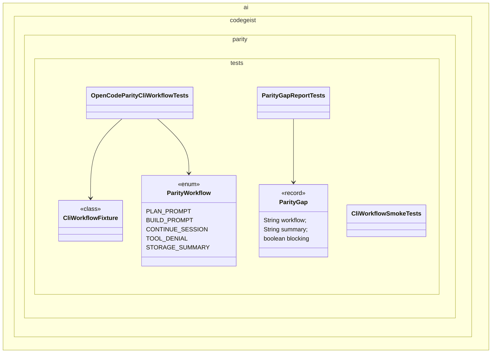

# OpenCode Parity CLI Workflow Validation Plan

Planning handoff for `T004_10`: validate selected OpenCode-style CLI workflows
against the implemented Codegeist core and close only small planned gaps.

## Source Task

- Task: `docs/tasks/T004_implement-codegeist-opencode-core-application/tasks/T004_10_validate_opencode_parity_cli_workflows.md`
- Parent: `docs/tasks/T004_implement-codegeist-opencode-core-application/task.md`
- Primary inputs: solved `T004_09` and `docs/developer/specification/codegeist-opencode-parity.md`

## Goal

Prove a small selected workflow set through tests and smoke checks, then record any
larger gaps as follow-up tasks instead of broadening this validation slice.

## Solution Direction

Add parity-focused test fixtures and, only if needed, small runtime/CLI corrections
that are directly required for selected workflows. This task validates behavior; it
does not implement deferred JBang, PF4J, Vaadin, server, SDK/OpenAPI, or full TUI
behavior.

## Planned Class Diagram



## File Map

Test/support files to add or update:

```text
app/codegeist/cli/src/test/java/ai/codegeist/parity/
  CliWorkflowFixture.java
  CliWorkflowSmokeTests.java
  OpenCodeParityCliWorkflowTests.java
  ParityGap.java
  ParityGapReportTests.java
  ParityWorkflow.java
```

Possible production files to update only for small planned fixes exposed by validation:

```text
app/codegeist/cli/src/main/java/ai/codegeist/cli/PromptCommands.java
app/codegeist/cli/src/main/java/ai/codegeist/runtime/AgentLoop.java
app/codegeist/cli/src/main/java/ai/codegeist/storage/InMemorySessionStore.java
```

Documentation to update during solve:

```text
docs/developer/architecture/architecture.md
docs/developer/specification/codegeist-opencode-parity.md
docs/tasks/T004_implement-codegeist-opencode-core-application/tasks/T004_10_validate_opencode_parity_cli_workflows.md
```

## Selected Workflow Set

- Plan prompt acceptance and deterministic no-side-effect output.
- Build prompt acceptance through the fake-provider loop without real side effects.
- Session continuation inside the in-memory process.
- Tool or shell request denial in Plan mode with a bounded explanation.
- Bounded session summary after a fake-provider run.

## Implementation Steps

1. Add `OpenCodeParityCliWorkflowTests#planPromptProducesAcceptedPlanWorkflowSummary` as the first failing or confirming test.
2. Build `CliWorkflowFixture` over solved runtime, CLI, fake provider, fake tool, and in-memory storage collaborators.
3. Add tests for the selected workflow set and record any missing behavior as `ParityGap` fixtures.
4. Apply only small planned corrections needed for selected workflows; move broader gaps to follow-up task notes.
5. Add smoke-level CLI workflow checks when command invocation is stable.
6. Update architecture and parity docs with current verified behavior and remaining gaps.

## TDD And Verification

```bash
cd app/codegeist/cli
mvn --batch-mode --no-transfer-progress -Dtest=OpenCodeParityCliWorkflowTests#planPromptProducesAcceptedPlanWorkflowSummary test
mvn --batch-mode --no-transfer-progress -Dtest=OpenCodeParityCliWorkflowTests,CliWorkflowSmokeTests,ParityGapReportTests test
mvn --batch-mode --no-transfer-progress test
```

Documentation-only planning verification:

```bash
git --no-pager diff --check
```

## Dependencies And Deferrals

- Depends on solved `T004_09`.
- Defers JBang, PF4J, Vaadin, headless server, API, SDK/OpenAPI, broad TUI, live provider parity, MCP parity, external extension parity, and release packaging readiness.

## Acceptance Criteria

- Selected workflows are verified or explicitly recorded as gaps.
- Small fixes stay within already implemented core boundaries.
- Larger gaps become follow-up task notes rather than hidden scope expansion.
- Architecture and parity docs reflect verified current behavior.

## Open Questions

None. The selected workflow set is intentionally small for first validation.

## Planning Handoff

- Phase command: `/plan-task T004_10` as part of user input `alle tasks aus t004`.
- Selected option: plan the existing T004 child task instead of creating a duplicate.
- Duplicate check result: `opencode-parity-cli-workflow-validation.md` did not exist before this pass.
- Discovered hints considered: `java-spring-architecture-planning-guidance.md`, `opencode-solving-guidance.md`, and `opencode-source-solving-guidance.md`.
- Related context files read: T004 parent, T004 child tasks, current architecture doc, Codegeist/OpenCode parity doc, and `T004_09` plan.
- Next recommended phase: `/solve-task t004_10` after `T004_09` is solved.

## Agent Utils Planning Recheck

- Agent Utils equivalents: Claude Code-inspired Agent Utils tools, built-in
  subagents, and prompt resources.
- Plan decision: keep OpenCode parity workflows as the primary validation target
  and use Agent Utils only as secondary Java/Spring behavior evidence.
- Solve constraint: do not replace OpenCode parity criteria with Agent Utils
  behavior; record Agent Utils-derived comparisons only as supporting notes or
  follow-up gaps.
- Test impact: existing workflow and gap-report tests remain the right verification
  scope.
- Result: the plan remains implementation-ready after `T004_09` is solved.
