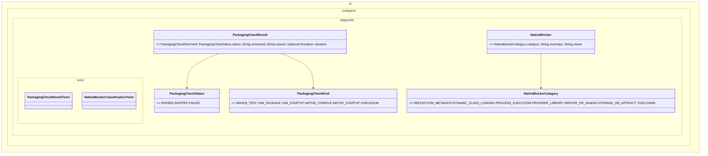

# Packaging Native Startup Validation Plan

Planning handoff for `T004_11`: validate JVM packaging, startup, native posture,
and binary smoke readiness after enough core behavior exists.

## Source Task

- Task: `docs/tasks/T004_implement-codegeist-opencode-core-application/tasks/T004_11_validate_packaging_native_and_startup_posture.md`
- Parent: `docs/tasks/T004_implement-codegeist-opencode-core-application/task.md`
- Primary docs: `docs/developer/specification/build-release-and-binary-smoke-strategy.md` and `docs/developer/specification/native-packaging-posture.md`

## Goal

Create a concrete validation plan for `task test`, `task build`, JVM jar startup,
optional `task native`, native startup smoke, and explicit `passed`, `skipped`, or
`failed` status reporting.

## Solution Direction

Prefer a documentation and test-validation slice first. Add small packaging status
records and tests only if they become useful for user-visible reporting; otherwise
record validation results in the task solve result and architecture docs. Do not
publish releases, add signing keys, or create a full release pipeline.

## Planned Class Diagram



## File Map

Production files to add only if solve chooses source-backed status objects:

```text
app/codegeist/cli/src/main/java/ai/codegeist/diagnostic/
  NativeBlocker.java
  NativeBlockerCategory.java
  PackagingCheckKind.java
  PackagingCheckResult.java
  PackagingCheckStatus.java
```

Test files to add only with source-backed status objects:

```text
app/codegeist/cli/src/test/java/ai/codegeist/diagnostic/
  NativeBlockerClassificationTests.java
  PackagingCheckResultTests.java
```

Documentation to update during solve:

```text
docs/developer/architecture/architecture.md
docs/tasks/T004_implement-codegeist-opencode-core-application/tasks/T004_11_validate_packaging_native_and_startup_posture.md
```

Build files may be updated only if validation proves a small packaging correction is required:

```text
app/codegeist/cli/Taskfile.yml
app/codegeist/cli/pom.xml
```

## Implementation Steps

1. Re-run the already implemented test and packaging ladder appropriate to current core behavior.
2. If status objects are useful, add `PackagingCheckResultTests#recordsSkippedNativeCheckWithReason` first and implement the diagnostic records.
3. Run `task test` and `task build` from `app/codegeist/cli`.
4. Run a JVM startup smoke with Spring Shell interactivity disabled and a bounded timeout.
5. Run `task native` only when the available toolchain and time budget make it practical; otherwise record `skipped` with a concrete reason.
6. If native compile passes, run native startup smoke with the same bounded policy.
7. Update architecture docs and the task solve result with exact pass/skip/fail status and approximate timing.

## Verification Plan

Documentation-only planning verification:

```bash
git --no-pager diff --check
```

Solve-phase validation commands:

```bash
cd app/codegeist/cli
task test
task build
timeout 15s java -jar target/codegeist.jar --spring.shell.interactive.enabled=false
task native
timeout 5s ./target/codegeist --spring.shell.interactive.enabled=false
```

If diagnostic source files are added, also run:

```bash
cd app/codegeist/cli
mvn --batch-mode --no-transfer-progress -Dtest=PackagingCheckResultTests,NativeBlockerClassificationTests test
```

## Dependencies And Deferrals

- Depends on enough solved core behavior to make binary smoke meaningful.
- Defers GitHub Release publication, signing, notarization, SBOM, SLSA provenance, installers, package-manager publishing, and multi-platform CI matrix implementation.

## Acceptance Criteria

- JVM test, build, and startup status are recorded as `passed`, `skipped`, or `failed` with commands and timing.
- Native compile and native startup are recorded as `passed`, `skipped`, or `failed` with concrete reasons.
- Any packaging or startup correction is small, planned, and verified.
- Architecture docs reflect validated packaging state.

## Open Questions

None. Native execution may be skipped with reason when the solve environment cannot run it safely within budget.

## Planning Handoff

- Phase command: `/plan-task T004_11` as part of user input `alle tasks aus t004`.
- Selected option: plan the existing T004 child task instead of creating a duplicate.
- Duplicate check result: `packaging-native-startup-validation.md` did not exist before this pass.
- Discovered hints considered: `java-spring-architecture-planning-guidance.md`, `opencode-solving-guidance.md`, and `opencode-source-solving-guidance.md`.
- Related context files read: T004 parent, T004 child tasks, current architecture doc, build/release strategy, and native packaging posture.
- Next recommended phase: `/solve-task t004_11` after enough core behavior exists for meaningful startup smoke.

## Agent Utils Planning Recheck

- Agent Utils equivalent: no packaging helper equivalent; Agent Utils is only a
  dependency impact to classify if earlier solve phases adopt it.
- Plan decision: keep the existing packaging, startup, JVM jar, and optional native
  validation ladder unchanged.
- Solve constraint: report Agent Utils impact only when it is actually present in
  implemented code or runtime dependencies.
- Test impact: existing startup, build, native posture, and optional diagnostic
  checks remain the right verification scope.
- Result: the plan remains implementation-ready after enough core behavior exists
  for meaningful smoke checks.
