# Patch Edit Proposal Core Implementation Plan

Planning handoff for `T004_05`: implement reviewable patch/edit proposal and
apply-result contracts without broad file mutation behavior.

## Source Task

- Task: `docs/tasks/T004_implement-codegeist-opencode-core-application/tasks/T004_05_implement_patch_edit_proposal_core.md`
- Parent: `docs/tasks/T004_implement-codegeist-opencode-core-application/task.md`
- Primary contract: `docs/developer/specification/patch-edit-proposal-source-generation-contract.md`
- Policy dependency: `docs/developer/implementation/tool-permission-workspace-core-implementation.md`

## Goal

Create `ai.codegeist.patch` contracts for edit proposals, target summaries,
freshness, exact approval binding, apply requests/results, typed failures, bounded
summaries, and output references.

## Solution Direction

Represent patch/edit proposals and apply outcomes as safe, bounded metadata before
any real file mutation exists. The first implementation can construct proposals,
validate approval binding, deny Plan-mode apply attempts, classify stale or denied
requests, and return typed apply results through fake fixtures. It does not parse
or apply real patches, run formatters, rollback files, or persist proposals.

## Planned Class Diagram

```mermaid
classDiagram
    namespace ai.codegeist.patch {
        class EditProposalId { <<record>> String value }
        class ApplyEditRequestId { <<record>> String value }
        class EditProposal { <<record>> EditProposalId id; SessionId sessionId; TurnId turnId; AgentMode mode; CorrelationId correlationId; ProposalSummary summary; List~EditTarget~ targets; ProposalFreshness freshness; List~OutputRef~ outputRefs }
        class EditTarget { <<record>> WorkspaceToolTarget target; EditTargetKind kind; ProposalFreshness freshness }
        class EditTargetKind { <<enum>> UPDATE_EXISTING_FILE CREATE_FILE DELETE_FILE RENAME_OR_MOVE }
        class PatchHunk { <<record>> EditTarget target; int oldStart; int newStart; int removedLines; int addedLines; Optional~OutputRef~ detailRef }
        class TextReplacement { <<record>> EditTarget target; String redactedSummary; ProposalFreshness freshness }
        class ProposalFreshness { <<record>> String contentIdentity; Instant checkedAt }
        class ProposalSummary { <<record>> String redactedIntent; int targetCount; int changeCount; boolean truncated }
        class ApplyEditRequest { <<record>> ApplyEditRequestId id; EditProposalId proposalId; PermissionDecisionId decisionId; AgentMode mode; CorrelationId correlationId }
        class ApplyEditResult { <<record>> ApplyEditRequestId id; EditProposalId proposalId; ApplyResultStatus status; ProposalSummary summary; List~EditedFileSummary~ files; Optional~ApplyEditFailure~ failure; List~OutputRef~ outputRefs }
        class ApplyResultStatus { <<enum>> APPLIED PARTIALLY_APPLIED DENIED FAILED CANCELLED }
        class EditedFileSummary { <<record>> WorkspaceToolTarget target; EditTargetKind kind; boolean touched; int changedLines; List~OutputRef~ outputRefs }
        class ApplyEditFailure { <<record>> ApplyFailureKind kind; String redactedMessage; Recoverability recoverability }
        class ApplyFailureKind { <<enum>> MODE_DENIED PERMISSION_DENIED WORKSPACE_DENIED MISSING_TARGET STALE_INPUT CONFLICT INVALID_PATCH PARTIAL_APPLY OUTPUT_OVERFLOW CANCELLED UNEXPECTED_IO_FAILURE }
        class EditProposalService { <<class>> createProposal(); applyMetadataOnly() ApplyEditResult }
    }

    namespace ai.codegeist.patch.tests {
        class PatchEditProposalContractTests
        class PatchEditApprovalBindingTests
        class PatchEditBoundaryDependencyTests
    }

    EditProposal --> EditTarget
    EditProposal --> ProposalSummary
    EditProposal --> ProposalFreshness
    ApplyEditRequest --> PermissionDecisionId
    ApplyEditResult --> EditedFileSummary
    ApplyEditResult --> ApplyEditFailure
```



## File Map

Production files to add:

```text
app/codegeist/cli/src/main/java/ai/codegeist/patch/
  ApplyEditFailure.java
  ApplyEditRequest.java
  ApplyEditRequestId.java
  ApplyEditResult.java
  ApplyFailureKind.java
  ApplyResultStatus.java
  EditProposal.java
  EditProposalId.java
  EditProposalService.java
  EditTarget.java
  EditTargetKind.java
  EditedFileSummary.java
  PatchHunk.java
  ProposalFreshness.java
  ProposalSummary.java
  TextReplacement.java
```

Test files to add:

```text
app/codegeist/cli/src/test/java/ai/codegeist/patch/
  PatchEditProposalContractTests.java
  PatchEditApprovalBindingTests.java
  PatchEditBoundaryDependencyTests.java
```

Documentation to update during solve:

```text
docs/developer/architecture/architecture.md
docs/tasks/T004_implement-codegeist-opencode-core-application/tasks/T004_05_implement_patch_edit_proposal_core.md
```

## Implementation Steps

1. Add `PatchEditApprovalBindingTests#deniesPlanModeApplyBeforePermission` as the first failing test.
2. Implement proposal ids, summaries, targets, hunk/replacement summaries, and freshness records.
3. Implement apply request/result/failure records and a metadata-only `EditProposalService` for gate-order tests.
4. Add tests for exact proposal id and permission decision binding, stale input classification, workspace denial propagation, and bounded output refs.
5. Add dependency tests proving patch contracts do not expose patch-library, filesystem, Spring, provider, shell, storage, or UI types.
6. Update architecture docs and task solve notes.

## TDD And Verification

```bash
cd app/codegeist/cli
mvn --batch-mode --no-transfer-progress -Dtest=PatchEditApprovalBindingTests#deniesPlanModeApplyBeforePermission test
mvn --batch-mode --no-transfer-progress -Dtest=PatchEditProposalContractTests,PatchEditApprovalBindingTests,PatchEditBoundaryDependencyTests test
mvn --batch-mode --no-transfer-progress test
```

Documentation-only planning verification:

```bash
git --no-pager diff --check
```

## Dependencies And Deferrals

- Depends on `T004_04` policy, permission, workspace target, and output-ref contracts.
- Defers real file mutation, patch parsing, formatters, rollback, storage, rich diff UI, shell execution, provider callbacks, and persistence.

## Acceptance Criteria

- Proposal and apply-result contracts are bounded, redaction-safe, and approval-bound.
- Plan-mode apply is denied before permission.
- Apply failures distinguish mode, permission, workspace, freshness, conflict, invalid patch, partial apply, overflow, cancellation, and unexpected I/O categories.
- Architecture docs describe the implemented patch package and tests.

## Open Questions

None. Real apply execution is intentionally deferred.

## Planning Handoff

- Phase command: `/plan-task T004_05` as part of user input `alle tasks aus t004`.
- Selected option: plan the existing T004 child task instead of creating a duplicate.
- Duplicate check result: `patch-edit-proposal-core-implementation.md` did not exist before this pass.
- Discovered hints considered: `java-spring-architecture-planning-guidance.md`, `opencode-solving-guidance.md`, and `opencode-source-solving-guidance.md`.
- Related context files read: T004 parent, T004 child tasks, current architecture doc, patch/edit source-generation contract, and `T004_04` plan.
- Next recommended phase: `/solve-task t004_05` after `T004_04` is solved enough to provide policy dependencies.
