# Provider Spring AI Adapter Core Implementation Plan

Planning handoff for `T004_03`: implement provider configuration validation and
Spring AI adapter boundaries without live model calls by default.

## Source Task

- Task: `docs/tasks/T004_implement-codegeist-opencode-core-application/tasks/T004_03_implement_provider_configuration_spring_ai_adapter_core.md`
- Parent: `docs/tasks/T004_implement-codegeist-opencode-core-application/task.md`
- Primary contract: `docs/developer/specification/provider-spring-ai-adapter-source-generation-contract.md`
- Supporting docs: `docs/developer/specification/provider-configuration-contracts.md`, `docs/developer/specification/java-generation-guidance.md`, and `docs/developer/specification/testing-strategy-and-agent-rules.md`

## Goal

Create Codegeist-owned provider configuration and adapter contracts for
OpenAI-compatible/OpenAI and Ollama first-wave posture while keeping Spring AI and
provider SDK details inside adapter classes.

## Solution Direction

Add `ai.codegeist.provider` for provider ids, model refs, capabilities, options,
credential references, validation, adapter requests/responses, diagnostics, usage,
and errors. Add `ai.codegeist.provider.springai` for adapter-side mappers and
factory classes. The first implementation validates configuration offline and uses
fake or mapper-only tests; it does not add provider starters, credentials, network
calls, runtime orchestration, CLI flags, or tool callbacks.

## Planned Class Diagram

```mermaid
classDiagram
    namespace ai.codegeist.provider {
        class ProviderId { <<record>> String value }
        class ModelId { <<record>> String value }
        class ProviderModelRef { <<record>> ProviderId providerId; ModelId modelId }
        class ProviderType { <<enum>> OPENAI_COMPATIBLE OPENAI OLLAMA SPRING_AI_SUPPORTED }
        class ProviderConfig { <<record>> ProviderId id; ProviderType type; boolean enabled; CredentialSourceRef credential; List~ProviderModelConfig~ models }
        class ProviderModelConfig { <<record>> ProviderModelRef ref; ProviderCapabilitySet capabilities; ProviderOptionsProfile defaults; VerificationStatus status }
        class ProviderCapabilitySet { <<record>> boolean streaming; boolean toolCalling; boolean local; boolean networkRequired }
        class ProviderOptionsProfile { <<record>> OptionalDouble temperature; OptionalInt maxTokens; List~String~ stopSequences }
        class CredentialSourceRef { <<record>> CredentialSourceKind kind; String name }
        class CredentialSourceKind { <<enum>> ENV SECRET_STORE LOCAL_PROFILE NONE }
        class VerificationStatus { <<enum>> UNKNOWN CONFIGURED VALIDATED FAILED DISABLED }
        class ProviderValidationResult { <<record>> ProviderId providerId; VerificationStatus status; List~ProviderDiagnostic~ diagnostics }
        class ProviderDiagnostic { <<record>> ProviderDiagnosticKind kind; String redactedMessage }
        class ProviderDiagnosticKind { <<enum>> CONFIGURED DISABLED MISSING_MODEL MISSING_CREDENTIAL INVALID_ENDPOINT UNSUPPORTED_CAPABILITY }
        class ProviderAdapter { <<interface>> validate(ProviderConfig) ProviderValidationResult; call(ProviderRequest) ProviderResponse; stream(ProviderRequest) ProviderStream }
        class ProviderRequestId { <<record>> String value }
        class ProviderRequest { <<record>> ProviderRequestId id; ProviderModelRef model; AgentMode mode; SessionId sessionId; TurnId turnId; CorrelationId correlationId; RedactedPrompt prompt; ProviderOptionsProfile options }
        class RedactedPrompt { <<record>> String summary }
        class ProviderResponse { <<record>> ProviderModelRef model; String assistantText; ProviderUsage usage; List~ProviderDiagnostic~ diagnostics }
        class ProviderStream { <<interface>> }
        class ProviderStreamChunk { <<record>> ProviderStreamChunkType type; Optional~String~ textDelta; Optional~ProviderUsage~ usageDelta }
        class ProviderStreamChunkType { <<enum>> TEXT USAGE DIAGNOSTIC COMPLETE }
        class ProviderUsage { <<record>> OptionalInt inputTokens; OptionalInt outputTokens }
        class ProviderError { <<record>> ProviderErrorCode code; String redactedMessage; Recoverability recoverability; Optional~String~ providerErrorRef }
        class ProviderErrorCode { <<enum>> PROVIDER_NOT_SELECTED PROVIDER_DISABLED MODEL_NOT_SELECTED MODEL_UNAVAILABLE CREDENTIAL_SOURCE_MISSING CREDENTIAL_UNAVAILABLE ENDPOINT_INVALID CAPABILITY_UNSUPPORTED TOOL_CALLING_DISABLED STREAMING_UNAVAILABLE PROVIDER_UNAVAILABLE PROVIDER_RATE_LIMITED PROVIDER_AUTH_FAILED PROVIDER_TIMEOUT PROVIDER_RESPONSE_INVALID }
    }

    namespace ai.codegeist.provider.springai {
        class SpringAiProviderAdapterFactory { <<class>> }
        class SpringAiPromptMapper { <<class>> }
        class SpringAiResponseMapper { <<class>> }
        class SpringAiProviderExceptionMapper { <<class>> }
        class OpenAiCompatibleProviderDescriptor { <<class>> }
        class OllamaProviderDescriptor { <<class>> }
    }

    namespace ai.codegeist.provider.tests {
        class ProviderConfigurationValidationTests
        class SpringAiProviderMappingTests
        class ProviderBoundaryDependencyTests
    }

    ProviderAdapter --> ProviderRequest
    ProviderAdapter --> ProviderResponse
    ProviderAdapter --> ProviderValidationResult
    ProviderRequest --> ProviderModelRef
    ProviderConfig --> ProviderModelConfig
    SpringAiPromptMapper --> ProviderRequest
    SpringAiResponseMapper --> ProviderResponse
```



## File Map

Production files to add:

```text
app/codegeist/cli/src/main/java/ai/codegeist/provider/
  CredentialSourceKind.java
  CredentialSourceRef.java
  ModelId.java
  ProviderAdapter.java
  ProviderCapabilitySet.java
  ProviderConfig.java
  ProviderDiagnostic.java
  ProviderDiagnosticKind.java
  ProviderError.java
  ProviderErrorCode.java
  ProviderId.java
  ProviderModelConfig.java
  ProviderModelRef.java
  ProviderOptionsProfile.java
  ProviderRequest.java
  ProviderRequestId.java
  ProviderResponse.java
  ProviderStream.java
  ProviderStreamChunk.java
  ProviderStreamChunkType.java
  ProviderType.java
  ProviderUsage.java
  ProviderValidationResult.java
  RedactedPrompt.java
  VerificationStatus.java

app/codegeist/cli/src/main/java/ai/codegeist/provider/springai/
  OllamaProviderDescriptor.java
  OpenAiCompatibleProviderDescriptor.java
  SpringAiProviderAdapterFactory.java
  SpringAiProviderExceptionMapper.java
  SpringAiPromptMapper.java
  SpringAiResponseMapper.java
```

Test files to add:

```text
app/codegeist/cli/src/test/java/ai/codegeist/provider/
  ProviderConfigurationValidationTests.java
  ProviderBoundaryDependencyTests.java
app/codegeist/cli/src/test/java/ai/codegeist/provider/springai/
  SpringAiProviderMappingTests.java
```

Documentation to update during solve:

```text
docs/developer/architecture/architecture.md
docs/tasks/T004_implement-codegeist-opencode-core-application/tasks/T004_03_implement_provider_configuration_spring_ai_adapter_core.md
```

No provider starter, `application.yaml`, credential, or live provider test change is planned for this slice.

## Implementation Steps

1. Add `ProviderConfigurationValidationTests#rejectsMissingModelWithoutNetworkCall` as the first failing test.
2. Implement provider/model/config/capability/credential value records and validation result types.
3. Add offline validation for disabled providers, missing models, missing credential references, invalid endpoint metadata when represented, and unsupported capabilities.
4. Add provider request/response/stream/usage/diagnostic/error records with redacted messages.
5. Add Spring AI mapper classes that keep Spring AI types in `ai.codegeist.provider.springai` only.
6. Add mapping and dependency tests proving runtime/session/event contracts do not expose Spring AI types.
7. Update architecture docs and task solve notes.

## TDD And Verification

First failing test:

```bash
cd app/codegeist/cli
mvn --batch-mode --no-transfer-progress -Dtest=ProviderConfigurationValidationTests#rejectsMissingModelWithoutNetworkCall test
```

Additional targeted solve checks:

```bash
cd app/codegeist/cli
mvn --batch-mode --no-transfer-progress -Dtest=ProviderConfigurationValidationTests,SpringAiProviderMappingTests,ProviderBoundaryDependencyTests test
mvn --batch-mode --no-transfer-progress test
```

Documentation-only planning verification:

```bash
git --no-pager diff --check
```

## Dependencies And Deferrals

- Depends on `T004_01` runtime/session/event ids and recoverability vocabulary.
- Defers live provider calls, provider starters, CLI provider flags, runtime selection, tool callbacks, credentials, network checks, context loading, storage, and end-to-end agent loops.

## Acceptance Criteria

- Provider configuration and adapter contracts are Codegeist-owned and redaction-safe.
- Offline validation works without provider credentials or network.
- Spring AI types stay in `ai.codegeist.provider.springai` and do not leak into runtime contracts.
- Architecture docs name the implemented packages and tests.

## Open Questions

None. Exact Spring AI mapping imports may be adjusted during solve to match Spring AI `2.0.0-M6` APIs without changing the public Codegeist boundary.

## Planning Handoff

- Phase command: `/plan-task T004_03` as part of user input `alle tasks aus t004`.
- Selected option: plan the existing T004 child task instead of creating a duplicate.
- Duplicate check result: `provider-spring-ai-adapter-core-implementation.md` did not exist before this pass.
- Discovered hints considered: `java-spring-architecture-planning-guidance.md`, `opencode-solving-guidance.md`, and `opencode-source-solving-guidance.md`.
- Related context files read: T004 parent, T004 child tasks, current architecture doc, provider source-generation contract, provider blueprint, and T004_01 implementation plan.
- Next recommended phase: `/solve-task t004_03` after `T004_01` has produced the runtime/session/event source types this plan references.

## Agent Utils Planning Recheck

- Agent Utils equivalent: no provider-configuration equivalent; Agent Utils
  `ChatClient.Builder` usage is only provider-callback boundary evidence.
- Plan decision: keep provider configuration mapped from Codegeist provider records
  directly to Spring AI APIs inside `ai.codegeist.provider.springai`.
- Solve constraint: do not make Agent Utils the provider configuration layer and do
  not register raw Agent Utils tool callbacks from this task.
- Test impact: existing offline validation and Spring AI mapper tests remain the
  right verification scope.
- Result: the plan remains implementation-ready after `T004_01` is solved.
