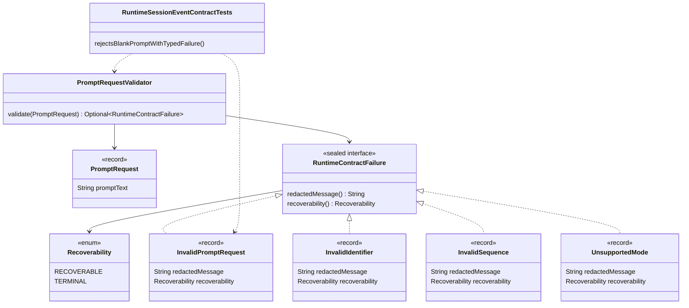

# Runtime Failures And Validation Implementation Plan

Planning handoff for `T004_01_02`: implement typed runtime contract failures and
prompt request validation after the prompt-intake contracts exist.

## Source Task

- Task:
  `docs/tasks/T004_implement-codegeist-opencode-core-application/tasks/T004_01_implement_runtime_session_event_core/tasks/T004_01_02_define_runtime_failures_and_validation.md`
- Parent task:
  `docs/tasks/T004_implement-codegeist-opencode-core-application/tasks/T004_01_implement_runtime_session_event_core/task.md`
- Prior dependency: `T004_01_01 Define Runtime Prompt Contracts`
- Primary source-generation contract:
  `docs/developer/specification/runtime-session-event-source-generation-contract.md`

## Goal

Add a small Codegeist-owned failure vocabulary and prompt request validator so
invalid prompt input can be rejected with redacted, recoverable or terminal
contract failures before later session, event, projection, provider, tool, or UI
behavior exists.

## Concrete Solution Direction

Extend `ai.codegeist.runtime` with a sealed failure interface, first failure
records, recoverability metadata, and `PromptRequestValidator`. Add one new plain
JVM test method to `RuntimeSessionEventContractTests` while preserving the earlier
prompt-acceptance test from `T004_01_01`.

## Planned Class Diagram



## Planned Type Details

| Type | Kind | Planned file | Detailed responsibility |
| --- | --- | --- | --- |
| `Recoverability` | enum | `app/codegeist/cli/src/main/java/ai/codegeist/runtime/Recoverability.java` | Classifies failures as `RECOVERABLE` or `TERMINAL` so later adapters can decide whether user correction is possible without parsing messages. |
| `RuntimeContractFailure` | sealed interface | `app/codegeist/cli/src/main/java/ai/codegeist/runtime/RuntimeContractFailure.java` | Common public failure surface with `redactedMessage()` and `recoverability()`. It permits only the first runtime failure records and must expose no Spring, provider, storage, or UI types. |
| `InvalidPromptRequest` | record | `app/codegeist/cli/src/main/java/ai/codegeist/runtime/InvalidPromptRequest.java` | Represents invalid prompt input such as blank prompt text. Messages must be redacted and must not echo raw prompt text. |
| `InvalidIdentifier` | record | `app/codegeist/cli/src/main/java/ai/codegeist/runtime/InvalidIdentifier.java` | Reserved failure for malformed ids. This child creates the type for later use by session, event, and projection slices without exhaustively validating every identifier yet. |
| `InvalidSequence` | record | `app/codegeist/cli/src/main/java/ai/codegeist/runtime/InvalidSequence.java` | Reserved failure for non-positive or non-monotonic sequence values. Later session and event slices will use it for ordering rules. |
| `UnsupportedMode` | record | `app/codegeist/cli/src/main/java/ai/codegeist/runtime/UnsupportedMode.java` | Reserved failure for mode values rejected by later runtime policy. This child creates the public shape without adding policy beyond prompt validation. |
| `PromptRequestValidator` | class | `app/codegeist/cli/src/main/java/ai/codegeist/runtime/PromptRequestValidator.java` | Stateless validator that checks prompt request presence and blank prompt text. It should return `Optional<RuntimeContractFailure>` or an equivalent small result without throwing framework exceptions. |
| `RuntimeSessionEventContractTests` | test class | `app/codegeist/cli/src/test/java/ai/codegeist/runtime/RuntimeSessionEventContractTests.java` | Adds `rejectsBlankPromptWithTypedFailure` and keeps `acceptsPromptWithoutFrameworkTypes` passing. |

## Spring Usage

No Spring Framework, Spring Boot, Spring AI, Spring Shell, or Spring AI Agent Utils
classes should be used in production contracts or in this plain JVM test slice.
Test support may continue to use `org.junit.jupiter.api.Test` and
`org.assertj.core.api.Assertions` only.

Do not use Spring validation annotations, `ResponseStatusException`, Spring AI tool
exceptions, Agent Utils task classes, or provider SDK exceptions for these failure
contracts. Codegeist-owned failures must remain ordinary Java types.

## Planned Files

Production files to add:

```text
app/codegeist/cli/src/main/java/ai/codegeist/runtime/
  InvalidIdentifier.java
  InvalidPromptRequest.java
  InvalidSequence.java
  PromptRequestValidator.java
  Recoverability.java
  RuntimeContractFailure.java
  UnsupportedMode.java
```

Existing test file to update:

```text
app/codegeist/cli/src/test/java/ai/codegeist/runtime/RuntimeSessionEventContractTests.java
```

Documentation to update after solve:

```text
docs/developer/architecture/architecture.md
docs/tasks/T004_implement-codegeist-opencode-core-application/tasks/T004_01_implement_runtime_session_event_core/tasks/T004_01_02_define_runtime_failures_and_validation.md
```

## Implementation Steps

1. Add `RuntimeSessionEventContractTests#rejectsBlankPromptWithTypedFailure` as the
   first failing test for this slice.
2. Construct a `PromptRequest` with blank prompt text using the types from
   `T004_01_01`.
3. Assert that `PromptRequestValidator` returns `InvalidPromptRequest`, that the
   failure is `RECOVERABLE`, and that its message does not contain raw prompt text.
4. Add `Recoverability`, `RuntimeContractFailure`, and the failure records.
5. Add `PromptRequestValidator` with only request-presence and blank-prompt checks.
6. Re-run the focused test and the existing prompt-acceptance test.
7. Update architecture docs to mention runtime failure contracts after source
   exists.

## TDD And Verification Plan

```bash
cd app/codegeist/cli
mvn --batch-mode --no-transfer-progress -Dtest=RuntimeSessionEventContractTests#rejectsBlankPromptWithTypedFailure test
mvn --batch-mode --no-transfer-progress -Dtest=RuntimeSessionEventContractTests#acceptsPromptWithoutFrameworkTypes test
mvn --batch-mode --no-transfer-progress -Dtest=RuntimeSessionEventContractTests test
```

The first command proves blank prompt validation. The second protects the prior
prompt contract. The class-level command keeps the accumulated contract suite
individually executable.

## Acceptance Criteria

- Blank prompt text maps to `InvalidPromptRequest`.
- Failure messages are redacted and do not echo prompt text.
- `RuntimeContractFailure` exposes recoverability metadata without framework
  exceptions or provider-specific types.
- Identifier, sequence, and unsupported-mode failure records exist for later slices
  but do not broaden behavior beyond this task.

## Dependencies

- Requires `T004_01_01` source to exist first.
- Feeds `T004_01_03`, `T004_01_04`, and `T004_01_05`, which will use the failure
  vocabulary for sequence and projection failures.

## Tradeoffs And Risks

- This slice deliberately creates some failure records before all usages exist so
  later child tasks can share one sealed hierarchy.
- Validation remains narrow. Comprehensive identifier, sequence, and projection
  rules are owned by later child tasks.

## Open Questions

None.

## Plan Workflow Handoff

- Phase command: `/plan-task T004_01_02` as part of user input to plan all
  subtasks in `T004_01`.
- Selected option: sharpen the existing child task with a child-specific
  implementation plan.
- Duplicate check result: no child-specific plan existed for `T004_01_02`.
- Discovered hints considered: Spring AI Agent Utils phase guidance, Java/Spring
  architecture planning guidance, OpenCode solving guidance, and OpenCode source
  solving guidance.
- Related context files read: `runtime-session-event-source-generation-contract.md`,
  `testing-strategy-and-agent-rules.md`, `architecture.md`, the T004 parent,
  `T004_01` parent, `T004_01_01`, and the existing prompt-contract handoff.
- Upstream phase dependency: specification is satisfied; solve remains blocked
  until `T004_01_01` is solved.
- Recommended next phase: `/solve-task T004_01_02` after `T004_01_01` is solved.
