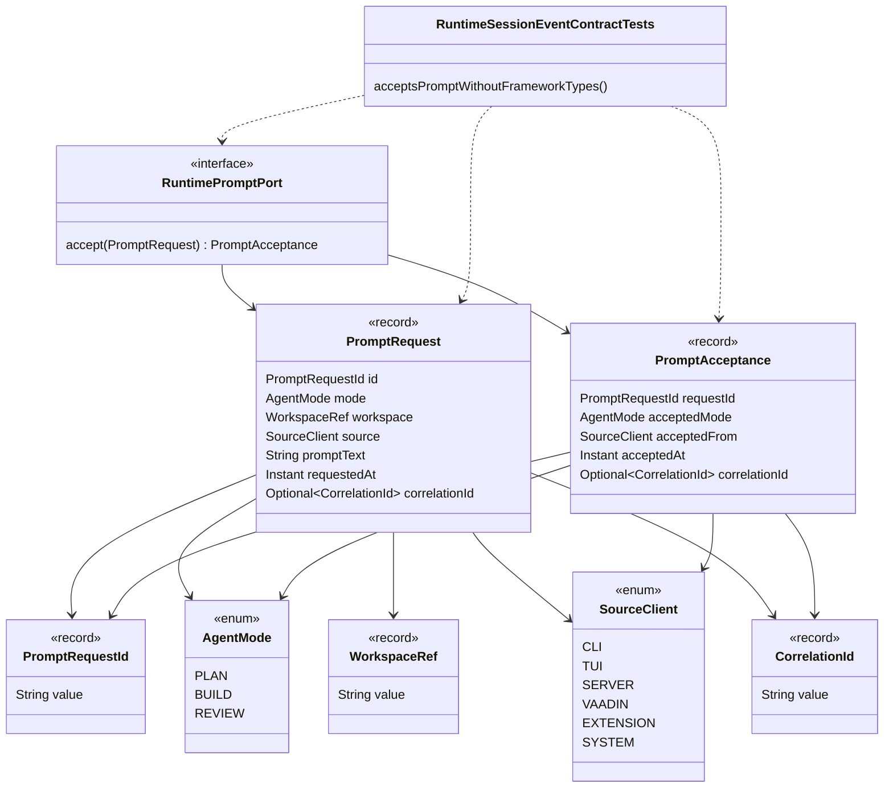

# Runtime Prompt Contracts Implementation Plan

Planning handoff for `T004_01_01`: implement the first
`ai.codegeist.runtime` prompt-intake contracts with a plain JVM contract test.

## Source Task

- Task:
  `docs/tasks/T004_implement-codegeist-opencode-core-application/tasks/T004_01_implement_runtime_session_event_core/tasks/T004_01_01_define_runtime_prompt_contracts.md`
- Parent task:
  `docs/tasks/T004_implement-codegeist-opencode-core-application/tasks/T004_01_implement_runtime_session_event_core/task.md`
- Epic parent:
  `docs/tasks/T004_implement-codegeist-opencode-core-application/task.md`
- Primary source-generation contract:
  `docs/developer/specification/runtime-session-event-source-generation-contract.md`
- Current-state architecture:
  `docs/developer/architecture/architecture.md`

## Goal

Create the first source-backed runtime prompt boundary so later CLI, TUI, server,
Vaadin, and extension adapters can submit prompt requests through Codegeist-owned
types without exposing Spring, Spring AI, Spring Shell, Agent Utils, provider,
storage, UI, or transport types.

## Concrete Solution Direction

Add only the first `ai.codegeist.runtime` package and one plain JVM contract test.
The production slice should contain immutable Java records, enums, and a small
interface. It should avoid validation failures, session mutation, event emission,
provider calls, context loading, tools, permissions, storage, and Spring context
startup.

`PromptAcceptance` is intentionally minimal in this first child task. It records
that a request was accepted through the runtime boundary, but it does not yet own
session ids, turn ids, runtime events, or projections. Later `T004_01` children may
extend or replace this acceptance shape after `ai.codegeist.session` and
`ai.codegeist.event` types exist.

## Planned Class Diagram



## Planned Type Details

| Type | Kind | Planned file | Detailed responsibility |
| --- | --- | --- | --- |
| `PromptRequestId` | record | `app/codegeist/cli/src/main/java/ai/codegeist/runtime/PromptRequestId.java` | Typed identity for one prompt submission. It should wrap a `String value` so client adapters never pass raw ids through the runtime boundary. Full malformed-id failure mapping belongs to `T004_01_02`; this slice may use simple constructor null checks only if needed. |
| `CorrelationId` | record | `app/codegeist/cli/src/main/java/ai/codegeist/runtime/CorrelationId.java` | Optional cross-event or cross-adapter correlation value. It lets later session and event slices thread request correlation without importing provider, transport, logging, or tracing framework types. |
| `WorkspaceRef` | record | `app/codegeist/cli/src/main/java/ai/codegeist/runtime/WorkspaceRef.java` | Minimal workspace boundary value carried by `PromptRequest`. It must not read paths, resolve symlinks, inspect ignore rules, or hard-code this repository's `docs/` layout; real workspace validation belongs to `T004_02`. |
| `AgentMode` | enum | `app/codegeist/cli/src/main/java/ai/codegeist/runtime/AgentMode.java` | Stable runtime mode vocabulary for `PLAN`, `BUILD`, and reserved `REVIEW`. It is intentionally not a Spring Shell command enum, provider option, or Agent Utils task type. |
| `SourceClient` | enum | `app/codegeist/cli/src/main/java/ai/codegeist/runtime/SourceClient.java` | Names the client surface that submitted the prompt: `CLI`, `TUI`, `SERVER`, `VAADIN`, `EXTENSION`, or `SYSTEM`. Most clients remain unimplemented; the enum preserves a stable runtime contract for later adapters. |
| `PromptRequest` | record | `app/codegeist/cli/src/main/java/ai/codegeist/runtime/PromptRequest.java` | Immutable prompt-intake record with request id, mode, workspace reference, source client, prompt text, request timestamp, and optional correlation id. It captures input before provider, tool, storage, or session mutation begins. Blank prompt validation and typed failures are deferred to `T004_01_02`. |
| `PromptAcceptance` | record | `app/codegeist/cli/src/main/java/ai/codegeist/runtime/PromptAcceptance.java` | Immutable first-wave result returned by `RuntimePromptPort`. It records request id, accepted mode, source client, acceptance timestamp, and optional correlation id without yet exposing session, turn, event, projection, storage, or UI types. Later `T004_01` slices may revise it when those contracts exist. |
| `RuntimePromptPort` | interface | `app/codegeist/cli/src/main/java/ai/codegeist/runtime/RuntimePromptPort.java` | Small boundary interface with `PromptAcceptance accept(PromptRequest request)`. It gives future adapters one Codegeist-owned call target while keeping session mutation, provider orchestration, Spring wiring, and Agent Utils callbacks out of this slice. |
| `RuntimeSessionEventContractTests` | test class | `app/codegeist/cli/src/test/java/ai/codegeist/runtime/RuntimeSessionEventContractTests.java` | Plain JVM contract test class. This child adds only `acceptsPromptWithoutFrameworkTypes`, proving a prompt can pass through `RuntimePromptPort` with Codegeist-owned runtime types and no Spring context startup. |

## Spring Usage

This child task should use no Spring Framework, Spring Boot, Spring AI, Spring
Shell, or Spring AI Agent Utils classes in the planned production contracts.

Explicit non-use list for the solve phase:

- Do not use `org.springframework.boot.SpringApplication` or
  `org.springframework.boot.autoconfigure.SpringBootApplication` outside the
  existing `CodegeistApplication` entrypoint.
- Do not use `org.springframework.boot.test.context.SpringBootTest` in
  `RuntimeSessionEventContractTests`.
- Do not use Spring Shell command classes or annotations such as
  `org.springframework.shell.command.annotation.Command`,
  `org.springframework.shell.standard.ShellComponent`, or
  `org.springframework.shell.standard.ShellMethod`.
- Do not use Spring AI classes such as `org.springframework.ai.chat.client.ChatClient`,
  `org.springframework.ai.chat.model.ChatModel`, or
  `org.springframework.ai.tool.ToolCallback`.
- Do not use Agent Utils classes such as
  `org.springaicommunity.agent.common.task.subagent.TaskCall`,
  `org.springaicommunity.agent.tools.task.repository.BackgroundTask`,
  `org.springaicommunity.agent.tools.task.TaskTool`, or
  `org.springaicommunity.agent.tools.TodoWriteTool`.

Test support may use JUnit Jupiter and AssertJ from the existing test classpath:

- `org.junit.jupiter.api.Test`
- `org.assertj.core.api.Assertions`

This keeps the runtime prompt contract independent from framework lifecycle,
provider callback, tool registration, and Agent Utils task semantics.

## Planned Files

Production files to add:

```text
app/codegeist/cli/src/main/java/ai/codegeist/runtime/
  AgentMode.java
  CorrelationId.java
  PromptAcceptance.java
  PromptRequest.java
  PromptRequestId.java
  RuntimePromptPort.java
  SourceClient.java
  WorkspaceRef.java
```

Test files to add:

```text
app/codegeist/cli/src/test/java/ai/codegeist/runtime/
  RuntimeSessionEventContractTests.java
```

Documentation and task files to update after solve:

```text
docs/developer/architecture/architecture.md
docs/tasks/T004_implement-codegeist-opencode-core-application/tasks/T004_01_implement_runtime_session_event_core/tasks/T004_01_01_define_runtime_prompt_contracts.md
```

No `pom.xml`, `Taskfile.yml`, `application.yaml`, Spring configuration, provider
configuration, or Agent Utils wiring changes are planned for this child task.

## Implementation Steps

1. Add `RuntimeSessionEventContractTests` with the first failing method
   `acceptsPromptWithoutFrameworkTypes`.
2. In that test, create a `PromptRequest` using `PromptRequestId`, `AgentMode`,
   `WorkspaceRef`, `SourceClient`, `Instant`, and optional `CorrelationId`.
3. In that test, implement a local fake `RuntimePromptPort` as a lambda or small
   local class that returns `PromptAcceptance` from the request values.
4. Assert that the returned acceptance preserves request id, mode, source,
   acceptance timestamp, and correlation id.
5. Add a small reflection assertion in the same test or a helper method that checks
   public record components and interface method signatures do not expose package
   names starting with `org.springframework`, `org.springaicommunity`, provider SDK,
   CLI/TUI/server, storage, Vaadin, PF4J, JBang, filesystem, process, or terminal
   UI packages.
6. Add the eight planned production types under `ai.codegeist.runtime` using Java
   records, enums, and the small interface.
7. Keep constructors simple. Do not implement typed validation failures in this
   child; reserve `RuntimeContractFailure`, redaction, and recoverability for
   `T004_01_02`.
8. Run the narrow method-level Maven command until it passes.
9. Run the class-level Maven command for `RuntimeSessionEventContractTests`.
10. Run the module test command if the class-level test passes.
11. Update `docs/developer/architecture/architecture.md` to describe the new
    `ai.codegeist.runtime` prompt contracts and the plain JVM contract test, while
    keeping `ai.codegeist.session` and `ai.codegeist.event` marked not yet
    implemented.
12. Update this task's solve result with targeted commands, approximate timings,
    startup-sensitive check status, and the next recommended phase.

## TDD And Verification Plan

First failing test command:

```bash
cd app/codegeist/cli
mvn --batch-mode --no-transfer-progress -Dtest=RuntimeSessionEventContractTests#acceptsPromptWithoutFrameworkTypes test
```

Expected initial failure: `RuntimeSessionEventContractTests` or the planned
`ai.codegeist.runtime` types do not compile yet.

Targeted verification after implementation:

```bash
cd app/codegeist/cli
mvn --batch-mode --no-transfer-progress -Dtest=RuntimeSessionEventContractTests#acceptsPromptWithoutFrameworkTypes test
mvn --batch-mode --no-transfer-progress -Dtest=RuntimeSessionEventContractTests test
```

Broader affected verification:

```bash
cd app/codegeist/cli
mvn --batch-mode --no-transfer-progress test
```

What the commands prove:

- The method-level selector proves prompt intake can pass through Codegeist-owned
  runtime types without framework exposure.
- The class-level selector keeps the runtime prompt contract test individually
  executable for future `T004_01` children.
- The full Maven test command proves the new plain JVM test coexists with the
  existing Spring Boot context-load test.

Startup-sensitive posture: this child must not load a Spring context. The existing
`CodegeistApplicationTests` remains the only Spring context test in the broad
module suite.

## Acceptance Criteria

- `PromptRequestId`, `CorrelationId`, `WorkspaceRef`, `AgentMode`, `SourceClient`,
  `PromptRequest`, `PromptAcceptance`, and `RuntimePromptPort` exist under
  `ai.codegeist.runtime`.
- `RuntimeSessionEventContractTests#acceptsPromptWithoutFrameworkTypes` proves a
  prompt can be accepted through a Codegeist-owned `RuntimePromptPort` contract.
- Public production signatures in this slice expose only Codegeist runtime types
  and Java standard library types.
- No Spring, Spring AI, Spring Shell, Agent Utils, provider SDK, storage, CLI, TUI,
  HTTP, Vaadin, PF4J, JBang, filesystem, process, or terminal UI types appear in
  the public runtime prompt contracts.
- The solve phase updates `docs/developer/architecture/architecture.md` after the
  `ai.codegeist.runtime` package and plain JVM contract test exist.

## Dependencies

- Satisfied: `T004_01` is specified and split into ordered child tasks.
- Satisfied: `T003_05` finalized
  `docs/developer/specification/runtime-session-event-source-generation-contract.md`.
- Satisfied: current architecture docs confirm only `ai.codegeist.app` exists in
  source, so this child owns the first `ai.codegeist.runtime` package.
- Required next: `T004_01_02` depends on this child before adding typed runtime
  failures and prompt validation.

## Tradeoffs And Risks

- `PromptAcceptance` is narrower than the full parent implementation handoff so
  the first child can remain independent from not-yet-created session and event
  contracts. Later children may modify it when session ids, turn ids, events, and
  projections become real source types.
- The reflection guard in the first contract test is intentionally small. The final
  comprehensive dependency-boundary scan remains owned by `T004_01_06`.
- `WorkspaceRef` is only a value token in this slice. It must not imply that
  workspace path validation or context loading exists.
- No Agent Utils class is adopted because the closest Agent Utils task surfaces
  (`TaskCall`, `BackgroundTask`, `TaskTool`, and `TodoWriteTool`) model task,
  subagent, repository, and todo behavior rather than Codegeist prompt intake.

## Open Questions

None.

## Plan Workflow Handoff

- Phase command: `/plan-task t004_01`, resolved to the first ordered child task
  because `T004_01` is now a grouped task and its specification recommends
  `/plan-task T004_01_01` next.
- User context considered: `t004_01`.
- Selected option: plan `T004_01_01 Define Runtime Prompt Contracts` as the first
  concrete implementation slice.
- Duplicate check result: no child-specific implementation plan existed for
  `T004_01_01`; the broader
  `docs/developer/implementation/runtime-session-event-core-implementation.md`
  remains the parent overview, and this file is the narrowed solve handoff.
- Discovered hints considered:
  `docs/tasks/hints/spring-ai-agent-utils-phase-guidance.md`,
  `docs/tasks/hints/java-spring-architecture-planning-guidance.md`,
  `docs/tasks/hints/opencode-solving-guidance.md`, and
  `docs/tasks/hints/opencode-source-solving-guidance.md`.
- Spring AI Agent Utils evidence considered: local source references for
  `TaskCall`, `BackgroundTask`, `TaskTool`, `TaskRepository`, and `TodoWriteTool`
  under `docs/third-party/spring-ai-agent-utils/source/`; none fit as public
  prompt-intake contract types.
- Related context files read:
  `docs/developer/architecture/architecture.md`,
  `docs/developer/specification/runtime-session-event-source-generation-contract.md`,
  `docs/developer/specification/testing-strategy-and-agent-rules.md`,
  `docs/developer/spring-ai-agent-utils-adoption.md`, `app/codegeist/cli/pom.xml`,
  `CodegeistApplication.java`, and `CodegeistApplicationTests.java`.
- Upstream phase dependency: satisfied by `Status: specified` and the
  specification result in `T004_01_01`.
- Result: one implementation-ready child plan for runtime prompt contracts.
- Recommended next phase: `/solve-task T004_01_01`.
