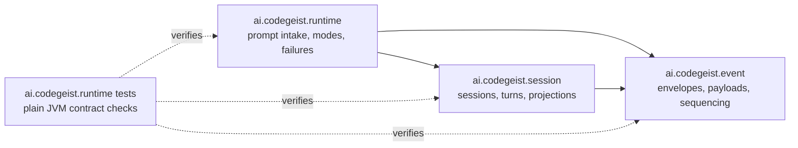
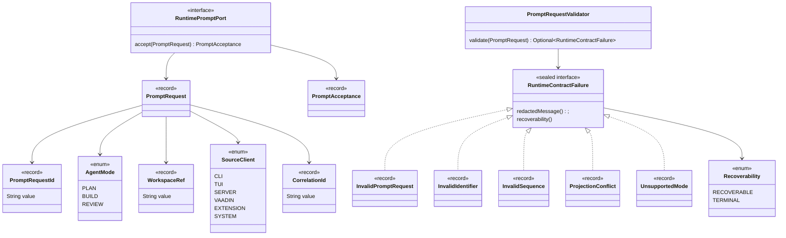
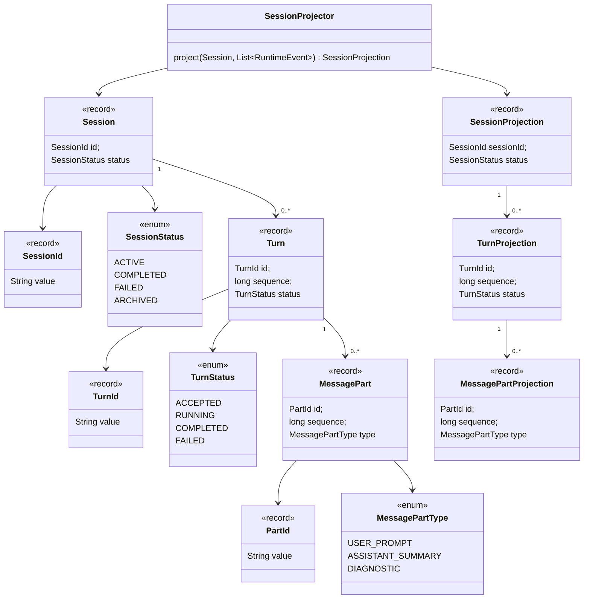
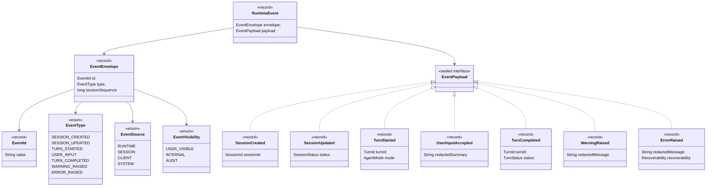
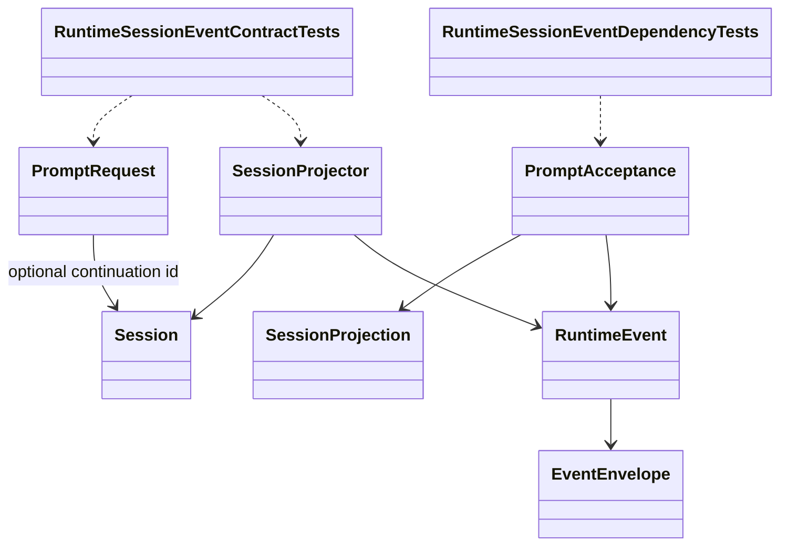

# Runtime Session Event Core Implementation Plan

Planning handoff for `T004_01`: implement the first Java runtime, session, and
event core contracts with plain JVM tests before any CLI, provider, tool,
workspace, storage, or UI behavior exists.

## Source Task

- Task: `docs/tasks/T004_implement-codegeist-opencode-core-application/tasks/T004_01_implement_runtime_session_event_core/task.md`
- Parent: `docs/tasks/T004_implement-codegeist-opencode-core-application/task.md`
- Primary contract: `docs/developer/specification/runtime-session-event-source-generation-contract.md`
- Supporting context: `docs/developer/specification/runtime-session-event-contracts.md`, `docs/developer/specification/java-generation-guidance.md`, `docs/developer/specification/testing-strategy-and-agent-rules.md`, and `docs/developer/architecture/architecture.md`

## Goal

Create the first source-backed Codegeist contracts for prompt intake, sessions,
turns, message parts, runtime events, ordered event envelopes, typed contract
failures, and client-safe session projections.

The implementation should stay inside `app/codegeist/cli`, use Java records,
enums, sealed interfaces, and small boundary interfaces, and avoid Spring context
startup in the new tests.

## Scope

- Add the first `ai.codegeist.runtime`, `ai.codegeist.session`, and
  `ai.codegeist.event` Java packages.
- Add value-object identifiers, enums, records, sealed payload/failure families,
  a minimal prompt acceptance port, and a small projection helper.
- Add plain JVM contract tests that prove the initial public contract and failure
  behavior.
- Update `docs/developer/architecture/architecture.md` during the later solve
  phase after the planned Java packages and tests exist.

## Non-Goals

- No Spring Shell commands, CLI rendering, TUI, server, Vaadin, PF4J, or JBang.
- No Spring AI prompts, provider adapters, live model calls, Agent Utils callback
  registration, or provider streaming.
- No context loading, workspace path validation, file reads, patch/edit behavior,
  shell execution, tools, permissions, storage adapters, event bus, SSE, or
  persistence.
- No Maven module split, build-file changes, native-image checks, network checks,
  or startup-heavy tests.

## Planned Package Diagram

The first source slice has three core packages. `ai.codegeist.runtime` accepts
prompt requests and reports typed failures, `ai.codegeist.session` owns the
session aggregate and client projection, and `ai.codegeist.event` carries ordered
runtime observations. The test package verifies the contracts without starting
Spring.



## Planned Class Catalog

Every planned production and test type for this task is listed here. The class
diagrams below intentionally split the same set into smaller views so Mermaid
renders remain readable in markdown.

| Type | Kind | Responsibility |
| --- | --- | --- |
| `PromptRequestId` | record | Typed identity for one prompt request. |
| `CorrelationId` | record | Optional cross-event correlation value for one request flow. |
| `WorkspaceRef` | record | Minimal workspace boundary value without path validation. |
| `AgentMode` | enum | Stable runtime mode names for `PLAN`, `BUILD`, and reserved `REVIEW`. |
| `SourceClient` | enum | Identifies the client surface that submitted a request. |
| `Recoverability` | enum | Marks failures as recoverable or terminal. |
| `PromptRequest` | record | Captures prompt intake before provider, tool, or storage work starts. |
| `PromptAcceptance` | record | Reports accepted request ids, session/turn ids, events, and projection. |
| `RuntimePromptPort` | interface | Small boundary for accepting a prompt request from later clients. |
| `PromptRequestValidator` | class | Validates prompt request shape and returns typed failures. |
| `RuntimeContractFailure` | sealed interface | Shared contract failure surface with redacted message and recoverability. |
| `InvalidPromptRequest` | record | Failure for invalid prompt text or missing request data. |
| `InvalidIdentifier` | record | Failure for blank or malformed identifier values. |
| `InvalidSequence` | record | Failure for non-positive or non-monotonic sequence values. |
| `ProjectionConflict` | record | Failure for projection inputs that do not belong together. |
| `UnsupportedMode` | record | Failure for a mode value not accepted by a later runtime policy. |
| `SessionId` | record | Typed identity for a session aggregate. |
| `TurnId` | record | Typed identity for a prompt turn. |
| `PartId` | record | Typed identity for an ordered message part. |
| `SessionStatus` | enum | First session lifecycle states. |
| `TurnStatus` | enum | First turn lifecycle states. |
| `MessagePartType` | enum | First message-part categories. |
| `MessagePart` | record | Durable, append-oriented message summary inside a turn. |
| `Turn` | record | Ordered prompt turn with mode, status, message parts, and start time. |
| `Session` | record | Runtime-owned aggregate with status, default mode, turns, and timestamps. |
| `MessagePartProjection` | record | Client-safe message-part read shape. |
| `TurnProjection` | record | Client-safe turn read shape. |
| `SessionProjection` | record | Client-safe session read model with recent runtime events. |
| `SessionProjector` | class | Builds idempotent projections and rejects mismatched session events. |
| `EventId` | record | Stable identity for replay-safe runtime events. |
| `EventType` | enum | First event family names for session, turn, input, warning, and error flow. |
| `EventSource` | enum | Identifies whether an event came from runtime, session, client, or system. |
| `EventVisibility` | enum | Separates user-visible, internal, and audit-oriented events. |
| `EventEnvelope` | record | Ordered metadata for one runtime event. |
| `RuntimeEvent` | record | Couples an event envelope to a typed payload. |
| `EventPayload` | sealed interface | Permits the first runtime event payload records. |
| `SessionCreated` | record | Payload for a newly accepted session. |
| `SessionUpdated` | record | Payload for session status changes. |
| `TurnStarted` | record | Payload for an accepted prompt turn. |
| `UserInputAccepted` | record | Payload for a redacted user prompt summary. |
| `TurnCompleted` | record | Payload for a terminal first-wave turn status. |
| `WarningRaised` | record | Payload for a non-fatal runtime warning. |
| `ErrorRaised` | record | Payload for a recoverable or terminal runtime error. |
| `RuntimeSessionEventContractTests` | test class | Verifies prompt intake, validation, sequencing, and projection contracts. |
| `RuntimeSessionEventDependencyTests` | test class | Verifies core contracts do not expose forbidden framework or deferred types. |

## Planned Runtime Class Diagram



## Planned Session Class Diagram



## Planned Event Class Diagram



## Planned Cross-Package Contract Diagram



## File Map

Production files to add in the solve phase:

```text
app/codegeist/cli/src/main/java/ai/codegeist/runtime/
  AgentMode.java
  CorrelationId.java
  InvalidIdentifier.java
  InvalidPromptRequest.java
  InvalidSequence.java
  ProjectionConflict.java
  PromptAcceptance.java
  PromptRequest.java
  PromptRequestId.java
  PromptRequestValidator.java
  Recoverability.java
  RuntimeContractFailure.java
  RuntimePromptPort.java
  SourceClient.java
  UnsupportedMode.java
  WorkspaceRef.java

app/codegeist/cli/src/main/java/ai/codegeist/session/
  MessagePart.java
  MessagePartProjection.java
  MessagePartType.java
  PartId.java
  Session.java
  SessionId.java
  SessionProjection.java
  SessionProjector.java
  SessionStatus.java
  Turn.java
  TurnId.java
  TurnProjection.java
  TurnStatus.java

app/codegeist/cli/src/main/java/ai/codegeist/event/
  ErrorRaised.java
  EventEnvelope.java
  EventId.java
  EventPayload.java
  EventSource.java
  EventType.java
  EventVisibility.java
  RuntimeEvent.java
  SessionCreated.java
  SessionUpdated.java
  TurnCompleted.java
  TurnStarted.java
  UserInputAccepted.java
  WarningRaised.java
```

Test files to add in the solve phase:

```text
app/codegeist/cli/src/test/java/ai/codegeist/runtime/
  RuntimeSessionEventContractTests.java
  RuntimeSessionEventDependencyTests.java
```

Documentation files to update in the solve phase after source exists:

```text
docs/developer/architecture/architecture.md
docs/tasks/T004_implement-codegeist-opencode-core-application/tasks/T004_01_implement_runtime_session_event_core/task.md
```

No `pom.xml`, `Taskfile.yml`, `application.yaml`, or Spring configuration changes
are planned for this slice.

## Implementation Steps

1. Add `RuntimeSessionEventContractTests` with the first failing method
   `acceptsPromptWithoutFrameworkTypes` and run the method-level Maven selector.
2. Add the smallest runtime, session, and event records/enums needed for that test
   to compile and pass.
3. Add `rejectsBlankPromptWithTypedFailure`, then implement
   `RuntimeContractFailure`, its permitted records, `Recoverability`, and
   `PromptRequestValidator`.
4. Add `appendsTurnsAndPartsInOrder`, then enforce append-oriented, monotonic
   sequence validation in focused constructors or static factories.
5. Add `assignsMonotonicSessionEventSequence`, then enforce positive event
   sequence rules for `EventEnvelope`.
6. Add `projectsEventsIdempotentlyByEventId`, then implement `SessionProjector` to
   deduplicate replayed `EventId` values and reject mismatched sessions with
   `ProjectionConflict`.
7. Add `RuntimeSessionEventDependencyTests` to assert public contract signatures
   in the three new packages do not expose forbidden framework or deferred-surface
   packages.
8. Run targeted tests, then the existing full Maven test command for the CLI
   module.
9. Update `docs/developer/architecture/architecture.md` to move
   `ai.codegeist.runtime`, `ai.codegeist.session`, and `ai.codegeist.event` from
   planned-only to implemented, including their test coverage and non-goals.
10. Update the task solve result with targeted commands, approximate timings,
    startup-sensitive check status, architecture update summary, and next phase.

## TDD Sequence

First failing test:

```bash
cd app/codegeist/cli
mvn --batch-mode --no-transfer-progress -Dtest=RuntimeSessionEventContractTests#acceptsPromptWithoutFrameworkTypes test
```

Expected failure before implementation: the test class or planned production types
do not compile.

Targeted implementation commands for the solve phase:

```bash
cd app/codegeist/cli
mvn --batch-mode --no-transfer-progress -Dtest=RuntimeSessionEventContractTests#acceptsPromptWithoutFrameworkTypes test
mvn --batch-mode --no-transfer-progress -Dtest=RuntimeSessionEventContractTests test
mvn --batch-mode --no-transfer-progress -Dtest=RuntimeSessionEventDependencyTests test
```

Broader affected verification after targeted tests pass:

```bash
cd app/codegeist/cli
mvn --batch-mode --no-transfer-progress test
```

Startup-sensitive posture: the new tests must be plain JVM tests and must not load
Spring. The existing `CodegeistApplicationTests` remains the only Spring context
test in the broad Maven suite.

## Acceptance Criteria

- `RuntimeSessionEventContractTests#acceptsPromptWithoutFrameworkTypes` proves a
  prompt can be accepted through Codegeist-owned contracts without forbidden
  framework or deferred-surface types.
- `RuntimeSessionEventContractTests#rejectsBlankPromptWithTypedFailure` proves
  blank prompt text maps to `InvalidPromptRequest` with a redacted message and
  recoverability metadata.
- `RuntimeSessionEventContractTests#appendsTurnsAndPartsInOrder` proves sessions,
  turns, and message parts are append-oriented and monotonic.
- `RuntimeSessionEventContractTests#assignsMonotonicSessionEventSequence` proves
  event envelopes preserve positive, monotonic session order and optional turn
  order.
- `RuntimeSessionEventContractTests#projectsEventsIdempotentlyByEventId` proves
  replayed event ids do not duplicate client-visible projection events.
- `RuntimeSessionEventDependencyTests#coreContractsDoNotExposeFrameworkTypes`
  proves the three new core packages keep forbidden framework and deferred-surface
  types out of public contract signatures.
- `docs/developer/architecture/architecture.md` accurately describes the newly
  implemented packages and tests after the solve phase.

## Dependencies

- Satisfied: `T003_05` finalized
  `runtime-session-event-source-generation-contract.md`.
- Satisfied: `T003_02` finalized Java generation guidance.
- Satisfied: `T003_03` finalized testing strategy and agent rules.
- Satisfied: current architecture doc confirms only `ai.codegeist.app` exists now,
  so this task owns the first additional Java packages.

## Tradeoffs And Risks

- `WorkspaceRef` is a minimal boundary value because `PromptRequest` needs a typed
  workspace reference. It intentionally performs no path validation or
  repository-specific context loading.
- `RuntimePromptPort` is a small boundary interface so later CLI prompt commands
  can delegate to runtime contracts without owning session mutation.
- `SessionProjector` is the only planned behaviorful class beyond validation. It
  is included because idempotent projection is an acceptance criterion and should
  be tested before storage or event bus work exists.
- The first source slice is intentionally more contract-heavy than service-heavy;
  orchestration, provider streaming, tool mediation, storage, CLI, and TUI behavior
  remain later T004 tasks.

## Open Questions

None.

## Plan Workflow Handoff

- Phase command: `/plan-task t004_01`.
- User context considered: `t004_01`.
- Resolved source task: `docs/tasks/T004_implement-codegeist-opencode-core-application/tasks/T004_01_implement_runtime_session_event_core/task.md`.
- Parent task: `docs/tasks/T004_implement-codegeist-opencode-core-application/task.md`.
- Selected option: sharpen the existing `T004_01` implementation task; no new task
  was needed.
- Duplicate check result: no existing implementation plan file was present under
  `docs/developer/implementation/`, and `T004_01` is already the matching concrete
  implementation slice.
- Discovered hints considered:
  `docs/tasks/hints/java-spring-architecture-planning-guidance.md`,
  `docs/tasks/hints/opencode-solving-guidance.md`, and
  `docs/tasks/hints/opencode-source-solving-guidance.md`.
- Related context files read:
  `docs/developer/specification/runtime-session-event-source-generation-contract.md`,
  `docs/developer/specification/runtime-session-event-contracts.md`,
  `docs/developer/specification/java-generation-guidance.md`,
  `docs/developer/specification/testing-strategy-and-agent-rules.md`,
  `docs/developer/architecture/architecture.md`, `app/codegeist/cli/pom.xml`,
  `CodegeistApplication.java`, and `CodegeistApplicationTests.java`.
- Upstream phase dependency: satisfied by the existing `Status: specified` and the
  specification check result in `T004_01`.
- Result: one implementation-ready plan for the runtime/session/event core.
- Recommended next phase: `/solve-task t004_01`.

## Agent Utils Planning Recheck

- Agent Utils equivalent: `TaskCall`, `BackgroundTask`, and `TodoWriteTool` are
  concept references only.
- Plan decision: keep the existing Codegeist runtime/session/event file map, class
  diagram, TDD sequence, and verification commands unchanged.
- Solve constraint: do not expose Agent Utils task, todo, subagent, or background
  task types through `ai.codegeist.runtime`, `ai.codegeist.session`, or
  `ai.codegeist.event`.
- Result: the plan remains implementation-ready.
