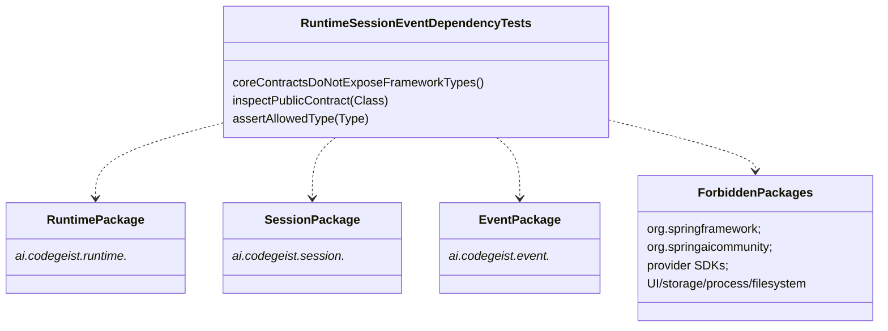

# Runtime Session Event Dependency Boundaries Implementation Plan

Planning handoff for `T004_01_06`: verify the completed runtime, session, and
event core packages keep forbidden framework and deferred-surface types out of
their public contracts.

## Source Task

- Task:
  `docs/tasks/T004_implement-codegeist-opencode-core-application/tasks/T004_01_implement_runtime_session_event_core/tasks/T004_01_06_verify_core_dependency_boundaries.md`
- Parent task:
  `docs/tasks/T004_implement-codegeist-opencode-core-application/tasks/T004_01_implement_runtime_session_event_core/task.md`
- Prior dependencies: solved `T004_01_01` through `T004_01_05`

## Goal

Add dependency-boundary verification for public contracts in `ai.codegeist.runtime`,
`ai.codegeist.session`, and `ai.codegeist.event`, then update current-state
architecture documentation after the first runtime/session/event core source exists.

## Concrete Solution Direction

Create `RuntimeSessionEventDependencyTests` as a plain JVM reflection-based test.
It should inspect public constructors, record components, methods, return types,
parameter types, generic type arguments where practical, implemented interfaces,
and permitted subclasses for the three core packages. It should fail when a public
signature exposes forbidden framework, provider, storage, client, filesystem,
process, terminal, or Agent Utils packages.

## Planned Class Diagram



## Planned Type Details

| Type | Kind | Planned file | Detailed responsibility |
| --- | --- | --- | --- |
| `RuntimeSessionEventDependencyTests` | test class | `app/codegeist/cli/src/test/java/ai/codegeist/runtime/RuntimeSessionEventDependencyTests.java` | Plain JVM test class that verifies the public dependency boundary for runtime, session, and event packages without Spring context startup. |
| `coreContractsDoNotExposeFrameworkTypes` | test method | same file | Scans all public core contract classes from completed `T004_01` slices and fails on forbidden public signature types. |
| `inspectPublicContract` | private helper | same file | Collects public constructors, methods, record components, interfaces, and permitted subclasses for one class. |
| `assertAllowedType` | private helper | same file | Recursively checks class, parameterized, wildcard, array, and optional generic types where practical. |
| `ForbiddenPackages` | private constant/list | same file | Defines blocked package prefixes and deferred surfaces: Spring, Spring AI, Agent Utils, provider SDKs, storage adapters, CLI/TUI/server/UI, Vaadin, PF4J, JBang, filesystem, process, and terminal UI. |

## Spring Usage

This slice should explicitly forbid public exposure of Spring classes rather than
use them. The dependency test itself should use only JUnit Jupiter, AssertJ, Java
reflection, and Java standard library types. It must not use `@SpringBootTest`,
Spring's classpath scanners, ArchUnit, Agent Utils utilities, or provider SDKs.

## Planned Files

Test file to add:

```text
app/codegeist/cli/src/test/java/ai/codegeist/runtime/RuntimeSessionEventDependencyTests.java
```

Documentation and task files to update after solve:

```text
docs/developer/architecture/architecture.md
docs/tasks/T004_implement-codegeist-opencode-core-application/tasks/T004_01_implement_runtime_session_event_core/task.md
docs/tasks/T004_implement-codegeist-opencode-core-application/tasks/T004_01_implement_runtime_session_event_core/tasks/T004_01_06_verify_core_dependency_boundaries.md
```

No production Java files should be added by this slice unless verification exposes
a real boundary bug that must be fixed in existing runtime/session/event types.

## Implementation Steps

1. Add `RuntimeSessionEventDependencyTests#coreContractsDoNotExposeFrameworkTypes`
   as a failing or pending test after `T004_01_01` through `T004_01_05` source
   exists.
2. List the concrete public contract classes from `ai.codegeist.runtime`,
   `ai.codegeist.session`, and `ai.codegeist.event` instead of scanning the whole
   classpath.
3. Add helper logic to inspect record components, public constructors, public
   methods, implemented interfaces, and permitted subclasses.
4. Add forbidden package prefixes and deferred-surface checks.
5. Run the dependency test and fix only real public boundary leaks found in the
   already implemented core contracts.
6. Run `RuntimeSessionEventContractTests`, `RuntimeSessionEventDependencyTests`, and
   the full Maven test suite.
7. Update `docs/developer/architecture/architecture.md` to describe implemented
   runtime/session/event packages, tests, and remaining non-goals.
8. Update the parent `T004_01` task solve status only after all child slices are
   solved and verification passes.

## TDD And Verification Plan

```bash
cd app/codegeist/cli
mvn --batch-mode --no-transfer-progress -Dtest=RuntimeSessionEventDependencyTests#coreContractsDoNotExposeFrameworkTypes test
mvn --batch-mode --no-transfer-progress -Dtest=RuntimeSessionEventContractTests test
mvn --batch-mode --no-transfer-progress -Dtest=RuntimeSessionEventDependencyTests test
mvn --batch-mode --no-transfer-progress test
```

## Acceptance Criteria

- Dependency-boundary test verifies public core contract signatures do not expose
  Spring, Spring AI, Spring Shell, Agent Utils, provider SDK, storage adapter, CLI,
  TUI, HTTP/server, Vaadin, PF4J, JBang, filesystem, process, or terminal UI types.
- The test is individually executable and does not load Spring.
- `docs/developer/architecture/architecture.md` describes the implemented packages
  and tests after source exists.
- Parent `T004_01` is marked solved only after all six child tasks are solved and
  verification passes.

## Dependencies

- Requires all source-producing `T004_01_01` through `T004_01_05` slices to be
  solved first.
- Feeds later T004 tasks by making runtime/session/event contracts safe to depend
  on.

## Tradeoffs And Risks

- Reflection-based checks are narrower than a full architecture testing library but
  avoid new dependencies and keep the first boundary test simple.
- The test should list planned contract classes explicitly so failures are clear;
  later tasks can broaden the scan if needed.

## Open Questions

None.

## Plan Workflow Handoff

- Phase command: `/plan-task T004_01_06` as part of user input to plan all
  subtasks in `T004_01`.
- Selected option: sharpen the existing child task with a child-specific
  implementation plan.
- Duplicate check result: no child-specific plan existed for `T004_01_06`.
- Discovered hints considered: Spring AI Agent Utils phase guidance, Java/Spring
  architecture planning guidance, OpenCode solving guidance, and OpenCode source
  solving guidance.
- Related context files read: parent T004/T004_01 tasks, prior child tasks,
  `runtime-session-event-source-generation-contract.md`, `testing-strategy-and-agent-rules.md`,
  and `architecture.md`.
- Upstream phase dependency: specification is satisfied; solve remains blocked
  until `T004_01_01` through `T004_01_05` are solved.
- Recommended next phase: `/solve-task T004_01_06` after dependencies are solved.
