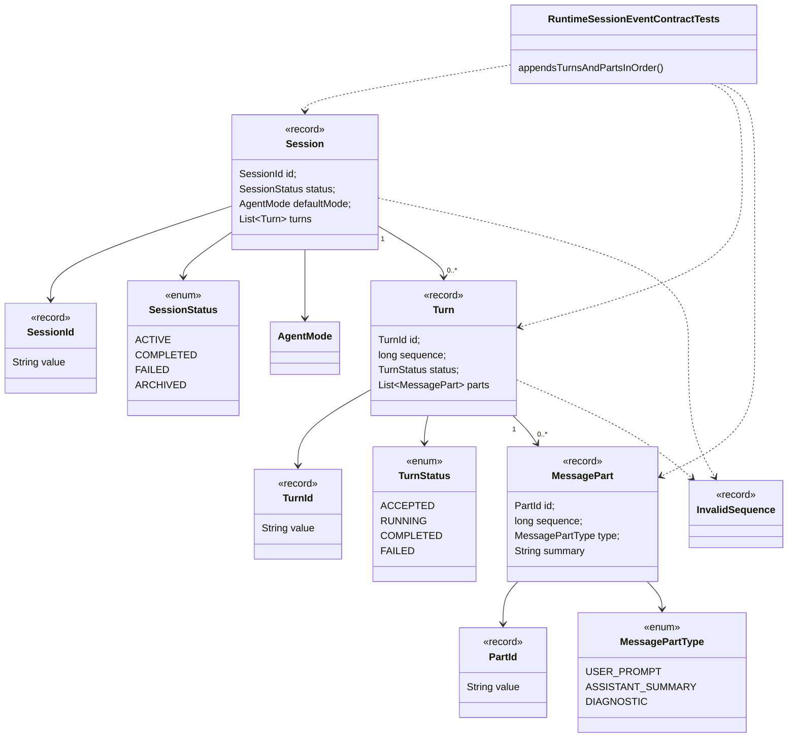

# Session Core Contracts Implementation Plan

Planning handoff for `T004_01_03`: implement the first `ai.codegeist.session`
aggregate contracts after runtime prompt and failure contracts exist.

## Source Task

- Task:
  `docs/tasks/T004_implement-codegeist-opencode-core-application/tasks/T004_01_implement_runtime_session_event_core/tasks/T004_01_03_define_session_core_contracts.md`
- Parent task:
  `docs/tasks/T004_implement-codegeist-opencode-core-application/tasks/T004_01_implement_runtime_session_event_core/task.md`
- Prior dependencies: `T004_01_01` and `T004_01_02`

## Goal

Add append-oriented session, turn, and message-part value contracts that later
runtime, event, projection, CLI, TUI, server, and storage slices can use without
letting client adapters own session mutation.

## Concrete Solution Direction

Create `ai.codegeist.session` with typed identifiers, lifecycle enums, and records
for `Session`, `Turn`, and `MessagePart`. Add a focused plain JVM test that proves
turn and message-part sequences are positive and monotonic, using
`InvalidSequence` from the runtime failure slice for invalid ordering.

## Planned Class Diagram



## Planned Type Details

| Type | Kind | Planned file | Detailed responsibility |
| --- | --- | --- | --- |
| `SessionId` | record | `app/codegeist/cli/src/main/java/ai/codegeist/session/SessionId.java` | Typed identity for one runtime-owned session aggregate. |
| `TurnId` | record | `app/codegeist/cli/src/main/java/ai/codegeist/session/TurnId.java` | Typed identity for a prompt turn inside a session. |
| `PartId` | record | `app/codegeist/cli/src/main/java/ai/codegeist/session/PartId.java` | Typed identity for an ordered message part inside a turn. |
| `SessionStatus` | enum | `app/codegeist/cli/src/main/java/ai/codegeist/session/SessionStatus.java` | First lifecycle states for a session: active, completed, failed, and archived. |
| `TurnStatus` | enum | `app/codegeist/cli/src/main/java/ai/codegeist/session/TurnStatus.java` | First lifecycle states for a turn: accepted, running, completed, and failed. |
| `MessagePartType` | enum | `app/codegeist/cli/src/main/java/ai/codegeist/session/MessagePartType.java` | First message-part categories for user prompts, assistant summaries, and diagnostics. |
| `MessagePart` | record | `app/codegeist/cli/src/main/java/ai/codegeist/session/MessagePart.java` | Append-only message summary with positive sequence, type, and text summary. It should not store provider-native chunks or tool output. |
| `Turn` | record | `app/codegeist/cli/src/main/java/ai/codegeist/session/Turn.java` | Ordered prompt turn with status and message parts. It enforces positive, monotonic message-part ordering. |
| `Session` | record | `app/codegeist/cli/src/main/java/ai/codegeist/session/Session.java` | Runtime-owned session aggregate with status, default mode, and ordered turns. It enforces positive, monotonic turn ordering. |
| `RuntimeSessionEventContractTests` | test class | `app/codegeist/cli/src/test/java/ai/codegeist/runtime/RuntimeSessionEventContractTests.java` | Adds `appendsTurnsAndPartsInOrder` and keeps earlier runtime tests passing. |

## Spring Usage

No Spring Framework, Spring Boot, Spring AI, Spring Shell, or Agent Utils classes
should be used in `ai.codegeist.session` public contracts. Test support remains
plain JUnit Jupiter and AssertJ. Session contracts should use Java standard library
types such as `List` and `Instant` only when needed.

## Planned Files

Production files to add:

```text
app/codegeist/cli/src/main/java/ai/codegeist/session/
  MessagePart.java
  MessagePartType.java
  PartId.java
  Session.java
  SessionId.java
  SessionStatus.java
  Turn.java
  TurnId.java
  TurnStatus.java
```

Existing test file to update:

```text
app/codegeist/cli/src/test/java/ai/codegeist/runtime/RuntimeSessionEventContractTests.java
```

## Implementation Steps

1. Add `RuntimeSessionEventContractTests#appendsTurnsAndPartsInOrder` as the first
   failing test for this slice.
2. Build one session with two ordered turns and one turn with two ordered message
   parts; assert order is preserved.
3. Add assertions that non-positive or non-monotonic sequences fail through the
   runtime failure boundary from `T004_01_02`, preferably `InvalidSequence`.
4. Add identifiers, enums, and records under `ai.codegeist.session`.
5. Keep lists defensively copied or unmodifiable so callers cannot mutate aggregate
   order after construction.
6. Re-run focused and accumulated runtime/session contract tests.
7. Update architecture docs after source exists.

## TDD And Verification Plan

```bash
cd app/codegeist/cli
mvn --batch-mode --no-transfer-progress -Dtest=RuntimeSessionEventContractTests#appendsTurnsAndPartsInOrder test
mvn --batch-mode --no-transfer-progress -Dtest=RuntimeSessionEventContractTests test
```

These commands prove session ordering behavior and preserve earlier prompt and
validation contract tests.

## Acceptance Criteria

- Session, turn, and message-part identifiers and lifecycle enums exist under
  `ai.codegeist.session`.
- Sessions preserve ordered turns and turns preserve ordered message parts.
- Invalid non-positive or non-monotonic sequences use the runtime failure boundary.
- Public session contracts expose no Spring, provider, storage, UI, process, or
  Agent Utils types.

## Dependencies

- Requires `T004_01_01` prompt contracts and `T004_01_02` runtime failures.
- Feeds `T004_01_04` event payloads and `T004_01_05` projections.

## Tradeoffs And Risks

- This slice creates domain records but no session service. Runtime orchestration
  and storage remain later tasks.
- Message parts are summaries only; provider streaming, tool output, and artifact
  references remain deferred.

## Open Questions

None.

## Plan Workflow Handoff

- Phase command: `/plan-task T004_01_03` as part of user input to plan all
  subtasks in `T004_01`.
- Selected option: sharpen the existing child task with a child-specific
  implementation plan.
- Duplicate check result: no child-specific plan existed for `T004_01_03`.
- Discovered hints considered: Spring AI Agent Utils phase guidance, Java/Spring
  architecture planning guidance, OpenCode solving guidance, and OpenCode source
  solving guidance.
- Related context files read: parent T004/T004_01 tasks, prior child tasks,
  `runtime-session-event-source-generation-contract.md`, `testing-strategy-and-agent-rules.md`,
  and `architecture.md`.
- Upstream phase dependency: specification is satisfied; solve remains blocked
  until `T004_01_01` and `T004_01_02` are solved.
- Recommended next phase: `/solve-task T004_01_03` after dependencies are solved.
