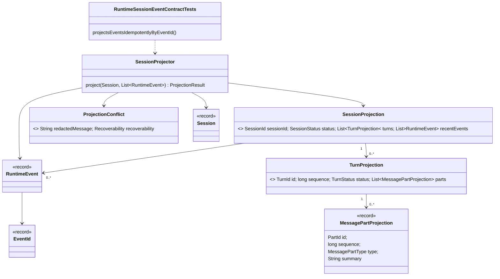

# Session Projection Core Implementation Plan

Planning handoff for `T004_01_05`: implement the first client-safe session
projection contracts after session and event contracts exist.

## Source Task

- Task:
  `docs/tasks/T004_implement-codegeist-opencode-core-application/tasks/T004_01_implement_runtime_session_event_core/tasks/T004_01_05_define_session_projection_core.md`
- Parent task:
  `docs/tasks/T004_implement-codegeist-opencode-core-application/tasks/T004_01_implement_runtime_session_event_core/task.md`
- Prior dependencies: `T004_01_01` through `T004_01_04`

## Goal

Add read-model records and a small projector that lets future clients render
session state from Codegeist-owned session and event contracts without owning state
transitions, storage, SSE, server APIs, CLI/TUI rendering, or persistence.

## Concrete Solution Direction

Create projection records in `ai.codegeist.session`, add `SessionProjector`, and
complete `ProjectionConflict` usage from the runtime failure hierarchy. Add a
focused plain JVM test for idempotent replay by `EventId` and mismatched-session
rejection.

## Planned Class Diagram



## Planned Type Details

| Type | Kind | Planned file | Detailed responsibility |
| --- | --- | --- | --- |
| `MessagePartProjection` | record | `app/codegeist/cli/src/main/java/ai/codegeist/session/MessagePartProjection.java` | Client-safe read shape for one message part, preserving id, sequence, type, and summary without exposing mutable session internals. |
| `TurnProjection` | record | `app/codegeist/cli/src/main/java/ai/codegeist/session/TurnProjection.java` | Client-safe read shape for a turn and projected message parts. |
| `SessionProjection` | record | `app/codegeist/cli/src/main/java/ai/codegeist/session/SessionProjection.java` | Client-safe read model for one session, its projected turns, and recent runtime events. It is not the source of truth. |
| `SessionProjector` | class | `app/codegeist/cli/src/main/java/ai/codegeist/session/SessionProjector.java` | Stateless projector that derives `SessionProjection` from `Session` plus runtime events, deduplicates repeated event ids, and rejects mismatched sessions. |
| `ProjectionConflict` | record | `app/codegeist/cli/src/main/java/ai/codegeist/runtime/ProjectionConflict.java` | Runtime failure for projection inputs that do not belong together. It should use redacted messages and recoverability metadata. |
| `RuntimeSessionEventContractTests` | test class | `app/codegeist/cli/src/test/java/ai/codegeist/runtime/RuntimeSessionEventContractTests.java` | Adds `projectsEventsIdempotentlyByEventId` and keeps the full accumulated contract class passing. |

## Spring Usage

No Spring Framework, Spring Boot, Spring AI, Spring Shell, provider SDK, storage,
server, or Agent Utils classes should be used in projection contracts. Projection
is a plain Java read-model operation and should be tested without Spring context
startup.

## Planned Files

Production files to add or complete:

```text
app/codegeist/cli/src/main/java/ai/codegeist/runtime/ProjectionConflict.java
app/codegeist/cli/src/main/java/ai/codegeist/session/
  MessagePartProjection.java
  SessionProjection.java
  SessionProjector.java
  TurnProjection.java
```

Existing test file to update:

```text
app/codegeist/cli/src/test/java/ai/codegeist/runtime/RuntimeSessionEventContractTests.java
```

## Implementation Steps

1. Add `RuntimeSessionEventContractTests#projectsEventsIdempotentlyByEventId`.
2. Build a session, two runtime events with the same `EventId`, and one event with
   a mismatched session id.
3. Assert projection deduplicates repeated event ids and preserves stable ordering.
4. Assert mismatched-session input returns or throws `ProjectionConflict` through
   the runtime failure boundary, following the result shape selected in solve.
5. Add projection records and `SessionProjector`.
6. Keep projection immutable and read-only; do not mutate `Session`.
7. Run the focused projection test and the full contract test class.
8. Update architecture docs after projection source exists.

## TDD And Verification Plan

```bash
cd app/codegeist/cli
mvn --batch-mode --no-transfer-progress -Dtest=RuntimeSessionEventContractTests#projectsEventsIdempotentlyByEventId test
mvn --batch-mode --no-transfer-progress -Dtest=RuntimeSessionEventContractTests test
```

## Acceptance Criteria

- Projection records and `SessionProjector` exist under `ai.codegeist.session`.
- Replaying the same `EventId` does not duplicate projected recent events.
- Projection rejects mismatched sessions using `ProjectionConflict`.
- Projection remains a read model and owns no session transitions, storage,
  transport, server API, or rendering behavior.

## Dependencies

- Requires runtime prompt contracts, runtime failures, session contracts, and event
  contracts.
- Feeds dependency-boundary verification in `T004_01_06`.

## Tradeoffs And Risks

- The projector is intentionally small and in-memory. Storage-backed continuation,
  event sourcing, compaction, and server projections are deferred.
- The exact conflict return shape may follow the failure-handling convention chosen
  in earlier slices, but it must stay explicit and test-covered.

## Open Questions

None.

## Plan Workflow Handoff

- Phase command: `/plan-task T004_01_05` as part of user input to plan all
  subtasks in `T004_01`.
- Selected option: sharpen the existing child task with a child-specific
  implementation plan.
- Duplicate check result: no child-specific plan existed for `T004_01_05`.
- Discovered hints considered: Spring AI Agent Utils phase guidance, Java/Spring
  architecture planning guidance, OpenCode solving guidance, and OpenCode source
  solving guidance.
- Related context files read: parent T004/T004_01 tasks, prior child tasks,
  `runtime-session-event-source-generation-contract.md`, `testing-strategy-and-agent-rules.md`,
  and `architecture.md`.
- Upstream phase dependency: specification is satisfied; solve remains blocked
  until `T004_01_01` through `T004_01_04` are solved.
- Recommended next phase: `/solve-task T004_01_05` after dependencies are solved.
