# Storage Session Continuation Core Implementation Plan

Planning handoff for `T004_07`: implement in-memory-first storage ports and
session continuation contracts with TDD.

## Source Task

- Task: `docs/tasks/T004_implement-codegeist-opencode-core-application/tasks/T004_07_implement_storage_session_continuation_core.md`
- Parent: `docs/tasks/T004_implement-codegeist-opencode-core-application/task.md`
- Primary contract: `docs/developer/specification/storage-session-continuation-source-generation-contract.md`
- Runtime dependency: `docs/developer/implementation/runtime-session-event-core-implementation.md`

## Goal

Create replaceable storage ports, in-memory adapters, session continuation records,
message and event projections, artifact references, storage health, and typed
storage failures without file-backed persistence.

## Solution Direction

Add `ai.codegeist.storage` contracts and in-memory implementations. Storage stores
bounded records and metadata only; runtime remains responsible for prompt
execution, session lifecycle, event sequencing, provider/tool coordination, and
continuation orchestration.

## Planned Class Diagram

```mermaid
classDiagram
    namespace ai.codegeist.storage {
        class SessionStore { <<interface>> create(SessionRecord) StorageResult~SessionRecord~; find(SessionId) StorageResult~SessionRecord~; list(SessionListQuery) StorageResult~List~SessionSummary~~; updateSummary(SessionSummaryUpdate) StorageResult~SessionSummary~; deleteOrArchive(SessionId) StorageResult~SessionDeletionResult~ }
        class MessageProjectionStore { <<interface>> append(MessagePartRecord) StorageResult~MessagePartRecord~; list(SessionId) StorageResult~List~MessagePartRecord~~ }
        class RuntimeEventProjectionStore { <<interface>> append(RuntimeEventRecord) StorageResult~RuntimeEventRecord~; listAuditEvents(SessionId) StorageResult~List~RuntimeEventRecord~~ }
        class ArtifactReferenceStore { <<interface>> reference(ArtifactReferenceRecord) StorageResult~ArtifactReferenceRecord~; find(OutputRefId) StorageResult~ArtifactReferenceRecord~ }
        class StorageHealthPort { <<interface>> health() StorageHealth }
        class InMemorySessionStore { <<class>> }
        class InMemoryMessageProjectionStore { <<class>> }
        class InMemoryRuntimeEventProjectionStore { <<class>> }
        class InMemoryArtifactReferenceStore { <<class>> }
        class SessionRecord { <<record>> SessionId id; WorkspaceRef workspace; SessionStatus status; String title; long version }
        class SessionSummary { <<record>> SessionId id; String title; SessionStatus status; String boundedLastMessage }
        class SessionListQuery { <<record>> int limit; boolean includeArchived }
        class SessionSummaryUpdate { <<record>> SessionId id; long expectedVersion; String boundedSummary }
        class SessionDeletionResult { <<record>> SessionId id; boolean archived }
        class MessagePartRecord { <<record>> SessionId sessionId; TurnId turnId; PartId partId; long sequence; String boundedSummary }
        class RuntimeEventRecord { <<record>> EventId eventId; SessionId sessionId; long sequence; boolean auditRelevant; String redactedSummary }
        class ArtifactReferenceRecord { <<record>> OutputRefId outputRefId; String producerFamily; String boundedDescription }
        class StorageHealth { <<record>> StorageMode mode; StorageStatus status; String redactedDiagnostics }
        class StorageMode { <<enum>> IN_MEMORY FILE_BACKED DATABASE_BACKED }
        class StorageStatus { <<enum>> AVAILABLE DEGRADED READ_ONLY UNAVAILABLE SKIPPED }
        class StorageResult { <<sealed interface>> }
        class StorageSuccess { <<record>> T value }
        class StorageFailure { <<record>> StorageFailureKind kind; String redactedMessage; Recoverability recoverability }
        class StorageFailureKind { <<enum>> NOT_FOUND DUPLICATE_ID STALE_VERSION REDACTION_DENIED UNAVAILABLE ADAPTER_FAILURE INVALID_QUERY }
    }

    namespace ai.codegeist.storage.tests {
        class StorageSessionContinuationContractTests
        class InMemoryStorageTests
        class StorageBoundaryDependencyTests
    }

    StorageResult <|.. StorageSuccess
    StorageResult <|.. StorageFailure
    SessionStore --> SessionRecord
    MessageProjectionStore --> MessagePartRecord
    RuntimeEventProjectionStore --> RuntimeEventRecord
    ArtifactReferenceStore --> ArtifactReferenceRecord
```



## File Map

Production files to add:

```text
app/codegeist/cli/src/main/java/ai/codegeist/storage/
  ArtifactReferenceRecord.java
  ArtifactReferenceStore.java
  InMemoryArtifactReferenceStore.java
  InMemoryMessageProjectionStore.java
  InMemoryRuntimeEventProjectionStore.java
  InMemorySessionStore.java
  MessagePartRecord.java
  MessageProjectionStore.java
  RuntimeEventProjectionStore.java
  RuntimeEventRecord.java
  SessionDeletionResult.java
  SessionListQuery.java
  SessionRecord.java
  SessionStore.java
  SessionSummary.java
  SessionSummaryUpdate.java
  StorageFailure.java
  StorageFailureKind.java
  StorageHealth.java
  StorageHealthPort.java
  StorageMode.java
  StorageResult.java
  StorageStatus.java
  StorageSuccess.java
```

Test files to add:

```text
app/codegeist/cli/src/test/java/ai/codegeist/storage/
  StorageSessionContinuationContractTests.java
  InMemoryStorageTests.java
  StorageBoundaryDependencyTests.java
```

Documentation to update during solve:

```text
docs/developer/architecture/architecture.md
docs/tasks/T004_implement-codegeist-opencode-core-application/tasks/T004_07_implement_storage_session_continuation_core.md
```

## Implementation Steps

1. Add `StorageSessionContinuationContractTests#continuesExistingInMemorySessionById` as the first failing test.
2. Implement storage result, failure, health, and port contracts.
3. Implement session record, summary, list query, summary update, and delete/archive records.
4. Implement in-memory session store with duplicate-id, not-found, stale-version, and list-limit behavior.
5. Implement bounded message, runtime event, and artifact reference projection stores.
6. Add dependency tests proving storage does not expose filesystem, JSON codec, database, Spring, provider, shell, patch library, or UI types.
7. Update architecture docs and task solve notes.

## TDD And Verification

```bash
cd app/codegeist/cli
mvn --batch-mode --no-transfer-progress -Dtest=StorageSessionContinuationContractTests#continuesExistingInMemorySessionById test
mvn --batch-mode --no-transfer-progress -Dtest=StorageSessionContinuationContractTests,InMemoryStorageTests,StorageBoundaryDependencyTests test
mvn --batch-mode --no-transfer-progress test
```

Documentation-only planning verification:

```bash
git --no-pager diff --check
```

## Dependencies And Deferrals

- Depends on `T004_01` session/event ids and vocabulary; may later reference `OutputRefId` from `T004_04` when solved.
- Defers file-backed persistence, restart survival, databases, migrations, serialization formats, encryption, retention engines, event sourcing, durable audit logs, CLI/TUI browsing, server routes, Vaadin, PF4J, and JBang.

## Acceptance Criteria

- In-memory storage ports create, find, list, update, and delete/archive sessions deterministically.
- Projection stores hold bounded summaries and metadata only.
- Storage failures are typed and redaction-safe.
- Architecture docs describe storage packages, adapters, and tests.

## Open Questions

None. File-backed persistence remains deferred.

## Planning Handoff

- Phase command: `/plan-task T004_07` as part of user input `alle tasks aus t004`.
- Selected option: plan the existing T004 child task instead of creating a duplicate.
- Duplicate check result: `storage-session-continuation-core-implementation.md` did not exist before this pass.
- Discovered hints considered: `java-spring-architecture-planning-guidance.md`, `opencode-solving-guidance.md`, and `opencode-source-solving-guidance.md`.
- Related context files read: T004 parent, T004 child tasks, current architecture doc, storage source-generation contract, storage posture doc, and T004_01 implementation plan.
- Next recommended phase: `/solve-task t004_07` after `T004_01` is solved enough to provide runtime/session/event source types.

## Agent Utils Planning Recheck

- Agent Utils equivalents: `AutoMemoryTools`, `AutoMemoryToolsAdvisor`,
  `TaskRepository`, `DefaultTaskRepository`, and `BackgroundTask`.
- Plan decision: keep Codegeist in-memory session continuation, projections,
  redaction, retention, and storage health independent from Agent Utils memory or
  task repositories.
- Solve constraint: do not use Agent Utils file-backed memory as the session store.
- Test impact: existing in-memory continuation and storage boundary tests remain
  the right verification scope.
- Result: the plan remains implementation-ready after `T004_01` is solved.
