# Tool Permission Workspace Core Implementation Plan

Planning handoff for `T004_04`: implement tool descriptors, permission decisions,
and workspace target validation contracts with TDD.

## Source Task

- Task: `docs/tasks/T004_implement-codegeist-opencode-core-application/tasks/T004_04_implement_tool_permission_workspace_core.md`
- Parent: `docs/tasks/T004_implement-codegeist-opencode-core-application/task.md`
- Primary contract: `docs/developer/specification/tool-permission-workspace-source-generation-contract.md`
- Supporting docs: `docs/developer/specification/tool-permission-workspace-contracts.md`, `docs/developer/specification/java-generation-guidance.md`, and `docs/developer/specification/testing-strategy-and-agent-rules.md`

## Goal

Create policy primitives for safe tool exposure: descriptors, mode gates,
permission requests/decisions, workspace tool-target validation, bounded results,
output references, and typed failures.

## Solution Direction

Add `ai.codegeist.tool`, `ai.codegeist.permission`, and workspace tool-target
extensions that can represent, classify, approve, deny, or skip tool requests
without executing any concrete tool. Later patch/edit, shell, provider mediation,
MCP, PF4J, JBang, and plugin tasks consume these primitives instead of redefining
policy.

## Planned Class Diagram

```mermaid
classDiagram
    namespace ai.codegeist.tool {
        class ToolId { <<record>> String value }
        class ToolRequestId { <<record>> String value }
        class ToolDescriptor { <<record>> ToolId id; ToolSource source; ToolCapability capability; Set~AgentMode~ modes; PermissionNeed permission; WorkspaceNeed workspace; ResultLimit resultLimit; boolean enabled }
        class ToolSource { <<enum>> BUILT_IN SPRING_AI_SIGNAL MCP PF4J JBANG SCRIPT PLUGIN LSP SUBAGENT }
        class ToolCapability { <<enum>> READ_WORKSPACE MUTATE_WORKSPACE PATCH_EDIT SHELL_PROCESS NETWORK PROVIDER_MEDIATED PLUGIN SCRIPT LSP_CODE_INTELLIGENCE SUBAGENT }
        class PermissionNeed { <<enum>> NEVER ASK ALWAYS_REQUIRED DENIED_UNTIL_CLASSIFIED }
        class WorkspaceNeed { <<enum>> NONE READ_TARGET WRITE_TARGET COMMAND_CWD OUTPUT_REF EXTERNAL_DIRECTORY_CANDIDATE }
        class ResultLimit { <<record>> int maxSummaryChars; int maxOutputRefs }
        class ToolDescriptorRegistry { <<interface>> resolve(ToolId) Optional~ToolDescriptor~ }
        class ToolRequest { <<record>> ToolRequestId id; ToolId toolId; SessionId sessionId; TurnId turnId; AgentMode mode; CorrelationId correlationId; RedactedInputSummary input; List~WorkspaceToolTarget~ targets }
        class RedactedInputSummary { <<record>> String summary }
        class ToolResult { <<record>> ToolRequestId requestId; ToolResultStatus status; ToolResultSummary summary; List~OutputRef~ refs; Optional~ToolFailure~ failure }
        class ToolResultStatus { <<enum>> DENIED_BY_MODE DENIED_BY_PERMISSION DENIED_BY_WORKSPACE SKIPPED_DISABLED APPROVAL_REQUIRED STARTED COMPLETED FAILED CANCELLED }
        class ToolResultSummary { <<record>> String redactedSummary; boolean truncated }
        class ToolFailure { <<record>> ToolFailureKind kind; String redactedMessage; Recoverability recoverability }
        class ToolFailureKind { <<enum>> INVALID_DESCRIPTOR MODE_DENIED PERMISSION_DENIED WORKSPACE_DENIED DISABLED_SOURCE UNSUPPORTED_CAPABILITY INPUT_INVALID OUTPUT_OVERFLOW EXECUTOR_UNAVAILABLE CANCELLED UNEXPECTED_FAILURE }
        class OutputRefId { <<record>> String value }
        class OutputKind { <<enum>> TEXT PATCH SHELL_OUTPUT PROVIDER_TRACE ARTIFACT }
        class OutputRef { <<record>> OutputRefId id; OutputKind kind; String redactedDescription; boolean bounded }
    }

    namespace ai.codegeist.permission {
        class PermissionRequestId { <<record>> String value }
        class PermissionDecisionId { <<record>> String value }
        class PermissionRequest { <<record>> PermissionRequestId id; ToolRequestId toolRequestId; ToolId toolId; PermissionScope requestedScope; String redactedReason }
        class PermissionDecision { <<record>> PermissionDecisionId id; PermissionDecisionValue value; PermissionScope scope; SourceClient source; String redactedReason }
        class PermissionDecisionValue { <<enum>> ALLOW DENY ASK CORRECT_AND_RETRY }
        class PermissionScope { <<enum>> ONE_REQUEST ONE_TURN ONE_SESSION WORKSPACE_TARGET DESCRIPTOR_DEFAULT }
        class PermissionPolicy { <<interface>> evaluate(PermissionRequest) PermissionDecision }
        class StaticPermissionPolicy { <<class>> }
    }

    namespace ai.codegeist.workspace {
        class WorkspaceToolTarget { <<record>> WorkspaceToolTargetKind kind; WorkspacePath path; WorkspaceToolVerdict verdict }
        class WorkspaceToolTargetKind { <<enum>> READ_TARGET WRITE_TARGET COMMAND_CWD OUTPUT_REF EXTERNAL_DIRECTORY_CANDIDATE }
        class WorkspaceToolVerdict { <<enum>> ALLOWED DENIED_OUTSIDE_ROOT DENIED_SECRET_LIKE DENIED_GENERATED DENIED_IGNORED DENIED_SYMLINK_ESCAPE APPROVAL_CANDIDATE }
        class WorkspaceToolPolicy { <<interface>> validate(WorkspaceToolTarget) WorkspaceToolTarget }
    }

    namespace ai.codegeist.tool.tests {
        class ToolPermissionWorkspaceContractTests
        class PermissionPolicyTests
        class WorkspaceToolPolicyTests
        class ToolBoundaryDependencyTests
    }

    ToolRequest --> ToolDescriptor
    ToolRequest --> WorkspaceToolTarget
    PermissionRequest --> ToolRequestId
    PermissionPolicy --> PermissionDecision
    ToolResult --> OutputRef
    ToolResult --> ToolFailure
```



## File Map

Production files to add:

```text
app/codegeist/cli/src/main/java/ai/codegeist/tool/
  OutputKind.java
  OutputRef.java
  OutputRefId.java
  PermissionNeed.java
  RedactedInputSummary.java
  ResultLimit.java
  ToolCapability.java
  ToolDescriptor.java
  ToolDescriptorRegistry.java
  ToolFailure.java
  ToolFailureKind.java
  ToolId.java
  ToolRequest.java
  ToolRequestId.java
  ToolResult.java
  ToolResultStatus.java
  ToolResultSummary.java
  ToolSource.java
  WorkspaceNeed.java

app/codegeist/cli/src/main/java/ai/codegeist/permission/
  PermissionDecision.java
  PermissionDecisionId.java
  PermissionDecisionValue.java
  PermissionPolicy.java
  PermissionRequest.java
  PermissionRequestId.java
  PermissionScope.java
  StaticPermissionPolicy.java

app/codegeist/cli/src/main/java/ai/codegeist/workspace/
  WorkspaceToolPolicy.java
  WorkspaceToolTarget.java
  WorkspaceToolTargetKind.java
  WorkspaceToolVerdict.java
```

Test files to add:

```text
app/codegeist/cli/src/test/java/ai/codegeist/tool/
  ToolPermissionWorkspaceContractTests.java
  ToolBoundaryDependencyTests.java
app/codegeist/cli/src/test/java/ai/codegeist/permission/
  PermissionPolicyTests.java
app/codegeist/cli/src/test/java/ai/codegeist/workspace/
  WorkspaceToolPolicyTests.java
```

Documentation to update during solve:

```text
docs/developer/architecture/architecture.md
docs/tasks/T004_implement-codegeist-opencode-core-application/tasks/T004_04_implement_tool_permission_workspace_core.md
```

## Implementation Steps

1. Add `ToolPermissionWorkspaceContractTests#deniesBuildToolBeforePermissionWhenDescriptorRequiresApproval` as the first failing test.
2. Implement tool descriptor, request, result, failure, output-ref, and limit records.
3. Implement permission request/decision/scope records and `StaticPermissionPolicy` for deterministic allow/deny/ask fixtures.
4. Implement workspace tool-target records and verdict mapping over the existing workspace path boundary from `T004_02` when available.
5. Add tests for mode denial before permission, permission approval not bypassing workspace denial, disabled descriptors, and bounded output summaries.
6. Add dependency tests proving tool/permission/workspace contracts do not expose provider SDK, Spring AI, Spring Shell, patch, shell executor, storage, or UI types.
7. Update architecture docs and task solve notes.

## TDD And Verification

First failing test:

```bash
cd app/codegeist/cli
mvn --batch-mode --no-transfer-progress -Dtest=ToolPermissionWorkspaceContractTests#deniesBuildToolBeforePermissionWhenDescriptorRequiresApproval test
```

Additional targeted solve checks:

```bash
cd app/codegeist/cli
mvn --batch-mode --no-transfer-progress -Dtest=ToolPermissionWorkspaceContractTests,PermissionPolicyTests,WorkspaceToolPolicyTests,ToolBoundaryDependencyTests test
mvn --batch-mode --no-transfer-progress test
```

Documentation-only planning verification:

```bash
git --no-pager diff --check
```

## Dependencies And Deferrals

- Depends on `T004_01` for runtime/session/event ids and `T004_02` for workspace path primitives where available.
- Defers all concrete tool execution, shell execution, patch application, provider tool callbacks, approval UI, storage, MCP, PF4J, JBang, scripts, plugins, LSP, subagents, and TUI/server/Vaadin surfaces.

## Acceptance Criteria

- Tool descriptors and requests can be represented without side effects.
- Mode, permission, and workspace denials remain distinct and typed.
- Permission approval cannot override deterministic workspace or descriptor denials.
- Bounded result and output-ref contracts exist for later patch/edit and shell tasks.

## Open Questions

None. The solve phase may adjust package imports to match the final `T004_01` and `T004_02` type names.

## Planning Handoff

- Phase command: `/plan-task T004_04` as part of user input `alle tasks aus t004`.
- Selected option: plan the existing T004 child task instead of creating a duplicate.
- Duplicate check result: `tool-permission-workspace-core-implementation.md` did not exist before this pass.
- Discovered hints considered: `java-spring-architecture-planning-guidance.md`, `opencode-solving-guidance.md`, and `opencode-source-solving-guidance.md`.
- Related context files read: T004 parent, T004 child tasks, current architecture doc, tool/permission/workspace source-generation contract, and dependent T004 implementation plans.
- Next recommended phase: `/solve-task t004_04` after `T004_01` and preferably `T004_02` have provided runtime and workspace primitives.

## Agent Utils Planning Recheck

- Agent Utils equivalents: the Agent Utils tool catalog and `AskUserQuestionTool`
  are adapter or concept candidates, not the Codegeist permission engine.
- Plan decision: keep `ai.codegeist.tool`, `ai.codegeist.permission`, and
  `ai.codegeist.workspace` as the public contract. Add an Agent Utils adapter only
  later if a concrete solve step needs typed result mapping from a utility.
- Target-file impact: no raw Agent Utils tool objects are planned as provider
  callbacks in this task.
- Test impact: existing policy and workspace tests must prove Codegeist mode,
  permission, descriptor, workspace, bounded-output, and typed-failure behavior.
- Result: the plan remains implementation-ready after runtime/workspace
  dependencies are available.
