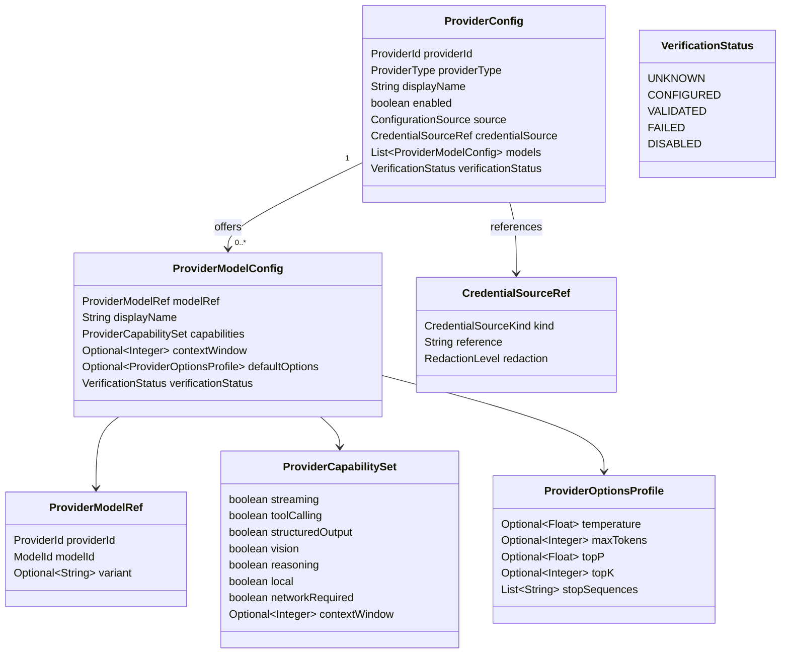
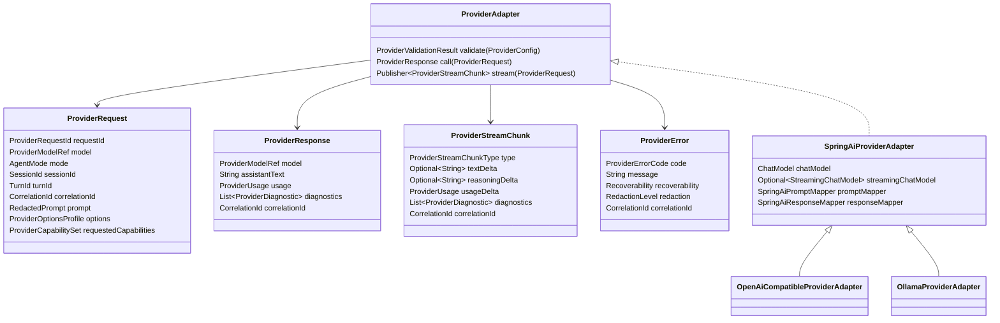
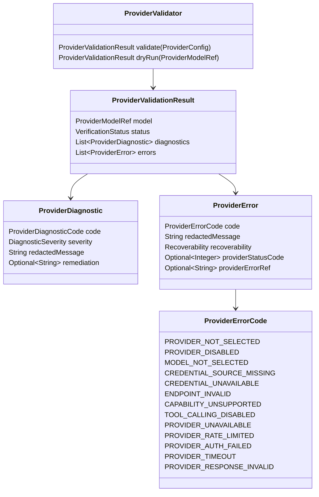
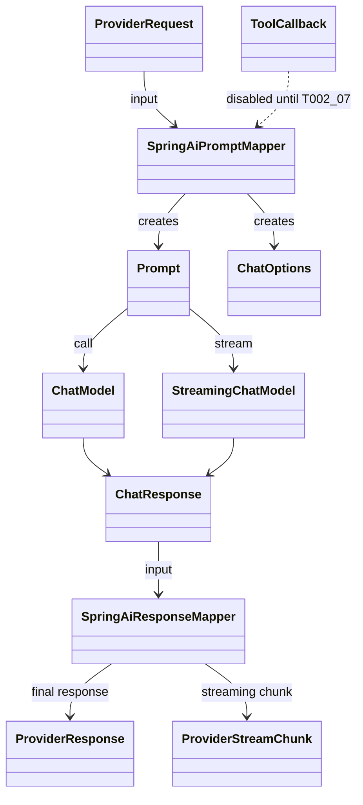
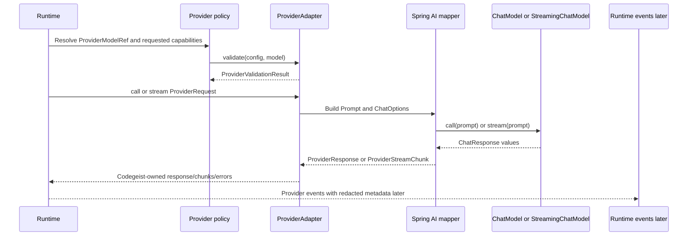

# Provider Configuration Contracts

Blueprint for future Codegeist provider configuration, validation, and Spring AI
adapter boundaries.

## Scope

This document specifies planned provider contracts only. It does not describe
implemented Java source, Spring beans, provider starters, credentials, live model
calls, tool execution, or tests.

The first implementation wave should support:

- OpenAI-compatible/OpenAI providers for hosted and configurable-base-url use.
- Ollama for local/offline use and safer non-cloud validation.

The provider boundary must still remain generic enough for every Spring
AI-supported provider to become a later adapter without changing Runtime, Session,
Event, CLI, Tool, Permission, or Workspace contracts.

## Evidence

### OpenCode Feature Evidence

OpenCode is a behavior reference, not an implementation blueprint.

| Source | Relevant lesson for Codegeist |
| --- | --- |
| `docs/third-party/opencode/source/packages/opencode/src/v2/model.ts` | Models use typed provider/model references, endpoint families, capabilities, options, variants, status, cost, and limits. Codegeist should keep equivalent concepts behind its own provider contracts. |
| `docs/third-party/opencode/source/packages/opencode/src/config/provider.ts` | Provider config includes env keys, API/base URL options, model metadata, modalities, reasoning, tool-call flags, cost, limits, headers, and variants. Codegeist should separate credential references from raw secrets and classify capability metadata explicitly. |
| `docs/third-party/opencode/source/packages/opencode/src/provider/provider.ts` | OpenCode loads many provider SDKs and applies provider-specific behavior. Codegeist should not copy that SDK matrix directly; Spring AI is the integration layer and Codegeist owns policy. |
| `docs/third-party/opencode/source/packages/opencode/src/server/routes/instance/httpapi/handlers/provider.ts` | Provider listing and authorization are runtime/server-visible concerns. Codegeist should expose provider status through typed provider diagnostics later, not through raw SDK exceptions. |
| `docs/third-party/opencode/source/packages/opencode/src/v2/session-event.ts` | Model switches, provider-backed tool metadata, text deltas, reasoning deltas, step failures, and retry errors are event-shaped. Codegeist should map provider output and failures into typed runtime events without provider SDK payload leakage. |

### Spring AI Evidence

Spring AI is the adapter-side counterpart. The Codegeist runtime should not expose
these concrete Spring AI types directly.

| Spring AI concept | Adapter-side role | Codegeist boundary rule |
| --- | --- | --- |
| `ChatModel` | Synchronous prompt-to-`ChatResponse` call. | Used inside provider adapters only. Runtime calls `ProviderAdapter`. |
| `StreamingChatModel` | Reactive streaming from `Prompt` to `Flux<ChatResponse>`. | Stream chunks are converted into Codegeist provider stream chunks/events. |
| `Prompt` | Spring AI request wrapper with messages and optional options. | Built inside the adapter from Codegeist request data. |
| `ChatOptions` | Portable model options such as model, max tokens, temperature, top-p/top-k, and stop sequences. | Codegeist owns option policy and translates safe options at the adapter edge. |
| `ChatResponse` | Spring AI response with generations and metadata. | Converted to `ProviderResponse` or `ProviderStreamChunk` before leaving the adapter. |
| Provider `spring.ai.*` properties | Spring Boot configuration source for provider defaults. | Bound later into Codegeist-owned provider config records or adapter properties. |
| `ToolCallback` | Spring AI tool-calling hook. | Disabled or externally mediated until `T002_07` defines tool, permission, and workspace contracts. |
| `internal-tool-execution-enabled` | Provider option controlling whether Spring AI executes tools internally. | Must be false or policy-controlled until Codegeist tool execution exists. |

Spring AI documents OpenAI-compatible configuration through OpenAI properties such
as `spring.ai.openai.api-key`, `spring.ai.openai.base-url`, and
`spring.ai.openai.chat.options.model`. It also documents Ollama through
`spring.ai.ollama.base-url` and `spring.ai.ollama.chat.options.model`, with
`http://localhost:11434` as the usual local base URL. Ollama can also be reached
through an OpenAI-compatible endpoint, but Codegeist should still represent it as
a distinct local/offline provider type when useful for capability policy.

## Ownership Rules

- Runtime selects provider/model through Codegeist provider policy.
- Provider adapters invoke Spring AI and translate Spring AI request/response
  types at the boundary.
- Session and Event contracts store provider/model references, redacted summaries,
  typed errors, and correlation ids, not Spring AI objects or provider SDK payloads.
- CLI may request provider/model overrides later, but provider selection rules live
  in provider policy.
- Context loading and workspace reads are upstream runtime concerns. Provider
  configuration consumes request/context metadata; it does not choose context
  profiles, read workspace files, or ingest Graphify/Repomix artifacts.
- Tool-calling remains disabled or externally mediated until `T002_07` defines
  tool descriptors, permission decisions, workspace validation, and tool result
  contracts.

## Provider Configuration Model



The future implementation should keep raw secrets outside `ProviderConfig`.
`CredentialSourceRef` names a source such as an environment variable, local secret
store reference, or later user profile key. It must never hold the credential
value itself.

## Adapter Boundary Model



Runtime depends on `ProviderAdapter`, `ProviderRequest`, `ProviderResponse`,
`ProviderStreamChunk`, and `ProviderError`. Only adapter implementations depend on
Spring AI types.

## Validation And Error Model



Validation should be useful without network calls. It can prove that provider id,
model id, configuration source, endpoint shape, credential-source references, and
declared capabilities are coherent. A later explicit live smoke test can be added
only when a safe provider setup exists.

## Spring AI Mapping



Mapping rules:

- `ProviderRequest.prompt` becomes Spring AI messages inside `Prompt`.
- `ProviderOptionsProfile` becomes `ChatOptions` only for options allowed by
  Codegeist policy.
- Provider-specific Spring AI options stay inside adapter implementations.
- `ChatResponse` generations and metadata are converted into Codegeist response,
  stream chunk, usage, and diagnostic objects.
- Reasoning metadata can become diagnostics or reasoning chunks only when display
  and storage policy allow it.
- Tool callbacks are not registered by default. If Spring AI exposes model tool
  calls, Codegeist must parse or proxy them through future tool/permission
  contracts instead of allowing internal execution by the model adapter.

## Provider Call Sequence



This sequence is a future contract. It does not imply that Runtime, events,
provider adapters, or Spring AI provider starters exist now.

## Provider Support Matrix

| Provider family | First wave | Spring AI posture | Codegeist adapter posture |
| --- | --- | --- | --- |
| OpenAI-compatible/OpenAI | Yes | Uses OpenAI chat properties such as API key, base URL, and chat model options. | First hosted/configurable-base-url path. Must support redacted credential references and typed auth/endpoint errors. |
| Ollama | Yes | Uses Ollama base URL and chat model options, commonly local at `http://localhost:11434`. Can also be reached through OpenAI-compatible APIs. | First local/offline path. Should not require a cloud credential and should classify local/offline and network posture explicitly. |
| Anthropic | Later | Supported by Spring AI chat model APIs. | Later adapter behind the same port; important for coding workflows but not first wave. |
| Amazon Bedrock | Later | Supported through Bedrock chat/embedding model APIs. | Later enterprise/cloud adapter; native and credential posture require separate verification. |
| Google Vertex AI / Google GenAI | Later | Supported by Spring AI chat/embedding APIs. | Later cloud adapter behind the same capability contract. |
| Mistral AI | Later | Supported for chat, embeddings, and moderation. | Later adapter; useful for structured output and moderation capability checks. |
| Groq, DeepSeek, Hugging Face, OCI GenAI, QianFan, ZhipuAI, MiniMax, Moonshot, Perplexity, Docker Model Runner, NVIDIA/OpenAI-compatible | Later | Documented in Spring AI reference or reachable through supported provider APIs. | Later adapters or OpenAI-compatible profiles. Must not require runtime/session contract changes. |

The extension point is the adapter contract plus provider descriptors. Adding a
later provider should add or configure an adapter and capability descriptor, not
change runtime request, session, event, CLI, or tool/permission contracts.

## First-Wave Provider Details

### OpenAI-Compatible/OpenAI

Required future config fields:

- `providerId`, default candidate `openai` or a project-specific id for an
  OpenAI-compatible endpoint.
- `providerType`, candidate `OPENAI_COMPATIBLE`.
- `baseUrl`, optional for OpenAI and required for non-default compatible endpoints.
- `credentialSource`, usually an environment variable or later secret reference.
- `modelId`, such as a configured model string rather than a hard-coded default.
- Capability metadata for streaming, structured output, tool calling, reasoning,
  vision, context window, and network requirement.

Validation should catch missing model ids, missing credential-source references,
invalid base URL shape, disabled provider state, unsupported requested capability,
and accidental internal tool execution.

### Ollama

Required future config fields:

- `providerId`, default candidate `ollama`.
- `providerType`, candidate `OLLAMA`.
- `baseUrl`, default candidate `http://localhost:11434` when the user opts into a
  local default.
- `credentialSource`, usually absent or marked `NONE` unless a deployment adds one.
- `modelId`, such as `mistral`, `llama3.2`, `qwen3`, or another installed local
  model selected by configuration.
- Capability metadata for local/offline use, streaming, structured output,
  reasoning, tool calling, context window, and network requirement.

Validation should distinguish configuration validity from model availability. A
no-network documentation task can define a local dry-run contract, but the later
implementation should not assume a model is installed unless a safe local smoke
test explicitly checks it.

## Future File Map

These are illustrative implementation targets only and should not be created until
a later Java task requires them.

```text
app/codegeist/cli/src/main/java/ai/codegeist/provider/ProviderId.java
app/codegeist/cli/src/main/java/ai/codegeist/provider/ModelId.java
app/codegeist/cli/src/main/java/ai/codegeist/provider/ProviderType.java
app/codegeist/cli/src/main/java/ai/codegeist/provider/ProviderModelRef.java
app/codegeist/cli/src/main/java/ai/codegeist/provider/ProviderCapability.java
app/codegeist/cli/src/main/java/ai/codegeist/provider/ProviderCapabilitySet.java
app/codegeist/cli/src/main/java/ai/codegeist/provider/ProviderConfig.java
app/codegeist/cli/src/main/java/ai/codegeist/provider/ProviderModelConfig.java
app/codegeist/cli/src/main/java/ai/codegeist/provider/CredentialSourceRef.java
app/codegeist/cli/src/main/java/ai/codegeist/provider/ProviderValidationResult.java
app/codegeist/cli/src/main/java/ai/codegeist/provider/ProviderDiagnostic.java
app/codegeist/cli/src/main/java/ai/codegeist/provider/ProviderError.java
app/codegeist/cli/src/main/java/ai/codegeist/provider/ProviderAdapter.java
app/codegeist/cli/src/main/java/ai/codegeist/provider/springai/SpringAiProviderAdapter.java
app/codegeist/cli/src/main/java/ai/codegeist/provider/springai/OpenAiCompatibleProviderAdapter.java
app/codegeist/cli/src/main/java/ai/codegeist/provider/springai/OllamaProviderAdapter.java
app/codegeist/cli/src/test/java/ai/codegeist/provider/ProviderConfigBindingTests.java
app/codegeist/cli/src/test/java/ai/codegeist/provider/ProviderValidationTests.java
app/codegeist/cli/src/test/java/ai/codegeist/provider/ProviderAdapterContractTests.java
```

## Illustrative Java Sketches

These snippets are examples only. They are not implemented source.

```java
record ProviderId(String value) {}
record ModelId(String value) {}

record ProviderModelRef(
    ProviderId providerId,
    ModelId modelId,
    Optional<String> variant
) {}

enum ProviderType {
    OPENAI_COMPATIBLE,
    OLLAMA,
    SPRING_AI_SUPPORTED
}
```

```java
record ProviderConfig(
    ProviderId providerId,
    ProviderType providerType,
    String displayName,
    boolean enabled,
    ConfigurationSource source,
    Optional<CredentialSourceRef> credentialSource,
    List<ProviderModelConfig> models,
    VerificationStatus verificationStatus
) {}

record ProviderModelConfig(
    ProviderModelRef modelRef,
    String displayName,
    ProviderCapabilitySet capabilities,
    Optional<Integer> contextWindow,
    Optional<ProviderOptionsProfile> defaultOptions,
    VerificationStatus verificationStatus
) {}
```

```java
interface ProviderAdapter {
    ProviderValidationResult validate(ProviderConfig config);
    ProviderResponse call(ProviderRequest request);
    Flow.Publisher<ProviderStreamChunk> stream(ProviderRequest request);
}
```

The exact Java reactive type is a later implementation decision. The contract only
requires that streaming output be represented as Codegeist-owned chunks before it
reaches Runtime, Session, or Event code.

## Future Test Handoff

No tests are created by this documentation task. Later implementation tasks should
prefer deterministic contract tests before live provider smoke tests.

| Test area | What to prove | Network needed |
| --- | --- | --- |
| Config binding | OpenAI-compatible and Ollama config records bind required ids, model ids, base URLs, and credential-source references. | No |
| Missing credentials | Missing credential references produce typed `CREDENTIAL_SOURCE_MISSING` or `CREDENTIAL_UNAVAILABLE` errors without printing secrets. | No |
| Capability classification | First-wave providers classify streaming, tool calling, structured output, local/offline, and network-required posture. | No |
| Type isolation | Runtime-facing provider contracts do not expose Spring AI classes. | No |
| Validation and dry-run | Validation reports missing provider/model, invalid endpoint, disabled provider, and unsupported capability cases. | No |
| Streaming fallback | A non-streaming or unavailable streaming path reports typed fallback or unsupported-capability diagnostics. | No |
| Tool execution posture | Spring AI internal tool execution remains disabled or externally mediated until tool/permission contracts exist. | No |
| Adapter contract | OpenAI-compatible and Ollama adapters satisfy the same `ProviderAdapter` contract. | Prefer no; live smoke later |
| Local Ollama smoke | Optional explicit check that a configured local model can answer a minimal prompt. | Local only, explicit opt-in |
| Hosted OpenAI-compatible smoke | Optional explicit check that a configured hosted endpoint can answer a minimal prompt. | Yes, explicit opt-in |

## Later Implementation Rules

- Implement OpenAI-compatible/OpenAI and Ollama first, but do not hard-code either
  into Runtime, Session, Event, CLI, Tool, Permission, or Workspace contracts.
- Add provider starters only in a later implementation task that also updates
  tests and `docs/developer/architecture.md`.
- Prefer offline validation tests before any live provider call.
- Treat model listing as later unless a concrete workflow requires it.
- Keep all credential values out of logs, events, diagnostics, task docs, and test
  fixtures.
- Do not enable Spring AI internal tool execution until `T002_07` is solved and a
  later implementation task wires Codegeist tool/permission mediation.
