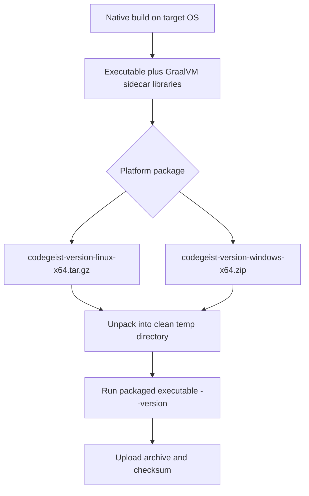
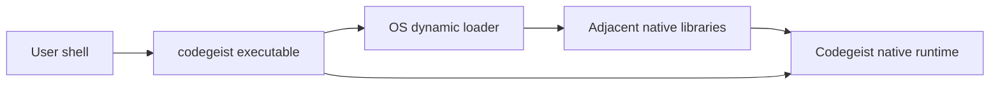

# Native Distribution Packaging

Codegeist distributes GraalVM native builds as platform archives, not as true
single executable files.

## Decision

Use one downloadable archive per platform and architecture:

| Platform | Release artifact | Runtime layout inside artifact |
| --- | --- | --- |
| Linux x64 | `codegeist-<version>-linux-x64.tar.gz` | `codegeist` plus required `.so` libraries in one directory. |
| Windows x64 | `codegeist-<version>-windows-x64.zip` | `codegeist.exe` plus required `.dll` libraries in one directory. |
| macOS x64 | `codegeist-<version>-macos-x64.tar.gz` | Future native binary plus required dynamic libraries in one directory. |
| macOS arm64 | `codegeist-<version>-macos-aarch64.tar.gz` | Future native binary plus required dynamic libraries in one directory. |

The archive is the single download artifact. The extracted directory is the runtime
unit. Users should run the executable from inside that extracted directory so the
operating-system loader can find the adjacent native libraries.

Do not make a self-extracting launcher the default distribution format. The first
CLI startup must stay fast, and runtime extraction can add avoidable latency,
filesystem variance, and antivirus overhead before the GraalVM executable starts.

## Why This Exists

GraalVM Native Image compiles Java bytecode and reachable Java framework code into
a native executable, but the build can also produce runtime-required native
libraries. This is normal Native Image output. GraalVM's build-output
documentation states that Native Image build artifacts may include additional
libraries, and that runtime-needed libraries must be copied and distributed with
the native binary.

For Codegeist, the current Spring Boot, Spring Shell, Spring AI Agent Utils,
Flexmark, Spring Beans, Jakarta EL, SnakeYAML, and JDK feature set makes parts of
`java.desktop`, `java.beans`, JNI-compatible support, and JDK native shims
reachable. Those features are not all emitted as bytes inside the main executable.
They appear as adjacent dynamic libraries.

The practical result is:

- A platform archive can be a single download.
- The runtime is not a single file.
- The executable and sidecar libraries must stay together.
- Startup remains fast because nothing is extracted at process start.

## Current Native Build Outputs

Linux native compile currently produces these runtime-relevant files under
`app/codegeist/cli/target/`:

```text
codegeist
libawt.so
libawt_headless.so
libawt_xawt.so
libjava.so
libjvm.so
libmanagement_ext.so
```

Windows native compile currently produces these runtime-relevant files under the
Windows VM path `C:\codegeist\app\codegeist\cli\target\`:

```text
codegeist.exe
awt.dll
java.dll
jvm.dll
management_ext.dll
```

The exact sidecar set is controlled by the GraalVM version, JDK modules reachable
from the application, and platform toolchain behavior. Packaging scripts should
collect the files reported by the native build or match the known sidecar patterns
for the current platform, then smoke the unpacked archive.

## Distribution Model



## Runtime Loading Model



The executable is the visible command. The sidecar libraries are implementation
files in the same extracted directory. They are not user commands.

## Why There Is No True Single Executable

### Native Image Is Not A C++ Source Generator

GraalVM Native Image does not turn Codegeist into a set of C++ source files that
can be rebuilt with MSBuild or GCC into an arbitrary final layout. The Native Image
builder performs static analysis, compiles reachable Java methods, builds an image
heap, links native runtime support, and writes the artifacts it needs for that
platform.

There is no supported Codegeist workflow like this:

```text
Java bytecode -> generated C++ source -> .obj files -> one custom MSBuild .exe
```

The real workflow is closer to this:

```text
Java bytecode + framework metadata + GraalVM runtime + JDK native support
  -> native-image
  -> executable plus any runtime-required sidecar libraries
```

### Dynamic Libraries Are Not Static Libraries

On Windows, a `.dll` is a runtime-loaded dynamic library. A companion `.lib` file,
when present for a DLL, is usually an import library. It tells the linker which
symbols will be loaded from the DLL at runtime. It is not the same as a static
`.lib` that contains all compiled code.

That distinction matters:

```text
app.exe + static .lib       -> code can be copied into app.exe at link time
app.exe + import .lib + dll -> app.exe still needs the dll at runtime
```

GraalVM's `--shared` mode creates a native shared library for C/C++ interop. It
does not create a static Windows library that can be fully absorbed into a custom
single executable. A C/C++ launcher linked against that shared library would still
need the GraalVM shared library and any other runtime-required sidecars.

### Static Native Image Is A Linux-Specific Path

GraalVM documents static and mostly-static native executables for Linux x64 with a
musl toolchain, for example `--static --libc=musl` or `--static-nolibc`. That is a
different deployment model from the Windows MSVC native build used by Codegeist.

Static Linux builds are not the current Codegeist release baseline because:

- They do not solve Windows packaging.
- They require a separate musl-based Linux toolchain path.
- They need fresh compatibility validation with Spring Boot, Spring Shell,
  GraalVM, JDK sidecars, and Codegeist's dependency graph.
- The current local smoke suite has already proven the dynamic sidecar layout on
  Linux and Windows.

Treat static Linux experimentation as a future optimization task, not as the
default cross-platform release contract.

### JDK Modules Pull In Native Runtime Support

Codegeist does not use AWT as a UI toolkit, but the dependency graph still reaches
`java.desktop` and related native support.

Observed examples from dependency analysis:

- `flexmark-util-html` and `flexmark-util-misc` reference `java.awt.Color`,
  `java.awt.Font`, `java.awt.Image`, `java.awt.Toolkit`, and `javax.swing` types.
- Spring, Jakarta EL, and SnakeYAML reference `java.beans` types such as
  `BeanInfo`, `Introspector`, `PropertyDescriptor`, and `PropertyEditor`.
- `java.beans` belongs to the JDK `java.desktop` module.

The generated `awt` libraries are therefore a consequence of reachable JDK module
support, not evidence that Codegeist intentionally implements a graphical UI.

### A Wrapper Would Not Preserve First-Run Startup

A self-extracting wrapper can make the visible artifact look like one `.exe`, but
it does not remove the runtime sidecars. It embeds them as resources and writes
them to disk before launching the real executable.

That model adds first-run work before the GraalVM binary starts:

```text
wrapper.exe
  -> create temp/cache directory
  -> write codegeist-bin.exe and sidecar libraries
  -> maybe wait on antivirus scanning
  -> launch codegeist-bin.exe
```

For Codegeist, first command latency matters. The default package should avoid any
runtime extraction step. Archives move extraction to install/download time, not to
every first command invocation on a fresh machine.

## Why ZIP And tar.gz

Use platform-native archive conventions:

- Windows: `.zip`, because Explorer and PowerShell can handle it without extra
  tools and executable permissions are not modeled the same way as Linux.
- Linux and macOS: `.tar.gz`, because it preserves executable bits and is standard
  for command-line binary distributions.

Do not use `.zip` as the primary Linux artifact unless a later packaging task adds
explicit permission restoration and smoke coverage for the unpacked binary.

## Linux Package Shape

Planned Linux x64 package:

```text
codegeist-<version>-linux-x64.tar.gz
└── codegeist-<version>-linux-x64/
    ├── codegeist
    ├── libawt.so
    ├── libawt_headless.so
    ├── libawt_xawt.so
    ├── libjava.so
    ├── libjvm.so
    └── libmanagement_ext.so
```

Linux smoke should unpack the tarball into a clean temporary directory and run:

```bash
./codegeist --version
```

The smoke must execute the packaged binary from the extracted directory or with a
loader path that is equivalent to the extracted directory. The simpler and preferred
contract is: run from inside the extracted package directory.

## Windows Package Shape

Planned Windows x64 package:

```text
codegeist-<version>-windows-x64.zip
└── codegeist-<version>-windows-x64\
    ├── codegeist.exe
    ├── awt.dll
    ├── java.dll
    ├── jvm.dll
    └── management_ext.dll
```

Windows smoke should unzip the package into a clean temporary directory and run:

```powershell
.\codegeist.exe --version
```

The executable and DLLs must remain in the same directory. Do not document or test
copying only `codegeist.exe` as a supported runtime layout.

## User-Facing Guidance

For users, the release instructions should say:

1. Download the archive for your platform.
2. Extract it to a stable location, for example `%LOCALAPPDATA%\Codegeist` on
   Windows or `~/opt/codegeist` on Linux.
3. Add the extracted directory to `PATH` if desired.
4. Run `codegeist --version` or `codegeist.exe --version`.

Do not tell users to move just the executable into another directory. Moving only
the executable breaks the native loader contract because the sidecar libraries will
not move with it.

## Release Smoke Contract

Packaging smoke should verify the artifact that users download, not only the raw
`target/` output.

Required package smoke for each native platform:

- Build the native executable on the target operating system and architecture.
- Create the platform archive from the executable and required sidecar libraries.
- Extract the archive into a fresh temporary directory.
- Run the executable from the extracted package directory.
- Assert exact `--version` output and exit code `0`.
- Assert a non-empty log file is written when `LOG_FILE` is set.
- Verify the archive checksum before publication.

The local Linux and Windows smoke scripts now package the native output, unpack the
archive into a fresh temporary directory, and run the extracted executable. Release
automation must keep that unpack-and-run package smoke before publishing artifacts.

## Rejected Alternatives

| Alternative | Why it is not the default |
| --- | --- |
| True single Windows `.exe` | GraalVM does not provide a supported Windows static link mode for the current sidecar libraries and JDK support. |
| Native Image `--shared` plus C++ executable | Produces a dynamic shared library for interop, not a static library that can be absorbed into one executable. It can increase sidecar complexity. |
| Custom GraalVM or JDK fork | Would require maintaining runtime/linker changes and platform-specific native-library behavior. This is out of scope for Codegeist release packaging. |
| Self-extracting launcher | Can look like one file, but first run must extract the real executable and libraries before startup. That undermines the fast first command goal. |
| Copy only the executable | Unsupported. The operating-system loader may fail because required sidecar libraries are missing. |
| Installer as only artifact | Useful later, but it adds installer maintenance and still installs an executable plus sidecars. Keep archives as the first release contract. |

## Future Options

Future tasks may add optional distribution formats without changing the base
runtime contract:

- Installer artifacts such as MSI, MSIX, WiX, or Inno Setup for Windows.
- Package-manager manifests such as Homebrew, Scoop, Chocolatey, or apt/rpm
  repositories.
- Static Linux native-image experiments using musl, if they are proven with the
  current dependency graph and smoke suite.
- A self-extracting wrapper only if measured first-run latency and antivirus
  behavior are acceptable for the intended UX.

Those formats should be additions. The portable base release remains a platform
archive containing the executable and sidecar libraries.

## References

- GraalVM Native Image Build Output, especially the build artifact section:
  `https://www.graalvm.org/latest/reference-manual/native-image/overview/BuildOutput/`
- GraalVM static executable guide:
  `https://www.graalvm.org/latest/reference-manual/native-image/guides/build-static-executables/`
- GraalVM native shared library guide:
  `https://www.graalvm.org/latest/reference-manual/native-image/guides/build-native-shared-library/`
- GraalVM JNI and native library loading documentation:
  `https://www.graalvm.org/latest/reference-manual/native-image/dynamic-features/JNI/`
