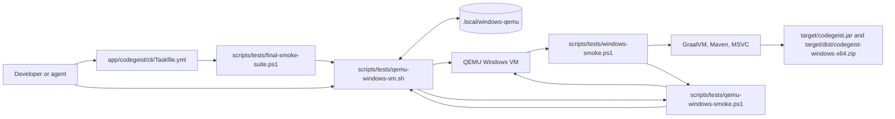
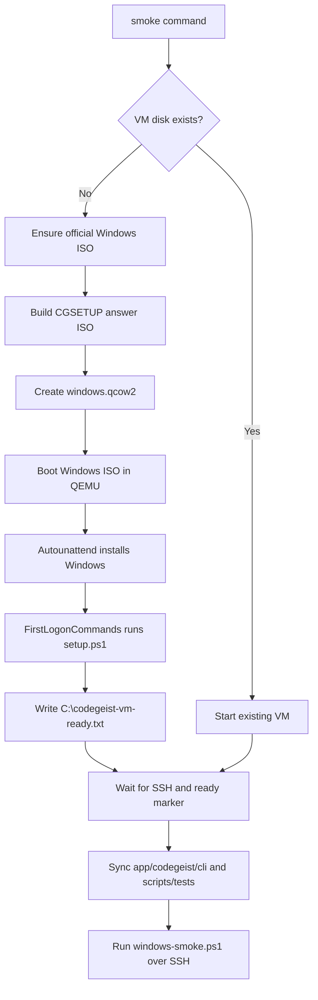
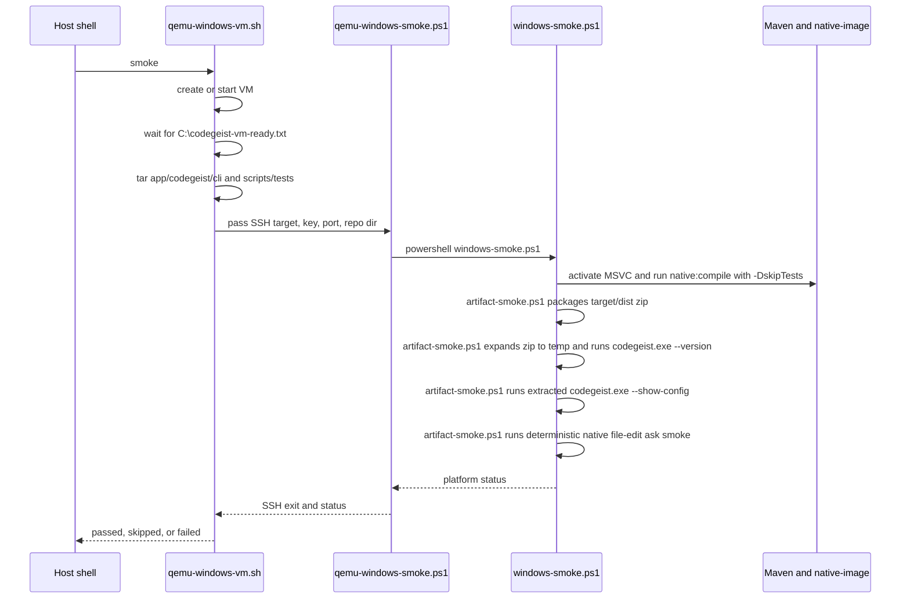

# Windows QEMU Smoke Tests

The Windows QEMU smoke workflow verifies Codegeist jar and native executable
behavior on a real Windows operating system before GitHub release automation runs.

## Scope

This workflow covers the implemented Spring Boot CLI module under
`app/codegeist/cli`. It proves the current `--version` command on Windows jar and
GraalVM native executable artifacts, and it proves the default native
`--show-config` output. It does not publish releases, sign binaries, create
installers, or replace GitHub-hosted Windows release builds.

The workflow intentionally uses a real Windows VM over SSH. Local Wine or other
compatibility-layer smoke checks are not part of the release-grade path.

## Quick Start

Run from the repository root:

```bash
scripts/tests/qemu-windows-vm.sh create
scripts/tests/qemu-windows-vm.sh smoke
scripts/tests/qemu-windows-vm.sh stop
```

Run through the Taskfile from `app/codegeist/cli`:

```bash
task qemu-windows-smoke
task final-smoke-suite
```

Run through the Taskfile from the repository root:

```bash
task -t app/codegeist/cli/Taskfile.yml qemu-windows-smoke
task -t app/codegeist/cli/Taskfile.yml final-smoke-suite
```

The first `create` or `smoke` run downloads the official Windows Server 2025
Evaluation ISO when no local ISO exists. The ISO is several GB, and the first VM
install plus provisioning run can take a long time. Later runs reuse the ignored
VM state under `.local/windows-qemu/`.

## What The Smoke Proves

The Windows smoke path validates these observable contracts inside Windows:

- Maven tests pass for `app/codegeist/cli`.
- Maven can build the executable Spring Boot jar.
- `java -jar target/codegeist.jar --version` prints the build version only.
- GraalVM `native-image` can build `target/codegeist.exe` with MSVC Build Tools.
- The smoke helper can create `target/dist/codegeist-windows-x64.zip`
  with `codegeist.exe` and required DLLs.
- The zip can be expanded into a fresh temp directory, and extracted
  `codegeist.exe --version` prints the build version only.
- The extracted `codegeist.exe --show-config` prints only the current default
  direct YAML shape, `{}`.
- Jar and native runs write non-empty smoke log files under `target/smoke-test/`.
- The host receives an explicit `passed`, `skipped`, or `failed` platform status.

## Entrypoints

| File or task | Role |
| --- | --- |
| `scripts/tests/qemu-windows-vm.sh` | High-level VM lifecycle, ISO download, answer ISO generation, QEMU startup, repo sync, and smoke dispatch. |
| `scripts/tests/qemu-windows-smoke.ps1` | Lower-level SSH smoke entrypoint for an already reachable Windows VM. |
| `scripts/tests/windows-smoke.ps1` | Windows-side Maven, jar version, native build, native version, native config output, and status checks. |
| `scripts/tests/windows-qemu/autounattend.xml` | Windows Setup answer-file template used during unattended installation. |
| `scripts/tests/windows-qemu/setup.ps1` | First-logon guest provisioning for OpenSSH, authorized keys, GraalVM, Maven, MSVC, and readiness marker. |
| `scripts/tests/final-smoke-suite.ps1` | Final local Linux and Windows suite. Windows is required by default. |
| `task qemu-windows-smoke` | Taskfile wrapper around `scripts/tests/qemu-windows-vm.sh smoke`. |
| `task final-smoke-suite` | Taskfile wrapper around Linux and Windows final smoke checks. |

## Architecture



## VM Lifecycle



## Smoke Execution Sequence



## Generated State

All VM state is local to the developer machine and ignored by Git.

| Path | Owner | Notes |
| --- | --- | --- |
| `.local/windows-qemu/downloads/windows-server-2025-eval.iso` | Host | Default official Windows Server Evaluation ISO download path. |
| `.local/windows-qemu/windows.qcow2` | Host and QEMU | Local Windows VM disk. Delete only when intentionally recreating the VM. |
| `.local/windows-qemu/autounattend.iso` | Host | Generated answer media mounted into Windows Setup as `CGSETUP`. |
| `.local/windows-qemu/answer/` | Host | Temporary answer ISO staging directory. |
| `.local/windows-qemu/id_ed25519` | Host | Private SSH key for the local VM. Do not commit or paste it. |
| `.local/windows-qemu/id_ed25519.pub` | Host and guest | Public key copied into `administrators_authorized_keys`. |
| `.local/windows-qemu/credentials.env` | Host | Generated local Windows password. Do not commit or paste it. |
| `.local/windows-qemu/qemu.pid` | Host | PID file while QEMU is running. |
| `.local/windows-qemu/qemu-monitor.sock` | Host | QEMU monitor socket used to send the initial boot key. |
| `app/codegeist/cli/target/smoke-test/` | Host and guest | Generated smoke status and output logs. |

## Host Prerequisites

Install these tools in the development environment before running the full Windows
path:

- `qemu-system-x86_64` for the Windows VM.
- `qemu-img` for the qcow2 disk.
- `genisoimage` for the answer ISO.
- `nc` with Unix socket support for the QEMU monitor socket.
- `ssh` and optionally `scp` for guest access and artifact copies.
- `tar` for repo synchronization into the VM.
- `curl` for ISO download.
- KVM support through `/dev/kvm` when available for practical install and native build speed.

The launcher still works without KVM by selecting QEMU TCG acceleration, but first
install and native-image builds can be much slower.

## Guest Provisioning

`scripts/tests/qemu-windows-vm.sh create` builds an answer ISO with label
`CGSETUP` and mounts it beside the Windows installer ISO. The answer ISO contains
the rendered `Autounattend.xml`, `setup.ps1`, `setup-config.ps1`, and
`authorized_keys`.

The answer file performs these installation steps:

- Selects the Windows Server Evaluation image by `CODEGEIST_WINDOWS_IMAGE_INDEX`, default `4`.
- Wipes QEMU disk `0` and creates the Windows partitions.
- Creates the local administrator account `codegeist` with a generated local password.
- Enables one automatic logon for provisioning.
- Runs `setup.ps1` from the `CGSETUP` answer ISO during first logon.

`setup.ps1` provisions these guest capabilities:

- OpenSSH server enabled and started.
- Host-generated SSH public key installed for administrators.
- GraalVM Community JDK 25 installed under `C:\tools` and added to machine `PATH`.
- Maven 3.9.11 installed under `C:\tools` and added to machine `PATH`.
- Visual Studio Build Tools installed under `C:\BuildTools` with the VC tools workload.
- `C:\codegeist-vm-ready.txt` written after provisioning completes.

## Configuration Reference

| Variable | Default | Purpose |
| --- | --- | --- |
| `CODEGEIST_WINDOWS_VM_DIR` | `.local/windows-qemu` | Local VM state root. |
| `CODEGEIST_WINDOWS_ISO` | `$CODEGEIST_WINDOWS_VM_DIR/downloads/windows-server-2025-eval.iso` | Existing or downloaded Windows ISO path. |
| `CODEGEIST_WINDOWS_ISO_URL` | Microsoft Windows Server 2025 Evaluation fwlink | ISO download URL when `CODEGEIST_WINDOWS_ISO` is missing. |
| `CODEGEIST_WINDOWS_ISO_SHA256` | unset | Optional checksum gate for existing or downloaded ISO. |
| `CODEGEIST_WINDOWS_MEMORY` | `8192` | QEMU memory in MB. |
| `CODEGEIST_WINDOWS_CPUS` | `4` | QEMU virtual CPUs. |
| `CODEGEIST_WINDOWS_CPU` | `host` with KVM, `max` without KVM | QEMU CPU model. Override only for host-specific boot issues. |
| `CODEGEIST_WINDOWS_DISK_SIZE` | `80G` | qcow2 disk size for first creation. |
| `CODEGEIST_WINDOWS_DISPLAY` | `none` | QEMU display mode. |
| `CODEGEIST_WINDOWS_SSH_PORT` | `2222` | Host TCP port forwarded to guest SSH port `22`. |
| `CODEGEIST_WINDOWS_REPO_DIR` | `C:\codegeist` | Repo copy location inside Windows. |
| `CODEGEIST_WINDOWS_IMAGE_INDEX` | `4` | Windows installer image index. |
| `CODEGEIST_WINDOWS_INSTALL_TIMEOUT_SECONDS` | `7200` | Maximum wait for first install and provisioning readiness. |
| `CODEGEIST_WINDOWS_GRAALVM_URL` | GraalVM CE 25.0.2 Windows zip | Guest GraalVM download URL. |
| `CODEGEIST_WINDOWS_MAVEN_URL` | Maven 3.9.11 zip | Guest Maven download URL. |
| `CODEGEIST_WINDOWS_VS_BUILDTOOLS_URL` | Visual Studio Build Tools release URL | Guest MSVC installer URL. |
| `CODEGEIST_WINDOWS_NATIVE_MODE` | `required` through VM script, `auto` in low-level SSH wrapper | Controls native smoke behavior. |
| `CODEGEIST_WINDOWS_MSVC_CMD` | autodetect | Optional MSVC environment activation command. |
| `CODEGEIST_WINDOWS_JAR_TIMEOUT_SECONDS` | `15` | Timeout for jar `--version` execution. |
| `CODEGEIST_WINDOWS_NATIVE_TIMEOUT_SECONDS` | `5` | Timeout for native `--version` and `--show-config` execution. |
| `CODEGEIST_WINDOWS_ALLOW_SKIP` | `0` | Converts missing prerequisites to `skipped` only for developer runs. |
| `CODEGEIST_SMOKE_STATUS_FILE` | unset | Optional key-value status output path. |

## Native Modes

| Mode | Behavior |
| --- | --- |
| `required` | Fail when `native-image`, MSVC, native compile, native `--version`, or native `--show-config` is unavailable or fails. This is the default release-grade VM path. |
| `auto` | Run native smoke when `native-image` and MSVC are available; otherwise report native as skipped after jar passes. |
| `skip` | Skip native smoke and validate only Maven tests, jar build, and jar `--version`. |

The final local smoke suite sets `CODEGEIST_WINDOWS_NATIVE_MODE=required` unless
`--allow-skips` is explicitly requested.

## Commands

| Command | Effect |
| --- | --- |
| `scripts/tests/qemu-windows-vm.sh download` | Download or verify the Windows ISO without starting QEMU. |
| `scripts/tests/qemu-windows-vm.sh create` | Build answer media, create the disk if needed, boot the installer, and wait for provisioning readiness. |
| `scripts/tests/qemu-windows-vm.sh start` | Start an existing VM and wait for SSH readiness. Creates the VM if no disk exists. |
| `scripts/tests/qemu-windows-vm.sh sync` | Start the VM and copy `app/codegeist/cli` plus `scripts/tests` into `C:\codegeist`. |
| `scripts/tests/qemu-windows-vm.sh smoke` | Start or create the VM, sync the repo subset, and run `windows-smoke.ps1`. |
| `scripts/tests/qemu-windows-vm.sh status` | Print VM running state, VM directory, ISO path, ISO URL, and SSH target. |
| `scripts/tests/qemu-windows-vm.sh stop` | Request Windows shutdown over SSH. |

## Status Semantics

| Status | Meaning |
| --- | --- |
| `passed` | The requested platform smoke completed successfully. |
| `skipped` | A prerequisite was absent and skip mode was explicitly enabled. This is not release-grade validation. |
| `failed` | A required prerequisite, build step, command smoke, readiness gate, or status check failed. |

The final suite treats `skipped` as failure unless it is run with
`--allow-skips`. Normal release-readiness validation must use the default strict
mode.

## Artifacts And Logs

Inside the Windows VM, generated artifacts live under:

```text
C:\codegeist\app\codegeist\cli\target\
```

Important files include:

- `C:\codegeist\app\codegeist\cli\target\codegeist.jar`
- `C:\codegeist\app\codegeist\cli\target\codegeist.exe`
- `C:\codegeist\app\codegeist\cli\target\dist\codegeist-windows-x64.zip`
- Native support DLLs in the same `target` directory, such as `awt.dll`, `java.dll`, and `jvm.dll`.
- `C:\codegeist\app\codegeist\cli\target\smoke-test\codegeist-windows-native.log`
- `C:\codegeist\app\codegeist\cli\target\smoke-test\codegeist-windows-native-show-config.log`
- `C:\codegeist\app\codegeist\cli\target\smoke-test\codegeist-windows-native.out`
- `C:\codegeist\app\codegeist\cli\target\smoke-test\codegeist-windows-native-show-config.out`

The Windows zip is the release-shaped native smoke artifact. If you need to copy
it to the host for inspection, start the VM and use `scp`:

```bash
scripts/tests/qemu-windows-vm.sh start
scp -i .local/windows-qemu/id_ed25519 -P 2222 codegeist@127.0.0.1:'C:/codegeist/app/codegeist/cli/target/dist/codegeist-*-windows-x64.zip' .
```

The raw `target/codegeist.exe` is only a build output. Copy the adjacent DLLs too
when you need to test that raw executable outside the VM.

The release artifact should be `codegeist-windows-x64.zip`, containing
`codegeist.exe` and the required DLLs in one directory. See
`native-distribution-packaging.md` for the full archive layout and why a true
single-file Windows executable is not the supported release contract.

The final suite writes host-side status summaries under:

```text
app/codegeist/cli/target/smoke-test/final-smoke-suite/
```

## Recreate The VM

Use this when the local VM is corrupted, the Windows image index changes, or the
guest provisioning contract changes enough that a fresh VM is safer.

```bash
scripts/tests/qemu-windows-vm.sh stop
rm -f .local/windows-qemu/windows.qcow2 .local/windows-qemu/qemu.pid .local/windows-qemu/qemu-monitor.sock
scripts/tests/qemu-windows-vm.sh create
```

This deletes only the local VM disk and runtime markers shown in the command. The
downloaded ISO remains under `.local/windows-qemu/downloads/` unless you delete it
explicitly.

## Troubleshooting

If the first boot stays on the Windows logo and the qcow2 file remains tiny, check
the QEMU CPU model. The launcher defaults to `-cpu host` when KVM is available and
`-cpu max` without KVM because current Windows Server media can stall with QEMU's
older default CPU model. Override `CODEGEIST_WINDOWS_CPU` only when the host needs
a different model.

If readiness times out, the guest never reached `C:\codegeist-vm-ready.txt` over
SSH. Check whether the VM is running with `scripts/tests/qemu-windows-vm.sh
status`, then inspect provisioning assumptions: network access for guest downloads,
Windows image index, the `CGSETUP` answer ISO, and the host SSH port.

If the host SSH port is already in use, set a different forwarded port:

```bash
export CODEGEIST_WINDOWS_SSH_PORT=2223
scripts/tests/qemu-windows-vm.sh smoke
```

If Windows native smoke fails because MSVC is missing, confirm that
`C:\BuildTools\Common7\Tools\VsDevCmd.bat` exists in the VM. The smoke helper also
checks standard Visual Studio 2022 Program Files paths and accepts an explicit
`CODEGEIST_WINDOWS_MSVC_CMD` override.

If jar or native command smoke times out, increase the focused timeout before
rerunning:

```bash
export CODEGEIST_WINDOWS_JAR_TIMEOUT_SECONDS=30
export CODEGEIST_WINDOWS_NATIVE_TIMEOUT_SECONDS=15
scripts/tests/qemu-windows-vm.sh smoke
```

If an alternate Windows ISO is used, verify `CODEGEIST_WINDOWS_IMAGE_INDEX`. The
default `4` matches the current Windows Server Evaluation media used by this
workflow.

If `task final-smoke-suite` fails after a Windows skip, rerun without
`--allow-skips` only when the Windows VM prerequisites are available. The strict
suite intentionally fails on skipped Windows validation.

## Current Verification

The `T005_01` local build-smoke task is solved. The acceptance path passed locally
with `task final-smoke-suite`, and the run reported Linux and Windows native
statuses as `passed`.

Use `docs/tasks/T005_add-cross-platform-release-and-qemu-smoke/tasks/T005_01_add-local-linux-windows-build-smoke.md`
for the task-level verification record. Use this document for the operational
contract and troubleshooting guide.
