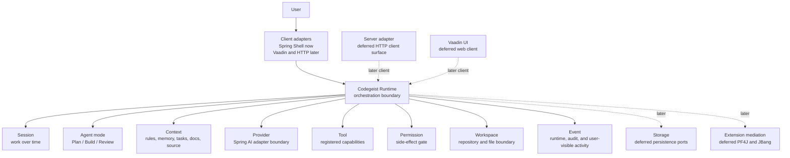

# Runtime Vocabulary

Codegeist-owned vocabulary for the runtime foundation. This document defines
concept names and ownership boundaries only; it does not describe implemented
Java packages, classes, provider calls, tools, storage, or UI behavior.

## Purpose

The Runtime vocabulary gives later MVP tasks stable words for the first
Codegeist boundaries before behavior is implemented. OpenCode remains a feature
reference, but these names belong to Codegeist and should not copy OpenCode's
Bun, TypeScript, transport, or storage shape.

## Boundary Diagram

## Vocabulary

| Term | Owned meaning | Must not own |
| --- | --- | --- |
| Runtime | Central orchestration boundary that turns client input into agent work | UI rendering, Spring Shell parsing, provider SDK details, storage adapters |
| Session | User work over time, including continuation identity and later message state | Provider calls, tool side effects, UI behavior |
| Agent mode | Behavior profile such as Plan, Build, or Review | Client commands, persistence, provider SDK integration |
| Context | Deterministic project inputs such as rules, memory, tasks, docs, source, and analysis artifacts | LLM calls, permission decisions, tool execution |
| Provider | Boundary for model access through Spring AI integration | Prompt ownership, session policy, permission policy |
| Tool | Registered capability that may request side effects through controlled contracts | Permission policy, workspace escape rules, audit ownership |
| Permission | Gate for side effects and approval decisions | Tool implementation, UI prompt rendering as the source of truth |
| Workspace | Repository, file, path, ignore, and symlink boundary | Edits or shell execution without tool and permission mediation |
| Event | Runtime, audit-relevant, and user-visible activity descriptions | Storage implementation, UI rendering |

## Deferred Boundaries

| Boundary | Why it is deferred |
| --- | --- |
| Storage | Persistence ports need stable session, event, and runtime contracts first. |
| Extension mediation | PF4J and JBang integration need tool, permission, and workspace boundaries first. |
| Server adapter | HTTP/API access should be a runtime client, not an owner of agent behavior. |
| Vaadin UI | The web UI should present runtime state and approvals after runtime contracts exist. |

## Ownership Rules

- Clients call the Runtime; clients do not implement agent behavior.
- Runtime may coordinate Session, Agent mode, Context, Provider, Tool,
  Permission, Workspace, and Event concepts.
- Tool side effects must pass through Permission and Workspace boundaries.
- Provider integration adapts Spring AI and must not own sessions, prompts,
  permissions, or tool policy.
- Storage, Extension mediation, Server, and Vaadin remain deferred boundaries
  until later tasks define behavior and contracts.
- This document records vocabulary and dependency direction only. It does not
  require Java packages or classes to exist.
