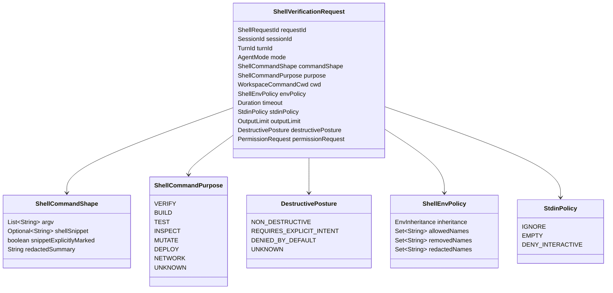
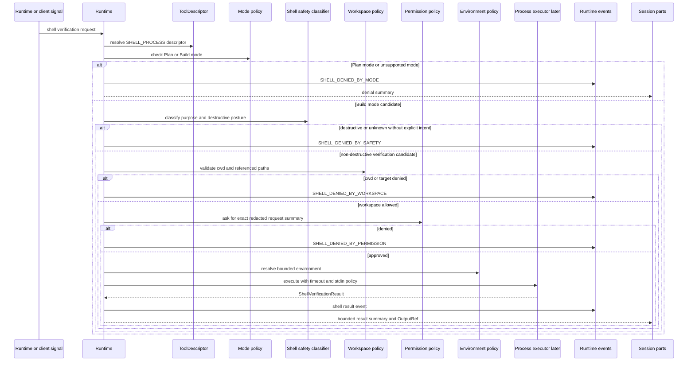
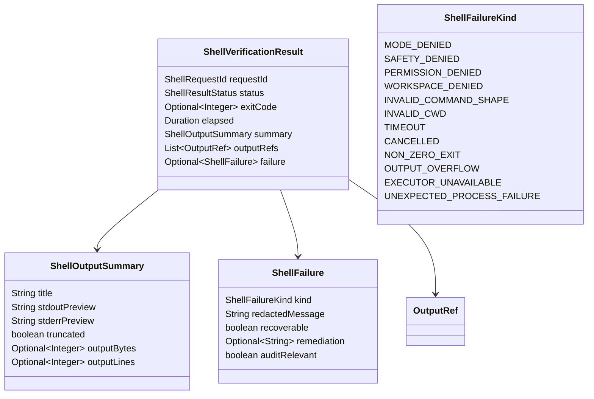

# Shell Verification Contracts

Blueprint for future Codegeist controlled shell verification requests, permission
gates, workspace-validated command execution, typed failures, and bounded output.

## Scope

This document specifies planned contracts only. It does not describe implemented
Java source, Spring beans, package directories, tests, process execution, PTY
support, terminal UI, remote execution, JBang execution, shell sandboxing,
allowlists, Graphify, Repomix, or runtime behavior.

Controlled shell verification specializes the generic tool, permission,
workspace, bounded-result, event, and session boundaries in
`docs/developer/tool-permission-workspace-contracts.md`:

- Shell requests are high-risk tool requests, not CLI adapter shortcuts.
- Plan mode denies shell execution by default.
- Build mode may request bounded non-destructive verification commands only after
  descriptor, mode, permission, destructive-posture, workspace-cwd, timeout,
  stdin, environment, and output-limit gates pass.
- A generic approval is not enough to run destructive, deploy, networked,
  credential-exposing, or external-integration commands.
- Results store summaries, typed failures, and output references, not unbounded
  stdout, stderr, command payloads, environment data, or stack traces.

## Evidence

### OpenCode Feature Evidence

OpenCode is a behavior reference, not an implementation blueprint.

| Source | Relevant lesson for Codegeist |
| --- | --- |
| `docs/third-party/opencode/source/packages/opencode/src/tool/shell.ts` | The shell tool parses commands, identifies command and path patterns, asks external-directory and shell permissions, resolves cwd, ignores stdin, builds an environment, applies a timeout, streams output, kills on timeout or abort, records exit code, and stores truncation metadata. Codegeist should split these concerns into request contracts, policy gates, executor handoff, result summaries, and typed failures. |
| `docs/third-party/opencode/source/packages/opencode/src/tool/tool.ts` | Tool execution wraps schema validation, session/message/call ids, permission ask hooks, metadata updates, and output truncation. Codegeist should model shell as one mediated `ToolRequest` capability, not as direct process execution from a client. |
| `docs/third-party/opencode/source/packages/opencode/src/tool/truncate.ts` | Tool output has default line and byte caps and can be written out-of-band with an output path. Codegeist should represent large stdout/stderr through `OutputRef` values and truncation metadata. |
| `docs/third-party/opencode/source/packages/opencode/src/permission/index.ts` | Permission requests carry session ids, permission names, patterns, metadata, and `once`/`always`/`reject` replies. Codegeist should bind approval to a redacted shell request summary and keep decision scope explicit. |
| `docs/third-party/opencode/source/packages/opencode/src/tool/external-directory.ts` | External-directory access is checked separately with target metadata. Codegeist should validate cwd and referenced paths deterministically before treating external-directory approval as a possible policy layer. |
| `docs/third-party/opencode/source/packages/opencode/src/v2/session-event.ts` | Shell started/ended events and generic tool lifecycle events are distinct event families. Codegeist should emit shell-specific lifecycle events only with bounded, redacted fields. |
| `docs/third-party/opencode/source/packages/opencode/src/v2/session-message.ts` | Shell and assistant tool message parts store command/output state. Codegeist should store shell result summaries and output references rather than full logs or raw command payloads in durable session parts. |

## Ownership Rules

- Runtime owns shell request sequencing, mode checks, correlation ids, events, and
  session result summaries.
- Tool descriptors classify shell verification as a `SHELL_PROCESS` capability
  with stricter defaults than read-only tools.
- Permission policy owns approval requirements, decision scope, expiry, and audit
  metadata.
- Workspace policy owns cwd validation, referenced workspace paths, external
  directory posture, generated/ignored/secret-like denials, and output references.
- Environment policy owns inherited, removed, forced, and redacted variables.
- The future process executor owns only process start, wait, cancellation, and
  output capture after all gates pass.
- Clients may ask approval questions later, but they do not own shell safety.

## Request Model



The first implementation should accept either an explicit `argv` vector or an
explicitly marked shell snippet. A snippet must not be treated as equivalent to a
safe argv command just because permission was granted.

## Gate Order



Gate rules:

- Mode denial happens before permission prompts.
- Safety classification happens before permission prompts so destructive commands
  cannot be hidden inside generic shell approval.
- Cwd validation happens before process start and uses the centralized workspace
  policy from `docs/developer/context-workspace-manifest.md` and
  `docs/developer/tool-permission-workspace-contracts.md`.
- Permission approval is scoped to the exact redacted command summary, cwd,
  purpose, timeout, and environment posture.
- Environment resolution happens after approval but before execution, and the
  resolved environment is not stored in session state.
- Stdin is ignored or empty by default; interactive input is denied until a later
  terminal/PTY task explicitly reopens it.

## Controlled Command Posture

| Command posture | Plan mode | Build mode | Contract posture |
| --- | --- | --- | --- |
| Verification or test command | Deny | Ask | Allowed only with workspace cwd, timeout, stdin denial, bounded output, and exact approval. |
| Build command | Deny | Ask | Allowed only when non-destructive and scoped to the workspace; generated outputs still follow workspace policy. |
| Read-only inspection command | Deny | Ask | Still shell execution, so it is not treated as the same as a file read tool. |
| Workspace mutation command | Deny | Requires explicit intent | Prefer patch/edit contracts when possible; generic shell approval is not enough. |
| Destructive command | Deny | Deny by default | Requires a future explicit destructive-command workflow, not this MVP verification contract. |
| Deployment or network command | Deny | Deny by default | Requires future external-integration policy and user intent. |
| Unknown command shape | Deny | Deny by default | Must be classified before execution. |

The initial tool should be named and documented as a verification tool rather
than a general-purpose terminal. Its default allowed path is narrow: run bounded,
approved, non-destructive commands such as tests, builds, linters, or diagnostic
checks from a validated workspace directory.

## Result And Failure Model



Result rules:

- `exitCode` is present only when a process actually exits.
- `TIMEOUT` and `CANCELLED` may have no exit code.
- Non-zero exit is a typed result, not necessarily a system defect.
- Output summaries should keep stdout and stderr previews separate when the future
  executor can capture them separately.
- Output references should point to bounded, policy-managed artifacts when output
  exceeds inline limits.
- Failure messages are redacted and must not include raw environment values,
  credentials, full command output, stack traces, or provider payloads.

## Event And Session Projection

Shell events should specialize the generic tool lifecycle without storing raw
logs or environment data.

| Event family | Summary |
| --- | --- |
| `SHELL_REQUESTED` | Request id, mode, purpose, cwd summary, timeout, and redacted command summary. |
| `SHELL_DENIED_BY_MODE` | Plan-mode or descriptor-mode denial before permission. |
| `SHELL_DENIED_BY_SAFETY` | Destructive, deploy, network, unknown, or otherwise unsafe posture denied before permission. |
| `SHELL_PERMISSION_REQUESTED` | Exact redacted request summary and decision scope. |
| `SHELL_STARTED` | Process start after all gates pass, with request id and redacted title only. |
| `SHELL_OUTPUT_PROGRESS` | Optional bounded tail/head preview for user rendering. |
| `SHELL_COMPLETED` | Exit code, elapsed time, output summary, truncation flag, and output refs. |
| `SHELL_FAILED` | Typed failure, recoverability, and remediation summary. |

Session parts should store `SHELL_CALL`, `APPROVAL_REFERENCE`, `SHELL_RESULT`,
`WARNING`, and `ERROR` summaries. They should not store full stdout, stderr,
environment maps, raw shell snippets, secret values, or unbounded logs.

## Future File Map

These are illustrative implementation targets only and should not be created
until a later Java task requires them.

```text
app/codegeist/cli/src/main/java/ai/codegeist/shell/ShellRequestId.java
app/codegeist/cli/src/main/java/ai/codegeist/shell/ShellVerificationRequest.java
app/codegeist/cli/src/main/java/ai/codegeist/shell/ShellCommandShape.java
app/codegeist/cli/src/main/java/ai/codegeist/shell/ShellCommandPurpose.java
app/codegeist/cli/src/main/java/ai/codegeist/shell/DestructivePosture.java
app/codegeist/cli/src/main/java/ai/codegeist/shell/ShellEnvPolicy.java
app/codegeist/cli/src/main/java/ai/codegeist/shell/StdinPolicy.java
app/codegeist/cli/src/main/java/ai/codegeist/shell/ShellVerificationResult.java
app/codegeist/cli/src/main/java/ai/codegeist/shell/ShellFailure.java
app/codegeist/cli/src/main/java/ai/codegeist/shell/ShellFailureKind.java
app/codegeist/cli/src/main/java/ai/codegeist/shell/ShellExecutor.java
app/codegeist/cli/src/test/java/ai/codegeist/shell/ShellRequestPolicyTests.java
app/codegeist/cli/src/test/java/ai/codegeist/shell/ShellResultShapeTests.java
app/codegeist/cli/src/test/java/ai/codegeist/shell/ShellWorkspaceCwdTests.java
```

## Illustrative Java Sketches

These snippets are examples only. They are not implemented source.

```java
record ShellVerificationRequest(
    ShellRequestId requestId,
    SessionId sessionId,
    TurnId turnId,
    AgentMode mode,
    ShellCommandShape commandShape,
    ShellCommandPurpose purpose,
    WorkspaceCommandCwd cwd,
    ShellEnvPolicy envPolicy,
    Duration timeout,
    StdinPolicy stdinPolicy,
    OutputLimit outputLimit,
    DestructivePosture destructivePosture
) {}

sealed interface ShellCommandShape permits ArgvCommand, ShellSnippet {}

record ArgvCommand(List<String> argv, RedactedCommandSummary summary)
    implements ShellCommandShape {}

record ShellSnippet(String snippet, RedactedCommandSummary summary)
    implements ShellCommandShape {}
```

```java
record ShellVerificationResult(
    ShellRequestId requestId,
    ShellResultStatus status,
    OptionalInt exitCode,
    Duration elapsed,
    ShellOutputSummary summary,
    List<OutputRef> outputRefs,
    Optional<ShellFailure> failure
) {}

enum ShellFailureKind {
    MODE_DENIED,
    SAFETY_DENIED,
    PERMISSION_DENIED,
    WORKSPACE_DENIED,
    INVALID_COMMAND_SHAPE,
    INVALID_CWD,
    TIMEOUT,
    CANCELLED,
    NON_ZERO_EXIT,
    OUTPUT_OVERFLOW,
    EXECUTOR_UNAVAILABLE,
    UNEXPECTED_PROCESS_FAILURE
}
```

```java
interface ShellExecutor {
    ShellVerificationResult execute(ApprovedShellExecution execution);
}
```

The exact package structure, process API, streaming model, and executor return
type belong to later implementation tasks.

## Future Test Handoff

No tests are created by this documentation task. Later implementation tasks
should prefer deterministic policy and fake-executor tests before a real process
runner is introduced.

| Test area | What to prove | Runtime side effects needed |
| --- | --- | --- |
| Plan-mode denial | Plan mode denies every shell request before permission prompts. | No |
| Build-mode approval | Build mode verification commands require approval for exact command summary, cwd, timeout, and env posture. | No process runner if tested at policy boundary |
| Destructive posture | Destructive, deploy, network, and unknown command categories are not allowed from generic shell approval. | No |
| Workspace cwd validation | Outside-root, symlink escape, generated, ignored, secret-like, and missing cwd cases map to typed denials. | No |
| Env redaction | Secret-like env names are removed or redacted from events, logs, and session parts. | No |
| Stdin posture | Interactive stdin is denied or ignored by default. | Fake executor only |
| Timeout shape | Timeout returns a typed failure without requiring an exit code. | Fake executor first; later controlled process fixture |
| Non-zero exit shape | Non-zero exit returns exit code and typed failure without becoming an untyped defect. | Fake executor first |
| Output truncation | Large stdout/stderr produce summary, truncation metadata, and `OutputRef` values. | Fake executor only |
| Event/session projection | Shell lifecycle events project to bounded session message parts. | No |

## Later Implementation Rules

- Implement descriptor, request, policy, workspace-cwd, env, and result contracts
  before creating a real process executor.
- Keep shell denied in Plan mode even when a command looks read-only.
- Prefer `argv` for structured verification commands and require explicit marking
  for shell snippets.
- Validate cwd and referenced paths before process start.
- Default stdin to ignored or empty; do not add PTY or interactive prompts in the
  first verification tool.
- Keep destructive, deploy, external integration, network, and unknown commands
  denied until a separate explicit workflow exists.
- Keep raw command output, stderr, environment values, secrets, stack traces, and
  provider payloads out of events, logs, task docs, and session message parts.
