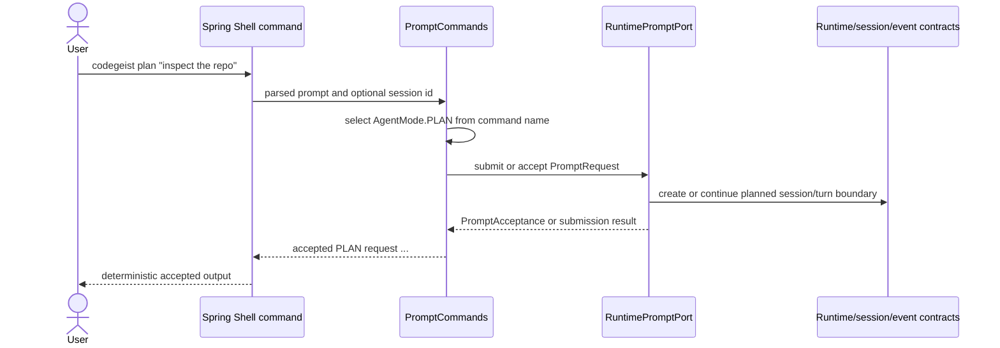

# CLI Prompt Command Source Generation Contract

Source-generation handoff for the first planned Codegeist Spring Shell prompt
commands. This document is planned guidance only: it does not create Java source,
tests, packages, Spring beans, shell commands, runtime services, provider calls,
storage, CLI behavior, or TUI behavior.

## Purpose And Status

`T002_04_wire_cli_prompt_mode_contract.md` defines the broad CLI prompt-mode
blueprint and OpenCode source evidence. This handoff narrows that blueprint into
the first source-generation contract for future `plan` and `build` Spring Shell
commands.

The future implementation task should make CLI a thin client adapter over the
runtime/session/event contracts finalized in
`runtime-session-event-source-generation-contract.md`. It should collect prompt
text, select an explicit runtime mode from the command name, optionally pass a
session continuation id, and return deterministic accepted/submitted output. It
must stop before assistant generation, provider streaming, context loading, tool
execution, permission decisions, workspace validation, storage, patch/edit, shell,
TUI, server, Vaadin, PF4J, or JBang behavior.

## Current Baseline

The implemented Java application remains smaller than the planned contract.

| Area | Current state |
| --- | --- |
| Module | One Maven module under `app/codegeist/cli` |
| Implemented package | `ai.codegeist.app` only |
| Entrypoint | `CodegeistApplication` starts Spring Boot |
| Spring Shell | Dependency and configuration surface only; no commands yet |
| Runtime/session/event contracts | Planned in documentation; not Java source yet |
| CLI prompt commands | Not implemented |
| Tests | Spring Boot context-load test only |

All package names, Java types, commands, and tests below are planned source names.
They are not current source files or implemented behavior.

## First Command Boundary

The first CLI prompt source slice should own only line-oriented command adapter
behavior:

- User-facing Spring Shell command names for `plan` and `build`.
- Required prompt text input.
- Optional plain session continuation id when it can be passed without
  implementing lifecycle, list, fork, or storage behavior.
- Mapping from command name to runtime-owned `AgentMode.PLAN` or
  `AgentMode.BUILD`.
- Request creation through planned runtime/session/event source contracts.
- Delegation to a runtime-owned prompt port.
- Deterministic accepted/submitted output that does not claim an assistant answer.

The slice should not add a default `run` command. A default-mode policy needs a
separate task because it decides how a user prompt behaves when no mode is
explicitly selected.

## Planned Command Contract

| Command | Planned input | Runtime mapping | Stable first output | Explicit deferrals |
| --- | --- | --- | --- | --- |
| `codegeist plan` | Required prompt text, optional session id | `AgentMode.PLAN`, `SourceClient.CLI`, optional `SessionId` | Accepted/submitted request summary with request/session/turn ids when available | Provider calls, tools, edits, shell, patch apply, permission prompts. |
| `codegeist build` | Required prompt text, optional session id | `AgentMode.BUILD`, `SourceClient.CLI`, optional `SessionId` | Accepted/submitted request summary with request/session/turn ids when available | Actual side effects, tool execution, permission policy, workspace validation. |

Prompt text may be accepted as a positional value or a `--prompt` option in the
future implementation. The implementation task should choose the shape that works
best with Spring Shell 4 while preserving this runtime request boundary. Whichever
surface is chosen, tests must prove the prompt text is required and blank input is
rejected before runtime submission.

Optional session input is only a continuation hint in this first slice. It must
not create session lookup, list, fork, delete, restore, compaction, or durable
storage behavior.

## Runtime Delegation Rules

The CLI adapter consumes runtime-owned contracts; it does not define alternate
runtime types.



The future adapter may generate request, correlation, or timestamp values only
until the runtime owns a request factory. It must not generate session lifecycle
events itself, mutate session state directly, decide provider/model selection, or
inspect workspace files.

## Planned Package Ownership

| Planned package | First source role | Must not own |
| --- | --- | --- |
| `ai.codegeist.cli` | Spring Shell command adapter, argument parsing, line-oriented output formatting. | Runtime orchestration, sessions, provider/model calls, context loading, tool execution, permissions, storage, workspace policy. |
| `ai.codegeist.runtime` | `PromptRequest`, `AgentMode`, `SourceClient`, `RuntimePromptPort`, `PromptAcceptance`, typed prompt failures. | Spring Shell annotations, CLI parsing, provider SDKs, storage adapters, UI rendering. |
| `ai.codegeist.session` | `SessionId`, `TurnId`, and projection/acceptance values produced by runtime contracts. | CLI command names, terminal output, persistence implementation. |
| `ai.codegeist.event` | Event envelope and event identifiers carried through acceptance/projection only if already created by runtime. | CLI event publication or rendering policy in this first command slice. |

`ai.codegeist.tui`, `ai.codegeist.provider`, `ai.codegeist.context`,
`ai.codegeist.tool`, `ai.codegeist.permission`, `ai.codegeist.workspace`,
`ai.codegeist.patch`, `ai.codegeist.shell`, and `ai.codegeist.storage` remain
later owners for their own slices.

## Boundary Rules

- CLI commands are adapters over runtime/session/event contracts.
- `AgentMode` is runtime-owned. The CLI chooses it only by selecting the `plan` or
  `build` command.
- CLI output may say a request was accepted, submitted, or queued. It must not say
  a prompt was answered, streamed, executed, patched, or completed.
- Runtime, session, and event packages must not expose Spring Shell types.
- Spring Shell annotations, parser APIs, terminal output helpers, and command
  registration details stay in `ai.codegeist.cli`.
- Provider/model flags, command templates, async prompt submission, `continue`,
  `fork`, shell input, patch apply, and TUI/full-screen behavior are outside this
  first CLI command contract.
- Plan/Build permission differences are preserved as mode facts only; enforcement
  belongs to later tool and permission tasks.
- Context/workspace loading is not triggered by the CLI adapter. Runtime or later
  context tasks decide when and how context is attached.

## OpenCode Translation

OpenCode remains a feature reference, not an implementation template.

| OpenCode evidence | Codegeist translation |
| --- | --- |
| `cli/cmd/tui/thread.ts` collects prompt, agent, model, continuation, session, and fork options before passing them into the TUI runtime. | Codegeist starts smaller: collect prompt text, explicit command mode, and optional session id, then delegate. |
| `config/config.ts` and `config/agent.ts` expose first-class `plan` and `build` agent entries. | Codegeist keeps `PLAN` and `BUILD` as runtime-owned modes rather than CLI-only labels. |
| `agent/agent.ts` distinguishes Plan and Build capabilities. | Codegeist records the mode now and leaves capability enforcement to later permission/tool tasks. |
| `server/routes/instance/httpapi/groups/session.ts` separates prompt, command, async, and shell payloads. | Codegeist keeps prompt submission separate from command-template, async/server, and shell contracts. |
| `session/prompt.ts` owns prompt execution, command expansion, provider, tools, permissions, messages, and events. | Codegeist CLI must not own those behaviors; it only submits a runtime request. |

## Illustrative Java Sketches

These snippets are examples only. They are not implemented source.

```java
package ai.codegeist.cli;

import ai.codegeist.runtime.AgentMode;
import ai.codegeist.runtime.PromptRequest;
import ai.codegeist.runtime.PromptAcceptance;
import ai.codegeist.runtime.RuntimePromptPort;
import ai.codegeist.session.SessionId;
import java.util.Optional;
import org.springframework.shell.standard.ShellComponent;
import org.springframework.shell.standard.ShellMethod;
import org.springframework.shell.standard.ShellOption;

@ShellComponent
final class PromptCommands {
    private final RuntimePromptPort runtime;

    PromptCommands(RuntimePromptPort runtime) {
        this.runtime = runtime;
    }

    @ShellMethod(key = "codegeist plan", value = "Submit a planning prompt")
    String plan(
            @ShellOption(names = "--prompt") String prompt,
            @ShellOption(names = "--session", defaultValue = ShellOption.NULL) String session) {
        return submit(AgentMode.PLAN, prompt, session);
    }

    @ShellMethod(key = "codegeist build", value = "Submit an implementation prompt")
    String build(
            @ShellOption(names = "--prompt") String prompt,
            @ShellOption(names = "--session", defaultValue = ShellOption.NULL) String session) {
        return submit(AgentMode.BUILD, prompt, session);
    }

    private String submit(AgentMode mode, String prompt, String session) {
        PromptRequest request = PromptRequest.fromCli(mode, prompt, optionalSession(session));
        PromptAcceptance acceptance = runtime.submit(request);
        return "accepted " + acceptance.mode() + " request " + acceptance.requestId().value();
    }

    private Optional<SessionId> optionalSession(String session) {
        if (session == null || session.isBlank()) {
            return Optional.empty();
        }
        return Optional.of(new SessionId(session.trim()));
    }
}
```

The example assumes a convenience factory only for readability. A later
implementation may use a separate request factory, constructor, or builder if the
runtime/session/event contract task has already created one. It must still keep
Spring Shell types out of runtime records.

Example adapter test shape:

```java
final class PromptCommandsTest {
    @Test
    void planSubmitsPlanModeRuntimeRequest() {
        RecordingRuntimePromptPort runtime = new RecordingRuntimePromptPort();
        PromptCommands commands = new PromptCommands(runtime);

        String output = commands.plan("inspect the repo", null);

        assertThat(output).contains("accepted PLAN request");
        assertThat(runtime.lastRequest().mode()).isEqualTo(AgentMode.PLAN);
        assertThat(runtime.lastRequest().promptText()).isEqualTo("inspect the repo");
        assertThat(runtime.lastRequest().sessionId()).isEmpty();
    }

    @Test
    void buildPassesOptionalSessionWithoutContinuingItInCli() {
        RecordingRuntimePromptPort runtime = new RecordingRuntimePromptPort();
        PromptCommands commands = new PromptCommands(runtime);

        commands.build("add tests", "session-123");

        assertThat(runtime.lastRequest().mode()).isEqualTo(AgentMode.BUILD);
        assertThat(runtime.lastRequest().sessionId())
                .hasValueSatisfying(session -> assertThat(session.value()).isEqualTo("session-123"));
    }
}
```

## TDD Handoff

The later source task should start with direct adapter and contract tests before
adding command source. Prefer plain JVM tests for adapter mapping and use Spring
context tests only when command registration itself is the behavior under test.

| Future test | Behavior to prove |
| --- | --- |
| `PromptCommandsTest#planSubmitsPlanModeRuntimeRequest` | `plan` maps prompt input to `AgentMode.PLAN` and delegates exactly once to `RuntimePromptPort`. |
| `PromptCommandsTest#buildSubmitsBuildModeRuntimeRequest` | `build` maps prompt input to `AgentMode.BUILD` and delegates through the same runtime path. |
| `PromptCommandsTest#passesOptionalSessionAsRuntimeContinuationHint` | Optional session input becomes `Optional<SessionId>` without CLI lifecycle behavior. |
| `PromptCommandsTest#rejectsBlankPromptBeforeRuntimeSubmission` | Blank prompt input fails before the runtime port is called. |
| `PromptCommandsTest#rendersAcceptedOutputWithoutProviderClaims` | Output is stable and says accepted/submitted, not answered or completed. |
| `PromptCommandsDependencyTests#runtimeContractsDoNotExposeSpringShell` | Runtime/session/event contracts do not expose Spring Shell annotations or parser types. |
| `PromptCommandsShellRegistrationTest#planAndBuildAreRegistered` | Optional startup-sensitive Spring Shell smoke only if direct tests cannot prove registration. |

Suggested later commands:

```bash
cd app/codegeist/cli
mvn --batch-mode --no-transfer-progress -Dtest=PromptCommandsTest test
mvn --batch-mode --no-transfer-progress -Dtest=PromptCommandsTest#planSubmitsPlanModeRuntimeRequest test
```

Do not run live provider, network, native-image, shell/process, patch/edit, or
filesystem-heavy checks for this first CLI command implementation unless the task
scope explicitly changes.

## Deferrals

| Later owner | Deferred behavior |
| --- | --- |
| Runtime/session/event implementation task | Concrete Java contracts behind `RuntimePromptPort`, prompt acceptance, session/turn creation, event sequencing. |
| `T003_07` context/workspace contract | Workspace identity, path policy, context profile selection, source ordering, manifest diagnostics. |
| `T003_08` provider adapter contract | Model/provider configuration, Spring AI mapping, streaming fallback, typed provider errors. |
| `T003_09` tool/permission/workspace contract | Tool registry, capability gates, permission requests/decisions, workspace tool-target validation. |
| `T003_10` patch/edit contract | Patch proposal identity, approval binding, apply results, bounded summaries. |
| `T003_11` controlled shell contract | Shell request validation, approval-gated execution, timeout/cancellation, bounded output. |
| `T003_12` storage/continuation contract | Session continuation semantics, in-memory-first ports, file-backed persistence gates. |
| `T003_13` end-to-end agent loop | Assistant generation, provider streaming, tools, permissions, storage, and projections. |
| `T003_14` OpenCode parity CLI workflows | `run`, session commands, command templates, user-visible workflow parity. |
| `T003_15` packaging/native/startup validation | Binary smoke, startup budgets, platform artifacts, native-image posture. |

## Later Implementation Checklist

Before creating CLI prompt command Java source, verify that the implementation
task:

- Starts with the narrow adapter tests above or records a concrete test-first
  blocker.
- Uses the finalized runtime/session/event Java contract, or creates the smallest
  missing runtime port as part of a clearly planned source task.
- Keeps Spring Shell types inside `ai.codegeist.cli`.
- Keeps runtime/session/event contracts independent of CLI and framework types.
- Implements only `plan` and `build` unless a separate task has selected a
  default-mode policy for `run`.
- Returns deterministic accepted/submitted output without provider, tool, storage,
  shell, patch, context, or TUI claims.
- Updates `docs/developer/architecture/architecture.md` after any CLI commands or
  packages become real source.
