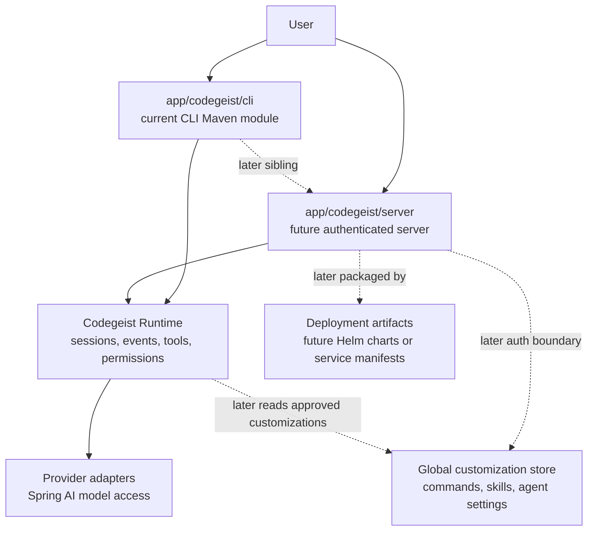

# Codegeist OpenCode Parity Architecture

This document defines the first architecture decisions for evolving
`codegeist.ai` toward OpenCode feature parity. It starts with the baseline
technology stack and will grow into the feature matrix and component model for
the implementation tasks that follow.

## Technology Baseline

Codegeist should be designed around a Java-first stack. OpenCode is a feature
reference, but Codegeist will not copy OpenCode's Bun and TypeScript runtime
shape.

Spring AI is a central architecture component. The architecture baseline now
follows the Spring AI 2.x milestone line so Codegeist can use Spring AI Agent
Utils while keeping provider and tool behavior behind Codegeist-owned contracts.

Java `25` remains the preferred Java baseline as long as it works with Spring
Boot 4, Spring AI `2.0.0-M6`, Spring Shell 4, Maven, and GraalVM. If Java `25`
causes compatibility issues, the Java version must be decided separately instead
of silently changing the Spring AI or Agent Utils adoption decision.

The `app/codegeist/cli/pom.xml` build is aligned to Spring Boot `4.0.6`, Spring
AI `2.0.0-M6`, Spring AI Agent Utils `0.7.0`, and Spring Shell `4.0.2` while
keeping Java `25` and the GraalVM native profile as the project posture.

| Technology | Decision | Role | Boundary | Validation needed |
| --- | --- | --- | --- | --- |
| Java 25 | Preferred while compatible | Primary language and domain model | Owns core types, tool contracts, events, and workspace abstractions | Verify with Spring Boot `4.0.6`, Spring AI `2.0.0-M6`, Spring Shell `4.0.2`, Agent Utils `0.7.0`, Maven, and GraalVM posture |
| Maven | Baseline build system | Dependency management, build lifecycle, tests, JVM jar, native profile | Does not define runtime architecture | Manages Spring Boot `4.0.6`, Spring AI `2.0.0-M6`, and Agent Utils `0.7.0` alignment |
| Spring Boot 4.0.x | Target for Spring AI 2.x and Agent Utils support | Application baseline, auto-configuration, lifecycle | Should not own agent-specific domain decisions | Current build uses `4.0.6` |
| Spring Shell | Keep as initial CLI/shell layer | Interactive and non-interactive command entrypoints | Must remain a client of the runtime | Current build uses Spring Shell `4.0.2` with Spring Boot `4.0.6` and Java `25` |
| Spring AI 2.0.x | Target line for provider integration | Primary model/provider, chat, tool-calling, and AI integration layer | Does not replace Codegeist runtime, permissions, or tool policy | Current build imports the Spring AI `2.0.0-M6` BOM without provider starters |
| Spring AI Agent Utils | Adopt as dependency baseline, keep architecture independent | Reference and optional implementation source for agent tools, skills, memory, network, and subagent concepts | Must not become Codegeist's runtime, provider, tool, permission, workspace, session, event, or storage contract model | Current build imports the `0.7.0` BOM and core artifact; direct internal use is allowed when Codegeist contracts stay independent |
| GraalVM | Native-image target | Runtime optimization and distributable native executable goal | Native compatibility may lag behind JVM-first prototyping | Verify Spring AI, PF4J, Vaadin, reflection, dynamic loading, and JBang execution |
| Vaadin | Future Java-native web client | Presents sessions, approvals, events, and tool results | Must not own runtime orchestration | Verify fit after server/runtime boundaries exist |
| JBang | Lightweight user extension runtime | Enables repository-local Java scripts as simple user extensions | Must not bypass tool registry, permissions, workspace boundaries, or audit logging | Verify metadata, dependency trust, script cache, remote-loading policy, and native behavior |
| PF4J | Plugin framework | Packaged extension points for tools, commands, skills, hooks, and integrations | Does not replace core runtime services or lightweight JBang scripts | Verify lifecycle, class loading, and GraalVM compatibility |

## Initial Architecture Implications

- The runtime should stay Java-native instead of copying OpenCode's Bun and
  TypeScript runtime shape.
- The current Spring Boot and Spring Shell bootstrap under `app/codegeist/cli` is
  aligned to the target Boot 4 and Spring AI 2.x posture and remains a valid
  starting point for the CLI and runtime foundation.
- GraalVM support should influence dependency choices early, especially for
  reflection-heavy libraries, dynamic loading, and plugin boundaries.
- Spring AI should be evaluated as the default provider abstraction before
  introducing custom provider contracts, using the selected `2.0.0-M6` milestone
  line with Spring Boot 4.
- Vaadin should be treated as a later client surface over the same runtime, not
  as the owner of agent orchestration.
- JBang should be treated as a lightweight user extension runtime for
  repository-local Java scripts. It can support interactive user execution and
  Codegeist command/tool execution, but it must not own core long-running
  runtime state.
- PF4J should own the plugin boundary for extension points such as tools,
  commands, skills, hooks, and integrations.
- PF4J plugin loading must be evaluated against GraalVM constraints before it is
  treated as native-image compatible.

## Runtime Definition

The Codegeist Runtime is the central orchestration layer that turns user input
into agent work. It is not the JVM, Spring Boot itself, Spring Shell, Vaadin, an
HTTP controller, a PF4J plugin, or a JBang script.

The runtime owns:

- Session creation and continuation.
- Agent mode selection and execution, including Plan and Build modes.
- Context loading from rules, memory, tasks, docs, source files, and analysis
  artifacts.
- Provider calls through the Spring AI integration layer.
- Tool request handling through the Codegeist Tool Registry.
- Permission checks before side effects.
- Mediation of built-in tools, PF4J plugins, and JBang user extensions.
- Runtime events, audit-relevant events, and user-visible output events.
- Later storage coordination for sessions, events, configuration, and audit
  data.

Clients such as Spring Shell, Vaadin, and future HTTP controllers must call the
runtime instead of implementing agent behavior themselves. Extensions such as
PF4J plugins and JBang scripts may contribute commands, tools, or hooks, but
they must not bypass runtime-owned permissions, workspace boundaries, or audit
events.

The intended ownership shape is:

```text
User
  -> Client: Spring Shell / Vaadin / HTTP API
  -> Codegeist Runtime
  -> Spring AI / Tools / Permissions / Context / Storage / Extensions
```

The Codegeist-owned Runtime vocabulary and boundary diagram are maintained in
`docs/developer/specification/runtime-vocabulary.md`. That document is the compact reference
for concept names and dependency direction before the corresponding Java
contracts are implemented.

## Component Model And Module Boundaries

Codegeist should start as one CLI Maven module under `app/codegeist/cli` for MVP
planning. The current codebase is only a Spring Boot and Spring Shell bootstrap,
so an early multi-module split would force physical structure before the runtime
contracts are stable. The architecture still needs strict logical boundaries
from the beginning through package ownership, interfaces, dependency direction,
tests, and documentation.

Physical Maven modules are deferred until the runtime, tool, permission,
workspace, provider, and storage contracts are stable enough to split without
structural churn.

| Component | Primary responsibility | Owns | Must not own | Depends on |
| --- | --- | --- | --- | --- |
| App bootstrap | Start Spring Boot and wire application services | Process lifecycle, configuration loading, Spring application startup | Agent behavior, user workflow decisions, tool policy | Spring Boot, runtime entrypoint |
| CLI/Shell adapter | Expose Spring Shell commands and terminal prompts | Command parsing, shell input/output, interactive prompt handoff | Sessions, provider calls, permissions, tool execution | Runtime API |
| Runtime | Orchestrate user input into agent work | Sessions, agent modes, context loading, provider flow, tool requests, permission gates, runtime events | UI rendering, Spring Shell parsing, plugin class loading, provider SDK details | Session, agent, context, provider, tool, permission, event, storage ports, extension mediation |
| Session | Model user work over time | Session aggregate, message model, continuation state, later cost/token references | Provider SDK calls, tool side effects, UI rendering | Runtime, event, storage ports |
| Agent | Define agent behavior modes | Plan/Build mode policy, allowed capability profile, mode-specific constraints | CLI commands, provider integration, persistence adapters | Runtime, tool, permission |
| Context | Load deterministic project context | Rules, memory, tasks, docs, source snippets, third-party analysis artifacts | LLM calls, tool execution, permission decisions | Workspace, storage ports later |
| Provider | Adapt Spring AI into Codegeist contracts | Chat/model calls, streaming adapter, provider/model policy | Prompt ownership, sessions, permissions, tool policy | Spring AI, runtime provider contracts |
| Tool | Register and execute tool contracts | Built-in tool contracts, tool request/result model, execution surfaces | Permission policy, workspace escape rules, audit policy | Permission, workspace, event |
| Permission | Gate side effects | Approval model, decision scope, decision cache, audit-relevant permission events | Tool implementation, UI prompts as source of truth | Runtime, tool metadata, event |
| Workspace | Protect repository and file boundaries | Root path identity, allowed paths, ignored/generated file policy, symlink policy | Edits or shell execution without tool and permission mediation | Java NIO, runtime configuration |
| Event | Describe runtime and audit activity | Event types, audit events, user-visible output events | Storage implementation, UI rendering | Runtime, session, permission, tool |
| Storage | Persist runtime state through ports and later adapters | Session, event, config, audit, and cache persistence contracts | Runtime orchestration | Runtime ports, event model |
| Extension mediation | Bridge PF4J plugins and JBang scripts into runtime-owned registries | Contribution registration, extension metadata, isolation policy | Core runtime state, workspace boundaries, permissions | Runtime, tool, permission, PF4J, JBang |
| Server adapter | Expose future HTTP/API access | Request/response mapping, authentication boundary later | Runtime behavior | Runtime API, Spring Web/Security later |
| Vaadin client | Expose future Java web UI | Session presentation, approval screens, event display | Runtime behavior, permission source of truth | Server API or runtime API |

The initial package map should keep these logical boundaries visible even before
they become physical Maven modules:

```text
ai.codegeist.app              Spring Boot entrypoint and application wiring
ai.codegeist.cli              Spring Shell adapter
ai.codegeist.runtime          orchestration API and services
ai.codegeist.session          session domain model
ai.codegeist.agent            agent mode policy
ai.codegeist.context          context loading
ai.codegeist.provider         Spring AI adapter boundary
ai.codegeist.tool             tool registry and contracts
ai.codegeist.permission       permission policy
ai.codegeist.workspace        file and workspace boundary
ai.codegeist.event            runtime and audit events
ai.codegeist.storage          persistence ports and later adapters
ai.codegeist.extension        PF4J and JBang mediation
ai.codegeist.server           HTTP adapter later
ai.codegeist.ui.vaadin        Vaadin client later
```

The following component diagram records the current CLI placement and a possible
later physical split and deployment view. The current repository has one Maven
module under `app/codegeist/cli`. Future paths such as `app/codegeist/server` and
deployment artifacts such as Helm charts are candidate boundaries to revisit only
after runtime, provider, storage, authentication, and customization contracts are
stable.



Dependency direction rules:

- `cli`, `server`, and `ui.vaadin` may depend on `runtime`, but `runtime` must
  not depend on those adapters.
- `provider` adapts Spring AI to Codegeist runtime contracts; it must not own
  sessions, prompt policy, permissions, or tool decisions.
- Tool implementations must pass through `permission` and `workspace` boundaries
  before side effects.
- PF4J plugins and JBang scripts may register commands, tools, skills, hooks, or
  integrations, but execution must flow through runtime-owned registries and
  permission checks.
- Storage is a runtime port. Runtime may use storage contracts, but storage
  adapters must not orchestrate agent execution.
- Package boundaries should be testable before they become physical Maven
  modules.

Physical Maven modules should be introduced only after at least two of these
split triggers are true:

- Runtime APIs are stable enough for both CLI and server adapters.
- Tool, permission, and workspace contracts have focused tests.
- Provider integration has at least one verified Spring AI backend.
- Storage ports are needed by more than one adapter.
- PF4J or Vaadin introduces dependency weight that should stay outside the core
  runtime classpath.
- GraalVM native-image configuration needs separate adapter boundaries.

Non-goals for this architecture step:

- Do not create Maven modules yet.
- Do not move Java packages yet.
- Do not add dependencies yet.
- Do not implement runtime, provider, tool, permission, server, Vaadin, PF4J, or
  JBang behavior in this documentation task.
- Do not decide final MVP feature scope here; that belongs to `T001_22`.

## CLI And Shell Architecture

Codegeist should be Spring Shell-first for the MVP. The CLI and interactive
shell are clients of the Codegeist Runtime API: they parse user input, render
runtime events, and collect approval prompts. They must not own sessions, agent
mode execution, provider calls, tool execution, permission decisions, workspace
boundaries, or audit events.

OpenCode is the feature reference for the desired user experience: a primary
`opencode` CLI entrypoint, terminal-first interactive usage, Plan and Build
agent modes, later `serve` and `web` entrypoints, streaming model/tool output,
and user approval prompts. Codegeist should translate those capabilities into
Spring Boot, Spring Shell, and a Codegeist-owned TUI adapter instead of copying
OpenCode's Bun, TypeScript, Hono, or TUI implementation shape.

TUI behavior is part of the T003 core implementation scope. It remains a
presentation adapter over the runtime, not a second runtime. JLine or another
terminal UI library may be selected by the implementation task, but TUI commands,
streaming output, approval prompts, and session rendering must reuse the same
runtime/session/event/permission contracts as CLI commands.

| Entrypoint | MVP relevance | Owner | Runtime relationship |
| --- | --- | --- | --- |
| `codegeist` interactive shell | MVP | Spring Shell adapter | Starts a shell session and calls runtime services |
| `codegeist run "<prompt>"` | Candidate MVP | Spring Shell/CLI adapter | Creates or continues a runtime session with default mode |
| `codegeist plan "<prompt>"` | Candidate MVP | Spring Shell/CLI adapter | Calls runtime with Plan mode and read-only capability profile |
| `codegeist build "<prompt>"` | Candidate MVP | Spring Shell/CLI adapter | Calls runtime with Build mode and permission-gated side effects |
| `codegeist session ...` | Later/MVP candidate | Spring Shell/CLI adapter | Lists, continues, exports, or inspects runtime sessions |
| `codegeist context ...` | Later/MVP candidate | Spring Shell/CLI adapter | Inspects deterministic context selected by runtime/context services |
| `codegeist provider ...` | Later | Spring Shell/CLI adapter | Lists or validates provider configuration without owning provider calls |
| `codegeist serve` | Later | Server adapter | Exposes the same runtime over HTTP |
| `codegeist web` | Later | Vaadin/server adapter | Presents runtime sessions through a browser client |
| Full-screen TUI | MVP | TUI adapter over runtime | Must remain a runtime client, not a second runtime |

Command categories to design before implementation:

- Session commands: start, continue, list, inspect, export.
- Prompt commands: run, plan, build.
- Approval commands: approve, deny, explain pending approval.
- Context commands: show loaded rules, memory, tasks, docs, source snippets, and
  third-party analysis artifacts.
- Configuration/provider commands: list, select, validate, doctor.
- Diagnostics commands: version, status, environment summary, native-image
  capability check.

Runtime boundary rules:

- CLI commands may translate terminal input into runtime requests.
- CLI commands may subscribe to runtime events and render text, progress, tool
  activity, errors, and completion.
- CLI commands may ask the user approval questions, but permission decisions,
  decision scope, caching, and audit events belong to the runtime/permission
  boundary.
- Plan and Build are runtime agent modes, not separate CLI implementations.
- Interactive and one-shot commands must exercise the same runtime path whenever
  they perform the same user-visible action.
- TUI, server, and Vaadin adapters must reuse the same runtime contracts instead
  of reimplementing CLI behavior.

Streaming and approval expectations:

- Runtime emits typed events for session lifecycle, text deltas, tool requests,
  approval requests, tool results, errors, and completion.
- CLI renders these events in terminal-friendly form.
- Approval prompts are presentation; approval policy remains centralized.
- If the terminal cannot support rich rendering, the CLI must degrade to plain
  line-oriented output without changing runtime semantics.

Non-goals for this architecture step:

- Do not implement CLI commands yet.
- Do not implement full-screen TUI behavior in this documentation section; TUI
  implementation belongs to the T003 core implementation task set.
- Do not implement provider calls, tool execution, permission storage, or event
  streaming here.
- Do not add dependencies or change `app/codegeist/cli` code in this documentation
  task.
- Do not decide the final MVP command list here; that belongs to `T001_22` and
  implementation backlog tasks.

## Session Model

Codegeist sessions are runtime-owned aggregates for related user work in one
workspace. They are independent of client surfaces: Spring Shell, the T003 TUI,
future server APIs, and future Vaadin views can create, continue, inspect, and
render sessions, but they must not own session state transitions.

OpenCode is the feature reference: prompt processing is session-oriented,
messages are represented as ordered parts, clients render runtime activity from
events or projected state, and later lifecycle operations may include list,
continue, abort, compact, share, revert, and inspect. Codegeist should translate
that into a Java domain model that can start in memory and later persist through
storage ports.

For the OpenCode-to-Java migration, the important translation is not OpenCode's
HTTP route or TypeScript schema shape. The important translation is the invariant
that all user work is anchored in a session, and every prompt, tool request,
permission decision, provider response, and recoverable failure can be related
back to a deterministic session/turn history.

Migration questions answered by this model:

| Migration question | Decision for Codegeist | Follow-up owner |
| --- | --- | --- |
| What is the Java equivalent of OpenCode's session? | A runtime-owned `Session` aggregate with stable identity, workspace identity, current lifecycle status, selected/default mode, and ordered turns. | Runtime/session implementation |
| What is the Java equivalent of OpenCode messages and parts? | A `Turn` contains typed `MessagePart` records for prompt, assistant text, tool call, approval link, result, warning, error, and later summary/snapshot parts. | Session model, event model |
| Are sessions API resources, UI state, or domain objects? | Domain objects first. CLI/server/Vaadin expose or render them through adapters, but do not own state transitions. | Runtime boundary |
| Does a session own provider/tool/permission behavior? | No. It records references and outcomes; provider, tool, permission, workspace, and storage services own their own policy. | `T001_08`, `T001_09`, `T001_10`, `T001_11`, `T001_19` |
| How much OpenCode lifecycle behavior enters MVP? | Create, continue, append turn, wait for approval, complete, abort, and fail are first-class. Compact, summarize, fork, share, revert, unrevert, delete parts, and restore are later capabilities. | MVP cut in `T001_22` |
| Should the first model assume event sourcing? | No. The model should be event-friendly but not event-sourced by default. Event log versus projection is a storage decision. | `T001_07`, `T001_19` |
| Should the first model assume persistent storage? | No. It may start in memory, but IDs, ordering, redaction boundaries, and lifecycle statuses must be persistence-ready. | `T001_19` |
| How are Plan and Build represented? | The active mode is recorded on the session and turn so behavior is auditable and reproducible. | `T001_05` |
| How are worktrees/projects represented? | Session stores a `workspaceId` and root reference; detailed worktree, symlink, and path policy belongs to workspace architecture. | `T001_11` |
| How is streaming represented? | Streaming produces events; the session stores stable message parts or final projections, not every transient rendering chunk by default. | `T001_07` |

| Concept | Definition | First-model fields | Later fields |
| --- | --- | --- | --- |
| Session | Runtime-owned aggregate for related user work in one workspace. | `sessionId`, `workspaceId`, `createdAt`, `updatedAt`, `status`, `mode`, `title`, ordered turns | persistence version, share metadata, compaction state, cost/token totals |
| Turn | One user request and the runtime response activity it triggers. | `turnId`, `sessionId`, `sequence`, `mode`, `status`, user prompt, parts | parent/child run links, cancellation reason, summary |
| Prompt | User input submitted to the runtime. | text, timestamp, source client, requested mode | attachments, selected context hints, redaction metadata |
| Assistant response | Model-generated text and structured response parts. | ordered text deltas or final text, provider/model references, status | token/cost details, citations, response snapshot |
| Message part | Typed item inside a turn. | part id, type, sequence, timestamps, payload summary | provider-native payload, storage projection metadata |
| Tool call | Runtime-approved request to execute a registered tool. | tool call id, tool name, arguments summary, status, permission reference when needed | raw arguments storage policy, retry metadata |
| Approval | Permission request and decision associated with a side effect. | approval id, requested capability, scope, decision, decided by/source, timestamps | cache key, expiry, revocation metadata, audit record id |
| Result | Tool or runtime operation outcome. | result id, status, summary, output reference or redacted output | artifact references, diff/stat summaries, cost impact |
| Error | Typed failure associated with a session, turn, part, or tool call. | error id, code, message, recoverability, source | stack/reference details, remediation hint, support bundle id |

The first Java implementation should prefer small domain records/classes and
explicit value objects over provider SDK objects or UI DTOs:

| Java concept | Role | Notes |
| --- | --- | --- |
| `SessionId`, `TurnId`, `PartId` | Stable typed identifiers | Prefer opaque value objects or records over bare strings at domain boundaries. |
| `WorkspaceRef` | Identifies the workspace/root for a session | Full path validation belongs to workspace services. |
| `Session` | Aggregate root | Holds metadata, lifecycle status, mode defaults, and ordered turns or turn references. |
| `Turn` | One prompt execution | Holds prompt summary, mode, status, ordered parts, and provider/model references. |
| `MessagePart` | Sealed hierarchy or equivalent typed union | Use variants for user prompt, assistant text, reasoning, tool call, tool result, approval reference, warning, error, summary, snapshot later. |
| `SessionStatus` | Lifecycle enum | Initial values: `active`, `waiting_for_approval`, `completed`, `aborted`, `error`. |
| `TurnStatus` | Prompt execution enum | Initial values: `pending`, `running`, `waiting_for_approval`, `completed`, `aborted`, `error`. |
| `SourceClient` | Origin metadata | Initial values: `cli`, `server`, `vaadin`, `extension`, `system`. |
| `OutputRef` | Reference to large/redacted payloads | Keeps large tool output, patches, generated files, or logs outside the core aggregate. |

This shape is intentionally not a database schema and not a REST response schema.
Adapters may project it into API DTOs later.

Lifecycle rules:

- Creating a session assigns `sessionId`, `workspaceId`, initial mode/default
  mode, timestamps, source client, and `active` status.
- Appending a turn assigns a monotonic turn sequence within the session.
- A turn may transition from `pending` to `running`, then to
  `waiting_for_approval`, `completed`, `aborted`, or `error`.
- A session can be `waiting_for_approval` only because at least one active turn is
  waiting for approval.
- A session can be `completed` when its latest turn completed and no runtime work
  is pending.
- `aborted` means the runtime intentionally stopped outstanding work; it should
  not be reused for provider/tool failures.
- `error` means the runtime could not complete the current operation and the
  error is recorded as a typed part/event.
- Revert, unrevert, compact, summarize, fork, share, and delete-part operations
  must be modeled later as explicit lifecycle operations, not ad hoc mutation of
  historical parts.

OpenCode has rich message/part variants for text, reasoning, tool steps, files,
patches, snapshots, compaction, agents/subtasks, tokens, and costs. Codegeist
should start smaller, but leave room for the same feature categories:

| Part family | MVP role | Later expansion |
| --- | --- | --- |
| User prompt | Required | Attachments, selected context hints, redaction metadata. |
| Assistant text | Required | Streaming deltas are events; final text is a durable part/projection. |
| Reasoning/diagnostic note | Optional | Only if provider and policy allow safe display/storage. |
| Tool call | Required for tool-capable work | Exact schema belongs to tool architecture. |
| Tool result | Required for tool-capable work | Store summary plus output/artifact refs. |
| Approval reference | Required for side effects | Full policy/cache details belong to permission architecture. |
| Warning/error | Required | Typed source and recoverability. |
| Patch/file snapshot | Later/MVP candidate | Coordinate with patch/edit and workspace architecture. |
| Summary/compaction | Later | Coordinate with storage and context-loading architecture. |
| Child run/subtask | Later | Coordinate with nested runtime/subagent design. |

The session aggregate should not embed unbounded data. Large file contents,
patches, shell logs, model raw payloads, and generated artifacts should be stored
as redacted summaries plus references once storage exists.

The first model should stay small, but it needs stable shape before storage and
events arrive:

- Use stable ids for session, turn, message part, tool call, approval, result,
  and error objects.
- Use ordered sequences for turns and parts so clients can render deterministic
  history.
- Record session status such as `active`, `completed`, `aborted`, and `error`;
  add `compacted` or `archived` later only when lifecycle behavior exists.
- Record turn status such as `pending`, `running`, `waiting_for_approval`,
  `completed`, `aborted`, and `error`.
- Record agent mode per session or turn so `plan`, `build`, and later `run`
  continuations remain auditable.
- Store workspace identity and root path reference, not raw unchecked paths in
  every message part.
- Record source client metadata such as `cli`, future `server`, future `vaadin`,
  or extension-originated request.
- Keep provider/model identifiers as metadata; provider-native response objects
  stay behind the provider boundary.
- Prefer redacted summaries or artifact references for large outputs instead of
  embedding every shell output, file payload, or generated artifact directly in
  the session aggregate.
- Keep a clear separation between durable parts and transient rendering events,
  so streaming does not force the session to store every token or UI update.
- Use explicit lifecycle transitions instead of free-form status strings.
- Attach provider/model references and tool/permission correlation ids without
  importing provider SDK, tool implementation, or permission cache types into the
  session model.

Persistence belongs to `T001_19`, but the session model should be ready to make
these items durable later:

- Session metadata, title, workspace identity, selected mode, and lifecycle
  status.
- Ordered turns and typed message parts.
- Permission requests and decisions that affect auditability.
- Tool calls and results, including redacted output summaries and artifact
  references.
- Runtime errors that explain why a turn failed or stopped.
- Provider/model identifiers, cost/token summaries, and compacted summaries once
  telemetry exists.
- Event log or event-derived projections, depending on the event model decision
  in `T001_07`.
- Output/artifact references for large tool results, patches, generated files,
  logs, and snapshots once storage policy exists.
- Lifecycle operation records for abort, compact, summarize, fork, share, revert,
  unrevert, and delete-part when those features are implemented.

Boundary rules:

- Runtime owns session state transitions.
- CLI, TUI, server, and Vaadin clients may render sessions and submit
  commands, but they must not mutate session internals directly.
- Provider adapters may contribute assistant response parts, cost/token metadata,
  and provider errors, but they must not own session lifecycle.
- Tool implementations may return results or errors, but the runtime records them
  as session parts after permission and workspace checks.
- Approval decisions are linked to session/turn context for auditability, but the
  permission model owns approval policy and caching.
- Storage adapters persist session projections through ports; they must not
  orchestrate runtime execution.
- Event emission may be derived from session changes, but the session aggregate
  should not depend on a concrete event bus or streaming transport.
- API DTOs and Vaadin view models are projections of the session domain, not the
  source model.

Implementation-readiness questions:

- Can a Java developer create a `Session` and append a `Turn` without knowing
  Spring Shell, Vaadin, HTTP, or provider SDK types?
- Can the runtime record a provider response, tool request, permission decision,
  and tool result in a stable order?
- Can the event model render the same turn without mutating the session from the
  client side?
- Can the storage task persist the model later without inventing new core
  concepts?
- Can the workspace task decide path/worktree policy without changing the session
  aggregate shape?
- Can the tool and permission tasks add exact schemas without moving ownership
  into the session model?

Open questions:

- Does MVP store sessions only in memory, or should file-backed storage arrive
  with the first usable CLI workflow?
- Are costs/tokens required in the first persisted model, or can they remain
  optional telemetry until provider integration stabilizes?
- Should compaction create a new session part, a session snapshot, or both?
- Should branch/worktree identity be first-class in `workspaceId`, or represented
  later by the workspace model in `T001_11`?
- How much raw tool/provider output can be retained before redaction and artifact
  storage policies are defined?
- Should `waiting_for_approval` be both a session status and turn status, or only
  a derived session projection from active turns?
- Should session history keep deleted/reverted parts as tombstoned records for
  auditability, or can later MVP operations physically remove them?
- Does MVP need child sessions/forks, or should nested work wait until subagent
  architecture is explicitly defined?

Non-goals for this architecture step:

- Do not implement Java session classes yet.
- Do not implement session persistence, compaction, sharing, abort, revert, or
  file-inspection commands.
- Do not define the full event taxonomy here; that belongs to `T001_07`.
- Do not define storage schema or adapters here; that belongs to `T001_19`.
- Do not define exact tool or permission schemas here; those belong to `T001_09`
  and `T001_10`.

## Event Model

Codegeist should emit typed runtime events from the central runtime path. Events
are the shared contract for Spring Shell output now and future server, Vaadin,
and TUI streaming later. They describe what happened during session execution;
clients render them, but they do not mutate session state directly.

OpenCode is the feature reference: session activity is event-oriented, ordered,
and connected to message parts, tool activity, costs/tokens, snapshots, and
projected client state. Codegeist should not copy OpenCode's TypeScript `Bus` or
`SyncEvent` implementation. The initial Java model can start as in-process
runtime callbacks and later map to server streams, Vaadin updates, storage
projections, or audit records.

For the OpenCode-to-Java migration, the important translation is not OpenCode's
`Bus`, `SyncEvent`, SSE route, or TypeScript schema machinery. The important
translation is a typed, ordered, session-scoped event contract that lets all
clients observe the same runtime work while the runtime remains the only writer
of session state.

Migration questions answered by this model:

| Migration question | Decision for Codegeist | Follow-up owner |
| --- | --- | --- |
| What is the Java equivalent of OpenCode bus/sync events? | A typed `RuntimeEvent` hierarchy with a stable envelope and event-specific payloads. | Runtime/event implementation |
| Are events commands, state mutations, or observations? | Observations emitted by runtime-owned operations. Clients consume events but do not publish state-changing events. | Runtime boundary |
| Should the MVP use event sourcing? | No. Events are event-sourcing-friendly but not the source of truth by default. | Storage in `T001_19` |
| How is event order guaranteed? | Runtime assigns monotonic sequence numbers per session, and optionally per turn, before publishing. | Event runtime |
| How do events relate to sessions and turns? | Every prompt-run event carries `sessionId`; turn-scoped events also carry `turnId`. | `T001_06` |
| How does streaming map to durable state? | Streaming text is represented by transient `assistant.delta` events; durable text is captured by final message parts/projections. | Session/event boundary |
| How are tool and permission pairs connected? | Correlation ids link request, approval, execution, result, and failure events. | `T001_09`, `T001_10` |
| How are audit events separated from UI rendering? | Event metadata marks visibility and audit relevance; storage policy decides retention later. | `T001_19` |
| How do server/Vaadin/TUI consume events later? | They subscribe to the same conceptual event stream through adapters, not through client-specific session mutation APIs. | `T001_17`, `T001_18` |
| How are provider-specific errors represented? | Provider adapters emit typed provider/runtime error events instead of leaking SDK exceptions. | `T001_08` |

Every event should have a stable envelope before event-specific payload fields:

| Field | Purpose | Required first? |
| --- | --- | --- |
| `eventId` | Stable id for rendering, correlation, and later persistence. | Yes |
| `type` | Conceptual event name such as `session.started` or `tool.result`. | Yes |
| `occurredAt` | Runtime timestamp. | Yes |
| `sessionId` | Owning session aggregate. | Yes |
| `turnId` | Owning turn when the event belongs to a prompt run. | Usually |
| `sequence` | Monotonic order within the session or turn. | Yes |
| `source` | Runtime, provider, tool, permission, context, client, or extension. | Yes |
| `visibility` | User-visible, internal, or audit-only. | Yes |
| `auditRelevant` | Marks events that must be retained when audit storage exists. | Yes |
| `correlationId` | Connects tool request/result, permission request/decision, or provider stream chunks. | Yes for paired events |
| `summary` | Short redacted text safe for display/logging. | Yes |

The first Java implementation should prefer explicit domain event types over
generic maps or provider/client DTOs:

| Java concept | Role | Notes |
| --- | --- | --- |
| `RuntimeEvent` | Sealed interface or equivalent event base | Exposes the common envelope. |
| `EventId` | Stable event identity | Useful for replay, deduplication, rendering, and storage. |
| `EventType` | Typed event name | Prefer enum or stable string constants at the boundary. |
| `EventSequence` | Monotonic order | Assigned by the runtime before publication. |
| `EventSource` | Origin classification | Initial values: `runtime`, `client`, `context`, `provider`, `tool`, `permission`, `workspace`, `storage`, `extension`. |
| `EventVisibility` | Rendering classification | Initial values: `user_visible`, `internal`, `audit_only`. |
| `CorrelationId` | Cross-event relation | Links provider request/response, tool request/result, permission request/decision, or streaming chunks. |
| `RuntimeEventPublisher` | Port for publishing events | Runtime depends on this port, not on a concrete bus or transport. |
| `RuntimeEventSubscriber` | Port for consuming events | CLI/server/Vaadin adapters can consume through this boundary later. |

Event payloads should be typed records/classes. They should not expose Spring AI,
Spring Shell, Vaadin, HTTP, PF4J, JBang, or raw tool implementation classes.

Ordering and correlation rules:

- Runtime assigns `sequence` after validating the event and before publishing it.
- Session-scoped events must be ordered monotonically within a session.
- Turn-scoped events should also carry turn-local ordering when it helps render a
  single prompt run.
- Events emitted for a tool request must share a correlation id across
  `tool.requested`, optional permission events, `tool.started`, and
  `tool.result` or `tool.failed`.
- Provider streaming chunks should share a correlation id with the provider
  request and final assistant message.
- Permission decisions should reference the permission request and the tool or
  capability request they decide.
- Events must be idempotent for display: replaying an already-seen `eventId`
  should not duplicate terminal or UI output.
- The runtime is the only component allowed to publish state-transition events
  such as `session.updated`, `turn.started`, or `turn.completed`.

Initial event types:

| Event | Purpose | User-visible | Audit-relevant | Notes |
| --- | --- | --- | --- | --- |
| `session.created` | A session aggregate was created. | Optional | Yes | Captures mode, workspace, and source client. |
| `session.updated` | Session title/status/mode metadata changed. | Optional | Yes when status or mode changes | Does not expose full mutable session object by default. |
| `session.completed` | Session reached a completed state. | Yes | Yes | May be derived from the final turn in early MVP. |
| `turn.started` | Runtime accepted a prompt and began a turn. | Yes | Yes | Links prompt, mode, source client, and workspace. |
| `user.input` | User prompt was received. | Optional | Yes | Store/display redacted prompt summary where needed. |
| `context.loaded` | Runtime selected deterministic context. | Optional | Optional | Lists source summaries, not entire context payloads. |
| `provider.requested` | Runtime is about to call a provider/model. | Optional | Optional | Useful for diagnostics and later cost attribution. |
| `assistant.delta` | Streaming assistant text chunk. | Yes | No by default | Rendering event; final message part may be persisted separately. |
| `assistant.message` | Assistant response part completed. | Yes | Optional | Records final text or structured response summary. |
| `tool.requested` | Runtime/model requested tool execution. | Yes | Yes | Includes tool name, classified capability, and argument summary. |
| `permission.requested` | Runtime requires approval before side effect. | Yes | Yes | Client renders prompt; permission model owns policy. |
| `permission.decided` | Approval or denial was recorded. | Yes | Yes | Includes scope and decision source, not raw secrets. |
| `tool.started` | Approved tool execution began. | Yes | Yes for side-effecting tools | Links to permission decision when present. |
| `tool.result` | Tool returned successfully. | Yes | Yes for side-effecting tools | Include redacted output summary and artifact refs. |
| `tool.failed` | Tool execution failed. | Yes | Yes | Include typed error code and recoverability. |
| `warning.raised` | Runtime detected non-fatal issue. | Yes | Optional | Examples: skipped ignored file, degraded terminal output. |
| `error.raised` | Runtime, provider, tool, or permission failure occurred. | Yes | Yes when it affects execution or audit | Typed error with source and recoverability. |
| `turn.completed` | Prompt turn finished. | Yes | Yes | Captures final status, created parts, and summary refs. |

Event families:

| Family | Event examples | Primary consumer | Notes |
| --- | --- | --- | --- |
| Session lifecycle | `session.created`, `session.updated`, `session.completed` | CLI/server/Vaadin/storage later | Mirrors session aggregate transitions without exposing mutable aggregate internals. |
| Turn lifecycle | `turn.started`, `turn.completed` | CLI/server/Vaadin/storage later | Defines prompt-run boundaries. |
| User input | `user.input` | Audit/storage later, optional UI | Must be redacted or summarized according to prompt policy. |
| Context | `context.loaded`, later `context.skipped` | UI/debugging | Carries context source summaries, not full file payloads. |
| Provider | `provider.requested`, later `provider.failed`, `provider.completed` | UI/debugging/audit optional | Maps Spring AI/provider adapter activity into runtime terms. |
| Assistant output | `assistant.delta`, `assistant.message` | CLI/server/Vaadin | Deltas are rendering-oriented; final message can align with session parts. |
| Tool | `tool.requested`, `tool.started`, `tool.result`, `tool.failed` | UI/audit/storage later | Exact payloads belong to tool architecture. |
| Permission | `permission.requested`, `permission.decided` | UI/audit/storage later | Policy and caching belong to permission architecture. |
| Warning/error | `warning.raised`, `error.raised` | UI/audit depending on severity | Must carry typed source and recoverability. |
| Extension | Later plugin/JBang contribution events | UI/audit optional | Must never bypass runtime, tool, permission, or workspace policy. |

The normal Build-mode prompt flow should be expressible as:

```text
session.created?
turn.started
user.input
context.loaded
provider.requested
assistant.delta*
tool.requested?
permission.requested?
permission.decided?
tool.started?
tool.result? / tool.failed?
assistant.delta*
assistant.message
turn.completed
session.updated? / session.completed?
```

Plan mode uses the same event shape but should not emit side-effecting
`tool.started` events unless the tool is classified as read-only and allowed by
the active mode.

Failure and approval flows should remain explicit:

```text
turn.started
user.input
context.loaded?
provider.requested
tool.requested
permission.requested
permission.decided(denied)
tool.failed? or warning.raised?
assistant.message?
turn.completed(error or completed)
```

```text
turn.started
provider.requested
error.raised(provider)
turn.completed(error)
session.updated?
```

These flows are examples only. Exact payloads and terminal/server transport are
later implementation details.

Visibility and audit rules:

- User-visible events must be enough for Spring Shell to render streaming text,
  tool activity, permission prompts, warnings, errors, and completion.
- TUI, server, and Vaadin clients should consume the same conceptual events
  instead of receiving client-specific session mutations.
- Audit-relevant events include session creation/status changes, mode selection,
  user input summaries, tool requests, permission requests/decisions,
  side-effecting tool starts/results/failures, and execution-stopping errors.
- High-volume streaming text deltas are user-visible but not audit-relevant by
  default; the final assistant message part can carry durable response text.
- Event payloads should carry redacted summaries or artifact references for
  large or sensitive data.

Boundary rules:

- Runtime publishes state-transition events; clients and adapters subscribe and
  render.
- Clients may submit runtime requests, approval answers, or prompts through
  runtime APIs, but they must not publish session/turn/tool state events.
- Provider adapters may emit provider-scoped outcomes through runtime ports, but
  they must not expose provider SDK objects in public event payloads.
- Tool implementations may return results to the runtime; the runtime converts
  them into events after permission and workspace checks.
- Permission policy owns approval decisions; events record request and decision
  facts for rendering and later audit.
- Storage may persist events or projections later; the event model must not depend
  on a concrete database, log, SSE endpoint, WebSocket, Reactor type, or Vaadin
  push mechanism.
- Extension-originated events must be mediated by the runtime and classified by
  source, visibility, and audit relevance.

Persistence candidates:

- Audit-relevant session lifecycle, mode selection, user input summaries,
  permission request/decision, and side-effecting tool events.
- Turn start/completion records needed to reconstruct execution history.
- Error and warning events that explain failed or degraded execution.
- Provider/model identifiers and token/cost summaries once provider telemetry is
  available.
- Artifact references for tool output, patches, shell logs, or generated files
  when those are too large or sensitive to embed.
- Optional event log for replay/sync if storage later chooses an event-sourced or
  event-log-backed design.

Implementation-readiness questions:

- Can the runtime emit a typed event without importing Spring Shell, Vaadin, HTTP,
  or provider SDK DTOs?
- Can a CLI renderer subscribe to events and render a complete prompt run without
  reading or mutating session internals?
- Can approval prompts and decisions be correlated with the exact tool or
  capability request they decide?
- Can high-volume assistant deltas be rendered without forcing durable storage of
  every chunk?
- Can audit storage later identify which events must be retained without guessing
  from event names alone?
- Can server/Vaadin transports later project the same event stream without
  inventing alternate event types?

Non-goals for this architecture step:

- Do not choose between Spring application events, Reactor, Java Flow, custom
  callbacks, server-sent events, or WebSocket transport yet.
- Do not implement event sourcing or replay in this task.
- Do not define storage schema here; that belongs to `T001_19`.
- Do not define exact permission or tool payload schemas here; those belong to
  `T001_09` and `T001_10`.
- Do not require Vaadin, server, or TUI implementation now.

Open questions:

- Should MVP event publication be synchronous callbacks, an internal queue, Spring
  application events, Reactor, or another abstraction?
- Should `sequence` be per session only, or both per session and per turn?
- Which events must be persisted before the first usable CLI workflow, if any?
- Should user prompts be included as event payloads, redacted summaries, or only
  references to session parts?
- How should dropped/slow subscribers be handled once server or Vaadin streaming
  exists?
- Should provider token/cost telemetry be emitted as event metadata, assistant
  message metadata, or separate telemetry events?

## Provider Architecture

Spring AI is the default provider integration path for Codegeist. Codegeist wraps
Spring AI behind runtime-owned provider contracts so sessions, agent modes,
permissions, tool policy, event emission, and provider selection do not leak into
CLI or provider-specific SDK code.

OpenCode is the feature reference for provider-agnostic model access, provider
and model configuration, provider authentication, model capability checks,
streaming output, and tool availability shaped by model support. Codegeist should
not copy OpenCode's broad AI SDK package set. It should start with Spring AI
`2.0.0-M6` and add Codegeist-specific adapters only where Spring AI does not expose
the runtime policy Codegeist needs.

Core provider concepts:

| Concept | Definition | Owner |
| --- | --- | --- |
| Provider | A configured model backend such as OpenAI-compatible, Anthropic, Ollama, or another Spring AI-supported backend. | Codegeist provider policy plus Spring AI adapter |
| Model | A concrete model id and option set usable for chat generation. | Codegeist model selection policy, implemented through Spring AI options |
| Credentials | Secrets or auth flows needed by a provider. | Configuration/secret handling, never CLI command logic |
| Capability | Runtime-relevant model feature such as streaming, tool calling, vision, reasoning, JSON/structured output, context window, or local/offline use. | Codegeist capability registry |
| Selection | Resolution of provider/model for a session, turn, or command. | Runtime/provider policy |
| Provider call | Execution of a prompt against a selected model. | Spring AI adapter invoked by runtime |

Spring AI should be used for:

- Chat model integration and provider-specific client setup.
- Portable chat options where the common `ChatOptions` contract is sufficient.
- Streaming responses when available, mapped into Codegeist `assistant.delta` and
  `assistant.message` events.
- Provider-specific options when a selected model requires them, isolated behind
  provider adapter code.
- Tool-calling integration only after Codegeist has classified tools and
  permission policy permits exposing them.

Codegeist should wrap or extend Spring AI behavior for:

- Provider/model selection across sessions, turns, project config, and defaults.
- Capability classification used by agent modes, tools, and permissions.
- Consistent provider events and typed errors.
- Redaction of prompts, outputs, options, and errors before events or storage.
- Fallback behavior when a provider lacks streaming or tool calling.
- Any provider auth or model-listing workflow exposed to CLI/server/Vaadin.

The first provider model should include:

- `providerId`, `providerType`, display name, and enabled/disabled status.
- `modelId`, display name, context window if known, and default options profile.
- Capability flags for `streaming`, `toolCalling`, `structuredOutput`, `vision`,
  `reasoning`, `local`, and `networkRequired`.
- Credential source reference, never raw credential values.
- Configuration source such as default config, project config, environment, or
  interactive selection.
- Verification status such as `unknown`, `configured`, `validated`, or `failed`.

Selection rules:

- Runtime resolves provider/model before a provider call and records the selected
  provider/model reference on the turn or assistant response metadata.
- CLI commands may request a provider/model override, but selection rules live in
  provider policy.
- Agent mode may constrain capability use, for example Plan can use streaming
  text but cannot gain write-capable tools only because a model supports tool
  calling.
- Tool availability is the intersection of model capability, Codegeist tool
  registry classification, active mode, and permission policy.
- A missing provider, missing credentials, unsupported capability, or failed
  provider call must produce typed provider/runtime events instead of raw SDK
  exceptions leaking to clients.

First provider candidates for later verification:

- OpenAI-compatible provider path, because it is commonly supported and useful
  for hosted and local-compatible endpoints.
- Anthropic provider path, because OpenCode-style coding workflows often depend
  on Claude-family models and streaming.
- Ollama or another local provider path, because local/offline use changes
  network and credential assumptions.

The first verified provider should prove chat completion, streaming, basic
options, typed errors, and whether tool-calling can be mediated through
Codegeist policy without exposing raw Spring AI tool execution directly.

Open questions:

- Which Spring AI `2.0.0-M6` provider starter should be verified first in this
  repository?
- Does Spring AI tool calling expose enough control for Codegeist permissions, or
  should Codegeist run tools itself after model tool-call requests are parsed?
- How should model capability metadata be discovered when providers do not expose
  reliable machine-readable capability data?
- Should provider credentials be environment-only for MVP, or should project/user
  config support credential references early?
- Is model listing required for MVP, or can the first CLI workflow use explicit
  configured model ids?

Non-goals for this architecture step:

- Do not add provider starters or implement provider calls here.
- Do not implement provider calls, credentials, model listing, or tool calling.
- Do not define final config file syntax.
- Do not expose provider behavior in CLI/server/Vaadin clients yet.
- Do not decide the final MVP provider; this task only identifies candidates.

## Agent Mode Architecture

Plan and Build are first-class Codegeist Runtime modes. They are not CLI-only
flags, separate provider implementations, or separate runtimes. A mode selects a
default capability profile, prompt policy, allowed tool categories, and
permission posture for a session or one-shot prompt run.

OpenCode is the feature reference: Plan is read-only analysis and task planning,
Build is implementation-capable work, and tool execution is mediated by mode and
permissions. Codegeist should model those concepts as Java runtime policies that
can be shared by CLI, future server, and future Vaadin clients.

| Mode | Primary purpose | Default posture | May request | Must not do by default |
| --- | --- | --- | --- | --- |
| Plan | Understand code, inspect context, propose tasks, explain architecture, draft plans | Read-only | Read workspace files, inspect docs/tasks/memory, inspect generated analysis artifacts, use non-side-effecting local reasoning, ask for more context | Write files, run shell commands, call network tools, mutate sessions beyond planning notes, invoke external integrations |
| Build | Implement approved changes, update docs, run verification, prepare commits when asked | Permission-gated side effects | Everything Plan can request plus file edits, patch application, shell commands, test/build commands, local tool execution, selected network calls when explicitly allowed | Bypass permissions, write outside workspace, run destructive shell commands without explicit approval, treat plugin/JBang capabilities as trusted by default |

Capability defaults until the detailed tool and permission contracts are defined:

| Capability | Plan default | Build default | Notes |
| --- | --- | --- | --- |
| Read project files | Allow | Allow | Must respect workspace boundaries and ignored/secret-like files. |
| Read generated analysis artifacts | Allow | Allow | Includes `docs/third-party/**`, Graphify summaries, and Repomix excerpts through dedicated workflows. |
| Modify files | Deny | Ask/allow by policy | Build still uses patch/write tools through permission checks. |
| Run shell commands | Deny by default | Ask by default | Build may run targeted verification; destructive commands remain explicit user actions. |
| Network access | Deny by default | Ask by default | Provider calls are separate from general web/fetch tools. |
| Provider/model calls | Allow through runtime policy | Allow through runtime policy | Both modes may call the selected LLM provider, subject to provider configuration. |
| Tool execution | Read-only tools only | Permission-gated tools | Exact registry belongs to `T001_09`. |
| Plugin/PF4J tools | Deny until registered and classified | Ask/allow after registration and classification | Plugin architecture belongs to `T001_15`. |
| JBang scripts | Deny by default | Ask by default after classification | JBang role belongs to `T001_16`; scripts must not bypass runtime policy. |
| Approval decisions | May request clarification | May request approval | Permission model belongs to `T001_10`. |

Runtime semantics:

- Agent mode is part of the runtime request and session context.
- CLI commands such as `codegeist plan` and `codegeist build` select a mode but
  do not implement mode behavior themselves.
- Mode checks happen before tool execution and before permission prompts.
- A denied-by-mode capability should fail with a typed runtime event explaining
  that the current mode cannot request the capability.
- Permission approval cannot grant a capability that the current mode forbids;
  switching modes must be an explicit runtime action.
- Sessions should record the selected mode for auditability and reproducibility.
- Later nested/subagent execution must create a child run or scoped runtime
  context instead of silently inheriting unrestricted Build capabilities.

Initial mode selection rules:

- Interactive shell default mode is Build only after the user explicitly chooses
  or configures it; otherwise default mode remains an MVP decision for `T001_22`.
- `codegeist plan "<prompt>"` always starts in Plan mode.
- `codegeist build "<prompt>"` always starts in Build mode.
- `codegeist run "<prompt>"` must resolve to an explicit configured or displayed
  default mode before executing.
- Server and Vaadin clients must pass mode selection into the runtime instead of
  duplicating CLI logic.

Non-goals for this architecture step:

- Do not implement agent classes or prompts yet.
- Do not define exact tool schemas here; that belongs to `T001_09`.
- Do not define full permission storage, approval caching, or audit schema here;
  that belongs to `T001_10`.
- Do not implement subagents or nested tasks yet.
- Do not decide final MVP defaults for `codegeist run`; that belongs to
  `T001_22`.

## Tool Architecture

Codegeist tools are runtime services registered through a runtime-owned
`ToolRegistry`. They are not CLI callbacks, Vaadin actions, provider SDK helpers,
or plugin-owned policy objects. A tool descriptor exposes the tool name,
capability category, mode compatibility, permission requirements, workspace
requirements, input summary/redaction policy, result type, and event/audit
classification.

Spring AI may be used as the model-facing tool-call integration point, but Spring
AI callbacks must adapt to Codegeist tool descriptors. The runtime still owns
mode checks, permission checks, workspace validation, tool execution policy,
events, and session result parts.

The conceptual execution path is:

```text
runtime -> tool registry -> mode check -> permission -> workspace/executor
  -> runtime events -> session result parts
```

Tool sources:

| Source | Role | Boundary |
| --- | --- | --- |
| Built-in Spring services | First-class tools for context, file, patch, shell, provider diagnostics, and later verification flows | Must still pass through mode, permission, workspace, event, and session policies. |
| PF4J plugins | Packaged tools contributed through extension metadata | Runtime classifies and enables them; plugins do not define trust. |
| JBang scripts | Lightweight repo-local script tools or commands | Treated as untrusted until classified and approved. |
| Spring AI tool calls | Provider-facing tool-call representation | Adapter only; cannot bypass Codegeist policy. |

Request and result model:

- Tool requests identify the tool, capability category, session/turn, redacted
  argument summary, workspace scope, provider correlation id when relevant, and
  required permission class.
- Tool results include status, redacted summary, structured result metadata,
  artifact/output references for large payloads, timing, and recoverable failure
  information.
- Tool failures are typed and event-producing, not raw exceptions leaking to
  clients.
- Session parts store tool request/result summaries and references, not unbounded
  command output, file contents, or provider-native payloads.

Initial tool categories are read-only context/file inspection, patch/write,
shell/process execution, network/fetch, plugin/PF4J, JBang, LSP/code
intelligence, and nested task/subagent orchestration. MVP should start with
built-in read-only context/file inspection plus the contracts for patch/write
and shell tools. Plugin tools, JBang tools, LSP, network fetch, and subagents are
later unless `T001_22` explicitly pulls them into the first implementation cut.

Non-goals for this architecture step:

- Do not implement concrete tools yet.
- Do not define exact JSON schemas or Java APIs for every tool here.
- Do not implement permission storage, shell execution, patch application, PF4J,
  JBang, LSP, network fetch, or subagents here.
- Do not make provider/model support the only source of tool availability.

## Permission Architecture

Permissions are the central gate between tool requests and side effects. Mode
checks happen first; permission approval cannot grant a capability that the
active mode denies. CLI, TUI, server, and Vaadin clients may collect user approval
decisions, but the runtime/permission boundary owns decision scope, cache
behavior, audit events, and policy evaluation.

Permission categories:

| Category | Default posture | Notes |
| --- | --- | --- |
| Read project files | Allowed in Plan and Build when workspace policy permits | Secret-like and ignored paths may still be denied. |
| Read generated analysis artifacts | Allowed on demand | Large artifacts should be summarized or loaded through dedicated workflows. |
| Write or patch files | Denied in Plan, approval-gated in Build | Workspace validation still runs after approval. |
| Shell/process execution | Denied in Plan, approval-gated in Build | Destructive commands require explicit user intent. |
| Network/web/fetch | Denied by default in Plan, approval-gated in Build | Provider calls are separate runtime/provider behavior. |
| PF4J tools | Denied until registered and classified | Plugin trust is not implicit. |
| JBang scripts | Denied until registered and classified | Script dependencies and remote loading are untrusted by default. |
| External integrations or credentials | Approval and config-policy gated | Secrets are never displayed as approval payloads. |

An approval request should carry enough redacted context for informed decisions:
session, turn, tool, capability, target path/command/network host or integration,
argument summary, requested scope, expiry, and expected side effect. An approval
decision records allow/deny, scope, source client, deciding actor when known,
timestamp, expiry, and audit relevance.

Boundary rules:

- Permission checks happen after mode checks and before tool side effects.
- Tool implementations cannot decide their own trust level.
- Workspace validates paths after approval and before file or process side
  effects.
- Approval request and decision facts become runtime events and later audit
  storage candidates.
- Server authentication is separate from tool permission policy; authenticated
  users still need side-effect approvals according to policy.

Non-goals for this architecture step:

- Do not implement approval UI, caches, storage, auth, or revocation yet.
- Do not decide final default allow/deny policy for every tool here.
- Do not implement security sandboxing.

## Workspace And File Access

The workspace boundary owns repository root identity, canonical path validation,
ignored/generated-file policy, and symlink escape checks. Tools and clients must
not validate paths independently or receive unchecked model/user paths for side
effects.

The first workspace model should include:

| Concept | Purpose |
| --- | --- |
| `WorkspaceRef` | Stable identity for the active repository or worktree root. |
| Allowed root | Canonical root path for reads, writes, and command working directories. |
| Path policy | Read/write classification, ignore rules, generated-artifact handling, and secret-like path rules. |
| Validation result | Allowed, denied, ignored/generated, outside workspace, symlink escape, missing path, or ambiguous path. |
| Output reference | Stable reference to large outputs or artifacts without embedding them in sessions. |

Read policy allows Plan and Build to inspect approved workspace files and
repo-owned architecture context. Write policy is stricter: writes flow through
patch/edit or write tools after mode checks, permission approval, and workspace
validation. Generated or ignored outputs such as `target/`, class files, jars,
heavy Graphify/Repomix outputs, dependency directories, and secret-like files are
skipped or denied with explainable warning events unless an explicit later policy
allows them.

Symlink traversal must not escape the workspace by default. Multi-workspace,
remote workspace, and worktree-management behavior are later server/storage
topics, but the first model should not prevent them.

Boundary rules:

- Workspace policy applies equally to built-ins, PF4J plugins, and JBang scripts.
- Shell working directories and file tool targets are validated by the same
  service.
- Sessions store workspace identity and output references, not raw unchecked
  paths in every part.

Non-goals for this architecture step:

- Do not implement file reads, writes, patch application, or worktree creation.
- Do not define final ignore syntax beyond current repo conventions.
- Do not implement secret scanning or remote workspace support.

## Shell Execution Architecture

Shell execution is a high-risk tool contract mediated by runtime, permission,
workspace, and event services. It is not a CLI implementation detail, and it is
denied in Plan mode by default.

The command request model should represent:

- Command shape as argv or an explicitly marked shell snippet.
- Workspace-validated working directory.
- Environment policy, including inherited, removed, and redacted variables.
- Timeout, cancellation, stdin policy, output limits, and expected purpose.
- Permission classification, including verification, build, destructive,
  networked, or external-integration command.

Execution result should represent exit code, duration, status, output summary,
stdout/stderr artifact references, truncation, timeout, cancellation, non-zero
exit, and typed failure details. Output can stream as user-visible events, but
durable session and audit records should keep summaries and references instead
of unlimited logs.

Safety rules:

- Runtime requests permission before starting a process.
- Workspace validates the working directory before execution.
- Environment variables are controlled and redacted in events, logs, and stored
  summaries.
- Destructive commands require explicit user intent and cannot be inferred from a
  generic approval.
- Verification commands should be distinguishable from mutation or deployment
  commands.

Non-goals for this architecture step:

- Do not implement process execution, PTY support, streaming transport, or
  terminal UI here.
- Do not define a full command sandbox.

## Patch And Edit Architecture

Codegeist should prefer patch-shaped writes for reviewability. A file mutation is
first represented as an edit proposal, then permission-approved, workspace-
validated, applied, and recorded as events plus session result parts. Direct
writes are a later explicit exception for trusted built-ins, not the default
architecture.

Patch/edit concepts:

| Concept | Purpose |
| --- | --- |
| Edit proposal | Reviewable description of target paths, hunks, created/deleted files, and expected changes. |
| Approval | Permission decision for the proposed write scope before mutation. |
| Apply result | Success, partial apply, conflict, already-modified, missing-file, ignored/generated target, or denied path. |
| Artifact reference | Pointer to full diff or generated content when too large for session parts. |
| Failure | Typed recoverable or non-recoverable reason for display and later audit. |

Events should expose proposal creation, approval request, approval decision,
apply start, apply result, and apply failure summaries. Sessions should store
small summaries and artifact references instead of complete file contents.

Open questions for implementation are the Java diff/patch library choice,
partial-apply strategy, rollback/snapshot timing, formatter integration, and how
future Vaadin or CLI views should render the same patch proposal.

Non-goals for this architecture step:

- Do not implement patch parsing or file writes yet.
- Do not choose a Java diff/patch library here.
- Do not implement rollback or snapshots.
- Do not make direct writes the default.

## Context Loading Architecture

Context loading is deterministic and explainable. The runtime asks a context
loader to gather bounded, ordered context for a session or turn; context loading
does not call providers, execute tools, mutate workspace state, or bypass
workspace/secret-like file policy.

First-class context sources:

| Priority | Source | Loading posture |
| --- | --- | --- |
| 1 | Active user prompt, selected mode, session metadata, and workspace identity | Automatic. |
| 2 | Repo rules from `.opencode/rules/` and local overlays from `.oc_local/rules/` | Automatic when relevant to the task. |
| 3 | Repo memory under `docs/memory-bank/` | Automatic summary-level context. |
| 4 | Active task files under `docs/tasks/` | Automatic for task workflows, on demand otherwise. |
| 5 | Developer docs such as this parity document | On demand or task-driven. |
| 6 | Source snippets from workspace files | Focused and on demand. |
| 7 | Third-party analysis artifacts under `docs/third-party/**` | On demand; large Repomix/Graphify outputs are not blindly loaded. |
| 8 | Future indexes, embeddings, LSP, user profiles, and server caches | Later. |

Every turn should be able to produce a context manifest: included sources,
reason for inclusion, size/summary, redaction status, skipped sources, and stale
or missing artifact warnings. Plan and Build use the same selection machinery;
mode affects available tools, not whether context selection is deterministic.

Plugins and JBang may contribute context sources later only through runtime
mediation, metadata, workspace policy, and permission classification when needed.

Non-goals for this architecture step:

- Do not implement embeddings, vector search, RAG, LSP indexing, or graph
  generation.
- Do not run Graphify or Repomix from this task.
- Do not define final token budgeting policy.

## Plugin Architecture With PF4J

PF4J is the packaged plugin boundary for Codegeist extension points. It does not
replace runtime services. Built-in functionality must work without plugins, and
plugin loading can remain JVM-first until native-image behavior is verified.

PF4J extension points may include tools, commands, skills, hooks, provider or
context integrations, diagnostics, and later UI/server integrations. Plugin
commands are adapters over runtime APIs, not independent runtimes. Plugin tools
flow through the same tool, mode, permission, workspace, event, and storage
policies as built-ins.

Plugin metadata should eventually describe plugin id/version, Codegeist API
compatibility, contributed extension points, capability categories, required
permissions, workspace access needs, provider/network needs, trust source, and
native-image support status.

Risk and lifecycle posture:

- PF4J owns class loading and plugin lifecycle; Codegeist owns trust,
  capability, registration, enablement, and policy decisions.
- Plugin errors should become typed runtime events instead of crashing clients.
- Native-image support for dynamic plugin loading is unproven and must not be
  promised before verification.
- A native distribution may disable PF4J loading or support only built-in/static
  extensions until a plugin strategy is proven.

Non-goals for this architecture step:

- Do not implement PF4J or plugin APIs yet.
- Do not decide plugin packaging, distribution, or marketplace behavior.
- Do not allow plugins to bypass core runtime services.

## JBang Role

JBang is a lightweight Java scripting path for repo-local helper commands,
migration aids, and simple user extensions. It is not the core runtime and not a
replacement for PF4J packaged plugins. Any JBang script invoked as a Codegeist
command or tool is mediated by runtime, mode, permission, workspace, event, and
audit policy.

Use cases that fit JBang:

- Repo-local migration or analysis helpers that are too small for a plugin.
- Developer workflow helpers that benefit from Java dependencies but do not own
  long-running runtime state.
- Simple user extensions that can expose metadata, arguments, output, exit
  status, timeout, and permission needs.

Use cases that do not fit JBang:

- Session state, provider calls, permission policy, storage, or workspace policy
  ownership.
- Packaged, versioned extension APIs better served by PF4J.
- Remote scripts or dependencies before trust and caching policy exists.

Open questions are script locations, metadata format, dependency trust, remote
loading policy, cache behavior, JVM versus native-image distribution behavior,
and which workflows should graduate from scripts into Spring services or PF4J
plugins.

## Vaadin Web Client Role

Vaadin is a future Java web client over the same runtime concepts used by CLI
and future server adapters. It presents sessions, runtime events, approval
requests, tool results, diffs, context manifests, and provider/settings views,
but it does not own runtime orchestration, permission policy, workspace policy,
or session state transitions.

Vaadin can start in-process only if it uses contracts that can later be exposed
through HTTP APIs. It should consume session/event projections and submit
runtime requests or approval decisions through ports. Approval screens are
presentation; permission service owns decision scope, cache, and audit events.

Likely later views:

- Session list and current session timeline.
- Current turn/event stream view.
- Approval queue and decision details.
- Tool result, patch, diff, and artifact views.
- Context manifest inspection.
- Provider/configuration diagnostics.

Non-local browser access requires server authentication and security review.
Vaadin is later-stage unless the MVP cut explicitly changes that.

## Headless Server Architecture

The headless server is a future Spring Boot HTTP adapter over the shared
runtime. It maps requests, responses, authentication, authorization context, and
streaming transport to runtime APIs; it does not implement agent modes,
provider calls, tools, permissions, workspace policy, storage behavior, or event
semantics itself.

API families to design after runtime contracts stabilize:

| API family | Purpose | Timing |
| --- | --- | --- |
| Session APIs | Create, continue, list, inspect, abort, and later compact/share/revert sessions | Later/MVP candidate after runtime/session exists. |
| Event stream | Expose typed runtime events through SSE, WebSocket, or another transport | Later; preserve event semantics. |
| Approval APIs | Submit decisions and inspect pending approvals | Later; requires auth/audit decisions. |
| Tool result APIs | Fetch summaries, artifacts, diffs, and logs | Later; depends on storage/artifact refs. |
| Provider/config APIs | Validate provider config and list models/capabilities | Later; depends on provider policy. |
| OpenAPI/SDK | Generate stable client contracts | Later, after API churn slows. |

Non-local exposure requires authentication and security review first. Localhost-
only unauthenticated development mode remains an open question. Server DTOs are
projections of runtime/session/event models, not the domain source of truth.

## Storage Architecture

Storage persists runtime projections and records through ports; it does not own
runtime behavior. Event sourcing is optional. The selected T002 MVP posture is
in-memory storage first, with file-backed storage deferred until a concrete CLI
restart/continue/list workflow needs persistence across process restarts.

Persistence categories:

| Category | MVP posture | Later posture |
| --- | --- | --- |
| Sessions and turns | In-memory first behind ports; file-backed only when restart/continue/list is selected | Durable projections with lifecycle operations. |
| Runtime/audit events | Persist only audit-critical facts if MVP needs them | Event log, replay/sync, retention policy. |
| Configuration | Explicit provider/model/workspace defaults without raw secrets | User/project profiles and validation status. |
| Tool artifacts | Summaries plus local references | Artifact store, retention, redaction, deletion. |
| Permission decisions | Runtime facts and optional short-lived cache | Persistent cache, revocation, audit views. |
| Provider telemetry | Optional identifiers and errors | Cost/token summaries and diagnostics. |
| Credentials | Special secret handling outside ordinary session storage | Secure credential integration to decide. |

Storage ports should keep adapters replaceable. File-backed local storage remains
acceptable for later CLI continuation, but server/Vaadin concurrency,
multi-workspace operation, durable audit retention, sharing, or search may trigger
Spring Data or another database-backed adapter.

Sensitive data rules:

- Credentials and secrets are special cases and must not be stored with ordinary
  session/tool output.
- Large outputs should be artifact references plus summaries.
- Redaction, retention, deletion, and audit requirements must be explicit before
  broad persistence is added.

## GraalVM Constraints

GraalVM matters because Codegeist targets Java/GraalVM packaging instead of
OpenCode's Bun/Node distribution model. The core CLI/runtime should be
native-aware, but not every later feature must be native-compatible immediately.
Plugin loading, Vaadin, JBang execution, and some provider integrations may be
JVM-first until verified.

Risk areas:

| Area | Constraint |
| --- | --- |
| Spring Boot/Spring Shell | Must be tested with the selected Boot/Shell baseline and native profile. |
| Spring AI providers | Provider clients, streaming, tool callbacks, reflection, resources, and HTTP clients need verification. |
| PF4J | Dynamic class loading and plugin discovery are high native-image risks. |
| Vaadin/server push | UI dependencies and push transports may need JVM-first treatment. |
| JBang | Script execution from native distributions is uncertain. |
| Serialization/events | JSON binding, sealed types, records, proxies, and reflection hints need validation. |
| File/process/LSP | File watching, process execution, LSP, and native libraries require focused checks. |

Native constraints should influence dependency choices and adapter boundaries,
not block JVM-first architecture work. Claims of native compatibility require a
later native-image build and smoke test. Features not yet native-compatible must
be labeled JVM-only or later-stage.

Verification candidates include the current native Maven profile, a minimal CLI
startup, one provider path, event serialization, basic file/path operations, and
the decision to disable or defer PF4J/JBang/Vaadin in native mode if needed.

## Feature Parity Matrix

Parity compares OpenCode feature concepts with Codegeist Java-first target
behavior, not implementation packages one-to-one. Static-analysis-only claims
remain marked as unverified until runtime behavior is tested.

| OpenCode feature | Evidence/source | Codegeist target behavior | Owner | Classification | Dependencies | Risks/open questions | Verification idea |
| --- | --- | --- | --- | --- | --- | --- | --- |
| CLI entrypoint | Analysis/user docs | Spring Shell `codegeist` shell and one-shot commands | CLI adapter | MVP | Runtime API | Exact command list | Run CLI smoke commands. |
| Full-screen TUI | Feature/user notes, runtime unverified | Later richer terminal client over events | Future TUI adapter | Later | Event/session contracts | Spring Shell vs custom TUI | Prototype after CLI works. |
| Plan mode | Feature/user notes | Runtime read-only capability profile | Agent/runtime | MVP | Permissions/tools | Safe read-only tool set | Mode-denied side-effect test. |
| Build mode | Feature/user notes | Permission-gated implementation mode | Agent/runtime | MVP | Tools/permissions/workspace | Approval granularity | Approved edit/test flow. |
| Sessions/messages | Analysis docs | Runtime-owned sessions, turns, message parts | Session/runtime | MVP | Events/storage later | Persistence timing | Create/continue/list contract tests. |
| Events/streaming | Analysis docs | Typed runtime events for CLI/server/Vaadin | Event/runtime | MVP | Session/provider/tools | Transport choice | Render prompt event sequence. |
| Providers/models | Feature notes | Spring AI-backed provider policy | Provider/runtime | MVP | Spring AI baseline | First provider and tool-calling control | One provider streaming smoke. |
| Tool registry | Feature notes | Runtime-owned tool registry and descriptors | Tool/runtime | MVP | Permissions/workspace/events | Spring AI callback boundary | Tool request/result contract tests. |
| File tools | Feature notes | Workspace-scoped read/write contracts | Workspace/tool | MVP | Workspace/patch | Symlink/ignored handling | Path validation tests. |
| Shell tools | Feature notes | Approval-gated process execution contract | Shell tool | MVP candidate | Permission/events | Destructive command safety | Non-destructive command smoke. |
| Patch/edit tools | Feature notes | Reviewable patch proposal/apply flow | Patch tool | MVP | Workspace/permissions | Conflict/rollback behavior | Apply success/failure tests. |
| Web/fetch tools | Feature notes | Permissioned network tool | Tool/runtime | Later | Permission/network policy | Plan-mode access | Local mocked fetch test later. |
| LSP/code intelligence | User notes | Optional code-intelligence adapter | Tool/plugin | Later | LSP dependency/native review | MVP necessity | Prototype after tool registry. |
| Subagents/tasks | Feature notes | Nested runtime child runs | Runtime/tool | Later | Session/events/storage | Shared vs child session | Design spike later. |
| Plugins | Analysis docs | PF4J packaged extensions | Extension mediation | Later | Tool/permission APIs | Native-image risk | JVM plugin smoke later. |
| Commands/skills | Source/workflow notes | Built-ins plus PF4J/JBang metadata | CLI/runtime/extension | MVP for built-ins, later for external | Runtime APIs | Metadata shape | Built-in command contract tests. |
| JBang scripts | Codegeist decision | Lightweight mediated Java scripts | Extension mediation | Later/MVP candidate | Permission/shell/workspace | Dependency trust/native behavior | Repo-local script smoke later. |
| Repository context | Analysis and repo workflow | Deterministic context loader | Context/runtime | MVP | Workspace/memory/tasks | Token budgeting | Context manifest test. |
| Headless server | Analysis docs | Spring Boot HTTP adapter | Server adapter | Later | Runtime/session/events/auth | Auth before non-local | Local API smoke later. |
| Vaadin web UI | Analysis/user notes | Java web client over runtime projections | Vaadin client | Later | Server/events/auth | Scope creep | View prototype after API. |
| Desktop app | Analysis docs | No committed target | To decide | Out/Unknown | Product decision | Need unclear | Reassess after CLI/web. |
| SDK/OpenAPI | Feature notes | Generated clients after stable server API | Server adapter | Later | HTTP API stability | Client languages | Generate after API exists. |
| Storage | Analysis docs | Session/event/config/audit ports | Storage | MVP minimal, richer later | Session/events | Retention/redaction | File-backed smoke. |
| Authentication | User notes | Required before non-local server/web | Server/security | Later blocker for remote | Server/Vaadin | Localhost exception | Security review. |
| Packaging | OpenCode install notes | Maven jar and GraalVM native target | Build/runtime | MVP | GraalVM profile | Native compatibility | JVM and native smoke. |
| Dev/runtime command equivalence | Feature notes | Taskfile/Maven commands exercise production entrypoints | Build/CLI | Later | CLI implementation | Command drift | Compare dev/prod entrypoints. |

## MVP Cut

The smallest useful Codegeist MVP is a CLI-first Java runtime that can process a
prompt through shared runtime boundaries while preserving the architecture needed
for later OpenCode parity. It should start from the current Spring Boot/Spring
Shell bootstrap and remain small enough for incremental implementation.

Included MVP scope:

| MVP item | Why included | Dependencies | Verification mapping |
| --- | --- | --- | --- |
| Spring Boot/Spring Shell CLI entrypoint | First usable user surface | Build baseline, CLI adapter | CLI startup and one-shot command smoke. |
| Runtime request path | Prevents CLI from becoming the runtime | Component boundaries | Runtime service contract tests. |
| Plan and Build modes | Core OpenCode-inspired behavior and safety boundary | Agent, permission, tools | Mode-denied side-effect tests. |
| Session/turn/message model | Stable history for prompt work | Session/events | Create/append/render tests. |
| Typed runtime events | CLI rendering and future server/Vaadin compatibility | Event model | Event sequence test for prompt flow. |
| One verified Spring AI provider path | Required for model calls | Provider config | Provider streaming smoke with selected backend. |
| Deterministic context loading | Makes repo rules, memory, tasks, docs usable | Workspace/context | Context manifest test. |
| Minimal tool registry contracts | Enables safe tool mediation | Tool/permission/workspace | Descriptor/request/result tests. |
| Workspace-scoped file read and patch/write contracts | Needed for useful coding workflows | Workspace/patch/permission | Path and patch proposal tests. |
| Permission-gated shell/verification contract | Needed for test/build verification | Shell/permission/events | Approved non-destructive command smoke. |
| Minimal storage or in-memory persistence decision | Needed for session continuation only if selected | Storage | Restart/continue test if file-backed. |
| JVM jar and native-aware packaging posture | Keeps GraalVM target visible | Build/GraalVM | JVM build and later native smoke. |

Deferred features with reasons:

| Deferred feature | Reason |
| --- | --- |
| Full-screen TUI | Spring Shell is enough for first workflow; richer terminal UI can consume events later. |
| Vaadin web client | Requires server/API/auth and would expand MVP scope. |
| Headless server and SDK/OpenAPI | Runtime contracts should stabilize first. |
| PF4J plugins and marketplace behavior | Extension APIs and native-image risks need validation. |
| JBang script execution | Useful but not required before built-in runtime/tool flow works. |
| LSP/code intelligence, web/fetch, subagents | Quality/later parity features after core tool registry. |
| Broad provider ecosystem | One verified provider path should prove the architecture first. |
| Advanced storage, sharing, compaction, replay | Not needed for first prompt workflow unless session continuation is selected. |
| Desktop app | No current product requirement. |

Out of scope for the MVP are remote unauthenticated server exposure, plugin
marketplace/distribution, desktop packaging, broad multi-provider parity, remote
workspace execution, and runtime parity claims that have not been verified.

## End-To-End Prompt Flow

The primary prompt flow is runtime-owned and client-agnostic. CLI is the first
adapter, but the same flow must later support server and Vaadin clients.

MVP path:

```text
user
  -> CLI/Shell adapter parses input and selected mode
  -> runtime request
  -> session/turn creation or continuation
  -> mode policy
  -> context loader and context manifest
  -> provider adapter through Spring AI
  -> assistant delta/message events
  -> optional tool request
  -> mode check and permission request
  -> workspace validation and tool execution
  -> tool result/failure events and session parts
  -> assistant completion
  -> turn/session completion
  -> CLI renders events and final summary
```

Approval branch:

```text
tool.requested -> permission.requested -> client renders approval
  -> permission.decided(allow) -> workspace/executor -> tool.result
```

Denied or failed branch:

```text
tool.requested -> permission.requested -> permission.decided(deny)
  -> warning.raised or tool.failed -> assistant.message? -> turn.completed
```

Provider failure branch:

```text
provider.requested -> error.raised(provider) -> turn.completed(error)
```

Component ownership:

| Step | Owner |
| --- | --- |
| Parse/render | CLI, later server/Vaadin projections. |
| Orchestration | Runtime. |
| History | Session model. |
| Mode checks | Agent mode policy. |
| Context | Context loader plus workspace policy. |
| Model call | Provider adapter and Spring AI. |
| Tool request/result | Tool registry and executors. |
| Approval | Permission service and client presentation. |
| Events | Runtime event publisher. |
| Persistence | Optional storage ports, as selected by MVP/storage decisions. |

Later branches include async runs, cancellation, server/Vaadin streaming,
subagents, plugin tools, JBang tools, event replay, sharing, and richer UI diff
rendering.

## Risk Register

Architecture risks are tracked separately from implementation tasks. A risk
becomes a backlog item only when the MVP cut or implementation sequence needs a
validation task.

| Risk | Area | Impact | Uncertainty | Affected tasks/components | Mitigation or decision path | Verification idea | Blocking status |
| --- | --- | --- | --- | --- | --- | --- | --- |
| Spring Boot/Spring AI compatibility | Dependency baseline | Wrong baseline could block provider work | Medium | Technology, provider, build | Keep Spring AI stability as baseline driver | Build with selected Boot/Spring AI BOM | Blocks provider implementation. |
| Java 25 compatibility | Runtime/build | Java baseline may conflict with Spring ecosystem | Medium | Build, GraalVM | Verify before changing architecture assumptions | Maven test/build smoke | Blocks release claim if failing. |
| Provider streaming/tool calling control | Provider/tool | Spring AI may not expose enough policy hooks | High | Provider, tool, permission | Prototype one provider before broad support | Streaming/tool-call spike | Blocks tool-capable provider MVP. |
| Permission bypass | Security/runtime | Unsafe side effects or audit gaps | High | Tool, permission, shell, patch | Centralize mode/permission/workspace gates | Denied side-effect tests | Blocks any write/shell MVP. |
| Workspace escape | Security/files | Path traversal, symlink, ignored-file writes | High | Workspace, tools, patch, shell | Canonical validation service | Path/symlink tests | Blocks file tools. |
| Shell execution safety | Security/runtime | Destructive or leaking commands | High | Shell, permission, events | Explicit approval and output redaction | Non-destructive command smoke plus deny tests | Blocks shell MVP. |
| Patch conflicts/data loss | File edits | Corrupt edits or unreviewable writes | Medium | Patch, workspace, storage | Patch proposals and typed failures | Conflict/partial apply tests | Blocks write MVP. |
| PF4J native-image support | Extension/packaging | Dynamic plugins may not work in native | High | Plugin, GraalVM | Treat PF4J as JVM-first until proven | JVM plugin smoke and native review | Does not block core MVP. |
| JBang trust/dependencies | Extension/security | Remote/dependency execution risk | High | JBang, shell, permission | Repo-local only until trust policy exists | Local script smoke later | Does not block core MVP. |
| Server authentication | Security/server | Unsafe non-local exposure | High | Server, Vaadin, approvals | Require auth review before remote mode | Security design review | Blocks non-local server/web. |
| Storage redaction/audit retention | Storage/compliance | Leaked secrets or insufficient audit | Medium | Storage, events, tools | Store summaries/refs, define retention | Redaction tests | Blocks durable audit features. |
| Vaadin/server scope creep | Product/scope | MVP grows beyond CLI foundation | Medium | Vaadin, server, MVP | Keep CLI-first MVP and defer UI/server | MVP review | Does not block core MVP. |
| Runtime-unverified OpenCode assumptions | Research | Incorrect parity target | Medium | Feature matrix, backlog | Mark static-analysis-only claims | Runtime comparison later | Blocks parity claims, not MVP. |

## Implementation Backlog

The next implementation work should validate the MVP cut and highest blocking
risks in narrow, independently verifiable slices. This section defines backlog
candidates only; it does not create `T002+` task files automatically.

| Order | Backlog candidate | Outcome | Target areas | Verification idea | Maps to MVP/risk |
| --- | --- | --- | --- | --- | --- |
| 1 | Align build baseline | Move `app/codegeist/cli` toward Spring Boot 4, Spring AI `2.0.0-M6`, and Spring AI Agent Utils `0.7.0` compatibility while preserving Java/GraalVM posture | `app/codegeist/cli/pom.xml`, Taskfile/tests | `task test` or Maven test/build | Baseline compatibility risks. |
| 2 | Introduce runtime/session/event contracts | Add minimal Java packages and tests for runtime request, sessions, turns, message parts, and events | `ai.codegeist.runtime`, `session`, `event` | Unit tests for create/append/event sequence | Runtime, session, event MVP. |
| 3 | Add deterministic context loading slice | Load rules, memory, active task/docs, and focused source snippets with a context manifest | `context`, `workspace` | Context manifest test with fixture workspace | Context MVP and workspace risk. |
| 4 | Add provider configuration and one Spring AI path | Configure and smoke one provider with streaming mapped to events | `provider`, config docs/tests | Provider streaming smoke with safe test config | Provider risk and model MVP. |
| 5 | Add tool/permission/workspace contracts | Define descriptors, approval requests, workspace path validation, and result model before concrete side effects | `tool`, `permission`, `workspace` | Deny/allow/path validation tests | Permission bypass and workspace risks. |
| 6 | Add patch/edit proposal flow | Represent reviewable edits, approval, apply result, and typed failures | `tool`, `workspace`, `event`, `session` | Patch proposal and conflict tests | Write MVP and data-loss risk. |
| 7 | Add controlled shell verification tool | Execute bounded, approved non-destructive commands with output summaries | `tool`, `permission`, `event` | Approved test command and denied destructive command tests | Shell MVP/risk. |
| 8 | Decide minimal storage | Choose in-memory only or file-backed sessions/config for first CLI continuation | `storage`, config | Restart/continue test if file-backed | Storage MVP and redaction risk. |

The first three to five implementation tasks should be created explicitly when
work begins. Do not mix dependency migration, runtime contracts, provider
integration, tool implementation, and UI/server surfaces into one broad task.

Follow-up task creation policy:

- Create `T002+` task files only when the user or project workflow asks for
  tracked implementation handoff.
- Each task should list target packages/files, acceptance criteria, and the
  narrow verification command.
- Later-stage Vaadin, server, PF4J, JBang, LSP, SDK, desktop, and marketplace
  work should wait until the CLI/runtime MVP validates the shared boundaries.

## Concept Mapping To The Java Stack

OpenCode should be used as a feature reference, not as an implementation shape
to copy. Codegeist concepts must be translated into the selected Java-first
technology stack.

`Extension path` uses only broad ownership labels from this architecture pass:
`built-in`, `PF4J`, `JBang`, `later`, or `none`.

| OpenCode concept | OpenCode evidence | Codegeist concept | Primary owner | Extension path | MVP relevance | Follow-up task | Open questions |
| --- | --- | --- | --- | --- | --- | --- | --- |
| CLI | `ANALYSIS_REPORT.md` names the `opencode` binary as the CLI surface. | Spring Boot application with Spring Shell command surface | Spring Boot 4, Spring Shell | built-in | MVP | `T001_04` | Which commands are required before a full interactive loop exists? |
| TUI | Feature notes describe terminal UI as the default product experience. | Shell-first terminal UX, with full-screen TUI deferred | Spring Shell, later JLine detail | built-in | Later | `T001_04` | Is Spring Shell enough for first user workflows, or is a richer TUI required earlier? |
| Plan agent | User notes describe read-only or analysis-oriented plan workflow. | Read-only agent mode | Runtime services, Spring AI `2.0.0-M6` | built-in | MVP | `T001_05` | Which tools are safe in Plan mode by default? |
| Build agent | Feature notes describe build agent mode for implementation work. | Implementation-capable agent mode | Runtime services, Spring AI `2.0.0-M6` | built-in | MVP | `T001_05` | Which write/shell actions require per-call versus session-level approval? |
| Sessions | Analysis says the central runtime path is session oriented. | Codegeist Session aggregate | Java domain model, Spring services | none | MVP | `T001_06` | Which session fields are required before persistence exists? |
| Message parts | Feature notes mention prompts, message parts, events, costs, tokens, snapshots, and state projection. | Typed message model | Java records/classes | none | MVP | `T001_06` | Do costs/tokens belong in the first model or later telemetry? |
| Events | Analysis says messages, events, costs, and state are persisted or projected for clients. | Runtime event stream and audit events | Java event types, Spring application services | none | MVP | `T001_07` | Should initial events be synchronous callbacks, Spring events, or an internal stream abstraction? |
| Provider/model configuration | Feature notes describe provider-agnostic model access and model ecosystem. | Spring AI-backed provider policy | Spring AI `2.0.0-M6`, Codegeist provider policy | built-in, PF4J, later | MVP | `T001_08` | Which Spring AI provider should be verified first? |
| Tool execution | Feature notes list file, shell, patch, web, LSP, task/subagent, and plugin tools mediated by permissions. | Codegeist Tool Registry | Spring services, Spring AI tool binding where useful | built-in, PF4J, JBang | MVP | `T001_09` | How much of Spring AI tool calling should be exposed directly versus wrapped by Codegeist policy? |
| File tools | Feature notes list file tools. | Workspace-scoped file access service | Java NIO, Spring services | built-in, PF4J, JBang, later | MVP | `T001_11` | How are symlinks, ignored files, and generated files handled? |
| Shell tools | Feature notes list shell tools mediated by permissions. | Controlled process execution tool | Java Process API, Spring services | built-in, JBang | Later | `T001_12` | What approval granularity and timeout defaults are safe? |
| Patch/edit tools | Feature notes list patch tools. | Patch-shaped edit proposal and apply flow | Java NIO, diff/patch library to decide | built-in | MVP | `T001_13` | Should all writes be patch-shaped, or are direct writes allowed for trusted built-ins? |
| Web/fetch tools | Feature notes list web tools. | Permissioned network fetch tool | Spring WebClient or Java HTTP client | built-in, PF4J, later | Later | `T001_09` | Are network calls allowed in Plan mode? |
| LSP/code intelligence | User notes say built-in LSP support is opt-in. | Later code-intelligence adapter | LSP4J or adapter to decide | PF4J, later | Later | `T001_09` | Is LSP needed for MVP correctness or only quality? |
| Subagents/tasks | Feature notes mention general subagent and task/subagent tools. | Nested runtime orchestration and task runs | Codegeist runtime services | built-in, PF4J, later | Later | `T001_09` | Should subagents share session state or create child sessions? |
| Plugins | Analysis names plugin API for extensions, hooks, tools, and TUI integration. | Packaged plugin system | PF4J | PF4J | Later | `T001_15` | Is PF4J JVM-only at first because of native-image constraints? |
| Commands | OpenCode source includes repo-local command concepts and command workflows. | Runtime command extension | Spring Shell built-ins, PF4J, JBang | built-in, PF4J, JBang | MVP | `T001_15` | Which commands require runtime state and which can be JBang scripts? |
| Skills | OpenCode analysis and repo workflow use skills as reusable instructions/workflows. | Skill-like extension metadata and execution policy | Runtime services, PF4J/JBang | PF4J, JBang | Later | `T001_15` | Are skills declarative metadata, executable extensions, or both? |
| User scripts | Codegeist decision extends beyond OpenCode by using JBang for simple user extensions. | Repository-local JBang user extensions | JBang runner mediated by Codegeist | JBang | MVP | `T001_16` | Where do scripts live, and when are remote scripts allowed? |
| Permissions | Analysis says tool execution is mediated by permissions. | Central permission policy gate | Spring services, Java policy model | none | MVP | `T001_10` | How are approvals cached, scoped, revoked, and audited? |
| Repository context | Analysis references workspace and instance contexts; repo memory/rules are Codegeist-specific context sources. | Deterministic context loader for rules, memory, tasks, docs, source, and third-party analysis | Java NIO, Spring services | built-in, PF4J, JBang, later | MVP | `T001_14` | What context is loaded automatically versus on demand? |
| Headless server | Analysis names `opencode serve` and client/server architecture. | Spring Boot HTTP API adapter over runtime | Spring Boot Web, later Spring Security | built-in | Later | `T001_18` | Which API endpoints are needed before Vaadin or SDK exists? |
| Web UI | Analysis names `opencode web` and Solid web app. | Vaadin web client over runtime/server APIs | Vaadin | built-in | Later | `T001_17` | Should Vaadin connect in-process first or only through HTTP APIs? |
| Desktop app | Analysis names Electron desktop app. | Later desktop/client decision | To decide | later | Out/Unknown | `T001_21` | Is a desktop app necessary once CLI and Vaadin exist? |
| SDK/OpenAPI | Feature notes mention generated SDK/OpenAPI. | Generated client contract after server API exists | Springdoc/OpenAPI to evaluate | later | Later | `T001_18` | Which client languages matter for Codegeist? |
| Storage | Analysis says message parts, events, costs, and state are persisted or projected. | Session, event, config, audit, cache storage | File storage first or Spring Data later | none | MVP | `T001_19` | What must persist in MVP versus remain in memory? |
| Authentication | User notes warn server deployments need password/auth review. | Server security before non-local exposure | Spring Security | none | Later | `T001_18` | Is localhost-only server mode allowed without auth? |
| Packaging | OpenCode has many install paths; Codegeist baseline is Java packaging. | JVM jar and GraalVM native executable target | Maven, GraalVM | none | MVP | `T001_20` | Is native image required for first release or only a target constraint? |
| Development/runtime command equivalence | Feature notes say `bun dev` mirrors `opencode` commands for local development. | Maven/Taskfile commands should exercise the same Spring runtime entrypoints | Maven, Taskfile, Spring Boot | built-in | Later | `T001_25` | Which local dev commands must match production CLI behavior? |

## Technology Ownership

- Java owns core domain types, tool contracts, event models, and workspace-safe
  file/process abstractions.
- Spring owns dependency injection, lifecycle, configuration, service wiring,
  application events, and future HTTP boundaries.
- Spring AI owns the first provider/model integration path and should be the
  default place to evaluate chat, tool-calling, prompt, and model abstractions.
- PF4J owns plugin boundaries for external tools, commands, hooks, skills, and
  integrations.
- Vaadin owns the future Java-native web client, but not runtime orchestration.
- JBang owns lightweight Java scripts, experiments, and developer automation
  that should not become long-running runtime services.
- GraalVM owns native packaging constraints and should influence dependency and
  plugin-loading decisions from the start.

## Open Questions

- Which package boundary should be implemented first after the Spring Shell
  bootstrap: runtime/session, context, permission, or tool contracts?
- Which Spring AI `2.0.0-M6` provider path should be verified first on Spring Boot
  4?
- Which parts of the architecture must be GraalVM-native compatible from day
  one, and which can remain JVM-only during early prototyping?
- Should PF4J plugins be loaded only in JVM mode at first, with native images
  limited to built-in extensions until plugin loading is verified?
- Does Java `25` work cleanly with Spring Boot 4, Spring AI `2.0.0-M6`, Spring AI
  Agent Utils `0.7.0`, Spring Shell, Maven, and GraalVM in this project?
- Which repository-local location should hold user JBang extensions, and when
  should remote JBang script loading be considered?
