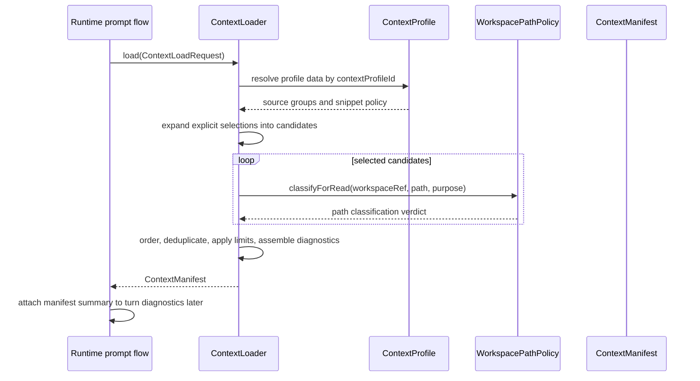

# Context Workspace Loading Source Generation Contract

Source-generation handoff for the first planned Codegeist context and workspace
loading contracts. This document is planned guidance only: it does not create Java
source, tests, packages, context readers, workspace reads, runtime behavior,
provider calls, tools, permissions, storage, shell execution, or UI behavior.

## Purpose And Status

`context-workspace-manifest.md` defines the broad blueprint for deterministic
context loading and workspace path validation. This handoff narrows that blueprint
into the first source-generation slice a later Java implementation task can build
with TDD.

The first source pass should create only the contracts needed to identify a
workspace, classify explicit candidate paths, interpret repository-owned context
profile data, order selected sources deterministically, and assemble an
explainable context manifest. It should stop before provider prompts, tool
execution, permission approval, patch/edit application, shell commands, storage
adapters, repository-wide search, embeddings, RAG, Graphify, Repomix, CLI/TUI
rendering, server transport, Vaadin, PF4J, or JBang.

## Current Baseline

The implemented Java application is still intentionally small.

| Area | Current state |
| --- | --- |
| Module | One Maven module under `app/codegeist/cli` |
| Implemented package | `ai.codegeist.app` only |
| Entrypoint | `CodegeistApplication` starts Spring Boot |
| Runtime/session/event source | Planned in documentation; not Java source yet |
| CLI prompt commands | Planned in documentation; not Java source yet |
| Context/workspace source | Not implemented |
| Tests | Spring Boot context-load test only |

All package names, Java types, records, enums, ports, and tests below are planned
source names. They are not current source files or implemented behavior.

## First-Wave Boundary

The first context/workspace source slice should own contract-level types for:

- Workspace identity and root metadata used by future runtime requests.
- Repo-relative path values and canonical path classification before any read.
- A small verdict vocabulary for allowed, skipped, and denied path outcomes.
- Repository-owned context profile data that supplies selected paths and source
  groups without hard-coding this repository's layout into Codegeist core.
- Explicit context load requests with selected sources only; no automatic
  repository-wide scan.
- Candidate expansion and deterministic ordering across runtime summaries,
  instructions, state, work items, knowledge, and source snippets.
- Metadata-first context manifests with included sources, skipped sources,
  warnings, limits, and redaction status.
- Typed contract failures for invalid workspace refs, invalid path values,
  unsupported source kinds, profile mismatches, and manifest assembly conflicts.

The slice should not open arbitrary files as an implementation detail of planning.
If the later source task needs minimal file metadata for tests, those reads must be
bounded, temporary-directory based, and guarded by workspace classification first.

## Planned Package Ownership

| Planned package | First-wave ownership | Must not own in the first source pass |
| --- | --- | --- |
| `ai.codegeist.workspace` | `WorkspaceRef`, workspace root identity, `WorkspacePath`, path classification ports, verdicts, and read-purpose metadata. | Permission prompts, external-directory approval, file mutation, patch application, shell cwd execution, provider calls, UI rendering. |
| `ai.codegeist.context` | Context profile records, source selections, candidate ordering, manifest records, warnings, limits, redaction status, context loading port, and typed context failures. | Runtime prompt execution, session mutation, event sequencing, provider prompts, tool policy, storage adapters, repository-specific path constants. |
| `ai.codegeist.runtime` | Supplies request identity, mode, session id, workspace ref, and later receives manifest diagnostics. | Context source expansion, path validation, file reading, profile interpretation, manifest ordering. |
| `ai.codegeist.session` and `ai.codegeist.event` | Later projection of manifest summaries or diagnostics once runtime owns the prompt turn. | Manifest assembly, workspace policy, context profile loading. |

`ai.codegeist.cli`, `ai.codegeist.tui`, `ai.codegeist.provider`,
`ai.codegeist.tool`, `ai.codegeist.permission`, `ai.codegeist.patch`,
`ai.codegeist.shell`, `ai.codegeist.storage`, `ai.codegeist.server`,
`ai.codegeist.ui.vaadin`, `ai.codegeist.extension`, Spring Shell, Spring AI,
Agent Utils, Graphify, and Repomix remain outside this first slice.

## Planned Workspace Contracts

The workspace layer should answer one narrow question before any future context
reader opens a candidate: is this path eligible for the requested context purpose
inside the active workspace?

| Planned shape | Package | First role |
| --- | --- | --- |
| `WorkspaceRef` | `ai.codegeist.workspace` | Typed workspace identity with a stable id and repository or worktree root. |
| `WorkspacePath` | `ai.codegeist.workspace` | Normalized repo-relative path value; never stores unchecked absolute user input. |
| `WorkspaceReadPurpose` | `ai.codegeist.workspace` | Small enum such as `CONTEXT_PROFILE`, `CONTEXT_SOURCE`, and `SOURCE_SNIPPET`. |
| `WorkspacePathVerdict` | `ai.codegeist.workspace` | Verdict enum for `ALLOWED`, `MISSING_OPTIONAL`, `OUTSIDE_ROOT`, `SYMLINK_ESCAPE`, `GENERATED`, `IGNORED`, `SECRET_LIKE`, and `UNSUPPORTED_SOURCE`. |
| `WorkspacePathClassification` | `ai.codegeist.workspace` | Result record with candidate path, normalized path when available, verdict, summary, and redaction status. |
| `WorkspacePathPolicy` | `ai.codegeist.workspace` | Port that classifies an explicit candidate path before any read. |

Initial verdicts must map directly to manifest skip reasons. Permission approval is
a later layer above workspace validation; the first workspace policy must not ask
the user to approve outside-root or secret-like reads.

## Planned Context Profile Contract

Codegeist core must treat repository-specific paths as profile data, not source
constants. This repository may select task docs, memory, local rules, or
third-party analysis notes through a profile, but another workspace may select
different files or no equivalent files.

| Planned profile field | Purpose |
| --- | --- |
| `profileId` | Identifies the profile used for the request and manifest. |
| `profileSource` | Names whether the profile came from repo config, generated workspace state, command output, or explicit user selection. |
| `instructionSources` | Profile-selected rule, command, or instruction files. |
| `stateSources` | Repo-owned memory or working-state files. |
| `workItemSources` | Task, issue, ticket, or active-work conventions. |
| `knowledgeSources` | Durable repository knowledge documents selected by the profile. |
| `sourceSnippetPolicy` | Allowed source snippet roots, maximum line ranges, and maximum bytes. |

Profile records should preserve provenance on each selected source:
`sourceGroup`, `selectionReason`, optional `priority`, optional `required`, and the
repo-relative path supplied by the profile. The core loader may validate,
order, and explain those entries, but it must not know that this repository uses
`docs/`, `.oc_local/`, `.opencode/`, or `docs/third-party/` conventions.

## Planned Context Request And Candidates

The future loader should accept explicit selections. It should not scan the whole
workspace, run search, invoke Graphify or Repomix, load embeddings, or discover
task files by convention.

| Planned shape | Package | First role |
| --- | --- | --- |
| `ContextLoadRequest` | `ai.codegeist.context` | Request id, workspace ref, mode, optional session id, optional active work path, profile id, and selected source groups. |
| `ContextProfile` | `ai.codegeist.context` | Repository-owned source groups and snippet policy data. |
| `ContextSourceSelection` | `ai.codegeist.context` | One requested profile source with kind, path, reason, required/optional flag, and requested order. |
| `SourceSnippetSelection` | `ai.codegeist.context` | Explicit source path plus bounded line range or byte limit. |
| `ContextCandidate` | `ai.codegeist.context` | Expanded candidate after profile interpretation and before workspace classification. |
| `ContextSourceKind` | `ai.codegeist.context` | `RUNTIME_SUMMARY`, `INSTRUCTION`, `STATE`, `WORK_ITEM`, `KNOWLEDGE`, and `SOURCE_SNIPPET`. |

`ContextLoadRequest` may reference runtime/session ids from the finalized runtime
contract, but context loading must not create or mutate sessions. The request is a
runtime-to-context boundary, not a Spring Shell DTO, HTTP payload, provider prompt,
or storage row.

## Deterministic Ordering

The loader should produce the same manifest order for the same request, profile,
and workspace state.

Initial ordering policy:

1. Runtime summary for request id, mode, session id when present, workspace id,
   and active work path when present.
2. Selected instruction sources, sorted by profile group and normalized path.
3. Selected state sources, sorted by normalized path.
4. Active work source, then other selected work-item sources sorted by normalized
   path.
5. Selected knowledge sources, sorted by normalized path.
6. Selected source snippets, sorted by normalized path and then requested range.

Deduplication should happen after workspace classification. If two allowed
candidates normalize to the same path, include one entry and preserve all
selection reasons. If denied or skipped duplicates appear, keep enough skipped
entries or warnings to explain every user-visible request reason.

## Planned Manifest Contract

The manifest is an explainability artifact. It should be safe to print in CLI
diagnostics or inspect through later server and Vaadin surfaces because it carries
metadata and bounded references rather than unlimited file payloads.

| Planned shape | Package | First role |
| --- | --- | --- |
| `ContextManifest` | `ai.codegeist.context` | Manifest id, request id, workspace ref, created time, ordering policy, included sources, skipped sources, warnings, and limits. |
| `IncludedContextSource` | `ai.codegeist.context` | Ordered included source metadata: kind, path, summary, reasons, size, optional line range, redaction status, and optional content ref. |
| `SkippedContextSource` | `ai.codegeist.context` | Skipped candidate metadata: kind, path when known, skip reason, summary, and redaction status. |
| `ContextSkipReason` | `ai.codegeist.context` | `GENERATED`, `IGNORED`, `HEAVY`, `MISSING_OPTIONAL`, `OUTSIDE_ROOT`, `SYMLINK_ESCAPE`, `SECRET_LIKE`, and `UNSUPPORTED_SOURCE`. |
| `ContextWarning` | `ai.codegeist.context` | Non-fatal diagnostic such as duplicate source, clamped range, source truncated, profile source missing, or stale profile. |
| `ContextLimits` | `ai.codegeist.context` | Applied source count, byte, line, or snippet limits. |
| `RedactionStatus` | `ai.codegeist.context` or `workspace` | `NOT_NEEDED`, `REDACTED`, or `BLOCKED_BEFORE_READ`. |

Manifest entries should reference bounded content through `contentRef` only when a
later implementation needs payload storage. The first source slice may keep
manifest creation metadata-only if that is enough to prove ordering and policy.

## Runtime Session Event Integration

Context loading attaches diagnostics to prompt handling; it does not own prompt
execution.



Integration rules:

- Runtime owns prompt acceptance, turn lifecycle, provider orchestration, and event
  sequencing.
- Context loading owns source selection, workspace classification requests,
  deterministic ordering, and manifest assembly.
- Session and event packages may later carry manifest summaries or diagnostic
  events, but they do not construct manifests.
- CLI and TUI adapters may later render manifest summaries, but they do not select
  profile defaults or validate paths.

## Boundary Rules

- Do not expose Spring Shell, Spring AI, Agent Utils, provider SDK, Maven, Vaadin,
  HTTP, PF4J, JBang, Graphify, Repomix, filesystem watcher, embedding, or RAG
  types from context or workspace contracts.
- Do not hard-code this repository's `docs/`, `docs/memory-bank/`, `.oc_local/`,
  `.opencode/`, task, third-party analysis, Graphify, or Repomix paths into
  Codegeist core.
- Do not prompt for permission during context loading. Permission approval belongs
  to later tool, patch/edit, shell, and external-directory workflows.
- Do not use context loading as a hidden provider prompt builder. Provider adapters
  receive Codegeist runtime/provider requests later.
- Do not mutate files, apply patches, execute shell commands, persist sessions, or
  publish events from the first context loader source slice.
- Do not copy OpenCode's Bun, TypeScript, Effect, config, file-tool, permission,
  watcher, storage, or package layout. Use OpenCode only as evidence for behavior
  and boundary risks.

## Illustrative Java Sketches

These snippets are examples only. They are not implemented source.

```java
package ai.codegeist.workspace;

import java.nio.file.Path;

public record WorkspaceRef(String value, Path root) {
}

public record WorkspacePath(String value) {
}

public enum WorkspacePathVerdict {
    ALLOWED,
    MISSING_OPTIONAL,
    OUTSIDE_ROOT,
    SYMLINK_ESCAPE,
    GENERATED,
    IGNORED,
    SECRET_LIKE,
    UNSUPPORTED_SOURCE
}

public interface WorkspacePathPolicy {
    WorkspacePathClassification classifyForRead(
            WorkspaceRef workspaceRef,
            Path candidatePath,
            WorkspaceReadPurpose purpose);
}
```

```java
package ai.codegeist.context;

import ai.codegeist.runtime.AgentMode;
import ai.codegeist.session.SessionId;
import ai.codegeist.workspace.WorkspaceRef;
import java.util.List;
import java.util.Optional;

public record ContextLoadRequest(
        ContextRequestId requestId,
        WorkspaceRef workspaceRef,
        AgentMode mode,
        Optional<SessionId> sessionId,
        Optional<ContextSourceSelection> activeWork,
        String contextProfileId,
        List<ContextSourceSelection> selectedInstructions,
        List<ContextSourceSelection> selectedState,
        List<ContextSourceSelection> selectedWorkItems,
        List<ContextSourceSelection> selectedKnowledge,
        List<SourceSnippetSelection> selectedSourceSnippets) {
}

public interface ContextLoader {
    ContextManifest load(ContextLoadRequest request);
}
```

```java
package ai.codegeist.context;

import ai.codegeist.workspace.WorkspaceRef;
import java.time.Instant;
import java.util.List;

public record ContextManifest(
        ContextManifestId manifestId,
        ContextRequestId requestId,
        WorkspaceRef workspaceRef,
        Instant createdAt,
        String orderingPolicy,
        ContextLimits limits,
        List<IncludedContextSource> includedSources,
        List<SkippedContextSource> skippedSources,
        List<ContextWarning> warnings) {
}

public sealed interface ContextContractFailure permits
        InvalidContextRequest,
        InvalidContextProfile,
        UnsupportedContextSource,
        ManifestAssemblyFailure {
    String summary();
}
```

## TDD Handoff

The later Java implementation task should add or update focused tests with the
source change. Documentation-only work in this task creates no tests.

First tests to write:

| Planned test | Proves |
| --- | --- |
| `WorkspacePathPolicyTests#allowsNormalizedPathInsideWorkspace` | A normal repo-relative candidate classifies as allowed without Spring or provider types. |
| `WorkspacePathPolicyTests#deniesOutsideRootBeforeRead` | Canonical outside-root candidates produce `OUTSIDE_ROOT` before file content is opened. |
| `WorkspacePathPolicyTests#deniesSymlinkEscapeBeforeRead` | Symlink escapes classify as `SYMLINK_ESCAPE` in a temporary workspace fixture. |
| `WorkspacePathPolicyTests#blocksSecretLikePathBeforeRead` | `.env`, local env, key, token, or credential-like paths produce `SECRET_LIKE` and `BLOCKED_BEFORE_READ`. |
| `ContextProfileTests#treatsRepositoryPathsAsProfileData` | Context profiles carry paths; Codegeist core does not embed this repository's docs or task layout. |
| `ContextOrderingTests#ordersSelectedSourcesDeterministically` | Same request/profile/workspace state yields stable source order. |
| `ContextOrderingTests#deduplicatesAllowedSourcesAfterClassification` | Duplicate normalized allowed paths produce one included entry with all reasons. |
| `ContextManifestTests#recordsMissingOptionalAndUnsupportedSourcesAsSkipped` | Optional missing and unsupported source candidates become typed skipped entries. |
| `ContextManifestTests#emitsWarningsForDuplicateAndTruncatedSources` | Non-fatal duplicate, range clamp, or limit conditions are visible as warnings. |
| `ContextBoundaryTests#doesNotExposeFrameworkOrExternalAnalysisTypes` | Public context/workspace contracts do not depend on Spring Shell, Spring AI, Agent Utils, Graphify, Repomix, provider SDK, storage, patch, shell, or UI types. |

Suggested first verification after implementation:

```bash
cd app/codegeist/cli
mvn --batch-mode --no-transfer-progress -Dtest=WorkspacePathPolicyTests test
mvn --batch-mode --no-transfer-progress -Dtest=ContextManifestTests test
```

Broader verification can remain `task test` once the focused contract tests pass.
No network, provider credentials, shell process execution, native-image build, or
repository mutation should be part of the first context/workspace tests.

## Deferrals

| Deferred behavior | Later owner |
| --- | --- |
| Provider prompt construction, streaming, model options, and tool-call mediation | `T003_08`, `T003_13` |
| Tool registry, permission requests, approval scopes, and tool result bounding | `T003_09` |
| Patch/edit proposal review and apply-result behavior | `T003_10` |
| Controlled shell request validation, execution, timeout, and bounded output | `T003_11` |
| Storage ports, continuation, file-backed persistence, and artifact references | `T003_12` |
| End-to-end agent loop with provider, context, tools, permissions, and projections | `T003_13` |
| OpenCode-style CLI/TUI parity workflows and manifest rendering | `T003_14` |
| Native, packaging, startup, binary smoke, and release checks | `T003_15` |
| Core replacement readiness | `T003_16` |

## Later Implementation Checklist

Before creating context/workspace Java source, the later source task should verify:

- The task is explicitly source-generating and no longer documentation-only.
- Runtime/session/event contracts exist or the task creates only the minimal typed
  references it needs without reading workspace files from runtime.
- Tests are written first or the solve result records why test-first work was not
  reasonable.
- Workspace path tests use temporary directories and do not mutate this repository.
- Repository-specific path defaults enter through profile fixtures, not production
  constants.
- Public context/workspace contracts use Codegeist records, enums, sealed
  interfaces, and ports rather than framework or external-analysis types.
- Verification reports targeted Maven/JUnit commands, approximate duration, and
  whether broader `task test` was run.
