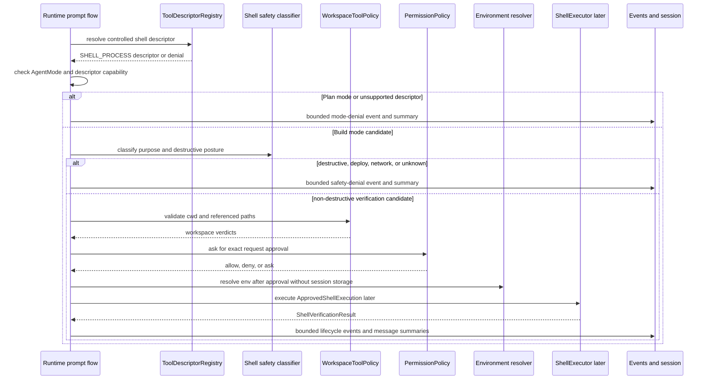

# Controlled Shell Tool Source Generation Contract

Source-generation handoff for the first planned Codegeist controlled shell
verification Java contracts. This document is planned guidance only: it does not
create Java source, tests, packages, shell commands, process executors, process
execution, Spring beans, runtime behavior, tool execution, permission behavior,
workspace behavior, storage, patch/edit behavior, or UI behavior.

## Purpose And Status

`shell-verification-contracts.md` defines the broad blueprint for future
Codegeist controlled shell verification requests, safety gates, workspace-cwd
validation, typed failures, and bounded output. This handoff narrows that
blueprint into the first source-generation slice a later Java implementation task
can build with TDD.

The first source pass should create only the contract-level types needed to
represent a controlled shell verification request, classify command shape and
purpose, bind exact approval to one redacted request summary, hand off to an
executor after all gates pass, and map bounded stdout/stderr results into events
and session summaries. It should stop before real process execution, PTY or
terminal UI, shell sandboxing, broad allowlists, storage, TUI, server transport,
Vaadin, PF4J, JBang, Graphify, Repomix, or an end-to-end agent loop.

## Current Baseline

The implemented Java application is still intentionally small.

| Area | Current state |
| --- | --- |
| Module | One Maven module under `app/codegeist/cli` |
| Implemented package | `ai.codegeist.app` only |
| Entrypoint | `CodegeistApplication` starts Spring Boot |
| Tool/permission/workspace source | Planned in documentation; not Java source yet |
| Patch/edit source | Planned in documentation; not Java source yet |
| Shell verification source | Not implemented |
| Tests | Spring Boot context-load test only |

All package names, Java types, records, enums, ports, policy classes, and tests
below are planned source names. They are not current source files or implemented
behavior.

## First-Wave Boundary

The first controlled shell source slice should own contract-level types for:

- Shell request identity, originating session/turn/request metadata, command
  shape, command purpose, destructive posture, workspace cwd, environment policy,
  stdin policy, timeout, output limit, and redacted command summary.
- `argv` and explicitly marked shell-snippet command shapes, with snippets treated
  as higher risk even after permission approval.
- Controlled command posture for verification, build, test, read-only inspection,
  workspace mutation, destructive, deploy, network, and unknown commands.
- Approved executor handoff after descriptor resolution, mode check, safety
  classification, workspace-cwd validation, exact permission approval,
  environment resolution, timeout, stdin, and output-limit gates pass.
- Shell result status, exit-code, timeout, cancellation, stdout/stderr summary,
  output reference, typed failure, recoverability, and audit metadata shapes.
- Runtime/session/event integration contracts for shell lifecycle summaries without
  making shell verification own event sequencing or persistence.

The first source pass should not implement a process runner. A request can be
represented, denied, marked approval-required, or mapped to a fake-executor result
without starting a local process.

## Planned Package Ownership

| Planned package | First-wave ownership | Must not own in the first source pass |
| --- | --- | --- |
| `ai.codegeist.shell` | Shell request ids, command shapes, command purpose, destructive posture, cwd wrapper, environment/stdin policy, output limits, approved execution handoff, result status, output summaries, typed failures, and executor port. | Generic tool descriptors, generic permission policy, generic workspace path policy, real process start, PTY, terminal UI, shell sandboxing, storage, provider calls. |
| `ai.codegeist.tool` | Later exposes shell verification as a classified built-in `SHELL_PROCESS` descriptor with strict mode, permission, workspace, and result limits. | Shell command parsing, shell safety classification details, process execution, stdout/stderr capture. |
| `ai.codegeist.permission` | Later evaluates permission requests and decisions for the exact redacted shell request summary. | Command classification, workspace-cwd validation, environment resolution, process execution. |
| `ai.codegeist.workspace` | Later validates command cwd, referenced workspace paths, output-reference targets, generated/ignored/secret-like posture, symlink escapes, and external-directory candidates. | Shell request ownership, permission approval, process execution, output capture. |
| `ai.codegeist.runtime` | Later coordinates descriptor lookup, Plan-mode denial, Build-mode gate order, permission decisions, shell executor handoff, lifecycle events, cancellation, and session summaries. | Process API internals, command parser internals, terminal UI, output-reference backing store. |
| `ai.codegeist.session` and `ai.codegeist.event` | Later carry bounded shell lifecycle summaries created by runtime. | Shell policy, permission policy, workspace validation, executor internals, output storage. |

`ai.codegeist.cli`, `ai.codegeist.tui`, `ai.codegeist.provider`,
`ai.codegeist.context`, `ai.codegeist.patch`, `ai.codegeist.storage`,
`ai.codegeist.server`, `ai.codegeist.ui.vaadin`, `ai.codegeist.extension`, Spring
Shell, Spring AI, Agent Utils, MCP, PF4J, JBang, Graphify, and Repomix remain
outside this first source slice.

## OpenCode Evidence And Translation

OpenCode is a behavior reference, not an implementation blueprint.

| OpenCode source | Translation for Codegeist |
| --- | --- |
| `docs/third-party/opencode/source/packages/opencode/src/tool/shell.ts` | OpenCode parses shell commands, scans path-like arguments, requests external-directory and shell permissions, resolves cwd, builds env, ignores stdin, executes with timeout/abort handling, streams output, and records truncation metadata. Codegeist should split those concerns into planned request contracts, gate order, executor handoff, and typed result summaries. |
| `docs/third-party/opencode/source/packages/opencode/src/tool/tool.ts` | Tool execution wraps schema validation, session/message/call ids, permission ask hooks, metadata updates, and output truncation. Codegeist shell verification should specialize the generic planned `ToolRequest` lifecycle rather than bypassing tool policy. |
| `docs/third-party/opencode/source/packages/opencode/src/tool/truncate.ts` | OpenCode caps output by line/byte limits and writes large output out-of-band. Codegeist should use bounded stdout/stderr summaries plus `OutputRef` values instead of storing full logs in session parts. |
| `docs/third-party/opencode/source/packages/opencode/src/permission/index.ts` | OpenCode permission asks carry permission names, patterns, metadata, session ids, and once/always/reject replies. Codegeist should bind approval to one redacted shell request with explicit scope and expiry posture. |

## Planned Request Contracts

Shell contracts should describe what runtime may ask to run before any executor is
available.

| Planned shape | Package | First role |
| --- | --- | --- |
| `ShellRequestId` | `ai.codegeist.shell` | Stable id for approval, executor handoff, events, and session summaries. |
| `ShellVerificationRequest` | `ai.codegeist.shell` | Request id, session id, turn id, mode, correlation id, command shape, purpose, destructive posture, cwd, env policy, stdin policy, timeout, output limit, and redacted summary. |
| `ShellCommandShape` | `ai.codegeist.shell` | Sealed command shape implemented first by `ArgvCommand` and `ShellSnippet`. |
| `ArgvCommand` | `ai.codegeist.shell` | Structured command vector preferred for tests, builds, linters, and diagnostics. |
| `ShellSnippet` | `ai.codegeist.shell` | Explicitly marked shell snippet with redacted summary and stricter safety classification. |
| `ShellCommandPurpose` | `ai.codegeist.shell` | First values such as `VERIFY`, `BUILD`, `TEST`, `INSPECT`, `MUTATE_WORKSPACE`, `DEPLOY`, `NETWORK`, and `UNKNOWN`. |
| `DestructivePosture` | `ai.codegeist.shell` | First values such as `NON_DESTRUCTIVE`, `REQUIRES_EXPLICIT_INTENT`, `DENIED_BY_DEFAULT`, and `UNKNOWN`. |
| `WorkspaceCommandCwd` | `ai.codegeist.shell` | Shell-specific view of a planned workspace command-cwd target and workspace verdict. |
| `ShellEnvPolicy` | `ai.codegeist.shell` | Inherited, allowed, removed, forced, and redacted variable names without storing resolved values in session state. |
| `StdinPolicy` | `ai.codegeist.shell` | First values such as `IGNORE`, `EMPTY`, and `DENY_INTERACTIVE`. |
| `ShellOutputLimit` | `ai.codegeist.shell` | Inline stdout/stderr preview limits and output-reference requirement metadata. |

Request rules:

- Plan mode denies every shell execution request, including read-only inspection.
- Build mode can only become an approval candidate after descriptor, mode, safety,
  cwd, referenced-path, timeout, stdin, environment, and output-limit checks pass.
- `argv` is preferred for structured verification commands. Shell snippets must be
  explicitly marked and treated as stricter, less replayable inputs.
- Permission approval is scoped to the exact redacted command summary, cwd,
  purpose, timeout, stdin posture, environment posture, and output limit.
- Resolved environment values, raw snippets, full command output, provider payloads,
  stack traces, credentials, and secret values must not enter session-ready records.

## Planned Gate Order

Runtime owns gate sequencing. Shell records provide facts and typed outcomes only.



Gate rules:

- Mode denial happens before permission prompts.
- Safety classification happens before permission prompts so destructive commands
  cannot hide inside generic shell approval.
- Workspace-cwd and referenced-path validation happen before process start and
  reuse the planned `WorkspaceToolPolicy` boundary.
- Permission approval cannot override mode denial, safety denial, deterministic
  workspace denial, disabled descriptors, descriptor limits, stdin denial,
  environment policy, timeout policy, or output limits.
- Environment resolution happens after approval but before executor handoff; only
  variable posture and redaction metadata are session-ready.
- Cancellation belongs to runtime coordination and executor handoff, not to
  permission, workspace, or session storage.

## Controlled Command Posture

| Command posture | Plan mode | Build mode | Contract posture |
| --- | --- | --- | --- |
| Verification, test, or lint command | Deny | Ask | Allowed only with validated workspace cwd, non-destructive classification, timeout, stdin denial, bounded output, and exact approval. |
| Build command | Deny | Ask | Allowed only when non-destructive and workspace-scoped; generated outputs still follow workspace policy. |
| Read-only inspection command | Deny | Ask | Still process execution, so it is not treated as a file-read tool. |
| Workspace mutation command | Deny | Requires explicit intent | Prefer patch/edit contracts for file mutation; generic shell approval is not enough. |
| Destructive command | Deny | Deny by default | Requires a later explicit destructive-command workflow outside this first slice. |
| Deployment or network command | Deny | Deny by default | Requires future external-integration policy and user intent. |
| Unknown command shape | Deny | Deny by default | Must be classified before execution. |

The initial tool should be named and documented as a verification tool rather
than a general-purpose terminal.

## Planned Approval And Executor Handoff

| Planned shape | Package | First role |
| --- | --- | --- |
| `ApprovedShellExecution` | `ai.codegeist.shell` | Exact request id, permission decision id, validated cwd, command shape, timeout, stdin policy, resolved environment handle, output limits, and audit metadata passed to an executor after all gates pass. |
| `ShellExecutor` | `ai.codegeist.shell` | Port for future fake and real executors. The first implementation should use a fake executor before adding a local process runner. |
| `ShellExecutionEnvironment` | `ai.codegeist.shell` | Redacted environment handoff metadata; resolved values are executor-private and not session-ready. |

Executor-handoff rules:

- `ApprovedShellExecution` must be impossible to construct from a raw command alone;
  it needs request id, workspace verdict, permission decision, env policy, timeout,
  stdin policy, and output limit facts.
- A fake executor should prove timeout, cancellation, non-zero exit, output
  overflow, and stdout/stderr summary behavior before a real process runner exists.
- Real process execution, PTY, terminal UI, remote execution, JBang execution,
  shell sandboxing, and broad allowlists are later tasks.

## Planned Result And Failure Contracts

| Planned shape | Package | First role |
| --- | --- | --- |
| `ShellVerificationResult` | `ai.codegeist.shell` | Request id, status, optional exit code, elapsed time, output summary, output refs, optional failure, and audit metadata. |
| `ShellResultStatus` | `ai.codegeist.shell` | First values such as `DENIED`, `APPROVAL_REQUIRED`, `STARTED`, `COMPLETED`, `FAILED`, `CANCELLED`, and `TIMED_OUT`. |
| `ShellOutputSummary` | `ai.codegeist.shell` | Redacted title, stdout preview, stderr preview, truncation flag, optional byte/line counts, and output refs. |
| `ShellFailure` | `ai.codegeist.shell` | Typed failure kind, redacted message, recoverability, optional remediation, affected request metadata, and audit flag. |
| `ShellFailureKind` | `ai.codegeist.shell` | Distinguishes mode denied, safety denied, permission denied, workspace denied, invalid command shape, invalid cwd, invalid env policy, stdin denied, timeout, cancellation, non-zero exit, output overflow, executor unavailable, and unexpected process failure. |

Result rules:

- `exitCode` is present only when a process actually exits.
- `TIMEOUT` and `CANCELLED` can have no exit code.
- Non-zero exit is a typed verification result, not necessarily an untyped system
  defect.
- Stdout and stderr summaries should remain separate when the future executor can
  capture them separately.
- Large output uses `OutputRef` values from the planned bounded-result contract.
- Failure messages are redacted and must not include raw environment values,
  credentials, full command output, stack traces, provider payloads, raw snippets,
  or unbounded logs.

## Runtime, Session, And Event Integration

Runtime owns gate ordering, cancellation, event sequencing, and session projection.
Shell contracts provide request and result facts only.

Initial event families for later runtime expansion should map to the finalized
runtime/session/event source contract without making shell publish events directly:
`SHELL_REQUESTED`, `SHELL_DENIED_BY_MODE`, `SHELL_DENIED_BY_SAFETY`,
`SHELL_PERMISSION_REQUESTED`, `SHELL_DENIED_BY_PERMISSION`,
`SHELL_DENIED_BY_WORKSPACE`, `SHELL_STARTED`, `SHELL_OUTPUT_PROGRESS`,
`SHELL_COMPLETED`, `SHELL_FAILED`, `SHELL_CANCELLED`, and
`SHELL_OUTPUT_TRUNCATED`.

Session message parts should store bounded `SHELL_CALL`, `APPROVAL_REFERENCE`,
`SHELL_RESULT`, `WARNING`, and `ERROR` summaries. They should not store full
stdout, full stderr, raw command snippets, resolved environment maps, provider
payloads, process handles, stack traces, credentials, or secret values.

## Boundary Rules

- Do not create Java source, Java tests, package directories, Maven changes,
  Taskfile commands, Spring beans, CLI commands, TUI behavior, runtime services,
  provider calls, Spring AI tool callbacks, permission approval, workspace policy
  code, storage adapters, patch/edit behavior, process executor ports, real process
  runners, PTY, terminal UI, remote execution, JBang execution, shell sandboxing,
  Graphify, Repomix, or native/build behavior in this documentation slice.
- Do not let shell contracts own generic tool descriptors, generic permission
  decisions, generic workspace validation, provider invocation, runtime prompt
  execution, session lifecycle, event sequencing, CLI parsing, context loading,
  patch/edit apply, storage persistence, TUI rendering, server routes, Vaadin,
  PF4J, or JBang behavior.
- Do not expose Spring Shell, Spring AI, Agent Utils, provider SDK, OpenCode, MCP,
  PF4J, JBang, shell, process, terminal, filesystem, storage, Vaadin, or HTTP
  implementation types through Codegeist shell contracts.
- Do not copy OpenCode's TypeScript, Bun, Effect, shell parser, process runner,
  permission rules, external-directory prompts, truncation implementation, event
  bus, file watcher, or storage shape. Use OpenCode only as a behavior reference.

## Future File Map

These are illustrative implementation targets only and should not be created until
a later Java task requires them.

```text
app/codegeist/cli/src/main/java/ai/codegeist/shell/ShellRequestId.java
app/codegeist/cli/src/main/java/ai/codegeist/shell/ShellVerificationRequest.java
app/codegeist/cli/src/main/java/ai/codegeist/shell/ShellCommandShape.java
app/codegeist/cli/src/main/java/ai/codegeist/shell/ArgvCommand.java
app/codegeist/cli/src/main/java/ai/codegeist/shell/ShellSnippet.java
app/codegeist/cli/src/main/java/ai/codegeist/shell/ShellCommandPurpose.java
app/codegeist/cli/src/main/java/ai/codegeist/shell/DestructivePosture.java
app/codegeist/cli/src/main/java/ai/codegeist/shell/WorkspaceCommandCwd.java
app/codegeist/cli/src/main/java/ai/codegeist/shell/ShellEnvPolicy.java
app/codegeist/cli/src/main/java/ai/codegeist/shell/StdinPolicy.java
app/codegeist/cli/src/main/java/ai/codegeist/shell/ShellOutputLimit.java
app/codegeist/cli/src/main/java/ai/codegeist/shell/ApprovedShellExecution.java
app/codegeist/cli/src/main/java/ai/codegeist/shell/ShellExecutor.java
app/codegeist/cli/src/main/java/ai/codegeist/shell/ShellVerificationResult.java
app/codegeist/cli/src/main/java/ai/codegeist/shell/ShellResultStatus.java
app/codegeist/cli/src/main/java/ai/codegeist/shell/ShellOutputSummary.java
app/codegeist/cli/src/main/java/ai/codegeist/shell/ShellFailure.java
app/codegeist/cli/src/main/java/ai/codegeist/shell/ShellFailureKind.java
app/codegeist/cli/src/test/java/ai/codegeist/shell/ShellRequestContractTests.java
app/codegeist/cli/src/test/java/ai/codegeist/shell/ShellPolicyGateOrderTests.java
app/codegeist/cli/src/test/java/ai/codegeist/shell/ShellResultShapeTests.java
app/codegeist/cli/src/test/java/ai/codegeist/shell/ShellEventProjectionContractTests.java
```

## Illustrative Java Sketches

These snippets are examples only. They are not implemented source.

```java
record ShellVerificationRequest(
    ShellRequestId requestId,
    SessionId sessionId,
    TurnId turnId,
    AgentMode mode,
    CorrelationId correlationId,
    ShellCommandShape commandShape,
    ShellCommandPurpose purpose,
    DestructivePosture destructivePosture,
    WorkspaceCommandCwd cwd,
    ShellEnvPolicy envPolicy,
    StdinPolicy stdinPolicy,
    Duration timeout,
    ShellOutputLimit outputLimit,
    RedactedCommandSummary summary
) {}

sealed interface ShellCommandShape permits ArgvCommand, ShellSnippet {}

record ArgvCommand(List<String> argv, RedactedCommandSummary summary)
    implements ShellCommandShape {}

record ShellSnippet(String snippet, RedactedCommandSummary summary)
    implements ShellCommandShape {}
```

```java
record ApprovedShellExecution(
    ShellRequestId requestId,
    PermissionDecisionId permissionDecisionId,
    ShellCommandShape commandShape,
    WorkspaceCommandCwd cwd,
    ShellEnvPolicy envPolicy,
    StdinPolicy stdinPolicy,
    Duration timeout,
    ShellOutputLimit outputLimit
) {}

interface ShellExecutor {
    ShellVerificationResult execute(ApprovedShellExecution execution);
}
```

```java
record ShellVerificationResult(
    ShellRequestId requestId,
    ShellResultStatus status,
    OptionalInt exitCode,
    Duration elapsed,
    ShellOutputSummary summary,
    List<OutputRef> outputRefs,
    Optional<ShellFailure> failure,
    boolean auditRelevant
) {}

enum ShellFailureKind {
    MODE_DENIED,
    SAFETY_DENIED,
    PERMISSION_DENIED,
    WORKSPACE_DENIED,
    INVALID_COMMAND_SHAPE,
    INVALID_CWD,
    INVALID_ENV_POLICY,
    STDIN_DENIED,
    TIMEOUT,
    CANCELLED,
    NON_ZERO_EXIT,
    OUTPUT_OVERFLOW,
    EXECUTOR_UNAVAILABLE,
    UNEXPECTED_PROCESS_FAILURE
}
```

The exact Java constructor validation, safety-classifier implementation,
environment resolver, fake-executor shape, output-reference backing store, and
real process API belong to later implementation tasks.

## TDD Handoff

No tests are created by this documentation task. Later implementation tasks should
prefer deterministic plain-JVM contract and fake-executor tests before Spring
context tests or a real process runner.

| Test area | What to prove | Runtime side effects needed |
| --- | --- | --- |
| Request construction | Request id, session/turn metadata, command shape, purpose, cwd, env posture, stdin policy, timeout, and output limit can be represented without execution. | No |
| Command shape | `argv` and explicitly marked shell snippets are distinct, redacted, and classified differently. | No |
| Plan-mode denial | Plan mode denies every shell request before permission prompts. | No |
| Build-mode approval | Build-mode verification commands require exact approval for command summary, cwd, purpose, timeout, stdin, env posture, and output limit. | No process runner if tested at policy boundary |
| Destructive posture | Destructive, deploy, network, workspace-mutating, and unknown command categories are not allowed from generic shell approval. | No |
| Workspace cwd validation | Outside-root, symlink escape, generated, ignored, secret-like, missing, and external-directory cwd cases map to typed denials. | No |
| Approval not override | Permission approval cannot override mode denial, safety denial, workspace denial, stdin denial, disabled descriptors, or result limits. | No |
| Env redaction | Secret-like env names are removed or redacted from events, logs, and session parts. | No |
| Stdin posture | Interactive stdin is denied or ignored by default. | Fake executor only |
| Timeout and cancellation | Timeout and cancellation return typed results without requiring an exit code. | Fake executor first |
| Non-zero exit shape | Non-zero exit returns exit code and typed failure without becoming an untyped defect. | Fake executor first |
| Bounded stdout/stderr | Large stdout/stderr produce separate summaries, truncation metadata, and `OutputRef` values. | Fake executor only |
| Event/session projection | Shell lifecycle outcomes can be represented as bounded runtime events and session message parts without shell publishing events directly. | No |
| Type isolation | Shell contracts expose Codegeist types only, not Spring Shell, Spring AI, provider SDK, OpenCode, process, terminal, filesystem, or shell implementation types. | No |

Targeted verification for the later Java implementation should start with
class-level or method-level Maven selectors for the new shell contract tests, then
broaden to `task test` only after the narrow tests pass. Real process, terminal,
PTY, live provider, native, remote execution, and UI checks should remain explicit
and separate.

## Deferrals

- `T003_09` owns generic tool descriptors, permission policy, workspace target
  validation, bounded results, output references, and provider tool-call mediation.
- `T003_10` owns patch/edit proposal and apply-result source-generation details;
  shell verification must not become the default mutation path for file edits.
- `T003_12` owns storage ports, session continuation, projection storage, artifact
  references, storage health, redaction, and persistence deferral criteria.
- `T003_13` owns end-to-end prompt orchestration with providers, tools,
  permissions, workspace gates, patch/edit apply coordination, shell verification,
  and session/event projection.
- Real process execution, PTY or terminal UI, remote execution, shell sandboxing,
  destructive-command workflows, network/deploy commands, CLI/TUI parity workflows,
  packaging/native validation, PF4J, JBang, Vaadin, server, API, MCP, Graphify,
  Repomix, and extension tasks must attach through these policy boundaries instead
  of bypassing them.

## Later Implementation Checklist

Before a future Java source task marks the first controlled shell slice solved, it
should prove:

- Shell request, command shape, approval handoff, executor port, result, failure,
  summary, and output-reference contracts exist only in their planned packages.
- Shell contracts use Codegeist records, enums, sealed interfaces, and small ports,
  not Spring Shell, Spring AI, provider SDK, OpenCode, MCP, PF4J, JBang, process,
  terminal, filesystem, storage, Vaadin, or HTTP implementation types.
- Plan-mode denial, Build-mode approval binding, destructive posture denial,
  workspace-cwd denial, env redaction, stdin denial, timeout, cancellation,
  non-zero exit, bounded stdout/stderr summaries, and output references are covered
  by focused tests.
- The implementation uses fake executors until a task explicitly owns real local
  process execution.
- No real process runner, PTY, terminal UI, shell sandbox, broad allowlist,
  destructive workflow, provider call, approval UI, storage adapter, plugin/script
  execution, or end-to-end agent loop slips into the first contract slice.
