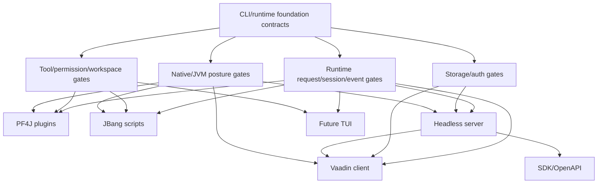

# Extension And Client Readiness Gates

Blueprint for deciding when deferred PF4J, JBang, headless server, Vaadin,
SDK/OpenAPI, and future TUI surfaces are ready for implementation.

## Scope

This document specifies planned readiness gates only. It does not describe
implemented Java source, Maven modules, dependencies, adapters, server routes,
Vaadin views, PF4J plugins, JBang scripts, SDK generation, TUI behavior, tests,
or runtime behavior.

The immediate purpose is to keep later extension and client work deferred until
the core CLI/runtime foundation has enough contracts to receive those surfaces
without moving ownership out of the runtime.

## Decision

Defer all extension and non-CLI client surfaces until their gate is satisfied.

Readiness means a later implementation task can point to already-defined core
contracts for runtime requests, sessions, events, tools, permissions, workspace
validation, storage, authentication posture, and native compatibility. If a gate
is not satisfied, the later surface remains JVM-first or not implemented rather
than expanding the MVP foundation scope.

## Evidence

### Codegeist Foundation Inputs

| Input | Gate lesson |
| --- | --- |
| `docs/developer/specification/runtime-session-event-contracts.md` | Server, Vaadin, TUI, SDK, PF4J, and JBang requests must enter through runtime-owned prompt/session/event contracts instead of mutating client state directly. |
| `docs/developer/specification/tool-permission-workspace-contracts.md` | Plugin tools, script tools, server-triggered tools, and client approval actions must flow through descriptors, mode checks, permission policy, workspace validation, bounded results, events, and session summaries. |
| `docs/developer/specification/shell-verification-contracts.md` | JBang and any process-like extension path must satisfy the controlled shell/process posture before executing external commands or scripts. |
| `docs/developer/specification/storage-port-posture.md` | Server and Vaadin surfaces need explicit storage adapter, redaction, retention, artifact, concurrency, and auth posture before depending on durable session/event state. |
| `docs/developer/specification/native-packaging-posture.md` | PF4J, JBang, server, Vaadin, provider, shell/process, and storage surfaces stay JVM-first until their own tasks prove native compatibility and record `passed`, `skipped`, or `failed`. |
| `docs/developer/specification/codegeist-opencode-parity.md` | PF4J and JBang may contribute commands, tools, skills, hooks, or integrations, while server, Vaadin, and future TUI clients render and submit work through the same runtime. None of these surfaces owns runtime orchestration. |

### OpenCode Feature Evidence

OpenCode is a behavior reference, not an implementation blueprint.

| Source | Relevant lesson for Codegeist |
| --- | --- |
| `docs/third-party/opencode/source/packages/opencode/src/tool/registry.ts` | OpenCode gathers built-in, plugin, dynamic, and model-exposed tools through a registry and filters them before exposure. Codegeist should require extension contributions to register through Codegeist descriptors before model or user exposure. |
| `docs/third-party/opencode/source/packages/opencode/src/plugin` | OpenCode plugins can contribute behavior through a plugin service and hooks. Codegeist should keep plugin lifecycle and hooks behind runtime-owned extension mediation instead of making plugin code trusted by default. |
| `docs/third-party/opencode/source/packages/opencode/src/tool/shell.ts` | Process execution has cwd, env, timeout, permission, output, and plugin-hook concerns. Codegeist should treat JBang scripts as process-like, high-risk tools until shell/process gates are satisfied. |
| `docs/third-party/opencode/source/packages/opencode/src/v2/auth.ts` | Auth material is stored and handled as a dedicated concern. Codegeist server and SDK gates should require an explicit auth and secret posture before exposing remote APIs. |
| `docs/third-party/opencode/source/packages/opencode/src/server` | OpenCode exposes runtime capabilities through server routes. Codegeist should translate this into an adapter over runtime APIs, not an alternate runtime implementation. |
| `docs/third-party/opencode/source/packages/opencode/src/v2/session-event.ts` and `v2/session-message.ts` | Clients can render timeline and activity from event and message projections. Codegeist server, Vaadin, and TUI clients should consume the same event/session model. |

## Gate Overview



The gates are conjunctive. A later task should not implement a surface by
satisfying only the easiest gate.

## Shared Readiness Checklist

Every deferred surface needs these items before implementation starts:

| Gate | Required evidence before implementation |
| --- | --- |
| Runtime API | A stable request boundary exists for the action, including source client, mode, session/turn correlation, and error shape. |
| Session and event model | The surface can render or record results through session parts and runtime events without owning state transitions. |
| Tool and permission policy | Side effects are described as tool requests with mode compatibility, permission decisions, workspace targets, bounded results, and audit metadata. |
| Workspace posture | Workspace reads, writes, cwd values, output refs, generated/ignored paths, secret-like paths, and external directories have deterministic validation rules. |
| Storage posture | Durable data needs are explicit, redacted, bounded, retention-aware, and backed by a selected adapter when persistence is required. |
| Auth and security posture | Remote, UI, SDK, plugin, and script entrypoints have an explicit actor, trust, secret, permission, and audit model. |
| Native posture | JVM-only, native `passed`, native `skipped`, or native `failed` status is recorded with an owner and blocker when applicable. |
| Test posture | Future contract tests can prove the gate without creating broad integration behavior first. |

## PF4J Readiness Gate

PF4J is the packaged plugin surface for tools, commands, skills, hooks, and
integrations. It is not a replacement for runtime services.

PF4J implementation may start only when:

- Runtime exposes explicit extension contribution points without letting plugins
  mutate sessions, publish state-transition events, or bypass mode policy.
- `ToolDescriptor` registration can classify plugin-provided tools by source,
  capability, mode compatibility, permission need, workspace need, result limits,
  and audit posture.
- Plugin lifecycle has an isolation policy for class loading, dependency
  conflicts, disable/unload behavior, version compatibility, and failed startup.
- Permission and workspace gates run before any plugin-contributed side effect.
- Plugin metadata has a trust posture: origin, enabled status, requested
  capabilities, and redacted configuration are visible before activation.
- Native status is recorded as JVM-only until PF4J dynamic loading, reflection,
  service loading, and resource hints are proven.

Future file map, illustrative only:

```text
app/codegeist/cli/src/main/java/ai/codegeist/extension/ExtensionContribution.java
app/codegeist/cli/src/main/java/ai/codegeist/extension/pf4j/Pf4jExtensionLoader.java
app/codegeist/cli/src/test/java/ai/codegeist/extension/Pf4jContributionContractTests.java
```

## JBang Readiness Gate

JBang is the lightweight script extension surface for repository-local Java
scripts. It is process-like and untrusted by default.

JBang implementation may start only when:

- Script discovery, metadata, arguments, dependency declarations, and remote
  loading policy are specified before execution exists.
- Every script execution maps to a `ToolRequest` or command contribution with a
  declared capability, permission need, workspace target, cwd, env, stdin,
  timeout, cancellation, and bounded output policy.
- The controlled shell/process posture is satisfied for command execution,
  process lifecycle, stdout/stderr limits, `OutputRef` handling, and typed
  failures.
- Dependency trust, cache location, generated artifacts, and secret handling are
  explicit.
- Plan mode denies execution by default; Build mode asks after classification.
- Native status is recorded as JVM/process-dependent until JBang behavior is
  validated under the selected packaging mode.

Future file map, illustrative only:

```text
app/codegeist/cli/src/main/java/ai/codegeist/extension/jbang/JBangScriptDescriptor.java
app/codegeist/cli/src/main/java/ai/codegeist/extension/jbang/JBangExecutionRequest.java
app/codegeist/cli/src/test/java/ai/codegeist/extension/jbang/JBangSafetyContractTests.java
```

## Headless Server Readiness Gate

The server surface is a later adapter over the same runtime. It must not own
runtime orchestration, session mutation, provider calls, tool execution, storage
policy, or permission policy.

Server implementation may start only when:

- Runtime APIs can create, continue, cancel, inspect, and stream session work
  without importing HTTP request/response types into core contracts.
- Session/event projection can support remote clients through a chosen transport
  such as server-sent events, WebSocket, or a simple polling contract.
- Authentication, actor identity, authorization, rate limiting, cross-origin
  posture, and secret handling are explicitly selected.
- Storage posture selects an adapter that can handle the server's concurrency,
  retention, redaction, artifact, and audit needs.
- Permission requests can be rendered and answered by remote clients without
  making client UI the source of truth.
- Native status is recorded separately from the CLI baseline.

Future file map, illustrative only:

```text
app/codegeist/server/src/main/java/ai/codegeist/server/RuntimeController.java
app/codegeist/server/src/main/java/ai/codegeist/server/RuntimeEventStream.java
app/codegeist/server/src/test/java/ai/codegeist/server/RuntimeApiContractTests.java
```

## Vaadin Readiness Gate

Vaadin is a later Java web client for sessions, approvals, event display, and tool
results. It must remain a client projection over runtime and server contracts.

Vaadin implementation may start only when:

- Runtime/session/event APIs are stable enough for a browser client to render
  sessions, turns, message parts, tool progress, warnings, errors, and approvals.
- The server or direct runtime adapter choice is explicit, including transport and
  authentication boundaries.
- Approval screens collect user decisions but do not own permission policy,
  decision scope, audit metadata, or workspace validation.
- Storage and artifact references can support refresh, reconnect, and bounded
  output display without storing raw secrets or unbounded logs in UI state.
- Vaadin dependency weight and native-image posture are evaluated separately from
  the CLI foundation.

Future file map, illustrative only:

```text
app/codegeist/server/src/main/java/ai/codegeist/ui/vaadin/SessionView.java
app/codegeist/server/src/main/java/ai/codegeist/ui/vaadin/ApprovalPanel.java
app/codegeist/server/src/test/java/ai/codegeist/ui/vaadin/SessionViewContractTests.java
```

## SDK And OpenAPI Readiness Gate

SDK/OpenAPI work depends on the server contract. It should not freeze DTOs before
runtime semantics, auth, errors, events, and storage posture are stable.

SDK/OpenAPI implementation may start only when:

- Server request/response and streaming contracts exist and are stable enough to
  version.
- Auth, permission, and audit semantics are represented explicitly in API shapes.
- Error and failure payloads are typed and redacted.
- Session/event projection is stable enough for client generation without leaking
  provider SDK, Vaadin, PF4J, JBang, or storage adapter types.
- Versioning and compatibility policy are selected.

## Future TUI Readiness Gate

The future TUI is a client surface, not a second runtime. It can improve terminal
ergonomics after the line-oriented CLI/runtime contract is stable.

TUI implementation may start only when:

- Runtime emits enough event and session projection data for streaming text,
  tool progress, approval prompts, warnings, errors, and completion status.
- Terminal interaction, input focus, cancellation, resize, degraded output, and
  accessibility behavior are specified without changing runtime semantics.
- Approval and tool-result rendering calls the same permission and bounded-output
  contracts as CLI, server, and Vaadin.
- No storage or event model changes are required only for TUI presentation.

## Implementation Split Guidance

Create later implementation tasks in this order unless a user explicitly changes
the product goal:

1. Runtime APIs and event/session projection needed by more than one adapter.
2. Extension contribution descriptor contracts shared by PF4J and JBang.
3. JBang script discovery and safety metadata without execution.
4. JBang execution only after shell/process gates are implemented.
5. PF4J loading only after descriptor classification and plugin lifecycle policy.
6. Server API skeleton only after runtime APIs, auth posture, and storage posture
   are explicit.
7. Vaadin client only after server/runtime projection and approval semantics are
   usable.
8. SDK/OpenAPI only after server contracts are stable enough to version.
9. Full-screen TUI only after CLI/runtime events can drive a richer presentation.

Do not combine all surfaces into one broad implementation task. Each task should
name the gate it satisfies and the gate evidence it consumes.

## Future Test Handoff

No tests are created by this documentation task. Later implementation tasks should
start with contract tests that prove readiness before broad integration tests.

| Test area | What to prove | Runtime side effects needed |
| --- | --- | --- |
| PF4J descriptor classification | Plugin contributions become classified descriptors and denied until enabled. | No plugin execution. |
| PF4J permission and workspace gates | Plugin tools cannot bypass mode, permission, workspace, result, event, or session contracts. | No real plugin side effect needed. |
| JBang metadata | Scripts expose declared capability, arguments, dependencies, cwd, env, timeout, and remote-loading posture before execution. | No process execution. |
| JBang execution safety | Build-mode execution asks permission, validates cwd/targets, bounds output, and reports typed failures. | Later process runner only. |
| Server runtime adapter | HTTP requests map to runtime requests without importing HTTP types into core contracts. | In-memory runtime fake. |
| Server auth and storage posture | Unauthenticated or unauthorized requests fail before runtime side effects; persistence is redacted and retention-aware. | No provider/tool execution. |
| Vaadin projection | Views render sessions, events, approvals, and bounded output from projections without mutating runtime state. | In-memory projection fake. |
| SDK/OpenAPI versioning | Generated API shapes do not expose provider, plugin, UI, or storage adapter internals. | No runtime side effect. |
| TUI projection | Terminal rendering consumes events and approval state without changing runtime semantics. | In-memory event stream. |
| Native status | Each surface records `passed`, `skipped`, or `failed` with a concrete reason. | Packaging task only. |

## Later Implementation Rules

- Keep extension and client implementation tasks behind the readiness gates in
  this document.
- Treat PF4J and JBang contributions as untrusted until classified, enabled, and
  gated by Codegeist runtime policy.
- Treat server, Vaadin, SDK/OpenAPI, and TUI as clients or adapters over runtime
  APIs, not alternate owners of sessions, events, tools, permissions, or storage.
- Keep native compatibility claims surface-specific. JVM success for the CLI does
  not imply native success for PF4J, JBang, server, Vaadin, storage, or providers.
- Update `docs/developer/architecture/architecture.md` only when one of these surfaces becomes
  implemented code.
