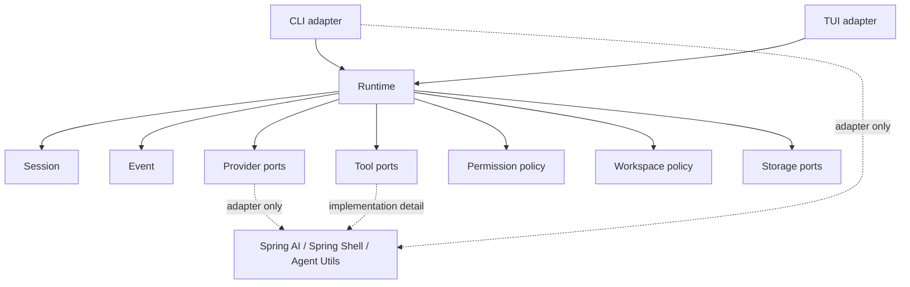

# Java Generation Guidance

Codegeist-specific guidance for generating future Java and Spring source while
keeping the architecture small, testable, and Codegeist-owned.

## Purpose And Status

This document is planned generation guidance. It is not a current-state source
map and does not mean the packages, records, services, tests, or adapters named
below already exist.

Use this guide before adding Java source for T003 implementation tasks. It
translates the existing Codegeist architecture blueprints into practical rules for
future coding agents so generated code does not copy OpenCode, Spring AI Agent
Utils, or generic framework package layouts.

## Current Baseline

The implemented application is still intentionally small:

| Area | Current state |
| --- | --- |
| Module | One Maven module under `app/codegeist/cli` |
| Implemented package | `ai.codegeist.app` only |
| Entrypoint | `CodegeistApplication` starts Spring Boot |
| Spring Shell | Dependency and configuration surface only; no commands yet |
| Spring AI | BOM imported; no provider starters or model calls yet |
| Spring AI Agent Utils | BOM and core artifact present; no runtime utility wired yet |
| Tests | Spring Boot context-load test only |

Do not create empty Java package directories just to reserve names. Git does not
track empty directories, and premature placeholder classes make unstable contracts
look real.

## Package Ownership Map

Keep the current single Maven module until tested contracts prove that a module
split is useful. The following packages are logical ownership boundaries for
future source generation, not required current directories.

| Package | Status | Owns | Must not own |
| --- | --- | --- | --- |
| `ai.codegeist.app` | Implemented | Spring Boot entrypoint and application wiring | Agent behavior, tool policy, session state |
| `ai.codegeist.cli` | Planned T003 | Spring Shell commands, terminal input/output, one-shot command parsing | Runtime orchestration, sessions, provider calls, tool execution |
| `ai.codegeist.tui` | Planned T003 | Full-screen terminal presentation over runtime events and approvals | A second runtime, permission policy, session mutation |
| `ai.codegeist.runtime` | Planned T003 | Prompt orchestration, mode selection, turn lifecycle, policy coordination | UI rendering, provider SDK details, storage adapters |
| `ai.codegeist.agent` | Planned T003 | Plan/Build mode policy and capability profile | CLI command parsing, provider integration |
| `ai.codegeist.session` | Planned T003 | Session aggregate, turns, message parts, lifecycle metadata | Provider calls, tool side effects, UI widgets |
| `ai.codegeist.event` | Planned T003 | Runtime and audit event envelopes, event families, ordering | Storage implementation, UI rendering |
| `ai.codegeist.context` | Planned T003 | Deterministic context requests, source summaries, skip reasons | LLM calls, permission decisions, hidden repo-specific constants |
| `ai.codegeist.provider` | Planned T003 | Codegeist provider config, model refs, adapter ports, typed provider errors | Prompt ownership, sessions, tool policy |
| `ai.codegeist.tool` | Planned T003 | Tool descriptors, requests, results, failures, output references | Permission policy, workspace escape rules |
| `ai.codegeist.permission` | Planned T003 | Permission requests, decisions, scopes, approval policy | Tool implementation, UI as source of truth |
| `ai.codegeist.workspace` | Planned T003 | Workspace refs, path/cwd validation, ignored/generated/secret-like posture | File mutation without tool and permission mediation |
| `ai.codegeist.patch` | Planned T003 | Reviewable patch/edit proposals and apply results | Generic file writes, shell execution |
| `ai.codegeist.shell` | Planned T003 | Controlled verification command requests and bounded process results | General process execution outside mode and permission gates |
| `ai.codegeist.storage` | Planned T003 | Storage ports and projections once persistence is needed | Runtime orchestration |
| `ai.codegeist.extension` | Deferred | PF4J and JBang contribution mediation | Core runtime state, trust by default |
| `ai.codegeist.server` | Deferred | Future HTTP/API adapter over runtime | Runtime behavior |
| `ai.codegeist.ui.vaadin` | Deferred | Future browser UI projection | Runtime behavior, permission policy |

## Dependency Direction

Use inward dependencies around Codegeist contracts:



Rules:

- Client adapters depend on runtime contracts; runtime does not depend on CLI or
  TUI packages.
- Domain contracts use Codegeist types, not Spring Shell, Spring AI, Agent Utils,
  provider SDK, Vaadin, HTTP, storage adapter, PF4J, or JBang types.
- Provider adapters may depend on Spring AI but must map Spring AI objects into
  Codegeist-owned request, response, stream chunk, diagnostic, and error records.
- Tool implementations may use Agent Utils directly when the caller already owns
  workspace, permission, result bounding, and event/session policy.
- Storage is a port used by runtime/session/event code. Storage adapters do not
  call providers, execute tools, or mutate runtime lifecycle.
- A package boundary should be testable before it becomes a Maven module boundary.

## Code Shape Rules

Prefer small, explicit Java types over generic maps or framework DTOs.

| Shape | Use when | Avoid when |
| --- | --- | --- |
| Record | Immutable request, result, identifier, summary, config, event payload | Behavior-rich aggregate needs invariants over time |
| Value object record | Stable ids such as `SessionId`, `TurnId`, `ToolId`, `ProviderId` | The value is purely local and never crosses a boundary |
| Enum | Small closed policy vocabulary such as status, mode, capability, verdict | Values must be user-defined or provider-defined |
| Sealed interface | A bounded domain family such as message parts, typed failures, event payloads | The family is expected to be plugin-extended immediately |
| Small interface | Boundary port such as provider adapter, permission policy, workspace policy, storage port | There is only one private implementation and no boundary yet |
| Service class | Coordinates a use case across ports and records | It only forwards one method call without policy |
| Adapter class | Maps framework, provider, Agent Utils, CLI, TUI, storage, or extension types into Codegeist types | It hides every constructor without adding mapping, policy, or replaceability |
| Configuration properties | User or environment configuration that Spring Boot should bind | Runtime state, secrets, or request-scoped data |
| Typed error/failure | A recoverable or displayable failure crosses package boundaries | A local exception can fail fast and stay private |

Generate the smallest type that protects a boundary. Do not add abstract
factories, mappers, adapters, or service interfaces only because a framework
example uses them.

## Spring And Agent Utils Boundaries

Spring Boot may own application startup, configuration binding, dependency
injection, profiles, and test context setup. It must not own Codegeist agent
semantics.

Spring Shell may own command parsing, interactive command entrypoints, terminal
input/output, and command help. It must call runtime services instead of managing
sessions, providers, tools, permissions, workspace policy, or storage.

Spring AI may own model invocation inside provider adapters. Runtime-facing
provider contracts should use Codegeist records such as `ProviderRequest`,
`ProviderResponse`, `ProviderStreamChunk`, `ProviderError`, and
`ProviderModelRef` rather than `Prompt`, `ChatResponse`, `ChatOptions`,
`ChatModel`, or `StreamingChatModel`.

Spring AI Agent Utils may be used directly below Codegeist policy boundaries.
Direct use is acceptable when the surrounding Codegeist service already validates
workspace paths, mode, permissions, result limits, event/session projection, and
redaction. Add an adapter only when a concrete boundary needs repeated setup,
typed result mapping, provider callback mediation, or replacement flexibility.

Never register broad raw Agent Utils tools directly with a provider before
Codegeist has classified capabilities and mediated mode, permission, workspace,
event, session, and storage behavior.

## CLI And TUI Adapters

CLI and TUI are both T003 core client surfaces. They should share runtime,
session, event, and permission contracts.

| Client surface | May own | Must delegate |
| --- | --- | --- |
| Spring Shell CLI | Command names, argument parsing, line-oriented rendering, interactive prompts | Runtime request creation, session lifecycle, provider calls, tool execution, permission policy |
| TUI adapter | Full-screen layout, keyboard interaction, event rendering, approval screens | Runtime orchestration, session mutation, event creation, workspace validation, storage |

Client code should translate user input into `PromptRequest`-style records and
render `RuntimeEvent` or session projection records. It should not inspect or
mutate session internals to decide tool, provider, permission, or storage policy.

## Test Generation Expectations

Future Java implementation tasks must add or update tests with the code change.
This guidance task creates no test source.

TDD is the default development workflow for future behavior changes and bug
fixes. Start with the smallest failing test that proves the desired behavior or
regression, then implement the smallest code change that makes it pass. If a task
cannot reasonably be test-first, record the reason in that task's solve result.

| Test category | Use for | Proves |
| --- | --- | --- |
| Contract tests | Runtime, provider, tool, permission, workspace, storage ports | Boundary shape and type isolation stay stable |
| Unit tests | Domain records, services, validators, policies, mappers | Local behavior and failure cases are deterministic |
| Spring context tests | Configuration binding and bean wiring | Spring Boot setup starts without interactive shell or provider calls |
| Adapter tests | Spring AI, Spring Shell, Agent Utils, storage, CLI/TUI adapters | Framework types are mapped at the edge only |
| CLI/TUI tests | User-visible command or rendering behavior | Clients delegate to runtime and render events/projections correctly |
| Smoke tests | End-to-end happy path for a narrow local workflow | A usable slice works without broad fragile setup |
| Native/posture checks | GraalVM-sensitive dependency or packaging changes | Native status is `passed`, `skipped`, or `failed` with a reason |

Default test posture:

- Prefer temporary-directory fixtures for workspace, file, search, patch, and
  shell behavior.
- Keep tests individually executable through Maven/JUnit selectors or a later
  explicit repo wrapper. A coding agent must be able to re-run the narrow failing
  test without running the whole suite.
- Watch test duration carefully. Solve results for Java implementation tasks
  should report the targeted test command and enough timing information to spot
  slow tests.
- Watch startup duration especially carefully. Do not hide Spring context startup,
  CLI startup, provider startup, or native startup inside ordinary unit tests.
- Avoid network, provider credentials, native-image, and process execution unless
  the task explicitly owns those checks.
- Prefer plain JVM unit and contract tests over Spring context tests unless Spring
  binding, bean wiring, configuration, command registration, or packaging startup
  is the behavior under test.
- For provider tasks, keep no-network config and adapter contract tests separate
  from explicit live smoke tests.
- For shell and patch/edit tasks, test denial and bounded-result behavior before
  testing successful side effects.
- For Agent Utils use, test Codegeist boundaries, not Agent Utils internals.

## Illustrative Java Examples

These snippets are examples only. They are not implemented source.

### Boundary Records

```java
record SessionId(String value) {}
record TurnId(String value) {}
record CorrelationId(String value) {}

record PromptRequest(
    AgentMode mode,
    Optional<SessionId> sessionId,
    WorkspaceRef workspace,
    SourceClient sourceClient,
    String promptText,
    CorrelationId correlationId
) {}
```

### Port And Service Shape

```java
interface ProviderAdapter {
    ProviderResponse call(ProviderRequest request);
    Flow.Publisher<ProviderStreamChunk> stream(ProviderRequest request);
}

final class RuntimeService {

    private final ProviderAdapter providerAdapter;
    private final PermissionPolicy permissionPolicy;

    RuntimeService(ProviderAdapter providerAdapter, PermissionPolicy permissionPolicy) {
        this.providerAdapter = providerAdapter;
        this.permissionPolicy = permissionPolicy;
    }
}
```

### Adapter Boundary

```java
final class SpringAiProviderAdapter implements ProviderAdapter {

    private final ChatModel chatModel;
    private final SpringAiPromptMapper promptMapper;
    private final SpringAiResponseMapper responseMapper;

    @Override
    public ProviderResponse call(ProviderRequest request) {
        Prompt prompt = promptMapper.toSpringPrompt(request);
        ChatResponse response = chatModel.call(prompt);
        return responseMapper.toCodegeistResponse(response, request.correlationId());
    }
}
```

`ChatModel`, `Prompt`, and `ChatResponse` stay inside the adapter. Runtime code
sees only Codegeist provider records.

### Typed Failure

```java
sealed interface ToolFailure permits WorkspaceDenied, PermissionDenied, ToolExecutionFailed {
    String redactedMessage();
    Recoverability recoverability();
}

record WorkspaceDenied(String redactedMessage, Recoverability recoverability)
    implements ToolFailure {}
```

### Configuration Properties

```java
@ConfigurationProperties("codegeist.provider")
record ProviderProperties(
    List<ConfiguredProvider> providers
) {}
```

Configuration records bind external settings. They should be mapped into
Codegeist provider config records before runtime uses them.

### Test Shape

```java
class ProviderAdapterContractTests {

    @Test
    void mapsProviderResponseWithoutExposingSpringAiTypes() {
        ProviderResponse response = adapter.call(providerRequest());

        assertThat(response).isInstanceOf(ProviderResponse.class);
        assertThat(response.assistantText()).isNotBlank();
    }
}
```

The test is illustrative. Real tests should assert the behavior owned by the
implementation task and avoid live providers unless the task explicitly owns that
smoke path.

## Later-Task Checklist

Before adding Java source in a T003 task, verify:

- The package belongs to the current task's boundary and is not a deferred surface.
- The new type has a concrete behavior, contract, or test reason to exist.
- Framework, provider SDK, Agent Utils, storage adapter, CLI, or TUI types do not
  leak into Codegeist domain contracts.
- Runtime remains the owner of orchestration, session state transitions, and
  state-transition events.
- Tools pass through mode, permission, workspace, bounded-result, event, and
  session policy before side effects.
- Provider tool calling is disabled, rejected, or mediated until Codegeist tool
  contracts exist for the slice.
- Tests are added with the implementation and prove the boundary, not just Spring
  bean creation.
- Current-state docs are updated if source packages, commands, runtime behavior,
  tests, configuration, or verification entrypoints become real.
- Deferred JBang, PF4J, Vaadin, server, and API/SDK surfaces remain adapter-ready
  but unimplemented unless the task explicitly owns them.
