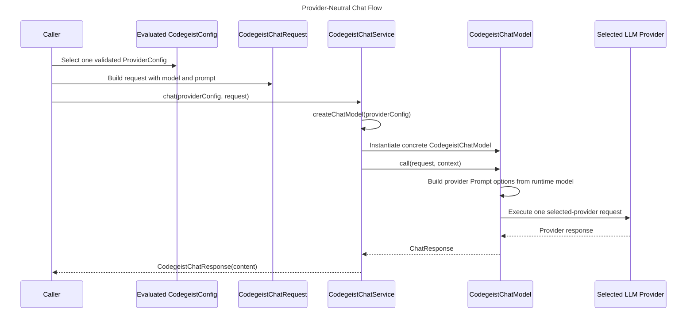
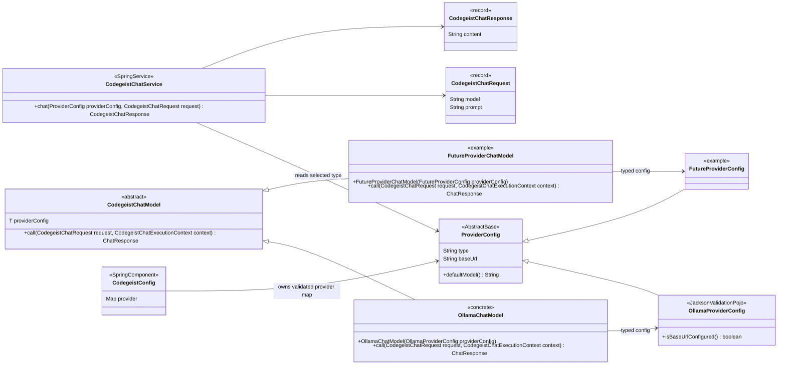
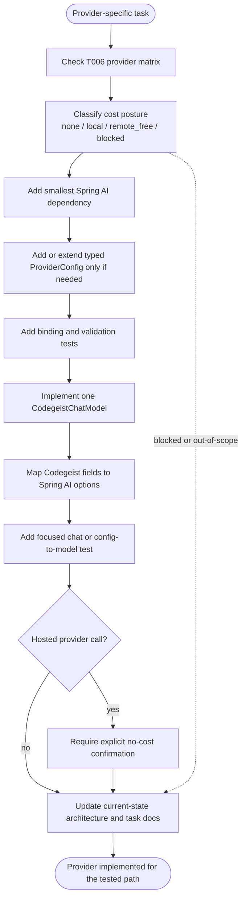

# LLM Provider Implementation

Specification for implementing chat-capable LLM providers in Codegeist.

## Purpose

Codegeist should chat with any supported LLM provider through one internal chat
contract. Provider-specific code must stay isolated in small provider factories
that translate evaluated Codegeist provider config plus a runtime-selected model
name into Spring AI `ChatModel` instances.

This document is implementation guidance for provider-backed runtime slices. The
first local Ollama slice now implements the core seam in `ai.codegeist.app.chat`;
future provider tasks should extend the same shape without widening the public
runtime contract before a focused test needs it.

## Diagrams

Provider-neutral runtime sequence:



Current first-slice and future-extension class view:



Diagram labels:

- `SpringService` means the class should be implemented as a Spring `@Service`.
- `ConfigurationProperties` means Spring Boot binds application configuration into
  the class.
- `JacksonValidationPojo` means the type is mapped by Jackson and validated with
  Bean Validation, but is not itself a Spring service.
- Concrete Codegeist chat models may wrap Spring AI provider-specific `ChatModel`
  implementations, but the Codegeist abstract model itself owns only the
  `CodegeistChatRequest` call contract.

Provider addition checklist flow:



## Design Pattern

Do not put chat model creation on provider config. Use a typed Codegeist chat model
hierarchy with narrow adapter dispatch in `CodegeistChatService`:

```text
CodegeistChatService
-> CodegeistChatModel<T extends ProviderConfig>
-> provider-specific Spring AI ChatModel delegate
```

The application chats through `CodegeistChatService`. The caller passes the already
selected and validated `ProviderConfig` separately from `CodegeistChatRequest`. The
service maps the selected provider config subclass to a concrete
`CodegeistChatModel`, then passes the request to the selected model. Each concrete
chat model receives its matching provider config type, and that chat model maps the
access config plus the request model into the matching Spring AI API, options, and
dependency route. Do not add a separate broad factory, registry, or strategy layer
unless a focused provider task needs it.

## Provider Versus Model

A provider is the integration route, for example `ollama`, `openai`, `anthropic`,
or `bedrock-converse`. A model is the provider-specific model selector, for example
`llama3.2:1b`, `gpt-4o-mini`, or a cloud deployment id.

Rules:

- Keep model names as runtime strings selected by the caller, agent, session,
  command, or provider feature test method unless a provider SDK requires a
  stronger type for a tested path.
- Do not create Java enums, catalogs, or fallback policies for model names before a
  focused workflow needs them.
- Each concrete `CodegeistChatModel` must pass the runtime-selected model value
  into the provider-specific Spring AI options or builder.
- Concrete chat models may validate provider-specific model/deployment constraints
  only when a task has source-backed evidence and focused tests for that provider.
- Model-specific generation knobs belong to the caller, agent, session, command,
  request, or provider feature test method until a tested workflow proves a stable
  runtime contract for them.

## Minimal Package

Start in one package until a second provider proves that subpackages improve
readability:

```text
ai.codegeist.app.chat
```

Minimal classes for the first provider-backed workflow:

```text
CodegeistChatService
CodegeistChatRequest
CodegeistChatResponse
CodegeistChatModel
OllamaChatModel
```

Do not add ports, adapter hierarchies, plugin APIs, model catalogs, or provider
registries until a focused test needs them.

## Core Contracts

### `CodegeistChatRequest`

`CodegeistChatRequest` is the provider-neutral input for one chat call.

Planned shape:

```java
public record CodegeistChatRequest(
        ProviderConfig providerConfig,
        String model,
        String prompt
) {
}
```

Rules:

- `providerConfig` must already come from evaluated, mapped, and validated
  Codegeist config.
- `model` must come from runtime selection, such as an agent, session, command, or
  provider feature test method. It is not part of `ProviderConfig`.
- The request should carry only fields needed by the current one-turn workflow.
- Do not add session, tool, permission, context, streaming, or model fallback data
  until a focused workflow needs it.

### `CodegeistChatResponse`

`CodegeistChatResponse` normalizes the output returned to Codegeist callers.

Planned shape:

```java
public record CodegeistChatResponse(
        String content
) {
}
```

Rules:

- Start with text content only.
- Add usage, token counts, finish reasons, model metadata, or timing fields only
  when a tested caller needs them.
- Provider-specific response metadata should not leak into application code by
  default.

### `CodegeistChatService`

`CodegeistChatService` owns the provider-neutral chat execution path.

Planned shape:

```java
@Service
public class CodegeistChatService {

    public CodegeistChatResponse chat(ProviderConfig providerConfig, CodegeistChatRequest request) {
        return chat(providerConfig, request, CodegeistChatExecutionContext.empty(Path.of(".")));
    }

    public CodegeistChatResponse chat(
            ProviderConfig providerConfig,
            CodegeistChatRequest request,
            CodegeistChatExecutionContext context) {
        CodegeistChatModel<?> chatModel = createChatModel(providerConfig);

        String content = chatModel.call(request, context)
                .getResult()
                .getOutput()
                .getText();

        return new CodegeistChatResponse(content);
    }
}
```

Rules:

- It may depend on Codegeist's provider-neutral `CodegeistChatModel` contract.
- It may import Codegeist-owned provider adapter classes such as `OllamaChatModel`
  and `OpenAiChatModel` for the narrow dispatch, but provider-specific Spring AI
  imports stay inside those adapter classes.
- It must not load config files, choose providers from raw YAML, manage local
  provider lifecycle, pull models, or check remote billing posture by itself.

### `CodegeistChatModel`

`CodegeistChatModel<T extends ProviderConfig>` is the abstract provider model seam.
It is generic so each provider implementation receives its concrete
`ProviderConfig` type. The context-aware call is the provider implementation
contract; no-tool compatibility belongs at `CodegeistChatService`, not on the model.

Planned shape:

```java
public abstract class CodegeistChatModel<T extends ProviderConfig> {

    protected CodegeistChatModel(T providerConfig) {
        // Store validated providerConfig only.
    }

    public abstract ChatResponse call(
            CodegeistChatRequest request,
            CodegeistChatExecutionContext context);
}
```

Rules:

- `CodegeistChatService` creates the matching `CodegeistChatModel` from the selected
  provider config subclass without storing a runtime model on the config.
- Each concrete `ProviderConfig` owns a `defaultModel()` runtime fallback for
  commands that intentionally do not expose a model selector.
- Provider ids are resolved by `ProviderConfig.getType()` from the concrete config
  class constant, so concrete chat models do not duplicate
  provider id strings.
- Each concrete chat model receives only its typed provider config from its
  provider config.
- Runtime model selection stays in `CodegeistChatRequest` and is passed at call
  time through `CodegeistChatModel.call(...)`; prompt-scoped tools travel beside the
  request through `CodegeistChatExecutionContext`.
- Concrete chat models own provider-specific option mapping and
  dependency-specific builder calls.
- Concrete chat models must not call every configured provider, mutate global
  `spring.ai.*` properties as the primary runtime mechanism, or own CLI command
  behavior.

### Chat Model Creation

`CodegeistChatService` selects the concrete chat model for the already selected
provider config. Runtime model selection is not part of chat model construction.

Planned shape:

```java
class CodegeistChatService {
    CodegeistChatModel<?> createChatModel(ProviderConfig providerConfig) {
        if (providerConfig instanceof OllamaProviderConfig ollamaProviderConfig) {
            return new OllamaChatModel(ollamaProviderConfig);
        }

        throw new IllegalArgumentException(...);
    }
}
```

Rules:

- It must be lazy: creating a model for one provider must not instantiate models for
  other configured providers.
- Keep provider-selection and enablement policy outside `ProviderConfig` until a
  focused task makes that behavior observable.
- Keep stored YAML model fields out of provider config; `defaultModel()` is a
  provider-owned runtime fallback, not persisted config state.
- It should stay simple until there is a tested need for richer diagnostics or
  status objects.

## Provider Implementation Rules

Add one provider at a time.

For each provider-specific task:

- Start from the T006 provider matrix and account/free-tier analysis.
- Add only the Spring AI dependency required by the provider being implemented.
- Add or extend a typed `ProviderConfig` class only for provider access, endpoint,
  or credential fields required by the tested call path. Do not add model
  selection, enablement, completion-path routing, or generation options to
  `ProviderConfig`.
- Implement `defaultModel()` as the provider-owned runtime fallback when a command
  intentionally does not expose a model selector.
- Keep `codegeist.yml` loading, SpEL evaluation, provider dispatch, and Bean
  Validation separate from provider calls.
- Create the provider's Spring AI `ChatModel` lazily from one selected, normalized
  provider config through `CodegeistChatService` adapter dispatch.
- Map the runtime model to provider-specific prompt options at call time, not in
  the chat model constructor.
- Keep provider-specific generation options outside `ProviderConfig` as request,
  command, session, or provider-feature test inputs until a focused task proves a
  stable runtime contract.
- Do not use API-key presence as permission to call a hosted provider.
- Do not implement model fallback, provider ranking, multi-provider fan-out,
  streaming, tool calling, permission flow, sessions, storage, additional CLI
  command behavior, Vaadin, PF4J, JBang, or server APIs unless the active task
  specifically requires that behavior.

## First Provider: Ollama

`T006_05` should implement the first concrete provider model as `OllamaChatModel`.

Implementation constraints:

- Use `org.springframework.ai:spring-ai-ollama` for programmatic Spring AI Ollama
  model construction.
- Implement `CodegeistChatModel<OllamaProviderConfig>` so the Ollama model receives
  `OllamaProviderConfig` directly.
- Prefer direct builder mapping over global Spring Boot `spring.ai.ollama.*`
  properties for the runtime path.
- Build `OllamaApi` from `OllamaProviderConfig.getBaseUrl()`.
- Build `OllamaChatOptions` from the runtime model inside the selected call path.
- Build `OllamaChatModel` with `OllamaChatModel.builder().ollamaApi(...).build()`;
  do not store the runtime model as default chat-model state.
- The focused live test should connect to an externally managed local Ollama
  instance at the fixed base URL `http://localhost:11434` and use the fixed model
  `llama3.2:1b`.
- Start or verify the local Ollama service through the repo Taskfile: run local
  provider tests with `CODEGEIST_TEST_PROVIDER_CATEGORY=local task test ...`. The
  `test` task invokes `ollama-start` before Maven for every test run. The Taskfile
  owns ensuring the selected model is present; Java tests should not pull, download,
  create, or delete local Ollama models themselves.

## One-Shot CLI Prompt Command

`ask` is the first CLI-facing prompt workflow. It intentionally stays small:

- It accepts one positional prompt parameter.
- It injects the primary `CodegeistConfig` bean created by
  `CodegeistConfigService.loadCurrentConfig()`, so `-Dcodegeist.config=<path>` is
  global command configuration rather than an `ask` option.
- It selects the first provider configured in the ordered `provider` map.
- It uses `ProviderConfig.defaultModel()` from the selected provider config. The
  current Ollama provider default is `llama3.2:1b`.
- It writes only the provider response text to stdout.

Do not add provider flags, model flags, streaming, sessions, tool calls, or fallback
selection until a focused task makes those behaviors observable.

The Ollama chat model should be the only class that imports Ollama-specific Spring AI
types in the first runtime slice.

## How To Add Another Provider

1. Confirm the provider row exists in the T006 matrix.
2. Confirm the provider's cost posture: `none`, `local`, `remote_free`,
   `blocked`, or `out-of-scope`.
3. Add the smallest required Spring AI dependency.
4. Add a concrete `ProviderConfig` only when config binding or runtime mapping
   needs typed fields.
5. Add the provider config class in the config package with `PROVIDER_TYPE` plus
   `getType()` so the explicit provider registry can match it.
6. Implement `defaultModel()` on the provider config without adding a stored YAML
   model field.
7. Implement one concrete `CodegeistChatModel<T>` for the provider type.
8. Add the provider branch to `CodegeistChatService.createChatModel(...)`.
9. Add config binding, default-model, and validation tests for the provider fields.
10. Map Codegeist runtime request fields to provider-specific Spring AI prompt
    options or builders at call time.
11. Add a focused chat or config-to-model test.
12. For hosted providers, keep live calls behind explicit no-cost confirmation and
    never trigger them from default tests.
13. Update current-state architecture after the provider is implemented.

## Testing Strategy

Provider feature tests use method-level policy categories:

| Category | Provider call | Default? | Purpose |
| --- | --- | --- | --- |
| `none` | no | yes | Runs unannotated config-only provider checks and no annotated provider feature calls. |
| `local` | local only | explicit env selection | Proves one local provider call without remote credentials. |
| `remote_free` | hosted remote feature call | explicit env selection | Proves a hosted provider feature only after no-cost eligibility is selected. |
| `remote_paid` | hosted paid-capable feature call | explicit env selection plus paid confirmation | Proves paid or potentially billable features such as image generation or speech-to-text. |

Provider feature tests run through `task test`; method-level `@ProviderCategory`
checks are the only provider category gate. `CODEGEIST_TEST_PROVIDER_CATEGORY`
defaults to `none`, and `local` can be selected for local-provider runs. Each
provider feature method should use the category
annotation before any network or local provider work.

For the first local provider test:

- Keep the test individually runnable through the Taskfile selector, for example
  `task test TEST=LocalOllamaProviderIT`.
- Use `task test` for Codegeist verification. Do not document direct `mvn test`
  commands for new implementation tasks.
- Use one Taskfile command for local provider checks, for example
  `CODEGEIST_TEST_PROVIDER_CATEGORY=local task test TEST=OllamaProviderTest`; the
  `test` task starts Ollama first for every Maven test run.
- Report Spring context startup and first chat-call timings separately. Do not add
  a separate model-list preflight before the chat call.
- Use a narrow prompt and robust assertion.

## Safety And Cost Policy

- Local provider calls run only when `CODEGEIST_TEST_PROVIDER_CATEGORY=local` or a
  higher provider category is selected and prerequisites are available.
- Hosted `remote_free` calls are blocked unless the user explicitly selects a
  no-cost category for the selected account, key, endpoint, and model route.
- Hosted paid-capable calls are additionally blocked unless
  `CODEGEIST_TEST_PROVIDER_CATEGORY=remote_paid` is set.
- API-key or credential presence alone is never permission to call a hosted
  provider.
- Config rendering may print sensitive values. Treat `--show-config` output as
  sensitive when credentials or tokens are configured.

## Documentation Updates

When a provider becomes implemented source state, update:

- `docs/developer/architecture/architecture.md`
- `docs/developer/architecture/provider-configuration.md` when config behavior or
  provider wiring affects that slice
- the active task file under `docs/tasks/`
- `docs/memory-bank/chat.md` when future sessions need the context

## Non-Goals

- No public plugin API for providers yet.
- No cross-provider model registry yet.
- No model fallback or provider ranking policy yet.
- No broad adapter hierarchy beyond concrete chat model classes.
- No fake provider for the first live provider workflow.
- No hosted provider calls in default tests.
