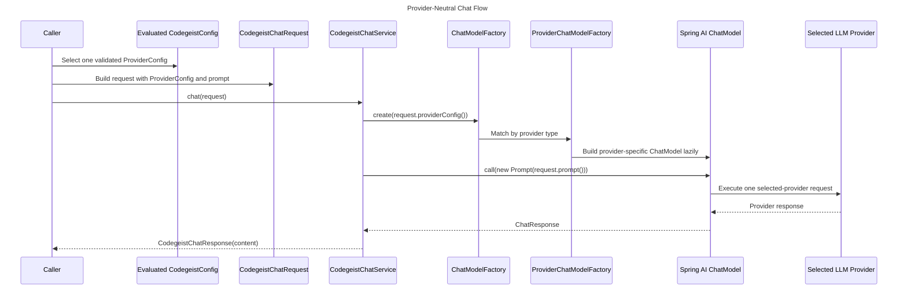
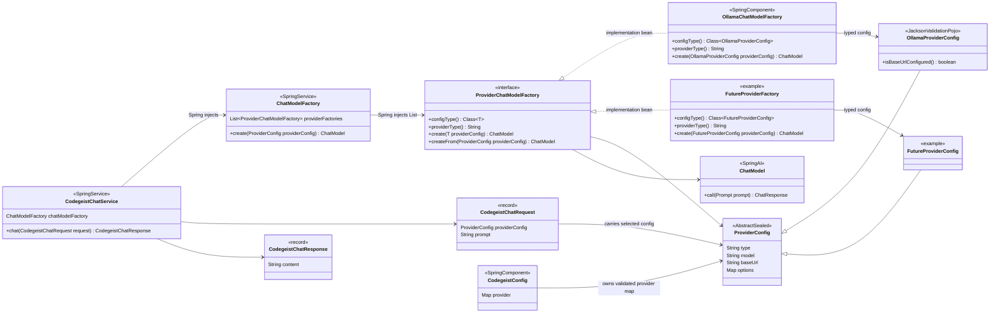
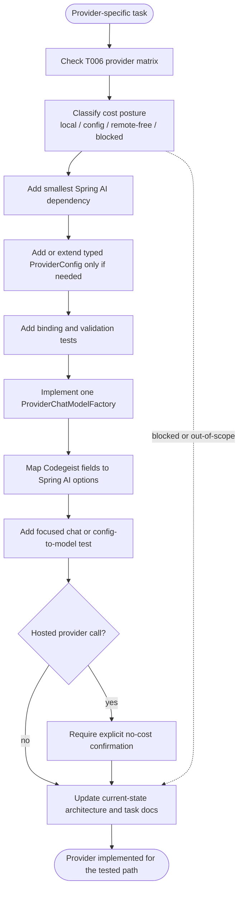

# LLM Provider Implementation

Specification for implementing chat-capable LLM providers in Codegeist.

## Purpose

Codegeist should chat with any supported LLM provider through one internal chat
contract. Provider-specific code must stay isolated in small provider factories
that translate evaluated Codegeist provider config into Spring AI `ChatModel`
instances.

This document is implementation guidance for provider-backed runtime slices. The
first local Ollama slice now implements the core seam in `ai.codegeist.app.chat`;
future provider tasks should extend the same shape without widening the public
runtime contract before a focused test needs it.

## Diagrams

Provider-neutral runtime sequence:



Current first-slice and future-extension class view:



Diagram labels:

- `SpringService` means the class should be implemented as a Spring `@Service`.
- `SpringComponent` means the class should be a Spring-managed implementation
  bean, usually `@Component` unless a later task chooses `@Service` for clarity.
- `SpringBeanContract` means Spring injects all implementation beans through
  `List<ProviderChatModelFactory<? extends ProviderConfig>>`.
- `GenericProviderConfigFactory` means each provider implementation chooses its
  concrete config type, for example `ProviderChatModelFactory<OllamaProviderConfig>`.
- `ConfigurationProperties` means Spring Boot binds application configuration into
  the class.
- `JacksonValidationPojo` means the type is mapped by Jackson and validated with
  Bean Validation, but is not itself a Spring service.
- `SpringAI` and `LazyCreated` mean the type comes from Spring AI and is created
  only for the selected provider call, not as a global provider registry.

Provider addition checklist flow:



## Design Pattern

Use a small Strategy plus Factory pattern:

```text
CodegeistChatService
-> ChatModelFactory
-> ProviderChatModelFactory
-> Spring AI ChatModel
```

The application chats through `CodegeistChatService`. The service does not know
whether the selected provider is Ollama, OpenAI, Anthropic, Bedrock, Google GenAI,
or another later provider. It asks `ChatModelFactory` for a Spring AI `ChatModel`
for the already selected and validated provider config.

Provider-specific code lives behind `ProviderChatModelFactory`. Each concrete
factory knows how to map exactly one `ProviderConfig` type into the matching Spring
AI API, options, and dependency route.

## Provider Versus Model

A provider is the integration route, for example `ollama`, `openai`, `anthropic`,
or `bedrock-converse`. A model is the provider-specific model selector, for example
`llama3.2:1b`, `gpt-4o-mini`, or a cloud deployment id.

Rules:

- Keep model names as strings from evaluated `codegeist.yml` unless a provider SDK
  requires a stronger type for a tested path.
- Do not create Java enums, catalogs, or fallback policies for model names before a
  focused workflow needs them.
- Each provider factory must pass the selected config's `model` value into the
  provider-specific Spring AI options or builder.
- Provider factories may validate provider-specific model/deployment constraints
  only when a task has source-backed evidence and focused tests for that provider.
- Model-specific generation knobs stay under `provider.<id>.options` until a tested
  workflow proves they should become first-class config fields.

## Minimal Package

Start in one package until a second provider proves that subpackages improve
readability:

```text
ai.codegeist.app.chat
```

Minimal classes for the first provider-backed workflow:

```text
CodegeistChatService
CodegeistChatRequest
CodegeistChatResponse
ChatModelFactory
ProviderChatModelFactory
OllamaChatModelFactory
```

Do not add ports, adapter hierarchies, plugin APIs, model catalogs, or provider
registries beyond the Spring-managed strategy list until a focused test needs
them.

## Core Contracts

### `CodegeistChatRequest`

`CodegeistChatRequest` is the provider-neutral input for one chat call.

Planned shape:

```java
public record CodegeistChatRequest(
        ProviderConfig providerConfig,
        String prompt
) {
}
```

Rules:

- `providerConfig` must already come from evaluated, mapped, and validated
  Codegeist config.
- The request should carry only fields needed by the current one-turn workflow.
- Do not add session, tool, permission, context, streaming, or model fallback data
  until a focused workflow needs it.

### `CodegeistChatResponse`

`CodegeistChatResponse` normalizes the output returned to Codegeist callers.

Planned shape:

```java
public record CodegeistChatResponse(
        String content
) {
}
```

Rules:

- Start with text content only.
- Add usage, token counts, finish reasons, model metadata, or timing fields only
  when a tested caller needs them.
- Provider-specific response metadata should not leak into application code by
  default.

### `CodegeistChatService`

`CodegeistChatService` owns the provider-neutral chat execution path.

Planned shape:

```java
@Service
public class CodegeistChatService {

    @Autowired
    private ChatModelFactory chatModelFactory;

    public CodegeistChatResponse chat(CodegeistChatRequest request) {
        ChatModel chatModel = chatModelFactory.create(request.providerConfig());

        String content = chatModel.call(new Prompt(request.prompt()))
                .getResult()
                .getOutput()
                .getText();

        return new CodegeistChatResponse(content);
    }
}
```

Rules:

- It may depend on Spring AI's provider-neutral `ChatModel` and `Prompt` APIs.
- It must not import provider-specific Spring AI classes such as Ollama or OpenAI
  types.
- It must not load config files, choose providers from raw YAML, manage local
  provider lifecycle, pull models, or check remote billing posture by itself.

### `ProviderChatModelFactory`

`ProviderChatModelFactory` is the internal provider Strategy seam. It is generic
so each provider implementation receives its concrete `ProviderConfig` type.

Planned shape:

```java
public interface ProviderChatModelFactory<T extends ProviderConfig> {

    Class<T> configType();

    String providerType();

    ChatModel create(T providerConfig);

    default ChatModel createFrom(ProviderConfig providerConfig) {
        if (!configType().isInstance(providerConfig)) {
            throw new IllegalArgumentException("Provider config type mismatch for " + providerType());
        }
        return create(configType().cast(providerConfig));
    }
}
```

Rules:

- `providerType()` must match the provider config `type` field and the `@Provider`
  annotation value used by config loading.
- `configType()` must return the concrete config class that the provider factory
  accepts, for example `OllamaProviderConfig.class`.
- `create(T providerConfig)` must create a Spring AI `ChatModel` for one selected
  provider only.
- `createFrom(ProviderConfig)` owns the common runtime cast and type mismatch
  failure. Concrete provider factories should not manually cast from raw
  `ProviderConfig`.
- Provider factories own provider-specific option mapping and dependency-specific
  builder calls.
- Provider factories must not call every configured provider, mutate global
  `spring.ai.*` properties as the primary runtime mechanism, or own CLI command
  behavior.

### `ChatModelFactory`

`ChatModelFactory` selects the provider factory for one selected provider config.

Planned shape:

```java
@Service
public class ChatModelFactory {

    @Autowired
    private List<ProviderChatModelFactory<? extends ProviderConfig>> providerFactories;

    public ChatModel create(ProviderConfig providerConfig) {
        return providerFactories.stream()
                .filter(factory -> factory.providerType().equals(providerConfig.getType()))
                .findFirst()
                .orElseThrow(() -> new IllegalArgumentException(
                        "Unsupported provider type: " + providerConfig.getType()))
                .createFrom(providerConfig);
    }
}
```

Rules:

- It must be lazy: creating a model for one provider must not instantiate models for
  other configured providers.
- It may reject `enabled: false` providers if the active task makes that behavior
  observable. Otherwise, keep enablement policy at the provider-selection layer.
- It should stay simple until there is a tested need for richer diagnostics or
  status objects.

## Provider Implementation Rules

Add one provider at a time.

For each provider-specific task:

- Start from the T006 provider matrix and account/free-tier analysis.
- Add only the Spring AI dependency required by the provider being implemented.
- Add or extend a typed `ProviderConfig` class only for fields required by the
  tested call path.
- Keep `codegeist.yml` loading, SpEL evaluation, provider dispatch, and Bean
  Validation separate from provider calls.
- Create the provider's Spring AI `ChatModel` lazily from one selected, normalized
  provider config.
- Keep provider-specific options inside `provider.<id>.options` until a focused
  task proves that a field deserves first-class status.
- Do not use API-key presence as permission to call a hosted provider.
- Do not implement model fallback, provider ranking, multi-provider fan-out,
  streaming, tool calling, permission flow, sessions, storage, CLI commands,
  Vaadin, PF4J, JBang, or server APIs unless the active task specifically requires
  that behavior.

## First Provider: Ollama

`T006_05` should implement the first concrete provider factory as
`OllamaChatModelFactory`.

Implementation constraints:

- Use `org.springframework.ai:spring-ai-ollama` for programmatic Spring AI Ollama
  model construction.
- Implement `ProviderChatModelFactory<OllamaProviderConfig>` so the Ollama factory
  receives `OllamaProviderConfig` directly.
- Prefer direct builder mapping over global Spring Boot `spring.ai.ollama.*`
  properties for the runtime path.
- Build `OllamaApi` from `OllamaProviderConfig.getBaseUrl()`.
- Build `OllamaChatOptions` from `model`, `options.temperature`, and
  `options.seed`.
- Build `OllamaChatModel` with `OllamaChatModel.builder().ollamaApi(...)
  .defaultOptions(...).build()`.
- The focused live test should connect to an externally managed local Ollama
  instance. Use `CODEGEIST_TEST_OLLAMA_BASE_URL`, defaulting to
  `http://localhost:11434`, and `CODEGEIST_TEST_OLLAMA_MODEL`, defaulting to
  `llama3.2:1b`.
- The selected model must already be downloaded before the focused test starts.
  Codegeist tests should not pull, download, create, or delete local Ollama models.
- Start or verify the local Ollama service through the repo Taskfile before tests:
  run `OLLAMA_ENTER=false task ollama-start` from `app/codegeist/cli` before
  `task test`.

The Ollama factory should be the only class that imports Ollama-specific Spring AI
types in the first runtime slice.

## How To Add Another Provider

1. Confirm the provider row exists in the T006 matrix.
2. Confirm the provider's cost posture: `local`, `config`, `remote-free`,
   `blocked`, or `out-of-scope`.
3. Add the smallest required Spring AI dependency.
4. Add a concrete `ProviderConfig` only when config binding or runtime mapping
   needs typed fields.
5. Add the provider class to the sealed `ProviderConfig` permits list and annotate
   it with `@Provider("<type>")`.
6. Add config binding and validation tests for the provider fields.
7. Implement one `ProviderChatModelFactory` for the provider type.
8. Map Codegeist fields to provider-specific Spring AI options or builders.
9. Add a focused chat or config-to-model test.
10. For hosted providers, keep live calls behind explicit no-cost confirmation and
    never trigger them from default tests.
11. Update current-state architecture after the provider is implemented.

## Testing Strategy

Use three test levels:

| Level | Provider call | Default? | Purpose |
| --- | --- | --- | --- |
| `config` | no | yes | Proves `codegeist.yml` maps and validates provider data. |
| `local` | local only | opt-in until the smoke harness exists | Proves one local provider call without remote credentials. |
| `remote-free` | hosted remote | no | Proves a hosted provider only after explicit no-cost confirmation. |

For the first local provider test:

- Keep the test individually runnable through the Taskfile selector, for example
  `task test TEST=LocalOllamaProviderIT`.
- Use `task test` for Codegeist verification. Do not document direct `mvn test`
  commands for new implementation tasks.
- Run `OLLAMA_ENTER=false task ollama-start` before `task test` when the active
  task includes the local Ollama provider workflow.
- Report Spring context startup, Ollama readiness/model-availability check, and
  first chat-call timings separately.
- Use a narrow prompt and robust assertion.

## Safety And Cost Policy

- Local provider calls may run when the test or command explicitly selects local
  execution and prerequisites are available.
- Hosted provider calls are blocked unless the user explicitly confirms that the
  selected account, key, endpoint, and model route are no-cost for that run.
- API-key or credential presence alone is never permission to call a hosted
  provider.
- Config rendering may print sensitive values. Treat `--show-config` output as
  sensitive when credentials or tokens are configured.

## Documentation Updates

When a provider becomes implemented source state, update:

- `docs/developer/architecture/architecture.md`
- `docs/developer/architecture/provider-configuration.md` when config behavior or
  provider wiring affects that slice
- the active task file under `docs/tasks/`
- `docs/memory-bank/chat.md` when future sessions need the context

## Non-Goals

- No public plugin API for providers yet.
- No cross-provider model registry yet.
- No model fallback or provider ranking policy yet.
- No broad adapter hierarchy beyond the internal provider factory strategy list.
- No fake provider for the first live provider workflow.
- No hosted provider calls in default tests.
