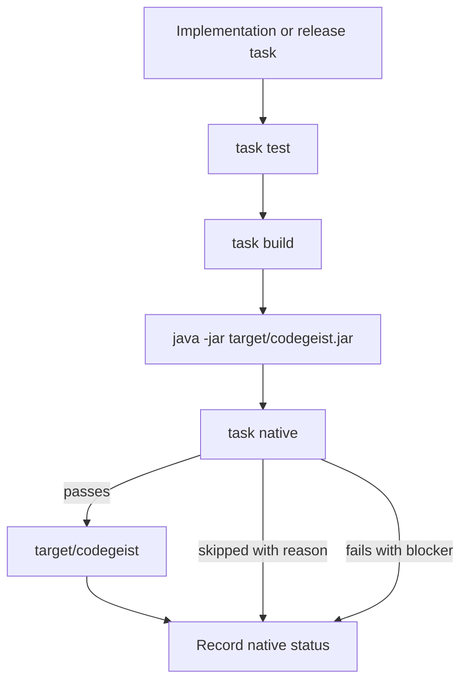

# Native Packaging Posture

Blueprint for Codegeist JVM jar verification, GraalVM native-image posture, and
future blocker reporting without changing the current build.

## Scope

This document specifies planned packaging validation only. It does not describe
new Java source, Maven modules, dependencies, Taskfile commands, runtime behavior,
provider calls, PF4J plugins, JBang execution, Vaadin views, server endpoints, or
tests.

The current implemented packaging baseline remains the single Spring Boot CLI
module under `app/codegeist/cli`:

- Spring Boot `4.0.6`.
- Spring AI BOM `2.0.0-M6`.
- Spring AI Agent Utils BOM and core artifact `0.7.0`.
- Spring Shell `4.0.2`.
- Java `25`.
- Maven jar packaging through the Spring Boot Maven plugin.
- GraalVM native profile through `native-maven-plugin` `0.10.6`.

Native packaging is a compatibility target for the first CLI foundation. It is
not proof that later PF4J, JBang, Vaadin, server, provider, shell, patch/edit,
or tool surfaces are native-compatible.

## Decision

Keep the MVP foundation JVM-first and native-aware.

JVM jar packaging is the required baseline for release readiness once runtime
behavior exists. Native-image validation should run as a posture check whenever
practical, but native failures should not force the runtime to broaden features or
replace deferred surfaces just to satisfy packaging.

Use three explicit native status outcomes:

| Status | Meaning | Required note |
| --- | --- | --- |
| `passed` | The current native profile compiled for the selected code and dependency set. | Command, environment summary, output artifact path, and date. |
| `skipped` | Native validation was intentionally not run. | Concrete reason, such as documentation-only task, unavailable GraalVM toolchain, time budget, or unchanged build files. |
| `failed` | Native validation ran and exposed a blocker. | Failing command, shortest useful error summary, suspected dependency or surface, and follow-up owner. |

Do not report native status as vague `unknown` in later implementation or release
tasks. If no native command was run, record `skipped` with a reason.

## Verification Ladder

Later packaging or release tasks should use the narrowest ladder that matches the
files they changed.

| Step | Command | Proves | Required when |
| --- | --- | --- | --- |
| Compile and tests | `task test` from `app/codegeist/cli` | Maven test lifecycle and current Spring context load. | Java, dependency, build, or runtime wiring changes. |
| JVM package | `task build` from `app/codegeist/cli` | Executable Spring Boot jar is created as `target/codegeist.jar`. | Release candidates and build-layout changes. |
| JVM startup smoke | `java -jar target/codegeist.jar --version` from `app/codegeist/cli` | Packaged jar can execute the default noninteractive command path. | First release packaging task and later CLI command packaging work. |
| Native compile | `task native` from `app/codegeist/cli` | GraalVM native-image can compile the current dependency graph. | Native posture tasks when the toolchain is available and time budget allows. |
| Native startup smoke | `./target/codegeist --version` from `app/codegeist/cli` | Native executable starts with the same noninteractive baseline. | Release candidates after a successful native compile. |
| Diff hygiene | `git --no-pager diff --check` from the repository root | Markdown and source diffs have no whitespace errors. | Every task. |

The current documentation-only task only requires `git --no-pager diff --check`.
It may cite the packaging ladder, but it must not run packaging as its main
output.

## Status Record Shape

Use this shape in future task notes, release checklists, or packaging reports:

```text
Native status: skipped
Command: task native
Reason: documentation-only task; no Java, Maven, Taskfile, or dependency files changed
Blocker: none recorded
Follow-up: run native compile in the next release packaging task
```

For a failed native validation, keep the record short but actionable:

```text
Native status: failed
Command: task native
Blocker: PF4J dynamic class loading requires explicit native-image configuration
Evidence: shortest useful native-image error excerpt or issue link
Owner: future extension readiness or packaging task
JVM status: passed with task test and task build
```

## Blocker Categories

Native blockers should be classified by the surface that introduced them. This
keeps native work from becoming an unbounded rewrite.

| Category | Examples | First response |
| --- | --- | --- |
| Reflection metadata | Spring, provider SDK, serialization, or CLI binding needs reflection hints. | Add exact hint only when the owning implementation task exists. |
| Dynamic proxies or resources | Runtime-generated proxies, resource files, or service loaders missing from the image. | Record the missing resource or proxy owner; avoid broad catch-all configuration. |
| Dynamic class loading | PF4J plugin discovery, isolated classloaders, or runtime-loaded extensions. | Treat the surface as JVM-only until a dedicated native strategy exists. |
| Process execution | JBang scripts, shell tools, or external verifiers. | Keep execution behind permission and workspace contracts; validate native behavior separately. |
| Provider libraries | Spring AI provider starters or SDKs using reflection, Netty, native transports, or dynamic configuration. | Validate provider adapters one at a time; keep provider failures out of core runtime status. |
| Server or Vaadin surfaces | Servlet, WebFlux, Vaadin push, serialization, or frontend resource behavior. | Gate server/Vaadin native claims behind their own readiness tasks. |
| Storage and artifacts | File watchers, serialization codecs, database drivers, or migration tools. | Keep storage adapters replaceable; validate only the selected adapter. |

## Surface Posture

| Surface | Current posture | Native claim allowed now |
| --- | --- | --- |
| CLI bootstrap | Implemented Spring Boot application startup. | Native-aware; validate with current profile when packaging work changes. |
| Runtime/session/event contracts | Documented blueprint only. | No runtime native claim until Java contracts exist. |
| Provider adapters | Documented blueprint only; no provider starters. | No provider-native claim. Validate OpenAI-compatible/Ollama adapters later one at a time. |
| Tool, permission, workspace | Documented blueprint only. | No tool-native claim. Native status must not bypass permission or workspace checks. |
| Patch/edit and shell | Documented blueprint only. | No process/native claim until controlled execution exists. |
| Storage | In-memory-first documented posture only. | No storage-native claim until ports/adapters exist. |
| PF4J | Deferred extension surface. | JVM-only until dynamic loading strategy and native hints are proven. |
| JBang | Deferred extension surface. | JVM/process-dependent until execution policy and native behavior are proven. |
| Server | Deferred adapter surface. | No server-native claim until server runtime, auth, and transport exist. |
| Vaadin | Deferred client surface. | JVM-first until server/client packaging is explicitly validated. |

## Packaging Flow



This flow is a release or packaging handoff. It does not require every
documentation slice to run jar or native commands.

## Future File Map

These are illustrative implementation or packaging targets only and should not be
created until a later task needs them.

```text
app/codegeist/cli/src/main/java/ai/codegeist/diagnostic/PackagingStatus.java
app/codegeist/cli/src/main/java/ai/codegeist/diagnostic/NativeImageStatus.java
app/codegeist/cli/src/main/java/ai/codegeist/diagnostic/NativeBlocker.java
app/codegeist/cli/src/test/java/ai/codegeist/diagnostic/PackagingStatusTests.java
app/codegeist/cli/src/test/java/ai/codegeist/diagnostic/NativeBlockerClassificationTests.java
docs/release/packaging-checklist.md
```

Do not add these files for this documentation task. They become useful only when
packaging diagnostics are user-visible behavior or release process artifacts.

## Illustrative Java Sketches

These snippets are examples only. They are not implemented source.

```java
enum NativeImageStatusKind {
    PASSED,
    SKIPPED,
    FAILED
}

record NativeImageStatus(
    NativeImageStatusKind status,
    String command,
    Optional<String> reason,
    Optional<NativeBlocker> blocker
) {}
```

```java
record NativeBlocker(
    NativeBlockerCategory category,
    String summary,
    String owner,
    Optional<String> evidenceRef
) {}

enum NativeBlockerCategory {
    REFLECTION_METADATA,
    DYNAMIC_CLASS_LOADING,
    PROCESS_EXECUTION,
    PROVIDER_LIBRARY,
    SERVER_OR_VAADIN,
    STORAGE_OR_ARTIFACT
}
```

The exact Java placement belongs to a later diagnostic or release-readiness task.

## Future Test Handoff

No tests are created by this documentation task. Later implementation or release
tasks should prefer small packaging checks before broad native suites.

| Test area | What to prove | Notes |
| --- | --- | --- |
| Status classification | Native status is always `passed`, `skipped`, or `failed`. | Unit-level diagnostic test when status objects exist. |
| JVM startup | Packaged jar starts with shell interactivity disabled. | Use deterministic command flags; avoid waiting for an interactive prompt. |
| Native compile | Current dependency graph compiles through GraalVM. | Run only when the GraalVM toolchain is available. |
| Native startup | Native executable starts with the same basic application config. | Keep first smoke behavior minimal. |
| Blocker reporting | Reflection, dynamic loading, provider, process, server/Vaadin, and storage failures are classified. | Do not store raw secrets or giant native-image logs in task docs. |

## Later Implementation Rules

- Keep JVM jar verification release-blocking before native verification becomes
  release-blocking.
- Treat native-image failures as concrete blockers with owners, not as a reason to
  weaken JVM test/build verification.
- Keep PF4J, JBang, Vaadin, server, broad providers, shell execution, and storage
  adapters JVM-first until their own implementation tasks prove native posture.
- Add reflection/resource hints narrowly and close to the dependency or feature
  that needs them.
- Update `docs/developer/architecture/architecture.md` when packaging diagnostics, native
  status commands, or real runtime/package behavior become implemented code.
